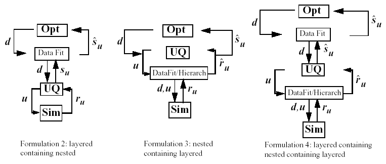

.. _adv_models:

Advanced Model Recursions
=========================

The surrogate and nested model constructs admit a wide variety of
multi-iterator, multi-model solution approaches. For example,
optimization within optimization (for hierarchical multidisciplinary
optimization), uncertainty quantification within uncertainty
quantification (for interval-valued probability, second-order
probability, or Dempster-Shafer approaches to mixed aleatory-epistemic
UQ), uncertainty quantification within optimization (for optimization
under uncertainty), and optimization within uncertainty quantification
(for uncertainty of optima) are all supported, with and without
surrogate model indirection. Three important examples are highlighted:
mixed aleatory-epistemic UQ, optimization under uncertainty, and
surrogate-based UQ.

Starting with Dakota version 6.1, concurrency can now be exploited
across sub-iteration instances. For example, multiple inner loop UQ
assessments can be performed simultaneously within optimization under
uncertainty or mixed aleatory-epistemic UQ studies, provided the outer
loop algorithm supports concurrency in its evaluations. Both
meta-iterators and nested models support ``iterator_servers``,
``processors_per_iterator``, and ``iterator_scheduling`` specifications
which can be used to define a parallel configuration that partitions
servers for supporting sub-iteration concurrency. Refer to
Chapter `[parallel] <#parallel>`__ for additional information on
parallel configurations, and to the Methods and Models chapters of the
Reference Manual for additional information on these specifications.

.. _`adv_models:mixed_uq`:

Mixed Aleatory-Epistemic UQ
---------------------------

Mixed UQ approaches employ nested models to embed one uncertainty
quantification (UQ) within another. The outer level UQ is commonly
linked to epistemic uncertainties (also known as reducible
uncertainties) resulting from a lack of knowledge, and the inner UQ is
commonly linked to aleatory uncertainties (also known as irreducible
uncertainties) that are inherent in nature. The outer level generates
sets of realizations of the epistemic parameters, and each set of these
epistemic parameters in used within a separate inner loop probabilistic
analysis over the aleatory random variables. In this manner, ensembles
of aleatory statistics are generated, one set for each realization of
the epistemic parameters.

In Dakota, we support interval-valued probability (IVP), second-order
probability (SOP), and Dempster-Shafer theory of evidence (DSTE)
approaches to mixed uncertainty. These three approaches differ in how
they treat the epistemic variables in the outer loop: they are treated
as intervals in IVP, as belief structures in DSTE, and as subjective
probability distributions in SOP. This set of techniques provides a
spectrum of assumed epistemic structure, from strongest assumptions in
SOP to weakest in IVP.

.. _`adv_models:mixed_uq:ivp`:

Interval-valued probability (IVP)
~~~~~~~~~~~~~~~~~~~~~~~~~~~~~~~~~

In IVP (also known as probability bounds
analysis, we employ an outer
loop of interval estimation in combination with an aleatory inner loop.
In interval analysis, it is assumed that nothing is known about the
uncertain input variables except that they lie within certain intervals.
The problem of uncertainty propagation then becomes an interval analysis
problem: given inputs that are defined within intervals, what are the
corresponding intervals on the outputs?

Starting from a specification of intervals and probability distributions
on the inputs, the intervals may augment the probability distributions,
insert into the probability distributions, or some combination (refer to
Section `[models:nested] <#models:nested>`__ and to the Models chapter
of the Reference Manual). We generate an
ensemble of cumulative distribution functions (CDF) or Complementary
Cumulative Distribution Functions (CCDF), one CDF/CCDF result for each
aleatory analysis. Plotting an entire ensemble of CDFs or CCDFs in a
“horsetail” plot allows one to visualize the upper and lower bounds on
the family of distributions (see Figure `1.1 <#fig:horsetail>`__).

.. container:: center

   .. figure:: img/horsetail.png
      :alt: Example CDF ensemble. Commonly referred to as a “horsetail” plot.
      :name: fig:horsetail
      :width: 3.5in

      Example CDF ensemble. Commonly referred to as a “horsetail” plot.

Given that the ensemble stems from multiple realizations of the
epistemic uncertainties, the interpretation is that each CDF/CCDF
instance has no relative probability of occurrence, only that each
instance is possible. For prescribed response levels on the CDF/CCDF, an
interval on the probability is computed based on the bounds of the
ensemble at that level, and vice versa for prescribed probability
levels. This interval on a statistic is interpreted simply as a possible
range, where the statistic could take any of the possible values in the
range.

A sample input file is shown in
Figure `[adv_models:2ndprob] <#adv_models:2ndprob>`__, in which the
outer epistemic level variables are defined as intervals. Samples will
be generated from these intervals to select means for :math:`X` and
:math:`Y` that are employed in an inner level reliability analysis of
the cantilever problem (see
Section `[additional:cantilever] <#additional:cantilever>`__).
Figure `[adv_models:2ndprob_res] <#adv_models:2ndprob_res>`__ shows
excerpts from the resulting output. In this particular example, the
outer loop generates 50 possible realizations of epistemic variables,
which are then sent to the inner loop to calculate statistics such as
the mean weight, and cumulative distribution function for the stress and
displacement reliability indices. Thus, the outer loop has 50 possible
values for the mean weight, but since there is no distribution structure
on these observations, only the minimum and maximum value are reported.
Similarly, the minimum and maximum values of the CCDF for the stress and
displacement reliability indices are reported.

When performing a mixed aleatory-epistemic analysis, response levels and
probability levels should only be defined in the (inner) aleatory loop.
For example, if one wants to generate an interval around possible CDFs
or CCDFS, we suggest defining a number of probability levels in the
inner loop (0.1, 0.2, 0.3, etc). For each epistemic instance, these will
be calculated during the inner loop and reported back to the outer loop.
In this way, there will be an ensemble of CDF percentiles (for example)
and one will have interval bounds for each of these percentile levels
defined. Finally, although the epistemic variables are often values
defining distribution parameters for the inner loop, they are not
required to be: they can just be separate uncertain variables in the
problem.

.. code-block::

         Statistics based on 50 samples:

         Min and Max values for each response function:
         mean_wt:  Min = 9.5209117200e+00  Max = 9.5209117200e+00
         ccdf_beta_s:  Min = 1.7627715524e+00  Max = 4.2949468386e+00
         ccdf_beta_d:  Min = 2.0125192955e+00  Max = 3.9385559339e+00

As compared to aleatory quantities of interest (e.g., mean, variance,
probability) that must be integrated over a full probability domain, we
observe that the desired minima and maxima of the output ranges are
local point solutions in the epistemic parameter space, such that we may
employ directed optimization techniques to compute these extrema and
potentially avoid the cost of sampling the full epistemic space.

In , test input files such as and replace the outer loop sampling with
the local and global interval optimization methods described in
Section `[uq:interval] <#uq:interval>`__. In these cases, we no longer
generate horse tails and infer intervals, but rather compute the desired
intervals directly.

.. _`adv_models:mixed_uq:sop`:

Second-order probability (SOP)
~~~~~~~~~~~~~~~~~~~~~~~~~~~~~~

SOP is similar to IVP in its segregation of aleatory and epistemic
uncertainties and its use of nested iteration. However, rather than
modeling epistemic uncertainty with a single interval per variable and
computing interval-valued statistics, we instead employ subjective
probability distributions and compute epistemic statistics on the
aleatory statistics (for example, probabilities on probabilities – the
source of the “second-order” terminology).
Now the different hairs of the horsetail shown in
Figure `1.1 <#fig:horsetail>`__ have a relative probability of
occurrence and stronger inferences may be drawn. In particular, mean,
5\ :math:`^{th}` percentile, and 95\ :math:`^{th}` percentile
probability values are a common example. Second-order probability is
sometimes referred to as probability of frequency (PoF) analysis,
referring to a probabilistic interpretation of the epistemic variables
and a frequency interpretation of the aleatory variables. The PoF
terminology is used in a recent National Academy of Sciences report on
the Quantification of Margins and Uncertainties
(QMU).

Rather than employing interval estimation techniques at the outer loop
in SOP, we instead apply probabilistic methods, potentially the same
ones as used for the aleatory propagation on the inner loop. The
previous example in
Figure `[adv_models:2ndprob] <#adv_models:2ndprob>`__ can be modified to
define the epistemic outer loop using uniform variables instead of
interval variables (annotated test ``#1`` in ). The process of
generating the epistemic values is essentially the same in both cases;
however, the interpretation of results is quite different. In IVP, each
“hair” or individual CDF in the horsetail plot in
Figure `1.1 <#fig:horsetail>`__ would be interpreted as a possible
realization of aleatory uncertainty conditional on a particular
epistemic sample realization. The ensemble then indicates the influence
of the epistemic variables (e.g. by how widespread the ensemble is).
However, if the outer loop variables are defined to be uniformly
distributed in SOP, then the outer loop results will be reported as
statistics (such as mean and standard deviation) and not merely
intervals. It is important to emphasize that these outer level output
statistics are only meaningful to the extent that the outer level input
probability specifications are meaningful (i.e., to the extent that
uniform distributions are believed to be representative of the epistemic
variables).

In , additional test input files such as and explore other outer/inner
loop probabilistic analysis combinations, particulary using stochastic
expansion methods.

.. _`adv_models:mixed_uq:dste`:

Dempster-Shafer Theory of Evidence
~~~~~~~~~~~~~~~~~~~~~~~~~~~~~~~~~~

In IVP, we estimate a single epistemic output interval for each aleatory
statistic. This same nested analysis procedure may be employed within
the cell computations of a DSTE approach. Instead of a single interval,
we now compute multiple output intervals, one for each combination of
the input basic probability assignments, in order to define epistemic
belief and plausibility functions on the aleatory statistics computed in
the inner loop. While this can significantly increase the computational
requirements, belief and plausibility functions provide a more finely
resolved epistemic characterization than a basic output interval.

The single-level DSTE approach for propagating epistemic uncertainties
is described in Section `[uq:dempshaf] <#uq:dempshaf>`__ and in the
Dakota Theory Manual. An example of nested
DSTE for propagating mixed uncertainties can be seen in in the input
file .

.. _`adv_models:ouu`:

Optimization Under Uncertainty (OUU)
------------------------------------

Optimization under uncertainty (OUU) approaches incorporate an
uncertainty quantification method within the optimization process. This
is often needed in engineering design problems when one must include the
effect of input parameter uncertainties on the response functions of
interest. A typical engineering example of OUU would minimize the
probability of failure of a structure for a set of applied loads, where
there is uncertainty in the loads and/or material properties of the
structural components.

In OUU, a nondeterministic method is used to evaluate the effect of
uncertain variable distributions on response functions of interest
(refer to Chapter `[uq] <#uq>`__ for additional information on
nondeterministic analysis). Statistics on these response functions are
then included in the objective and constraint functions of an
optimization process. Different UQ methods can have very different
features from an optimization perspective, leading to the tailoring of
optimization under uncertainty approaches to particular underlying UQ
methodologies.

If the UQ method is sampling based, then three approaches are currently
supported: nested OUU, surrogate-based OUU, and trust-region
surrogate-based OUU. Additional details and computational results are
provided in TODO.

Another class of OUU algorithms is called reliability-based design
optimization (RBDO). RBDO methods are used to perform design
optimization accounting for reliability metrics. The reliability
analysis capabilities described in
Section `[uq:reliability] <#uq:reliability>`__ provide a rich foundation
for exploring a variety of RBDO formulations. TODO
investigated bi-level, fully-analytic bi-level, and first-order
sequential RBDO approaches employing underlying first-order reliability
assessments. TODO investigated fully-analytic
bi-level and second-order sequential RBDO approaches employing
underlying second-order reliability assessments.

When using stochastic expansions for UQ, analytic moments and analytic
design sensitivities can be exploited as described
in TODO. Several approaches for obtaining design
sensitivities of statistical metrics are discussed in
Section `1.2.5 <#adv_models:ouu:sebdo>`__.

Finally, when employing epistemic methods for UQ, the set of statistics
available for use within optimization are interval-based. Robustness
metrics typically involve the width of the intervals, and reliability
metrics typically involve the worst case upper or lower bound of the
interval.

Each of these OUU methods is overviewed in the following sections.

.. _`adv_models:ouu:nested`:

Nested OUU
~~~~~~~~~~

In the case of a nested approach, the optimization loop is the outer
loop which seeks to optimize a nondeterministic quantity (e.g., minimize
probability of failure). The uncertainty quantification (UQ) inner loop
evaluates this nondeterministic quantity (e.g., computes the probability
of failure) for each optimization function evaluation.
Figure `1.2 <#adv_models:figure08>`__ depicts the nested OUU iteration
where :math:`\mathit{\mathbf{d}}` are the design variables,
:math:`\mathit{\mathbf{u}}` are the uncertain variables characterized by
probability distributions, :math:`\mathit{\mathbf{r_{u}(d,u)}}` are the
response functions from the simulation, and
:math:`\mathit{\mathbf{s_{u}(d)}}` are the statistics generated from the
uncertainty quantification on these response functions.

.. figure:: img/nested_ouu.png
   :alt: Formulation 1: Nested OUU.
   :name: adv_models:figure08

   Formulation 1: Nested OUU.

Figure `[adv_models:figure09] <#adv_models:figure09>`__ shows a Dakota
input file for a nested OUU example problem that is based on the
textbook test problem. In this example, the objective function contains
two probability of failure estimates, and an inequality constraint
contains another probability of failure estimate. For this example,
failure is defined to occur when one of the textbook response functions
exceeds its threshold value. The environment keyword block at the top of
the input file identifies this as an OUU problem. The environment
keyword block is followed by the optimization specification, consisting
of the optimization method, the continuous design variables, and the
response quantities that will be used by the optimizer. The mapping
matrices used for incorporating UQ statistics into the optimization
response data are described in the Dakota Reference
Manual. The uncertainty quantification
specification includes the UQ method, the uncertain variable probability
distributions, the interface to the simulation code, and the UQ response
attributes. As with other complex Dakota input files, the identification
tags given in each keyword block can be used to follow the relationships
among the different keyword blocks.

Latin hypercube sampling is used as the UQ method in this example
problem. Thus, each evaluation of the response functions by the
optimizer entails 50 Latin hypercube samples. In general, nested OUU
studies can easily generate several thousand function evaluations and
gradient-based optimizers may not perform well due to noisy or
insensitive statistics resulting from under-resolved sampling. These
observations motivate the use of surrogate-based approaches to OUU.

Other nested OUU examples in the directory include , which adds an
additional interface for including deterministic data in the textbook
OUU problem, and , which solves the cantilever OUU problem (see
Section `[additional:cantilever] <#additional:cantilever>`__) with a
nested approach. For each of these files, the “``1``” identifies
formulation 1, which is short-hand for the nested approach.

.. _`adv_models:ouu:sb`:

Surrogate-Based OUU (SBOUU)
~~~~~~~~~~~~~~~~~~~~~~~~~~~

Surrogate-based optimization under uncertainty strategies can be
effective in reducing the expense of OUU studies. Possible formulations
include use of a surrogate model at the optimization level, at the
uncertainty quantification level, or at both levels. These surrogate
models encompass both data fit surrogates (at the optimization or UQ
level) and model hierarchy surrogates (at the UQ level only).
Figure `1.3 <#adv_models:figure10>`__ depicts the different
surrogate-based formulations where :math:`\mathbf{\hat{r}_{u}}` and
:math:`\mathbf{\hat{s}_{u}}` are approximate response functions and
approximate response statistics, respectively, generated from the
surrogate models.

   Formulations 2, 3, and 4 for Surrogate-based OUU.

SBOUU examples in the directory include , , and , which solve the
textbook OUU problem, and , , and , which solve the cantilever OUU
problem (see
Section `[additional:cantilever] <#additional:cantilever>`__). For each
of these files, the “``2``,” “``3``,” and “``4``” identify formulations
2, 3, and 4, which are short-hand for the “layered containing nested,”
“nested containing layered,” and “layered containing nested containing
layered” surrogate-based formulations, respectively. In general, the use
of surrogates greatly reduces the computational expense of these OUU
study. However, without restricting and verifying the steps in the
approximate optimization cycles, weaknesses in the data fits can be
exploited and poor solutions may be obtained. The need to maintain
accuracy of results leads to the use of trust-region surrogate-based
approaches.

.. _`adv_models:ouu:trsb`:

Trust-Region Surrogate-Based OUU (TR-SBOUU)
~~~~~~~~~~~~~~~~~~~~~~~~~~~~~~~~~~~~~~~~~~~

The TR-SBOUU approach applies the trust region logic of deterministic
SBO (see Section `[adv_meth:sbm:sblm] <#adv_meth:sbm:sblm>`__) to SBOUU.
Trust-region verifications are applicable when surrogates are used at
the optimization level, i.e., formulations 2 and 4. As a result of
periodic verifications and surrogate rebuilds, these techniques are more
expensive than SBOUU; however they are more reliable in that they
maintain the accuracy of results. Relative to nested OUU (formulation
1), TR-SBOUU tends to be less expensive and less sensitive to initial
seed and starting point.

TR-SBOUU examples in the directory include and , which solve the
textbook OUU problem, and and , which solve the cantilever OUU problem
(see Section `[additional:cantilever] <#additional:cantilever>`__).

Computational results for several example problems are available
in TODO.

.. _`adv_models:ouu:rbdo`:

RBDO
~~~~

Bi-level and sequential approaches to reliability-based design
optimization (RBDO) and their associated sensitivity analysis
requirements are described in the Optimization Under Uncertainty chapter
of the Dakota Theory Manual.

A number of bi-level RBDO examples are provided in . The , , and input
files solve the cantilever (see
Section `[additional:cantilever] <#additional:cantilever>`__), short
column (see
Section `[additional:short_column] <#additional:short_column>`__), and
steel column (see
Section `[additional:steel_column] <#additional:steel_column>`__) OUU
problems using a bi-level RBDO approach employing numerical design
gradients. The and input files solve the cantilever and short column OUU
problems using a bi-level RBDO approach with analytic design gradients
and first-order limit state approximations. The , , and input files also
employ analytic design gradients, but are extended to employ
second-order limit state approximations and integrations.

Sequential RBDO examples are also provided in . The and input files
solve the cantilever and short column OUU problems using a first-order
sequential RBDO approach with analytic design gradients and first-order
limit state approximations. The , , and input files utilize second-order
sequential RBDO approaches that employ second-order limit state
approximations and integrations (from analytic limit state Hessians with
respect to the uncertain variables) and quasi-Newton approximations to
the reliability metric Hessians with respect to design variables.

.. _`adv_models:ouu:sebdo`:

Stochastic Expansion-Based Design Optimization
~~~~~~~~~~~~~~~~~~~~~~~~~~~~~~~~~~~~~~~~~~~~~~

For stochastic expansion-based approaches to optimization under
uncertainty, bi-level, sequential, and multifidelity approaches and
their associated sensitivity analysis requirements are described in the
Optimization Under Uncertainty chapter of the Dakota Theory
Manual.

In , the , , , and input files solve cantilever (see
Section `[additional:cantilever] <#additional:cantilever>`__),
Rosenbrock, short column (see
Section `[additional:short_column] <#additional:short_column>`__), and
steel column (see
Section `[additional:steel_column] <#additional:steel_column>`__) OUU
problems using a bi-level polynomial chaos-based approach, where the
statistical design metrics are reliability indices based on moment
projection (see Mean Value section in Reliability Methods Chapter of
Dakota Theory Manual). The test matrix in
the former three input files evaluate design gradients of these
reliability indices using several different approaches: analytic design
gradients based on a PCE formed over only over the random variables,
analytic design gradients based on a PCE formed over all variables,
numerical design gradients based on a PCE formed only over the random
variables, and numerical design gradients based on a PCE formed over all
variables. In the cases where the expansion is formed over all
variables, only a single PCE construction is required for the complete
PCBDO process, whereas the expansions only over the random variables
must be recomputed for each change in design variables. Sensitivities
for “augmented” design variables (which are separate from and augment
the random variables) may be handled using either analytic approach;
however, sensitivities for “inserted” design variables (which define
distribution parameters for the random variables) must be computed using
:math:`\frac{dR}{dx} \frac{dx}{ds}` (refer to Stochastic Sensitivity
Analysis section in Optimization Under Uncertainty chapter of Dakota
Theory Manual). Additional test input files include:

-  , , , and input files solve cantilever, Rosenbrock, short column, and
   steel column OUU problems using a bi-level stochastic
   collocation-based approach.

-  , , , , , , , and input files solve cantilever, Rosenbrock, short
   column, and steel column OUU problems using sequential polynomial
   chaos-based and stochastic collocation-based approaches.

-  , , , , , and input files solve cantilever, Rosenbrock, and short
   column OUU problems using multifidelity polynomial chaos-based and
   stochastic collocation-based approaches.

.. _`adv_models:ouu:epistemic`:

Epistemic OUU
~~~~~~~~~~~~~

An emerging capability is optimization under epistemic uncertainty. As
described in the Nested Model section of the Reference
Manual, epistemic and mixed
aleatory/epistemic uncertainty quantification methods generate lower and
upper interval bounds for all requested response, probability,
reliability, and generalized reliability level mappings. Design for
robustness in the presence of epistemic uncertainty could simply involve
minimizing the range of these intervals (subtracting lower from upper
using the nested model response mappings), and design for reliability in
the presence of epistemic uncertainty could involve controlling the
worst case upper or lower bound of the interval.

We now have the capability to perform epistemic analysis by using
interval optimization on the “outer loop” to calculate bounding
statistics of the aleatory uncertainty on the “inner loop.” Preliminary
studies have shown this approach is more
efficient and accurate than nested sampling (which was described in
Section `1.1.2 <#adv_models:mixed_uq:sop>`__). This approach uses an
efficient global optimization method for the outer loop and stochastic
expansion methods (e.g. polynomial chaos or stochastic collocation on
the inner loop). The interval optimization is described in
Section `[uq:interval] <#uq:interval>`__. Example input files
demonstrating the use of interval estimation for epistemic analysis,
specifically in epistemic-aleatory nesting, are: , and . Both files are
in .

.. _`adv_models:sbuq`:

Surrogate-Based Uncertainty Quantification
------------------------------------------

Many uncertainty quantification (UQ) methods are computationally costly.
For example, sampling often requires many function evaluations to obtain
accurate estimates of moments or percentile values of an output
distribution. One approach to overcome the computational cost of
sampling is to evaluate the true function (e.g. run the analysis driver)
on a fixed, small set of samples, use these sample evaluations to create
a response surface approximation (e.g. a surrogate model or meta-model)
of the underlying “true” function, then perform random sampling (using
thousands or millions of samples) on the approximation to obtain
estimates of the mean, variance, and percentiles of the response.

This approach, called “surrogate-based uncertainty quantification” is
easy to do in Dakota, and one can set up input files to compare the
results using no approximation (e.g. determine the mean, variance, and
percentiles of the output directly based on the initial sample values)
with the results obtained by sampling a variety of surrogate
approximations. Example input files of a standard UQ analysis based on
sampling alone vs. sampling a surrogate are shown in the and in the
directory.

Note that one must exercise some caution when using surrogate-based
methods for uncertainty quantification. In general, there is not a
single, straightforward approach to incorporate the error of the
surrogate fit into the uncertainty estimates of the output produced by
sampling the surrogate. Two references which discuss some of the related
issues are TODO and TODO. The
first reference shows that statistics of a response based on a surrogate
model were less accurate, and sometimes biased, for surrogates
constructed on very small sample sizes. In many cases,
however, TODO shows that surrogate-based UQ
performs well and sometimes generates more accurate estimates of
statistical quantities on the output. The second reference goes into
more detail about the interaction between sample type and response
surface type (e.g., are some response surfaces more accurate when
constructed on a particular sample type such as LHS vs. an orthogonal
array?) In general, there is not a strong dependence of the surrogate
performance with respect to sample type, but some sample types perform
better with respect to some metrics and not others (for example, a
Hammersley sample may do well at lowering root mean square error of the
surrogate fit but perform poorly at lowering the maximum absolute
deviation of the error). Much of this work is empirical and application
dependent. If you choose to use surrogates in uncertainty
quantification, we strongly recommend trying a variety of surrogates and
examining diagnostic goodness-of-fit metrics.

*Known Issue: When using discrete variables, there have been sometimes
significant differences in data fit surrogate behavior observed across
computing platforms in some cases. The cause has not yet been fully
diagnosed and is currently under investigation. In addition, guidance on
appropriate construction and use of surrogates with discrete variables
is under development. In the meantime, users should therefore be aware
that there is a risk of inaccurate results when using surrogates with
discrete variables.*
