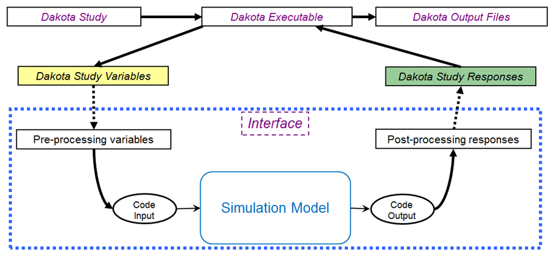

Coupling Dakota to a Simulation
============

```{eval-rst}
.. _couplingtosimulations:
```

A key Dakota advantage is access to a broad range of iterative capabilities through a single, relatively simple, interface
between Dakota and your simulator. Trying a different iterative method or meta-algorithm typically requires changing only
a few commands in the Dakota text input file and starting the new analysis. It does not require intimate knowledge of the
underlying software package integrated in Dakota, with its unique command syntax and interfacing requirements. In addition,
Dakota will manage concurrent executions of your computational model in parallel, whether on a desktop or high-performance
cluster computer.

|  |
| --- |
| The loosely-coupled or 'black-box' interface between Dakota and a user-supplied simulation code. |

Figure 1.1 depicts a typical loosely-coupled relationship between Dakota and the simulation code(s). Such coupling is often
referred to as “black-box,” as Dakota has no (or little) awareness of the internal details of the computational model, obviating
any need for its source code. Such loose coupling is the simplest and most common interfacing approach Dakota users employ.
Dakota and the simulation code exchange data by reading and writing short data files. Dakota is executed with commands
that the user supplies in a text input file (not shown in Figure 1.1) which specify the type of analysis to be performed (e.g.,
parameter study, optimization, uncertainty quantification, etc.), along with the file names associated with the user’s simulation
code. During operation, Dakota automatically executes the user’s simulation code by creating a separate process external to
Dakota.

The solid lines in Figure 1.1 denote file input/output (I/O) operations inherent to Dakota or the user’s simulation code. The
dotted lines indicate passing or converting information that must be implemented by the user. As Dakota runs, it writes out a
parameters file containing the current variable values. Dakota then starts the user’s simulation code (or, often, a short driver
script wrapping it), and when the simulation completes, reads the response data from a results file. This process is repeated
until all of the simulations required by the iterative study are complete.

In some cases it is advantageous to have a close coupling between Dakota and the simulation code. This close coupling is an
advanced feature of Dakota and is accomplished through either a direct interface or a SAND (simultaneous analysis and design)
interface. For the direct interface, the user’s simulation code is modified to behave as a function or subroutine under Dakota.
This interface can be considered to be “semi-intrusive” in that it requires relatively minor modifications to the simulation code.
Its major advantage is the elimination of the overhead resulting from file I/O and process creation. It can also be a useful
tool for parallel processing, by encapsulating all computation in a single executable.

For details on direct interfacing, see Section 16.2.

A SAND interface approach is “fully intrusive” in that it requires further modifications to the simulation code so
that an optimizer has access to the internal residual vector and Jacobian matrices computed by the simulation code. In a SAND
approach, both the optimization method and a nonlinear simulation code are converged simultaneously. While this approach
can greatly reduce the computational expense of optimization, considerable software development effort must be expended to
achieve this intrusive coupling between SAND optimization methods and the simulation code. SAND may be supported in
future Dakota releases.

## Coupling Example 1

Many of the previous examples made use of the direct interface to access the Rosenbrock and textbook test functions that
are compiled into Dakota. In engineering applications, it is much more common to use the fork interface approach within
Dakota to manage external simulation codes. In both of these cases, the communication between Dakota and the external
code is conducted through the reading and writing of short text files. For this example, the C++ program rosenbrock.cpp
in dakota_source/test is used as the simulation code. This file is compiled to create the stand-alone rosenbrock
executable that is referenced as the analysis driver in Figure 2.12. This stand-alone program performs the same function
evaluations as Dakota’s internal Rosenbrock test function.

```
# Dakota Input File: rosen_syscall.in
# Usage:
# dakota -i rosen_syscall.in -o rosen_syscall.out > rosen_syscall.stdout

environment
  tabular_data
    tabular_data_file = ’rosen_syscall.dat’
	
method
  conmin_frcg
    convergence_tolerance = 1e-4
    max_iterations = 100
	
model
  single
  
variables
  continuous_design = 2
  initial_point -1.2 1.0
  lower_bounds -2.0 -2.0
  upper_bounds 2.0 2.0
  descriptors ’x1’ "x2"
  
interface
  analysis_drivers = ’rosenbrock’
    fork
    parameters_file = ’params.in’
    results_file    = ’results.out’

responses
  objective_functions = 1
  numerical_gradients
    method_source dakota
    interval_type forward
  fd_step_size = 1.e-5
  no_hessians
```

Figure 2.12 shows the text of the Dakota input file named rosen_syscall.in that is provided in the directory dakota/
share/dakota/examples/users. The only differences between this input file and the one in Figure 2.7 occur in the
interface keyword section. The keyword fork indicates that Dakota will use fork calls to create separate Unix processes for
executions of the user-supplied simulation code. The name of the simulation code, and the names for Dakota’s parameters and
results file are specified using the analysis driver, parameters file, and results file keywords, respectively.
The Dakota command is noted in the file, and copies of the outputs are in the dakota/share/dakota/examples/
users directory, with .sav appended to the name.

This run of Dakota takes longer to complete than the previous gradient-based optimization example since the fork interface
method has additional process creation and file I/O overhead, as compared to the internal communication that occurs when the
direct interface method is used.

To gain a better understanding of what exactly Dakota is doing with the fork interface approach, add the keywords file tag
and file save to the interface specification and re-run Dakota. Check the listing of the local directory and you will see
many new files with names such as params.in.1, params.in.2, etc., and results.out.1, results.out.2, etc.
There is one params.in.X file and one results.out.X file for each of the function evaluations performed by Dakota.
This is the file listing for params.in.1:

```
                                          2 variables
                     -1.200000000000000e+00 x1
                      1.000000000000000e+00 x2
                                          1 functions
                                          1 ASV_1:obj_fn
                                          2 derivative_variables
                                          1 DVV_1:x1
                                          2 DVV_2:x2
                                          0 analysis_components
```

The basic pattern is that of array lengths and string identifiers followed by listings of the array entries, where the arrays consist
of the variables, the active set vector (ASV), the derivative values vector (DVV), and the analysis components (AC). For the
variables array, the first line gives the total number of variables (2) and the “variables” string identifier, and the subsequent
two lines provide the array listing for the two variable values (-1.2 and 1.0) and descriptor tags (“x1” and “x2” from the
Dakota input file). The next array conveys the ASV, which indicates what simulator outputs are needed. The first line of
the array gives the total number of response functions (1) and the “functions” string identifier, followed by one ASV code
and descriptor tag (“ASV 1”) for each function. In this case, the ASV value of 1 indicates that Dakota is requesting that the
simulation code return the response function value in the file results.out.X. (Possible ASV values: 1 = value of response
function value, 2 = response function gradient, 4 = response function Hessian, and any sum of these for combinations up to 7
= response function value, gradient, and Hessian; see 9.7 for more detail.) The next array provides the DVV, which defines
the variable identifiers used in computing derivatives. The first line of the array gives the number of derivative variables (2)
and the “derivative variables” string identifier, followed by the listing of the two DVV variable identifiers (the first and second
variables) and descriptor tags (“DVV 1” and “DVV 2”). The final array provides the AC array used to provide additional
strings for use by the simulator (e.g., to provide the name of a particular mesh file). The first line of the array gives the total
number of analysis components (0) and the “analysis components” string identifier, followed by the listing of the array, which
is empty in this case.

The executable program rosenbrock reads in the params.in.X file and evaluates the objective function at the given values
for x1 and x2. Then, rosenbrock writes out the objective function data to the results.out.X file. Here is the listing for
the file results.out.1:

```
2.420000000000000e+01 f
```

The value shown above is the value of the objective function, and the descriptor ‘f’ is an optional tag returned by the simulation
code. When the fork call has completed, Dakota reads in the data from the results.in.X file and processes the results.
Dakota then continues with additional executions of the rosenbrock program until the optimization process is complete.

## Coupling Example 2

In many situations the user-supplied simulation code cannot be modified to read and write the params.in.X file and the
results.out.X file, as described above. Typically, this occurs when the simulation code is a commercial or proprietary
software product that has specific input file and output file formats. In such cases, it is common to replace the executable
program name in the Dakota input file with the name of a Unix shell script containing a sequence of commands that read and
write the necessary files and run the simulation code. For example, the executable program named rosenbrock listed in
Figure 2.12 could be replaced by a Unix Bourne or C-shell script named simulator_script, with the script containing a
sequence of commands to perform the following steps: insert the data from the parameters.in.X file into the input file of
the simulation code, execute the simulation code, post-process the files generated by the simulation code to compute response
data, and return the response data to Dakota in the results.out.X file. The steps that are typically used in constructing
and using a Unix shell script are described in Section 10.3.