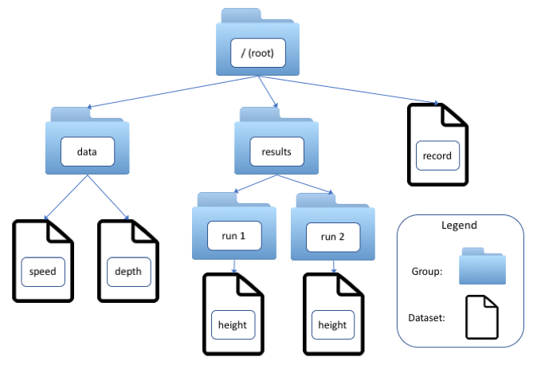

"""""""""""
HDF5 Output
"""""""""""

Beginning with release 6.9, Dakota gained the ability to write many method results such as the correlation matrices computed by sampling studies and the best parameters discovered by optimization methods to disk in HDF5. In Dakota 6.10 and above, evaluation data (variables and responses for each model or interface evaluation) may also be written. Many users may find this newly supported format more convenient than scraping or copying and pasting from Dakota's console output.

To enable HDF5 output, the results_output keyword with the hdf5 option must be added to the Dakota input file. In additon, Dakota must have been built with HDF5 support. Beginning with Dakota 6.10, HDF5 is enabled in our publicly available downloads. HDF5 support is considered a somewhat experimental feature. The results of some Dakota methods are not yet written to HDF5, and in a few, limited situations, enabling HDF5 will cause Dakota to crash.

=============
HDF5 Concepts
=============

HDF5 is a format that is widely used in scientific software for efficiently storing and organizing data. The HDF5 standard and libraries are maintained by the HDF Group.

In HDF5, data are stored in multidimensional arrays called datasets. Datasets are organized hierarchically in groups, which also can contain other groups. Datasets and groups are conceptually similar to files and directories in a filesystem. In fact, every HDF5 file contains at least one group, the root group, denoted "/", and groups and datasets are referred to using slash-delimited absolute or relative paths, which are more accurately called link names.

HDF5 has as one goal that data be "self-documenting" through the use of metadata. Dakota output files include two kinds of metadata.

- Dimension Scales. Each dimension of a dataset may have zero or more scales, which are themselves datasets. Scales are often used to provide, for example, labels analogous to column headings in a table (see the dimension scales that Dakota applies to moments) or numerical values of an indepenent variable (user-specified probability levels in level mappings).
- Attributes. key:value pairs that annotate a group or dataset. A key is always a character string, such as dakota_version, and (in Dakota output) the value can be a string-, integer-, or real-valued scalar. Dakota stores the number of samples that were requested in a sampling study in the attribute 'samples'.

=================
Accessing Results
=================

Many popular programming languages have support, either natively or from a third-party library, for reading and writing HDF5 files. The HDF Group itself supports C/C++ and Java libraries. The Dakota Project suggests the h5py module for Python. Examples that demonstrate using h5py to access and use Dakota HDF5 output may be found in the Dakota installation at dakota/share/dakota/examples/official/hdf5.

=======================
Organization of Results
=======================

Currently, complete or nearly complete coverage of results from sampling, optimization and calibration methods, parameter studies, and stochastic expansions exists. Coverage will continue to expand in future releases to include not only the results of all methods, but other potentially useful information such as interface evaluations and model tranformations.

Methods in Dakota have a character string Id and are executed by Dakota one or more times. (Methods are executed more than once in studies that include a nested model, for example.) The Id may be provided by the user in the input file using the id_method keyword, or it may be automatically generated by Dakota. Dakota uses the label NO_METHOD_ID for methods that are specified in the input file without an id_method, and NOSPEC_METHOD_ID_<N> for methods that it generates for its own internal use. The <N> in the latter case is an incrementing integer that begins at 1.

The results for the <N>th execution of a method that has the label <method Id> are stored in the group 