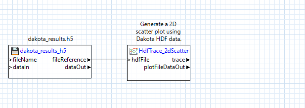

```{eval-rst}
.. _chartreuse-ngw-main:
```

Chartreuse in Next-Gen Workflow
===============================

## Introduction

Chartreuse offers robust support for [Next-Gen Workflow](NextGenWorkflow.html), a node-based workflow creation tool included with Dakota GUI.  Depending on what you want to do, there are a number of different Chartreuse nodes that you have at your disposal.  These nodes range from simple plots based on inputted arrays of numbers, to more sophisticated "composite plotters" that generate sets of plots using complex data sources (such as a Dakota HDF5 output file).

## Get Help for an Individual Node

The configuration options for each node vary significantly.  To learn more about the specific fields, input ports, and output ports of each plotting node, open the node in the Settings editor view and click on the small "?" button to the right of the Settings editor banner.


## "Data Visualization (Chartreuse)" Category

")

The nodes in the "Data Visualization (Chartreuse)" folder are useful for creating basic Chartreuse plots using arbitrary arrays of numbers, as well as performing combinations of plot traces and plot canvases.

### Tutorial: Single Plot Trace

Assume that we already have a Dakota tabular data file to use as our data source.  Beginning with a blank workflow, drag your tabular output file from the Project Explorer view onto the workflow canvas.


Next, drag two "column" nodes from the Arrays folder of the Palette view onto the workflow canvas.  Column nodes can extract single columns from tabular data files.


Configure each column node to pull a different column from the tabular data file.  Note that the "columnIndex" property field assumes a one-based column index, not a zero-based column index.  Also, for Dakota tabular data files, you should specify a value of "1" for the "headerLines" property (that is, disregard the first row of the tabular data file, since it represents column labels).

Then, draw two connector lines from the file node's "dataOut" port to both column nodes' "stdin" ports.


Now, open the Chartreuse folder in the Palette and drag "traceScatterPlot2d" onto the canvas.  Note that it has two input ports – "X" and "Y."  We will drag connectors from our two column nodes' "stdout" ports to these two input ports.


If you open the Settings editor view for the traceScatterPlot2d, you will notice that many of the [same configuration settings for 2D scatter plots](#plot-trace-scatter-2d) that were available in the [Plot Trace Creator](#plot-trace-basic) dialog are available here as well:


Finally, we need to send our plot to a file to be able to view it.  Drag a "file" node from the "File Operations" folder onto the canvas, and connect the plotFileDataOut port of our 2D scatter plot node to the "dataIn" port of the file node.  Don't forget to provide a name for your plot file in the "fileName" field of your file node.


Let's go ahead and try running this workflow.  Assuming that it is successful, a new .plot file should be added to your workflow's run directory.  You can double-click the .plot file to view the result:


### Tutorial: Multiple Plot Traces

Let's make this plot more interesting and add another trace to the same canvas.

* Add another column node to this workflow.  Configure it to extract a different column from our tabular data file.  Don't forget to set headerLines to 1 to omit the first row.
* Connect the tabular data file node's dataOut port to this new column node's stdin port.
* You may want to consider using each column node's label field to keep the column nodes straight.
* Add a second traceScatterPlot2d node.  Set its Trace Color property to something other than black.
* Wire the column output ports as appropriate.  In our example, the first two columns represent two variables, and the third column represents a response, so we send the response column data to both scatter plot nodes, but each variable only goes to one of the scatter plot nodes.


We need to combine the two plot traces onto one canvas so that they can be displayed together, so use a plotCanvas node from the Chartreuse folder.  A plotCanvas node is somewhat unique in that it does not have any input ports by default, but we can create our own.  Create two new input ports for this node (call them trace1 and trace2), and draw connector lines from our two trace nodes' trace output ports to the two input ports you just created:


Don't forget to add a file node at the end to save our plot to a Chartreuse .plot file, like we did before:


Now try running this workflow.  We should get a plot where two traces are overlaid on each other on the same canvas:


### Tutorial: Multiple Plot Canvases

Now let's try separating these two plot traces onto their own canvases.  Because we will be dealing with multiple canvases (and therefore multiple plotCanvas nodes) we will need a new type of node to aggregate canvases together – the plotWindow node.

* Add a new plotCanvas node and a new plotWindow node to your workflow.
* Pipe the second traceScatterPlot2d node's trace output port to the new plotCanvas node.
* Delete the second traceScatterPlot2d node's original pipe to the first plotCanvas node, and make sure to delete the first plotCanvas node's second input port.
* Then, on the new plotWindow node, add two custom input ports (for instance, "canvas1" and "canvas2") and pipe your two canvas output ports to these two input ports.
* Also, make sure to set the plotWindow node's "Column count" field to "2" – this will ensure that the two canvases are stacked horizontally next to each other.  If you wanted to stack the two canvases vertically, you would set the "Column count" field to 1 (that is, if you think about the canvases being on a grid, there would only be one column of canvases, so when the second canvas needs to be placed, it will move down to the next row).
* Keep the file node at the end as the final destination for our plot data.

When you're done, your workflow should look something like this:


Running the workflow should produce the following:


## "Data Visualization (Dakota/Chartreuse Simple Plots)" Category

In the "Data Visualization (Dakota/Chartreuse Simple Plots)" folder, a library of simple plotting nodes are available.


Note that many of these plot nodes' names are prefixed by "hdf".  *Most nodes in this folder require a Dakota-generated HDF5 database file to work properly.*

The Dakota/Chartreuse/HDF5 plotting nodes provide a usability advantage over the old-school approach of [extracting tabular columns one at a time](#plotting-using-the-workflow-engine).  If you drag one of these plot nodes onto the workflow canvas, note that only one input port is provided - "hdfFile."  Having one input port that manages everything leads to much simpler-looking workflows.  For example:


These HDF5-based plotting nodes can produce much more sophisticated plots that simply weren't possible with the column-extracting approach.

### Tutorial: Create a Scatter Plot Using an HDF5 Database File

```{eval-rst}
.. _chartreuse-ngw-hdf-tutorial:
```

Let's try creating a scatter plot using the hdfTraceScatterPlot2d node, instead of the classic traceScatterPlot2d node.

Begin by dragging your .h5 file containing Dakota-generated results onto a blank workflow canvas:


Next, drag an hdfTraceScatterPlot2d node onto the canvas, and connect the "fileReference" output port of the h5 file node to the "hdfFile" input port of the hdfTraceScatterPlot2d node:



Note that HDF5-based plotting nodes don't "just work", and need some additional configuration.  For example, this scatter plot node needs to be told which datasets to extract for the X and Y data of the scatter plot.  With the hdfTraceScatterPlot2d node selected, you can update its configuration in the Settings editor:


At minimum, you must specify the Dakota variable/response names in the "xLabel" and "yLabel" fields.  For more complex Dakota studies with multiple models, you may also need to provide the label of the model in the "model" field, but this can be left blank for simple Dakota studies.

Finally, add a file node to the canvas, and connect the "plotFileDataOut" output port of our scatter plot node to the "dataIn" input port of the file node.  Don't forget to specify a name for the file!


### Visualizing Dakota's Uncertainty Variables Using Next-Gen Workflow

In addition to HDF5-based plotting nodes, the "Data Visualization (Dakota/Chartreuse Simple Plots)" folder contains a node for visualizing the probability density functions of certain Dakota variable types.  This topic is covered in more detail [here](ChartreuseSandbox.html#sending-data).


To use this node, simply provide the Dakota input file as a "file" node on the canvas, and pipe its "fileReference" output port to the "inFile" input port of this node.  In addition, provide the descriptor of the variable you want to visualize in this node's Settings Editor.

Note that this node has the familiar "plotFileDataOut" and "trace" output ports seen on other Chartreuse nodes.  This means that Dakota variable PDF curve plots can be combined with other types of Chartreuse plotting nodes (for example, [aggregating traces onto the same canvas](#multiple-traces)).

## "Data Visualization (Dakota/Chartreuse Composite Plots)" Category

```{eval-rst}
.. _chartreuse-ngw-composite-plotters:
```

There is another set of plotting nodes available in the "Data Visualization (Dakota/Chartreuse Composite Plots)" folder:


These nodes behave somewhat differently than other Chartreuse plotting nodes:

* Whereas all other Chartreuse plot nodes require you to manage the created plot data (usually by piping the created plot to a "file" node as the final destination), these nodes generate a multitude of plots when they are executed.  As such, they manage their own file creation process.
* These nodes are also specific to Dakota-generated HDF5 files, and will not work with general HDF5 files, or with other types of Dakota output files.
* Composite plotters are context-sensitive to the type of Dakota study that was run.  For example, the "incrementalLHS" node will not arbitrarily work with all types of Dakota HDF5 files, especially if the datasets unique to LHS studies are not present in the HDF5 file.  [Refer to a specific composite plotter node's documentation for more information on the restrictions for using it.](#ngw-node-help)

### Tutorial:  Using the responseCompare node

Let's try using the responseCompare node.  This node will compare the variability of Dakota's input variables against each of Dakota's output responses, using one generated canvas per response.  It is similar to the [Chartreuse Plotting Template for centered parameter studies, seen outside of Next-Gen Workflow](Chartreuse.html##plotting-template-cps).

To use this node, we must begin with a Dakota-generated HDF5 file that represents a parameter sweep study.  That is, one of the following Dakota methods must have been used to generate the HDF5 file: centered\_parameter\_study, list\_parameter\_study, multidim\_parameter\_study, or vector\_parameter\_study.

Converse to the strict upfront requirements for using a composite plotter, the workflow to build is trivial.  Simply drag the Dakota-generated HDF5 file onto the canvas as a "file" node, then drag a "responseCompare" node onto the canvas, and connect the "fileReference" output port of the file node to the "hdfFile" input port of the responseCompare node.


Note that there is no need to configure the responseCompare node before running (although there are a number of useful configuration options available for each composite plotter node).  The composite plotter node will automatically iterate through your HDF5 file and produce the appropriate number of plots to represent your Dakota study data.

Running this workflow will generate a number of .plot files in your workflow's run directory - one .plot file per response.


Open one of these .plot files to view a strip of plot canvases displaying the explored variable values for that response.  There will be one canvas per Dakota variable.


## Recommended Reading<a name="recommended-reading"></a>

* For more traditional Chartreuse plotting options, [see the main Chartreuse documentation page](Chartreuse.html).
* For fast plotting outside of Next-Gen Workflow, [see the documentation page for Chartreuse's Sandbox View](ChartreuseSandbox.html).