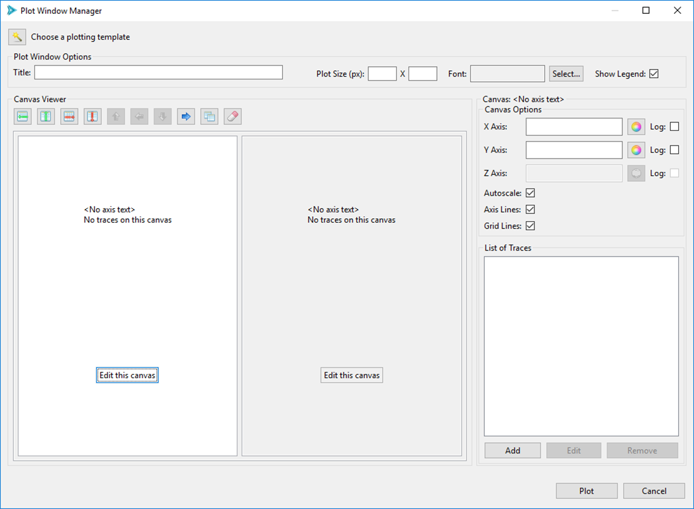
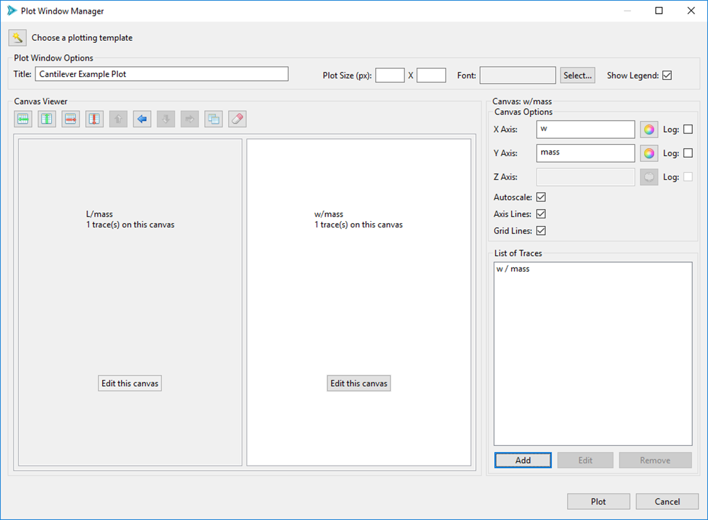
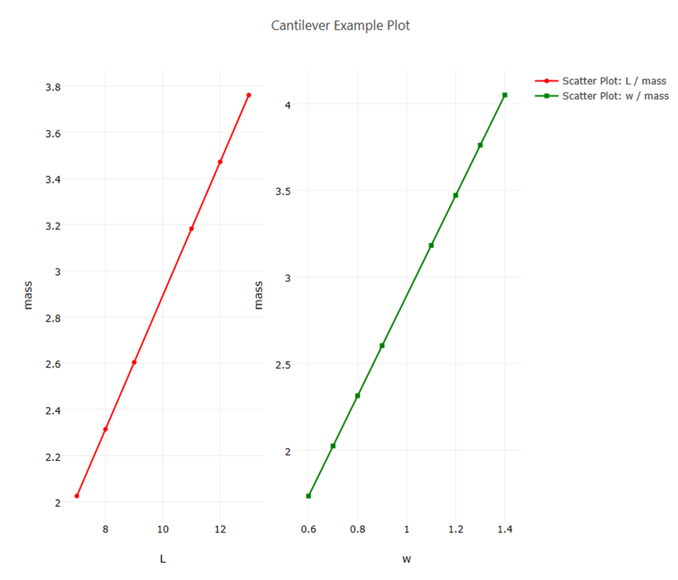

Plot Manager:  Managing Multiple Traces and Canvases
====================================================

The Plot Manager dialog is the big brother to the Plot Trace Creator covered in the previous section.  The Plot Manager allows you to specify multiple canvases with multiple traces.  You can get extremely sophisticated with this dialog, so there are a lot of options to cover.

*Note:* This section uses a centered parameter study of the classic Dakota "cantilever beam" example to demonstrate usage of the Plot Manager Dialog. 

To open the Plot Manager dialog, either...

* Right-click on a file with plottable data and select "Chartreuse > New plot from this file."
* Right-click on an existing Chartreuse .plot file and select "Chartreuse > Edit plot."
* Click on the Edit button (i.e. the pencil icon) from a Chartreuse plot already open in the editor area.

Upon launching, this is what the Plot Manager looks like by default:

* **Choose a plotting template**  This option allows you to populate the entire Plot Manager dialog with a chosen [plotting template](#plotting-template-basics).
* **Title** The title for your plot.
* **Plot Size** The plot size in pixels.  Leave this blank to let the plot fill the available space in the editor area.
* **Font** The font for your plot.
* **Show Legend** Display a legend for every trace plotted.

Let's say we're studying the cantilever beam example, and we want to try plotting L/mass and w/mass on two separate canvases oriented horizontally.  Note the two highlighted buttons in the Canvas Viewer section - "Add Row" and "Add Column."

Click "Add Column" twice.

In the middle of this dialog, we now have a rough preview of how our canvases will look once rendered – i.e. we have two boxes that are displayed side-by-side.  We can edit what will go onto each canvas by pushing the respective “Edit this canvas” button.  

Click on the "Edit this canvas" button inside of the left canvas.  This puts the leftmost canvas into "focus" and activates several canvas-specific controls, as you can see here:

Along the top of the Canvas Viewer, some of the buttons have been activated...

* **Delete Row** This deletes the row that the current canvas is in.  At the moment, this would have the effect of deleting both canvases, because we only have one row.
* **Delete Column** This deletes the column that the current canvas is in.  At the moment, this would have the effect of only deleting the leftmost canvas.
* **Move Right** The blue arrow button will cause the selected canvas to shift to the right.  Since there are only two canvases, this has the effect of causing our two canvases to swap places. The other blue arrow buttons perform similar functionality, depending on which canvas is in focus and the overall layout of your canvases.
* **Overlay Canvas** Overlaying canvases is a feature that is generally not required except in very specific cases.  In some situations, a user may want to have several canvases with differing axis scales placed on top of each other, rather than placing a number of traces on the same canvas, which forces all those traces to adhere to one canvas scale.  A good example of this can be seen in the [Iteration History plotting template](#plotting-template-iterhistory).
* **Clear Canvas** This button will clear any data off the selected canvas, including traces and canvas properties.

In the Canvas group on the right, we have...

* **X Axis** Label for the canvas' X axis.  Note that we can also configure the color of the axis, and specify whether or not this axis uses a log scale.
* **Y Axis** Label for the canvas' Y axis.  Note that we can also configure the color of the axis, and specify whether or not this axis uses a log scale.
* **Z Axis** Label for the canvas' Z axis.  Note that we can also configure the color of the axis, and specify whether or not this axis uses a log scale. (Z axis configuration is disabled for 2D plots)
* **# of Axis Significant Digits** The number of displayed significant digits on the canvas axes of your plot.
* **Autoscale** Autoscale is an option that is used with canvases that are overlaid on top of each other.  When checked, an overlaid canvas will disregard the data on other stacked canvases and determine its own scale based on its own data.  When unchecked, an overlaid canvas will observe data on other canvases and attempt to scale itself relative to other canvases in the canvas stack.
* **Axis Lines** When checked, black lines will be drawn for the axes of the plot.
* **Grid Lines** When checked, gray grid lines will be drawn behind the plot.
* **List of Traces** This area will display a list of all trace data on the canvas.
* **Add/Edit/Remove** These buttons pertain to traces on the canvas.

We are interested in “L/mass” and “w/mass” for this example, so we can label the axes accordingly:

* For the currently-selected canvas, put "L" in the X Axis field and "mass" in the Y Axis field.
* Next, click on the "Edit this canvas" button of the rightmost canvas to put the right canvas into focus.
* Put "w" in the X Axis field and "mass" in the Y Axis field.

We still need to add our traces to the canvas.  Re-select the leftmost canvas by clicking "Edit this canvas", then click Add" in the bottom-right corner to add a trace to your canvas.  This will open the [Plot Trace Creator dialog](#plot-trace-basic), from which you can specify the details of your [scatter plot](#plot-trace-scatter-2d).

You should now have enough information to proceed on your own with populating a trace on each canvas.  Put an “L/mass” scatter plot trace onto the left canvas, then and a “w/mass” scatter plot trace onto the right canvas.

When you’re done, your Plot Manager dialog should look something like this:

Note that the canvas previews in the center of the dialog give us summary information about how many traces are on each canvas.

When you’re satisfied that you’re done, hit the Plot button to see your plot in the Plot View.

If you did something wrong, or if you’re not satisfied with the way your plot looks, you can easily [go back to edit your plot](#editing-plot-files).