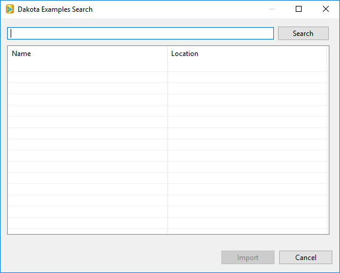
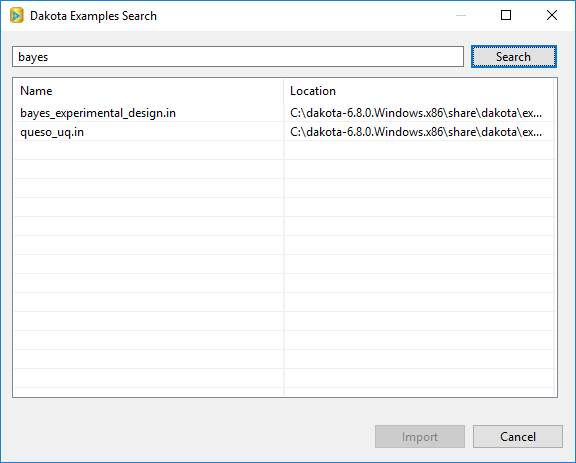

Examples
======================

##Table of Contents
1. [Introduction](#introduction)
2. [Offline Examples Search](#offline-examples-search)
3. [Online Examples Search](#search-dakota-examples-online)

##Introduction

The Dakota GUI provides a Google-like search functionality that allows you to browse curated input file examples written by the Dakota team.

You can access the Search dialog by right-clicking on an existing Dakota project and selecting New > Example Dakota project from the context menu.

##Offline Examples Search

The Search dialog is straightforward to use. Simply type in a keyword that represents what you're looking for and hit Search.

Select the input file you want and click "Import."  The Search dialog will either create a new project to hold this input file, or add it to your currently selected project.

##Online Examples Search

The Dakota team owns a handful of online Git repositories containing Dakota examples, in order to promote community contributions, as well as to always provide the latest and greatest examples to users.  The primary Git repository that the Dakota team maintains is:

    https://gitlab-ex.sandia.gov/Dakota/dakota-examples.git

Currently, this repository is only available internally to employees at Sandia National Laboratories.  However, the "official" subdirectory of this repository is shipped with Dakota and is available by [performing an offline search](#offline-examples-search).

Because the Dakota GUI communicates with the examples repository generically using Git, you can also [configure Dakota GUI to use a different Git repository, using the Preferences dialog](Preferences.html#dakota-examples-search).

If you have at least one Git repo available to you, and the Preferences dialog is configured to search Git repos, the search dialog works exactly the same as described previously – just type in a search term and hit Enter.  In the background, the search dialog will clone Dakota's examples repository, search it, and return any examples relevant to your search term.  Note, however, that the buttons in the top-right have changed:

* **Search (the magnifying glass icon)** This performs an initial search of your chosen repository. In the background, a "git clone" command is executed to retrieve the repository files.
* **Refresh (the cycle icon)** This re-searches your chosen repository for new examples.  In the background, a "git pull" command is executed to retrieve the latest repository files.
* **Settings (the gear icon)**  A shortcut to the [Dakota Examples Search page on the Preferences](Preferences.html#dakota-examples-search) dialog.

*Note:* You will need to provide your password if cloning over HTTPS, or your private key passphrase if cloning over SSH. The Dakota GUI does not cache passwords, so you will need to do this once per session.

*Note:* Power users may prefer to simply work with Dakota’s online example repository directly through Git, without using the Dakota GUI to assist with Git operations.  If you wish to do this, the Dakota GUI can still help you search your cloned repository.  Simply switch the [preference page](Preferences.html#dakota-examples-search) option back to "Search local filesystem", and then point it to the location of your local Git repo on disk.