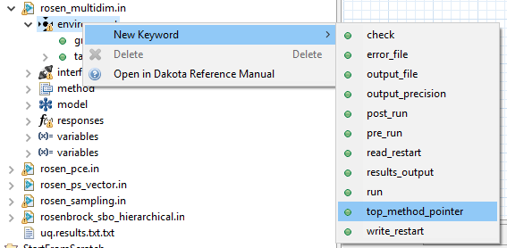

Dakota Input Files
==================

##Table of Contents
1. [Introduction](#introduction)
2. [Dakota Visual Editor](#dakota-visual-editor)
3. [Dakota Text Editor](#dakota-text-editor)
4. [Tree in the Project Navigator view](#dakota-tree-view)

##Introduction

Once you have a Dakota input file imported into the GUI, there are many available options for inspecting and editing it.

##Dakota Visual Editor

The Dakota Visual Editor is a powerful alternative to editing Dakota input files in a text editor.  Gone are the days of manually tinkering with long number arrays, or hoping that variables and responses are active and indexed correctly.

If the Dakota Visual Editor is not configured as your default editor of Dakota input files, right-click a Dakota input file and choose "Open With > Dakota Visual Editor".  Otherwise, simply double-click the file.

For more information, see [the main page about the Dakota Visual Editor.](DakotaVisualEditor.html)

##Dakota Text Editor

The Dakota text editor is the most traditional way of editing a Dakota input file.  While not recommended for complex Dakota studies, the text editor can be handy if you just need to make a small adjustment to your Dakota input file.

If the Dakota Text Editor is not configured as your default editor of Dakota input files, right-click a Dakota input file and choose "Open With > Dakota Text Editor".  Otherwise, simply double-click the file.

###Error Markup

The Dakota GUI’s text editor provides some basic error marking functionality that can help with malformed Dakota input files.  For example, in this screenshot, we have a continuous_design section of a variables block, stating that it will have 3 variables.  However, only 2 variables are specified below; this prompts an error to be displayed, warning us about the discrepancy.  Keywords relevant to the error are marked with red underlines.  Tooltip text help (i.e. the pale yellow box pictured here) can be viewed if you hover over the red X icons to the left; doing this provides more information about what is specifically wrong with your file.

###Completion Proposals

Completion proposals are context-sensitive recommendations provided by the Dakota text editor.  If you are writing a Dakota text file, completion proposals can tell you which keywords are legally allowed to come next.  Completion proposals can also give you clues about values to use for new id_* and *_pointer keywords.

Suppose we start with an empty environment block.

With the text cursor on "environment," press Ctrl+Space (Command+Space on Mac.)  The following context menu will appear with recommendations for which keywords to include in your environment block.

As stated earlier, if you have block pointers specified elsewhere in your study, completion proposals can also recommend which blocks to point at:

###Block Recipes

If you want to wholesale replace a Dakota block with another block that has reasonable defaults for a different situation, right-clicking on a top-level keyword in the Dakota text editor will enable a "Replace Block with Recipe" context menu option:

A situation where this might be useful is for hooking a Dakota study up to [a workflow file as your chosen Dakota analysis driver](NextGenWorkflow.html#nested-workflow-tutorial).  You can also use this feature to switch to a different Dakota method, without disturbing the rest of the input file.

###Pre-processor Markup

The Dakota text editor respects some pre-processor markup.  Orange bold text is used to indicate markup syntax:

However, there are some limitations to using pre-processor markup in the Dakota text editor:

* The markup must apply to individual parameter values of Dakota keywords, as shown above.  Markup cannot be used in place of Dakota keywords themselves, and a single markup token cannot be applied across multiple parameter values at once.
* % statements are used in pre-processor syntax to insert blocks of Python code that should be executed at runtime.  Single-line % statements are supported in the Dakota text editor, but blocks of Python code surrounded by % characters are not supported yet.

Learn more about Dakota's pre-processing tools in [Section 10.8 of the Dakota User's Manual](https://dakota.sandia.gov/content/manuals). 

##Tree in the Project Explorer view

A Dakota input file can be expanded in the Project Explorer view's tree to reveal its content hierarchically:

###"New Keyword" context menu option

With a Dakota study expanded in the Project Explorer, right-click a Dakota keyword and choose "New Keyword."  A sub-context menu will pop out with available keywords at the point in the Dakota study you clicked on.  Choosing a keyword from this sub-context menu will automatically add it to your Dakota study.

