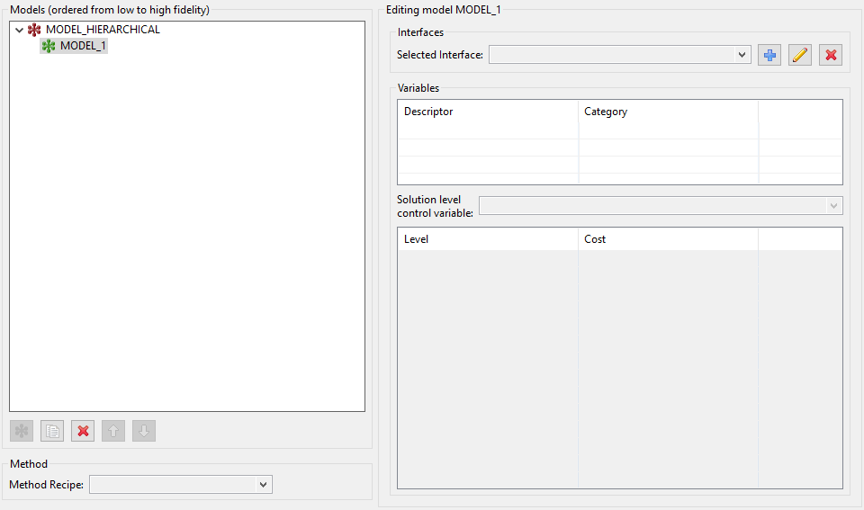
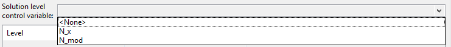
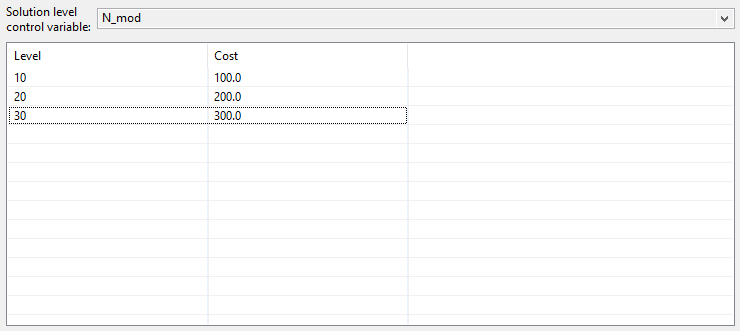

```{eval-rst}
.. _gui-mlmf-main:
```

Multi-Level / Multi-Fidelity Study Editor
=========================================

## What is multi-level / multi-fidelity (MLMF)?<a name="introduction"></a>

Multi-level and multi-fidelity methods work with a hierarchy or ensemble of models with differential accuracy and simulation cost. The models are strategically run in concert to achieve an optimization or uncertainty quantification goal.

For the purposes of this editor:

 - A model has multiple **levels** when its solution accuracy can be parametrically controlled, e.g., a variable can control solver tolerance or mesh resolution.
 - Model **fidelity** refers to models with distinct solution techniques, such that one might be considered a low-fidelity or high-fidelity model.
 - **Multi-level / multi-fidelity** (MLMF) describes a combination of the two cost/accuracy concepts.

While conceptually helpful especially when mapping to the UQ
literature, the level vs. fidelity distinction is not strict. For
example, a multi-level model could be declared to Dakota as a set of
multi-fidelity models, each with one mesh resolution. Dakota will soon
have generalizations that can more generally treat ensembles of models
with less focus on this distinction.

## Accessing the MLMF Editor<a name="accessing-mlmf-editor"></a>

A new editor tailored for working with MLMF studies is available in Dakota GUI as of version 6.15.  It's important to remember that the MLMF Study Editor is simply another "view" into a Dakota input file.  Like the [**Dakota Text Editor**](DakotaInputFiles.html#dakota-text-editor) and [**Dakota Visual Editor**](DakotaVisualEditor.html), it provides specific options for editing Dakota's input file format that were designed to make your life easier, and whether or not you need to use the MLMF Study editor depends on your use case.

There are two ways to access the MLMF Study editor:

* **New MLMF Study wizard:** File > New > Other > Dakota > MLMF Study.  This option will create a boilerplate Dakota MLMF study and open it in the MLMF editor.
* **Open existing Dakota study as MLMF study:** Given an existing Dakota input file, right-click and choose Open With > MLMF Study Editor.
 * *Note:* When opening an existing Dakota input file in the MLMF Study editor, you may be stopped by a dialog that informs you that there are problems with your study that need to be mitigated.  This can happen if you have a Dakota study that is not well-suited for MLMF studies.  Most "problems" with existing Dakota input files can be auto-mitigated, but some will require you to close the MLMF Study editor, adjust the Dakota input file in a different editor, and then return to the MLMF Study editor.

## Using the MLMF Editor<a name="using-mlmf-editor"></a>

When you open the MLMF editor, it will look something like this:


The general process for creating a multi-level / multi-fidelity Dakota study in this editor is as follows:

1. Create one or more models for each fidelity.
	* In this context, "model" refers to the top-level Dakota block type `model`.
	* One model would be used for ML, multiple models would be used for MF and MLMF.
	* These models will be created as children of the top-level hierarchical model.
2. Configure each model's interface pointer to refer to the appropriate simulation interface.
	* This is achieved by importing one or more interfaces into the Dakota study.
	* In this context, "interface" refers to the top-level Dakota block type `interface`.
3. For multi-level studies (ML or MLMF), select a solution level control variable and then specify values and costs.
	* This is achieved by accessing the "Edit All Variables" dialog and specifying which variables will act as control variables.
	* They should be defined as discrete state set of integer variables (this will be relaxed in the future).
	* You can edit levels in this same variables dialog after specifying a variable as the control variable.  Alternately, you can edit levels and costs in the main MLMF editor after defining your control variable and closing the variables dialog.
4. Specify the type of method you would like to use.
	* In this editor, use the "Method Type" dropdown to select a method and auto-configure the `method` block with reasonable defaults.

### The Action Bar


First, let's discuss in turn what each of the *action bar* buttons do.

* **Edit All Variables (pencil with x= icon)**: Allows you to edit variables for your MLMF study.  Because variables are typically shared across models, this editor provides a context for editing a single variable and applying the change across all models; alternatively, you may opt to edit a variable's properties to apply to only one of the models in the Dakota study.
* **Preview Dakota Study (magnifying glass icon)**: Allows you to view the text version of the Dakota input file, according to the current content of the MLMF study editor.
* **Run Dakota (green play icon)**: Run Dakota using the current input file represented in the MLMF study editor.
* **Plot Correlations**:  After running Dakota, for example to conduct a UQ pilot study, this button will display inter-model correlation information. Eventually it will also predict which MLMF method strategy is the most promising for your analysis. *Note: This button is currently disabled, as the MLMF editor is still under development, and MLMF correlation plotting has not yet been implemented.*
* **Help using MLMF editor (blue question mark icon)**: Opens this section of the GUI manual.

### Specifying Model Hierarchy

The main portion of the MLMF Study Editor is occupied by the **model tree view**.  For new MLMF studies, there will only be one model in the hierarchy:


In general, there are two types of model blocks you will see in the model tree view:

* **Hierarchical models (red icons):**  These act as the parent model that governs other models.  Currently, it is only possible to have one hierarchical model at the top of the model hierarchy.
* **Single models (green icons):**  These are children to the hierarchical model and can be used to represent different model fidelities.  For example, you may have two single models in your study -- a high-fidelity model and a low-fidelity model.

Along the bottom of the model tree view, there are a number of controls specifically for models:

* **New model (green icon):** Add a new single model underneath the parent hierarchical model.
* **Duplicate model (paper copy icon):** Duplicate the currently selected single model.
* **Delete (red X icon):** Delete the currently selected single model.
* **Move up (up arrow icon):** Move the currently selected single model up in the list of single models.
* **Move down (down arrow icon):** Move the currently selected single model down in the list of single models.

You will usually begin by clicking on the "New model" button to add a single model to your study.  When you do this, several things happen:



1. A new single model, MODEL\_1, is added as a child to MODEL\_HIERARCHICAL.
2. The "single model editor" activates on the right-side of the editor.  You will notice that you now have access to several more controls - an area for selecting interfaces, a table that will preview associated variables, and an area for editing solution level control variables.

You can rename a model by double-clicking on its name.

### Importing Interfaces

Every model must relate to an interface.  As a reminder, *interface* refers specifically to top-level Dakota "interface" blocks that manage [**analysis drivers**](ExternalSimulationModelOverview.html).

Interfaces can be imported using the "Interfaces" group at the top of the single model editor area:


* **Selected Interface combo:** Use this to select a previously-imported interface.
* **Add Analysis Driver button (blue plus icon):** Allows you to add a new analysis driver to the study.  You may either add an external analysis driver (i.e. a script file in your workspace), or one of Dakota's direct analysis drivers.
* **Edit Analysis Driver button (pencil icon):** Allows you to edit the name of the selected analysis driver interface.
* **Delete Analysis Driver button (red X icon):** Deletes the currently selected analysis driver interface.

### Specifying Control Variables

After you have specified an interface by importing an analysis driver, that analysis driver should provide defined input parameters (i.e. variables).  These variables will appear in the Variables table immediately below:


The next step in defining an ML or MLMF study with multiple levelsis to choose a **solution control variable**.  The control variable will allow the Dakota study to switch between levels for a given model.  However, freshly-imported analysis drivers will not provide information about which variables are the control variables.  For this, we must take a detour to the Variable Editor dialog.

**Variable Editor Dialog**

After clicking on the "Edit all variables" button in the top-left corner of the editor, you will see the main variable editor dialog, which will look something like this:


This table will show you the union of all variables provided by all analysis drivers; this allows you to identify variables that might be compatible with one analysis driver but not another.

To categorize one of the variables as the control variable, you must change its type to `discrete_state_set > integer`.  To achieve this, choose your control variable from the list, then click on the "Edit Variable" button in the top-left corner.  If presented with a choice, choose "Edit this variable for all blocks."

Choose `discrete_state_set` from the dropdown, and configure the variable with a set of integer-valued levels, according to your desired control levels for the model:


*Note: You can alternately specify levels in the level/cost table of the main MLMF study editor.*

Click OK to save your changes.

Once you have defined at least one variable as a `discrete_state_set` type, you may close the entire variable editor dialog and return to the main MLMF editor.  There, you can choose one of the variables you previously defined as control variables from the "Solution level control variable" dropdown:



### Setting Costs Associated with Levels


You must inform Dakota about the relative cost associated with each level of your model.  You can directly edit the cost values in the level/cost table by double-clicking on the cells in the "Cost" column:



You can also add new levels by right-clicking the table and choosing "Add Row Before" or "Add Row After."

### Selecting a Method


The last step is to choose a method recipe (i.e. a fully-configured method block with reasonable defaults) from the "Method Recipe" dropdown.  Each of these method recipes is slightly different.  You can learn about the different Dakota methods being invoked by consulting [**the method section of the reference manual:**](https://dakota.sandia.gov//sites/default/files/docs/latest_release/html-ref/method.html)

- [**sampling**](https://dakota.sandia.gov//sites/default/files/docs/latest_release/html-ref/method-sampling.html)
- [**multilevel\_sampling**](https://dakota.sandia.gov//sites/default/files/docs/latest_release/html-ref/method-multilevel_sampling.html)
- [**multifidelity\_sampling**](https://dakota.sandia.gov//sites/default/files/docs/latest_release/html-ref/method-multifidelity_sampling.html)
- [**multilevel\\_multifidelity\\_sampling**](https://dakota.sandia.gov//sites/default/files/docs/latest_release/html-ref/method-multilevel_multifidelity_sampling.html)

## Strategy for MLMF Studies<a name="strategy"></a>

### 1. Perform a UQ pilot Study

Typically, you will run a single iteration of the UQ study, known as a "pilot study" to:
 
1. Verify the mapping of variables through interfaces to responses;
2. Refine simulation model cost estimates; and
3. Assess correlation among the various models in the hierarchy and consequently which MLMF method might be most efficient.

### 2. Analyze correlations

To analyze the model correlation, press the "Plot Correlations" button.

*Note: This button is currently disabled, as the MLMF editor is still under development, and MLMF correlation plotting has not yet been implemented.*

### 3. Perform final UQ study

Finally, specify a function evaluation or iteration budget, or
convergence tolerance, and run it like any other Dakota study.
