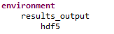
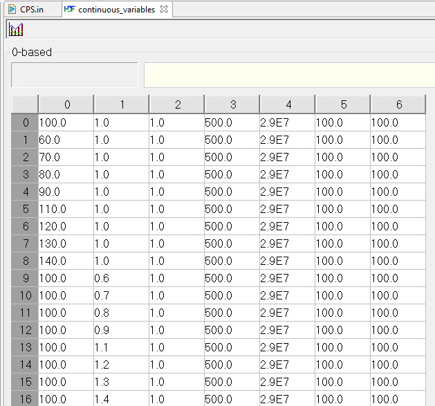
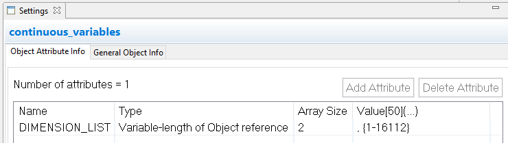

HDF5
====

## Introduction

In 2018, with the release of version 6.9.0, Dakota began providing HDF5 database files as a supported output format for its data.  Historically, all of Dakota's output data was written to plain text formats - tabular data files, console output stream, etc.  This meant that parsing Dakota's output data was a manual, sometimes difficult process.  On the other hand, HDF5 is a standard for scientific programming data storage, and there are many tools readily available for reading data out of an HDF5 file.

## Recommended Reading about HDF5

* [Visit the HDF Group website for further information on the HDF5 format.](https://www.hdfgroup.org/wp-content/uploads/2017/12/HDF512-17.pdf)
* [Learn about the way Dakota organizes its output data into HDF5 format.](https://dakota.sandia.gov//sites/default/files/docs/latest_release/html-ref/hdf5_output.html)
* [Learn about HDFView, the HDF Group's tool for graphically browsing HDF5 files.](https://support.hdfgroup.org/products/java/hdfview/)
* [Learn about h5py, the Pythonic interface to HDF5 format.](https://www.h5py.org/)

## Generating an HDF5 Output File from Dakota

Configuring Dakota to generate HDF5 output is easy.  In the [*environment*](https://dakota.sandia.gov//sites/default/files/docs/latest_release/html-ref/environment.html) block of your study, add the keywords [*results_output*](https://dakota.sandia.gov//sites/default/files/docs/latest_release/html-ref/environment-results_output.html) and [*hdf5*](https://dakota.sandia.gov//sites/default/files/docs/latest_release/html-ref/environment-results_output-hdf5.html).

Dakota GUI also provides a [block recipe](DakotaInputFiles.html#block-recipes) to do this for you:

Now, the next time you run Dakota, an h5 file that contains your Dakota data in HDF5 format will be added to your project directory.

## Browsing HDF5 Files in Dakota GUI

All HDF5 files (not just those generated by Dakota) are browseable in the Dakota GUI, thanks to the incorporation of the [HDF Group's HDFView](https://support.hdfgroup.org/products/java/hdfview/) tool.

Clicking on the small arrow next to our h5 file will expand it to the first level of data contained within. 

The data contained in HDF5 files are primarily composed of **groups** and **datasets** which roughly correspond to the idea of folders and files in an operating system:

This is what an average Dakota HDF5 file looks like after expanding a few of the folders.  Groups are designated by folder icons, whereas datasets are designated by page icons.

To view the data in an individual dataset, simply double-click it to display the table of data in your editor area.

Attributes about a group or dataset can be viewed using the Settings Editor view (Window > Show View > Settings).

*Pro Tip:* The Dakota GUI provides an **HDF File Viewing** perspective that docks the Settings Editor view in the center of your perspective.  To activate this perspective, go to "Window > Perspective > Open Perspective > Other" and then select "HDF File Viewing."

*Note:* Dakota GUI only supports viewing HDF5 files in read-only mode.  You cannot use the Dakota GUI to write to an h5 file after it has been created.

## Using HDF5 Files for Graphical Plotting

HDF5 files are recognized by [Chartreuse](Chartreuse.html) (Dakota GUI's plotting library) as a source of plottable data.

* [Learn about how to extract plotting data from plain HDF5 files.](Chartreuse.html#getting-data-from-plain-hdf5)
* [Learn about how to extract plotting data from Dakota-generated HDF5 files.](Chartreuse.html#getting-data-from-dakota-hdf5)

## Using HDF5 Files in Next-Gen Workflow

HDF5 files can also be used when building workflows in [Next-Gen Workflow](NextGenWorkflow.html).

* [Learn about the simple HDF5 plotting nodes that Next-Gen Workflow provides.](Chartreuse.html#basic-hdf-plot-nodes)
* [Learn about the advanced "composite plotters" that combine knowledge of Dakota, HDF5, and Chartreuse to produce extremely complex plots.](Chartreuse.html#plotting-composite-plotters)