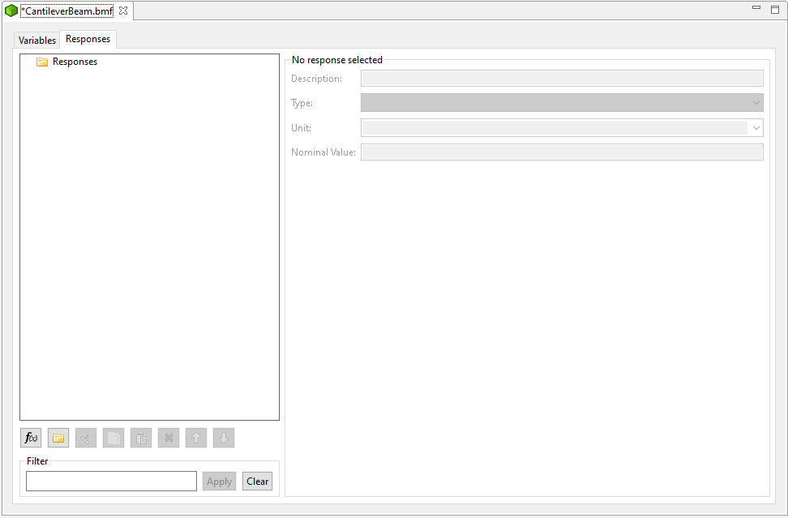

```{eval-rst}
.. _bmf-main:
```

Basic Model Format (BMF)
========================

Basic Model Format files (that is, files with a BMF extension) allow an analyst to define input parameters and output responses for black-box simulation models.

A BMF file is a good starting point for many different operations in Dakota GUI, because the BMF format is recognized by many different tools that require you to provide a definition of input parameters and output responses:

* ["Dakota Study" Wizard](Wizards.html#dakota-study-wizard)
* ["Markup File" Tool](ContextMenuTools.html#markup-file)
* ["Recognize as Analysis Driver" Tool](ContextMenuTools.html#using-an-existing-script-file-as-a-driver)
* ["Script-Based Dakota Driver" Wizard](Wizards.html#script-based-dakota-driver-wizard)
* ["Workflow-Based Dakota Driver" Wizard](Wizards.html#workflow-based-dakota-driver)

**Cantilever Beam Tutorial**

Before beginning, an analyst is assumed to have some *a priori* knowledge about the black-box simulation model of interest, specifically with regards to what sorts of input parameters it receives, and what output results to look at.

As an example, the classic cantilever beam model has:

* **Seven input parameters** - length, width, thickness, density, Young’s modulus, horizontal load, and vertical load
* **Three output responses** - mass, stress, and displacement

To begin editing a new BMF file, from the Project Explorer view, right-click a Dakota project and select "New > Other > Basic Model Format (BMF) > BMF File".  After choosing a name and location for your new model file, the BMF editor should open.


First of all, note that there are two tabs along the top – “Variables” and “Respsonses.”  You can switch between these two tabs to specify variables (i.e. input parameters) and responses for your model.

**Add New Variable**

Click on the "Add Variable" button (the button with a blue “(x)=” symbol) to add your first variable!


A couple of things happen at this point:

* A variable called "New variable" is added underneath the “Variables” folder in the tree view on the left side of the editor.
* New buttons become active – “New Group”, “Cut”, “Copy”, and “Delete.”  More on these in a minute.
* The variable properties section (the right side of the editor) become active.  You can now specify more specific features of your variable.  More on these properties in a minute.

In order to rename your variable from “New Variable” to something more descriptive, use the blue focus area on the tree view to type in a new variable name.  Let’s start with “length” since that’s one of our cantilever beam’s input parameters.  (If you lose focus, simply double-click the “New variable” text in the tree view to get editing focus back).


**Variable Editor Controls**

Let’s go over the button group near the bottom of the editor.


From left to right:

* **New Variable** Inserts a new variable to the currently selected group.
* **New Group** Inserts a new group as a child of the selected group.  You can go arbitrarily deep with variable groups.
* **Cut** Cut the selected variable or group.
* **Copy** Copy the selected variable or group.
* **Paste** Paste a previously cut or copied variable or group into the currently selected location.
* **Delete** Delete the currently selected variable or group.
* **Move Up** Move the selected variable or group up amongst its siblings.
* **Move Down** Move the selected variable or group down amongst its siblings.

**Variable Property Controls**

There are a number of properties internal to variables that you can edit.


* **Description** A longer textual description of the variable.
* **Type** A type describing the variable (right now, “Integer,” “Float,” and “String” are the options)
* **Unit** Search for a unit of measurement to describe your variable. (For this example, there is no need to specify units.  The cantilever beam model we’re using doesn’t observe units.)
* **Nominal Value** Define a nominal value for your variable.
 * *Pro Tip:* If you define a nominal value for your variable now, it will be automatically be imported into Dakota as either initial\_point or initial\_state.

The responses tab of the editor is a mirror of the variables tab:

