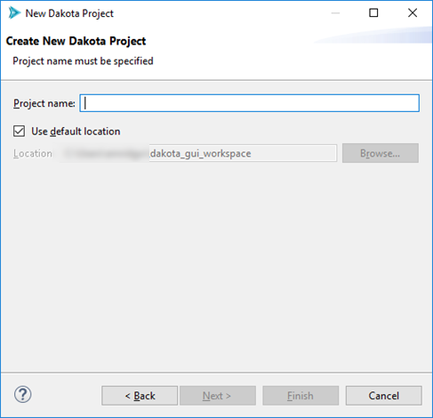

New Dakota Project
=======

You can create a new Dakota [project](../miscgui/Eclipse.html#projects) using the Dakota Project wizard.

Go to File > New > Project, then select Dakota > Dakota Project from the available options:

The New Dakota Project wizard only has one page:

Put the name of your new project in the "Project name" field and click Finish.  At this time, you should see your new project appear in the Project Explorer view.
