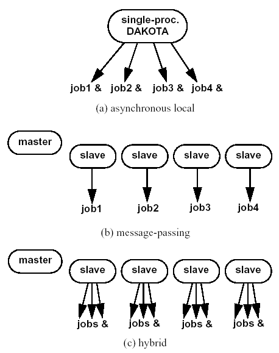
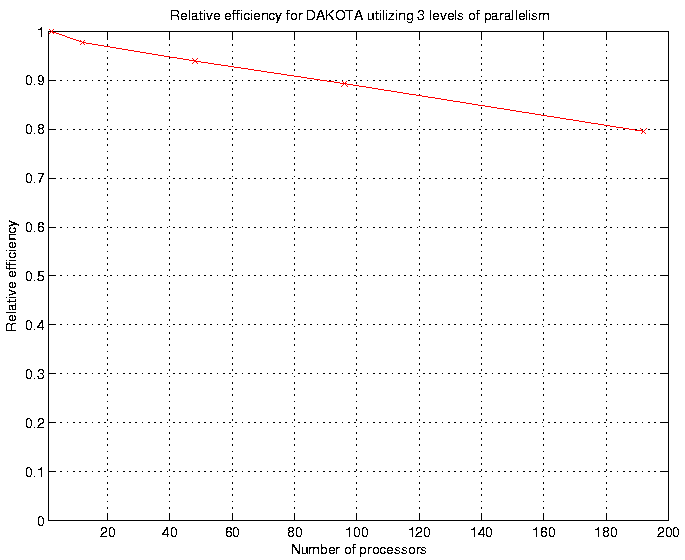

.. _parallel:

Parallel Computing
==================

.. _`parallel:overview`:

Overview
--------

This chapter describes the various parallel computing capabilities
provided by Dakota. We begin with a high-level summary.

Dakota has been designed to exploit a wide range of parallel computing
resources such as those found in a desktop multiprocessor workstation, a
network of workstations, or a massively parallel computing platform.
This parallel computing capability is a critical technology for
rendering real-world engineering design problems computationally
tractable. Dakota employs the concept of *multilevel parallelism*, which
takes simultaneous advantage of opportunities for parallel execution
from multiple sources:

**Parallel Simulation Codes**: Dakota works equally well with both
serial and parallel simulation codes.

**Concurrent Execution of Analyses within a Function Evaluation**: Some
engineering design applications call for the use of multiple simulation
code executions (different disciplinary codes, the same code for
different load cases or environments, etc.) in order to evaluate a
single response data set (e.g., objective functions and
constraints) for a single set of parameters. If these simulation code
executions are independent (or if coupling is enforced at a higher
level), Dakota can perform them concurrently.

**Concurrent Execution of Function Evaluations within an Iterator**:
Many Dakota methods provide opportunities for
the concurrent evaluation of response data sets for different parameter
sets. Whenever there exists a set of function evaluations that are
independent, Dakota can perform them in parallel.

.. note::
    The term *function evaluation* is used broadly to mean any individual
    data request from an iterative algorithm

**Concurrent Execution of Sub-Iterators within a Meta-iterator or Nested
Model**: The advanced methods described on the :ref:`Advanced Methods <adv_meth>` 
page are examples of meta-iterators, and
the advanced model recursions described on the :ref:`Advanced Models <adv_models>`
page all utilize nested models. Both of these cases generate sets of iterator
subproblems that can be executed concurrently. For example, the
:ref:`Pareto-set <adv_meth:pareto>` and :ref:`multi-start <adv_meth:multistart>`
strategies generate sets of optimization subproblems. Similarly, 
:ref:`optimization under uncertainty <adv_models:ouu>`
generates sets of uncertainty
quantification subproblems. Whenever these subproblems are independent,
Dakota can perform them in parallel.

It is important to recognize that these four parallelism sources can be
combined recursively. For example, a meta-iterator can schedule and
manage concurrent iterators, each of which may manage concurrent
function evaluations, each of which may manage concurrent analyses, each
of which may execute on multiple processors. Moreover, more than one
source of sub-iteration concurrency can be exploited when combining
meta-iteration and nested model sources. In an extreme example, defining
the Pareto frontier for mixed-integer nonlinear programming under mixed
aleatory-epistemic uncertainty might exploit up to four levels of nested
sub-iterator concurrency in addition to available levels from function
evaluation concurrency, analysis concurrency, and simulation
parallelism. The majority of application scenarios, however, will employ
one to two levels of parallelism.

Navigating the body of this chapter: The range of capabilities is
extensive and can be daunting at first; therefore, this chapter takes an
incremental approach in first describing the simplest 
:ref:`single-level parallel <parallel:SLP>` computing models using
asynchronous local, message passing, and hybrid approaches. More
advanced uses of Dakota can build on this foundation to exploit 
:ref:`multiple levels of parallelism <parallel:MLP>`.

The chapter concludes with a discussion of using Dakota with
applications that run as independent MPI processes (parallel application
tiling, for example on a large compute cluster). This last section is a
good quick start for interfacing Dakota to your parallel (or serial)
application on a cluster.

..
   TODO:
   % In the following sections, the parallel algorithms available in this
   % Dakota release are listed followed by descriptions of the software
   % components that enable parallelism, approaches for utilizing these
   % components, and input specification and execution details for
   % running parallel Dakota studies.

.. _`parallel:overview:cat`:

Categorization of parallelism
~~~~~~~~~~~~~~~~~~~~~~~~~~~~~

To understand the parallel computing possibilities, it is instructive to
first categorize the opportunities for exploiting parallelism into four
main areas :cite:p:`Eld98a`, consisting of coarse-grained and
fine-grained parallelism opportunities within algorithms and their
function evaluations:

#. *Algorithmic coarse-grained parallelism*: This parallelism involves
   the concurrent execution of independent function evaluations, where a
   "function evaluation" is defined as a data request from an algorithm
   (which may involve value, gradient, and Hessian data from multiple
   objective and constraint functions). This concept can also be
   extended to the concurrent execution of multiple "iterators" within a
   "meta-iterator." Examples of algorithms containing coarse-grained
   parallelism include:

   -  *Gradient-based algorithms*: finite difference gradient
      evaluations, speculative optimization, parallel line search.

   -  *Nongradient-based algorithms*: genetic algorithms (GAs), pattern
      search (PS), Monte Carlo sampling.

   -  *Approximate methods*: design of computer experiments for building
      surrogate models.

   -  *Concurrent sub-iteration*: optimization under uncertainty, branch
      and bound, multi-start local search, Pareto set optimization,
      island-model GAs.

#. *Algorithmic fine-grained parallelism*: This involves computing the
   basic computational steps of an optimization algorithm (i.e., the
   internal linear algebra) in parallel. This is primarily of interest
   in large-scale optimization problems and simultaneous analysis and
   design (SAND).

#. *Function evaluation coarse-grained parallelism*: This involves
   concurrent computation of separable parts of a single function
   evaluation. This parallelism can be exploited when the evaluation of
   the response data set requires multiple independent simulations (e.g.
   multiple loading cases or operational environments) or multiple
   dependent analyses where the coupling is applied at the optimizer
   level (e.g., multiple disciplines in the individual discipline
   feasible formulation :cite:p:`Den94a`).

#. *Function evaluation fine-grained parallelism*: This involves
   parallelization of the solution steps within a single analysis code.
   Support for massively parallel simulation continues to grow in areas
   of nonlinear mechanics, structural dynamics, heat transfer,
   computational fluid dynamics, shock physics, and many others.

By definition, coarse-grained parallelism requires very little
inter-processor communication and is therefore "embarrassingly
parallel," meaning that there is little loss in parallel efficiency due
to communication as the number of processors increases. However, it is
often the case that there are not enough separable computations on each
algorithm cycle to utilize the thousands of processors available on
massively parallel machines. For example, a thermal safety
application :cite:p:`Eld96a` demonstrated this limitation with
a pattern search optimization in which the maximum speedup exploiting
*only* coarse-grained algorithmic parallelism was shown to be limited by
the size of the design problem (coordinate pattern search has at most
:math:`2n` independent evaluations per cycle for :math:`n` design
variables).

Fine-grained parallelism, on the other hand, involves much more
communication among processors and care must be taken to avoid the case
of inefficient machine utilization in which the communication demands
among processors outstrip the amount of actual computational work to be
performed. For example, a chemically-reacting flow
application :cite:p:`Eld98a` illustrated this limitation for a
simulation of fixed size in which it was shown that, while simulation
run time did monotonically decrease with increasing number of
processors, the relative parallel efficiency :math:`\hat{E}` of the
computation for fixed model size decreased rapidly (from
:math:`\hat{E} \approx 0.8` at 64 processors to
:math:`\hat{E} \approx 0.4` at 512 processors). This was due to the fact
that the total amount of computation was approximately fixed, whereas
the communication demands were increasing rapidly with increasing
numbers of processors. Therefore, there is a practical limit on the
number of processors that can be employed for fine-grained parallel
simulation of a particular model size, and only for extreme model sizes
can thousands of processors be efficiently utilized in studies
exploiting fine-grained parallelism alone.

These limitations point us to the exploitation of multiple levels of
parallelism, in particular the combination of coarse-grained and
fine-grained approaches. This will allow us to execute fine-grained
parallel simulations on sets of processors where they are most efficient
and then replicate this efficiency with many coarse-grained instances
involving one or more levels of nested job scheduling.

..
   TODO:
   %From a software perspective, coarse-grained parallelism by
   %itself (many instances of a single-processor simulation) and
   %fine-grained parallelism by itself (a single instance of a large
   %multiprocessor simulation) can be considered to cover two ends of a
   %spectrum, and we are interested in also supporting anywhere in between
   %(any number of instances of any size simulation).  Single-level
   %parallelism approaches (the extremes of this spectrum) are described
   %in Section~\ref{parallel:SLP}, and multilevel parallelism approaches
   %(middle of the spectrum) are discussed in Section~\ref{parallel:MLP}.
   
   %The available concurrency in function evaluation parallelism is
   %determined by the aspects of a particular systems analysis
   %application, and is therefore highly application-dependent.
   %Algorithmic parallelism, on the other hand, is largely determined by
   %the selection and configuration of a particular algorithm.  These
   %selection possibilities within Dakota are outlined in the following
   %section.

.. _`parallel:algorithms`:

Parallel Dakota algorithms
~~~~~~~~~~~~~~~~~~~~~~~~~~

In Dakota, the following parallel algorithms, comprised of iterators and
meta-iterators, provide support for coarse-grained algorithmic
parallelism. Note that, even if a particular algorithm is serial in
terms of its data request concurrency, other concurrency sources (e.g.,
function evaluation coarse-grained and fine-grained parallelism) may
still be available.

.. _`parallel:algorithms:iterators`:

Parallel iterators
^^^^^^^^^^^^^^^^^^

-  Gradient-based optimizers: CONMIN, DOT, NLPQL, NPSOL, and OPT++ can
   all exploit parallelism through the use of Dakota’s native finite
   differencing routine (selected with in the responses specification),
   which will perform concurrent evaluations for each of the parameter
   offsets. For :math:`n` variables, forward differences result in an
   :math:`n+1` concurrency and central differences result in a
   :math:`2n+1` concurrency. In addition, CONMIN, DOT, and OPT++ can use
   speculative gradient techniques :cite:p:`Byr88` to obtain
   better parallel load balancing. By speculating that the gradient
   information associated with a given line search point will be used
   later and computing the gradient information in parallel at the same
   time as the function values, the concurrency during the gradient
   evaluation and line search phases can be balanced. NPSOL does not use
   speculative gradients since this approach is superseded by NPSOL’s
   gradient-based line search in user-supplied derivative mode. NLPQL
   also supports a distributed line search capability for generating
   concurrency :cite:p:`Sch04`. Finally, finite-difference
   Newton algorithms can exploit additional concurrency in numerically
   evaluating Hessian matrices.

..
   TODO: which can evaluate hessians this way?

-  Nongradient-based optimizers: HOPSPACK, JEGA methods, and most SCOLIB
   methods support parallelism. HOPSPACK and SCOLIB methods exploit
   parallelism through the use of Dakota’s concurrent function
   evaluations; however, there are some limitations on the levels of
   concurrency and asynchrony that can be exploited. These are detailed
   in the Dakota Reference Manual. Serial SCOLIB methods include
   Solis-Wets (:dakkw:`method-coliny_solis_wets`) and certain 
   :dakkw:`method-coliny_pattern_search-exploratory_moves`
   options (:dakkw:`method-coliny_pattern_search-exploratory_moves-adaptive_pattern`
   and :dakkw:`method-coliny_pattern_search-exploratory_moves-multi_step`)
   in pattern search (:dakkw:`method-coliny_pattern_search`).
   :ref:`OPT++ PDS <method-optpp_pds>` and :ref:`NCSU DIRECT <method-ncsu_direct>`
   are also currently serial due to
   incompatibilities in Dakota and OPT++/NCSU parallelism models.
   Finally, and support dynamic job queues managed with nonblocking
   synchronization.

-  Least squares methods: in an identical manner to the gradient-based
   optimizers, NL2SOL, NLSSOL, and Gauss-Newton can exploit parallelism
   through the use of Dakota’s native finite differencing routine. In
   addition, NL2SOL and Gauss-Newton can use speculative gradient
   techniques to obtain better parallel load balancing. NLSSOL does not
   use speculative gradients since this approach is superseded by
   NLSSOL’s gradient-based line search in user-supplied derivative mode.

-  Surrogate-based minimizers: :dakkw:`method-surrogate_based_local`,
   :dakkw:`method-surrogate_based_global`, and :dakkw:`method-efficient_global`
   all support parallelism in the initial surrogate construction, but
   subsequent concurrency varies. In the case of :dakkw:`method-efficient_global`, 
   available concurrency depends on :dakkw:`method-efficient_global-batch_size`.
   In the case of :dakkw:`method-surrogate_based_local`, only a
   single point is generated per subsequent cycle, but derivative
   concurrency for numerical gradient or Hessian evaluations may be
   available. And in the case of :dakkw:`method-surrogate_based_global`, 
   multiple points may be generated on
   each subsequent cycle, depending on the multipoint return
   capability of specific minimizers.

-  Parameter studies: all parameter study methods (:ref:`vector <method-vector_parameter_study>`,
   :ref:`list <method-list_parameter_study>`, :ref:`centered <method-centered_parameter_study>`,
   and :ref:`multidim <method-multidim_parameter_study>`) support
   parallelism. These methods avoid internal synchronization points, so
   all evaluations are available for concurrent execution.

-  Design of experiments: all :dakkw:`method-dace`  (:dakkw:`method-dace-grid`,
   :dakkw:`method-dace-random`, :dakkw:`method-dace-oas`, :dakkw:`method-dace-lhs`,
   :dakkw:`method-dace-oa_lhs`, :dakkw:`method-dace-box_behnken`, and 
   :dakkw:`method-dace-central_composite`), :dakkw:`method-fsu_quasi_mc` 
   (:dakkw:`method-fsu_quasi_mc-halton` and :dakkw:`method-fsu_quasi_mc-hammersley`), 
   :dakkw:`method-fsu_cvt`, and :dakkw:`method-psuade_moat` methods
   support parallelism.

-  Uncertainty quantification: all nondeterministic methods (:dakkw:`method-sampling`,
   reliability, stochastic expansion, and epistemic) support
   parallelism. In the case of gradient-based methods (:dakkw:`method-local_reliability`,
   :dakkw:`method-local_interval_est`) parallelism can be exploited
   through the use of Dakota’s native finite differencing routine for
   computing gradients. In the case of many global methods (e.g., 
   :dakkw:`method-global_reliability`, :dakkw:`method-global_interval_est`,
   :dakkw:`method-polynomial_chaos`) initial
   surrogate construction is highly parallel, but any subsequent
   (adaptive) refinement may have greater concurrency restrictions
   (including a single point per refinement cycle in some cases).

.. _`parallel:algorithms:adv_meth`:

Advanced methods
^^^^^^^^^^^^^^^^

Certain advanced methods support concurrency in multiple iterator
executions. Currently, the methods which can exploit this level of
parallelism are:

-  :ref:`Hybrid minimization <adv_meth:hybrid>`: when the sequential 
   hybrid transfers multiple
   solution points between methods, single-point minimizers will be
   executed concurrently using each of the transferred solution points.

-  :ref:`Pareto-set optimization <adv_meth:pareto>`: a meta-iterator
   for multiobjective optimization using the simple weighted-sum approach
   for computing sets of points on the Pareto front of nondominated solutions.

-  :ref:`Multi-start iteration <adv_meth:multistart>`: a meta-iterator
   for executing multiple instances of an iterator from different starting points.

..
   TODO:
   %\item Branch and bound: optimization meta-iterator for mixed-integer
   %nonlinear programming with noncategorical discrete variables.

   %In the branch and bound case, the available iterator concurrency grows
   %as the tree develops more branches, so some of the iterator servers
   %may be idle in the initial phases. Similarly, 

The hybrid minimization case will display varying levels of iterator
concurrency based on differing support of multipoint solution
input/output between iterators; however, the use of multiple parallel
configurations among the iterator sequence should prevent parallel
inefficiencies. On the other hand, pareto-set and multi-start have a
fixed set of jobs to perform and should exhibit good load balancing.

.. _`parallel:algorithms:models`:

Parallel models
^^^^^^^^^^^^^^^
..
   TODO: %variable scaling (see Section~\ref{opt:additional:scaling}) and 

Parallelism support in :ref:`model <models:main>` is an important issue for
advanced model recursions such as surrogate-based minimization, optimization under
uncertainty, and mixed aleatory-epistemic UQ (see
the :ref:`Advanced Method <adv_meth>` and :ref:`Advanced Model <adv_models>` pages).
Support is as follows:

-  :ref:`Single model <models:single>`: parallelism is managed as specified 
   in the model’s associated :dakkw:`interface` instance.

-  :ref:`Recast model <models:recast>`: most parallelism is forwarded on to the 
   sub-model. An exception to this is finite differencing in the presence of variable
   scaling. Since it is desirable to perform offsets in the scaled space
   (and avoid minimum step size tolerances), this parallelism is not
   forwarded to the sub-model, instead being enacted at the recast
   level.

-  :ref:`Data fit surrogate model <models:surrogate:datafit>`: parallelism is 
   supported in the
   construction of global surrogate models via the concurrent evaluation
   of points generated by design of experiments methods. Local and
   multipoint approximations evaluate only a single point at a time, so
   concurrency is available only from any numerical differencing
   required for gradient and Hessian data. Since the top-level iterator
   is interfaced only with the (inexpensive) surrogate, no parallelism
   is exploited there. Load balancing can be an important issue when
   performing evaluations to (adaptively) update existing surrogate
   models.

-  Hierarchical surrogate model: parallelism is supported for the low or
   the high fidelity models, and in some contexts, for both models at
   the same time. In the multifidelity optimization context, the
   optimizer is interfaced only with the low-fidelity model, and the
   high-fidelity model is used only for verifications and correction
   updating. For this case, the algorithmic coarse-grained parallelism
   supported by the optimizer is enacted on the low fidelity model and
   the only parallelism available for high fidelity executions arises
   from any numerical differencing required for high-fidelity gradient
   and Hessian data. In contexts that compute model discrepancies, such
   as multifidelity UQ, the algorithmic concurrency involves evaluation
   of both low and high fidelity models, so parallel schedulers can
   exploit simultaneous concurrency for both models.

-  :ref:`Nested model <models:nested>`: concurrent executions of the optional interface and
   concurrent executions of the sub-iterator are supported and are
   synchronized in succession. Currently, synchronization is blocking
   (all concurrent evaluations are completed before new batches are
   scheduled); nonblocking schedulers (see :ref:`Single-level parallelism <parallel:SLP>`)
   may
   be supported in time. Nested model concurrency and meta-iterator
   concurrency (:ref:`Advanced methods <parallel:algorithms:adv_meth>`) may
   be combined within an arbitrary number of levels of recursion.
   Primary clients for this capability include optimization under
   uncertainty and mixed aleatory-epistemic UQ.

.. _`parallel:SLP`:

Single-level parallelism
------------------------

Dakota’s parallel facilities support a broad range of computing
hardware, from custom massively parallel supercomputers on the high end,
to clusters and networks of workstations in the middle range, to desktop
multiprocessors on the low end. Given the reduced scale in the middle to
low ranges, it is more common to exploit only one of the levels of
parallelism; however, this can still be quite effective in reducing the
time to obtain a solution. Three single-level parallelism models will be
discussed, and are depicted in :numref:`parallel:figure03`:

   External, internal, and hybrid job management.

-  *asynchronous local*: Dakota executes on a single processor, but
   launches multiple jobs concurrently using asynchronous job launching
   techniques.

-  *message passing*: Dakota executes in parallel using message passing
   to communicate between processors. A single job is launched per
   processor using synchronous job launching techniques.

-  *hybrid*: a combination of message passing and asynchronous local.
   Dakota executes in parallel across multiple processors and launches
   concurrent jobs on each processor.

In each of these cases, jobs are executing concurrently and must be
collected in some manner for return to an algorithm. Blocking and
nonblocking approaches are provided for this, where the blocking
approach is used in most cases:

-  *blocking synchronization*: all jobs in the queue are completed
   before exiting the scheduler and returning the set of results to the
   algorithm. The job queue fills and then empties completely, which
   provides a synchronization point for the algorithm.

-  *nonblocking synchronization*: the job queue is dynamic, with jobs
   entering and leaving continuously. There are no defined
   synchronization points for the algorithm, which requires specialized
   algorithm logic. Sometimes referred to as "fully asynchronous" algorithms,
   these currently include :dakkw:`method-coliny_pattern_search`,
   :dakkw:`method-asynch_pattern_search`, and :dakkw:`method-efficient_global` with
   the :dakkw:`method-efficient_global-batch_size-synchronization-nonblocking` option.

Given these job management capabilities, it is worth noting that the
popular term "asynchronous" can be ambiguous when used in isolation. In
particular, it can be important to qualify whether one is referring to
"asynchronous job launch" (synonymous with any of the three concurrent
job launch approaches described above) or "asynchronous job recovery"
(synonymous with the latter nonblocking job synchronization approach).

.. _`parallel:SLP:local`:

Asynchronous Local Parallelism
~~~~~~~~~~~~~~~~~~~~~~~~~~~~~~

This section describes software components which manage simulation
invocations local to a processor. These invocations may be either
synchronous (i.e., blocking) or asynchronous (i.e., nonblocking).
Synchronous evaluations proceed one at a time with the evaluation
running to completion before control is returned to Dakota. Asynchronous
evaluations are initiated such that control is returned to Dakota
immediately, prior to evaluation completion, thereby allowing the
initiation of additional evaluations which will execute concurrently.

The synchronous local invocation capabilities are used in two contexts:
(1) by themselves to provide serial execution on a single processor, and
(2) in combination with Dakota’s message-passing schedulers to provide
function evaluations local to each processor. Similarly, the
asynchronous local invocation capabilities are used in two contexts: (1)
by themselves to launch concurrent jobs from a single processor that
rely on external means (e.g., operating system, job queues) for
assignment to other processors, and (2) in combination with Dakota’s
message-passing schedulers to provide a :ref:`hybrid parallelism <parallel:SLP:hybrid>`.
Thus, Dakota supports any of the four combinations of synchronous or asynchronous 
local combined with message passing or without.

Asynchronous local schedulers may be used for managing concurrent
function evaluations requested by an iterator or for managing concurrent
analyses within each function evaluation. The former iterator/evaluation
concurrency supports either blocking (all jobs in the queue must be
completed by the scheduler) or nonblocking (dynamic job queue may shrink
or expand) synchronization, where blocking synchronization is used by
most iterators and nonblocking synchronization is used by fully
asynchronous algorithms such as :dakkw:`method-asynch_pattern_search`,
:dakkw:`method-coliny_pattern_search`, and :dakkw:`method-efficient_global`
with the :dakkw:`method-efficient_global-batch_size-synchronization-nonblocking` option.
The latter evaluation/analysis concurrency is
restricted to blocking synchronization. The "Asynchronous Local" column
in :numref:`parallel:table01` summarizes these capabilities.

Dakota supports three local simulation invocation approaches based on
the direct function, system call, and fork simulation interfaces. For
each of these cases, an input filter, one or more analysis drivers, and
an output filter make up the interface, as described in 
:ref:`Simulation Interface Components <interfaces:components>`.

.. _`parallel:SLP:local:direct`:

Direct function synchronization
^^^^^^^^^^^^^^^^^^^^^^^^^^^^^^^

The direct function capability may be used synchronously. Synchronous
operation of the direct function simulation interface involves a
standard procedure call to the input filter, if present, followed by
calls to one or more simulations, followed by a call to the output
filter, if present (refer to
:ref:`Simulation Interface Components <interfaces:components>`
for additional details and examples). Each of these components must be
linked as functions within Dakota. Control does not return to the
calling code until the evaluation is completed and the response object
has been populated.

Asynchronous operation will be supported in the future and will involve
the use of multithreading (e.g., POSIX threads) to accomplish multiple
simultaneous simulations. When spawning a thread (e.g., using
``pthread_create``), control returns to the calling code after the
simulation is initiated. In this way, multiple threads can be created
simultaneously. An array of responses corresponding to the multiple
threads of execution would then be recovered in a synchronize operation
(e.g., using ``pthread_join``).

.. _`parallel:SLP:local:system`:

System call synchronization
^^^^^^^^^^^^^^^^^^^^^^^^^^^

The system call capability may be used synchronously or asynchronously.
In both cases, the ``system`` utility from the standard C library is
used. Synchronous operation of the system call simulation interface
involves spawning the system call (containing the filters and analysis
drivers bound together with parentheses and semi-colons) in the
foreground. Control does not return to the calling code until the
simulation is completed and the response file has been written. In this
case, the possibility of a race condition (see below) does not exist and
any errors during response recovery will cause an immediate abort of the
Dakota process.

.. note:: 
    Detection of the string "fail" is not a response
    recovery error; see :ref:`Simulation Failure Capturing <failure>`.

Asynchronous operation involves spawning the system call in the
background, continuing with other tasks (e.g., spawning other system
calls), periodically checking for process completion, and finally
retrieving the results. An array of responses corresponding to the
multiple system calls is recovered in a synchronize operation.

In this synchronize operation, completion of a function evaluation is
detected by testing for the existence of the evaluation’s results file
using the ``stat`` utility :cite:p:`Ker88`. Care must be taken
when using asynchronous system calls since they are prone to the race
condition in which the results file passes the existence test but the
recording of the function evaluation results in the file is incomplete.
In this case, the read operation performed by Dakota will result in an
error due to an incomplete data set. In order to address this problem,
Dakota contains exception handling which allows for a fixed number of
response read failures per asynchronous system call evaluation. The
number of allowed failures must have a limit, so that an actual response
format error (unrelated to the race condition) will eventually abort the
system. Therefore, to reduce the possibility of exceeding the limit on
allowable read failures, *the user’s interface should minimize the
amount of time an incomplete results file exists in the directory where
its status is being tested*. This can be accomplished through two
approaches: (1) delay the creation of the results file until the
simulation computations are complete and all of the response data is
ready to be written to the results file, or (2) perform the simulation
computations in a subdirectory, and as a last step, move the completed
results file into the main working directory where its existence is
being queried.

If concurrent simulations are executing in a shared disk space, then
care must be taken to maintain independence of the simulations. In
particular, the parameters and results files used to communicate between
Dakota and the simulation, as well as any other files used by this
simulation, must be protected from other files of the same name used by
the other concurrent simulations. With respect to the parameters and
results files, these files may be made unique through the use of the
``file_tag`` option (e.g., ``params.in.1``, ``results.out.1``)
or the default temporary file option (e.g.,
``/var/tmp/aaa0b2Mfv``). However, if additional simulation files must
be protected (e.g., ``model.i``, ``model.o``, ``model.g``,
``model.e``), then an effective approach is to create
a tagged working subdirectory for each simulation instance.
The :ref:`Interfaces <interfaces:building>` page provides an
example system call interface that demonstrates both the use of tagged
working directories and the relocation of completed results files to
avoid the race condition.

.. _`parallel:SLP:local:fork`:

Fork synchronization
^^^^^^^^^^^^^^^^^^^^

The fork capability is quite similar to the system call; however, it has
the advantage that asynchronous fork invocations can avoid the results
file race condition that may occur with asynchronous system calls (See 
the :ref:`Interfaces <interfaces:which>` page discussion on choosing
between :dakkw:`interface-analysis_drivers-fork` and 
:dakkw:`interface-analysis_drivers-system`). The fork interface
invokes the filters and analysis drivers using the ``fork`` and ``exec``
family of functions, and completion of these processes is detected using
the ``wait`` family of functions. Since ``wait`` is based on a process
id handle rather than a file existence test, an incomplete results file
is not an issue.

Depending on the platform, the fork simulation interface executes either
a ``vfork`` or a ``fork`` call. These calls generate a new child process
with its own UNIX process identification number, which functions as a
copy of the parent process (dakota). The ``execvp`` function is then
called by the child process, causing it to be replaced by the analysis
driver or filter. For synchronous operation, the parent dakota process
then awaits completion of the forked child process through a blocking
call to ``waitpid``. On most platforms, the ``fork/exec`` procedure is
efficient since it operates in a copy-on-write mode, and no copy of the
parent is actually created. Instead, the parents address space is
borrowed until the ``exec`` function is called.

The ``fork/exec`` behavior for asynchronous operation is similar to that
for synchronous operation, the only difference being that dakota invokes
multiple simulations through the ``fork/exec`` procedure prior to
recovering response results for these jobs using the ``wait`` function.
The combined use of ``fork/exec`` and ``wait`` functions in asynchronous
mode allows the scheduling of a specified number of concurrent function
evaluations and/or concurrent analyses.

.. _`parallel:SLP:local:ex`:

Asynchronous Local Example
^^^^^^^^^^^^^^^^^^^^^^^^^^

The test file ``dakota/share/dakota/test/dakota_dace.in`` 
computes 49 orthogonal array samples, which may be
evaluated concurrently using parallel computing. When executing Dakota
with this input file on a single processor, the following execution
syntax may be used:

::

       dakota -i dakota_dace.in

For serial execution (the default), the interface specification within
``dakota_dace.in`` would appear similar to

::

       interface,
               system
                 analysis_driver = 'text_book'

which results in function evaluation output similar to the following
(for ``output`` set to ``quiet`` mode):

::

       >>>>> Running dace iterator.
       
       DACE method = 12 Samples = 49 Symbols = 7 Seed (user-specified) = 5
       
       ------------------------------
       Begin       I1 Evaluation    1
       ------------------------------
       text_book /tmp/fileia6gVb /tmp/filedDo5MH
       
       ------------------------------
       Begin       I1 Evaluation    2
       ------------------------------
       text_book /tmp/fileyfkQGd /tmp/fileAbmBAJ
       
       <snip>
       
       <<<<< Iterator dace completed.

where it is evident that each function evaluation is being performed
sequentially.

For parallel execution using asynchronous local approaches, the Dakota
execution syntax is unchanged as Dakota is still launched on a single
processor. However, the interface specification is augmented to
include the ``asynchronous`` keyword with optional concurrency limiter
to indicate that multiple ``analysis_driver`` instances will be
executed concurrently:

::

       interface,
               system asynchronous evaluation_concurrency = 4
                 analysis_driver = 'text_book'

which results in output excerpts similar to the following:

::

       >>>>> Running dace iterator.
       
       DACE method = 12 Samples = 49 Symbols = 7 Seed (user-specified) = 5
       
       ------------------------------
       Begin       I1 Evaluation    1
       ------------------------------
       (Asynchronous job 1 added to I1 queue)
       
       ------------------------------
       Begin       I1 Evaluation    2
       ------------------------------
       (Asynchronous job 2 added to I1 queue)
       
       <snip>
       
       ------------------------------
       Begin       I1 Evaluation   49
       ------------------------------
       (Asynchronous job 49 added to I1 queue)
       
       Blocking synchronize of 49 asynchronous evaluations
       First pass: initiating 4 local asynchronous jobs
       Initiating I1 evaluation 1
       text_book /tmp/fileuLcfBp /tmp/file6XIhpm &
       Initiating I1 evaluation 2
       text_book /tmp/fileeC29dj /tmp/fileIdA22f &
       Initiating I1 evaluation 3
       text_book /tmp/fileuhCESc /tmp/fileajLgI9 &
       Initiating I1 evaluation 4
       text_book /tmp/filevJHMy6 /tmp/fileHFKip3 &
       Second pass: scheduling 45 remaining local asynchronous jobs
       Waiting on completed jobs
       I1 evaluation 1 has completed
       I1 evaluation 2 has completed
       I1 evaluation 3 has completed
       Initiating I1 evaluation 5
       text_book /tmp/fileISsjh0 /tmp/fileSaek9W &
       Initiating I1 evaluation 6
       text_book /tmp/filefN271T /tmp/fileSNYVUQ &
       Initiating I1 evaluation 7
       text_book /tmp/filebAQaON /tmp/fileaMPpHK &
       I1 evaluation 49 has completed
       
       <snip>
       
       <<<<< Iterator dace completed.

where it is evident that each of the 49 jobs is first queued and then a
blocking synchronization is performed. This synchronization uses a
simple scheduler that initiates 4 jobs and then replaces completing jobs
with new ones until all 49 are complete.

The default job concurrency for asynchronous local parallelism is all
that is available from the algorithm (49 in this case), which could be
too many for the computational resources or their usage policies. The
concurrency level specification (4 in this case) instructs the scheduler
to keep 4 jobs running concurrently, which would be appropriate for,
e.g., a dual-processor dual-core workstation. In this case, it is the
operating system’s responsibility to assign the concurrent ``text_book``
jobs to available processors/cores. Specifying greater concurrency than
that supported by the hardware will result in additional context
switching within a multitasking operating system and will generally
degrade performance. Note however that, in this example, there are a
total of 5 processes running, one for Dakota and four for the concurrent
function evaluations. Since the Dakota process checks periodically for
job completion and sleeps in between checks, it is relatively
lightweight and does not require a dedicated processor.

.. _`parallel:SLP:local:sched`:

Local evaluation scheduling options
^^^^^^^^^^^^^^^^^^^^^^^^^^^^^^^^^^^

The default behavior for asynchronous local parallelism is for Dakota to
dispatch the next evaluation the local queue when one completes (and can
optionally be specified by
:dakkw:`local_evaluation_scheduling dynamic <interface-asynchronous-local_evaluation_scheduling-dynamic>`.
In some cases, the simulation code interface benefits from knowing which
job number will replace a completed job. This includes some modes of
application tiling with certain MPI implementations, where sending a job
to the correct subset of available processors is done with relative node
scheduling. The keywords
:dakkw:`local_evaluation_scheduling static <interface-asynchronous-local_evaluation_scheduling-static>`
forces this behavior, so a completed evaluation will be replaced with one
congruent modulo the evaluation concurrency. For example, with 6
concurrent jobs, eval number 2 will be replaced with eval number 8.
Examples of this usage can be seen in
``dakota/share/dakota/examples/parallelism``.

.. _`parallel:SLP:message`:

Message Passing Parallelism
~~~~~~~~~~~~~~~~~~~~~~~~~~~

Dakota uses a "single program-multiple data" (SPMD) parallel programming
model. It uses message-passing routines from the Message Passing
Interface (MPI)
standard :cite:p:`Gro94`, :cite:p:`Sni96` to
communicate data between processors. The SPMD designation simply denotes
that the same Dakota executable is loaded on all processors during the
parallel invocation. This differs from the MPMD model ("multiple
program-multiple data") which would have the Dakota executable on one or
more processors communicating directly with simulator executables on
other processors. The MPMD model has some advantages, but heterogeneous
executable loads are not supported by all parallel environments.
Moreover, the MPMD model requires simulation code intrusion on the same
order as conversion to a subroutine, so subroutine conversion (see
:ref:`Developing a Direct Simulation Interface <advint:direct>`) 
in a direct-linked SPMD model is preferred.

.. _`parallel:SLP:message:part`:

Partitioning
^^^^^^^^^^^^

A level of message passing parallelism can use either of two processor
partitioning models:

-  *Dedicated scheduler*: a single processor is dedicated to scheduling
   operations and the remaining processors are split into server
   partitions.

-  *Peer partition*: all processors are allocated to server partitions
   and the loss of a processor to scheduling is avoided.

These models are depicted in :numref:`parallel:figure01`. The
peer partition is desirable since it utilizes all processors for
computation; however, it requires either the use of sophisticated
mechanisms for distributed scheduling or a problem for which static
scheduling of concurrent work performs well (see :ref:`Scheduling <parallel:SLP:message:sched>` 
below). If neither of these characteristics is present, then use of the dedicated
partition supports a dynamic scheduling which assures that server
idleness is minimized.

.. figure:: img/comm_partitioning.png
   :alt: Communicator partitioning models.
   :name: parallel:figure01
   :width: 50%
   :align: center

   Communicator partitioning models.

.. _`parallel:SLP:message:sched`:

Scheduling
^^^^^^^^^^

The following scheduling approaches are available within a level of
message passing parallelism:

..
   TODO: need a more descriptive term, e.g. single-point dedicated
   dynamic scheduling

-  *Dynamic scheduling*: in the dedicated scheduling model, the dedicated 
   processor manages a single processing queue and maintains a
   prescribed number of jobs (usually one) active on each server. Once a
   server has completed a job and returned its results, the scheduler
   assigns the next job to this server. Thus, the job assignment on the
   scheduler adapts to the job completion speed on the servers. This
   provides a simple dynamic scheduler in that heterogeneous processor
   speeds and/or job durations are naturally handled, provided there are
   sufficient instances scheduled through the servers to balance the
   variation. In the case of a peer partition, dynamic schedulers can
   also be employed, provided that peer 1 can employ nonblocking
   synchronization of its local evaluations. This allows it to balance
   its local work with servicing job assignments and returns from the
   other peers.

-  *Static scheduling*: if scheduling is statically determined at
   start-up, then no scheduling processor is needed to direct traffic and a
   peer partitioning approach is applicable. If the static schedule is a
   good one (ideal conditions), then this approach will have superior
   performance. However, heterogeneity, when not known *a priori*, can
   very quickly degrade performance since there is no mechanism to
   adapt.

Message passing schedulers may be used for managing concurrent
sub-iterator executions within a meta-iterator, concurrent evaluations
within an iterator, or concurrent analyses within an evaluation. In the
former and latter cases, the message passing scheduler is currently
restricted to blocking synchronization, in that all jobs in the queue
are completed before exiting the scheduler and returning the set of
results to the algorithm. Nonblocking message-passing scheduling is
supported for the iterator–evaluation concurrency level in support of
fully asynchronous algorithms (e.g., :dakkw:`method-asynch_pattern_search`,
:dakkw:`method-coliny_pattern_search`, and :dakkw:`method-efficient_global`)
that avoid synchronization points that can harm scaling.

Message passing is also used within a fine-grained parallel simulation
code, although this is separate from Dakota’s capabilities (Dakota may,
at most, pass a communicator partition to the simulation). The "Message
Passing" column in :numref:`parallel:table01` summarizes these
capabilities.

.. _`parallel:SLP:message:ex`:

Message Passing Example
^^^^^^^^^^^^^^^^^^^^^^^

Revisiting the test file ``dakota_dace.in``,
Dakota will now compute the 49 orthogonal
array samples using a message passing approach. In this case, a parallel
launch utility is used to execute Dakota across multiple processors
using syntax similar to the following:

::

       mpirun -np 5 -machinefile machines dakota -i dakota_dace.in

Since the asynchronous local parallelism will not be used, the
interface specification does not include the
``asynchronous`` keyword and would appear similar to:

::

       interface,
               system
                 analysis_driver = 'text_book'

The relevant excerpts from the Dakota output for a dedicated scheduler
partition and dynamic schedule, the default when the maximum concurrency
(49) exceeds the available capacity (5), would appear similar to the
following:

::

       Running MPI Dakota executable in parallel on 5 processors.
       -----------------------------------------------------------------------------
       DAKOTA parallel configuration:
       
       Level                       num_servers    procs_per_server    partition
       -----                       -----------    ----------------    ---------
       concurrent evaluations           5                1            peer
       concurrent analyses              1                1            peer
       multiprocessor analysis          1               N/A           N/A
       
       Total parallelism levels =   1 (1 dakota, 0 analysis)
       -----------------------------------------------------------------------------
       >>>>> Executing environment.
       
       >>>>> Running dace iterator.
       
       DACE method = 12 Samples = 49 Symbols = 7 Seed (user-specified) = 5
       
       ------------------------------
       Begin       I1 Evaluation    1
       ------------------------------
       (Asynchronous job 1 added to I1 queue)
       
       ------------------------------
       Begin       I1 Evaluation    2
       ------------------------------
       (Asynchronous job 2 added to I1 queue)
       
       <snip>
       
       ------------------------------
       Begin       I1 Evaluation   49
       ------------------------------
       (Asynchronous job 49 added to I1 queue)
       
       Blocking synchronize of 49 asynchronous evaluations
       Peer dynamic schedule: first pass assigning 4 jobs among 4 remote peers
       Peer 1 assigning I1 evaluation 1 to peer 2
       Peer 1 assigning I1 evaluation 2 to peer 3
       Peer 1 assigning I1 evaluation 3 to peer 4
       Peer 1 assigning I1 evaluation 4 to peer 5
       Peer dynamic schedule: first pass launching 1 local jobs
       Initiating I1 evaluation 5
       text_book /tmp/file5LRsBu /tmp/fileT2mS65 &
       Peer dynamic schedule: second pass scheduling 44 remaining jobs
       Initiating I1 evaluation 5
       text_book /tmp/file5LRsBu /tmp/fileT2mS65 &
       Peer dynamic schedule: second pass scheduling 44 remaining jobs
       I1 evaluation 5 has completed
       Initiating I1 evaluation 6
       text_book /tmp/fileZJaODH /tmp/filewoUJaj &
       I1 evaluation 2 has returned from peer server 3
       Peer 1 assigning I1 evaluation 7 to peer 3
       I1 evaluation 4 has returned from peer server 5
       
       <snip>
       
       I1 evaluation 46 has returned from peer server 2
       I1 evaluation 49 has returned from peer server 5
       <<<<< Function evaluation summary (I1): 49 total (49 new, 0 duplicate)
       
       <<<<< Iterator dace completed.

where it is evident that each of the 49 jobs is first queued and then a
blocking synchronization is performed. This synchronization uses a
dynamic scheduler that initiates five jobs, one on each of five
evaluation servers, and then replaces completing jobs with new ones
until all 49 are complete. It is important to note that job execution
local to each of the four servers is synchronous.

.. _`parallel:SLP:hybrid`:

Hybrid Parallelism
~~~~~~~~~~~~~~~~~~

The asynchronous local approaches described in
the :ref:`Asynchronous Local Parallelism <parallel:SLP:local>` section
can be considered to rely on *external* scheduling mechanisms, since it 
is generally the operating system or some external queue/load sharing
software that allocates jobs to processors. Conversely, the message-passing
approaches described in :ref:`Message Passing Parallelism <parallel:SLP:message>`
rely on *internal* scheduling mechanisms to distribute work among processors.
These two approaches provide building blocks which can be combined in a
variety of ways to manage parallelism at multiple levels. At one extreme,
Dakota can execute on a single processor and rely completely on external
means to map all jobs to processors (i.e., using asynchronous local approaches).
At the other extreme, Dakota can execute on many processors and manage
all levels of parallelism, including the parallel simulations, using
completely internal approaches (i.e., using message passing at all
levels as in :numref:`parallel:figure02`). While all-internal or
all-external approaches are common cases, many additional approaches
exist between the two extremes in which some parallelism is managed
internally and some is managed externally.

These combined approaches are referred to as *hybrid* parallelism, since
the internal distribution of work based on message-passing is being
combined with external allocation using asynchronous local
approaches.

.. note::
    The term "hybrid parallelism" is often used to describe the
    combination of MPI message passing and OpenMP shared memory
    parallelism models. This can be considered to be a special case of
    the meaning here, as OpenMP is based on threads, which is analagous
    to asynchronous local usage of the direct simulation interface.

:numref:`parallel:figure03` depicts the
asynchronous local, message-passing, and hybrid approaches for a
dedicated-scheduler partition. Approaches (b) and (c) both use MPI
message-passing to distribute work from the scheduler to the server, and
approaches (a) and (c) both manage asynchronous jobs local to a
processor. The hybrid approach (c) can be seen to be a combination of
(a) and (b) since jobs are being internally distributed to servers
through message-passing and each server is managing multiple
concurrent jobs using an asynchronous local approach. From a different
perspective, one could consider (a) and (b) to be special cases within
the range of configurations supported by (c). The hybrid approach is
useful for supercomputers that maintain a service/compute node
distinction and for supercomputers or networks of workstations that
involve clusters of symmetric multiprocessors (SMPs). In the
service/compute node case, concurrent multiprocessor simulations are
launched into the compute nodes from the service node partition. While
an asynchronous local approach from a single service node would be
sufficient, spreading the application load by running Dakota in parallel
across multiple service nodes results in better
performance :cite:p:`Eld00`. If the number of concurrent jobs
to be managed in the compute partition exceeds the number of available
service nodes, then hybrid parallelism is the preferred approach. In the
case of a cluster of SMPs (or network of multiprocessor workstations),
message-passing can be used to communicate between SMPs, and
asynchronous local approaches can be used within an SMP. Hybrid
parallelism can again result in improved performance, since the total
number of Dakota MPI processes is reduced in comparison to a pure
message-passing approach over all processors.

Hybrid schedulers may be used for managing concurrent evaluations within
an iterator or concurrent analyses within an evaluation. In the former
case, blocking or nonblocking synchronization can be used, whereas the
latter case is restricted to blocking synchronization. The "Hybrid"
column in :numref:`parallel:table01` summarizes these
capabilities.

.. _`parallel:SLP:hybrid:ex`:

Hybrid Example
^^^^^^^^^^^^^^

Revisiting the test file ``dakota_dace.in``,
Dakota will now compute the 49 orthogonal
array samples using a hybrid approach. As for the message passing case,
a parallel launch utility is used to execute Dakota across multiple
processors:

::

       mpirun -np 5 -machinefile machines dakota -i dakota_dace.in

Since the asynchronous local parallelism will also be used, the
interface specification includes the :dakkw:`interface-asynchronous`
keyword and appears similar to

::

       interface,
               system asynchronous evaluation_concurrency = 2
                 analysis_driver = 'text_book'

In the hybrid case, the specification of the desired concurrency level
must be included, since the default is no longer all available (as it is
for asynchronous local parallelism). Rather the default is to employ
message passing parallelism, and hybrid parallelism is only available
through the specification of asynchronous concurrency greater than one.

The relevant excerpts of the Dakota output for a peer partition and
dynamic schedule , the default when the maximum concurrency (49) exceeds
the maximum available capacity (10), would appear similar to the
following:

::

       Running MPI Dakota executable in parallel on 5 processors.
       
       -----------------------------------------------------------------------------
       DAKOTA parallel configuration:
       
       Level           num_servers    procs_per_server    partition
       -----           -----------    ----------------    ---------
       concurrent evaluations           5                1            peer
       concurrent analyses              1                1            peer
       multiprocessor analysis          1               N/A           N/A
       
       Total parallelism levels =   1 (1 dakota, 0 analysis)
       -----------------------------------------------------------------------------
       
       >>>>> Executing environment.
       
       >>>>> Running dace iterator.
       
       DACE method = 12 Samples = 49 Symbols = 7 Seed (user-specified) = 5
       
       ------------------------------
       Begin       I1 Evaluation    1
       ------------------------------
       (Asynchronous job 1 added to I1 queue)
       
       ------------------------------
       Begin       I1 Evaluation    2
       ------------------------------
       (Asynchronous job 2 added to I1 queue)
       
       <snip>
       
       Blocking synchronize of 49 asynchronous evaluations
       Peer dynamic schedule: first pass assigning 8 jobs among 4 remote peers
       Peer 1 assigning I1 evaluation 1 to peer 2
       Peer 1 assigning I1 evaluation 2 to peer 3
       Peer 1 assigning I1 evaluation 3 to peer 4
       Peer 1 assigning I1 evaluation 4 to peer 5
       Peer 1 assigning I1 evaluation 6 to peer 2
       Peer 1 assigning I1 evaluation 7 to peer 3
       Peer 1 assigning I1 evaluation 8 to peer 4
       Peer 1 assigning I1 evaluation 9 to peer 5
       Peer dynamic schedule: first pass launching 2 local jobs
       Initiating I1 evaluation 5
       text_book /tmp/fileJU1Ez2 /tmp/fileVGZzEX &
       Initiating I1 evaluation 10
       text_book /tmp/fileKfUgKS /tmp/fileMgZXPN &
       Peer dynamic schedule: second pass scheduling 39 remaining jobs
       
       <snip>
       
       I1 evaluation 49 has completed
       I1 evaluation 43 has returned from peer server 2
       I1 evaluation 44 has returned from peer server 3
       I1 evaluation 48 has returned from peer server 4
       I1 evaluation 47 has returned from peer server 2
       I1 evaluation 45 has returned from peer server 3
       <<<<< Function evaluation summary (I1): 49 total (49 new, 0 duplicate)
       
       <<<<< Iterator dace completed.

where it is evident that each of the 49 jobs is first queued and then a
blocking synchronization is performed. This synchronization uses a
dynamic scheduler that initiates ten jobs, two on each of five
evaluation servers, and then replaces completing jobs with new ones
until all 49 are complete. It is important to note that job execution
local to each of the four servers is asynchronous.

.. _`parallel:MLP`:

Multilevel parallelism
----------------------

Parallel computing resources within the Department of Energy national
laboratories continue to rapidly grow. In order to harness the power
of these machines for performing design, uncertainty
quantification, and other systems analyses, parallel algorithms are
needed which are scalable to thousands of processors.

Dakota supports an open-ended number of levels of nested parallelism
which, as described in the :ref:`Overview <parallel:overview>` above, can be
categorized into three types of concurrent job scheduling and four types
of parallelism: (a) concurrent iterators within a meta-iterator
(scheduled by Dakota), (b) concurrent function evaluations within each
iterator (scheduled by Dakota), (c) concurrent analyses within each
function evaluation (scheduled by Dakota), and (d) multiprocessor
analyses (work distributed by a parallel analysis code). In combination,
these parallelism levels can minimize efficiency losses and achieve near
linear scaling on MP computers. Types (a) and (b) are classified as
algorithmic coarse-grained parallelism, type (c) is function evaluation
coarse-grained parallelism, and type (d) is function evaluation
fine-grained parallelism (see :ref:`Categorization of parallelism <parallel:overview:cat>`).
Algorithmic fine-grained parallelism is not currently supported in Dakota,
although this picture is rapidly evolving.

..
   TODO:
   %the development of large-scale parallel SAND techniques is an ongoing
   %research focus~\cite{Bar01b}.

A particular application may support one or more of these parallelism
types, and Dakota provides for convenient selection and combination of
multiple levels. If multiple types of parallelism can be exploited, then
the question may arise as to how the amount of parallelism at each level
should be selected so as to maximize the overall parallel efficiency of
the study. For performance analysis of multilevel parallelism
formulations and detailed discussion of these issues, refer
to :cite:p:`Eld00`. In many cases, *the user may simply employ
Dakota’s automatic parallelism configuration facilities,* which
implement the recommendations from the aforementioned paper.

:numref:`parallel:fig:mlp_scaling:speedup` and 
:numref:`parallel:fig:mlp_scaling:efficiency` show typical fixed-size
scaling performance using a modified version of the extended
:ref:`textbook <additional:textbook>` problem. Three levels
of parallelism (concurrent evaluations within an iterator, concurrent
analyses within each evaluation, and multiprocessor analyses) are
exercised within a modest partition of processors (circa year 2000).
Despite the use of a fixed problem size and the presence of some
idleness within the scheduling at multiple levels, the efficiency is
still reasonably high. Greater efficiencies are obtainable for
scaled speedup studies (or for larger problems in fixed-size studies)
and for problems optimized for minimal scheduler idleness (by, e.g.,
managing all concurrency in as few scheduling levels as possible). Note
that speedup and efficiency are measured relative to the case of a
single instance of a multiprocessor analysis, since it was desired to
investigate the effectiveness of the Dakota schedulers independent from
the efficiency of the parallel analysis.

.. figure:: img/mss_rel_speedup_3lev_determ.png
    :alt: Relative speedup for Dakota utilizing three levels of parallelism
    :name: parallel:fig:mlp_scaling:speedup
    :width: 50%
    :align: center
 
    Relative speedup for Dakota utilizing three levels of parallelism

    Relative efficiency for Dakota utilizing three levels of parallelism

.. _`parallel:MLP:local`:

Asynchronous Local Parallelism
~~~~~~~~~~~~~~~~~~~~~~~~~~~~~~

In most cases, the use of asynchronous local parallelism is the
termination point for multilevel parallelism, in that any level of
parallelism lower than an asynchronous local level will be serialized
(see discussion in the following section :ref:`Hybrid Parallelism <parallel:MLP:hybrid>`).
The exception to this rule is reforking of forked processes for concurrent
analyses within forked evaluations. In this case, a new process is
created using fork for one of several concurrent evaluations; however,
the new process is not replaced immediately using exec. Rather, the new
process is reforked to create additional child processes for executing
concurrent analyses within each concurrent evaluation process. This
capability is not supported by system calls and provides one of the key
advantages to using :ref:`fork over system <interfaces:which>`.

.. _`parallel:MLP:message`:

Message Passing Parallelism
~~~~~~~~~~~~~~~~~~~~~~~~~~~

..
   TODO: 
   %\subsection{Communicator partitioning}
   %   Lowest level supports single-level options above

.. _`parallel:MLP:message:partitioning`:

Partitioning of levels
^^^^^^^^^^^^^^^^^^^^^^

Dakota uses MPI communicators to identify groups of processors. The
global ``MPI_COMM_WORLD`` communicator provides the total set of
processors allocated to the Dakota run. ``MPI_COMM_WORLD`` can be
partitioned into new intra-communicators which each define a set of
processors to be used for a multiprocessor server. Each of these servers
may be further partitioned to nest one level of parallelism within the
next. At the lowest parallelism level, these intra-communicators can be
passed into a simulation for use as the simulation’s computational
context, provided that the simulation has been designed, or can be
modified, to be modular on a communicator (i.e., it does not assume
ownership of ``MPI_COMM_WORLD``). New intra-communicators are created
with the ``MPI_Comm_split`` routine, and in order to send messages
between these intra-communicators, new inter-communicators are created
with calls to ``MPI_Intercomm_create``.

..
   TODO:
   %To minimize overhead, Dakota creates
   %new intra- and inter-communicators only when the parent communicator
   %provides insufficient context for the scheduling at a particular level

Multiple parallel configurations
(containing a set of communicator partitions) are allocated for use in
studies with multiple iterators and models (e.g., 16 servers of 64
processors each could be used for iteration on a lower fidelity model,
followed by two servers of 512 processors each for subsequent iteration
on a higher fidelity model), and can be alternated at run time. Each of
the parallel configurations are allocated at object construction time
and are reported at the beginning of the Dakota output.

Each tier within Dakota’s nested parallelism hierarchy can use the
dedicated scheduler and peer partition approaches described above in the
:ref:`Partitioning <parallel:SLP:message:part>` section. To recursively
partition the subcommunicators of :numref:`parallel:figure01`,
``COMM1/2/3`` in the dedicated scheduler or peer partition case would be
further subdivided using the appropriate partitioning model for the next
lower level of parallelism.

.. _`parallel:MLP:message:scheduling`:

Scheduling within levels
^^^^^^^^^^^^^^^^^^^^^^^^

.. figure:: img/recursive_partitioning.png
   :alt: Recursive partitioning for nested parallelism.
   :name: parallel:figure02
   :width: 50%
   :align: center

   Recursive partitioning for nested parallelism.

Dakota is designed to allow the freedom to configure each parallelism
level with either the dedicated scheduler partition/dynamic scheduling
combination or the peer partition/static scheduling combination. In
addition, the iterator-evaluation level supports a peer
partition/dynamic scheduling option, and certain external libraries may
provide custom options.

..
   TODO: %(e.g., PICO supports distributed scheduling in peer partitions).

As an example, :numref:`parallel:figure02` shows a case in which a branch and
bound meta-iterator employs peer partition/distributed scheduling at
level 1, each optimizer partition employs concurrent function
evaluations in a dedicated scheduler partition/dynamic scheduling model at
level 2, and each function evaluation partition employs concurrent
multiprocessor analyses in a peer partition/static scheduling model at
level 3. In this case, ``MPI_COMM_WORLD`` is subdivided into
:math:`optCOMM1/2/3/.../\tau_{1}`, each :math:`optCOMM` is further subdivided
into :math:`evalCOMM0` (scheduler) and :math:`evalCOMM1/2/3/.../\tau_{2}` (servers),
and each server :math:`evalCOMM` is further subdivided into
:math:`analysisCOMM1/2/3/.../\tau_{3}`. Logic for selecting the :math:`\tau_i`
that maximize overall efficiency is discussed
in :cite:p:`Eld00`.

.. _`parallel:MLP:hybrid`:

Hybrid Parallelism
~~~~~~~~~~~~~~~~~~

Hybrid parallelism approaches can take several forms when used in the
multilevel parallel context. A conceptual boundary can be considered to
exist for which all parallelism above the boundary is managed internally
using message-passing and all parallelism below the boundary is managed
externally using asynchronous local approaches. Hybrid parallelism
approaches can then be categorized based on whether this boundary
between internal and external management occurs within a parallelism
level (*intra-level*) or between two parallelism levels (*inter-level*).
In the intra-level case, the jobs for the parallelism level containing
the boundary are scheduled using a hybrid scheduler, in which a capacity
multiplier is used for the number of jobs to assign to each server. Each
server is then responsible for concurrently executing its capacity of
jobs using an asynchronous local approach. In the inter-level case, one
level of parallelism manages its parallelism internally using a
message-passing approach and the next lower level of parallelism manages
its parallelism externally using an asynchronous local approach. That
is, the jobs for the higher level of parallelism are scheduled using a
standard message-passing scheduler, in which a single job is assigned to
each server. However, each of these jobs has multiple components, as
managed by the next lower level of parallelism, and each server is
responsible for executing these sub-components concurrently using an
asynchronous local approach.

For example, consider a multiprocessor Dakota run which involves an
iterator scheduling a set of concurrent function evaluations across a
cluster of SMPs. A hybrid parallelism approach will be applied in which
message-passing parallelism is used between SMPs and asynchronous local
parallelism is used within each SMP. In the hybrid intra-level case,
multiple function evaluations would be scheduled to each SMP, as
dictated by the capacity of the SMPs, and each SMP would manage its own
set of concurrent function evaluations using an asynchronous local
approach. Any lower levels of parallelism would be serialized. In the
hybrid inter-level case, the function evaluations would be scheduled one
per SMP, and the analysis components within each of these evaluations
would be executed concurrently using asynchronous local approaches
within the SMP. Thus, the distinction can be viewed as whether the
concurrent jobs on each server in :numref:`parallel:figure03`
reflect the same level of parallelism as that being scheduled by the
scheduler (intra-level) or one level of parallelism below that being
scheduled by the scheduler (inter-level).

.. _`parallel:summary`:

Capability Summary
------------------

:numref:`parallel:table01` shows a matrix of the supported job
management approaches for each of the parallelism levels, with supported
simulation interfaces and synchronization approaches shown in
parentheses. The concurrent iterator and multiprocessor analysis
parallelism levels can only be managed with message-passing approaches.
In the former case, this is due to the fact that a separate process or
thread for an iterator is not currently supported. The latter case
reflects a finer point on the definition of external parallelism
management. While a multiprocessor analysis can most certainly be
launched (e.g., using ``mpirun``/``yod``) from one of Dakota’s analysis
drivers, resulting in a parallel analysis external to Dakota (which is
consistent with asynchronous local and hybrid approaches), this
parallelism is not visible to Dakota and therefore does not qualify as
parallelism that Dakota manages (and therefore is not included in
:numref:`parallel:table01`). The concurrent evaluation and
analysis levels can be managed either with message-passing, asynchronous
local, or hybrid techniques, with the exceptions that the direct
interface does not support asynchronous operations (asynchronous local
or hybrid) at either of these levels and the system call interface does
not support asynchronous operations (asynchronous local or hybrid) at
the concurrent analysis level. The direct interface restrictions are
present since multithreading in not yet supported and the system call
interface restrictions result from the inability to manage concurrent
analyses within a nonblocking function evaluation system call. Finally,
nonblocking synchronization is only supported at the concurrent function
evaluation level, although it spans asynchronous local, message passing,
and hybrid parallelism options.

.. table:: *Support of job management approaches within parallelism levels. Shown in parentheses are supported simulation interfaces and supported synchronization approaches.*
   :name: parallel:table01
   :align: center
   :widths: auto

   +----------------+----------------+----------------+----------------+
   | **Parallelism  | **Asynchronous | **Message      | **Hybrid**     |
   | Level**        | Local**        | Passing**      |                |
   +================+================+================+================+
   | concurrent     |                | **X**          |                |
   | iterators      |                |                |                |
   | within a       |                |                |                |
   | meta-iterator  |                | (blocking      |                |
   | or nested      |                | synch)         |                |
   | model          |                |                |                |
   +----------------+----------------+----------------+----------------+
   | concurrent     | **X**          | **X**          | **X**          |
   | function       |                |                |                |
   | evaluations    |                |                |                |
   | within an      | (system, fork) | (system, fork, | (system, fork) |
   | iterator       |                | direct)        |                |
   |                | (blocking,     | (blocking,     | (blocking,     |
   |                | nonblocking)   | nonblocking)   | nonblocking)   |
   +----------------+----------------+----------------+----------------+
   | concurrent     | **X**          | **X**          | **X**          |
   | analyses       |                |                |                |
   | within a       | (fork only)    | (system, fork, | (fork only)    |
   | function       |                | direct)        |                |
   | evaluation     |                |                |                |
   |                | (blocking      | (blocking      | (blocking      |
   |                | synch)         | synch)         | synch)         |
   +----------------+----------------+----------------+----------------+
   | fine-grained   |                | **X**          |                |
   | parallel       |                |                |                |
   | analysis       |                |                |                |
   +----------------+----------------+----------------+----------------+

.. _`parallel:running`:

Running a Parallel Dakota Job
-----------------------------

:ref:`Single-level parallelism <parallel:SLP>` provides a few examples of serial and
parallel execution of Dakota using asynchronous local, message passing,
and hybrid approaches to single-level parallelism. The following
sections provides a more complete discussion of the parallel execution
syntax and available specification controls.

.. _`parallel:running:single`:

Single-processor execution
~~~~~~~~~~~~~~~~~~~~~~~~~~

The command for running Dakota on a single-processor and exploiting
asynchronous local parallelism is the same as for running Dakota on a
single-processor for a serial study, e.g.:

::

       dakota -i dakota.in > dakota.out

See :ref:`Dakota Beginner's tutorial <helloworld-main>` for additional
information on single-processor command syntax.

.. _`parallel:running:multiprocessor`:

Multiprocessor execution
~~~~~~~~~~~~~~~~~~~~~~~~

Running a Dakota job on multiple processors requires the use of an
executable loading facility such as ``mpirun``, ``mpiexec``, ``poe``, or
``yod``. On a network of workstations, the ``mpirun`` script is commonly
used to initiate a parallel Dakota job, e.g.:

::

       mpirun -np 12 dakota -i dakota.in > dakota.out
       mpirun -machinefile machines -np 12 dakota -i dakota.in > dakota.out

where both examples specify the use of 12 processors, the former
selecting them from a default system resources file and the latter
specifying particular machines in a machine file
(see :cite:p:`Gro96` for details).

On a massively parallel computer, the familiar mpirun/mpiexec options
may be replaced with other launch scripts as dictated by the particular
software stack, e.g.:

::

       yod -sz 512 dakota -i dakota.in > dakota.out

In each of these cases, MPI command line arguments are used by MPI
(extracted first in the call to ``MPI_Init``) and Dakota command line
arguments are used by Dakota (extracted second by Dakota’s command line
handler).

..
   TODO:
   %An issue that can arise with these command line
   %arguments is that the mpirun script distributed with MPICH has been
   %observed to have problems with certain file path specifications (e.g.,
   %a relative path such as ``\path{../some_file}''). These path
   %problems are most easily resolved by using local linkage (all
   %referenced files or soft links to these files appear in the same
   %directory).

Finally, when running on computer resources that employ NQS/PBS batch
schedulers, the single-processor ``dakota`` command syntax or the
multiprocessor ``mpirun`` command syntax might be contained within an
executable script file which is submitted to the batch queue. For
example, a command

::

       qsub -l size=512 run_dakota

could be submitted to a PBS queue for execution. The NQS syntax is
similar:

::

       qsub -q snl -lP 512 -lT 6:00:00 run_dakota

These commands allocate 512 compute nodes for the study, and execute the
``run_dakota``
script on a service node. If this script contains a single-processor
``dakota`` command, then Dakota will execute on a single service node
from which it can launch parallel simulations into the compute nodes
using analysis drivers that contain ``yod`` commands (any ``yod``
executions occurring at any level underneath the ``run_dakota`` 
script are mapped to
the 512 compute node allocation). If the script submitted to ``qsub``
contains a multiprocessor ``mpirun`` command, then Dakota will execute
across multiple service nodes so that it can spread the application load
in either a message-passing or hybrid parallelism approach. Again,
analysis drivers containing ``yod`` commands would be responsible for
utilizing the 512 compute nodes. And, finally, if the script submitted
to ``qsub`` contains a ``yod`` of the ``dakota`` executable, then Dakota
will execute directly on the compute nodes and manage all of the
parallelism internally (note that a ``yod`` of this type without a
``qsub`` would be mapped to the interactive partition, rather than to
the batch partition).

Not all supercomputers employ the same model for service/compute
partitions or provide the same support for tiling of concurrent
multiprocessor simulations within a single NQS/PBS allocation. For this
reason, templates for parallel job configuration are being catalogued
within ``dakota/share/dakota/examples/parallelism``
(in the software distributions) that are intended to provide
guidance for individual machine idiosyncrasies.

Dakota relies on hints from the runtime environment and command line
arguments to detect when it has been launched in parallel. Due to the
large number of HPC vendors and MPI implementations, parallel launch is
not always detected properly. A parallel launch is indicated by the
status message

::

     Running MPI Dakota executable in parallel on N processors. 

which is written to the console near the beginning of the Dakota run.

Beginning with release 6.5, if Dakota incorrectly detects a parallel
launch, automatic detection can be overriden by setting the environment
variable ``DAKOTA_RUN_PARALLEL``. If the first character is set to
``1``, ``t``, or ``T``, Dakota will configure itself to run in parallel.
If the variable exists but is set to anything else, Dakota will
configure itself to run in serial mode.

.. _`parallel:spec`:

Specifying Parallelism
----------------------

Given an allotment of processors, Dakota contains logic based on the
theoretical work in :cite:p:`Eld00` to automatically determine
an efficient parallel configuration, consisting of partitioning and
scheduling selections for each of the parallelism levels. This logic
accounts for problem size, the concurrency supported by particular
iterative algorithms, and any user inputs or overrides.

Concurrency is pushed up for most parallelism levels. That is, available
processors will be assigned to concurrency at the higher parallelism
levels first as we partition from the top down. If more processors are
available than needed for concurrency at a level, then the server size
is increased to support concurrency in the next lower level of
parallelism. This process is continued until all available processors
have been assigned. These assignments can be overridden by the user by
specifying a number of servers, processors per server, or both, for the
concurrent iterator, evaluation, and analysis parallelism levels. For
example, if it is desired to parallelize concurrent analyses within each
function evaluation, then an :dakkw:`evaluation_servers = 1 <interface-evaluation_servers` 
override would serialize the concurrent function evaluations level and 
ensure processor availability for concurrent analyses.

The exception to this push up of concurrency occurs for
concurrent-iterator parallelism levels, since iterator executions tend
to have high variability in duration whenever they utilize feedback of
results. For these levels, concurrency is pushed down since it is
generally best to serialize the levels with the highest job variation
and exploit concurrency elsewhere.

Partition type (dedicated or peer) may also be specified for each level,
and peer scheduling type (dynamic or static) may be specified at the
level of evaluation concurrency. However, these selections may be
overridden by Dakota if they are inconsistent with the number of
user-requested servers, processors per server, and available processors.

In the following sections, the user inputs and overrides are described,
followed by specification examples for single and multi-processor Dakota
executions.

.. _`parallel:spec:interface`:

The interface specification
~~~~~~~~~~~~~~~~~~~~~~~~~~~

Specifying parallelism within an interface can involve the use of the
:dakkw:`interface-asynchronous`, :dakkw:`interface-asynchronous-evaluation_concurrency`, 
and :dakkw:`interface-asynchronous`, :dakkw:`interface-asynchronous-analysis_concurrency`
keywords to specify concurrency local to a processor (i.e., asynchronous
local parallelism). This specification has dual uses:

-  When running Dakota on a single-processor, the :dakkw:`interface-asynchronous`
   keyword specifies the use of asynchronous invocations local to the
   processor (these jobs then rely on external means to be allocated to
   other processors). The default behavior is to simultaneously launch
   all function evaluations available from the iterator as well as all
   available analyses within each function evaluation. In some cases,
   the default behavior can overload a machine or violate a usage
   policy, resulting in the need to limit the number of concurrent jobs
   using the :dakkw:`interface-asynchronous-evaluation_concurrency`
   and :dakkw:`interface-asynchronous-analysis_concurrency`
   specifications.

-  When executing Dakota across multiple processors and managing jobs
   with a message-passing scheduler, the :dakkw:`interface-asynchronous` 
   keyword specifies the use of asynchronous invocations local to each server
   processor, resulting in a :ref:`hybrid parallelism <parallel:SLP:hybrid>`
   approach. In this case, the default behavior is one job per server, which
   must be overridden with an :dakkw:`interface-asynchronous-evaluation_concurrency`
   specification and/or an :dakkw:`interface-asynchronous-analysis_concurrency`
   specification. When a hybrid parallelism
   approach is specified, the capacity of the servers (used in the
   automatic configuration logic) is defined as the number of servers
   times the number of asynchronous jobs per server.

In both cases, the scheduling of local evaluations is dynamic by
default, but may be explicitly selected or overriden using
:dakkw:`local_evaluation_scheduling dynamic <interface-asynchronous-local_evaluation_scheduling-dynamic>`
:dakkw:`interface-asynchronous-local_evaluation_scheduling-static`

In addition, :dakkw:`interface-evaluation_servers`, :dakkw:`interface-processors_per_evaluation`, 
and :dakkw:`interface-evaluation_scheduling` keywords can be used to
override the automatic parallel configuration for concurrent function
evaluations. Evaluation scheduling may be selected to be
:dakkw:`interface-evaluation_scheduling-dedicated` or :dakkw:`interface-evaluation_scheduling-peer`,
where the latter must be further specified to be
:dakkw:`interface-evaluation_scheduling-peer-dynamic` or :dakkw:`interface-evaluation_scheduling-peer-static`.

To override the automatic parallelism configuration for concurrent
analyses, the :dakkw:`interface-analysis_servers` and
:dakkw:`interface-analysis_scheduling` keywords
may be specified, and the :dakkw:`interface-analysis_drivers-direct-processors_per_analysis`
keyword can be used to override the automatic parallelism configuration
for the size of multiprocessor analyses used in a direct function simulation 
interface. Scheduling options for this level include 
:dakkw:`interface-analysis_scheduling-dedicated` or 
:dakkw:`interface-analysis_scheduling-peer`, where
the latter is static (no dynamic peer option supported).

.. _`parallel:spec:meta`:

The meta-iterator and nested model specifications
~~~~~~~~~~~~~~~~~~~~~~~~~~~~~~~~~~~~~~~~~~~~~~~~~

To specify concurrency in sub-iterator executions within meta-iterators
(such as :dakkw:`method-hybrid-sequential`) and nested models (such as 
:dakkw:`model-nested-sub_method_pointer`), the ``iterator_servers``,
``processors_per_iterator``, and ``iterator_scheduling`` keywords are used to
override the automatic parallelism configuration. For this level, the available
scheduling options are ``dedicated`` or ``peer``, where the latter is static
(no dynamic peer option supported). See the method and model commands specification
in the :ref:`Keyword Reference <keyword-reference-area>` for additional
details.

.. _`parallel:spec:single`:

Single-processor Dakota specification
~~~~~~~~~~~~~~~~~~~~~~~~~~~~~~~~~~~~~

Specifying a single-processor Dakota job that exploits parallelism
through asynchronous local approaches (see
:numref:`Fig. {number}a <parallel:figure03>`) requires inclusion of the
:dakkw:`interface-asynchronous` keyword in the interface specification.
Once the input file is defined, single-processor Dakota jobs are executed
using the command syntax described previously in
:ref:`Single-processor execution <parallel:running:single>`.

.. _`parallel:spec:single:example1`:

Example 1
^^^^^^^^^

For example, the following specification runs an NPSOL optimization
which will perform asynchronous finite differencing:

::

       method,
               npsol_sqp

       variables,
               continuous_design = 5
                 initial_point  0.2  0.05 0.08 0.2  0.2
                 lower_bounds   0.15 0.02 0.05 0.1  0.1
                 upper_bounds   2.0  2.0  2.0  2.0  2.0

       interface,
               system,
                 asynchronous
                 analysis_drivers = 'text_book'

       responses,
               num_objective_functions = 1
               num_nonlinear_inequality_constraints = 2
               numerical_gradients
                 interval_type central
                 method_source dakota
                 fd_gradient_step_size = 1.e-4
               no_hessians

Note that :dakkw:`method_source dakota<responses-numerical_gradient-method_source-dakota>`
selects Dakota’s internal finite differencing routine so that the
concurrency in finite difference offsets can be exploited. In this case,
central differencing has been selected and 11 function evaluations (one
at the current point plus two offsets in each of five variables) can be
performed simultaneously for each NPSOL response request. These 11
evaluations will be launched with system calls in the background and
presumably assigned to additional processors through the operating system of
a multiprocessor compute server or other comparable method. The concurrency
specification may be included if it is necessary to limit the maximum number
of simultaneous evaluations. For example, if a maximum of six compute processors
were available, the command

::

       evaluation_concurrency = 6

could be added to the :dakkw:`interface-asynchronous` specification within the
:dakkw:`interface` keyword from the preceding example.

.. _`parallel:spec:single:example2`:

Example 2
^^^^^^^^^

If, in addition, multiple analyses can be executed concurrently within a
function evaluation (e.g., from multiple load cases or disciplinary
analyses that must be evaluated to compute the response data set), then
an input specification similar to the following could be used:

::

       method,
               npsol_sqp

       variables,
               continuous_design = 5
                 initial_point  0.2  0.05 0.08 0.2  0.2
                 lower_bounds   0.15 0.02 0.05 0.1  0.1
                 upper_bounds   2.0  2.0  2.0  2.0  2.0

       interface,
               fork
                 asynchronous
                   evaluation_concurrency = 6
                   analysis_concurrency = 3
                 analysis_drivers = 'text_book1' 'text_book2' 'text_book3'

       responses,
               num_objective_functions = 1
               num_nonlinear_inequality_constraints = 2
               numerical_gradients
                 method_source dakota
                 interval_type central
                 fd_gradient_step_size = 1.e-4
               no_hessians

In this case, the default concurrency with just an :dakkw:`asynchronous`
specification would be all 11 function evaluations and all 3 analyses,
which can be limited by the and specifications. The input file above
limits the function evaluation concurrency, but not the analysis
concurrency (a specification of 3 is the default in this case and could
be omitted). Changing the input to 
:dakkw:`evaluation_concurrency = 1 <interface-asychronous-evaluation_concurrency>`
would serialize the function evaluations, and changing the input to
:dakkw:`analysis_concurrency = 1 <evaluation_concurrency = 1 <interface-asychronous-analysis_concurrency>`
would serialize the analyses.

.. _`parallel:spec:multi`:

Multiprocessor Dakota specification
~~~~~~~~~~~~~~~~~~~~~~~~~~~~~~~~~~~

In multiprocessor executions, server evaluations are synchronous
(:numref:`Fig. {number}a <parallel:figure03>`) by default and the
``asynchronous`` keyword is only used if a hybrid parallelism approach
(:numref:`Fig. {number}c <parallel:figure03>`) is desired. Multiprocessor
Dakota jobs are executed using the command syntax described previously
in :ref:`Multiprocessor execution <parallel:running:multiprocessor>`

.. _`parallel:spec:multi:example3`:

Example 3
^^^^^^^^^

To run Example 1 using a message-passing approach, the :dakkw:`interface-asynchronous`
keyword would be removed (since the servers will execute their
evaluations synchronously), resulting in the following interface
specification:

::

       interface,
               system,
                 analysis_drivers = 'text_book'

Running Dakota on 4 processors (syntax:
``mpirun -np 4 dakota -i dakota.in``) would result in the following
parallel configuration report from the Dakota output:

::

       -----------------------------------------------------------------------------
       Dakota parallel configuration:

       Level                   num_servers    procs_per_server    partition
       -----                   -----------    ----------------    ---------
       concurrent evaluations       4                1            peer
       concurrent analyses          1                1            peer
       multiprocessor analysis      1               N/A           N/A

       Total parallelism levels =   1 (1 dakota, 0 analysis)
       -----------------------------------------------------------------------------

In this case, a peer partition and dynamic scheduling algorithm are
automatically selected for the concurrent evaluations. If a dedicated
scheduler is desired instead, then this logic could be overriden by adding:

::

       interface,
               system,
                 evaluation_scheduling dedicated 
                 analysis_drivers = 'text_book'

Running Dakota again on 4 processors (syntax:
``mpirun -np 4 dakota -i dakota.in``) would now result in this parallel
configuration report:

::

       -----------------------------------------------------------------------------
       Dakota parallel configuration:

       Level                   num_servers    procs_per_server    partition
       -----                   -----------    ----------------    ---------
       concurrent evaluations       3                1            ded. sched 
       concurrent analyses          1                1            peer
       multiprocessor analysis      1               N/A           N/A

       Total parallelism levels =   1 (1 dakota, 0 analysis)
       -----------------------------------------------------------------------------

Now the 11 jobs will be dynamically distributed among 3 servers,
under the control of 1 dedicated scheduler.

As a related example, consider the case where each of the workstations
used in the parallel execution has multiple processors. In this case, a
hybrid parallelism approach which combines message-passing parallelism
with asynchronous local parallelism (see
:numref:`Fig. {number}c <parallel:figure03>`) would be a good choice. To
specify hybrid parallelism, one uses the same :dakkw:`interface-asynchronous`
specification as was used for the single-processor examples, e.g.:

::

       interface,
                system
                  asynchronous evaluation_concurrency = 3
                  analysis_drivers = `text_book'

With 3 function evaluations concurrent on each server, the capacity of a
4 processor Dakota execution (syntax:
``mpirun -np 4 dakota -i dakota.in``) has increased to 12 evaluations.
Since all 11 jobs can now be scheduled in a single pass, a peer static
scheduler is sufficient.

::

       -----------------------------------------------------------------------------
       Dakota parallel configuration:

       Level                   num_servers    procs_per_server    partition
       -----                   -----------    ----------------    ---------
       concurrent evaluations       4                1            peer
       concurrent analyses          1                1            peer
       multiprocessor analysis      1               N/A           N/A

       Total parallelism levels =   1
       -----------------------------------------------------------------------------

.. _`parallel:spec:multi:example4`:

Example 4
^^^^^^^^^

To run Example 2 using a message-passing approach, the :dakkw:`interface-asynchronous`
specification is again removed:

::

       interface,
                fork
                  analysis_drivers = `text_book1' `text_book2' `text_book3'

Running this example on 6 processors (syntax:
``mpirun -np 6 dakota -i dakota.in``) would result in the following
parallel configuration report:

::

       -----------------------------------------------------------------------------
       Dakota parallel configuration:

       Level                   num_servers    procs_per_server    partition
       -----                   -----------    ----------------    ---------
       concurrent evaluations       6                1            peer
       concurrent analyses          1                1            peer
       multiprocessor analysis      1               N/A           N/A

       Total parallelism levels =   1
       -----------------------------------------------------------------------------

in which all of the processors have been assigned to support evaluation
concurrency due to the "push up" automatic configuration logic. To
assign some of the available processors to the concurrent analysis
level, the following input could be used:

::

       interface,
                fork
                  analysis_drivers = `text_book1' `text_book2' `text_book3'
                  evaluation_scheduling peer static
                  evaluation_servers = 2

which results in the following 2-level parallel configuration:

::

       -----------------------------------------------------------------------------
       Dakota parallel configuration:

       Level                   num_servers    procs_per_server    partition
       -----                   -----------    ----------------    ---------
       concurrent evaluations       2                3            peer
       concurrent analyses          3                1            peer
       multiprocessor analysis      1               N/A           N/A

       Total parallelism levels =   2
       -----------------------------------------------------------------------------

The six processors available have been split into two evaluation servers
of three processors each, where the three processors in each evaluation
server manage the three analyses, one per processor. Note that without
the scheduling override, a dedicated partition at the evaluation
level would have been chosen automatically, dividing the six available
processors into one evaluation server with three processors and another
with two.

Next, consider the following 3-level parallel case, in which
``text_book1``, ``text_book2``, and ``text_book3``
from the previous examples now execute on two processors each. In this
case, the :dakkw:`interface-analysis_drivers-direct-processors_per_analysis`
keyword is added and the :dakkw:`interface-analysis_drivers-fork` interface
is changed to a :dakkw:`interface-analysis_drivers-direct` interface since the fine-grained
parallelism of the three simulations is managed internally:

::

       interface,
                direct
                  analysis_drivers = `text_book1' `text_book2' `text_book3'
                  evaluation_scheduling peer static
                  evaluation_servers = 2
                  processors_per_analysis = 2

This results in the following parallel configuration for a 12
processor Dakota run (syntax: ``mpirun -np 12 dakota -i dakota.in``):

::

       -----------------------------------------------------------------------------
       Dakota parallel configuration:

       Level                   num_servers    procs_per_server    partition
       -----                   -----------    ----------------    ---------
       concurrent evaluations       2                6            peer
       concurrent analyses          3                2            peer
       multiprocessor analysis      2               N/A           N/A

       Total parallelism levels =   3 (2 dakota, 1 analysis)
       -----------------------------------------------------------------------------

An important point to recognize is that, since each of the parallel
configuration inputs has been tied to the interface specification up to
this point, these parallel configurations can be reallocated for each
interface in a multi-iterator/multi-model study. For example, a Dakota
execution on 40 processors might involve the following two interface
specifications:

::

       interface,
               direct,
                 id_interface = 'COARSE'
                 analysis_driver = 'sim1'
                 evaluation_scheduling peer dynamic
                 processors_per_analysis = 5

       interface,
               direct,
                 id_interface = 'FINE'
                 analysis_driver = 'sim2'
                 evaluation_scheduling peer dynamic
                 processors_per_analysis = 10

for which the coarse model would employ 8 evaluation servers of 5
processors each and the fine model would employ 4 evaluation servers of
10 processors each.

Next, consider the following 4-level parallel case that employs the
Pareto set optimization meta-iterator. In this case,
:dakkw:`method-pareto_set-iterator_servers` and
:dakkw:`iterator_scheduling peer <method-pareto_set-iterator_scheduling-peer>`
requests are included in the method specification:

::

       method,
                pareto_set
                  iterator_servers = 2
                  iterator_scheduling peer
                  opt_method_pointer = 'NLP'
                  random_weight_sets = 4

Adding this :dakkw:`methodd-pareto_set` method specification to the input file from
the previous 12 processor example results in the following parallel
configuration for a 24 processor Dakota run
(syntax: ``mpirun -np 24 dakota -i dakota.in``):

::

       -----------------------------------------------------------------------------
       Dakota parallel configuration:

       Level                   num_servers    procs_per_server    partition
       -----                   -----------    ----------------    ---------
       concurrent iterators         2               12            peer
       concurrent evaluations       2                6            peer
       concurrent analyses          3                2            peer
       multiprocessor analysis      2               N/A           N/A

       Total parallelism levels =   4 (3 dakota, 1 analysis)
       -----------------------------------------------------------------------------

Note that for this example, the parallel configuration is written to the
file ``dakota.out.1`` because of the use of concurrent iterators.

.. _`parallel:spec:multi:example5`:

Example 5
^^^^^^^^^

As a final example, consider a multi-start optimization conducted on 384
processors. A job of this size must be submitted to the batch queue,
using syntax similar to:

::

       qsub -q snl -lP 384 -lT 6:00:00 run_dakota

where the ``run_dakota`` script appears as

::

       #!/bin/sh
       cd /scratch/<some_workdir>
       yod -sz 384 dakota -i dakota.in > dakota.out

the interface specifications from the ``dakota.in`` input file appears as

::

       interface,
               direct,
                 analysis_drivers = 'text_book1' 'text_book2' 'text_book3'
                 evaluation_servers = 8
                 evaluation_scheduling peer dynamic
                 processors_per_analysis = 2

and finally, an additional method section is added

::

       method,
               multi_start
                 method_pointer = 'CPS'
                 iterator_servers = 8
                 random_starts = 8

The resulting parallel configuration is reported as

::

       -----------------------------------------------------------------------------
       Dakota parallel configuration:

       Level                   num_servers    procs_per_server    partition
       -----                   -----------    ----------------    ---------
       concurrent iterators         8               48            peer
       concurrent evaluations       8                6            peer
       concurrent analyses          3                2            peer
       multiprocessor analysis      2               N/A           N/A

       Total parallelism levels =   4 (3 dakota, 1 analysis)
       -----------------------------------------------------------------------------

Since the concurrency at each of the nested levels has a multiplicative
effect on the number of processors that can be utilized, it is easy to
see how large numbers of processors can be put to effective use in
reducing the time to reach a solution, even when, as in this example,
the concurrency per level is relatively low.

.. _`parallel:application`:

Application Parallelism Use Cases
---------------------------------

This section describes several common use cases for running Dakota on
parallel computing clusters with various combinations of Dakota and
application parallelism. In three of the four cases addressed, the
application launched by Dakota is assumed MPI-enabled and run as an
independent parallel process.

The ``examples/parallelism/`` folder in the Dakota installation
includes examples of the use cases. In all four, Dakota performs a
vector parameter on the :ref:`textbook <additional:textbook>` test
function. The application executed for serial demonstration is the ``text_book``
example driver, and for parallel execution, a modified version named
``text_book_simple_par``. Both are located in Dakota’s ``share/dakota/test/``
folder. Dakota uses its fork interface to launch interface scripts
written either in Bash or Python, which include mock pre-processing to
prepare application input, application execution in serial or
parallel, and post-processing of application results to return to
Dakota.

The combinations of Dakota and application parallelism are summarized in
:numref:`parallel:application:table01`. In each case, :math:`M` denotes 
the total number of processors (or MPI tasks) allocated and :math:`N`
denotes the number of processors used by a single application analysis.
For most scenarios, Cases 1–3, where
Dakota and the application jobs run within a single cluster processor
allocation (queued job), are preferred. However for particularly
long-running or large jobs, or platforms that not supporting the first
scheduling modes, Case 4 may be most appropriate.

 
.. list-table:: Application Parallelism Use Cases
    :name: parallel:application:table01
    :header-rows: 1
    :widths: 8 18 12 12 50

    * - Case
      - Name
      - Dakota
      - Application
      - Notes
    * - 1
      - Massively Serial
      - parallel
      - serial
      - :math:`M` simultaneous application instances, each :math:`N=1` processor
    * - 2
      - Sequential Parallel
      - serial
      - parallel
      - 1 simultaneous application instance on :math:`N` processors
    * - 3
      - Evaluation Tiling
      - serial
      - parallel
      - :math:`M/N` simultaneous :math:`N` processor jobs
    * - 4
      - Evaluation Submission
      - serial
      - parallel
      - submit *expensive* :math:`N` processor application jobs to a scheduler (e.g., qsub)

Relevant example files for each case are included in directories
``dakota/share/dakota/examples/parallelism/`` with
the Dakota distribution. These typically include a PBS or SLURM job
submission script to launch the Dakota study, a Dakota input file, and
a driver script.

Case 1: Massively Serial — Multiple serial analysis jobs
~~~~~~~~~~~~~~~~~~~~~~~~~~~~~~~~~~~~~~~~~~~~~~~~~~~~~~~~

In this case, Dakota will launch multiple simultaneous single processor
application runs (an embarrassingly parallel model). Dakota is run in
parallel, making this example an elaboration of the message-passing
:ref:`single-level parallel <parallel:SLP>` mode.
Specifically in this example, Dakota is run in parallel with :math:`M=6`
processors (``pbs_submission``):

::

       mpiexec -n 6 dakota dakota_pstudy.in

and will launch :math:`M` simultaneous analysis jobs, and as each job
completes, another will be launched, until all jobs are complete.

-  If the analysis is extremely fast, performance may be improved by
   launching multiple evaluation jobs local to each Dakota MPI process,
   specifying

   ::

        asynchronous evaluation_concurrency = [2 or more]

   As discussed in :ref:`Hybrid Parallelism <parallel:SLP:hybrid>`, combining
   MPI and local (asynchronous) parallelism in this way is an example of
   hybrid parallelism.

-  Conversely, if the analysis has large memory requirements, Dakota may
   be launched on fewer than the total number of available cores, which
   has the effect of increasing the memory available to each MPI task.
   This is known as undersubscription. In this case, the simulation may
   still be able to take advantage of thread-based parallelism
   technologies such as OpenMP. Users are advised to consult their HPC’s
   documentation or user support to determine how to control the number
   of MPI tasks launched per compute node.

-  Hybrid parallelism is another way to reduce Dakota’s memory
   footprint. Dakota may be launched in parallel using one MPI task per
   node and configured to run multiple evaluations concurrently on each
   node using local parallelism. Suppose it is desired to run 160
   concurrent evaluations, and the compute nodes each have 16
   processors. The job script should reserve 10 nodes, assign one MPI
   task per node, and to run Dakota using 10 tasks. The interface
   section of the Dakota input file should contain:

   ::

        asynchronous evaluation_concurrency = 16

**Note:** The MPI standard does not support nested calls to MPI_Init.
Although some MPI implementations are tolerant of nested calls and work
as naively expected, it is not possible generally to launch an
MPI-enabled user simulation in parallel beneath Dakota running in
parallel. This restriction includes launching parallelized user
simulations on one core (i.e. ``mpiexec -n 1``).

Case 2: Sequential Parallel — One parallel analysis job at a time
~~~~~~~~~~~~~~~~~~~~~~~~~~~~~~~~~~~~~~~~~~~~~~~~~~~~~~~~~~~~~~~~~

This case is relevant for multi-processor analysis jobs, typically where
the analysis is expensive (i.e., is long-running or sufficient
processors are not available to run more than one simultaneous
analysis). Note that for extremely long-running parallel jobs, Case 4
(Evaluation Submission) below may be more appropriate.

In this case, Dakota runs in serial

::

       dakota dakota_pstudy.in

and the driver script launches the application with ``mpiexec -n K``,
where :math:`K \leq M`, to launch the application code within the
processor allocation:

::

   mpiexec -n 6 text_book_par application.in application.out

Case 3: Evaluation Tiling — Multiple simultaneous parallel analysis jobs
~~~~~~~~~~~~~~~~~~~~~~~~~~~~~~~~~~~~~~~~~~~~~~~~~~~~~~~~~~~~~~~~~~~~~~~~

In this case, the nodes or processors (or MPI tasks) of a single job are
partitioned into equally-sized *tiles*. The number of MPI tasks in each
tile is :math:`N`, the number needed to run the parallel application,
and so there are a total of :math:`M/N` tiles, where :math:`M` is the
total number of MPI tasks in the allocation. Dakota, which is run
serially by the job script, asynchronously launches evaluations, each of
which runs a parallel application on an available tile.

It is up to the user to ensure consistency among the number of nodes in
the allocation, the number of processors (or MPI tasks) per node,
Dakota’s ``evaluation_concurrency``, and the number of processors (or
MPI tasks) per parallel application run. For instance, suppose it is
desired to perform 10 concurrent runs of a parallel application, each
requiring 32 processors. The compute nodes each have 16 processors. The
job script must reserve 2 nodes per application run (:math:`32/16`) for
a total of :math:`2 \cdot 10 = 20` nodes. Dakota’s
:dakkw:`interface-asynchronous-evaluation_concurrency` must be set to 10.

Under ideal circumstances, as Dakota concurrently launches evaluations
of the user’s parallel application, the cluster workload manager (e.g.
SLURM, PBS) performs load balancing and ensures that the runs "land" on
idle resources. In this situation, the Dakota-application interface
script is relatively simple; in the execution phase, the application is
run using the appropriate parallel launcher (e.g. ``srun``), specifying
the number of MPI tasks to use.

However, if load balancing is not automatically handled by the workload
manager, and the user does nothing to manage tiling, then all the
evaluations may land on the first few nodes, leaving the rest idle and
severly degrading performance. Clearly, care must be taken to ensure
that evaluations are tiled correctly.

Whether correct evaluation tiling occurs automatically can depend
intimately on how the HPC adminstrators configured the workload manager
and MPI. Users are advised to perform small-scale experiments to
determine whether performance is as expected, and/or to contact their
system administrator for guidance.

Dakota provides a few examples and tools to help users orchestrate
placement of parallel applications on available resources when the
resource manager does not. They are explained in the following sections.

A related consideration is the memory usage of Dakota itself. If the
user’s application is memory intensive, it may be desirable to reserve a
node or a portion of a node for Dakota to prevent it from degrading the
performance of evaluations. It is necessary in this case to determine
where the job script, and hence Dakota, is run. Consulting the workload
manager’s documenation or the HPC’s system administrator is advised.

Mpiexec server mode
^^^^^^^^^^^^^^^^^^^

Mpiexec (http://www.osc.edu/ pw/mpiexec/) works in concert with MPICH
implementations, extending mpirun to run jobs in a PBS environment with
additional features. It offers a background server option which can be
used to tile multiple MPI jobs within a single parallel resource
allocation. (Note that with MPICH, there is a difference between
``mpirun`` and ``mpiexec``, unlike with OpenMPI, where both are
typically aliases for ``orterun``.) See the example in
``Case3-EvaluationTiling/MPICH``.

In this case, an ``mpiexec`` server process is started and backgrounded
to service application requests for processors; Dakota runs in serial
(``pbs_submission``):

::

   mpiexec -server &

   dakota dakota_pstudy.in

and asynchronously launches :math:`M/N=3` evaluations (``dakota_pstudy.in``):

::

   interface
     fork
       asynchronous evaluation_concurrency = 3
       analysis_driver = 'text_book_par_driver'

The simulator script calls ``mpiexec -n 2`` to run the analysis in
parallel and the mpiexec server assigns a subset of the available
processors to the particular MPI task (``text_book_par``):

::

   mpiexec -n 2 text_book_simple_par application.in application.out

An error will result if more application tasks are launched than the
processor allocation permits. An error may result if the application
does not exit cleanly. At present similar capability is not supported by
OpenMPI, although a daemon mode similar to Mpiexec has been proposed.

Relative node scheduling
^^^^^^^^^^^^^^^^^^^^^^^^

This Evaluation Tiling variant uses OpenMPI 1.3.3 or newer. It leverages
Dakota’s option together with integer arithmetic to schedule each
evaluation on the right subset of the processor allocation. A Bash-based
example is provided in ``Case3-EvaluationTiling/OpenMPI``.
Similar approaches work with some AIX/POE installations as well.

The ``mpitile`` utility, released with Dakota 6.6, transparently manages
construction of relative node lists when using the OpenMPI command
``mpirun`` and the SLURM workload manager. ``mpitile`` resides in the
Dakota ``bin/`` folder and is a wrapper for ``mpirun``. It uses a file locking
mechanism to support dynamic scheduling of evaluations but also has a
``–static`` option. Using the ``–dedicated-master`` option, either an
entire ``NODE`` or a ``TILE`` can be reserved for Dakota. Running
``mpitile`` with the ``–help`` option provides a basic description of
its options. The script ``text_book_mpitile_dynamic.sh`` in the
``OpenMPI`` example folder demonstrates usage of ``mpitile``.

``mpitile`` is based on the Python module
``dakota.interfacing.parallel``, also released with Dakota 6.6.
Interface scripts written in Python may benefit from using its API
directly. An example is located at
``Case3-EvaluationTiling/OpenMPI/text_book_di_dynamic.py``. The
``dakota`` Python package is located in
``dakota/share/dakota/Python/``, which users should add to the
environment variable ``PYTHONPATH``.

Machinefile management
^^^^^^^^^^^^^^^^^^^^^^

This Evaluation Tiling variant applies when the application must be
compiled with OpenMPI or another MPI implementation that does not
support a server mode for job tiling, but does support the use of
machine files specifying the resources on which to run the application
job. A set of scripts are used to manage the partitioning of the
:math:`M` processor allocation into tiles contain :math:`N` processors.
Each tile has an associated machines file consisting of a unique subset
of the assigned resources. Note that this will not work with early
OpenMPI versions with some resource managers (e.g., OpenMPI 1.2 with
Torque), where machinefiles, even if a proper subset of
``$PBS_NODEFILE``, are ignored. This will however work with OpenMPI 1.3
and newer. See the example in ``Case3-EvaluationTiling/MachinefileMgmt``.

In this case the ``pbs_submission`` script defines variables specifying
how to create a separate node file for each job and sets up a set of
nodefiles for use by each evaluation. As when using relative node lists,
Dakota runs in serial and uses asynchronous evaluation concurrency to
launch the jobs. The interface script ``text_book_par_driver``
contains logic to lock a node file
for the application run and return it when complete. As each job
completes, the next is scheduled.

Case 4: Evaluation Submission — Parallel analysis jobs submitted to a queue
~~~~~~~~~~~~~~~~~~~~~~~~~~~~~~~~~~~~~~~~~~~~~~~~~~~~~~~~~~~~~~~~~~~~~~~~~~~

This case describes running Dakota to submit parallel jobs to a batch
queue. This option is likely only useful when the cost of an individual
analysis evaluation is high (such that the job requires far too many
processors or hours to run all the evaluations) and there is no feedback
to Dakota required to generate subsequent evaluation points. So this
scenario is likely more relevant for sensitivity analysis and
uncertainty quantification than optimization.

In the first pass, Dakota runs (likely interactively) in serial on a
login node or other node capable of job submission:

::

   dakota dakota_pstudy.in

For each evaluation, the simulator script (``text_book_par_driver``)
will generate a ``pbs_submission`` script and submit it to the
scheduler. Dummy results are returned to Dakota which will exit when
all jobs have been scheduled.

In the second pass, when analysis is complete, the analysis driver is
changed to ``post_process`` and Dakota is executed on a login node to
collect the results of the study.

