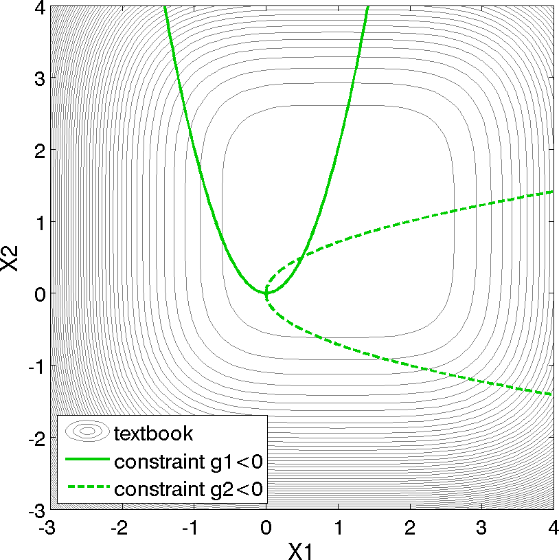
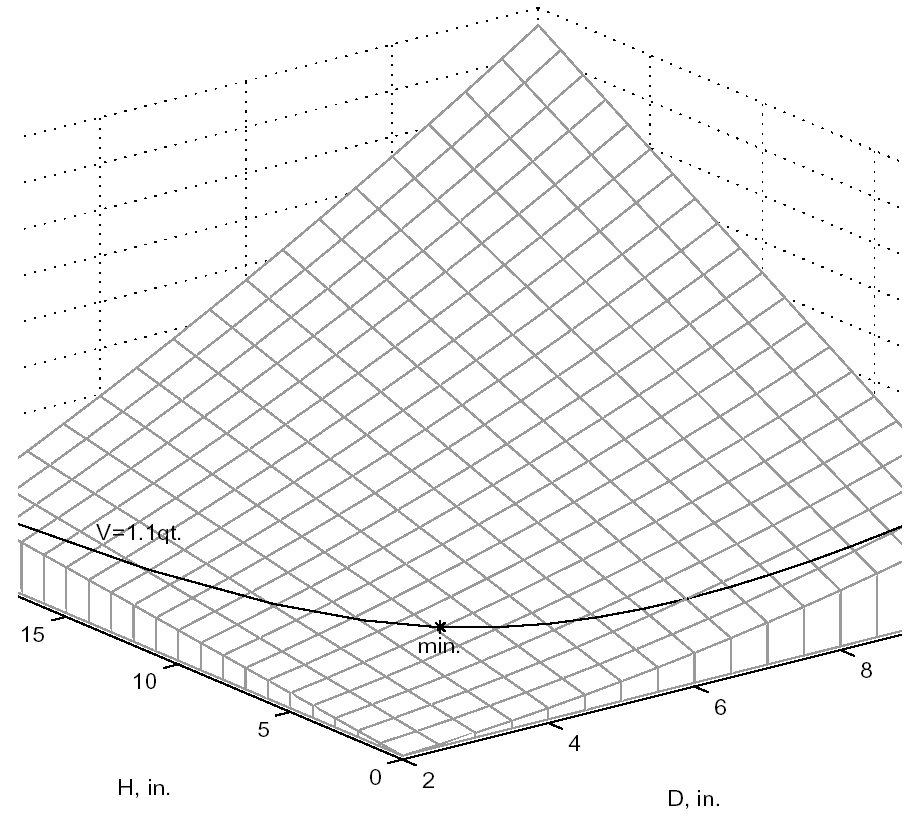
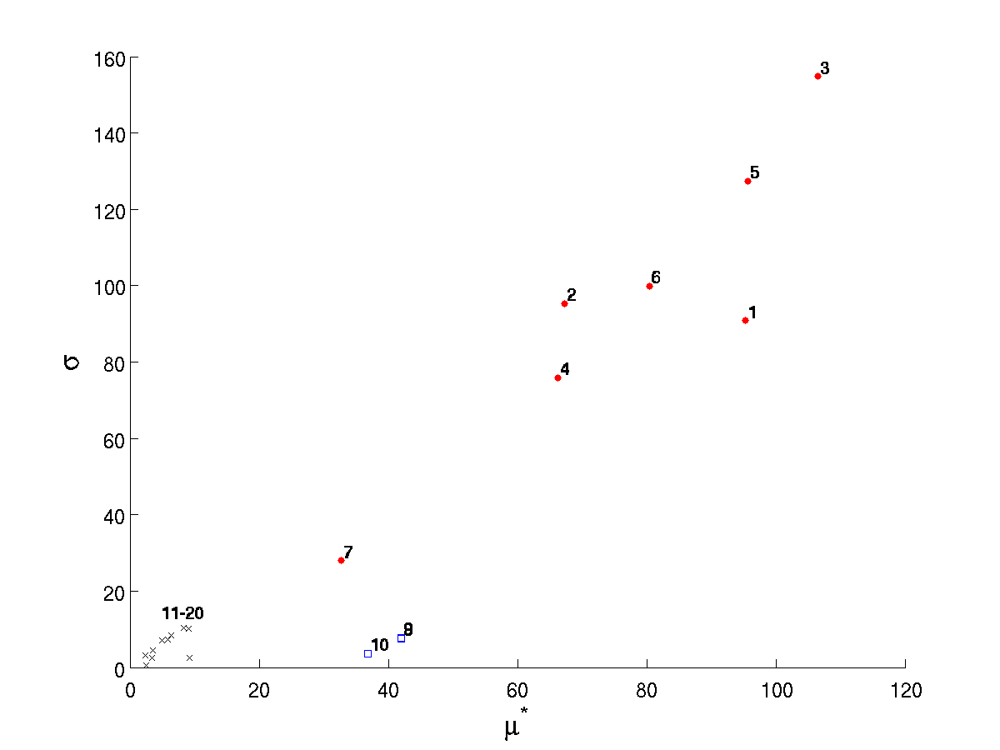
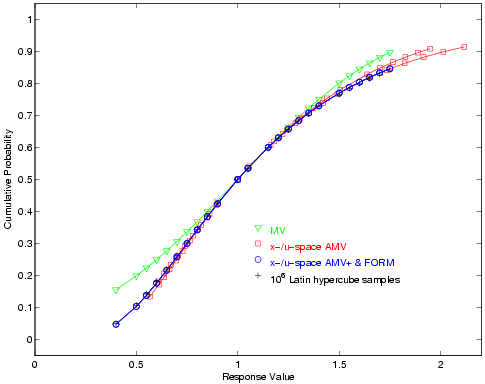
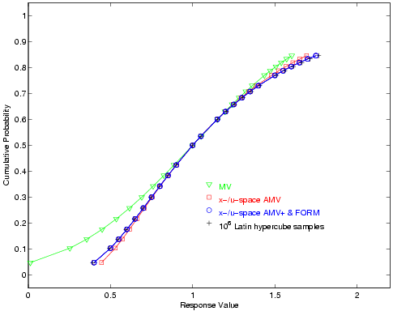

.. _additional:

Additional Examples
===================

This chapter contains additional examples of available methods being
applied to several test problems. The examples are organized by the
test problem being used. Many of these examples are also used as code
verification tests. The examples are run periodically and the results
are checked against known solutions. This ensures that the algorithms
are correctly implemented.

..
   TODO: Fix

   See Section `[intro:files] <#intro:files>`__ for help in finding
   the files referenced here.

.. _`additional:textbook`:

Textbook
--------

The two-variable version of the “textbook” test problem provides a
nonlinearly constrained optimization test case. It is formulated as:

.. math::
   :label: additional:textbook_f

   \texttt{minimize } & f = (x_1-1)^{4}+(x_2-1)^{4} \\
   \texttt{subject to } & g_1 = x_1^2-\frac{x_2}{2} \le 0 \\
   & g_2 = x_2^2-\frac{x_1}{2} \le 0 \\
   &  0.5 \le x_1 \le 5.8 \\
   & -2.9 \le x_2 \le 2.9

Contours of this test problem are illustrated in
:numref:`additional:textbook_contours`, with a close-up view of the
feasible region given in :numref:`additional:textbook_closeup`.

   Contours of the textbook problem on the :math:`[-3,4] \times
   [-3,4]` domain with the constrained optimum point :math:`(x_1,x_2)
   = (0.5,0.5)`. The feasible region lies at the intersection of the
   two constraints :math:`g_1` (solid) and :math:`g_2` (dashed).

.. figure:: img/textbook_closeup.png
   :name: additional:textbook_closeup
   :align: center
   :width: 25%

   Contours of the textbook problem zoomed into an area containing the
   constrained optimum point :math:`(x_1,x_2) = (0.5,0.5)`. The
   feasible region lies at the intersection of the two constraints
   :math:`g_1` (solid) and :math:`g_2` (dashed).

For the textbook test problem, the unconstrained minimum occurs at
:math:`(x_1,x_2) = (1,1)`. However, the inclusion of the constraints
moves the minimum to :math:`(x_1,x_2) = (0.5,0.5)`.  Equation
:eq:`additional:textbook_f` presents the 2-dimensional form of the
textbook problem. An extended formulation is given by

.. math::
   :label: additional:tbe

   \texttt{minimize }   & f = \sum_{i=1}^{n}(x_i-1)^4 \\
   \texttt{subject to } & g_1 = x_1^2-\frac{x_2}{2} \leq 0 \\
   & g_2=x_2^2-\frac{x_1}{2} \leq 0 \\
   & 0.5 \leq x_1 \leq 5.8 \\
   & -2.9 \leq x_2 \leq 2.9 \\

where :math:`n` is the number of design variables. The objective
function is designed to accommodate an arbitrary number of design
variables in order to allow flexible testing of a variety of data sets.
Contour plots for the :math:`n=2` case have been shown previously in
:numref:`additional:textbook_contours`.

For the optimization problem given in Equation :eq:`additional:tbe`,
the unconstrained solution ``num_nonlinear_inequality_constraints =
0`` for two design variables is:

.. math::

   x_1 &= 1.0 \\
   x_2 &= 1.0

with

.. math::

   f^{\ast} = 0.0

The solution for the optimization problem constrained by :math:`g_1`
(``num_nonlinear_inequality_constraints = 1``) is:

.. math::

   x_1 &= 0.763 \\
   x_2 &= 1.16

with

.. math::

   f^{\ast} &= 0.00388 \\
   g_1^{\ast} &= 0.0 ~~\mathrm{(active)}

The solution for the optimization problem constrained by :math:`g_1`
and :math:`g_2` (``num_nonlinear_inequality_constraints = 2``) is:

.. math::

   x_1 &= 0.500 \\
   x_2 &= 0.500

with

.. math::

   f^{\ast} &= 0.125 \\
   g_1^{\ast} &= 0.0 ~~\mathrm{(active)}
   g_2^{\ast} &= 0.0 ~~\mathrm{(active)}

Note that as constraints are added, the design freedom is restricted
(the additional constraints are active at the solution) and an increase
in the optimal objective function is observed.

.. _`additional:textbook:examples:gradient2`:

Gradient-based Constrained Optimization
~~~~~~~~~~~~~~~~~~~~~~~~~~~~~~~~~~~~~~~

..
   TODO:
   %as of 130124 the example results do NOT match the words in this manual.
   %this cannot be fixed without changing the test input file

This example demonstrates the use of a gradient-based optimization
algorithm on a nonlinearly constrained problem. The Dakota input file
for this example is shown in
:numref:`additional:textbook_grad_constr`.  This input file is similar
to the input file for the unconstrained gradient-based optimization
example involving the Rosenbrock function, seen in
:ref:`examples-gettingstarted-optimization` Note the addition of
commands in the responses block of the input file that identify the
number and type of constraints, along with the upper bounds on these
constraints. The commands ``direct`` and ``analysis_driver =
’text_book’`` specify that Dakota will use its internal version of the
textbook problem.

.. literalinclude:: ../samples/textbook_opt_conmin.in
   :language: dakota
   :tab-width: 2
   :caption: Textbook gradient-based constrained optimization example:
       the Dakota input file -- see
       ``dakota/share/dakota/examples/users/textbook_opt_conmin.in``
   :name: additional:textbook_grad_constr

The ``conmin_mfd`` keyword in
:numref:`additional:textbook_grad_constr` tells Dakota to use the
CONMIN package’s implementation of the Method of Feasible Directions
(see :ref:`opt:methods:gradient:constrained` for more details). A
significantly faster alternative is the DOT package’s Modified Method
of Feasible Directions, i.e. ``dot_mmfd`` (see
:ref:`opt:methods:gradient:constrained` for more details). However,
DOT is licensed software that may not be available on a particular
system. If it is installed on your system and Dakota has been
configured and compiled with ``HAVE_DOT:BOOL=ON`` flag, you may use it
by commenting out the line with ``conmin_mfd`` and uncommenting the
line with ``dot_mmfd``.

The results of the optimization example are listed at the end of the
output file (see discussion in :ref:`helloworld-results`).  This
information shows that the optimizer stopped at the point
:math:`(x_1,x_2) = (0.5,0.5)`, where both constraints are
approximately satisfied, and where the objective function value is
:math:`0.128`. The progress of the optimization algorithm is shown in
:numref:`additional:textbook_grad_constr_graphics_iterhist` where the
dots correspond to the end points of each iteration in the
algorithm. The starting point is :math:`(x_1,x_2) = (0.9,1.1)`, where
both constraints are violated. The optimizer takes a sequence of steps
to minimize the objective function while reducing the infeasibility of
the constraints. Dakota’s legacy X Windows-based graphics for the
optimization are also shown in
:numref:`additional:textbook_grad_constr_graphics_obj`.

.. figure::  img/textbook_history.png
   :name: additional:textbook_grad_constr_graphics_iterhist
   :align: center
   :width: 40%

   Textbook gradient-based constrained optimization example: iteration
   history (iterations marked by solid dots).

.. figure::  img/textbook_opt_hist.png
   :name: additional:textbook_grad_constr_graphics_obj
   :align: center
   :width: 60%

   Textbook gradient-based constrained optimization example:
   screen capture of the legacy Dakota X Windows-based graphics
   shows how the objective function was reduced during the search for
   a feasible design point

.. _`additional:textbook:least`:

Least Squares Optimization
~~~~~~~~~~~~~~~~~~~~~~~~~~

..
   TODO: resolve the confusion while retaining the test problem, since
   it appears in other references across the manual.

   %khu 130124 - I don't see the point of this example.  it is confusing because
   %the formulation changes and the solution changes. it also replicates the
   %example w/ the Rosenbrock test function.

This test problem may also be used to exercise least squares
solution methods by modifying the problem formulation to:

.. math::
   :label: additional:tbls

   \texttt{minimize } (f)^2+(g_1)^2+(g_2)^2

This modification is performed by simply changing the responses
specification for the three functions from ``num_objective_functions =
1`` and ``num_nonlinear_inequality_constraints = 2`` to
``num_least_squares_terms = 3``. Note that the two problem
formulations are not equivalent and have different solutions.

.. note::

   Another way to exercise the least squares methods which would be
   equivalent to the optimization formulation would be to select the
   residual functions to be :math:`(x_{i}-1)^2`. However, this formulation
   requires modification to :file:`dakota_source/test/text_book.cpp` and will
   not be presented here. Equation :eq:`additional:tbls`, on the other
   hand, can use the existing ``text_book`` without modification.

Refer to :ref:`additional:rosenbrock` for an example of
minimizing the same objective function using both optimization and
least squares approaches.

The solution for the least squares problem given in
:eq:`additional:tbls` is:

.. math::

   x_1 &= 0.566 \\
   x_2 &= 0.566

with the residual functions equal to

.. math::

   f^{\ast} &= 0.0713 \\
   g_1^{\ast} &= 0.0371 \\
   g_2^{\ast} &= 0.0371

and therefore a sum of squares equal to 0.00783.

This study requires selection of ``num_least_squares_terms = 3`` in
the responses specification and selection of either
``optpp_g_newton``, ``nlssol_sqp``, or ``nl2sol`` in the method
specification.

.. _`additional:rosenbrock`:

Rosenbrock
----------

The Rosenbrock function :cite:p:`Gil81` is a well known test problem
for optimization algorithms. The standard formulation includes two
design variables, and computes a single objective function, while
generalizations can support arbitrary many design variables. This
problem can also be posed as a least-squares optimization problem with
two residuals to be minimized because the objective function is
comprised of a sum of squared terms.

**Standard Formulation:** The standard two-dimensional formulation is

.. math::
   :label: additional:rosenstd

   \texttt{minimize } f(x) = 100(x_2-x_1^2)^2+(1-x_1)^2

Surface and contour plots for this function can be seen in
:ref:`examples-gettingstarted-rosenbrock`. The optimal solution is:

.. math::

   x_1 &= 1.0 \\
   x_2 &= 1.0

with

.. math::

   f^{\ast} = 0.0

A discussion of gradient based optimization to minimize this function is
in :ref:`examples-gettingstarted-optimization`

**"Extended" Formulation:** The formulation in :cite:p:`Noc99`, called
the "extended Rosenbrock", is defined by:

.. math::
   :label: additional:rosenexd

   f = \sum_{i=1}^{n/2} \left[ \alpha (x_{2i}-x_{2i-1}^2)^2+(1-x_{2i-1})^2 \right]

**"Generalized" Formulation:** Another n-dimensional formulation was
propsed in :cite:p:`Sch87`:

.. math::
   :label: additional:rosengen

   f = \sum_{i=1}^{n-1} \left[ 100 (x_{i+1}-x_i^2)^2+(1-x_i)^2 \right]

..
   TODO: Not sure why this is in this section...
   \begin{equation}
   f = \sum_{i=1}^{n/2} \left[ e^{-x^2_{2i-1}} + 10 e^{-x^2_{2i}} \right]
   \label{additional:gerstner_aniso1}
   \end{equation}
   \begin{equation}
   f = exp\left(-\sum_{i=1}^{n/2} \left[ 10 x^2_{2i-1} + 5 x^2_{2i} \right]\right)
   \label{additional:gerstner_aniso3}
   \end{equation}

**A Least-Squares Optimization Formulation:** This test problem may
also be used to exercise least-squares solution methods by recasting
the standard problem formulation into:

.. math::
   :label: additional:rosenls

   \texttt{minimize } f(x) = (f_1)^2+(f_2)^2

where

.. math::
   :label: additional:rosenr1

    f_1 = 10 (x_2 - x_1^2)

and

.. math::
   :label: additional:rosenr2

   f_2 = 1 - x_1

are residual terms.

The included analysis driver can handle both formulations. In the
``dakota/share/dakota/test`` directory, the ``rosenbrock`` executable
(compiled from ``dakota_source/test/rosenbrock.cpp``) checks the
number of response functions passed in the parameters file and returns
either an objective function (as computed from
:eq:`additional:rosenstd`) for use with optimization methods or two
least squares terms (as computed from :eq:`additional:rosenr1` and
:eq:`additional:rosenr2`) for use with least squares methods. Both
cases support analytic gradients of the function set with respect to
the design variables. See :numref:`tutorial:rosenbrock_grad` (standard
formulation) and :numref:`additional:rosenbrock_nls` (least squares
formulation) for usage examples.

.. _`additional:rosenbrock:examples:lsq`:

Least-Squares Optimization
~~~~~~~~~~~~~~~~~~~~~~~~~~

Least squares methods are often used for calibration or parameter
estimation, that is, to seek parameters maximizing agreement of models
with experimental data. The least-squares formulation was described in
the previous section.

When using a least-squares approach to minimize a function, each of
the least-squares terms :math:`f_1, f_2,\ldots` is driven toward
zero. This formulation permits the use of specialized algorithms that
can be more efficient than general purpose optimization
algorithms. See :ref:`nls` for more detail on the algorithms used for
least-squares minimization, as well as a discussion on the types of
engineering design problems (e.g., parameter estimation) that can make
use of the least-squares approach.

:numref:`additional:rosenbrock_nls` is a listing of the Dakota input
file ``rosen_opt_nls.in``.  This differs from the input file shown in
:ref:`tutorial:rosenbrock_grad` in several key areas. The responses
block of the input file uses the keyword ``calibration_terms = 2``
instead of ``objective_functions = 1``. The method block of the input
file shows that the NL2SOL algorithm :cite:p:`Den81` (``nl2sol``) is
used in this example. (The Gauss-Newton, NL2SOL, and NLSSOL SQP
algorithms are currently available for exploiting the special
mathematical structure of least squares minimization problems).

.. literalinclude:: ../samples/rosen_opt_nls.in
   :language: dakota
   :tab-width: 2
   :caption: Rosenbrock nonlinear least squares example: the Dakota
       input file -- see
       ``dakota/share/dakota/examples/users/rosen_opt_nls.in``
   :name: additional:rosenbrock_nls

The results at the end of the output file show that the least squares
minimization approach has found the same optimum design point,
:math:`(x1,x2) = (1.0,1.0)`, as was found using the conventional
gradient-based optimization approach. The iteration history of the
least squares minimization is shown in
:numref:`additional:rosenbrock_nls_graphics`, and shows that 14
function evaluations were needed for convergence. In this example the
least squares approach required about half the number of function
evaluations as did conventional gradient-based optimization. In many
cases a good least squares algorithm will converge more rapidly in the
vicinity of the solution.

.. figure:: img/nonlin_paramest_hist.png
   :alt: Rosenbrock nonlinear least squares example: iteration history
         for least squares terms :math:`f_1` and :math:`f_2`.
   :name: additional:rosenbrock_nls_graphics
   :width: 30%
   :align: center

   Rosenbrock nonlinear least squares example: iteration history for
   least squares terms :math:`f_1` and :math:`f_2`.

Method Comparison
~~~~~~~~~~~~~~~~~

..
   TODO: Per khu, consider moving this discussion to a methods section
   and making this chapter focus more on test problems...

In comparing the two approaches, one would expect the Gauss-Newton
approach to be more efficient since it exploits the special-structure
of a least squares objective function and, in this problem, the
Gauss-Newton Hessian is a good approximation since the least squares
residuals are zero at the solution. From a good initial guess, this
expected behavior is clearly demonstrated. Starting from
``cdv_initial_point = 0.8, 0.7``, the ``optpp_g_newton`` method
converges in only 3 function and gradient evaluations while the
``optpp_q_newton`` method requires 27 function and gradient
evaluations to achieve similar accuracy. Starting from a poorer
initial guess (e.g., ``cdv_initial_point = -1.2, 1.0``), the trend is
less obvious since both methods spend several evaluations finding the
vicinity of the minimum (total function and gradient evaluations = 45
for ``optpp_q_newton`` and 29 for ``optpp_g_newton``). However, once
the vicinity is located and the Hessian approximation becomes
accurate, convergence is much more rapid with the Gauss-Newton
approach.

Shown below is the complete Dakota output for the ``optpp_g_newton``
method starting from ``cdv_initial_point = 0.8, 0.7``:

::

   Running MPI executable in serial mode.
   Dakota version 6.0 release.
   Subversion revision xxxx built May ...
   Writing new restart file dakota.rst
   gradientType = analytic
   hessianType = none
   
   >>>>> Executing environment.
   
   >>>>> Running optpp_g_newton iterator.
   
   ------------------------------
   Begin Function Evaluation    1
   ------------------------------
   Parameters for function evaluation 1:
                         8.0000000000e-01 x1
                         7.0000000000e-01 x2
   
   rosenbrock /tmp/file4t29aW /tmp/filezGeFpF
   
   Active response data for function evaluation 1:
   Active set vector = { 3 3 } Deriv vars vector = { 1 2 }
                         6.0000000000e-01 least_sq_term_1
                         2.0000000000e-01 least_sq_term_2
    [ -1.6000000000e+01  1.0000000000e+01 ] least_sq_term_1 gradient
    [ -1.0000000000e+00  0.0000000000e+00 ] least_sq_term_2 gradient
   
   
   
   
   ------------------------------
   Begin Function Evaluation    2
   ------------------------------
   Parameters for function evaluation 2:
                         9.9999528206e-01 x1
                         9.5999243139e-01 x2
   
   rosenbrock /tmp/fileSaxQHo /tmp/fileHnU1Z7
   
   Active response data for function evaluation 2:
   Active set vector = { 3 3 } Deriv vars vector = { 1 2 }
                        -3.9998132761e-01 least_sq_term_1
                         4.7179363810e-06 least_sq_term_2
    [ -1.9999905641e+01  1.0000000000e+01 ] least_sq_term_1 gradient
    [ -1.0000000000e+00  0.0000000000e+00 ] least_sq_term_2 gradient
   
   
   
   
   ------------------------------
   Begin Function Evaluation    3
   ------------------------------
   Parameters for function evaluation 3:
                         9.9999904377e-01 x1
                         9.9999808276e-01 x2
   
   rosenbrock /tmp/filedtRtlR /tmp/file3kUVGA
   
   Active response data for function evaluation 3:
   Active set vector = { 3 3 } Deriv vars vector = { 1 2 }
                        -4.7950734494e-08 least_sq_term_1
                         9.5622502239e-07 least_sq_term_2
    [ -1.9999980875e+01  1.0000000000e+01 ] least_sq_term_1 gradient
    [ -1.0000000000e+00  0.0000000000e+00 ] least_sq_term_2 gradient
   
   
   
   
   ------------------------------
   Begin Function Evaluation    4
   ------------------------------
   Parameters for function evaluation 4:
                         9.9999904377e-01 x1
                         9.9999808276e-01 x2
   
   Duplication detected: analysis_drivers not invoked.
   
   Active response data retrieved from database:
   Active set vector = { 2 2 } Deriv vars vector = { 1 2 }
    [ -1.9999980875e+01  1.0000000000e+01 ] least_sq_term_1 gradient
    [ -1.0000000000e+00  0.0000000000e+00 ] least_sq_term_2 gradient
   
   
   <<<<< Function evaluation summary: 4 total (3 new, 1 duplicate)
   <<<<< Best parameters          =
                         9.9999904377e-01 x1
                         9.9999808276e-01 x2
   <<<<< Best residual norm =  9.5742653315e-07; 0.5 * norm^2 =  4.5833278319e-13
   <<<<< Best residual terms      =
                        -4.7950734494e-08
                         9.5622502239e-07
   <<<<< Best evaluation ID: 3
   Confidence Interval for x1 is [  9.9998687852e-01,  1.0000112090e+00 ]
   Confidence Interval for x2 is [  9.9997372187e-01,  1.0000224436e+00 ]
   
   <<<<< Iterator optpp_g_newton completed.
   <<<<< Environment execution completed.
   Dakota execution time in seconds:
     Total CPU        =       0.01 [parent =   0.017997, child =  -0.007997]
     Total wall clock =  0.0672231

Herbie, Smooth Herbie, and Shubert
----------------------------------

Lee, et al. :cite:p:`herbiefunc` developed the Herbie function
as a 2D test problem for surrogate-based optimization. However, since it
is separable and each dimension is identical it is easily generalized to
an arbitrary number of dimensions. The generalized (to :math:`M`
dimensions) Herbie function is

.. math:: {\rm herb}(x)=-\prod_{k=1}^M w_{herb}\left(x_k\right)

where

.. math:: w_{herb}\left(x_k\right)=\exp(-(x_k-1)^2)+\exp(-0.8(x_k+1)^2)-0.05\sin\left(8\left(x_k+0.1\right)\right).

The Herbie function’s high frequency sine component creates a large
number of local minima and maxima, making it a significantly more
challenging test problem. However, when testing a method’s ability to
exploit smoothness in the true response, it is desirable to have a less
oscillatory function. For this reason, the “smooth Herbie” test function
omits the high frequency sine term but is otherwise identical to the
Herbie function. The formula for smooth Herbie is

.. math:: {\rm herb_{sm}}(x)=-\prod_{k=1}^M w_{sm}\left(x_k\right)

where

.. math:: w_{sm}\left(x_k\right)=\exp(-(x_k-1)^2)+\exp(-0.8(x_k+1)^2).

Two dimensional versions of the ``herbie`` and ``smooth_herbie`` test
functions are plotted in :numref:`fig:2D_herbie__smooth_herbie`.

.. figure:: img/DAK5pt2_2D__herbie__smooth_herbie.png
   :align: center
   :width: 60%
   :alt: Plots of the ``herbie`` (left) and ``smooth_herbie`` (right)
         test functions in 2 dimensions. They can accept an arbitrary number
         of inputs. The direction of the z-axis has been reversed (negative is
         up) to better view the functions’ minima.
   :name: fig:2D_herbie__smooth_herbie

   Plots of the ``herbie`` (left) and ``smooth_herbie`` (right) test
   functions in 2 dimensions. They can accept an arbitrary number of
   inputs. The direction of the z-axis has been reversed (negative is
   up) to better view the functions’ minima.

Shubert is another separable (and therefore arbitrary dimensional) test
function. Its analytical formula is

.. math::

   {\rm shu}(x) &= \prod_{k=1}^M w_{shu}\left(x_k\right) \\
   w_{shu}\left(x_k\right) &= \sum_{i=1}^5 i\cos((i+1)x_k+i)

The 2D version of the ``shubert`` function is shown in
:numref:`fig:2D_shubert`.

.. figure:: img/DAK5pt2_2D_shubert.png
   :align: center
   :width: 40%
   :alt: Plot of the ``shubert`` test function in 2 dimensions. It can
         accept an arbitrary number of inputs.
   :name: fig:2D_shubert

   Plot of the ``shubert`` test function in 2 dimensions. It can accept
   an arbitrary number of inputs.

Efficient Global Optimization
~~~~~~~~~~~~~~~~~~~~~~~~~~~~~

The Dakota input file ``herbie_shubert_opt_ego.in`` 
shows how to use efficient global optimization
(EGO) to minimize the 5D version of any of these 3 separable functions.
The input file is shown in
:numref:`additional:herbie_shubert_ego`.
Note that in the variables section the ``5*`` preceding the values -2.0
and 2.0 for the ``lower_bounds`` and ``upper_bounds``, respectively,
tells Dakota to repeat them 5 times. The “interesting” region for each
of these functions is :math:`-2\le x_k \le 2` for all dimensions.

.. literalinclude:: ../samples/herbie_shubert_opt_ego.in
   :language: dakota
   :tab-width: 2
   :caption: Herbie/Shubert examples: the Dakota input file -- see
       ``dakota/share/dakota/examples/users/herbie_shubert_opt_ego.in``
   :name: additional:herbie_shubert_ego

Sobol and Ishigami Functions
----------------------------

These functions, documented in :cite:p:`storlie_09`, are often used to
test sensitivity analysis methods.  The Sobol rational function is
given by the equation:

.. math:: f({\bf x})=\frac{(x_2+0.5)^4}{(x_1+0.5)^4}

This function is monotonic across each of the inputs. However, there
is substantial interaction between :math:`x_1` and :math:`x_2` which
makes sensitivity analysis difficult. This function in shown in
:numref:`fig:sobol_rational`.

.. figure:: img/sobol_rational.png
   :align: center
   :width: 50%
   :alt: Plot of the ``sobol_rational`` test function in 2 dimensions.
   :name: fig:sobol_rational

   Plot of the ``sobol_rational`` test function in 2 dimensions.

The Ishigami test problem is a smooth :math:`C^{\infty}` function:

.. math::

   f({\bf x}) = \sin(2 \pi x_1 - \pi) + 7 \sin^2(2 \pi x_2 - \pi) 
   + 0.1(2 \pi x_3 - \pi)^4 \sin(2 \pi x_1 - \pi)

where the distributions for :math:`x_1`, :math:`x_2`, and :math:`x_3`
are *iid* uniform on [0,1]. This function was created as a test for
global sensitivity analysis methods, but is challenging for any method
based on low-order structured grids (e.g., due to term cancellation at
midpoints and bounds). This function in shown in
:numref:`fig:sobol_ishigami`.

.. figure:: img/sobol_ishigami.png
   :align: center
   :width: 50%
   :alt: Plot of the ``sobol_ishigami`` test function as a function of
         x1 and x3.
   :name: fig:sobol_ishigami

   Plot of the ``sobol_ishigami`` test function as a function of x1 and
   x3.

At the opposite end of the smoothness spectrum, Sobol’s g-function is
:math:`C^0` with the absolute value contributing a slope discontinuity
at the center of the domain:

.. math::

   f({\bf x}) = 2 \prod_{j=1}^5 \frac{|4x_j - 2| + a_j}{1+a_j};
   ~~~a = [0, 1, 2, 4, 8]

The distributions for :math:`x_j` for :math:`j=1,2,3,4,5` are *iid*
uniform on [0,1]. This function in shown in
:numref:`fig:sobol_g_function`.

.. figure:: img/sobol_g_function.png
   :align: center
   :width: 50%
   :alt: Plot of the ``sobol_g_function`` test function.
   :name: fig:sobol_g_function

   Plot of the ``sobol_g_function`` test function.

.. _`additional:cylinder`:

Cylinder Head
-------------

The cylinder head test problem is stated as:

.. math::
   :label: additional:cylhead

   \texttt{minimize } & f=-1\bigg(\frac{\mathtt{horsepower}}{250}+
   \frac{\mathtt{warranty}}{100000}\bigg) \\
   \texttt{subject to } & \sigma_{max} \leq 0.5 \sigma_{yield} \\
                        & \mathtt{warranty} \geq 100000 \\
                        & \mathtt{time_{cycle}} \leq 60 \\
                        & 1.5 \leq \mathtt{d_{intake}} \leq 2.164 \\
                        & 0.0 \leq \mathtt{flatness} \leq 4.0

This formulation seeks to simultaneously maximize normalized engine
horsepower and engine warranty over variables of valve intake diameter
(:math:`\mathtt{d_{intake}}`) in inches and overall head flatness
(:math:`\mathtt{flatness}`) in thousandths of an inch subject to
inequality constraints that the maximum stress cannot exceed half of
yield, that warranty must be at least 100000 miles, and that
manufacturing cycle time must be less than 60 seconds. Since the
constraints involve different scales, they should be
nondimensionalized (note: the nonlinear constraint scaling described
in :ref:`opt:additional:scaling` can now do this automatically). In
addition, they can be converted to the standard 1-sided form
:math:`g(\mathbf{x}) \leq 0` as follows:

.. math::
   :label: additional:cylheadaltg

   & & g_1=\frac{2\sigma_{\mathtt{max}}}{\sigma_{\mathtt{yield}}}-1 \leq 0 \\
   & & g_2=1-\frac{\mathtt{warranty}}{100000} \leq 0 \\
   & & g_3=\frac{\mathtt{time_{cycle}}}{60}-1 \leq 0

The objective function and constraints are related analytically to the
design variables according to the following simple expressions:

.. math::
   :label: additional:cylheadexp

   \mathtt{warranty}     &= 100000+15000(4-\mathtt{flatness}) \\
   \mathtt{time_{cycle}} &= 45+4.5(4-\mathtt{flatness})^{1.5} \\
   \mathtt{horsepower}   &= 250+200\bigg(\frac{\mathtt{d_{intake}}}{1.833}-1\bigg) \\
   \sigma_{\mathtt{max}} &= 750+\frac{1}{(\mathtt{t_{wall}})^{2.5}} \\
   \mathtt{t_{wall}}     &= \mathtt{offset_{intake}-offset_{exhaust}}-
     \frac{(\mathtt{d_{intake}+d_{exhaust}})}{2}

where the constants in :eq:`additional:cylheadaltg` and
:eq:`additional:cylheadexp` assume the following values:
:math:`\sigma_{\mathtt{yield}}=3000`,
:math:`\mathtt{offset_{intake}}=3.25`,
:math:`\mathtt{offset_{exhaust}}=1.34`, and
:math:`\mathtt{d_{exhaust}}=1.556`.

Constrained Gradient Based Optimization
~~~~~~~~~~~~~~~~~~~~~~~~~~~~~~~~~~~~~~~

An example using the cylinder head test problem is shown below:

.. literalinclude:: ../samples/cylhead_opt_npsol.in
   :language: dakota
   :tab-width: 2
   :caption: Cylinder Head Example: the Dakota input file -- see
       ``dakota/share/dakota/examples/users/cylhead_opt_npsol.in``
   :name: additional:cylinder_head

The interface keyword specifies use of the ``cyl_head`` executable
(compiled from ``dakota_source/test/cyl_head.cpp``)
as the simulator. The variables and responses keywords
specify the data sets to be used in the iteration by providing the
initial point, descriptors, and upper and lower bounds for two
continuous design variables and by specifying the use of one objective
function, three inequality constraints, and numerical gradients in the
problem. The method keyword specifies the use of the ``npsol_sqp``
method to solve this constrained optimization problem. No environment
keyword is specified, so the default ``single_method`` approach is used.

The solution for the constrained optimization problem is:

.. math::

   \mathrm{intake\_dia} &= 2.122 \\
   \mathrm{flatness}    &= 1.769

with

.. math::

   f^{\ast} &= -2.461 \\
   g_1^{\ast} &=  0.0    ~~\mathrm{(active)} \\
   g_2^{\ast} &= -0.3347 ~~\mathrm{(inactive)} \\
   g_3^{\ast} &=  0.0    ~~\mathrm{(active)}

which corresponds to the following optimal response quantities:

.. math::

   \mathrm{warranty}        &= 133472 \\
   \mathrm{cycle\_time}     &= 60 \\
   \mathrm{wall\_thickness} &= 0.0707906 \\
   \mathrm{horse\_power}    &= 281.579 \\
   \mathrm{max\_stress}     &= 1500

The final report from the Dakota output is as follows:

::

       <<<<< Iterator npsol_sqp completed.
       <<<<< Function evaluation summary: 55 total (55 new, 0 duplicate)
       <<<<< Best parameters          =
                             2.1224188322e+00 intake_dia
                             1.7685568331e+00 flatness
       <<<<< Best objective function  =
                            -2.4610312954e+00
       <<<<< Best constraint values   =
                             1.8407497748e-13
                            -3.3471647504e-01
                             0.0000000000e+00
       <<<<< Best evaluation ID: 51
       <<<<< Environment execution completed.
       Dakota execution time in seconds:
         Total CPU        =       0.04 [parent =   0.031995, child =   0.008005]
         Total wall clock =   0.232134

.. _`additional:container`:

Container
---------

For this example, suppose that a high-volume manufacturer of light
weight steel containers wants to minimize the amount of raw sheet
material that must be used to manufacture a 1.1 quart cylindrical-shaped
can, including waste material. Material for the container walls and end
caps is stamped from stock sheet material of constant thickness. The
seal between the end caps and container wall is manufactured by a press
forming operation on the end caps. The end caps can then be attached to
the container wall forming a seal through a crimping operation.

.. figure:: img/end_cap.png
   :alt: Container wall-to-end-cap seal
   :name: additional:figure01
   :align: center
   :width: 30%

   Container wall-to-end-cap seal

For preliminary design purposes, the extra material that would normally
go into the container end cap seals is approximated by increasing the
cut dimensions of the end cap diameters by 12% and the height of the
container wall by 5%, and waste associated with stamping the end caps in
a specialized pattern from sheet stock is estimated as 15% of the cap
area. The equation for the area of the container materials including
waste is

.. math::

   A=2 \times \left(\begin{array}{c}
       \mathtt{end\hbox{ }cap}\\
       \mathtt{waste}\\
       \mathtt{material}\\
       \mathtt{factor}
     \end{array} \right)
   \times \left(\begin{array}{c}
       \mathtt{end\hbox{ }cap}\\
       \mathtt{seal}\\
       \mathtt{material}\\
       \mathtt{factor}
     \end{array} \right)
   \times \left(\begin{array}{c}
       \mathtt{nominal}\\
       \mathtt{end\hbox{ }cap}\\
       \mathtt{area}
     \end{array} \right)
   + \left(\begin{array}{c}
       \mathtt{container}\\
       \mathtt{wall\hbox{ }seal}\\
       \mathtt{material}\\
       \mathtt{factor}
     \end{array} \right)
   \times \left(\begin{array}{c}
       \mathtt{nominal}\\
       \mathtt{container}\\
       \mathtt{wall\hbox{ }area}
     \end{array} \right)

or

.. math::
   :label: additional:contA

   A = 2(1.15)(1.12)\pi\frac{D^2}{4}+(1.05)\pi DH

where :math:`D` and :math:`H` are the diameter and height of the
finished product in units of inches, respectively. The volume of the
finished product is specified to be

.. math::
   :label: additional:contV

   V=\pi\frac{D^2H}{4}=(1.1\mathtt{qt})(57.75 \mathtt{in}^3/\mathtt{qt})

The equation for area is the objective function for this problem; it is
to be minimized. The equation for volume is an equality constraint; it
must be satisfied at the conclusion of the optimization problem. Any
combination of :math:`D` and :math:`H` that satisfies the volume
constraint is a **feasible** solution (although not necessarily the
optimal solution) to the area minimization problem, and any combination
that does not satisfy the volume constraint is an **infeasible**
solution. The area that is a minimum subject to the volume constraint is
the **optimal** area, and the corresponding values for the parameters
:math:`D` and :math:`H` are the optimal parameter values.

It is important that the equations supplied to a numerical optimization
code be limited to generating only physically realizable values, since
an optimizer will not have the capability to differentiate between
meaningful and nonphysical parameter values. It is often up to the
engineer to supply these limits, usually in the form of parameter bound
constraints. For example, by observing the equations for the area
objective function and the volume constraint, it can be seen that by
allowing the diameter, :math:`D`, to become negative, it is
algebraically possible to generate relatively small values for the area
that also satisfy the volume constraint. Negative values for :math:`D`
are of course physically meaningless. Therefore, to ensure that the
numerically-solved optimization problem remains meaningful, a bound
constraint of :math:`-D \leq 0` must be included in the optimization
problem statement. A positive value for :math:`H` is implied since the
volume constraint could never be satisfied if :math:`H` were negative.
However, a bound constraint of :math:`-H \leq 0` can be added to the
optimization problem if desired. The optimization problem can then be
stated in a standardized form as

.. math::
   :label: additional:contFH

   \texttt{minimize}   & 2(1.15)(1.12)\pi\frac{D^2}{4}+(1.05)^2\pi DH \\
   \texttt{subject to} & \pi\frac{D^2H}{4}=
     (1.1\mathtt{qt})(57.75 \mathtt{in}^3/\mathtt{qt}) \\
                       & & -D \leq 0\hbox{, }-H \leq 0

A graphical view of the container optimization test problem appears in
:numref:`additional:figure02`. The 3-D surface defines the area,
:math:`A`, as a function of diameter and height. The curved line that
extends across the surface defines the areas that satisfy the volume
equality constraint, :math:`V`. Graphically, the container optimization
problem can be viewed as one of finding the point along the constraint
line with the smallest 3-D surface height in
Figure `1.8 <#additional:figure02>`__. This point corresponds to the
optimal values for diameter and height of the final product.

         problem.
   :name: additional:figure02
   :align: center
   :width: 40%

   A graphical representation of the container optimization problem.

.. _constrained-gradient-based-optimization-1:

Constrained Gradient Based Optimization
~~~~~~~~~~~~~~~~~~~~~~~~~~~~~~~~~~~~~~~

The input file for this example is named ``container_opt_npsol.in``.
The solution to this example
problem is :math:`(H,D)=(4.99,4.03)`, with a minimum area of 98.43
:math:`\mathtt{in}^2` .

The final report from the Dakota output is as follows:

::

       <<<<< Iterator npsol_sqp completed.
       <<<<< Function evaluation summary: 40 total (40 new, 0 duplicate)
       <<<<< Best parameters          =
                             4.9873894231e+00 H
                             4.0270846274e+00 D
       <<<<< Best objective function  =
                             9.8432498116e+01
       <<<<< Best constraint values   =
                            -9.6301439045e-12
       <<<<< Best evaluation ID: 36
       <<<<< Environment execution completed.
       Dakota execution time in seconds:
         Total CPU        =      0.18 [parent =      0.18, child =         0]
         Total wall clock =  0.809126

.. _`additional:cantilever`:

Cantilever
----------

This test problem is adapted from the reliability-based design
optimization literature:cite:p:`Sue01`, :cite:p:`Wu01` and involves a
simple uniform cantilever beam as shown in
:numref:`additional:figure03`.

.. figure:: img/cantilever_beam.png
   :alt: Cantilever beam test problem.
   :name: additional:figure03
   :align: center
   :width: 50%

   Cantilever beam test problem.

The design problem is to minimize the weight (or, equivalently, the
cross-sectional area) of the beam subject to a displacement constraint
and a stress constraint. Random variables in the problem include the
yield stress :math:`R` of the beam material, the Young’s modulus
:math:`E` of the material, and the horizontal and vertical loads,
:math:`X` and :math:`Y`, which are modeled with normal distributions
using :math:`N(40000, 2000)`, :math:`N(2.9E7, 1.45E6)`,
:math:`N(500, 100)`, and :math:`N(1000, 100)`, respectively. Problem
constants include :math:`L = 100\mathtt{in}` and :math:`D_{0} = 2.2535
\mathtt{in}`. The constraints have the following analytic form:

.. math::
   :label: additional:cant

   \mathtt{stress} &= \frac{600}{w t^2}Y+\frac{600}{w^2t}X \leq R \\
   \mathtt{displacement} &= \frac{4L^3}{E w t}
     \sqrt{\bigg(\frac{Y}{t^2}\bigg)^2+\bigg(\frac{X}{w^2}\bigg)^2}
     \leq D_{0}

or when scaled:

.. math::
   :label: additional:cantscale

   g_{S} &=\frac{\mathtt{stress}}{R}-1 \leq 0 \\
   g_{D} &=\frac{\mathtt{displacement}}{D_{0}}-1 \leq 0

**Deterministic Formulation:** If the random variables :math:`E`,
:math:`R`, :math:`X`, and :math:`Y` are fixed at their means, the
resulting deterministic design problem can be formulated as

.. math::
   :label: additional:cantopt

   \texttt{minimize }   & f = w t            \\
   \texttt{subject to } & g_{S} \leq 0       \\
                        & g_{D} \leq 0       \\
                        & 1.0 \leq w \leq 4.0 \\
                        & 1.0 \leq t \leq 4.0

**Stochastic Formulation:** If the normal distributions for the random
variables :math:`E`, :math:`R`, :math:`X`, and :math:`Y` are included,
a stochastic design problem can be formulated as

.. math::
   :label: additional:cantouu

   \texttt{minimize }   & f = w t            \\
   \texttt{subject to } & \beta_{D} \geq 3   \\ 
                        & \beta_{S} \geq 3   \\
                        & 1.0 \leq w \leq 4.0 \\
                        & 1.0 \leq t \leq 4.0 

where a 3-sigma reliability level (probability of failure = 0.00135 if
responses are normally-distributed) is being sought on the scaled
constraints.

.. _constrained-gradient-based-optimization-2:

Constrained Gradient Based Optimization
~~~~~~~~~~~~~~~~~~~~~~~~~~~~~~~~~~~~~~~

Here, the Cantilever test problem is solved using
``cantilever_opt_npsol.in``:

.. literalinclude:: ../samples/cantilever_opt_npsol.in
   :language: dakota
   :tab-width: 2
   :caption: Cantilever Example: the Dakota input file -- see
       ``dakota/share/dakota/examples/users/cantilever_opt_npsol.in``
   :name: additional:cant_opt_npsol

The deterministic solution is :math:`(w,t)=(2.35,3.33)` with an
objective function of :math:`7.82`. The final report from the Dakota
output is as follows:

::

       <<<<< Iterator npsol_sqp completed.
       <<<<< Function evaluation summary: 33 total (33 new, 0 duplicate)
       <<<<< Best parameters          =
                             2.3520341271e+00 beam_width
                             3.3262784077e+00 beam_thickness
                             4.0000000000e+04 R
                             2.9000000000e+07 E
                             5.0000000000e+02 X
                             1.0000000000e+03 Y
       <<<<< Best objective function  =
                             7.8235203313e+00
       <<<<< Best constraint values   =
                            -1.6009000260e-02
                            -3.7083558446e-11
       <<<<< Best evaluation ID: 31
       <<<<< Environment execution completed.
       Dakota execution time in seconds:
         Total CPU        =       0.03 [parent =   0.027995, child =   0.002005]
         Total wall clock =   0.281375

Optimization Under Uncertainty
~~~~~~~~~~~~~~~~~~~~~~~~~~~~~~

Optimization under uncertainty solutions to the stochastic problem are
described in :cite:p:`Eld02,Eld05,Eld06a`, for which the solution is
:math:`(w,t)=(2.45,3.88)` with an objective function of
:math:`9.52`. This demonstrates that a more conservative design is
needed to satisfy the probabilistic constraints.

.. _`additional:multiobjective`:

Multiobjective Test Problems
----------------------------

Multiobjective optimization means that there are two or more objective
functions that you wish to optimize simultaneously. Often these are
conflicting objectives, such as cost and performance. The answer to a
multi-objective problem is usually not a single point. Rather, it is a
set of points called the Pareto front. Each point on the Pareto front
satisfies the Pareto optimality criterion, i.e., locally there exists no
other feasible vector that would improve some objective without causing
a simultaneous worsening in at least one other objective. Thus a
feasible point :math:`X^\prime` from which small moves improve one or
more objectives without worsening any others is not Pareto optimal: it
is said to be “dominated” and the points along the Pareto front are said
to be “non-dominated”.

Often multi-objective problems are addressed by simply assigning weights
to the individual objectives, summing the weighted objectives, and
turning the problem into a single-objective one which can be solved with
a variety of optimization techniques. While this approach provides a
useful “first cut” analysis (and is supported within Dakota—see
Section `[opt:additional:multiobjective] <#opt:additional:multiobjective>`__),
this approach has many limitations. The major limitation is that a local
solver with a weighted sum objective will only find one point on the
Pareto front; if one wants to understand the effects of changing
weights, this method can be computationally expensive. Since each
optimization of a single weighted objective will find only one point on
the Pareto front, many optimizations must be performed to get a good
parametric understanding of the influence of the weights and to achieve
a good sampling of the entire Pareto frontier.

There are three examples that are taken from a multiobjective
evolutionary algorithm (MOEA) test suite described by Van Veldhuizen et.
al. in :cite:p:`Coe02`. These three examples illustrate the
different forms that the Pareto set may take. For each problem, we
describe the Dakota input and show a graph of the Pareto front. These
problems are all solved with the ``moga`` method. The first example is
discussed in
Section `[opt:additional:multiobjective] <#opt:additional:multiobjective>`__.
The next two are discussed below.
Section `[opt:additional:multiobjective] <#opt:additional:multiobjective>`__
provide more information on multiobjective optimization.

.. _`additional:multiobjective:problem2`:

Multiobjective Test Problem 2
~~~~~~~~~~~~~~~~~~~~~~~~~~~~~

The second test problem is a case where both :math:`\mathtt{P_{true}}`
and :math:`\mathtt{PF_{true}}` are disconnected.
:math:`\mathtt{PF_{true}}` has four separate Pareto curves. The problem
is to simultaneously optimize :math:`f_1` and :math:`f_2` given two
input variables, :math:`x_1` and :math:`x_2`, where the inputs are
bounded by :math:`0 \leq x_{i} \leq 1`, and:

.. math::

   \begin{aligned}
   f_1(x) &=& x_1 \\
   f_2(x) &=& (1+10x_2) \times \left[1-\bigg(\frac{x_1}{1+10x_2}\bigg)^2-
   \frac{x_1}{1+10x_2}\sin(8\pi x_1)\right]\end{aligned}

The input file for this example is shown in
:numref:`additional:moga2inp`, which
references the ``mogatest2`` executable (compiled from
``dakota_source/test/mogatest2.cpp``) as the
simulator. The Pareto front is shown in
Figure `1.10 <#additional:moga2front>`__. Note the discontinuous nature
of the front in this example.

.. literalinclude:: ../samples/mogatest2.in
   :language: dakota
   :tab-width: 2
   :caption: Dakota input file specifying the use of MOGA on mogatest2
       -- see ``dakota/share/dakota/examples/users/mogatest2.in``
   :name: additional:moga2inp

.. figure:: img/dakota_mogatest2_pareto_front.png
   :alt: Pareto Front showing Tradeoffs between Function F1 and Function
         F2 for mogatest2
   :name: additional:moga2front

   Pareto Front showing Tradeoffs between Function F1 and Function F2
   for mogatest2

.. _`additional:multiobjective:problem3`:

Multiobjective Test Problem 3
~~~~~~~~~~~~~~~~~~~~~~~~~~~~~

The third test problem is a case where :math:`\mathtt{P_{true}}` is
disconnected but :math:`\mathtt{PF_{true}}` is connected. This problem
also has two nonlinear constraints. The problem is to simultaneously
optimize :math:`f_1` and :math:`f_2` given two input variables,
:math:`x_1` and :math:`x_2`, where the inputs are bounded by
:math:`-20 \leq x_{i} \leq 20`, and:

.. math::

   \begin{aligned}
   f_1(x) &=& (x_1-2)^2+(x_2-1)^2+2 \\
   f_2(x) &=& 9x_1-(x_2-1)^2\end{aligned}

The constraints are:

.. math::

   \begin{aligned}
   0 &\leq& x_1^2+x_2^2-225 \\
   0 &\leq& x_1-3x_2+10\end{aligned}

The input file for this example is shown in
:numref:`additional:moga3inp`. It differs from
:numref:`additional:moga2inp` in the variables
and responses specifications, in the use of the ``mogatest3`` executable
(compiled from ``dakota_source/test/mogatest3.cpp``)
as the simulator, and in the
``max_function_evaluations`` and ``mutation_type`` MOGA controls. The
Pareto set is shown in Figure `1.11 <#additional:moga3set>`__. Note the
discontinuous nature of the Pareto set (in the design space) in this
example. The Pareto front is shown in
Figure `1.12 <#additional:moga3front>`__.

..
   TODO:
   %Again, note the unusual nature of this Pareto example (these figures
   %agree reasonably well with the Srinivas problem results shown in the
   %literature).

.. literalinclude:: ../samples/mogatest3.in
   :language: dakota
   :tab-width: 2
   :caption: Dakota input file specifying the use of MOGA on mogatest3
       -- see ``dakota/share/dakota/examples/users/mogatest3.in``
   :name: additional:moga3inp

.. figure:: img/dakota_mogatest3_pareto_set.png
   :alt: Pareto Set of Design Variables corresponding to the Pareto
         front for mogatest3
   :name: additional:moga3set

   Pareto Set of Design Variables corresponding to the Pareto front for
   mogatest3

.. figure:: img/dakota_mogatest3_pareto_front.png
   :alt: Pareto Front showing Tradeoffs between Function F1 and Function
         F2 for mogatest3
   :name: additional:moga3front

   Pareto Front showing Tradeoffs between Function F1 and Function F2
   for mogatest3

.. _`additional:morris`:

Morris
------

Morris :cite:p:`Mor91` includes a screening design test
problem with a single-output analytical test function. The output
depends on 20 inputs with first- through fourth-order interaction terms,
some having large fixed coefficients and others small random
coefficients. Thus the function values generated depend on the random
number generator employed in the function evaluator. The computational
model is:

.. math::

   \begin{aligned}
   y = &\;\beta_0 + \sum_{i=1}^{20}{\beta_i w_i} + \sum_{i<j}^{20}{\beta_{i,j} w_i w_j} + \sum_{i<j<l}^{20}{\beta_{i,j,l} w_i w_j w_l} \\
       &+  \sum_{i<j<l<s}^{20}{\beta_{i,j,l,s} w_i w_j w_l w_s},\end{aligned}

where :math:`w_i = 2(x_i-0.5)` except for
:math:`i=3, 5, \mbox{ and } 7`, where
:math:`w_i=2(1.1x_i/(x_i+0.1) - 0.5)`. Large-valued coefficients are
assigned as

.. math::

   \begin{aligned}
   &\beta_i = +20 & &i=1,\ldots,10; \;&\beta_{i,j} = -15& &i,j = 1, \ldots, 6; \\
   &\beta_{i,j,l} = -10& &i,j,l=1,\ldots,5; \;&\beta_{i,j,l,s} = +5& &i,j,l,s = 1, \ldots, 4.\end{aligned}

The remaining first- and second-order coefficients :math:`\beta_i` and
:math:`\beta_{i,j}`, respectively, are independently generated from a
standard normal distribution (zero mean and unit standard deviation);
the remaining third- and fourth-order coefficients are set to zero.

Examination of the test function reveals that one should be able to
conclude the following (stated and verified computationally
in :cite:p:`Sal04`) for this test problem:

#. the first ten factors are important;

#. of these, the first seven have significant effects involving either
   interactions or curvatures; and

#. the other three are important mainly because of their first-order
   effect.

Morris One-at-a-Time Sensitivity Study
~~~~~~~~~~~~~~~~~~~~~~~~~~~~~~~~~~~~~~

The dakota input ``morris_ps_moat.in`` exercises the MOAT algorithm described in
Section `[dace:psuade] <#dace:psuade>`__ on the Morris problem. The
Dakota output obtained is shown in
Figures `[FIG:moat:out_preamble] <#FIG:moat:out_preamble>`__
and `[FIG:moat:out_results] <#FIG:moat:out_results>`__.

::

   Running MPI executable in serial mode.
   Dakota version 6.0 release.
   Subversion revision xxxx built May ...
   Writing new restart file dakota.rst
   gradientType = none
   hessianType = none

   >>>>> Executing environment.

   >>>>> Running psuade_moat iterator.

   PSUADE DACE method = psuade_moat Samples = 84 Seed (user-specified) = 500
               Partitions = 3 (Levels = 4)

::

   >>>>>> PSUADE MOAT output for function 0:

   *************************************************************
   *********************** MOAT Analysis ***********************
   -------------------------------------------------------------
   Input   1 (mod. mean & std) =   9.5329e+01   9.0823e+01
   Input   2 (mod. mean & std) =   6.7297e+01   9.5242e+01
   Input   3 (mod. mean & std) =   1.0648e+02   1.5479e+02
   Input   4 (mod. mean & std) =   6.6231e+01   7.5895e+01
   Input   5 (mod. mean & std) =   9.5717e+01   1.2733e+02
   Input   6 (mod. mean & std) =   8.0394e+01   9.9959e+01
   Input   7 (mod. mean & std) =   3.2722e+01   2.7947e+01
   Input   8 (mod. mean & std) =   4.2013e+01   7.6090e+00
   Input   9 (mod. mean & std) =   4.1965e+01   7.8535e+00
   Input  10 (mod. mean & std) =   3.6809e+01   3.6151e+00
   Input  11 (mod. mean & std) =   8.2655e+00   1.0311e+01
   Input  12 (mod. mean & std) =   4.9299e+00   7.0591e+00
   Input  13 (mod. mean & std) =   3.5455e+00   4.4025e+00
   Input  14 (mod. mean & std) =   3.4151e+00   2.4905e+00
   Input  15 (mod. mean & std) =   2.5143e+00   5.5168e-01
   Input  16 (mod. mean & std) =   9.0344e+00   1.0115e+01
   Input  17 (mod. mean & std) =   6.4357e+00   8.3820e+00
   Input  18 (mod. mean & std) =   9.1886e+00   2.5373e+00
   Input  19 (mod. mean & std) =   2.4105e+00   3.1102e+00
   Input  20 (mod. mean & std) =   5.8234e+00   7.2403e+00
   <<<<< Function evaluation summary: 84 total (84 new, 0 duplicate)

The MOAT analysis output reveals that each of the desired observations
can be made for the test problem. These are also reflected in
Figure `1.13 <#FIG:mustar_sigma>`__. The modified mean (based on
averaging absolute values of elementary effects) shows a clear
difference in inputs 1–10 as compared to inputs 11–20. The standard
deviation of the (signed) elementary effects indicates correctly that
inputs 1–7 have substantial interaction-based or nonlinear effect on the
output, while the others have less. While some of inputs 11–20 have
nontrivial values of :math:`\sigma`, their relatively small modified
means :math:`\mu^*` indicate they have little overall influence.

         plotted against modified mean for Morris for each of 20 inputs. Red
         circles 1–7 correspond to inputs having interactions or nonlinear
         effects, blue squares 8–10 indicate those with mainly linear effects,
         and black Xs denote insignificant inputs.
   :name: FIG:mustar_sigma

   [FIG:mustar_sigma] Standard deviation of elementary effects plotted
   against modified mean for Morris for each of 20 inputs. Red circles
   1–7 correspond to inputs having interactions or nonlinear effects,
   blue squares 8–10 indicate those with mainly linear effects, and
   black Xs denote insignificant inputs.

.. _`additional:reliabilityproblems`:

Test Problems for Reliability Analyses
--------------------------------------

This section includes several test problems and examples related to
reliability analyses. **These are NOT included in the
``dakota/share/dakota/examples/users`` directory, but are in the
``dakota/share/dakota/test`` directory.**

.. _`additional:logratio`:

Log Ratio
~~~~~~~~~

This test problem, mentioned previously in
Section `[uq:reliability:ex] <#uq:reliability:ex>`__, has a limit state
function defined by the ratio of two lognormally-distributed random
variables.

.. math:: g({\bf x}) = \frac{x_1}{x_2}

The distributions for both :math:`x_1` and :math:`x_2` are Lognormal(1,
0.5) with a correlation coefficient between the two variables of 0.3.

**Reliability Analyses**

First-order and second-order reliability analysis (FORM and SORM) are
performed in the ``logratio_uq_reliability.in`` in the directory
``dakota/share/dakota/examples/users`` and
``dakota_logratio_taylor2.in`` in directory
``dakota/share/dakota/test``.

For the reliability index approach (RIA), 24 response levels (.4, .5,
.55, .6, .65, .7, .75, .8, .85, .9, 1, 1.05, 1.15, 1.2, 1.25, 1.3, 1.35,
1.4, 1.5, 1.55, 1.6, 1.65, 1.7, and 1.75) are mapped into the
corresponding cumulative probability levels. For performance measure
approach (PMA), these 24 probability levels (the fully converged results
from RIA FORM) are mapped back into the original response levels.
Figure `[fig:log_ratio_cdf] <#fig:log_ratio_cdf>`__ overlays the
computed CDF values for a number of first-order reliability method
variants as well as a Latin Hypercube reference solution of :math:`10^6`
samples.

|image4| |image5|

(a) RIA methods(b) PMA methods

.. _`additional:steel_section`:

Steel Section
~~~~~~~~~~~~~

This test problem is used extensively in :cite:p:`Hal00`. It
involves a W16x31 steel block of A36 steel that must carry an applied
deterministic bending moment of 1140 kip-in. For Dakota, it has been
used as a code verification test for second-order integrations in
reliability methods. The limit state function is defined as:

.. math:: g({\bf x}) = F_y Z - 1140

where :math:`F_y` is Lognormal(38., 3.8), :math:`Z` is Normal(54., 2.7),
and the variables are uncorrelated.

The ``dakota/share/dakota/test/dakota_steel_section.in``
input file computes a first-order CDF probability of
:math:`p(g \leq 0.)` = 1.297e-07 and a second-order CDF probability of
:math:`p(g \leq 0.)` = 1.375e-07. This second-order result differs from
that reported in :cite:p:`Hal00`, since Dakota uses the Nataf
nonlinear transformation to u-space (see MPP Search Methods block in
Reliability Methods chapter of Dakota Theory
Manual :cite:p:`TheoMan`) and :cite:p:`Hal00` uses a
linearized transformation.

.. _`additional:portal_frame`:

Portal Frame
~~~~~~~~~~~~

This test problem is taken from :cite:p:`Tve90,Hon99`. It
involves a plastic collapse mechanism of a simple portal frame. It also
has been used as a verification test for second-order integrations in
reliability methods. The limit state function is defined as:

.. math:: g({\bf x}) = x_1 + 2 x_2 + 2 x_3 + x_4 - 5 x_5 - 5 x_6

where :math:`x_1 - x_4` are Lognormal(120., 12.), :math:`x_5` is
Lognormal(50., 15.), :math:`x_6` is Lognormal(40., 12.), and the
variables are uncorrelated.

While the limit state is linear in x-space, the nonlinear transformation
of lognormals to u-space induces curvature. The input file 
``dakota/share/dakota/test/dakota_portal_frame.in`` computes a
first-order CDF probability of :math:`p(g \leq 0.)` = 9.433e-03 and a
second-order CDF probability of :math:`p(g \leq 0.)` = 1.201e-02. These
results agree with the published results from the literature.

.. _`additional:short_column`:

Short Column
~~~~~~~~~~~~

This test problem involves the plastic analysis and design of a short
column with rectangular cross section (width :math:`b` and depth
:math:`h`) having uncertain material properties (yield stress :math:`Y`)
and subject to uncertain loads (bending moment :math:`M` and axial force
:math:`P`) :cite:p:`Kus97`. The limit state function is
defined as:

.. math:: g({\bf x}) = 1 - \frac{4M}{b h^2 Y} - \frac{P^2}{b^2 h^2 Y^2}

The distributions for :math:`P`, :math:`M`, and :math:`Y` are
Normal(500, 100), Normal(2000, 400), and Lognormal(5, 0.5),
respectively, with a correlation coefficient of 0.5 between :math:`P`
and :math:`M` (uncorrelated otherwise). The nominal values for :math:`b`
and :math:`h` are 5 and 15, respectively.

**Reliability Analyses**

First-order and second-order reliability analysis are performed in the
``dakota_short_column.in`` and ``dakota_short_column_taylor2.in``
input files in ``dakota/share/dakota/test``.
For RIA, 43 response levels (-9.0, -8.75, -8.5,
-8.0, -7.75, -7.5, -7.25, -7.0, -6.5, -6.0, -5.5, -5.0, -4.5, -4.0,
-3.5, -3.0, -2.5, -2.0, -1.9, -1.8, -1.7, -1.6, -1.5, -1.4, -1.3,
-1.2, -1.1, -1.0, -0.9, -0.8, -0.7, -0.6, -0.5, -0.4, -0.3, -0.2,
-0.1, 0.0, 0.05, 0.1, 0.15, 0.2, 0.25) are mapped into the
corresponding cumulative probability levels. For PMA, these 43
probability levels (the fully converged results from RIA FORM) are
mapped back into the original response levels.
Figure `[fig:short_col_cdf] <#fig:short_col_cdf>`__ overlays the
computed CDF values for several first-order reliability method
variants as well as a Latin Hypercube reference solution of
:math:`10^6` samples.

|image6| |image7|

(a) RIA methods(b) PMA methods

**Reliability-Based Design Optimization**

The short column test problem is also amenable to Reliability-Based
Design Optimization (RBDO). An objective function of cross-sectional
area and a target reliability index of 2.5 (cumulative failure
probability :math:`p(g \le 0) \le 0.00621`) are used in the design
problem:

.. math::

   \begin{aligned}
   \min       & & bh \nonumber \\
   {\rm s.t.} & & \beta \geq 2.5 \nonumber \\
              & &  5.0 \leq b \leq 15.0 \nonumber \\
              & & 15.0 \leq h \leq 25.0\end{aligned}

As is evident from the UQ results shown in
Figure `[fig:short_col_cdf] <#fig:short_col_cdf>`__, the initial
design of :math:`(b, h) = (5,
15)` is infeasible and the optimization must add material to obtain
the target reliability at the optimal design
:math:`(b, h) = (8.68, 25.0)`. Simple bi-level, fully analytic
bi-level, and sequential RBDO methods are explored in input files 
``dakota_rbdo_short_column.in``, ``dakota_rbdo_short_column_analytic.in``,
and ``dakota_rbdo_short_column_trsb.in``, with results as described
in :cite:p:`Eld05,Eld06a`.
These files are located in ``dakota/share/dakota/test``.

.. _`additional:steel_column`:

Steel Column
~~~~~~~~~~~~

This test problem involves the trade-off between cost and reliability
for a steel column :cite:p:`Kus97`. The cost is defined as

.. math:: Cost = b d + 5 h

where :math:`b`, :math:`d`, and :math:`h` are the means of the flange
breadth, flange thickness, and profile height, respectively. Nine
uncorrelated random variables are used in the problem to define the
yield stress :math:`F_s` (lognormal with :math:`\mu/\sigma` = 400/35
MPa), dead weight load :math:`P_1` (normal with :math:`\mu/\sigma` =
500000/50000 N), variable load :math:`P_2` (gumbel with
:math:`\mu/\sigma` = 600000/90000 N), variable load :math:`P_3` (gumbel
with :math:`\mu/\sigma` = 600000/90000 N), flange breadth :math:`B`
(lognormal with :math:`\mu/\sigma` = :math:`b`/3 mm), flange thickness
:math:`D` (lognormal with :math:`\mu/\sigma` = :math:`d`/2 mm), profile
height :math:`H` (lognormal with :math:`\mu/\sigma` = :math:`h`/5 mm),
initial deflection :math:`F_0` (normal with :math:`\mu/\sigma` = 30/10
mm), and Young’s modulus :math:`E` (Weibull with :math:`\mu/\sigma` =
21000/4200 MPa). The limit state has the following analytic form:

.. math::

   g = F_s - P \left( \frac{1}{2 B D} +
   \frac{F_0}{B D H} \frac{E_b}{E_b - P} \right)\\

where

.. math::

   \begin{aligned}
   P   & = & P_1 + P_2 + P_3 \\
   E_b & = & \frac{\pi^2 E B D H^2}{2 L^2}\end{aligned}

and the column length :math:`L` is 7500 mm.

This design problem (``dakota_rbdo_steel_column.in`` in
``dakota/share/dakota/test``) demonstrates design variable insertion into
random variable distribution parameters through the design of the mean
flange breadth, flange thickness, and profile height. The RBDO
formulation maximizes the reliability subject to a cost constraint:

.. math::

   \begin{aligned}
   {\rm maximize }   & & \beta                   \nonumber \\
   {\rm subject to } & & Cost  \leq 4000.       \nonumber \\
                     & & 200.0 \leq b \leq 400.0 \\
                     & &  10.0 \leq d \leq  30.0 \nonumber \\
                     & & 100.0 \leq h \leq 500.0 \nonumber\end{aligned}

which has the solution (:math:`b`, :math:`d`, :math:`h`) = (200.0,
17.50, 100.0) with a maximal reliability of 3.132.

.. _`additional:fwd_uq`:

Test Problems for Forward Uncertainty Quantification
----------------------------------------------------

This section includes several test problems and examples related to
forward uncertainty quantification. **These are NOT included in the
``dakota/share/dakota/examples/users`` directory, but are in the
``dakota/share/dakota/test`` directory.**

Genz functions
~~~~~~~~~~~~~~

The Genz functions have traditionally been used to test quadrature
methods, however more recently they hav also been used to test forward
UQ methdos. Here we consider the oscilatory and corner-peak test
functions, respectively given by

.. math:: f_{\mathrm{OS}}(\boldsymbol{\xi})=\cos\left(-\sum_{i=1}^d c_i\, \xi_i \right),\quad \boldsymbol{\xi}\in[0,1]^d

.. math:: f_{\mathrm{CP}}(\boldsymbol{\xi})=\left(1+\sum_{i=1}^d c_i\, \xi_i \right)^{-(d+1)},\quad \boldsymbol{\xi}\in[0,1]^d

The coefficients :math:`c_k` can be used to control the effective
dimensionality and the variability of these functions. In dakota we
support three choices of :math:`\boldsymbol = (c_1,\ldots,c_d)^T`,
specifically

.. math::

   c^{(1)}_k=\frac{k-\frac{1}{2}}{d},\quad c_k^{(2)}=\frac{1}{k^2}\quad \text{and}
   \quad c_k^{(3)} = \exp\left(\frac{k\log(10^{-8})}{d}\right), \quad k=1,\ldots,d

normalizing such that for the oscillatory function
:math:`\sum_{k=1}^d c_k =
4.5` and for the corner peak function :math:`\sum_{k=1}^d c_k = 0.25`.
The different decay rates of the coefficients represent increasing
levels of anisotropy and decreasing effective dimensionality. Anisotropy
refers to the dependence of the function variability.

In Dakota the genz function can be set by specifying
``analysis_driver=’genz’``. The type of coefficients decay can be set by
sepcifying ``os1, cp1`` which uses :math:`\mathbf{c}^{(1)}`,
``os2, cp2`` which uses :math:`\mathbf{c}^{(2)}`, and ``os3, cp3`` which
uses :math:`\mathbf{c}^{(3)}`, where ``os`` is to be used with the
oscillatory function and ``cp`` for the corner peak function

Elliptic Partial differential equation with uncertain coefficients
~~~~~~~~~~~~~~~~~~~~~~~~~~~~~~~~~~~~~~~~~~~~~~~~~~~~~~~~~~~~~~~~~~

Consider the following problem with :math:`d \ge 1` random dimensions:

  .. math::

     \label{eq:hetrogeneous-diffusion}
     -\frac{d}{dx}\left[a(x,\boldsymbol{\xi})\frac{du}{dx}(x,\boldsymbol{\xi})\right] = 10,\quad
     (x,\boldsymbol{\xi})\in(0,1)\times I_{\boldsymbol{\xi}}

  subject to the physical boundary conditions

  .. math:: u(0,\boldsymbol{\xi})=0,\quad u(1,\boldsymbol{\xi})=0.

  We are interested in quantifying the uncertainty in the solution
  :math:`u` at a number of locations :math:`x\in[0,1]` which can be
  specified by the user. This function can be run using dakota by
  specifying ``analysis_driver=’steady_state_diffusion_1d’``.

We represent the random diffusivity field :math:`a` using two types of
expansions. The first option is to use represent the *logarithm* of the
diffusivity field as Karhunen Loéve expansion

.. math::

   \label{eq:diffusivityZ}
   \log(a(x,\boldsymbol{\xi}))=\bar{a}+\sigma_a\sum_{k=1}^d\sqrt{\lambda_k}\phi_k(x)\xi_k

where :math:`\{\lambda_k\}_{k=1}^d` and :math:`\{\phi_k(x)\}_{k=1}^d`
are, respectively, the eigenvalues and eigenfunctions of the covariance
kernel

.. math::

   \label{eq:heat-eq-qoi}
    C_a(x_1,x_2) = \exp\left[-\frac{(x_1-x_2)^p}{l_c}\right].

for some power :math:`p=1,2`. The variability of the diffusivity
field `[eq:diffusivityZ] <#eq:diffusivityZ>`__ is controlled by
:math:`\sigma_a` and the correlation length :math:`l_c` which determines
the decay of the eigenvalues :math:`\lambda_k`. Dakota sets
:math:`\sigma_a=1.` but allows the number of random variables :math:`d`,
the order of the kernel :math:`p` and the correlation length :math:`l_c`
to vary. The random variables can be bounded or unbounded.

The second expansion option is to represent the diffusivity by

.. math::

   \label{diffusivityZ}
   a(x,\boldsymbol{\xi})=1+\sigma\sum_{k=1}^d\frac{1}{k^2\pi^2}\cos(2\pi kx)\boldsymbol{\xi}_k

where :math:`\boldsymbol{\xi}_k\in[-1,1]`, :math:`k=1,\ldots,d` are
bounded random variables. The form of `[diffusivityZ] <#diffusivityZ>`__
is similar to that obtained from a Karhunen-Loève expansion. If the
variables are i.i.d. uniform in [-1,1] the the diffusivity satisfies
satisfies the auxiliary properties

.. math:: \mathbb{E}[a(x,\boldsymbol{\xi})]=1\quad\text{and}\quad 1-\frac{\sigma}{6}<a(x,\boldsymbol{\xi})<1+\frac{\sigma}{6}.

This is the same test case used in :cite:p:`Xiu_Hesthaven_05`.

Damped Oscillator
~~~~~~~~~~~~~~~~~

Consider a damped linear oscillator subject to external forcing with six
unknown parameters :math:`\boldsymbol{\xi}=(\gamma,k,f,\omega,x_0,x_1)`

.. math::

   \label{eq:oscillator_ode}
   \frac{d^2x}{dt^2}(t,\boldsymbol{\xi})+\gamma\frac{dx}{dt}+k x=f\cos(\omega t),

subject to the initial conditions

.. math:: x(0)=x_0,\quad \dot{x}(0)=x_1,

Here we assume the damping coefficient :math:`\gamma`, spring constant
:math:`k`, forcing amplitude :math:`f` and frequency :math:`\omega`, and
the initial conditions :math:`x_0` and :math:`x_1` are all uncertain.

This test function can be specified with
``analysis_driver=’damped_oscillator’``. This function only works with
the uncertain variables defined over certain ranges. These ranges are

.. math:: \gamma_k\in[0.08,0.12],k\in[0.03,0.04],f\in[0.08,0.12],\omega\in[0.8,1.2],x_0\in[0.45,0.55],x_1\in[-0.05,0.05].

Do not use this function with unbounded variables, however any bounded
variables such as Beta and trucated Normal variables that satisfy the
aforementioned variable bounds are fine.

.. _`sec:predator-prey`:

Non-linear coupled system of ODEs
~~~~~~~~~~~~~~~~~~~~~~~~~~~~~~~~~

Consider the non-linear system of ordinary differential equations
governing a competitive Lotka–Volterra model of the population dynamics
of species competing for some common resource. The model is given by

.. math::

   \label{eq:predprey}
   \begin{cases}
   \frac{du_i}{dt} = r_iu_i\left(1-\sum_{j=1}^3\alpha_{ij}u_j\right), & \quad t\in (0,10],\\
   u_i(0) = u_{i,0}
   \end{cases},

for :math:`i = 1,2,3`. The initial condition, :math:`u_{i,0}`, and the
self-interacting terms, :math:`\alpha_{ii}`, are given, but the
remaining interaction parameters, :math:`\alpha_{ij}` with
:math:`i\neq j` as well as the re-productivity parameters, :math:`r_i`,
are unknown. We approximate the solution
to `[eq:predprey] <#eq:predprey>`__ in time using a Backward Euler
method.

This test function can be specified with
``analysis_driver=’predator_prey’``.

We assume that these parameters are bounded. We have tested this model
with all 9 parameters :math:`\xi_i\in[0.3,0.7]`. However larger bounds
are probably valid. When using the aforemetioned ranges and :math:`1000`
time steps with :math:`\Delta t = 0.01` the average (over the random
parameters) deterministic error is approximately
:math:`1.00\times10^{-4}`.

Dakota returns the population of each species :math:`u_i(T)` at the
final time :math:`T`. The final time and the number of time-steps can be
changed.

Experimental Design
~~~~~~~~~~~~~~~~~~~

This example tests the Bayesian experimental design algorithm described
in Section `[sec:bayes_expdesign] <#sec:bayes_expdesign>`__, in which a
low-fidelity model is calibrated to optimally-selected data points of a
high-fidelity model. The ``analysis_driver`` for the the low and
high-fidelity models implement the steady state heat example given
in :cite:p:`Lew16`. The high-fidelity model is the analytic
solution to the example described therein,

.. math:: T(x) = c_{1} \exp(-\gamma x) + c_{2} \exp(\gamma x) + T_{amb},

where

.. math::

   \begin{aligned}
   c_{1} &=& - \frac{\Phi}{K \gamma} \left[ \frac{ \exp(\gamma L) (h + K \gamma) }
   {\exp(-\gamma L) (h-K\gamma) + \exp(\gamma L) (h+K\gamma)} \right], \\
   c_{2} &=& \frac{\Phi}{K\gamma} + c_{1}, \\
   \gamma &=& \sqrt{ \frac{ 2(a+b)h }{ abK } }.\end{aligned}

The ambient room temperature :math:`T_{amb}`, thermal conductivity
coefficient :math:`K`, convective heat transfer coefficient :math:`h`,
source heat flux :math:`\Phi`, and system dimenions :math:`a`,
:math:`b`, and :math:`L` are all set to constant values. The
experimental design variable :math:`x \in [10,70]`, is called a
configuration variable in Dakota and is the only variable that also
appears in the low-fidelity model,

.. math:: y = A x^2 + B x + C.

The goal of this example is to calibrate the low-fidelity model
parameters :math:`A, B`, and :math:`C` with the Bayesian experimental
design algorithm. Refer to
Section `[sec:bayes_expdesign] <#sec:bayes_expdesign>`__ for further
details regarding the Dakota implementation of this example.

.. _`sec:bayes_linear`:

Bayes linear
~~~~~~~~~~~~

This is a simple model that is only available by using the ``direct``
interface with ``’bayes_linear’``. The model is discussed extensively in
 :cite:p:`CASL2014` both on pages 93–102 and in Appendix A.
The model is simply the sum of the d input parameters:

.. math:: y = \sum\limits_{i=1}^d x_i

where the input varaibles :math:`x_i` can be any uncertain variable type
but are typically considered as uniform or normal uncertain inputs.

.. |image6| image:: img/short_col_cdf_ria.png
.. |image7| image:: img/short_col_cdf_pma.png
