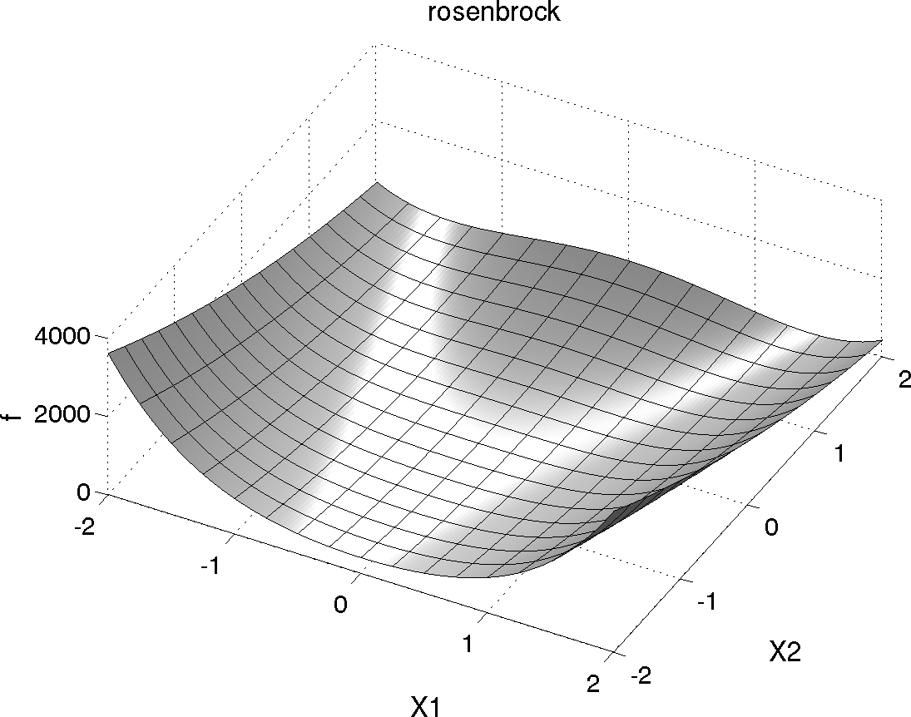
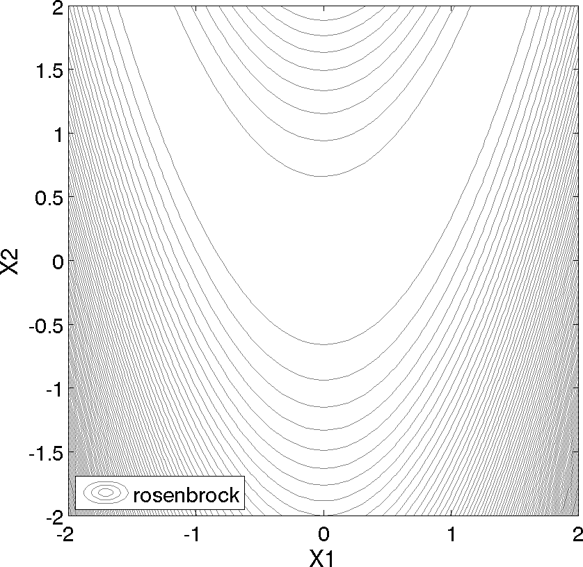
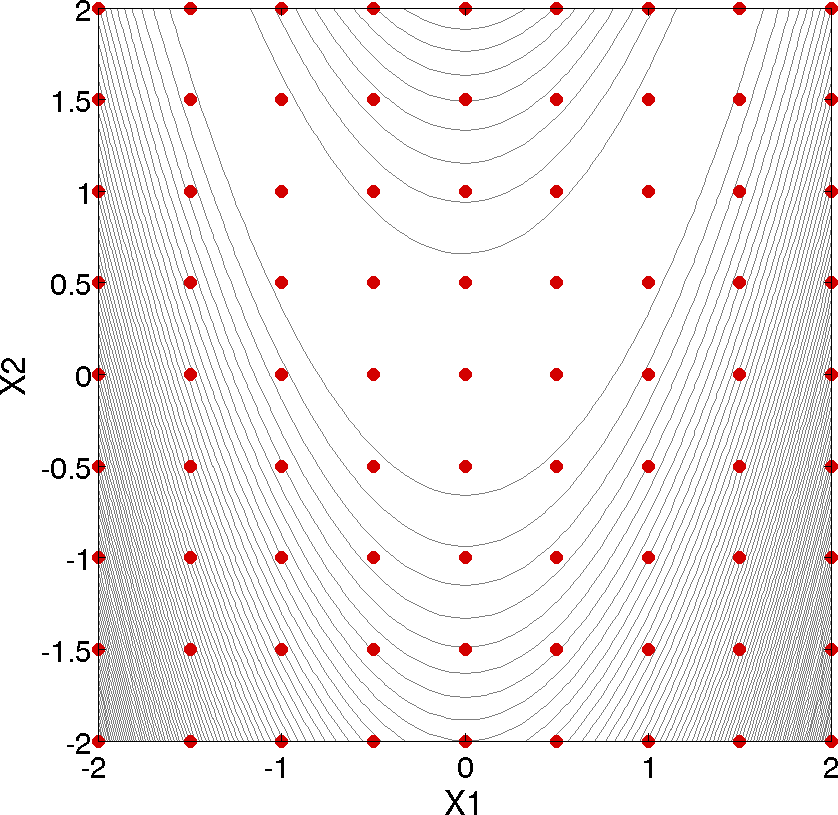
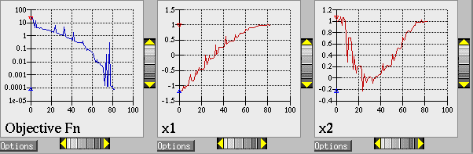
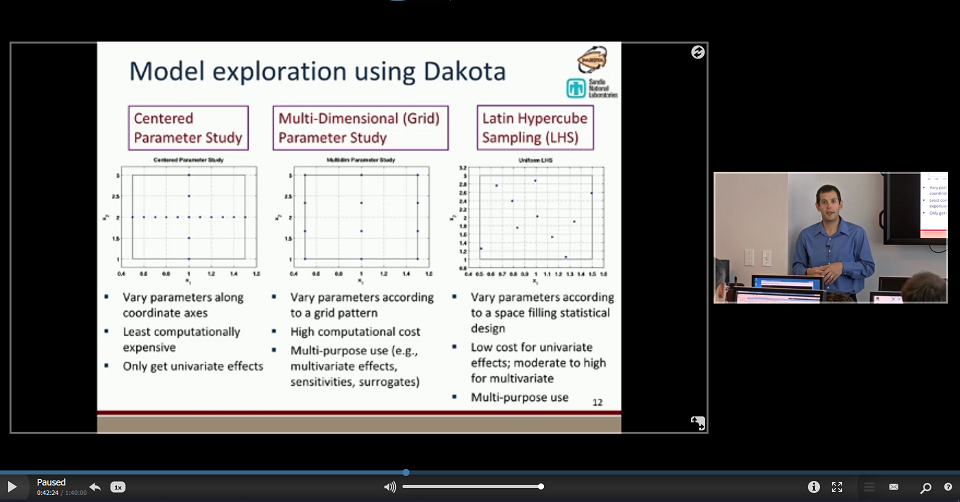

.. _examples-gettingstarted-main:

""""""""""""""""""""""""""""
\"Getting Started\" Examples
""""""""""""""""""""""""""""

This section serves to familiarize users with how to perform parameter studies, optimization, and uncertainty quantification
through their common Dakota interface. The initial examples utilize simple built in driver functions; later we show how to
utilize Dakota to drive the evaluation of user supplied black box code. The examples presented in this chapter are intended to
show the simplest use of Dakota for methods of each type. More advanced examples of using Dakota for specific purposes are
provided in subsequent, topic-based, chapters.

.. note::
   
   - If you are looking for examples of coupling Dakota to external simulations, refer to :ref:`this section <couplingtosimulations-main>`.
   - If you are looking for "getting started" video examples, refer to :ref:`this section <examples-gettingstarted-videos>`.

.. _examples-gettingstarted-rosenbrock:

=======================
Rosenbrock Test Problem
=======================

The Rosenbrock function is a common test problem for Dakota examples. This function has the form:

.. math::

   f(x_1,x_2)=100(x_2-x_1^2)^2+(1-x_1)^2

Shown below is a three-dimensional plot of this function, where both x1 and x2 range in value from −2 to 2;
also shown below is a contour plot for Rosenbrock’s function. 

   
   Rosenbrock's function as a 3D plot

   
   Rosenbrock's function as a contour plot

An optimization problem using Rosenbrock’s function is formulated as follows:

.. math::

   \begin{eqnarray}
   \texttt{minimize }   & & f(x_1,x_2)          \nonumber\\
                        & & \mathbf{x} \in \Re^2\nonumber\\
   \texttt{subject to } & & -2 \le x_1 \le 2    \\
                        & & -2 \le x_2 \le 2    \nonumber
   \end{eqnarray}

Note that there are no linear or nonlinear constraints in this formulation, so this is a bound constrained optimization problem.
The unique solution to this problem lies at the point (x1, x2) = (1, 1), where the function value is zero.
Several other test problems are available. See Chapter 20 for a description of these test problems as well as further discussion
of the Rosenbrock test problem.

=================
Parameter Studies
=================

.. _examples-gettingstarted-grid_study:

------------------------------------
Two-Dimensional Grid Parameter Study
------------------------------------

   
   Rosenbrock 2-D parameter study example: location of the design points (dots) evaluated.

Parameter study methods in the Dakota toolkit involve the computation of response data sets at a selection of points in the
parameter space. These response data sets are not linked to any specific interpretation, so they may consist of any allowable
specification from the responses keyword block, i.e., objective and constraint functions, least squares terms and constraints, or
generic response functions. This allows the use of parameter studies in direct coordination with optimization, least squares,
and uncertainty quantification studies without significant modification to the input file.
An example of a parameter study is the 2-D parameter study example problem listed in :numref:`tutorial:rosenbrock_multidim`.
This is executed by Dakota using the command noted in the comments:

.. code-block::

   dakota -i rosen_multidim.in -o rosen_multidim.out > rosen_multidim.stdout

The output of the Dakota run is written to the file named rosen_multidim.out while the screen output, or standard output,
is redirect to rosen_multidim.stdout. For comparison, files named rosen_multidim.out.sav and rosen_multidim.stdout.sav are
included in the dakota/share/dakota/examples/users directory. As for many of the examples, Dakota provides a report on the
best design point located during the study at the end of these output files.

This 2-D parameter study produces the grid of data samples shown in :numref:`figure:rosen_2d_pts`. In general, a multidimensional parameter
study lets one generate a grid in multiple dimensions. The keyword multidim parameter study indicates that a grid
will be generated over all variables. The keyword partitions indicates the number of grid partitions in each dimension.
For this example, the number of the grid partitions are the same in each dimension (8 partitions) but it would be possible to
specify (partitions = 8 2), and have only two partitions over the second input variable. Note that the graphics flag in the
environment block of the input file could be commented out since, for this example, the iteration history plots created by Dakota
are not particularly instructive. More interesting visualizations can be created by using the Dakota graphical user interface,
or by importing Dakota’s tabular data into an external graphics/plotting package. Example graphics and plotting packages
include Mathematica, Matlab, Microsoft Excel, Origin, Tecplot, Gnuplot, and Matplotlib. (Sandia National Laboratories and
the Dakota developers do not endorse any of these commercial products.)

.. _examples-gettingstarted-vector_study:

----------------------
Vector Parameter Study
----------------------

The following sample input file shows a 1-D vector parameter study using the Textbook Example (see Textbook). It makes use of the default environment and model specifications, so they can be omitted. A similar file is available in the test directory as dakota/share/dakota/examples/users/rosen_ps_vector.in.

.. code-block::

   # Dakota Input File: rosen_ps_vector.in
   environment
    tabular_data
     tabular_data_file = 'rosen_ps_vector.dat'

   method
    vector_parameter_study
     final_point = 1.1 1.3
     num_steps = 10
   
   variables
    continuous_design = 2
     initial_point  -0.3   0.2
     descriptors    'x1'   "x2"

   interface
    analysis_driver = 'rosenbrock'
     direct

   responses
    objective_functions = 1
    no_gradients
    no_hessians

.. _examples-gettingstarted-optimization:

============
Optimization
============

-----------------------------------------
Gradient-based Unconstrained Optimization
-----------------------------------------

Dakota’s optimization capabilities include a variety of gradient-based and nongradient-based optimization methods. This
subsection demonstrates the use of one such method through the Dakota interface.

.. literalinclude:: ../samples/rosen_grad_opt.in
   :language: dakota
   :tab-width: 2
   :caption: Rosenbrock gradient-based unconstrained optimization example: the Dakota input file.
   :name: tutorial:rosenbrock_grad

The format of the input file in :numref:`tutorial:rosenbrock_grad` is similar to that used for the parameter studies, but there are some new keywords in the responses and method sections.
First, in the responses block of the input file, the keyword block starting with numerical gradients specifies that a finite
difference method will be used to compute gradients for the optimization algorithm. Note that the Rosenbrock function evalu-
ation code inside Dakota has the ability to give analytical gradient values. (To switch from finite difference gradient estimates
to analytic gradients, uncomment the analytic gradients keyword and comment out the four lines associated with the
numerical gradients specification.) Next, in the method block of the input file, several new keywords have been added.
In this block, the keyword conmin frcg indicates the use of the Fletcher-Reeves conjugate gradient algorithm in the CON-
MIN optimization software package [143] for bound-constrained optimization. The keyword max iterations is used to
indicate the computational budget for this optimization (in this case, a single iteration includes multiple evaluations of Rosen-
brock’s function for the gradient computation steps and the line search steps). The keyword convergence tolerance
is used to specify one of CONMIN’s convergence criteria (under which CONMIN terminates if the objective function value
differs by less than the absolute value of the convergence tolerance for three successive iterations).

The Dakota command is noted in the file, and copies of the outputs are in the dakota/share/dakota/examples/
users directory, with .sav appended to the name. When this example problem is executed using Dakota’s legacy X
Windows-based graphics support enabled, Dakota creates some iteration history graphics similar to the screen capture shown
below. These plots show how the objective function and design parameters change in value during the optimization
steps. The scaling of the horizontal and vertical axes can be changed by moving the scroll knobs on each plot. Also, the
“Options” button allows the user to plot the vertical axes using a logarithmic scale. Note that log-scaling is only allowed if the
values on the vertical axis are strictly greater than zero.

.. note::

   Similar plots can also be created in :ref:`Dakota’s graphical user interface <chartreuse-plot-templates-iterhistory>`.

   
   Optimization plots (Legacy Dakota graphics plotting)

.. figure:: ../img/rosen_grad_opt_pts.png
   :alt: Optimization plot points on Rosenbrock curve
   :align: center
   :width: 300
   
   Optimization plot points on Rosenbrock curve

Above, we can see the iteration history of the optimization algorithm. The optimization starts at the point (x1, x2) =
(−1.2, 1.0) as given in the Dakota input file. Subsequent iterations follow the banana-shaped valley that curves around toward
the minimum point at (x1, x2) = (1.0, 1.0). Note that the function evaluations associated with the line search phase of each
CONMIN iteration are not shown on the plot. At the end of the Dakota run, information is written to the output file to provide
data on the optimal design point. These data include the optimum design point parameter values, the optimum objective and
constraint function values (if any), plus the number of function evaluations that occurred and the amount of time that elapsed
during the optimization study.

-----------------------
Optimization Example #2
-----------------------

The following sample input file shows single-method optimization of the Textbook Example (see Textbook) using DOT's modified method of feasible directions. A similar file is available as dakota/share/dakota/examples/users/textbook_opt_conmin.in.

.. code-block::

   # Dakota Input File: textbook_opt_conmin.in
   environment
    tabular_data
     tabular_data_file = 'textbook_opt_conmin.dat'
   
   method
   # dot_mmfd #DOT performs better but may not be available
    conmin_mfd
     max_iterations = 50
     convergence_tolerance = 1e-4

   variables
    continuous_design = 2
     initial_point  0.9  1.1
     upper_bounds   5.8  2.9
     lower_bounds   0.5  -2.9
     descriptors   'x1'  'x2'

   interface
    direct
     analysis_driver =    'text_book'

   responses
    objective_functions = 1
    nonlinear_inequality_constraints = 2
    numerical_gradients
     method_source dakota
     interval_type central
     fd_gradient_step_size = 1.e-4
    no_hessians

====================================================
Uncertainty Quantification with Monte Carlo Sampling
====================================================

.. literalinclude:: ../samples/rosen_sampling.in
   :language: dakota
   :tab-width: 2
   :caption: Monte Carlo sampling example: the Dakota input file.
   :name: tutorial:rosenbrock_mc

Uncertainty quantification (UQ) is the process of determining the effect of input uncertainties on response metrics of interest.
These input uncertainties may be characterized as either aleatory uncertainties, which are irreducible variabilities inherent in
nature, or epistemic uncertainties, which are reducible uncertainties resulting from a lack of knowledge. Since sufficient data
is generally available for aleatory uncertainties, probabilistic methods are commonly used for computing response distribution
statistics based on input probability distribution specifications. Conversely, for epistemic uncertainties, data is generally sparse,
making the use of probability theory questionable and leading to nonprobabilistic methods based on interval specifications.
The subsection demonstrates the use of Monte Carlo random sampling for Uncertainty Quantification.

:numref:`tutorial:rosenbrock_mc` shows the Dakota input file for an example problem that demonstrates some of the random sampling capabilities
available in Dakota. In this example, the design parameters, x1 and x2, will be treated as uncertain parameters that have
uniform distributions over the interval [-2, 2]. This is specified in the variables block of the input file, beginning with the
keyword uniform uncertain. Another difference from earlier input files such as :numref:`tutorial:rosenbrock_grad` occurs in the responses
block, where the keyword response functions is used in place of objective functions. The final changes to the
input file occur in the method block, where the keyword sampling is used.

The other keywords in the methods block of the input file specify the number of samples (200), the seed for the random number
generator (17), the sampling method (random), and the response threshold (100.0). The seed specification allows a user to
obtain repeatable results from multiple runs. If a seed value is not specified, then Dakota’s sampling methods are designed to
generate nonrepeatable behavior (by initializing the seed using a system clock). The keyword response levels allows
the user to specify threshold values for which Dakota will output statistics on the response function output. Note that a unique
threshold value can be specified for each response function.

In this example, Dakota will select 200 design points from within the parameter space, evaluate the value of Rosenbrock’s
function at all 200 points, and then perform some basic statistical calculations on the 200 response values.

The Dakota command is noted in the file, and copies of the outputs are in the dakota/share/dakota/examples/
users directory, with .sav appended to the name. :numref:`rosen_sampling_results` shows example results from this sampling method. Note that
your results will differ from those in this file if your seed value differs or if no seed is specified.

In addition to the output files discussed in the previous examples, several LHS*.out files are generated. They are a byproduct
of a software package, LHS [136], that Dakota utilizes to generate random samples and can be ignored.

.. code-block::
   :name: rosen_sampling_results
   :caption: Results of Monte Carlo Sampling on the Rosenbrock function

   Statistics based on 200 samples:

   Moment-based statistics for each response function:
                               Mean           Std Dev          Skewness          Kurtosis
   response_fn_1  4.5540183516e+02  5.3682678089e+02  1.6661798252e+00  2.7925726822e+00

   95% confidence intervals for each response function:
                       LowerCI_Mean      UpperCI_Mean    LowerCI_StdDev    UpperCI_StdDev
    response_fn_1  3.8054757609e+02  5.3025609422e+02  4.8886795789e+02  5.9530059589e+02

   Level mappings for each response function:
   Cumulative Distribution Function (CDF) for response_fn_1:
        Response Level  Probability Level  Reliability Index  General Rel Index
        --------------  -----------------  -----------------  -----------------
      1.0000000000e+02   3.4000000000e-01

   Probability Density Function (PDF) histograms for each response function:
   PDF for response_fn_1:
             Bin Lower          Bin Upper      Density Value
             ---------          ---------      -------------
      1.1623549854e-01   1.0000000000e+02   3.4039566059e-03
      1.0000000000e+02   2.7101710856e+03   2.5285698843e-04

   Simple Correlation Matrix among all inputs and outputs:
                          x1           x2 response_fn_1 
             x1  1.00000e+00 
             x2 -5.85097e-03  1.00000e+00 
   response_fn_1 -9.57746e-02 -5.08193e-01  1.00000e+00 

   Partial Correlation Matrix between input and output:
                response_fn_1 
             x1 -1.14659e-01 
             x2 -5.11111e-01 

   Simple Rank Correlation Matrix among all inputs and outputs:
                          x1           x2 response_fn_1 
             x1  1.00000e+00 
             x2 -6.03315e-03  1.00000e+00 
   response_fn_1 -1.15360e-01 -5.04661e-01  1.00000e+00 

   Partial Rank Correlation Matrix between input and output:
                response_fn_1 
             x1 -1.37154e-01 
             x2 -5.08762e-01 

As shown in :numref:`rosen_sampling_results`, the statistical data on the 200 Monte Carlo samples is printed at the end of the output file in the section
that starts with “Statistics based on 200 samples.” In this section summarizing moment-based statistics, Dakota outputs the
mean, standard deviation, skewness, and kurtosis estimates for each of the response functions. For example, the mean of the
Rosenbrock function given uniform input uncertainties on the input variables is 455.4 and the standard deviation is 536.8.
This is a very large standard deviation, due to the fact that the Rosenbrock function varies by three orders of magnitude over
the input domain. The skewness is positive, meaning this is a right-tailed distribution, not a symmetric distribution. Finally,
the kurtosis (a measure of the “peakedness” of the distribution) indicates that this is a strongly peaked distribution (note that
we use a central, standardized kurtosis so that the kurtosis of a normal is zero). After the moment-related statistics, the 95%
confidence intervals on the mean and standard deviations are printed. This is followed by the fractions (“Probability Level”)
of the response function values that are below the response threshold values specified in the input file. For example, 34 percent
of the sample inputs resulted in a Rosenbrock function value that was less than or equal to 100, as shown in the line listing
the cumulative distribution function values. Finally, there are several correlation matrices printed at the end, showing simple
and partial raw and rank correlation matrices. Correlations provide an indication of the strength of a monotonic relationship
between input and outputs. More detail on correlation coefficients and their interpretation can be found :ref:`here <uq:uncertainty1>`. More
detail about sampling methods in general can be found :ref:`here <uq:sampling>`. Finally, :numref:`figure:rosen_nond_pts` shows the
locations of the 200 sample sites within the parameter space of the Rosenbrock function for this example.

.. figure:: ../img/rosen_nond_pts.png
   :alt: Monte Carlo sampling example: locations in the parameter space of the 200 Monte Carlo samples using a uniform distribution for both x1 and x2.
   :align: center
   :width: 300
   :name: figure:rosen_nond_pts
   
   Monte Carlo sampling example: locations in the parameter space of the 200 Monte Carlo samples using a uniform distribution for both x1 and x2.

===========================
Least Squares (Calibration)
===========================   

The following sample input file shows a nonlinear least squares (calibration) solution of the Rosenbrock Example (see Rosenbrock) using the NL2SOL method. A similar file is available as dakota/share/dakota/examples/users/rosen_opt_nls.in 

.. code-block::

    # Dakota Input File: rosen_opt_nls.in
    environment
     tabular_data
      tabular_data_file = 'rosen_opt_nls.dat'

    method
     max_iterations = 100
     convergence_tolerance = 1e-4
     nl2sol

    model
     single

    variables
     continuous_design = 2
      initial_point  -1.2   1.0
      lower_bounds   -2.0   -2.0
      upper_bounds   2.0   2.0
      descriptors    'x1'   "x2"

    interface
     analysis_driver = 'rosenbrock'
      direct

    responses
     calibration_terms = 2
     analytic_gradients
     no_hessians

=========================
Nondeterministic Analysis
=========================

The following sample input file shows Latin Hypercube Monte Carlo sampling using the Textbook Example (see Textbook). A similar file is available as dakota/share/dakota/test/dakota_uq_textbook_lhs.in.

.. code-block::

    method
        sampling
         samples = 100 seed = 1
         complementary distribution
         response_levels = 3.6e+11 4.0e+11 4.4e+11
                  6.0e+04 6.5e+04 7.0e+04
                  3.5e+05 4.0e+05 4.5e+05
         sample_type lhs

    variables
        normal_uncertain = 2
         means       = 248.89, 593.33
         std_deviations  =  12.4,  29.7
         descriptors    = 'TF1n' 'TF2n'
        uniform_uncertain = 2
         lower_bounds   = 199.3, 474.63
         upper_bounds   = 298.5, 712.
         descriptors    = 'TF1u' 'TF2u'
        weibull_uncertain = 2
         alphas      =  12.,  30.
         betas       = 250.,  590.
         descriptors    = 'TF1w' 'TF2w'
        histogram_bin_uncertain = 2
         num_pairs  = 3     4
         abscissas  = 5 8 10 .1 .2 .3 .4
         counts   = 17 21 0 12 24 12  0
         descriptors = 'TF1h' 'TF2h'
        histogram_point_uncertain = 1
         num_pairs  = 2
         abscissas  = 3 4
         counts   = 1 1
         descriptors = 'TF3h'

    interface
        fork asynch evaluation_concurrency = 5
         analysis_driver = 'text_book'

    responses
        response_functions = 3
        no_gradients
        no_hessians

===============
Hybrid Strategy
===============

The following sample input file shows a hybrid environment using three methods. It employs a genetic algorithm, pattern search, and full Newton gradient-based optimization in succession to solve the Textbook Example (see Textbook). A similar file is available as dakota/share/dakota/examples/users/textbook_hybrid_strat.in.

.. code-block::

    environment
     hybrid sequential
      method_list = 'PS' 'PS2' 'NLP'

    method
     id_method = 'PS'
     model_pointer = 'M1'
     coliny_pattern_search stochastic
      seed = 1234
      initial_delta = 0.1
      variable_tolerance = 1.e-4
      solution_accuracy = 1.e-10
      exploratory_moves basic_pattern
      #verbose output

    method
     id_method = 'PS2'
     model_pointer = 'M1'
     max_function_evaluations = 10
     coliny_pattern_search stochastic
      seed = 1234
      initial_delta = 0.1
      variable_tolerance = 1.e-4
      solution_accuracy = 1.e-10
      exploratory_moves basic_pattern
      #verbose output

    method
     id_method = 'NLP'
     model_pointer = 'M2'
        optpp_newton
      gradient_tolerance = 1.e-12
      convergence_tolerance = 1.e-15
      #verbose output

    model
     id_model = 'M1'
     single
      variables_pointer = 'V1'
      interface_pointer = 'I1'
      responses_pointer = 'R1'

    model
     id_model = 'M2'
     single
      variables_pointer = 'V1'
      interface_pointer = 'I1'
      responses_pointer = 'R2'

    variables
     id_variables = 'V1'
     continuous_design = 2
      initial_point  0.6  0.7
      upper_bounds   5.8  2.9
      lower_bounds   0.5  -2.9
      descriptors   'x1'  'x2'

    interface
     id_interface = 'I1'
     direct
      analysis_driver= 'text_book'

    responses
     id_responses = 'R1'
     objective_functions = 1
     no_gradients
     no_hessians

    responses
     id_responses = 'R2'
     objective_functions = 1
     analytic_gradients
     analytic_hessians

.. _examples-gettingstarted-videos:

===============
Video Resources
===============

+----------------------------------------+-----------------+----------------+
| Title                                  | Link            | Resources      |
+========================================+=================+================+
| More Method Examples with Rosenbrock   | |Screencast|_   |                |
+----------------------------------------+-----------------+----------------+
| Model Characterization                 | |Training|_     | `Slides`__ /   |
|                                        |                 | `Exercises`__  |
+----------------------------------------+-----------------+----------------+

.. __: https://dakota.sandia.gov/sites/default/files/training/DakotaTraining_ModelCharacterization.pdf
__ https://dakota.sandia.gov/sites/default/files/training/characterization-151215.zip

.. |Screencast| image:: img/DakotaRosenbrockExamplesScreencastTeaser.png
                  :alt: Watch Screencast 1.3: More Method Examples with Rosenbrock
.. _Screencast: https://www.youtube.com/watch?v=jPd5zarUs1o&list=PLouetuxaIMDo-NMFXT-hlHYhOkePLrayY&index=3

.. _Training: http://digitalops.sandia.gov/Mediasite/Play/536240e97b444ee19a24d55c72fd52941d
