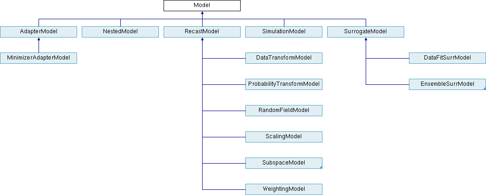

.. _`models:main`:

Models
======

.. _`models:overview`:

Overview
--------

:ref:`studytypes-main` describes the major categories of Dakota
methods.  A method evaluates or iterates on a model in order to map a
set of variables into a set of responses. A model may involve a simple
mapping with a single interface, or it may involve recursions using
sub-methods and sub-models.  These recursions permit "nesting,"
"layering," and "recasting” of software component building blocks to
accomplish more sophisticated studies, such as surrogate-based
optimization or optimization under uncertainty. In a nested
relationship, a sub-method
is executed using its sub-model for every evaluation of the nested
model. In a layered relationship, on the other hand, sub-methods and
sub-models are used only for periodic updates and verifications. And in
a recast relationship, the input variable and output response
definitions in a sub-model are reformulated in order to support new
problem definitions. In each of these cases, the sub-model is of
arbitrary type, such that model recursions can be chained together in as
long of a sequence as needed (e.g., layered containing nested containing
layered containing single as described in :ref:`adv_models:ouu:sb`).

:numref:`model:hier` displays the ``Model`` class hierarchy from the
Dakota Developers Manual :cite:p:`DevMan`, with derived classes for
single models, nested models, recast models, and two types of
surrogate models: data fit and hierarchical/multifidelity. A third
type of derived surrogate model supporting reduced-order models (ROM)
is planned for future releases.

   The Dakota ``Model`` class hierarchy.

The following sections describe :ref:`models:single`
(a.k.a. Simulation Models), :ref:`models:recast`,
:ref:`models:surrogate` (of various types), :ref:`models:nested`,
:ref:`models:randomfield`, and :ref:`models:subspace`, in turn,
followed by related educational screencasts on models.  Finally,
:ref:`adv_models` presents advanced examples demonstrating model
recursions.

.. _`models:single`:

Single Models
-------------

The single (or simulation) model is the simplest model type. It uses a
single :ref:`interface <interfaces:main>` to map :ref:`variables
<variables>` to :ref:`responses <responses>`. There is no recursion in
this case. See the :dakkw:`model-single` keyword for details on
specifying single models.

.. _`models:recast`:

Recast Models
-------------

Recast models do not appear in Dakota's user input
specification. Rather, they are used internally to transform the
inputs and outputs of a sub-model in order to reformulate the problem
posed to a method. Examples include :ref:`variable and response
scaling <opt:additional:scaling>`, transformations of uncertain
variables and associated response derivatives to standardized random
variables (see :ref:`uq:reliability` and :ref:`uq:expansion`),
:ref:`multiobjective optimization <opt:additional:multiobjective>`,
:ref:`merit functions <adv_meth:sbm:sblm>`, and expected
improvement/feasibility (see :ref:`opt:methods:gradientfree:global`
and :ref:`uq:reliability:global`). Refer to the Dakota Developers
Manual :cite:p:`DevMan` for additional details on recasting.

.. _`models:surrogate`:

Surrogate Models
----------------

Surrogate models are inexpensive approximate models intended to
capture the salient features of an expensive high-fidelity model. They
can be used to explore the variations in response quantities over
regions of the parameter space, or they can serve as inexpensive
stand-ins for optimization or uncertainty quantification studies (see,
for example, :ref:`adv_meth:sbm`). Dakota surrogate models are of one
of three types: data fit, multifidelity, and reduced-order model. An
overview and discussion of surrogate correction is provided here, with
details following.

.. note::

   There are :ref:`video resources on Dakota surrogate models
   <surrmodels-videos>`.

Overview of Surrogate Types
~~~~~~~~~~~~~~~~~~~~~~~~~~~

Data fitting methods involve construction of an approximation or
surrogate model using data (response values, gradients, and Hessians)
generated from the original truth model. Data fit methods can be further
categorized into local, multipoint, and global approximation techniques,
based on the number of points used in generating the data fit.

.. warning::

   Known Issue: When using discrete variables, significant differences
   in data fit surrogate behavior have been observed across computing
   platforms in some cases. The cause has not been pinpointed. In
   addition, guidance on appropriate construction and use of
   surrogates is incomplete. In the meantime, users should be aware of
   the risk of inaccurate results when using surrogates with discrete
   variables.

Local methods involve response data from a single point in parameter
space.  Available local techniques currently include:

**Taylor Series Expansion**: This is a local first-order or second-order
expansion centered at a single point in the parameter space.

Multipoint approximations involve response data from two or more points
in parameter space, often involving the current and previous iterates of
a minimization algorithm. Available techniques currently include:

**TANA-3**: This multipoint approximation uses a two-point exponential
approximation :cite:p:`Xu98,Fad90` built with response value
and gradient information from the current and previous iterates.

Global methods, often referred to as *response surface methods*, involve
many points spread over the parameter ranges of interest. These surface
fitting methods work in conjunction with the sampling methods and design
of experiments methods described in :ref:`uq:sampling` and
:ref:`dace:background`.

**Polynomial Regression**: First-order (linear), second-order
(quadratic), and third-order (cubic) polynomial response surfaces
computed using linear least squares regression methods. Note: there is
currently no use of forward- or backward-stepping regression methods to
eliminate unnecessary terms from the polynomial model.

An experimental least squares regression polynomial model was added in
Dakota 6.12. The user may specify the basis functions in the polynomial
through a total degree scheme.

**Gaussian Process (GP) or Kriging Interpolation** Dakota contains two
supported implementations of Gaussian process, also known as Kriging
:cite:p:`Giu98`, spatial interpolation. One of these resides
in the Surfpack sub-package of Dakota, the other resides in Dakota
itself. Both versions use the Gaussian correlation function with
parameters that are selected by Maximum Likelihood Estimation (MLE).
This correlation function results in a response surface that is
:math:`C^\infty`-continuous. 

.. note::

   Prior to Dakota 5.2, the Surfpack GP was referred to as the
   “Kriging” model and the Dakota version was labeled as the “Gaussian
   Process.” These terms are now used interchangeably. As of Dakota
   5.2,the Surfpack GP is used by default. For now the user still has
   the option to select the Dakota GP, but the Dakota GP is deprecated
   and will be removed in a future release. A third experimental
   Gaussian process model was added in Dakota 6.12.

-  **Surfpack GP**: Ill-conditioning due to a poorly spaced sample
   design is handled by discarding points that contribute the least
   unique information to the correlation matrix. Therefore, the points
   that are discarded are the ones that are easiest to predict. The
   resulting surface will exactly interpolate the data values at the
   retained points but is not guaranteed to interpolate the discarded
   points.

-  **Dakota GP**: Ill-conditioning is handled by adding a jitter term or
   “nugget” to diagonal elements of the correlation matrix. When this
   happens, the Dakota GP may not exactly interpolate the data values.

-  **Experimental GP**: This GP also contains a nugget parameter that
   may be fixed by the user or determined through MLE. When the nugget
   is greater than zero the mean of the GP is not forced to interpolate
   the response values.

**Artificial Neural Networks**: An implementation of the stochastic
layered perceptron neural network developed by Prof. D. C. Zimmerman of
the University of Houston :cite:p:`Zim96`. This neural network
method is intended to have a lower training (fitting) cost than typical
back-propagation neural networks.

**Multivariate Adaptive Regression Splines (MARS)**: Software developed
by Prof. J. H. Friedman of Stanford
University :cite:p:`Fri91`. The MARS method creates a
:math:`C^2`-continuous patchwork of splines in the parameter space.

**Radial Basis Functions (RBF)**: Radial basis functions are functions
whose value typically depends on the distance from a center point,
called the centroid. The surrogate model approximation is constructed as
the weighted sum of individual radial basis functions.

**Moving Least Squares (MLS)**: Moving Least Squares can be considered a
more specialized version of linear regression models. MLS is a weighted
least squares approach where the weighting is “moved” or recalculated
for every new point where a prediction is
desired. :cite:p:`Nea04`

**Piecewise Decomposition Option for Global Surrogates**: Typically, the
previous regression techniques use all available sample points to
approximate the underlying function anywhere in the domain. An
alternative option is to use piecewise decomposition to locally
approximate the function at some point using a few sample points from
its neighborhood. This option currently supports Polynomial Regression,
Gaussian Process (GP) Interpolation, and Radial Basis Functions (RBF)
Regression. It requires a decomposition cell type (currently set to be
Voronoi cells), an optional number of support layers of neighbors, and
optional discontinuity detection parameters (jump/gradient).

..
   TODO:
   %\textbf{Orthogonal Polynomials}: This technique involves the use of
   %multivariate orthogonal polynomials as a global basis for surrogate
   %modeling.  These multivariate polynomials are constructed as a product
   %of particular univariate orthogonal polynomials, including Hermite,
   %Legendre, Laguerre, Jacobi, and generalized Laguerre polynomials,
   %which are defined as functions of standard normal, standard uniform,
   %standard exponential, standard beta, and standard gamma random
   %variables, respectively.  Given the probabilistic interpretation of
   %the approximation variables, this data fit is primarily used for
   %uncertainty quantification, and in particular, polynomial chaos
   %expansions.

In addition to data fit surrogates, Dakota supports multifidelity and
reduced-order model approximations:

..
   TODO: Discussion on MF surrogates still seems accruate, but a lot
   has evolved in this area in recent years. Needs review/update here
   and throughout.

**Multifidelity Surrogates**: Multifidelity modeling involves the use of
a low-fidelity physics-based model as a surrogate for the original
high-fidelity model. The low-fidelity model typically involves a coarser
mesh, looser convergence tolerances, reduced element order, or omitted
physics. It is a separate model in its own right and does not require
data from the high-fidelity model for construction. Rather, the primary
need for high-fidelity evaluations is for defining correction functions
that are applied to the low-fidelity results.

**Reduced Order Models**: A reduced-order model (ROM) is mathematically
derived from a high-fidelity model using the technique of Galerkin
projection. By computing a set of basis functions (e.g., eigenmodes,
left singular vectors) that capture the principal dynamics of a system,
the original high-order system can be projected to a much smaller
system, of the size of the number of retained basis functions.

Correction Approaches
~~~~~~~~~~~~~~~~~~~~~

Each of the surrogate model types supports the use of correction factors
that improve the local accuracy of the surrogate models. The correction
factors force the surrogate models to match the true function values and
possibly true function derivatives at the center point of each trust
region. Currently, Dakota supports either zeroth-, first-, or
second-order accurate correction methods, each of which can be applied
using either an additive, multiplicative, or combined correction
function. For each of these correction approaches, the correction is
applied to the surrogate model and the corrected model is then
interfaced with whatever algorithm is being employed. The default
behavior is that no correction factor is applied.

The simplest correction approaches are those that enforce consistency in
function values between the surrogate and original models at a single
point in parameter space through use of a simple scalar offset or
scaling applied to the surrogate model. First-order corrections such as
the first-order multiplicative correction (also known as beta
correction :cite:p:`Cha93`) and the first-order additive
correction :cite:p:`Lew00` also enforce consistency in the
gradients and provide a much more substantial correction capability that
is sufficient for ensuring provable convergence in :ref:`SBO
algorithms <adv_meth:sbm:sblm>`. SBO convergence
rates can be further accelerated through the use of second-order
corrections which also enforce consistency in the
Hessians :cite:p:`Eld04`, where the second-order information
may involve analytic, finite-difference, or quasi-Newton Hessians.

Correcting surrogate models with additive corrections involves

.. math::

   \hat{f_{hi_{\alpha}}}({\bf x}) = f_{lo}({\bf x}) + \alpha({\bf x}) 
   \label{eq:correct_val_add}

where multifidelity notation has been adopted for clarity. For
multiplicative approaches, corrections take the form

.. math::

   \hat{f_{hi_{\beta}}}({\bf x}) = f_{lo}({\bf x}) \beta({\bf x})
   \label{eq:correct_val_mult}

where, for local corrections, :math:`\alpha({\bf x})` and
:math:`\beta({\bf x})` are first or second-order Taylor series
approximations to the exact correction functions:

.. math::

   \alpha({\bf x}) & = A({\bf x_c}) + \nabla A({\bf x_c})^T 
   ({\bf x} - {\bf x_c}) + \frac{1}{2} ({\bf x} - {\bf x_c})^T 
   \nabla^2 A({\bf x_c}) ({\bf x} - {\bf x_c}) \label{eq:taylor_a}

   \beta({\bf x})  & = B({\bf x_c}) + \nabla B({\bf x_c})^T 
   ({\bf x} - {\bf x_c}) + \frac{1}{2} ({\bf x} - {\bf x_c})^T \nabla^2 
   B({\bf x_c}) ({\bf x} - {\bf x_c}) \label{eq:taylor_b}

where the exact correction functions are

.. math::

   A({\bf x}) & = f_{hi}({\bf x}) - f_{lo}({\bf x})       \label{eq:exact_A}

   B({\bf x}) & = \frac{f_{hi}({\bf x})}{f_{lo}({\bf x})} \label{eq:exact_B}

Refer to :cite:p:`Eld04` for additional details on the
derivations.

A combination of additive and multiplicative corrections can provide for
additional flexibility in minimizing the impact of the correction away
from the trust region center. In other words, both additive and
multiplicative corrections can satisfy local consistency, but through
the combination, global accuracy can be addressed as well. This involves
a convex combination of the additive and multiplicative corrections:

.. math::

   \hat{f_{hi_{\gamma}}}({\bf x}) = \gamma \hat{f_{hi_{\alpha}}}({\bf x}) +
   (1 - \gamma) \hat{f_{hi_{\beta}}}({\bf x}) \label{eq:combined_form}

where :math:`\gamma` is calculated to satisfy an additional matching
condition, such as matching values at the previous design iterate.

..
   TODO:

   %It should be noted that in both first order correction methods, the
   %function $\hat{f}(x)$ matches the function value and gradients of
   %$f_{t}(x)$ at $x=x_{c}$. This property is necessary in proving that
   %the first order-corrected SBO algorithms are provably convergent to a
   %local minimum of $f_{t}(x)$.  However, the first order correction
   %methods are significantly more expensive than the zeroth order
   %correction methods, since the first order methods require computing
   %both $\nabla f_{t}(x_{c})$ and $\nabla f_{s}(x_{c})$.  When the SBO
   %strategy is used with either of the zeroth order correction methods,
   %or with no correction method, convergence is not guaranteed to a local
   %minimum of $f_{t}(x)$. That is, the SBO strategy becomes a heuristic
   %optimization algorithm. From a mathematical point of view this is
   %undesirable, but as a practical matter, the heuristic variants of SBO
   %are often effective in finding local minima.
   
   %\emph{Usage guidelines:}
   %\begin{itemize}
   %\item Both the \texttt{additive zeroth\_order} and
   %  \texttt{multiplicative zeroth\_order} correction methods are
   %  ``free'' since they use values of $f_{t}(x_{c})$ that are normally
   %  computed by the SBO strategy.
   %
   %\item The use of either the \texttt{additive first\_order} method or
   %  the \texttt{multiplicative first\_order} method does not necessarily
   %  improve the rate of convergence of the SBO algorithm.
   %
   %\item When using the first order correction methods, the
   %  \texttt{TRUE\_FCN\_GRAD} response keywords must be modified (see
   %  bottom of Figure~\ref{sbm:sblm_rosen}) to allow either analytic or
   %  numerical gradients to be computed. This provides the gradient data
   %  needed to compute the correction function.
   %
   %\item For many computationally expensive engineering optimization
   %  problems, gradients often are too expensive to obtain or are
   %  discontinuous (or may not exist at all). In such cases the heuristic
   %  SBO algorithm has been an effective approach at identifying optimal
   %  designs~\cite{Giu02}.
   %\end{itemize}

.. _`models:surrogate:datafit`:

Data Fit Surrogate Models
~~~~~~~~~~~~~~~~~~~~~~~~~

A surrogate of the *data fit* type is a non-physics-based approximation
typically involving interpolation or regression of a set of data
generated from the original model. Data fit surrogates can be further
characterized by the number of data points used in the fit, where a
local approximation (e.g., first or second-order Taylor series) uses
data from a single point, a multipoint approximation (e.g., two-point
exponential approximations (TPEA) or two-point adaptive nonlinearity
approximations (TANA)) uses a small number of data points often drawn
from the previous iterates of a particular algorithm, and a global
approximation (e.g., polynomial response surfaces,
kriging/gaussian_process, neural networks, radial basis functions,
splines) uses a set of data points distributed over the domain of
interest, often generated using a design of computer experiments.

Dakota contains several types of surface fitting methods that can be
used with optimization and uncertainty quantification methods and
strategies such as surrogate-based optimization and optimization under
uncertainty. These are: polynomial models (linear, quadratic, and
cubic), first-order Taylor series expansion, kriging spatial
interpolation, artificial neural networks, multivariate adaptive
regression splines, radial basis functions, and moving least squares.
With the exception of Taylor series methods, all of the above methods
listed in the previous sentence are accessed in Dakota through the
Surfpack library. All of these surface fitting methods can be applied to
problems having an arbitrary number of design parameters. However,
surface fitting methods usually are practical only for problems where
there are a small number of parameters (e.g., a maximum of somewhere in
the range of 30-50 design parameters). The mathematical models created
by surface fitting methods have a variety of names in the engineering
community. These include surrogate models, meta-models, approximation
models, and response surfaces. For this manual, the terms surface fit
model and surrogate model are used.

The data fitting methods in Dakota include software developed by Sandia
researchers and by various researchers in the academic community.

.. _`models:surf:procedures`:

Procedures for Surface Fitting
^^^^^^^^^^^^^^^^^^^^^^^^^^^^^^

The surface fitting process consists of three steps: (1) selection of a
set of design points, (2) evaluation of the true response quantities
(e.g., from a user-supplied simulation code) at these design points, and
(3) using the response data to solve for the unknown coefficients (e.g.,
polynomial coefficients, neural network weights, kriging correlation
factors) in the surface fit model. In cases where there is more than one
response quantity (e.g., an objective function plus one or more
constraints), then a separate surface is built for each response
quantity. Currently, most surface fit models are built using only
0\ :math:`^{\mathrm{th}}`-order information (function values only),
although extensions to using higher-order information (gradients and
Hessians) are possible, and the Kriging model does allow construction
for gradient data. Each surface fitting method employs a different
numerical method for computing its internal coefficients. For example,
the polynomial surface uses a least-squares approach that employs a
singular value decomposition to compute the polynomial coefficients,
whereas the kriging surface uses Maximum Likelihood Estimation to
compute its correlation coefficients. More information on the numerical
methods used in the surface fitting codes is provided in the Dakota
Developers Manual :cite:p:`DevMan`.

The set of design points that is used to construct a surface fit model
is generated using either the DDACE software
package :cite:p:`TonXX` or the LHS software
package :cite:p:`Ima84`. These packages provide a variety of
sampling methods including Monte Carlo (random) sampling, Latin
hypercube sampling, orthogonal array sampling, central composite design
sampling, and Box-Behnken sampling. See :ref:`dace` for more
information on these software packages.  Optionally, the quality of a
surrogate model can be assessed with :ref:`surrogate metrics or
diagnostics <models:surf:diagnostics>`.

.. _`models:surf:taylor`:

Taylor Series
^^^^^^^^^^^^^

The Taylor series model is purely a local approximation method. That is,
it provides local trends in the vicinity of a single point in parameter
space. The first-order Taylor series expansion is:

.. math::

   \hat{f}({\bf x}) \approx f({\bf x}_0) + \nabla_{\bf x} f({\bf x}_0)^T 
   ({\bf x} - {\bf x}_0) \label{eq:taylor1}

and the second-order expansion is:

.. math::

   \hat{f}({\bf x}) \approx f({\bf x}_0) + \nabla_{\bf x} f({\bf x}_0)^T 
   ({\bf x} - {\bf x}_0) + \frac{1}{2} ({\bf x} - {\bf x}_0)^T 
   \nabla^2_{\bf x} f({\bf x}_0) ({\bf x} - {\bf x}_0) \label{eq:taylor2}

where :math:`{\bf x}_0` is the expansion point in :math:`n`-dimensional
parameter space and :math:`f({\bf x}_0),`
:math:`\nabla_{\bf x} f({\bf x}_0),` and
:math:`\nabla^2_{\bf x} f({\bf x}_0)` are the computed response value,
gradient, and Hessian at the expansion point, respectively. As dictated
by the responses specification used in building the local surrogate, the
gradient may be analytic or numerical and the Hessian may be analytic,
numerical, or based on quasi-Newton secant updates.

In general, the Taylor series model is accurate only in the region of
parameter space that is close to :math:`{\bf x}_0` . While the accuracy
is limited, the first-order Taylor series model reproduces the correct
value and gradient at the point :math:`\mathbf{x}_{0}`, and the
second-order Taylor series model reproduces the correct value, gradient,
and Hessian. This consistency is useful in provably-convergent
surrogate-based optimization. The other surface fitting methods do not
use gradient information directly in their models, and these methods
rely on an external correction procedure in order to satisfy the
consistency requirements of provably-convergent SBO.

.. _`models:surf:tana`:

Two Point Adaptive Nonlinearity Approximation
^^^^^^^^^^^^^^^^^^^^^^^^^^^^^^^^^^^^^^^^^^^^^

The TANA-3 method :cite:p:`Xu98` is a multipoint approximation
method based on the two point exponential
approximation :cite:p:`Fad90`. This approach involves a Taylor
series approximation in intermediate variables where the powers used for
the intermediate variables are selected to match information at the
current and previous expansion points. The form of the TANA model is:

.. math::

   \hat{f}({\bf x}) \approx f({\bf x}_2) + \sum_{i=1}^n 
   \frac{\partial f}{\partial x_i}({\bf x}_2) \frac{x_{i,2}^{1-p_i}}{p_i} 
   (x_i^{p_i} - x_{i,2}^{p_i}) + \frac{1}{2} \epsilon({\bf x}) \sum_{i=1}^n 
   (x_i^{p_i} - x_{i,2}^{p_i})^2 \label{eq:tana_f}

where :math:`n` is the number of variables and:

.. math::

   p_i & = 1 + \ln \left[ \frac{\frac{\partial f}{\partial x_i}({\bf x}_1)}
   {\frac{\partial f}{\partial x_i}({\bf x}_2)} \right] \left/ 
   \ln \left[ \frac{x_{i,1}}{x_{i,2}} \right] \right. \label{eq:tana_pi}

   \epsilon({\bf x}) & = \frac{H}{\sum_{i=1}^n (x_i^{p_i} - x_{i,1}^{p_i})^2 + 
   \sum_{i=1}^n (x_i^{p_i} - x_{i,2}^{p_i})^2} \label{eq:tana_eps}

   H & = 2 \left[ f({\bf x}_1) - f({\bf x}_2) - \sum_{i=1}^n 
   \frac{\partial f}{\partial x_i}({\bf x}_2) \frac{x_{i,2}^{1-p_i}}{p_i} 
   (x_{i,1}^{p_i} - x_{i,2}^{p_i}) \right] \label{eq:tana_H}

and :math:`{\bf x}_2` and :math:`{\bf x}_1` are the current and previous
expansion points. Prior to the availability of two expansion points, a
first-order Taylor series is used.

.. _`models:surf:polynomial`:

Linear, Quadratic, and Cubic Polynomial Models
^^^^^^^^^^^^^^^^^^^^^^^^^^^^^^^^^^^^^^^^^^^^^^

Linear, quadratic, and cubic polynomial models are available in Dakota.
The form of the linear polynomial model is

.. math::

   \hat{f}(\mathbf{x}) \approx c_{0}+\sum_{i=1}^{n}c_{i}x_{i}
     \label{models:surf:equation01}

the form of the quadratic polynomial model is:

.. math::

   \hat{f}(\mathbf{x}) \approx c_{0}+\sum_{i=1}^{n}c_{i}x_{i}
     +\sum_{i=1}^{n}\sum_{j \ge i}^{n}c_{ij}x_{i}x_{j}
     \label{models:surf:equation02}

and the form of the cubic polynomial model is:

.. math::

   \hat{f}(\mathbf{x}) \approx c_{0}+\sum_{i=1}^{n}c_{i}x_{i}
     +\sum_{i=1}^{n}\sum_{j \ge i}^{n}c_{ij}x_{i}x_{j}
     +\sum_{i=1}^{n}\sum_{j \ge i}^{n}\sum_{k \ge j}^{n}
     c_{ijk}x_{i}x_{j}x_{k}
     \label{models:surf:equation03}

In all of the polynomial models, :math:`\hat{f}(\mathbf{x})` is the
response of the polynomial model; the :math:`x_{i},x_{j},x_{k}` terms
are the components of the :math:`n`-dimensional design parameter values;
the :math:`c_{0}` , :math:`c_{i}` , :math:`c_{ij}` , :math:`c_{ijk}`
terms are the polynomial coefficients, and :math:`n` is the number of
design parameters. The number of coefficients, :math:`n_{c}`, depends on
the order of polynomial model and the number of design parameters. For
the linear polynomial:

.. math::

   n_{c_{linear}}=n+1
     \label{models:surf:equation04}

for the quadratic polynomial:

.. math::

   n_{c_{quad}}=\frac{(n+1)(n+2)}{2}
     \label{models:surf:equation05}

and for the cubic polynomial:

.. math::

   n_{c_{cubic}}=\frac{(n^{3}+6 n^{2}+11 n+6)}{6}
     \label{models:surf:equation06}

There must be at least :math:`n_{c}` data samples in order to form a
fully determined linear system and solve for the polynomial
coefficients. For discrete design variables, a further requirement for a
well-posed problem is for the number of distinct values that each
discrete variable can take must be greater than the order of polynomial
model (by at least one level). For the special case involving anisotropy
in which the degree can be specified differently per dimension, the
number of values for each discrete variable needs to be greater than the
corresponding order along the respective dimension. In Dakota, a
least-squares approach involving a singular value decomposition
numerical method is applied to solve the linear system.

The utility of the polynomial models stems from two sources: (1) over a
small portion of the parameter space, a low-order polynomial model is
often an accurate approximation to the true data trends, and (2) the
least-squares procedure provides a surface fit that smooths out noise in
the data. For this reason, the surrogate-based optimization approach
often is successful when using polynomial models, particularly quadratic
models. However, a polynomial surface fit may not be the best choice for
modeling data trends over the entire parameter space, unless it is known
a priori that the true data trends are close to linear, quadratic, or
cubic. See :cite:p:`Mye95` for more information on polynomial
models.

This surrogate model supports the :ref:`domain decomposition
option<models:surf:piecewise_decomp>`.

An experimental polynomial model was added in Dakota 6.12 that is
specified with
:dakkw:`model-surrogate-global-experimental_polynomial`.  The user
specifies the order of the polynomial through the required keyword
:dakkw:`model-surrogate-global-experimental_polynomial-basis_order`
according to a total degree rule.

.. _`models:surf:kriging`:

Kriging/Gaussian-Process Spatial Interpolation Models
^^^^^^^^^^^^^^^^^^^^^^^^^^^^^^^^^^^^^^^^^^^^^^^^^^^^^

Dakota has three implementations of spatial interpolation models, two
supported and one experimental. Of the supported versions, one is
located in Dakota itself and the other in the Surfpack subpackage of
Dakota which can be compiled in a standalone mode. These models are
specified via :dakkw:`model-surrogate-global-gaussian_process`
:dakkw:`model-surrogate-global-gaussian_process-dakota` and
:dakkw:`model-surrogate-global-gaussian_process`
:dakkw:`model-surrogate-global-gaussian_process-surfpack`.

.. note::

   In Dakota releases prior to 5.2, the ``dakota`` version was
   referred to as the ``gaussian_process`` model while the
   ``surfpack`` version was referred to as the ``kriging`` model. As
   of Dakota 5.2, specifying only
   :dakkw:`model-surrogate-global-gaussian_process` without
   qualification will default to the ``surfpack`` version in all
   contexts except Bayesian calibration. For now, both versions are
   supported but the ``dakota`` version is deprecated and likely to be
   removed in a future release. The two Gaussian process models are
   very similar; the differences between them are explained in more
   detail below.

The Kriging, also known as Gaussian process (GP), method uses techniques
developed in the geostatistics and spatial statistics communities
(:cite:p:`Cre91`, :cite:p:`Koe96`) to produce
smooth surface fit models of the response values from a set of data
points. The number of times the fitted surface is differentiable will
depend on the correlation function that is used. Currently, the Gaussian
correlation function is the only option for either version included in
Dakota; this makes the GP model :math:`C^{\infty}`-continuous. The form
of the GP model is

.. math::

   \hat{f}(\underline{x}) \approx \underline{g}(\underline{x})^T\underline{\beta} +
     \underline{r}(\underline{x})^{T}\underline{\underline{R}}^{-1}(\underline{f}-\underline{\underline{G}}\ \underline{\beta})
     \label{models:surf:equation08}

where :math:`\underline{x}` is the current point in
:math:`n`-dimensional parameter space;
:math:`\underline{g}(\underline{x})` is the vector of trend basis
functions evaluated at :math:`\underline{x}`; :math:`\underline{\beta}`
is a vector containing the generalized least squares estimates of the
trend basis function coefficients; :math:`\underline{r}(\underline{x})`
is the correlation vector of terms between :math:`\underline{x}` and the
data points; :math:`\underline{\underline{R}}` is the correlation matrix
for all of the data points; :math:`\underline{f}` is the vector of
response values; and :math:`\underline{\underline{G}}` is the matrix
containing the trend basis functions evaluated at all data points. The
terms in the correlation vector and matrix are computed using a Gaussian
correlation function and are dependent on an :math:`n`-dimensional
vector of correlation parameters,
:math:`\underline{\theta} = \{\theta_{1},\ldots,\theta_{n}\}^T`. By
default, Dakota determines the value of :math:`\underline{\theta}` using
a Maximum Likelihood Estimation (MLE) procedure. However, the user can
also opt to manually set them in the Surfpack Gaussian process model
by specifying a vector of correlation lengths,
:math:`\underline{l}=\{l_{1},\ldots,l_{n}\}^T` where
:math:`\theta_i=1/(2 l_i^2)`. This definition of correlation lengths
makes their effect on the GP model’s behavior directly analogous to the
role played by the standard deviation in a normal (a.k.a. Gaussian)
distribution. In the Surfpack Gaussian process model, we used this
analogy to define a small feasible region in which to search for
correlation lengths. This region should (almost) always contain some
correlation matrices that are well conditioned and some that are
optimal, or at least near optimal. More details on Kriging/GP models may
be found in :cite:p:`Giu98`.

Since a GP has a hyper-parametric error model, it can be used to model
surfaces with slope discontinuities along with multiple local minima and
maxima. GP interpolation is useful for both SBO and OUU, as well as for
studying the global response value trends in the parameter space. This
surface fitting method needs a minimum number of design points equal to
the sum of the number of basis functions and the number of dimensions,
:math:`n`, but it is recommended to use at least double this amount.

..
   TODO:
   %$n_{c_{quad}}$ design points when possible (refer to
   %Section~\ref{models:surf:polynomial} for $n_{c}$ definitions).

The GP model is guaranteed to pass through all of the response data
values that are used to construct the model. Generally, this is a
desirable feature. However, if there is considerable numerical noise in
the response data, then a surface fitting method that provides some data
smoothing (e.g., quadratic polynomial, MARS) may be a better choice for
SBO and OUU applications. Another feature of the GP model is that the
predicted response values, :math:`\hat{f}(\underline{x})`, decay to the
trend function, :math:`\underline{g}(\underline{x})^T\underline{\beta}`,
when :math:`\underline{x}` is far from any of the data points from which
the GP model was constructed (i.e., when the model is used for
extrapolation).

As mentioned above, there are two primary Gaussian process models in
Dakota, the :dakkw:`model-surrogate-global-gaussian_process-surfpack`
version and the
:dakkw:`model-surrogate-global-gaussian_process-dakota` version. More
details on the Dakota GP model can be found in :cite:p:`McF08`. The
differences between these models are as follows:

- Trend Function: The GP models incorporate a parametric trend
  function whose purpose is to capture large-scale variations. In
  both models, the trend function can be a constant, linear,or
  reduced quadratic (main effects only, no interaction terms)
  polynomial. This is specified by the keyword ``trend`` followed by
  one of ``constant``, ``linear``, or ``reduced_quadratic`` (in
  Dakota 5.0 and earlier, the reduced quadratic (second-order with no
  mixed terms) option for the ``dakota`` version was selected using
  the keyword, ``quadratic``).  The Surfpack GP model has the
  additional option of a full (including all interaction terms)
  quadratic polynomial that is specified with ``trend quadratic``.

- Correlation Parameter Determination: Both of the primary GP models
  use a Maximum Likelihood Estimation (MLE) approach to find the
  optimal values of the hyper-parameters governing the mean and
  correlation functions. By default both models use the global
  optimization method called DIRECT, although they search regions
  with different extents. For the Dakota GP model, DIRECT is the only
  option. The Surfpack GP model has several options for
  hyperparameter optimization. These are specified by the
  :dakkw:`model-surrogate-global-gaussian_process-surfpack-optimization_method`
  keyword followed by one of these strings:

  - ``'global'`` which uses the default DIRECT optimizer,

  - ``'local'`` which uses the CONMIN gradient-based optimizer,

  - ``'sampling'`` which generates several random guesses and picks
    the candidate with greatest likelihood, and

  - ``'none'``

  The ``'none'`` option and the initial iterate of the ``'local'``
  optimization default to the center, in log(correlation length)
  scale, of the small feasible region. However, these can also be
  user specified with the
  :dakkw:`model-surrogate-global-gaussian_process-surfpack-correlation_lengths`
  keyword followed by a list of :math:`n` real numbers. The total
  number of evaluations of the Surfpack GP model’s likelihood
  function can be controlled using the
  :dakkw:`model-surrogate-global-gaussian_process-surfpack-max_trials`
  keyword followed by a positive integer. The ``'global'``
  optimization method tends to be the most robust, if slow to
  converge.

- Ill-conditioning. One of the major problems in determining the
  governing values for a Gaussian process or Kriging model is the
  fact that the correlation matrix can easily become ill-conditioned
  when there are too many input points close together. Since the
  predictions from the Gaussian process model involve inverting the
  correlation matrix, ill-conditioning can lead to poor predictive
  capability and should be avoided. The Surfpack GP
  model defines a small feasible search region for correlation
  lengths, which should (almost) always contain some well conditioned
  correlation matrices. In Dakota 5.1 and earlier, the Surfpack ``kriging``
  model
  avoided ill-conditioning by explicitly excluding poorly conditioned
  :math:`\underline{\underline{R}}` from consideration on the basis
  of their having a large (estimate of) condition number; this
  constraint acted to decrease the size of admissible correlation
  lengths. Note that a sufficiently bad sample design could require
  correlation lengths to be so short that any interpolatory
  Kriging/GP model would become inept at extrapolation and
  interpolation.

  The Dakota GP model has two features to overcome
  ill-conditioning. The first is that the algorithm will add a small
  amount of noise to the diagonal elements of the matrix (this is
  often referred to as a “nugget”) and sometimes this is enough to
  improve the conditioning. The second is that the user can specify
  to build the GP based only on a subset of points. The algorithm
  chooses an “optimal” subset of points (with respect to predictive
  capability on the remaining unchosen points) using a greedy
  heuristic. This option is specified with the keyword
  :dakkw:`model-surrogate-global-gaussian_process-dakota-point_selection`
  in the input file.

  As of Dakota 5.2, the Surfpack GP model has a
  similar capability. Points are **not** discarded prior to the
  construction of the model. Instead, within the maximum likelihood
  optimization loop, when the correlation matrix violates the
  explicit (estimate of) condition number constraint, a pivoted Cholesky
  factorization of the correlation matrix is performed. A bisection search is then
  used to efficiently find the last point for which the reordered
  correlation matrix is not too ill-conditioned. Subsequent reordered
  points are excluded from the GP/Kriging model for the current set
  of correlation lengths, i.e. they are not used to construct this GP
  model or compute its likelihood. When necessary, the Surfpack GP
  model will automatically decrease the
  order of the polynomial trend function. Once the maximum likelihood
  optimization has been completed, the subset of points that is
  retained will be the one associated with the most likely set of
  correlation lengths. Note that a matrix being ill-conditioned means
  that its rows or columns contain a significant amount of duplicate
  information. Since the points that were discarded were the ones
  that contained the least unique information, they should be the
  ones that are the easiest to predict and provide maximum
  improvement of the condition number. However, the
  Surfpack GP model is not guaranteed to exactly
  interpolate the discarded points. Warning: when two very nearby
  points are on opposite sides of a discontinuity, it is possible for
  one of them to be discarded by this approach.

  Note that a pivoted Cholesky factorization can be significantly
  slower than the highly optimized implementation of non-pivoted
  Cholesky factorization in typical LAPACK distributions. A
  consequence of this is that the Surfpack GP model
  can take significantly more time to build than the
  Dakota GP version. However, tests indicate that
  the Surfpack version will often be more
  accurate and/or require fewer evaluations of the true function than
  the Dakota analog. For this reason, the Surfpack
  version is the default option as of Dakota 5.2.

- Gradient Enhanced Kriging (GEK). As of Dakota 5.2, the
  :dakkw:`model-surrogate-global-use_derivatives` keyword will cause the
  Surfpack GP model to be built from a combination
  of function value and gradient information. The Dakota GP
  model does not have this capability.
  Incorporating gradient information will only be beneficial if
  accurate and inexpensive derivative information is available, and
  the derivatives are not infinite or nearly so. Here “inexpensive”
  means that the cost of evaluating a function value plus gradient is
  comparable to the cost of evaluating only the function value, for
  example gradients computed by analytical, automatic
  differentiation, or continuous adjoint techniques. It is not cost
  effective to use derivatives computed by finite differences. In
  tests, GEK models built from finite difference derivatives were
  also significantly less accurate than those built from analytical
  derivatives. Note that GEK’s correlation matrix tends to have a
  significantly worse condition number than Kriging for the same
  sample design.

  This issue was addressed by using a pivoted Cholesky factorization
  of Kriging’s correlation matrix (which is a small sub-matrix within
  GEK’s correlation matrix) to rank points by how much unique
  information they contain. This reordering is then applied to whole
  points (the function value at a point immediately followed by
  gradient information at the same point) in GEK’s correlation
  matrix. A standard non-pivoted Cholesky is then applied to the
  reordered GEK correlation matrix and a bisection search is used to
  find the last equation that meets the constraint on the (estimate
  of) condition number. The cost of performing pivoted Cholesky on
  Kriging’s correlation matrix is usually negligible compared to the
  cost of the non-pivoted Cholesky factorization of GEK’s correlation
  matrix. In tests, it also resulted in more accurate GEK models than
  when pivoted Cholesky or whole-point-block pivoted Cholesky was
  performed on GEK’s correlation matrix.

This surrogate model supports the :ref:`domain decomposition option
<models:surf:piecewise_decomp>`.

The experimental Gaussian process model differs from the supported
implementations in a few ways. First, at this time only local,
gradient-based optimization methods for MLE are supported. The user may
provide the
:dakkw:`model-surrogate-global-experimental_gaussian_process-num_restarts`
keyword to specify how many optimization runs from random initial
iterates are performed. The appropriate number of starts to ensure
that the global minimum is found is problem-dependent.  When this
keyword is omitted, the optimizer is run twenty times.

Second, build data for the surrogate is scaled to have zero mean and
unit variance, and fixed bounds are imposed on the kernel
hyperparameters. The type of scaling and bound specification will be
made user-configrable in a future release.

Third, like the other GP implementations in Dakota the user may employ
a polynomial trend function by supplying the
:dakkw:`model-surrogate-global-experimental_gaussian_process-trend`
keyword. Supported trend functions include ``constant``, ``linear``,
``reduced_quadratic`` and ``quadratic`` polynomials, the last of these
being a full rather than reduced quadratic. Polynomial coefficients
are determined alongside the kernel hyperparmeters through MLE.

Lastly, the use may specify a fixed non-negative value for the
:dakkw:`model-surrogate-global-experimental_gaussian_process-nugget`
parameter or may estimate it as part of the MLE procedure through the
:dakkw:`model-surrogate-global-experimental_gaussian_process-find_nugget`
keyword.

.. _`models:surf:ann`:

Artificial Neural Network (ANN) Models
^^^^^^^^^^^^^^^^^^^^^^^^^^^^^^^^^^^^^^

The ANN surface fitting method in Dakota employs a stochastic layered
perceptron (SLP) artificial neural network based on the direct training
approach of Zimmerman :cite:p:`Zim96`. The SLP ANN method is
designed to have a lower training cost than traditional ANNs. This is a
useful feature for SBO and OUU where new ANNs are constructed many times
during the optimization process (i.e., one ANN for each response
function, and new ANNs for each optimization iteration). The form of the
SLP ANN model is

.. math::

   \hat{f}(\mathbf{x}) \approx
     \tanh(\tanh((\mathbf{x A}_{0}+\theta_{0})\mathbf{A}_{1}+\theta_{1}))
     \label{models:surf:equation09}

where :math:`\mathbf{x}` is the current point in :math:`n`-dimensional
parameter space, and the terms
:math:`\mathbf{A}_{0},\theta_{0},\mathbf{A}_{1},\theta_{1}` are the
matrices and vectors that correspond to the neuron weights and offset
values in the ANN model. These terms are computed during the ANN
training process, and are analogous to the polynomial coefficients in a
quadratic surface fit. A singular value decomposition method is used in
the numerical methods that are employed to solve for the weights and
offsets.

The SLP ANN is a non parametric surface fitting method. Thus, along with
kriging and MARS, it can be used to model data trends that have slope
discontinuities as well as multiple maxima and minima. However, unlike
kriging, the ANN surface is not guaranteed to exactly match the response
values of the data points from which it was constructed. This ANN can be
used with SBO and OUU strategies. As with kriging, this ANN can be
constructed from fewer than :math:`n_{c_{quad}}` data points, however,
it is a good rule of thumb to use at least :math:`n_{c_{quad}}` data
points when possible.

.. _`models:surf:mars`:

Multivariate Adaptive Regression Spline (MARS) Models
^^^^^^^^^^^^^^^^^^^^^^^^^^^^^^^^^^^^^^^^^^^^^^^^^^^^^

This surface fitting method uses multivariate adaptive regression
splines from the MARS3.6 package :cite:p:`Fri91` developed at
Stanford University.

The form of the MARS model is based on the following expression:

.. math::

   \hat{f}(\mathbf{x})=\sum_{m=1}^{M}a_{m}B_{m}(\mathbf{x})
     \label{models:surf:equation10}

where the :math:`a_{m}` are the coefficients of the truncated power
basis functions :math:`B_{m}`, and :math:`M` is the number of basis
functions. The MARS software partitions the parameter space into
subregions, and then applies forward and backward regression methods to
create a local surface model in each subregion. The result is that each
subregion contains its own basis functions and coefficients, and the
subregions are joined together to produce a smooth,
:math:`C^{2}`-continuous surface model.

MARS is a nonparametric surface fitting method and can represent complex
multimodal data trends. The regression component of MARS generates a
surface model that is not guaranteed to pass through all of the response
data values. Thus, like the quadratic polynomial model, it provides some
smoothing of the data. The MARS reference material does not indicate the
minimum number of data points that are needed to create a MARS surface
model. However, in practice it has been found that at least
:math:`n_{c_{quad}}`, and sometimes as many as 2 to 4 times
:math:`n_{c_{quad}}`, data points are needed to keep the MARS software
from terminating. Provided that sufficient data samples can be obtained,
MARS surface models can be useful in SBO and OUU applications, as well
as in the prediction of global trends throughout the parameter space.

.. _`models:surf:rbf`:

Radial Basis Functions
^^^^^^^^^^^^^^^^^^^^^^

Radial basis functions are functions whose value typically depends on
the distance from a center point, called the centroid, :math:`{\bf c}`.
The surrogate model approximation is then built up as the sum of K
weighted radial basis functions:

.. math::

   \hat{f}({\bf x})=\sum_{k=1}^{K}w_{k}\phi({\parallel {\bf x} - {\bf c_{k}} \parallel})
     \label{models:surf:equation11}

where the :math:`\phi` are the individual radial basis functions. These
functions can be of any form, but often a Gaussian bell-shaped function
or splines are used. Our implementation uses a Gaussian radial basis
function. The weights are determined via a linear least squares solution
approach. See :cite:p:`Orr96` for more details. This surrogate
model supports the :ref:`domain decomposition option
<models:surf:piecewise_decomp>`.

.. _`models:surf:mls`:

Moving Least Squares
^^^^^^^^^^^^^^^^^^^^

Moving Least Squares can be considered a more specialized version of
linear regression models. In linear regression, one usually attempts to
minimize the sum of the squared residuals, where the residual is defined
as the difference between the surrogate model and the true model at a
fixed number of points. In weighted least squares, the residual terms
are weighted so the determination of the optimal coefficients governing
the polynomial regression function, denoted by :math:`\hat{f}({\bf x})`,
are obtained by minimizing the weighted sum of squares at N data points:

.. math::

   \sum_{n=1}^{N}w_{n}({\parallel \hat{f}({\bf x_{n}})-f({\bf x_{n}})\parallel})
     \label{models:surf:equation12}

Moving least squares is a further generalization of weighted least
squares where the weighting is “moved” or recalculated for every new
point where a prediction is desired. :cite:p:`Nea04` The
implementation of moving least squares is still under development. We
have found that it works well in trust region methods where the
surrogate model is constructed in a constrained region over a few
points. It does not appear to be working as well globally, at least at
this point in time.

.. _`models:surf:piecewise_decomp`:

Piecewise Decomposition Option for Global Surrogate Models
^^^^^^^^^^^^^^^^^^^^^^^^^^^^^^^^^^^^^^^^^^^^^^^^^^^^^^^^^^

Regression techniques typically use all available sample points to
approximate the underlying function anywhere in the domain. An
alternative option is to use piecewise dcomposition to locally
approximate the function at some point using a few sample points from
its neighborhood. The
:dakkw:`model-surrogate-global-domain_decomposition` option currently
supports Polynomial Regression,
Gaussian Process (GP) Interpolation, and Radial Basis Functions (RBF)
Regression. This option requires a decomposition cell type. A valid cell
type is one where any point in the domain is assigned to some cell(s),
and each cell identifies its neighbor cells. Currently, only Voronoi
cells are supported. Each cell constructs its own piece of the global
surrogate, using the function information at its seed and a few layers

of its neighbors, parametrized by
:dakkw:`model-surrogate-global-domain_decomposition-support_layers`. It
also supports optional
:dakkw:`model-surrogate-global-domain_decomposition-discontinuity_detection`,
specified by either a
:dakkw:`model-surrogate-global-domain_decomposition-discontinuity_detection-jump_threshold`
valued or a
:dakkw:`model-surrogate-global-domain_decomposition-discontinuity_detection-gradient_threshold`.

The surrogate construction uses all available data, including
derivatives, not only function evaluations. Include the keyword
:dakkw:`model-surrogate-global-use_derivatives` to indicate the
availability of derivative information. When specified, the user can
then enable response derivatives, e.g., with
:dakkw:`responses-numerical_gradients` or
:dakkw:`responses-analytic_hessians`. More details on using gradients
and Hessians, when available from the simulation can be found in
:dakkw:`responses`.

The features of the current (Voronoi) piecewise decomposition choice are
further explained below:

-  In the Voronoi piecewise decomposition option, we decompose the
   high-dimensional parameter space using the implicit Voronoi
   tessellation around the known function evaluations as seeds. Using
   this approach, any point in the domain is assigned to a Voronoi cell
   using a simple nearest neighbor search, and the neighbor cells are
   then identified using Spoke Darts without constructing an explicit
   mesh.

-  The one-to-one mapping between the number of function evaluations and
   the number of Voronoi cells, regardless of the number of dimensions,
   eliminates the curse of dimensionality associated with standard
   domain decompositions. This Voronoi decomposition enables low-order
   piecewise polynomial approximation of the underlying function (and
   the associated error estimate) in the neighborhood of each function
   evaluation, independently. Moreover, the tessellation is naturally
   updated with the addition of new function evaluations.

Extending the piecewise decomposition option to other global surrogate
models is under development.

.. _`models:surf:diagnostics`:

Surrogate Diagnostic Metrics
^^^^^^^^^^^^^^^^^^^^^^^^^^^^

The surrogate models provided by Dakota’s Surfpack package (polynomial,
Kriging, ANN, MARS, RBF, and MLS) as well as the experimental surrogates
include the ability to compute diagnostic metrics on the basis of (1)
simple prediction error with respect to the training data, (2)
prediction error estimated by cross-validation (iteratively omitting
subsets of the training data), and (3) prediction error with respect to
user-supplied hold-out or challenge data. All diagnostics are based on
differences between :math:`o(x_i)` the observed value, and
:math:`p(x_i)`, the surrogate model prediction for training (or omitted
or challenge) data point :math:`x_i`. In the simple error metric case,
the points :math:`x_i` are those used to train the model, for cross
validation they are points selectively omitted from the build, and for
challenge data, they are supplementary points provided by the user. The
basic metrics are specified via the
:dakkw:`model-surrogate-global-metrics` keyword, followed by one or
more of the strings shown in :numref:`table:model:diagnostics`.

.. list-table:: Global surrogate diagnostic metrics
   :name: table:model:diagnostics
   :header-rows: 1
   :align: center

   * - Metric String
     - Formula
   * - ``'sum_squared'``
     - :math:`\sum_{i=1}^{n}{ \left( o(x_i) - p(x_i) \right) ^2}`
   * - ``'mean_squared'``
     - :math:`\frac{1}{n}\sum_{i=1}^{n}{ \left( o(x_i) - p(x_i) \right) ^2}`
   * - ``'root_mean_squared'``
     - :math:`\sqrt{\frac{1}{n}\sum_{i=1}^{n}{ \left( o(x_i) - p(x_i) \right) ^2}}`
   * - ``'sum_abs'``
     - :math:`\sum_{i=1}^{n}{ \left| o(x_i) - p(x_i) \right| }`
   * - ``'mean_abs'``
     - :math:`\frac{1}{n}\sum_{i=1}^{n}{ \left| o(x_i) - p(x_i) \right| }`
   * - ``'max_abs'``
     - :math:`\max_i \left| o(x_i) - p(x_i) \right|`
   * - ``'rsquared'``
     - :math:`R^2 = \frac{\sum_{i=1}^{n}{\left(p_i -
       \bar{o}\right)^2}}{ \sum_{i=1}^{n}{\left(o_i -
       \bar{o}\right)^2}}`

Therein, :math:`n` is the number of data points used to create the model,
and :math:`\bar{o}` is the mean of the true response values.
:math:`R^2`, developed for and most useful with polynomial regression,
quantifies the amount of variability in the data that is captured by the
model. The value of :math:`R^2` falls on in the interval :math:`[0,1]`.
Values close to :math:`1` indicate that the model matches the data
closely. The remainder of the metrics measure error, so smaller values
indicate better fit.

**Cross-validation:** With the exception of :math:`R^2`, the above
metrics can be computed via a cross-validation process. The class of
:math:`k`-fold cross-validation metrics is used to predict how well a
model might generalize to unseen data. The training data is randomly
divided into :math:`k` partitions. Then :math:`k` models are computed,
each excluding the corresponding :math:`k^{th}` partition of the data.
Each model is evaluated at the points that were excluded in its
generation and any metrics specified above are computed with respect to
the held out data. A special case, when :math:`k` is equal to the number
of data points, is known as leave-one-out cross-validation or prediction
error sum of squares (PRESS). To specify :math:`k`-fold cross-validation
or PRESS, follow the list of metrics with
:dakkw:`model-surrogate-global-metrics-cross_validation` and/or
:dakkw:`model-surrogate-global-metrics-press`, respectively.

**Challenge data:** A user may optionally specify
:dakkw:`model-surrogate-global-import-challenge_points_file`, a data
file in freeform or annotated format that contains additional trial
point/response data, one point per row.  When specified, any of the
above metrics specified will be computed with respect to the challenge
data.

Caution is advised when applying and interpreting these metrics. In
general, lower errors are better, but for interpolatory models like
Kriging models, will almost always be zero. Root-mean-squared and the
absolute metrics are on the same scale as the predictions and data.
:math:`R^2` is meaningful for polynomial models, but less so for other
model types. When possible, general 5-fold or 10-fold cross validation
will provide more reliable estimates of the true model prediction error.
Goodness-of-fit metrics provide a valuable tool for analyzing and
comparing models but must not be applied blindly.

.. _`models:surrogate:multifid`:

Multifidelity Surrogate Models
~~~~~~~~~~~~~~~~~~~~~~~~~~~~~~

A second type of surrogate is the *model hierarchy* type (also called
multifidelity, variable fidelity, variable complexity, etc.). In this
case, a model that is still physics-based but is of lower fidelity
(e.g., coarser discretization, reduced element order, looser convergence
tolerances, omitted physics) is used as the surrogate in place of the
high-fidelity model. For example, an inviscid, incompressible Euler CFD
model on a coarse discretization could be used as a low-fidelity
surrogate for a high-fidelity Navier-Stokes model on a fine
discretization.

.. _`models:surrogate:rom`:

Reduced Order Models
~~~~~~~~~~~~~~~~~~~~

A third type of surrogate model involves *reduced-order modeling*
techniques such as proper orthogonal decomposition (POD) in
computational fluid dynamics (also known as principal components
analysis or Karhunen-Loeve in other fields) or spectral decomposition
(also known as modal analysis) in structural dynamics. These surrogate
models are generated directly from a high-fidelity model through the use
of a reduced basis (e.g., eigenmodes for modal analysis or left singular
vectors for POD) and projection of the original high-dimensional system
down to a small number of generalized coordinates. These surrogates are
still physics-based (and may therefore have better predictive qualities
than data fits), but do not require multiple system models of varying
fidelity (as required for model hierarchy surrogates).

Surrogate Model Selection
~~~~~~~~~~~~~~~~~~~~~~~~~

This section offers some guidance on choosing from among the available
surrogate model types.

- For Surrogate Based Local Optimization
  (:dakkw:`method-surrogate_based_local`) with a trust region, a
  :dakkw:`model-surrogate-local-taylor_series` or
  :dakkw:`model-surrogate-multipoint-tana` approximation will probably
  work best. If you wish or need to use a global surrogate (not
  recommended) then consider
  :dakkw:`model-surrogate-global-gaussian_process` or possibly
  :dakkw:`model-surrogate-global-moving_least_squares`.

- For iterative surrogate-based global methods, including Efficient
  Global Optimization (EGO, :dakkw:`method-efficient_global`),
  Efficient Global Reliability Analysis (EGRA,
  :dakkw:`method-global_reliability`), EGO-based global interval
  estimation (EGIE, :dakkw:`method-global_interval_est` with option
  :dakkw:`method-global_interval_est-ego`), and EGO based
  Dempster-Shafer Theory of Evidence (:dakkw:`method-global_evidence`
  with option :dakkw:`method-global_evidence-ego`),
  :dakkw:`model-surrogate-global-gaussian_process`
  :dakkw:`model-surrogate-global-gaussian_process-surfpack` is the
  recommended and default approximation.  The Surfpack GP is likely to
  find a similar or more optimal value and/or use fewer true function
  evaluations than the alternative Dakota GP. However the Surfpack
  implementation will likely take more time to build at each iteration
  than the Dakota version. The
  :dakkw:`model-surrogate-global-use_derivatives` keyword is not
  recommended for use with EGO-based methods.

- When using a global surrogate to extrapolate, either the
  :dakkw:`model-surrogate-global-gaussian_process` with a polynomial
  trend function, or a quadratic or cubic
  :dakkw:`model-surrogate-global-polynomial` is recommended.

- When attempting to interpolate more than roughly 1000 training
  points, the build time of Gaussian process models may become
  prohibitive. A radial basis function network
  (:dakkw:`model-surrogate-global-radial_basis`) may provide a
  reasonable alternative, as might a stochastic collocation
  interpolant (:dakkw:`method-stoch_collocation`), if performing UQ.

- In other situations demanding a global surrogate,
  :dakkw:`model-surrogate-global-gaussian_process`
  :dakkw:`model-surrogate-global-gaussian_process-surfpack` is generally
  recommended. Training the model with
  :dakkw:`model-surrogate-global-use_derivatives` is only beneficial
  if accurate and an inexpensive derivatives are available. Finite
  difference derivatives are disqualified on both counts. However,
  derivatives generated by analytical, automatic differentiation, or
  continuous adjoint techniques can be helpful. Currently, only
  first-order derivatives (gradients) will be used. Hessians will not
  be used even if they are available.

.. note::

   MARS: While the MARS approximation in Dakota has performed well in
   some applications, numerous runtime problems have been observed, so
   it should be used with caution.

.. 
   BMA: This old guidance for interpolating large data seems wrong...

   When there is over roughly two or three thousand data points and you
   wish to interpolate (or approximately interpolate) then a Taylor
   series, Radial Basis Function Network, or Moving Least Squares fit is
   recommended. The only reason that the ``gaussian_process``
   ``surfpack`` model is not recommended is that it can take a
   considerable amount of time to construct when the number of data
   points is very large. Use of the third party MARS package included in
   Dakota is generally discouraged.

.. _`models:surrogate:python`:

Python Interface to the Surrogates Module
~~~~~~~~~~~~~~~~~~~~~~~~~~~~~~~~~~~~~~~~~

Dakota 6.13 and newer use Pybind11 :cite:p:`pybind11` to
provide a Python interface to the surrogates module
``dakota.surrogates``, which currently contains polynomial and
Gaussian process regression surrogates. In this section we describe
how to enable the interface and provide a simple demonstration.

After installing Dakota, ``dakota.surrogates`` may be used by setting
the environment variable ``PYTHONPATH`` to include
:file:`$DAK_INSTALL/share/dakota/Python`. Note that doing
so will also enable ``dakota.interfacing`` as described in
:ref:`interfaces:dakota.interfacing`.

The Python code snippet below shows how a Gaussian process surrogate can
be built from existing Numpy arrays and an optional dictionary of
configuration options, evaluated at a set of points, and serialized to
disk for later use. The ``print_options`` method writes the surrogate’s
current configuration options to the console, which can useful for
determining default settings.

.. code-block:: python
   :linenos:

   import dakota.surrogates as daksurr

   nugget_opts = {"estimate nugget" : True}
   config_opts = {"scaler name" : "none", "Nugget" : nugget_opts}

   gp = daksurr.GaussianProcess(build_samples, build_response, config_opts)

   gp.print_options()

   gp_eval_surr = gp.value(eval_samples)

   daksurr.save(gp, "gp.bin", True)

The examples located in
:file:`$DAK_INSTALL/share/dakota/examples/official/surrogates/library`
cover surrogate build/save/load workflows and
other Python-accessible methods such as gradient and hessian evaluation.

As a word of caution, the configuration options for a surrogate loaded
from disk will be empty because the current implementation does not
serialize them, although the save command will generate a YAML file
:file:`<ClassName>.yaml` of configuration options used by the surrogate for
reference.

.. _`models:nested`:

Nested Models
-------------

Nested models employ sub-method and a sub-model to perform a complete
iterative study as part of every evaluation of the model. This
sub-iteration accepts variables from the outer level, performs the
sub-level analysis, and computes a set of sub-level responses which
are passed back up to the outer level. As described in the nested
model's :dakkw:`model-nested-sub_method_pointer` documentation,
mappings are employed for both the variable inputs to the sub-model
and the response outputs from the sub-model.

In the variable mapping case, primary and secondary variable mapping
specifications are used to map from the top-level variables into the
sub-model variables. These mappings support three possibilities in any
combination: (1) insertion of an active top-level variable value into an
identified sub-model distribution parameter for an identified active
sub-model variable, (2) insertion of an active top-level variable value
into an identified active sub-model variable value, and (3) addition of
an active top-level variable value as an inactive sub-model variable,
augmenting the active sub-model variables.

In the response mapping case, primary and secondary response mapping
specifications are used to map from the sub-model responses back to the
top-level responses. These specifications provide real-valued
multipliers that are applied to the sub-method response results to
define the outer level response set. These nested data results may be
combined with non-nested data through use of the “optional interface”
component within nested models.

The nested model is used within a wide variety of multi-method,
multi-model solution approaches. For example, optimization within
optimization (for hierarchical multidisciplinary optimization),
uncertainty quantification within uncertainty quantification (for mixed
aleatory-epistemic UQ), uncertainty quantification within optimization
(for optimization under uncertainty), and optimization within
uncertainty quantification (for uncertainty of optima) are all
supported, with and without surrogate model indirection.
Examples of nested model usage appear in :ref:`adv_models`, most
notably mixed epistemic-aleatory UQ in :ref:`adv_models:mixed_uq`
optimization under uncertainty (OUU) in :ref:`adv_models:ouu`, and
surrogate-based UQ in :ref:`adv_models:sbuq`.

.. _`models:randomfield`:

Random Field Models
-------------------

As of Dakota 6.4, there is a preliminary/experimental capability to
generate random fields. The random field model aims to be a fairly general
capability, where one can generate a random field representation in one
of three ways: from data, from simulation runs (e.g. running an ensemble
of simulations where each one produces a field response), or from a
covariance matrix defined over a mesh. Then, a random field model (such
as a Karhunen-Loeve expansion) will be built based on the data. A final
step is to draw realizations from the random field model to propagate to
another simulation model. For example, the random field may represent a
pressure or temperature boundary condition for a simulation.

The random field model is specified with a model type of
:dakkw:`model-random_field`. The first section of the random field
specification tells Dakota what data to use to build the random
field. This is specified with
:dakkw:`model-random_field-build_source`. The source of data to build
the random field may be a file with data (where the N rows of data
correspond to N samples of the random field and the M columns
correspond to field values), a simulation that generates field data,
or a specified mesh plus covariance matrix governing how the field
varies over the mesh. In the case of using a simulation to generate
field data, the simulation is defined through
:dakkw:`model-random_field-build_source-dace_method_pointer`. In the
case of using a mesh and a covariance, the form of the covariance is
defined with
:dakkw:`model-random_field-build_source-analytic_covariance`.

The next section of the random field model specifies the form of the
expansion, :dakkw:`model-random_field-expansion_form`. This can be
either a Karhunen-Loeve expansion or a Principal components
analysis. These are very similar: both involve the eigenvalues of the
covariance matrix of the field data.  The only difference is in the
treatment of the estimation of the coefficients of the eigenvector
basis functions. In the PCA case, we have developed an approach which
makes the coefficients explicit functions of the uncertain variables
used to generate the random field.  The specification of the random
field can also include the number of bases to retain or a truncation
tolerance, which defines the percent variance that the expansion
should capture.

The final section of the random field model admits a pointer to a
model through which the random field will be propagated,
:dakkw:`model-random_field-propagation_model_pointer`, meaning the
model to be driven with the random field input.

.. _`models:subspace`:

Active Subspace Models
----------------------

The active subspace technique :cite:p:`constantine2015active`
seeks directions in the input space for which the response function(s)
show little variation. After a rotation to align with these directions,
significant dimension reduction may be possible.

The Dakota model type :dakkw:`model-active_subspace` manages the input
subspace identification and transforms the original simulation model
into the new coordinates. This experimental capability was introduced
in Dakota 6.4.

In Dakota 6.4, the active subspace model can be used in conjunction with
the following uncertainty quantification methods:

- :dakkw:`method-polynomial_chaos`

- :dakkw:`method-sampling`

- :dakkw:`method-local_reliability`

.. note::

   An error message similar to:

   ``Error: Resizing is not yet supported in method <method name>.``

   will be emitted and Dakota will exit if the active subspace model
   is used with a non-compatible UQ method.

The active subspace implementation in Dakota 6.4 first transforms
uncertain variables to standard normal distributions using a Nataf
transformm before forming the subspace. This is a nonlinear
transformation for non-normally distributed uncertain variables and may
potentially decrease sparse structure in a fullspace model. Future
Dakota releases will not use this transformation and should perform
better in the general case.

The only required keyword when using a subspace model is the
:dakkw:`model-active_subspace-truth_model_pointer` which points to the
(via :dakkw:`model-id_model`) of the underlying model on which to
build the subspace. A subspace model requires either analytical
(preferred) or numerical gradients of the response functions. The
active subspace model first samples the gradient of the fullspace
model. The number of gradient samples can be specified with
:dakkw:`model-active_subspace-initial_samples`. The gradient samples
are compiled into the columns of a matrix. A singular value
decomposition is performed of the derivative matrix and the resulting
singular values and vectors are used to determine the basis vectors
and size of the active subspace.

Constantine :cite:p:`constantine2015active` recommends
choosing the initial samples such that:

.. math:: \mathtt{initial\_samples} = \alpha k \log(m),

where :math:`\alpha` is an oversampling factor between 2 and 10,
:math:`k` is the number of singular values to approximate, and :math:`m`
is the number of fullspace variables. To ensure accurate results,
:math:`k` should be greater than the estimated subspace size determined
by one of the truncation methods described below.

Dakota has several metrics to estimate the size of an active subspace
chosen via :dakkw:`model-active_subspace-truncation_method`. If the
desired subspace size is known it can be explicitly selected using the
input parameter :dakkw:`model-active_subspace-dimension`. The
:dakkw:`model-active_subspace-truncation_method-constantine` (default)
and :dakkw:`model-active_subspace-truncation_method-bing_li`
truncation methods both use bootstrap sampling of the compiled
derivative matrix to estimate an active subspace size. The number of
bootstrap samples used with these methods can be specified with the
keyword :dakkw:`model-active_subspace-bootstrap_samples`, but
typically the default value works well. The
:dakkw:`model-active_subspace-truncation_method-energy` method
computes the number of bases so that the subspace representation
accounts for all but a maximum percentage (specified as a decimal) of
the total eigenvalue energy.

For more information on active subspaces please consult
:ref:`Chap:ActSub` or references
:cite:p:`Constantine-preprint-active,constantine2014active,constantine2015active`.

.. _`surrmodels-videos`:

Video Resources
---------------

+----------------------+-----------------+----------------+
| Title                | Link            | Resources      |
+======================+=================+================+
| Surrogate Models     | |Training|_     | `Slides`__ /   |
|                      |                 | `Exercises`__  |
+----------------------+-----------------+----------------+

.. __: https://dakota.sandia.gov/sites/default/files/training/DakotaTraining_SurrogateModels.pdf
__ https://dakota.sandia.gov/sites/default/files/training/surrogate-220216.zip

.. _Training: https://digitalops.sandia.gov/Mediasite/Play/b249f5f9347d4d9580be23dca66d9c1d1d

