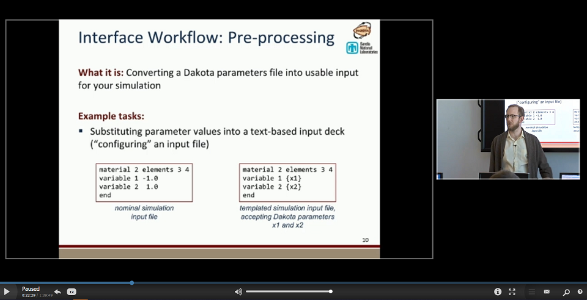
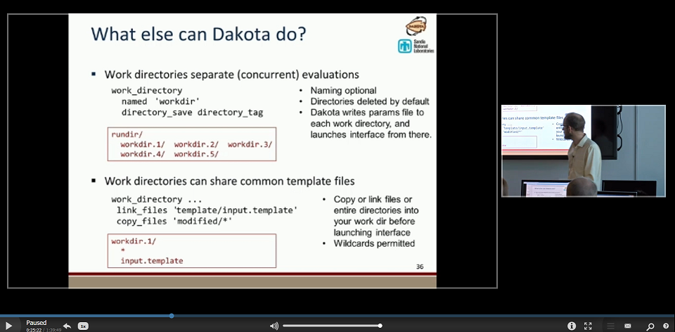

.. _couplingtosimulations-main:

"""""""""""""""""""""""""""""""
Coupling Dakota to a Simulation
"""""""""""""""""""""""""""""""

============
Introduction
============

A key Dakota advantage is access to a broad range of iterative capabilities through a single, relatively simple interface
between Dakota and external, black-box simulation models. By "black-box", we mean that Dakota has no (or little) awareness of the
internal details of the simulation model, obviating any need for the Dakota analyst to know anything about the simulation's source code. Such
loose coupling is the simplest and most common interfacing approach Dakota users employ. The black-box simulation model could
be a binary file, a script, or some other type of executable file. The goal of this page is to provide a brief overview of how
Dakota connects to that simulation model to study it.

.. figure:: ../img/CouplingSimulations1.png
   :name: coupling:figure01
   :alt: The loosely-coupled or "black-box" interface between Dakota and a user-supplied simulation code.
   :width: 800
   :align: center
   
   The loosely-coupled or "black-box" interface between Dakota and a user-supplied simulation code.

This figure depicts a typical loosely-coupled relationship between Dakota and the black-box simulation code. The solid lines denote file
input/output (I/O) operations inherent to Dakota or the analyst’s simulation code. The dotted lines indicate passing or converting
information that must be implemented by the analyst, via an **analysis driver** (analysis drivers will be defined below).

================
Analysis Drivers
================

Dakota and the simulation model communicate by **an exchange of parameters and responses.** This is achieved by reading and writing
short data files, which contain the parameter and response content.

Dakota uses **analysis drivers** to handle the actual reading and writing of these short data files. Analysis drivers can be thought of as the "glue" between Dakota and the simulation model.

An analysis driver could be:

- An executable script that was manually authored by an analyst.
- An executable file that was automatically generated by another tool (such as a Dakota GUI wizard, or a workflow in Next-Gen Workflow), based on existing knowledge about the black-box simulation model.

As Dakota runs, it does the following:

- Dakota specifies new variable values, based on the configuration of Dakota's original input file.
- Dakota writes the new variable values to a parameters file.
- The analysis driver is called with two arguments – the Dakota parameters file, and the destination results file, where data will eventually be written out.
- The analysis driver is responsible for preparing input to the simulation model. This step is referred to as **pre-processing.**
- The simulation model is **executed**, using the pre-processed input data.
- After the simulation model has finished running, the analysis driver is responsible for extracting quantities of interest from the simulation model's output (usually from console output, or from a log file) and preparing it for Dakota. This step is referred to as **post-processing**.
- The analysis driver must write the response values (i.e. quantities of interest) from the simulation model to Dakota's destination result file.
- Finally, Dakota collects the response values from the results file, and moves on to the next iteration, which starts this sequence over again.

This process is repeated until all of the simulations required by the iterative study are complete.

*Note on Terminology:* When speaking about coupling Dakota to a simulation model, the terms "parameter", "variable", and "input" may be used interchangeably,
based on the most appropriate word for the context, but they all mean approximately the same thing. Likewise, "response", "output", and "QOI"
(quantity of interest) will also be used interchangeably based on context.

======================
Guidance for Beginners
======================

Writing an analysis driver for the first time can feel daunting. We have collected some resources for helping you get started, organized depending on whether you prefer to
work on the command-line or in Dakota's GUI application.

----------------------
Command-Line Resources
----------------------

   - `Watch in-depth video tutorials for setting up Dakota with external simulation codes. <http://digitalops.sandia.gov/Mediasite/Play/82fa69553ac64d9b997a59316100d23a1d>`_
   
-------------
GUI Resources
-------------
   
   - The GUI recognizes :ref:`INI, JSON, and YAML files <gui-simulation-models-ini-json-yaml>` as simple, text-based structures for defining your simulation model's input parameters and output responses.
   - You can use the :ref:`Next-Gen Workflow tool<ngw-main>` in Dakota GUI to create a node-based workflow that will act as a Dakota analysis driver.
   - If your external simulation model receives a text-based input file, you can use :ref:`the Markup File tool in the GUI<gui-context-tools-markup>` to markup a text file with pre-processing syntax.

===============================================
Deep Dive into Dakota's Analysis Driver Process
===============================================

.. _user-supplied-sim-code-case1:

---------------------------
Compiled Rosenbrock Example
---------------------------

For this example, the C++ program ``rosenbrock.cpp`` in ``dakota_source/test`` is used as the black-box simulation code.
This file is compiled to create the standalone rosenbrock executable that is referenced as the analysis driver in the
example input file below. This standalone program performs the same function evaluations as Dakota’s internal Rosenbrock test function.

.. literalinclude:: ../samples/rosen_syscall.in
   :language: dakota
   :tab-width: 2
   :caption: Dakota input file for gradient-based optimization using
       the fork call interface to an external rosenbrock simulator.
   :name: tutorial:rosenbrock_user

(The input file shown in :numref:`tutorial:rosenbrock_user` is ``rosen_syscall.in``, which is provided in the directory ``dakota/share/dakota/examples/users.``)

The keyword ``fork`` indicates that Dakota will use fork calls to create separate Unix processes for
executions of the user-supplied simulation code. The name of the simulation code (and the names for Dakota’s parameters and
results file) are specified using the ``analysis_drivers``, ``parameters_file``, and ``results_file`` keywords, respectively.

The Dakota command is noted in the comments at the top of this file. Expected copies of the outputs are in the
``dakota/share/dakota/examples/users`` directory, with ``.sav`` appended to the name.

This run of Dakota takes longer to complete than other examples of gradient-based optimization for the Rosenbrock function,
since the fork interface method has additional process creation and file I/O overhead, as compared to the internal communication
that occurs when the direct interface method is used.

.. _couplingtosimulations-paramformat:

Parameter File Format
---------------------

To gain a better understanding of what exactly Dakota is doing with the fork interface approach, add the keywords ``file_tag``
and ``file_save`` to the interface specification and re-run Dakota. Check the listing of the local directory and you will see
many new files with names such as ``params.in.1``, ``params.in.2``, etc., and ``results.out.1``, ``results.out.2``, etc.
There is one ``params.in.X`` file and one ``results.out.X`` file for each of the function evaluations performed by Dakota.
This is the file listing for ``params.in.1``:

.. code-block::

						  2 variables
	 -1.200000000000000e+00 x1
	  1.000000000000000e+00 x2
						  1 functions
						  1 ASV_1:obj_fn
						  2 derivative_variables
						  1 DVV_1:x1
						  2 DVV_2:x2
						  0 analysis_components

The basic pattern is that of array lengths and string identifiers followed by listings of the array entries, where the arrays consist
of the variables, the active set vector (ASV), the derivative values vector (DVV), and the analysis components (AC).

For the variables array, the first line gives the total number of variables (2) and the “variables” string identifier, and the subsequent
two lines provide the array listing for the two variable values (-1.2 and 1.0) and descriptor tags (“x1” and “x2” from the
Dakota input file).

The next array conveys the ASV, which indicates what simulator outputs are needed. The first line of
the array gives the total number of response functions (1) and the “functions” string identifier, followed by one ASV code
and descriptor tag (“ASV 1”) for each function. In this case, the ASV value of 1 indicates that Dakota is requesting that the
simulation code return the response function value in the file results.out.X. (Possible ASV values: 1 = value of response
function value, 2 = response function gradient, 4 = response function Hessian, and any sum of these for combinations up to 7
= response function value, gradient, and Hessian; see 9.7 for more detail.)

The next array provides the DVV, which defines
the variable identifiers used in computing derivatives. The first line of the array gives the number of derivative variables (2)
and the “derivative variables” string identifier, followed by the listing of the two DVV variable identifiers (the first and second
variables) and descriptor tags (“DVV 1” and “DVV 2”). The final array provides the AC array used to provide additional
strings for use by the simulator (e.g., to provide the name of a particular mesh file). The first line of the array gives the total
number of analysis components (0) and the “analysis components” string identifier, followed by the listing of the array, which
is empty in this case.

---

The executable program ``rosenbrock`` reads in the ``params.in.X`` file and evaluates the objective function at the given values
for x1 and x2. Then, rosenbrock writes out the objective function data to the ``results.out.X`` file. Here is the listing for
the file ``results.out.1``:

.. code-block::

   2.420000000000000e+01 f

The value shown above is the value of the objective function, and the descriptor ‘f’ is an optional tag returned by the simulation
code. When the fork call has completed, Dakota reads in the data from the results.in.X file and processes the results.
Dakota then continues with additional executions of the rosenbrock program until the optimization process is complete.

.. _user-supplied-sim-code-case2:

------------------------------
User-Supplied Simulation Codes
------------------------------

In many situations the user-supplied simulation code cannot be modified to read and write the ``params.in.X`` file and the
``results.out.X`` file, as described above. Typically, this occurs when the simulation code is a commercial or proprietary
software product that has specific input file and output file formats. In such cases, it is common to replace the executable
program name in the Dakota input file with the name of a Unix shell script containing a sequence of commands that read and
write the necessary files and run the simulation code.

For example, the executable program named ``rosenbrock`` in the Dakota input file provided above could be replaced by a
Unix Bourne or C-shell script named ``simulator_script``, with the script containing a
sequence of commands to perform the following steps:

- Insert the data from the ``parameters.in.X`` file into the input file of the simulation code.
- Execute the simulation code.
- Post-process the files generated by the simulation code to compute response data, and return the response data to Dakota in the ``results.out.X`` file.

.. _user-supplied-sim-code-sand:

---------------------
SAND Simulation Codes
---------------------

In some cases it is advantageous to have a close coupling between Dakota and the simulation code. This close coupling is an
advanced feature of Dakota and is accomplished through either a direct interface or a *SAND* (Simultaneous ANalysis and Design)
interface. For the direct interface, the user’s simulation code is modified to behave as a function or subroutine under Dakota.
This interface can be considered to be “semi-intrusive” in that it requires relatively minor modifications to the simulation code.
Its major advantage is the elimination of the overhead resulting from file I/O and process creation. It can also be a useful
tool for parallel processing, by encapsulating all computation in a single executable.

A SAND interface approach is “fully intrusive” in that it requires further modifications to the simulation code so
that an optimizer has access to the internal residual vector and Jacobian matrices computed by the simulation code. In a SAND
approach, both the optimization method and a nonlinear simulation code are converged simultaneously. While this approach
can greatly reduce the computational expense of optimization, considerable software development effort must be expended to
achieve this intrusive coupling between SAND optimization methods and the simulation code. SAND may be supported in
future Dakota releases.

===============
Video Resources
===============

+-------------------------------------------------------+-----------------+----------------+
| Title                                                 | Link            | Resources      |
+=======================================================+=================+================+
| Interfacing a User's Simulation to Dakota (Part 1)    | |Training1|_    | `Slides`__ /   |
|                                                       |                 | `Exercises`__  |
+-------------------------------------------------------+-----------------+----------------+
| Interfacing a User's Simulation to Dakota (Part 2)    | |Training2|_    |                |
+-------------------------------------------------------+-----------------+----------------+

.. __: https://dakota.sandia.gov/sites/default/files/training/DakotaTraining_Interfacing.pdf
__ https://dakota.sandia.gov/sites/default/files/training/interfacing-151215.zip

.. _Training1: http://digitalops.sandia.gov/Mediasite/Play/82fa69553ac64d9b997a59316100d23a1d

.. _Training2: http://digitalops.sandia.gov/Mediasite/Play/5c5f47304b934159a40347f3ba74ad851d
