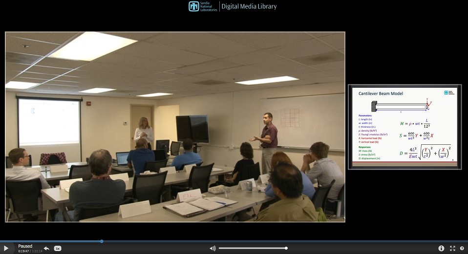

.. _dace:

Design of Experiments
=====================

.. _`dace:overview`:

Overview
--------

Classical design of experiments (DoE) methods and the more modern design
and analysis of computer experiments (DACE) methods are both techniques
which seek to extract as much trend data from a parameter space as
possible using a limited number of sample points. Classical DoE
techniques arose from technical disciplines that assumed some randomness
and nonrepeatability in field experiments (e.g., agricultural yield,
experimental chemistry). DoE approaches such as central composite
design, Box-Behnken design, and full and fractional factorial design
generally put sample points at the extremes of the parameter space,
since these designs offer more reliable trend extraction in the presence
of nonrepeatability. DACE methods are distinguished from DoE methods in
that the nonrepeatability component can be omitted since computer
simulations are involved. In these cases, space filling designs such as
orthogonal array sampling and Latin hypercube sampling are more commonly
employed in order to accurately extract trend information. Quasi-Monte
Carlo sampling techniques which are constructed to fill the unit
hypercube with good uniformity of coverage can also be used for DACE.

Dakota supports both DoE and DACE techniques. In common usage, only
parameter bounds are used in selecting the samples within the parameter
space. Thus, DoE and DACE can be viewed as special cases of the more
general probabilistic sampling for uncertainty quantification (see
following section), in which the DoE/DACE parameters are treated as
having uniform probability distributions. The DoE/DACE techniques are
commonly used for investigation of global response trends,
identification of significant parameters (e.g., main effects), and as
data generation methods for building response surface approximations.

Dakota includes several approaches sampling and design of experiments,
all implemented in included third-party software libraries. LHS (Latin
hypercube sampling) :cite:p:`Swi04` is a general-purpose
sampling package developed at Sandia that has been used by the DOE
national labs for several decades. DDACE (distributed design and
analysis for computer experiments) is a more recent package for computer
experiments developed at Sandia Labs :cite:p:`TonXX`. DDACE
provides the capability for generating orthogonal arrays, Box-Behnken
designs, Central Composite designs, and random designs. The FSUDace
(Florida State University’s Design and Analysis of Computer Experiments)
package provides the following sampling techniques: quasi-Monte Carlo
sampling based on Halton or Hammersley sequences, and Centroidal Voronoi
Tessellation. Lawrence Livermore National Lab’s PSUADE (Problem Solving
Environment for Uncertainty Analysis and Design
Exploration) :cite:p:`Ton05` includes several methods for
model exploration, but only the Morris screening method is exposed in
Dakota.

This chapter describes DDACE, FSUDace, and PSUADE, with a focus on
designing computer experiments. Latin Hypercube Sampling, also used in
uncertainty quantification, is discussed in :ref:`the section on sampling methods <uq:sampling>`.

.. _`dace:background`:

Design of Computer Experiments
------------------------------

What distinguishes design of *computer* experiments? Computer
experiments are often different from physical experiments, such as those
performed in agriculture, manufacturing, or biology. In physical
experiments, one often applies the same *treatment* or *factor level* in
an experiment several times to get an understanding of the variability
of the output when that treatment is applied. For example, in an
agricultural experiment, several fields (e.g., 8) may be subject to a
low level of fertilizer and the same number of fields may be subject to
a high level of fertilizer to see if the amount of fertilizer has a
significant effect on crop output. In addition, one is often interested
in the variability of the output within a treatment group: is the
variability of the crop yields in the low fertilizer group much higher
than that in the high fertilizer group, or not?

In physical experiments, the process we are trying to examine is
stochastic: that is, the same treatment may result in different
outcomes. By contrast, in computer experiments, often we have a
deterministic code. If we run the code with a particular set of input
parameters, the code will always produce the same output. There
certainly are stochastic codes, but the main focus of computer
experimentation has been on deterministic codes. Thus, in computer
experiments we often do not have the need to do replicates (running the
code with the exact same input parameters several times to see
differences in outputs). Instead, a major concern in computer
experiments is to create an experimental design which can sample a
high-dimensional space in a representative way with a minimum number of
samples. The number of factors or parameters that we wish to explore in
computer experiments is usually much higher than physical experiments.
In physical experiments, one may be interested in varying a few
parameters, usually five or less, while in computer experiments we often
have dozens of parameters of interest. Choosing the levels of these
parameters so that the samples adequately explore the input space is a
challenging problem. There are many experimental designs and sampling
methods which address the issue of adequate and representative sample
selection.

..
   TODO:
   %Classical experimental designs which are often used in physical experiments 
   %include Central Composite designs and Box-Behnken designs.

There are many goals of running a computer experiment: one may want to
explore the input domain or the design space and get a better
understanding of the range in the outputs for a particular domain.
Another objective is to determine which inputs have the most influence
on the output, or how changes in the inputs change the output. This is
usually called *sensitivity analysis*. 

..
   TODO:
   %Another goal is to compare the relative 
   %importance of model input uncertainties on the uncertainty in the model 
   %outputs, \emph{uncertainty analysis}. 

Another goal is to use the
sampled input points and their corresponding output to create a
*response surface approximation* for the computer code. The response
surface approximation (e.g., a polynomial regression model, a
Gaussian-process/Kriging model, a neural net) can then be used to
emulate the computer code. Constructing a response surface approximation
is particularly important for applications where running a computational
model is extremely expensive: the computer model may take 10 or 20 hours
to run on a high performance machine, whereas the response surface model
may only take a few seconds. Thus, one often optimizes the response
surface model or uses it within a framework such as surrogate-based
optimization. Response surface models are also valuable in cases where
the gradient (first derivative) and/or Hessian (second derivative)
information required by optimization techniques are either not
available, expensive to compute, or inaccurate because the derivatives
are poorly approximated or the function evaluation is itself noisy due
to roundoff errors. Furthermore, many optimization methods require a
good initial point to ensure fast convergence or to converge to good
solutions (e.g. for problems with multiple local minima). Under these
circumstances, a good design of computer experiment framework coupled
with response surface approximations can offer great advantages.

In addition to the sensitivity analysis and response surface modeling
mentioned above, we also may want to do *uncertainty quantification* on
a computer model. Uncertainty quantification (UQ) refers to taking a
particular set of distributions on the inputs, and propagating them
through the model to obtain a distribution on the outputs. For example,
if input parameter A follows a normal distribution with mean 5 and variance 1, the
computer produces a random draw from that distribution. If input
parameter B follows a weibull distribution with alpha = 0.5 and beta =
1, the computer produces a random draw from that distribution. When all
of the uncertain variables have samples drawn from their input
distributions, we run the model with the sampled values as inputs. We do
this repeatedly to build up a distribution of outputs. We can then use
the cumulative distribution function of the output to ask questions such
as: what is the probability that the output is greater than 10? What is
the 99th percentile of the output?

Note that sampling-based uncertainty quantification and design of
computer experiments are very similar. *There is significant overlap* in
the purpose and methods used for UQ and for DACE. We have attempted to
delineate the differences within Dakota as follows: we use the methods
DDACE, FSUDACE, and PSUADE primarily for design of experiments, where we
are interested in understanding the main effects of parameters and where
we want to sample over an input domain to obtain values for constructing
a response surface. We use the nondeterministic sampling methods
(:dakkw:`method-sampling`) for uncertainty quantification, where we are propagating
specific input distributions and interested in obtaining (for example) a
cumulative distribution function on the output. If one has a problem
with no distributional information, we recommend starting with a design
of experiments approach. Note that DDACE, FSUDACE, and PSUADE currently
do *not* support distributional information: they take an upper and
lower bound for each uncertain input variable and sample within that.
The uncertainty quantification methods in :dakkw:`method-sampling` (primarily Latin
Hypercube sampling) offer the capability to sample from many
distributional types. The distinction between UQ and DACE is somewhat
arbitrary: both approaches often can yield insight about important
parameters and both can determine sample points for response surface
approximations.

Three software packages are available in Dakota for design of computer
experiments, DDACE (developed at Sandia Labs), FSUDACE (developed at
Florida State University), and PSUADE (LLNL).

.. _`dace:ddace`:

DDACE
-----

The Distributed Design and Analysis of Computer Experiments (DDACE)
package includes both classical design of experiments
methods :cite:p:`TonXX` and stochastic sampling methods. The
classical design of experiments methods in DDACE are central composite
design (CCD) and Box-Behnken (BB) sampling. A grid-based sampling
(full-factorial) method is also available. The stochastic methods are
orthogonal array sampling :cite:p:`Koe96` (which permits main
effects calculations), Monte Carlo (random) sampling, Latin hypercube
sampling, and orthogonal array-Latin hypercube sampling. While DDACE LHS
supports variables with normal or uniform distributions, only uniform
are supported through Dakota. Also DDACE does not allow enforcement of
user-specified correlation structure among the variables.

The sampling methods in DDACE can be used alone or in conjunction with
other methods. For example, DDACE sampling can be used with both
surrogate-based optimization and optimization under uncertainty advanced
methods. See :numref:`adv_models:figure09` for
an example of how the DDACE settings are used in Dakota.

..
   TODO: Cross-reference DDACE package description

The following sections provide more detail about the sampling methods
available for design of experiments in DDACE.

.. _`dace:ccd`:

Central Composite Design
~~~~~~~~~~~~~~~~~~~~~~~~

A Box-Wilson Central Composite Design, commonly called a central
composite design (CCD), contains an embedded factorial or fractional
factorial design with center points that is augmented with a group of
’star points’ that allow estimation of curvature. If the distance from
the center of the design space to a factorial point is :math:`\pm`\ 1
unit for each factor, the distance from the center of the design space
to a star point is :math:`\pm\alpha` with :math:`\mid\alpha\mid > 1`.
The precise value of :math:`\alpha` depends on certain properties
desired for the design and on the number of factors involved. The CCD
design is specified in Dakota with the method command
:dakkw:`method-dace` :dakkw:`method-dace-central_composite`.

As an example, with two input variables or factors, each having two
levels, the factorial design is shown in :numref:`dace-table1`:

.. table:: *Simple Factorial Design*
   :name: dace-table1
   :align: center
   :widths: auto
 
   +----------+---------+
   |Input 1   |Input 2  |
   +==========+=========+
   |-1        |-1       |
   +----------+---------+
   |-1        |+1       |
   +----------+---------+
   |+1        |-1       |
   +----------+---------+
   |+1        |+1       |
   +----------+---------+   

With a CCD, the design in :numref:`dace-table1` would be
augmented with the points shown in :numref:`dace-table2`,
if :math:`\alpha` = 1.3.

.. table:: *Additional Points to make the factorial design a CCD*
   :name: dace-table2
   :align: center
   :widths: auto
 
   +----------+---------+
   |Input 1   |Input 2  |
   +==========+=========+
   |0         |+1.3     |
   +----------+---------+
   |0         |-1.3     |
   +----------+---------+
   |1.3       |0        |
   +----------+---------+
   |-1.3      |0        |
   +----------+---------+ 
   |0         |0        |
   +----------+---------+ 

These points define a circle around the original factorial design.
Note that the number of sample points specified in a CCD, :dakkw:`method-dace-samples`,
is a function of the number of variables in the problem:

.. math:: samples = 1 + 2*NumVar + 2^{NumVar}

.. _`dace:bb`:

Box-Behnken Design
~~~~~~~~~~~~~~~~~~

The Box-Behnken design is similar to a Central Composite design, with
some differences. The Box-Behnken design is a quadratic design in that
it does not contain an embedded factorial or fractional factorial
design. In this design the treatment combinations are at the midpoints
of edges of the process space and at the center, as compared with CCD
designs where the extra points are placed at ’star points’ on a circle
outside of the process space. Box-Behken designs are rotatable (or near
rotatable) and require 3 levels of each factor. The designs have limited
capability for orthogonal blocking compared to the central composite
designs. Box-Behnken requires fewer runs than CCD for 3 factors, but
this advantage goes away as the number of factors increases. The
Box-Behnken design is specified in Dakota with the method command
:dakkw:`method-dace` :dakkw:`method-dace-box_behnken`.

Note that the number of sample points specified in a Box-Behnken design,
:dakkw:`method-dace-samples`, is a function of the number of variables in the problem:

.. math:: samples = 1 + 4*NumVar + (NumVar-1)/2

.. _`dace:oas`:

Orthogonal Array Designs
~~~~~~~~~~~~~~~~~~~~~~~~

Orthogonal array (OA) sampling is a widely used technique for running
experiments and systematically testing factor
effects :cite:p:`Hed99`. An orthogonal array sample can be
described as a 4-tuple :math:`(m,n,s,r)`, where :math:`m` is the number
of sample points, :math:`n` is the number of input variables, :math:`s`
is the number of symbols, and :math:`r` is the strength of the
orthogonal array. The number of sample points, :math:`m`, must be a
multiple of the number of symbols, :math:`s`. The number of symbols
refers to the number of levels per input variable. The strength refers
to the number of columns where we are guaranteed to see all the
possibilities an equal number of times.

For example, :numref:`dace-table3` shows an orthogonal array of
strength 2 for :math:`m` = 8, with 7 variables:

.. table:: *Orthogonal Array for Seven Variables*
   :name: dace-table3
   :align: center
   :widths: auto

   ======= ======= ======= ======= ======= ======= =======
   Input 1 Input 2 Input 3 Input 4 Input 5 Input 6 Input 7
   ======= ======= ======= ======= ======= ======= =======
   0       0       0       0       0       0       0
   0       0       0       1       1       1       1
   0       1       1       0       0       1       1
   0       1       1       1       1       0       0
   1       0       1       0       1       0       1
   1       0       1       1       0       1       0
   1       1       0       0       1       1       0
   1       1       0       1       0       0       1
   ======= ======= ======= ======= ======= ======= =======

If one picks any two columns, say the first and the third, note that
each of the four possible rows we might see there, 0 0, 0 1, 1 0, 1 1,
appears exactly the same number of times, twice in this case.

DDACE creates orthogonal arrays of strength 2. Further, the OAs
generated by DDACE do not treat the factor levels as one fixed value (0
or 1 in the above example). Instead, once a level for a variable is
determined in the array, DDACE samples a random variable from within
that level. The orthogonal array design is specified in Dakota with the
method command :dakkw:`method-dace` :dakkw:`method-dace-oas`.

The orthogonal array method in DDACE is the only method that allows for
the calculation of main effects, specified with the command
:dakkw:`method-dace-main_effects`. Main effects is a sensitivity analysis method which
identifies the input variables that have the most influence on the
output. In main effects, the idea is to look at the mean of the response
function when variable A (for example) is at level 1 vs. when variable A
is at level 2 or level 3. If these mean responses of the output are
statistically significantly different at different levels of variable A,
this is an indication that variable A has a significant effect on the
response. The orthogonality of the columns is critical in performing
main effects analysis, since the column orthogonality means that the
effects of the other variables ’cancel out’ when looking at the overall
effect from one variable at its different levels. There are ways of
developing orthogonal arrays to calculate higher order interactions,
such as two-way interactions (what is the influence of Variable A \*
Variable B on the output?), but this is not available in DDACE
currently. At present, one way interactions are supported in the
calculation of orthogonal array main effects within DDACE. The main
effects are presented as a series of ANOVA tables. For each objective
function and constraint, the decomposition of variance of that objective
or constraint is presented as a function of the input variables. The
p-value in the ANOVA table is used to indicate if the input factor is
significant. The p-value is the probability that you would have obtained
samples more extreme than you did if the input factor has no effect on
the response. For example, if you set a level of significance at 0.05
for your p-value, and the actual p-value is 0.03, then the input factor
has a significant effect on the response.

.. _`dace:grid`:

Grid Design
~~~~~~~~~~~

In a grid design, a grid is placed over the input variable space. This
is very similar to a multi-dimensional parameter study where the samples
are taken over a set of partitions on each variable. The main
difference is that in grid sampling, a small random perturbation is
added to each sample value so that the grid points are not on a perfect
grid. This is done to help capture certain features in the output such
as periodic functions. A purely structured grid, with the samples
exactly on the grid points, has the disadvantage of not being able to
capture important features such as periodic functions with relatively
high frequency (due to aliasing). Adding a random perturbation to the
grid samples helps remedy this problem.

Another disadvantage with grid sampling is that the number of sample
points required depends exponentially on the input dimensions. In grid
sampling, the number of samples is the number of symbols (grid
partitions) raised to the number of variables. For example, if there are
2 variables, each with 5 partitions, the number of samples would be
:math:`5^2`. In this case, doubling the number of variables squares the
sample size. The grid design is specified in Dakota with the method
command :dakkw:`method-dace` :dakkw:`method-dace-grid`.

.. note::

   Refer to the section on :ref:`multi-dimensional parameter studies <ps:multidimensional>` for more information.

.. _`dace:mc`:

Monte Carlo Design
~~~~~~~~~~~~~~~~~~

Monte Carlo designs simply involve pure Monte-Carlo random sampling from
uniform distributions between the lower and upper bounds on each of the
input variables. Monte Carlo designs, specified by :dakkw:`method-dace` :dakkw:`method-dace-random`, are
a way to generate a set of random samples over an input domain.

.. _`dace:lhs`:

LHS Design
~~~~~~~~~~

DDACE offers the capability to generate Latin Hypercube designs. Note that the version of LHS
in DDACE generates uniform samples (uniform between the variable
bounds). The version of LHS offered with nondeterministic sampling can
generate LHS samples according to a number of distribution types,
including normal, lognormal, weibull, beta, etc. To specify the DDACE
version of LHS, use the method command :dakkw:`method-dace` :dakkw:`method-dace-lhs`.

.. note::

   Refer to the section on :ref:`Latin Hypercube sampling <uq:sampling>` for more information.

.. _`dace:oalhs`:

OA-LHS Design
~~~~~~~~~~~~~

DDACE offers a hybrid design which is combination of an orthogonal array
and a Latin Hypercube sample. This design is specified with the method
command :dakkw:`method-dace` :dakkw:`method-dace-oa_lhs`. This design has the advantages of both
orthogonality of the inputs as well as stratification of the samples
(see :cite:p:`Owe92`).

.. _`dace:fsudace`:

FSUDace
-------

The Florida State University Design and Analysis of Computer Experiments
(FSUDace) package provides quasi-Monte Carlo sampling (Halton and
Hammersley) and Centroidal Voronoi Tessellation (CVT) methods. All three
methods natively generate sets of uniform random variables on the
interval :math:`[0,1]` (or in Dakota, on user-specified uniform
intervals).

The quasi-Monte Carlo and CVT methods are designed with the goal of low
discrepancy. Discrepancy refers to the nonuniformity of the sample
points within the unit hypercube. Low discrepancy sequences tend to
cover the unit hypercube reasonably uniformly. Quasi-Monte Carlo methods
produce low discrepancy sequences, especially if one is interested in
the uniformity of projections of the point sets onto lower dimensional
faces of the hypercube (usually 1-D: how well do the marginal
distributions approximate a uniform?) CVT does very well volumetrically:
it spaces the points fairly equally throughout the space, so that the
points cover the region and are isotropically distributed with no
directional bias in the point placement. There are various measures of
volumetric uniformity which take into account the distances between
pairs of points, regularity measures, etc. Note that CVT does not
produce low-discrepancy sequences in lower dimensions, however: the
lower-dimension (such as 1-D) projections of CVT can have high
discrepancy.

The quasi-Monte Carlo sequences of Halton and Hammersley are
deterministic sequences determined by a set of prime bases. A Halton
design is specified in Dakota with the method command
:dakkw:`method-fsu_quasi_mc` :dakkw:`method-fsu_quasi_mc-halton`, and the Hammersley design is specified with the
command :dakkw:`method-fsu_quasi_mc` :dakkw:`method-fsu_quasi_mc-hammersley`. For more details about the input
specification, see :ref:`the Reference Manual <method-fsu_quasi_mc>`. CVT points tend to arrange
themselves in a pattern of cells that are roughly the same shape. To
produce CVT points, an almost arbitrary set of initial points is chosen,
and then an internal set of iterations is carried out. These iterations
repeatedly replace the current set of sample points by an estimate of
the centroids of the corresponding Voronoi
subregions :cite:p:`Du99`. A CVT design is specified in Dakota
with the method command :dakkw:`method-fsu_cvt`.

The methods in FSUDace are useful for design of experiments because they
provide good coverage of the input space, thus allowing global
sensitivity analysis.

.. _`dace:psuade`:

PSUADE MOAT
-----------

PSUADE (Problem Solving Environment for Uncertainty Analysis and Design
Exploration) is a Lawrence Livermore National Laboratory tool for
metamodeling, sensitivity analysis, uncertainty quantification, and
optimization. Its features include non-intrusive and parallel function
evaluations, sampling and analysis methods, an integrated design and
analysis framework, global optimization, numerical integration, response
surfaces (MARS and higher order regressions), graphical output with
Pgplot or Matlab, and fault tolerance :cite:p:`Ton05`. Dakota
includes a prototype interface to its Morris One-At-A-Time (MOAT)
screening method, a valuable tool for global sensitivity (including
interaction) analysis.

The Morris One-At-A-Time method, originally proposed by M. D.
Morris :cite:p:`Mor91`, is a screening method, designed to
explore a computational model to distinguish between input variables
that have negligible, linear and additive, or nonlinear or interaction
effects on the output. The computer experiments performed consist of
individually randomized designs which vary one input factor at a time to
create a sample of its elementary effects.

With MOAT, each dimension of a :math:`k-`\ dimensional input space is
uniformly partitioned into :math:`p` levels, creating a grid of
:math:`p^k` points :math:`{\bf x} \in \mathbb{R}^k` at which evaluations
of the model :math:`y({\bf
x})` might take place. An elementary effect corresponding to input
:math:`i` is computed by a forward difference

.. math:: d_i({\bf x}) = \frac{y({\bf x} + \Delta {\bf e}_i) - y({\bf x})}{\Delta},

where :math:`e_i` is the :math:`i^{\mbox{th}}` coordinate
vector, and the step :math:`\Delta` is typically taken to be large (this
is not intended to be a local derivative approximation). In the present
implementation of MOAT, for an input variable scaled to :math:`[0,1]`,
:math:`\Delta = \frac{p}{2(p-1)}`, so the step used to find elementary
effects is slightly larger than half the input range.

The distribution of elementary effects :math:`d_i` over the input space
characterizes the effect of input :math:`i` on the output of interest.
After generating :math:`r` samples from this distribution, their mean,

.. math:: \mu_i = \frac{1}{r}\sum_{j=1}^{r}{d_i^{(j)}},

modified mean

.. math:: \mu_i^* = \frac{1}{r}\sum_{j=1}^{r}{|d_i^{(j)}|},

(using absolute value) and standard deviation

.. math::

   \sigma_i = \sqrt{ \frac{1}{r}\sum_{j=1}^{r}{ \left(d_i^{(j)} - \mu_i
   \right)^2} }

are computed for each input :math:`i`. The mean and modified mean give
an indication of the overall effect of an input on the output. Standard
deviation indicates nonlinear effects or interactions, since it is an
indicator of elementary effects varying throughout the input space.

The MOAT method is selected with method keyword :dakkw:`method-psuade_moat` as shown
in the sample Dakota input file :numref:`FIG:moat_input`.

.. literalinclude:: ../samples/morris_ps_moat.in
   :language: dakota
   :tab-width: 2
   :caption: Dakota input file showing the Morris One-at-a-Time method
       -- see ``dakota/share/dakota/examples/users/morris_ps_moat.in``
   :name: FIG:moat_input

The number of :dakkw:`method-psuade_moat-samples` must be a positive integer multiple of (number of
continuous design variables :math:`k` + 1) and will be automatically
adjusted if misspecified. The number of :dakkw:`method-psuade_moat-partitions`
applies to each variable being studied and must be odd (the number of
MOAT levels :math:`p` per variable is partitions + 1, similar to Dakota
multidimensional parameter studies). This will also be adjusted at
runtime as necessary. Finite user-specified lower and upper bounds are
required and will be scaled as needed by the method.

.. note::
   
   For more information on the use of MOAT sampling, see :ref:`this Morris example <additional:morris>`,
   or Saltelli, et al. :cite:p:`Sal04`.

.. _`dace:sa`:

Sensitivity Analysis
--------------------

.. _`dace:sa:overview`:

Sensitivity Analysis Overview
~~~~~~~~~~~~~~~~~~~~~~~~~~~~~

In many engineering design applications, sensitivity analysis techniques
and parameter study methods are useful in identifying which of the
design parameters have the most influence on the response quantities.
This information is helpful prior to an optimization study as it can be
used to remove design parameters that do not strongly influence the
responses. In addition, these techniques can provide assessments as to
the behavior of the response functions (smooth or nonsmooth, unimodal or
multimodal) which can be invaluable in algorithm selection for
optimization, uncertainty quantification, and related methods. In a
post-optimization role, sensitivity information is useful is determining
whether or not the response functions are robust with respect to small
changes in the optimum design point.

In some instances, the term sensitivity analysis is used in a local
sense to denote the computation of response derivatives at a point.
These derivatives are then used in a simple analysis to make design
decisions. Dakota supports this type of study through numerical
finite-differencing or retrieval of analytic gradients computed within
the analysis code. The desired gradient data is specified in the
responses section of the Dakota input file and the collection of this
data at a single point is accomplished through a parameter study method
with no steps. This approach to sensitivity analysis should be
distinguished from the activity of augmenting analysis codes to
internally compute derivatives using techniques such as direct or
adjoint differentiation, automatic differentiation (e.g., ADIFOR), or
complex step modifications. These sensitivity augmentation activities
are completely separate from Dakota and are outside the scope of this
manual. However, once completed, Dakota can utilize these analytic
gradients to perform optimization, uncertainty quantification, and
related studies more reliably and efficiently.

In other instances, the term sensitivity analysis is used in a more
global sense to denote the investigation of variability in the response
functions. Dakota supports this type of study through computation of
response data sets (typically function values only, but all data sets
are supported) at a series of points in the parameter space. The series
of points is defined using either a vector, list, centered, or
multidimensional parameter study method. For example, a set of
closely-spaced points in a vector parameter study could be used to
assess the smoothness of the response functions in order to select a
finite difference step size, and a set of more widely-spaced points in a
centered or multidimensional parameter study could be used to determine
whether the response function variation is likely to be unimodal or
multimodal. See :ref:`Parameter Studies Capabilities <ps>` for additional information on
these methods. These more global approaches to sensitivity analysis can
be used to obtain trend data even in situations when gradients are
unavailable or unreliable, and they are conceptually similar to the
design of experiments methods and sampling approaches to uncertainty
quantification described in the following sections.

.. _`dace:sa:assessing`:

Assessing Sensitivity with DACE
~~~~~~~~~~~~~~~~~~~~~~~~~~~~~~~

Like :ref:`parameter studies <ps>`, the DACE techniques
are useful for characterizing the behavior of the response functions of
interest through the parameter ranges of interest. In addition to direct
interrogation and visualization of the sampling results, a number of
techniques have been developed for assessing the parameters which are
most influential in the observed variability in the response functions.
One example of this is the well-known technique of scatter plots, in
which the set of samples is projected down and plotted against one
parameter dimension, for each parameter in turn. Scatter plots with a
uniformly distributed cloud of points indicate parameters with little
influence on the results, whereas scatter plots with a defined shape to
the cloud indicate parameters which are more significant. Related
techniques include analysis of variance
(ANOVA) :cite:p:`Mye95` and main effects analysis, in which
the parameters which have the greatest influence on the results are
identified from sampling results. Scatter plots and ANOVA may be
accessed through :ref:`import of Dakota tabular results <output:tabular>` into external
statistical analysis programs such as S-plus, Minitab, etc.

Running any of the design of experiments or sampling methods allows the
user to save the results in a tabular data file, which then can be read
into a spreadsheet or statistical package for further analysis. In
addition, we have provided some functions to help determine the most
important variables.

We take the definition of uncertainty analysis
from :cite:p:`Sal04`: “The study of how uncertainty in the
output of a model can be apportioned to different sources of uncertainty
in the model input.”

As a default, Dakota provides correlation analyses when running LHS.
Correlation tables are printed with the simple, partial, and rank
correlations between inputs and outputs. These can be useful to get a
quick sense of how correlated the inputs are to each other, and how
correlated various outputs are to inputs. The correlation analyses are
explained further in :ref:`the sampling section <uq:sampling>`.

We also have the capability to calculate sensitivity indices through
Variance-based Decomposition (VBD). Variance-based decomposition is a
global sensitivity method that summarizes how the uncertainty in model
output can be apportioned to uncertainty in individual input variables.
VBD uses two primary measures, the main effect sensitivity index
:math:`S_{i}` and the total effect index :math:`T_{i}`. The main effect
sensitivity index corresponds to the fraction of the uncertainty in the
output, :math:`Y`, that can be attributed to input :math:`x_{i}` alone.
The total effects index corresponds to the fraction of the uncertainty
in the output, :math:`Y`, that can be attributed to input :math:`x_{i}`
and its interactions with other variables. The main effect sensitivity
index compares the variance of the conditional expectation
:math:`Var_{x_{i}}[E(Y|x_{i})]` against the total variance
:math:`Var(Y)`. Formulas for the indices are:

.. math:: S_{i}=\frac{Var_{x_{i}}[E(Y|x_{i})]}{Var(Y)} \label{eq:VBD_Si}

and

.. math:: T_{i}=\frac{E(Var(Y|x_{-i}))}{Var(Y)}=\frac{Var(Y)-Var(E[Y|x_{-i}])}{Var(Y)} \label{eq:VBD_Ti}

where :math:`Y=f({\bf x})` and
:math:`{x_{-i}=(x_{1},...,x_{i-1},x_{i+1},...,x_{m})}`.

The calculation of :math:`S_{i}` and :math:`T_{i}` requires the
evaluation of m-dimensional integrals which are typically approximated
by Monte-Carlo sampling. More details on the calculations and
interpretation of the sensitivity indices can be found
in :cite:p:`Sal04`. In Dakota version 5.1, we have improved
calculations for the calculation of the :math:`S_{i}` and :math:`T_{i}`
indices when using sampling. The implementation details of these
calculatiosn are provided in :cite:p:`Weirs10`. VBD can be
specified for any of the sampling or DACE methods using the command
:dakkw:`method-dace-variance_based_decomp`. Note that VBD is extremely
computationally intensive when using sampling since replicated sets of
sample values are evaluated. If the user specified a number of samples,
:math:`N`, and a number of nondeterministic variables, :math:`M`,
variance-based decomposition requires the evaluation of :math:`N(M+2)`
samples. To obtain sensitivity indices that are reasonably accurate, we
recommend that :math:`N`, the number of samples, be at least one hundred
and preferably several hundred or thousands. Because of the
computational cost, variance-based decomposition is turned off as a
default for sampling or DACE. Another alternative, however, is to obtain
these indices using :ref:`one of the stochastic expansion methods <uq:expansion>`. The calculation of the
indices using expansion methods is much more efficient since the VBD
indices are analytic functions of the coefficients in the stochastic
expansion. The paper by Weirs et al. :cite:p:`Weirs10`
compares different methods for calculating the sensitivity indices for
nonlinear problems with significant interaction effects.

In terms of interpretation of the sensitivity indices, a larger value of
the sensitivity index, :math:`S_{i}`, means that the uncertainty in the
input variable :math:`i` has a larger effect on the variance of the
output. Note that the sum of the main effect indices will be less than
or equal to one. If the sum of the main effect indices is much less than
one, it indicates that there are significant two-way, three-way, or
higher order interactions that contribute significantly to the variance.
There is no requirement that the sum of the total effect indices is one:
in most cases, the sum of the total effect indices will be greater than
one. An example of the Main and Total effects indices as calculated by
Dakota using sampling is shown in the following spinnet of Dakota output:

.. code-block::

   Global sensitivity indices for each response function:
   response_fn_1 Sobol indices:
                                       Main             Total
                           4.7508913283e-01  5.3242162037e-01 uuv_1
                           3.8112392892e-01  4.9912486515e-01 uuv_2

Finally, we have the capability to calculate a set of quality metrics
for a particular input sample. These quality metrics measure various
aspects relating to the volumetric spacing of the samples: are the
points equally spaced, do they cover the region, are they isotropically
distributed, do they have directional bias, etc.? The quality metrics
are explained in more detail in the Reference Manual.

.. _`dace:usage`:

DOE Usage Guidelines
--------------------

Parameter studies, classical design of experiments (DOE),
design/analysis of computer experiments (DACE), and sampling methods
share the purpose of exploring the parameter space. When a global
space-filling set of samples is desired, then the DOE, DACE, and
sampling methods are recommended. These techniques are useful for
scatter plot and variance analysis as well as surrogate model
construction.

The distinction between DOE and DACE methods is that the former are
intended for physical experiments containing an element of
nonrepeatability (and therefore tend to place samples at the extreme
parameter vertices), whereas the latter are intended for repeatable
computer experiments and are more space-filling in nature.

The distinction between DOE/DACE and sampling is drawn based on the
distributions of the parameters. DOE/DACE methods typically assume
uniform distributions, whereas the sampling approaches in Dakota support
a broad range of probability distributions.

To use :dakkw:`method-sampling` in design of experiments mode (as opposed to
uncertainty quantification mode), an active view override (e.g.,
:dakkw:`variables-active` :dakkw:`variables-active-all`) can be included in the variables specification (see
:ref:`"Management of Mixed Variables by Iterator" <variables:mixedview>`) of the Dakota
input file.

Design of experiments method selection recommendations are summarized in :numref:`dace:usage:table`:

.. table:: *Guidelines for selection of parameter study, DOE, DACE, and sampling methods.*
   :name: dace:usage:table
   :align: center
   :widths: auto

   +-----------------------+-----------------------+----------------------------------------------------------------------+
   | Method Classification | Applications          | Applicable Methods                                                   |
   +=======================+=======================+======================================================================+
   | parameter study       | sensitivity analysis, | :dakkw:`method-centered_parameter_study`,                            |
   |                       | directed parameter    | :dakkw:`method-list_parameter_study`,                                |
   |                       | space investigations  | :dakkw:`method-multidim_parameter_study`,                            |
   |                       |                       | :dakkw:`method-vector_parameter_study`                               |
   +-----------------------+-----------------------+----------------------------------------------------------------------+
   | classical design      | physical experiments  | :dakkw:`method-dace` (:dakkw:`method-dace-box_behnken`,              |
   | of experiments        | (parameters are       | :dakkw:`method-dace-central_composite`)                              |
   |                       | uniformly             |                                                                      |
   |                       | distributed)          |                                                                      |
   +-----------------------+-----------------------+----------------------------------------------------------------------+
   | design of computer    | variance analysis,    | :dakkw:`method-dace` (:dakkw:`method-dace-grid`,                     |
   | experiments           | space filling design  | :dakkw:`method-dace-random`, :dakkw:`method-dace-oas`                |
   |                       | (parameters are       | :dakkw:`method-dace-lhs`, :dakkw:`method-dace-oa_lhs`),              |
   |                       | uniformly distributed)| :dakkw:`method-fsu_quasi_mc`                                         |
   |                       |                       | (:dakkw:`method-fsu_quasi_mc-halton`,                                |
   |                       |                       | :dakkw:`method-fsu_quasi_mc-hammersley`),                            |
   |                       |                       | :dakkw:`method-fsu_cvt`, :dakkw:`method-psuade_moat`                 |
   +-----------------------+-----------------------+----------------------------------------------------------------------+
   | sampling              | space filling designs | :dakkw:`method-sampling`                                             |
   |                       | (parameters have      | (:dakkw:`method-sampling-sample_type-random` or                      |
   |                       | general probability   | :dakkw:`method-sampling-sample_type-lhs`) with optional active view  |
   |                       | distributions)        | override                                                             |
   +-----------------------+-----------------------+----------------------------------------------------------------------+
   
Video Resources
---------------

+--------------------------------------+-----------------+----------------+
| Title                                | Link            | Resources      |
+======================================+=================+================+
| Sensitivity Analysis                 | |Training|_     | `Slides`__ /   |
|                                      |                 | `Exercises`__  |
+--------------------------------------+-----------------+----------------+
| Introduction to Sensitivity Analysis | |Video|_        |                |
+--------------------------------------+-----------------+----------------+

.. __: https://dakota.sandia.gov/sites/default/files/training/DakotaTraining_SensitivityAnalysis.pdf
__ https://dakota.sandia.gov/sites/default/files/training/sens_analysis-220216.zip

.. _Training: https://digitalops.sandia.gov/Mediasite/Play/e273e948e94a4f4a9fbdd385c1ef4c8a1d

.. _Video: https://www.youtube.com/watch?v=YshRCgm_f1Y
