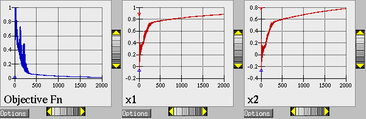

.. _opt:

Optimization
============

Optimization algorithms work to minimize (or maximize) an objective
function, typically calculated by the user simulation code, subject to
constraints on design variables and responses. Available approaches in
Dakota include well-tested and proven gradient-based, derivative-free
local, and global methods for use in science and engineering design
applications. Dakota also offers more advanced algorithms, e.g., to
manage multi-objective optimization or perform surrogate-based
minimization. This chapter summarizes optimization problem formulation,
standard algorithms available in Dakota (mostly through included
third-party libraries, see `1.5 <#opt:libraries>`__), some advanced
capabilities, and offers usage guidelines.

.. _`opt:formulations`:

Optimization Formulations
-------------------------

This section provides a basic introduction to the mathematical
formulation of optimization, problems. The primary goal of this section
is to introduce terms relating to these topics, and is not intended to
be a description of theory or numerical algorithms. For further details,
consult :cite:p:`Aro89`, :cite:p:`Gil81`, :cite:p:`Haf92`, :cite:p:`Noc99`,
and  :cite:p:`Van84`.

A general optimization problem is formulated as follows:

.. math::

   \begin{aligned}
     \hbox{minimize:} & & f(\mathbf{x})\nonumber\\
     & & \mathbf{x} \in \Re^{n}\nonumber\\
     \hbox{subject to:} & &
     \mathbf{g}_{L} \leq \mathbf{g(x)} \leq \mathbf{g}_U\nonumber\\
     & & \mathbf{h(x)}=\mathbf{h}_{t}\label{opt:formulations:equation01}\\
     & & \mathbf{a}_{L} \leq \mathbf{A}_i\mathbf{x} \leq
     \mathbf{a}_U\nonumber\\
     & & \mathbf{A}_{e}\mathbf{x}=\mathbf{a}_{t}\nonumber\\
     & & \mathbf{x}_{L} \leq \mathbf{x} \leq \mathbf{x}_U\nonumber\end{aligned}

where vector and matrix terms are marked in bold typeface. In this
formulation, :math:`\mathbf{x}=[x_{1},x_{2},\ldots,x_{n}]` is an
n-dimensional vector of real-valued *design variables* or *design
parameters*. The n-dimensional vectors, :math:`\mathbf{x}_{L}` and
:math:`\mathbf{x}_U`, are the lower and upper bounds, respectively, on
the design parameters. These bounds define the allowable values for the
elements of :math:`\mathbf{x}`, and the set of all allowable values is
termed the *design space* or the *parameter space*. A *design point* or
a *sample point* is a particular set of values within the parameter
space.

The optimization goal is to minimize the *objective function*,
:math:`f(\mathbf{x})`, while satisfying the constraints. Constraints can
be categorized as either linear or nonlinear and as either inequality or
equality. The *nonlinear inequality constraints*, :math:`\mathbf{g(x)}`,
are “2-sided,” in that they have both lower and upper bounds,
:math:`\mathbf{g}_L` and :math:`\mathbf{g}_U`, respectively. The
*nonlinear equality constraints*, :math:`\mathbf{h(x)}`, have target
values specified by :math:`\mathbf{h}_{t}`. The linear inequality
constraints create a linear system :math:`\mathbf{A}_i\mathbf{x}`, where
:math:`\mathbf{A}_i` is the coefficient matrix for the linear system.
These constraints are also 2-sided as they have lower and upper bounds,
:math:`\mathbf{a}_L` and :math:`\mathbf{a}_U`, respectively. The linear
equality constraints create a linear system
:math:`\mathbf{A}_e\mathbf{x}`, where :math:`\mathbf{A}_e` is the
coefficient matrix for the linear system and :math:`\mathbf{a}_{t}` are
the target values. The constraints partition the parameter space into
feasible and infeasible regions. A design point is said to be *feasible*
if and only if it satisfies all of the constraints. Correspondingly, a
design point is said to be *infeasible* if it violates one or more of
the constraints.

Many different methods exist to solve the optimization problem given by
Equation `[opt:formulations:equation01] <#opt:formulations:equation01>`__,
all of which iterate on :math:`\mathbf{x}` in some manner. That is, an
initial value for each parameter in :math:`\mathbf{x}` is chosen, the
*response quantities*, :math:`f(\mathbf{x})`, :math:`\mathbf{g(x)}`,
:math:`\mathbf{h(x)}`, are computed, often by running a simulation, and
some algorithm is applied to generate a new :math:`\mathbf{x}` that will
either reduce the objective function, reduce the amount of
infeasibility, or both. To facilitate a general presentation of these
methods, three criteria will be used in the following discussion to
differentiate them: optimization problem type, search goal, and search
method.

The **optimization problem type** can be characterized both by the types
of constraints present in the problem and by the linearity or
nonlinearity of the objective and constraint functions. For constraint
categorization, a hierarchy of complexity exists for optimization
algorithms, ranging from simple bound constraints, through linear
constraints, to full nonlinear constraints. By the nature of this
increasing complexity, optimization problem categorizations are
inclusive of all constraint types up to a particular level of
complexity. That is, an *unconstrained problem* has no constraints, a
*bound-constrained problem* has only lower and upper bounds on the
design parameters, a *linearly-constrained problem* has both linear and
bound constraints, and a *nonlinearly-constrained problem* may contain
the full range of nonlinear, linear, and bound constraints. If all of
the linear and nonlinear constraints are equality constraints, then this
is referred to as an *equality-constrained problem*, and if all of the
linear and nonlinear constraints are inequality constraints, then this
is referred to as an *inequality-constrained problem*. Further
categorizations can be made based on the linearity of the objective and
constraint functions. A problem where the objective function and all
constraints are linear is called a *linear programming (LP) problem*.
These types of problems commonly arise in scheduling, logistics, and
resource allocation applications. Likewise, a problem where at least
some of the objective and constraint functions are nonlinear is called a
*nonlinear programming (NLP) problem*. These NLP problems predominate in
engineering applications and are the primary focus of Dakota.

The **search goal** refers to the ultimate objective of the optimization
algorithm, i.e., either global or local optimization. In *global
optimization*, the goal is to find the design point that gives the
lowest feasible objective function value over the entire parameter
space. In contrast, in *local optimization*, the goal is to find a
design point that is lowest relative to a “nearby” region of the
parameter space. In almost all cases, global optimization will be more
computationally expensive than local optimization. Thus, the user must
choose an optimization algorithm with an appropriate search scope that
best fits the problem goals and the computational budget.

The **search method** refers to the approach taken in the optimization
algorithm to locate a new design point that has a lower objective
function or is more feasible than the current design point. The search
method can be classified as either *gradient-based* or
*nongradient-based*. In a gradient-based algorithm, gradients of the
response functions are computed to find the direction of improvement.
Gradient-based optimization is the search method that underlies many
efficient local optimization methods. However, a drawback to this
approach is that gradients can be computationally expensive, inaccurate,
or even nonexistent. In such situations, nongradient-based search
methods may be useful. There are numerous approaches to
nongradient-based optimization. Some of the more well known of these
include pattern search methods (nongradient-based local techniques) and
genetic algorithms (nongradient-based global techniques).

Because of the computational cost of running simulation models,
surrogate-based optimization (SBO) methods are often used to reduce the
number of actual simulation runs. In SBO, a surrogate or approximate
model is constructed based on a limited number of simulation runs. The
optimization is then performed on the surrogate model. Dakota has an
extensive framework for managing a variety of local, multipoint, global,
and hierarchical surrogates for use in optimization. Finally, sometimes
there are multiple objectives that one may want to optimize
simultaneously instead of a single scalar objective. In this case, one
may employ multi-objective methods that are described in
Section `1.3.1 <#opt:additional:multiobjective>`__.

This overview of optimization approaches underscores that no single
optimization method or algorithm works best for all types of
optimization problems. Section `1.4 <#opt:usage>`__ offers guidelines
for choosing a Dakota optimization algorithm best matched to your
specific optimization problem.

.. _`opt:formulations:constraints`:

Constraint Considerations
~~~~~~~~~~~~~~~~~~~~~~~~~

Dakota’s input commands permit the user to specify two-sided nonlinear
inequality constraints of the form
:math:`g_{L_{i}} \leq g_{i}(\mathbf{x})
\leq g_{U_{i}}`, as well as nonlinear equality constraints of the form
:math:`h_{j}(\mathbf{x}) = h_{t_{j}}`. Some optimizers (e.g.,
``npsol_``, ``optpp_``, ``soga``, and ``moga`` methods) can handle these
constraint forms directly, whereas other optimizers (e.g.,
``asynch_pattern_search``, ``dot_``, and ``conmin_``,
``mesh_adaptive_search``) require Dakota to perform an internal
conversion of all constraints to one-sided inequality constraints of the
form :math:`g_{i}(\mathbf{x}) \leq 0`. In the latter case, the two-sided
inequality constraints are treated as
:math:`g_{i}(\mathbf{x}) - g_{U_{i}} \leq 0` and :math:`g_{L_{i}} -
g_{i}(\mathbf{x}) \leq 0` and the equality constraints are treated as
:math:`h_{j}(\mathbf{x}) - h_{t_{j}} \leq 0` and :math:`h_{t_{j}} -
h_{j}(\mathbf{x}) \leq 0`. The situation is similar for linear
constraints: ``asynch_pattern_search``, ``npsol_``, ``optpp_``,
``soga``, and ``moga`` methods support them directly, whereas ``dot_``
and ``conmin_`` methods do not. For linear inequalities of the form
:math:`a_{L_{i}} \leq
\mathbf{a}_{i}^{T}\mathbf{x} \leq a_{U_{i}}` and linear equalities of
the form :math:`\mathbf{a}_{i}^{T}\mathbf{x} = a_{t_{j}}`, the nonlinear
constraint arrays in ``dot_`` and ``conmin_`` methods are further
augmented to include :math:`\mathbf{a}_{i}^{T}\mathbf{x} - a_{U_{i}}
\leq 0` and :math:`a_{L_{i}} - \mathbf{a}_{i}^{T}\mathbf{x} \leq 0` in
the inequality case and
:math:`\mathbf{a}_{i}^{T}\mathbf{x} - a_{t_{j}} \leq 0` and
:math:`a_{t_{j}} - \mathbf{a}_{i}^{T}\mathbf{x} \leq 0` in the equality
case. Awareness of these constraint augmentation procedures can be
important for understanding the diagnostic data returned from the
``dot_`` and ``conmin_`` methods. Other optimizers fall somewhere in
between. ``nlpql_`` methods support nonlinear equality constraints
:math:`h_{j}(\mathbf{x}) = 0` and nonlinear one-sided inequalities
:math:`g_{i}(\mathbf{x}) \geq 0`, but does not natively support linear
constraints. Constraint mappings are used with NLPQL for both linear and
nonlinear cases. Most ``coliny_`` methods now support two-sided
nonlinear inequality constraints and nonlinear constraints with targets,
but do not natively support linear constraints. ROL’s (``rol``)
augmented Lagrangian method converts inequality constraints into
equality constraints with bounded slack variables. This conversion is
performed internally within ROL, but might explain potentially weak
convergence rates for problems with large number of inequality
constraints.

When gradient and Hessian information is used in the optimization,
derivative components are most commonly computed with respect to the
active continuous variables, which in this case are the *continuous
design variables*. This differs from parameter study methods (for which
all continuous variables are active) and from non-deterministic analysis
methods (for which the uncertain variables are active). Refer to
Section `[responses:active] <#responses:active>`__ for additional
information on derivative components and active continuous variables.

.. _`opt:methods`:

Optimizing with Dakota: Choosing a Method
-----------------------------------------

This section summarizes the optimization methods available in Dakota. We
group them according to search method and search goal and establish
their relevance to types of problems. For a summary of this discussion,
see Section `1.4 <#opt:usage>`__.

.. _`opt:methods:gradient`:

Gradient-Based Local Methods
~~~~~~~~~~~~~~~~~~~~~~~~~~~~

Gradient-based optimizers are best suited for efficient navigation to a
local minimum in the vicinity of the initial point. They are not
intended to find global optima in nonconvex design spaces. For global
optimization methods, see `1.2.3 <#opt:methods:gradientfree:global>`__.
Gradient-based optimization methods are highly efficient, with the best
convergence rates of all of the local optimization methods, and are the
methods of choice when the problem is smooth, unimodal, and
well-behaved. However, these methods can be among the least robust when
a problem exhibits nonsmooth, discontinuous, or multimodal behavior. The
derivative-free methods described
in `1.2.2 <#opt:methods:gradientfree:local>`__ are more appropriate for
problems with these characteristics.

Gradient accuracy is a critical factor for gradient-based optimizers, as
inaccurate derivatives will often lead to failures in the search or
pre-mature termination of the method. Analytic gradients and Hessians
are ideal but often unavailable. If analytic gradient and Hessian
information can be provided by an application code, a full Newton method
will achieve quadratic convergence rates near the solution. If only
gradient information is available and the Hessian information is
approximated from an accumulation of gradient data, superlinear
convergence rates can be obtained. It is most often the case for
engineering applications, however, that a finite difference method will
be used by the optimization algorithm to estimate gradient values.
Dakota allows the user to select the step size for these calculations,
as well as choose between forward-difference and central-difference
algorithms. The finite difference step size should be selected as small
as possible, to allow for local accuracy and convergence, but not so
small that the steps are “in the noise.” This requires an assessment of
the local smoothness of the response functions using, for example, a
parameter study method. Central differencing will generally produce more
reliable gradients than forward differencing but at roughly twice the
expense.

Gradient-based methods for nonlinear optimization problems can be
described as iterative processes in which a sequence of subproblems,
usually which involve an approximation to the full nonlinear problem,
are solved until the solution converges to a local optimum of the full
problem. The optimization methods available in Dakota fall into several
categories, each of which is characterized by the nature of the
subproblems solved at each iteration.

.. _`opt:methods:gradient:unconstrained`:

Methods for Unconstrained Problems
^^^^^^^^^^^^^^^^^^^^^^^^^^^^^^^^^^

For unconstrained problems, conjugate gradient methods can be applied
which require first derivative information. The subproblems entail
minimizing a quadratic function over a space defined by the gradient and
directions that are mutually conjugate with respect to the Hessian.
There are a couple of options in terms of methods to be used strictly
for unconstrained problems, namely the Polak-Ribiere conjugate gradient
method (``optpp_cg``) and ROL’s (Rapid Optimization Library for
large-scale optimization, part of the Trilinos software
suite :cite:p:`Kou2014`) trust-region method with truncated
conjugate gradient subproblem solver (``rol``). ROL relies on secant
updates for the Hessian, with the an approximation to the Hessian matrix
at each iteration provided using only values of the gradient at current
and previous iterates.

Note that ROL has been developed for, and mostly applied to, problems
with analytic gradients/Hessians. Nonetheless, ROL can be used with
Dakota-, or vendor-, provided finite-differencing approximations to the
gradient of the objective function. However, a user relying on such
approximations is advised to resort to alternative optimizers that
exhibit better performance in those scenarios.

.. _`opt:methods:gradient:bound_constrained`:

Methods for Bound-Constrained Problems
^^^^^^^^^^^^^^^^^^^^^^^^^^^^^^^^^^^^^^

For bound-constrained problems, both conjugate gradient methods and
quasi-Newton methods (described in the next sub-section) are available
in Dakota. For conjugate gradient methods, the Fletcher-Reeves conjugate
gradient method (``conmin_frcg`` and
``dot_frcg`` :cite:p:`Van95`) and ROL’s trust-region method
with truncated conjugate gradient subproblem solver (``rol``) are
available. Note that ROL exhibits slow/erratic convergence when
finite-differencing approximations to the gradient of objective function
are used. DOT (``dot_bfgs``) provides a quasi-Newton method for such
problems. *We here provide a caution regarding ``dot_frcg``. In DOT
Version 4.20, we have noticed inconsistent behavior of this algorithm
across different versions of Linux. Our best assessment is that it is
due to different treatments of uninitialized variables. As we do not
know the intention of the code authors and maintaining DOT source code
is outside of the Dakota project scope, we have not made nor are we
recommending any code changes to address this. However, all users who
use ``dot_frcg`` in DOT Version 4.20 should be aware that results may
not be reliable.*

.. _`opt:methods:gradient:constrained`:

Methods for Constrained Problems
^^^^^^^^^^^^^^^^^^^^^^^^^^^^^^^^

For constrained problems, the available methods fall under one of four
categories, namely Sequential Quadratic Programming (SQP) methods,
Newton methods, Method of Feasible Directions (MFD) methods, and the
augmented Lagrangian method.

Sequential Quadratic Programming (SQP) methods are appropriate for
nonlinear optimization problems with nonlinear constraints. Each
subproblem involves minimizing a quadratic approximation the Lagrangian
subject to linearized constraints. Only gradient information is
required; Hessians are approximated by low-rank updates defined by the
step taken at each iterations. *It is important to note that while the
solution found by an SQP method will respect the constraints, the
intermediate iterates may not.* SQP methods available in Dakota include
``dot_sqp``, ``nlpql_sqp``, and ``npsol_sqp`` :cite:p:`Gil86`.
The particular implementation in ``nlpql_sqp`` :cite:p:`Sch04`
uses a variant with distributed and non-monotone line search. Thus, this
variant is designed to be more robust in the presence of inaccurate or
noisy gradients common in many engineering applications. ROL’s
composite-step method (``rol``), utilizing SQP with trust regions, for
equality-constrained problems is another option (Note that ROL exhibits
slow/erratic convergence when finite-differencing approximations to the
gradient of objective and constraints are used). Also available is a
method related to SQP: sequential linear programming (``dot_slp``).

Newton Methods can be applied to nonlinear optimization problems with
nonlinear constraints. The subproblems associated with these methods
entail finding the solution to a linear system of equations derived by
setting the derivative of a second-order Taylor series expansion to
zero. Unlike SQP methods, Newton methods maintain feasibility over the
course of the optimization iterations. The variants of this approach
correspond to the amount of derivative information provided by the user.
The full Newton method (``optpp_newton``) expects both gradients and
Hessians to be provided. Quasi-Newton methods (``optpp_q_newton``)
expect only gradients. The Hessian is approximated by the
Broyden-Fletcher-Goldfarb-Shanno (BFGS) low-rank updates. Finally, the
finite difference Newton method (``optpp_fd_newton``) expects only
gradients and approximates the Hessian with second-order finite
differences.

Method of Feasible Directions (MFD) methods are appropriate for
nonlinear optimization problems with nonlinear constraints. These
methods ensure that all iterates remain feasible. Dakota includes
``conmin_mfd`` :cite:p:`Van78` and ``dot_mmfd`` *One observed
drawback to ``conmin_mfd`` is that it does a poor job handling equality
constraints*. ``dot_mmfd`` does not suffer from this problem, nor do
other methods for constrained problems.

The augmented Lagrangian method provides a strategy to handle equality
and inequality constraints by introducing the augmented Lagrangian
function, combining the use of Lagrange multipliers and a quadratic
penalty term. It is implemented in ROL (``rol``) exhibiting scalable
performance for large-scale problems. As previously stated, ROL exhibits
slow/erratic convergence when finite-differencing approximations to the
gradient of objective function and/or constraints are used. Users are
advised to resort to alternative optimizers until performance of ROL
improves in future releases.

.. _`opt:methods:gradient:example`:

Example
^^^^^^^

We refer the reader to
Section `[tutorial:examples:optimization] <#tutorial:examples:optimization>`__
for this example.

.. _`opt:methods:gradientfree:local`:

Derivative-Free Local Methods
~~~~~~~~~~~~~~~~~~~~~~~~~~~~~

Derivative-free methods can be more robust and more inherently parallel
than gradient-based approaches. They can be applied in situations were
gradient calculations are too expensive or unreliable. In addition, some
derivative-free methods can be used for global optimization which
gradient-based techniques (see `1.2.1 <#opt:methods:gradient>`__), by
themselves, cannot. For these reasons, derivative-free methods are often
go-to methods when the problem may be nonsmooth, multimodal, or poorly
behaved. It is important to be aware, however, that they exhibit much
slower convergence rates for finding an optimum, and as a result, tend
to be much more computationally demanding than gradient-based methods.
They often require from several hundred to a thousand or more function
evaluations for local methods, depending on the number of variables, and
may require from thousands to tens-of-thousands of function evaluations
for global methods. Given the computational cost, it is often prudent to
use derivative-free methods to identify regions of interest and then use
gradient-based methods to home in on the solution. In addition to slow
convergence, nonlinear constraint support in derivative-free methods is
an open area of research and, while supported by many methods in Dakota,
is not as refined as constraint support in gradient-based methods.

.. _`opt:methods:gradientfree:local:descriptions`:

Method Descriptions
^^^^^^^^^^^^^^^^^^^

**Pattern Search** methods can be applied to nonlinear optimization
problems with nonlinear. They generally walk through the domain
according to a defined stencil of search directions. These methods are
best suited for efficient navigation to a local minimum in the vicinity
of the initial point; however, they sometimes exhibit limited global
identification abilities if the stencil is such that it allows them to
step over local minima. There are two main pattern search methods
available in Dakota, and they vary according to richness of available
stencil and the way constraints supported. Asynchronous Parallel Pattern
Search (APPS) :cite:p:`GrKo06` (``asynch_pattern_search``)
uses the coordinate basis as its stencil, and it handles nonlinear
constraints explicitly through modification of the coordinate stencil to
allow directions that parallel constraints :cite:p:`GrKo07`. A
second variant of pattern search, ``coliny_pattern_search``, has the
option of using either a coordinate or a simplex basis as well as
allowing more options for the stencil to evolve over the course of the
optimization. It handles nonlinear constraints through the use of
penalty functions. The
``mesh_adaptive_search`` :cite:p:`AuLeTr09a`, :cite:p:`Nomad`, :cite:p:`Le2011a`
is similar in spirit to and falls in the same class of methods as the
pattern search methods. The primary difference is that its underlying
search structure is that of a mesh. The ``mesh_adaptive_search`` also
provides a unique optimization capability in Dakota in that it can
explicitly treat categorical variables, i.e., non-relaxable discrete
variables as described in
Section `[variables:design:ddv] <#variables:design:ddv>`__. Furthermore,
it provides the ability to use a surrogate model to inform the priority
of function evaluations with the goal of reducing the number needed.

**Simplex** methods for nonlinear optimization problem are similar to
pattern search methods, but their search directions are defined by
triangles that are reflected, expanded, and contracted across the
variable space. The two simplex-based methods available in Dakota are
the Parallel Direct Search method :cite:p:`Den94b`
(``optpp_pds``) and the Constrained Optimization BY Linear
Approximations (COBYLA) (``coliny_cobyla``). The former handles only
bound constraints, while the latter handles nonlinear constraints. *One
drawback of both simplex-based methods is that their current
implementations do not allow them to take advantage of parallel
computing resources via Dakota’s infrastructure. Additionally, we note
that the implementation of COBYLA is such that the best function value
is not always returned to Dakota for reporting. The user is advised to
look through the Dakota screen output or the tabular output file (if
generated) to confirm what the best function value and corresponding
parameter values are. Furthermore, COBYLA does not always respect bound
constraints when scaling is turned on. Neither bug will be fixed, as
maintaining third-party source code (such as COBYLA) is outside of the
Dakota project scope.*

A **Greedy Search Heuristic** for nonlinear optimization problems is
captured in the Solis-Wets () method. This method takes a sampling-based
approach in order to identify search directions. *Note that one observed
drawback to is that it does a poor job solving problems with nonlinear
constraints. This algorithm is also not implemented in such a way as to
take advantage of parallel computing resources via Dakota’s
infrastructure.*

**Nonlinear Optimization with Path Augmented Constraints (NOWPAC)** is a
provably-convergent gradient-free inequality-constrained optimization
method that solves a series of trust region surrogate-based subproblems
to generate improving steps. Due to its use of an interior penalty
scheme and enforcement of strict feasibility,
``nowpac`` :cite:p:`Augustin-preprint-nowpac` does not support
linear or nonlinear equality constraints. The stochastic version is
``snowpac``, which incorporates noise estimates in its objective and
inequality constraints. ``snowpac`` modifies its trust region controls
and adds smoothing from a Gaussian process surrogate in order to
mitigate noise. *Note that as opposed to the stochastic version
(``snowpac``), ``nowpac`` does not currently support a feasibility
restoration mode, so it is necessary to start from a feasible design.
Also note that ``(s)nowpac`` is not configured with Dakota by default
and requires a separate installation of the NOWPAC distribution, along
with third-party libraries Eigen and NLOPT.*

.. _`opt:methods:gradientfree:local:example`:

Example
^^^^^^^

The Dakota input file shown in
:numref:`opt:methods:gradientfree:local:example:ps`
applies a pattern search method to minimize the Rosenbrock function. We
note that this example is used as a means of demonstrating the contrast
between input files for gradient-based and derivative-free optimization.
Since derivatives can be computed analytically and efficiently, the
preferred approach to solving this problem is a gradient-based method.

The Dakota input file shown in
:numref:`opt:methods:gradientfree:local:example:ps`
is similar to the input file for the gradient-based optimization, except
it has a different set of keywords in the method block of the input
file, and the gradient specification in the responses block has been
changed to ``no_gradients``. The pattern search optimization algorithm
used, ``coliny_pattern_search`` is part of the SCOLIB
library :cite:p:`Har06`. See the Dakota Reference
Manual :cite:p:`RefMan` for more information on the *methods*
block commands that can be used with SCOLIB algorithms.

.. literalinclude:: ../samples/rosen_opt_patternsearch.in
   :language: dakota
   :tab-width: 2
   :caption: Rosenbrock pattern search optimization example: the
       Dakota input file -- see
       ``dakota/share/dakota/examples/users/rosen_opt_patternsearch.in``
   :name: opt:methods:gradientfree:local:example:ps

For this run, the optimizer was given an initial design point of
:math:`(x_1,x_2) = (0.0,0.0)` and was limited to 2000 function
evaluations. In this case, the pattern search algorithm stopped short of
the optimum at :math:`(x_1,x_2) = (1.0,1,0)`, although it was making
progress in that direction when it was terminated. (It would have
reached the minimum point eventually.)

The iteration history is provided in Figures 
`[opt:methods:gradientfree:local:example:ps_graphics] <#opt:methods:gradientfree:local:example:ps_graphics>`__\ (a)
and (b), which show the locations of the function evaluations used in
the pattern search algorithm.
Figure `[opt:methods:gradientfree:local:example:ps_graphics] <#opt:methods:gradientfree:local:example:ps_graphics>`__\ (c)
provides a close-up view of the pattern search function evaluations used
at the start of the algorithm. The coordinate pattern is clearly visible
at the start of the iteration history, and the decreasing size of the
coordinate pattern is evident at the design points move toward
:math:`(x_1,x_2) = (1.0,1.0)`.

TODO: review table/images

.. container:: tabular

   | cc |image|
   | |image1| & |image2|
   | (b) & (c)

While pattern search algorithms are useful in many optimization
problems, this example shows some of the drawbacks to this algorithm.
While a pattern search method may make good initial progress towards an
optimum, it is often slow to converge. On a smooth, differentiable
function such as Rosenbrock’s function, a nongradient-based method will
not be as efficient as a gradient-based method. However, there are many
engineering design applications where gradient information is inaccurate
or unavailable, which renders gradient-based optimizers ineffective.
Thus, pattern search algorithms are often good choices in complex
engineering applications when the quality of gradient data is suspect.

.. _`opt:methods:gradientfree:global`:

Derivative-Free Global Methods
~~~~~~~~~~~~~~~~~~~~~~~~~~~~~~

The discussion of derivative-free global methods is identical to that
in `1.2.2 <#opt:methods:gradientfree:local>`__, so we forego repeating
it here. There are two types of global optimization methods in Dakota.

.. _`opt:methods:gradientfree:global:descriptions`:

Method Descriptions
^^^^^^^^^^^^^^^^^^^

**Evolutionary Algorithms (EA)** are based on Darwin’s theory of
survival of the fittest. The EA algorithm starts with a randomly
selected population of design points in the parameter space, where the
values of the design parameters form a “genetic string,” analogous to
DNA in a biological system, that uniquely represents each design point
in the population. The EA then follows a sequence of generations, where
the best design points in the population (i.e., those having low
objective function values) are considered to be the most “fit” and are
allowed to survive and reproduce. The EA simulates the evolutionary
process by employing the mathematical analogs of processes such as
natural selection, breeding, and mutation. Ultimately, the EA identifies
a design point (or a family of design points) that minimizes the
objective function of the optimization problem. An extensive discussion
of EAs is beyond the scope of this text, but may be found in a variety
of sources (cf.,  :cite:p:`Haf92` pp.
149-158; :cite:p:`Gol89`). EAs available in Dakota include
``coliny_ea``, ``soga``, and ``moga``. The latter is specifically
designed for multi-objective problems, discussed further
in `1.3 <#opt:additional>`__. All variants can optimize over discrete
variables, including discrete string variables, in addition to
continuous variables. We note that an experimental branch and bound
capability is being matured to provide a gradient-based approach to
solving mixed variable global optimization problems. One key distinction
is that it does not handle categorical variables (e.g., string
variables). The branch and bound method is discussed further in
Section `[adv_meth:minlp] <#adv_meth:minlp>`__.

**DIvision of RECTangles (DIRECT)** :cite:p:`Gab01` balances
local search in promising regions of the design space with global search
in unexplored regions. It adaptively subdivides the space of feasible
design points to guarantee that iterates are generated in the
neighborhood of a global minimum in finitely many iterations. Dakota
includes two implementations (``ncsu_direct`` and ``coliny_direct``. In
practice, DIRECT has proven an effective heuristic for many
applications. For some problems, the ``ncsu_direct`` implementation has
outperformed the ``coliny_direct`` implementation. ``ncsu_direct`` can
accommodate only bound constraints, while ``coliny_direct`` handles
nonlinear constraints using a penalty formulation of the problem.

**Efficient Global Optimization (EGO)** is a global optimization
technique that employs response surface
surrogates :cite:p:`Jon98,Hua06`. In each EGO iteration, a
Gaussian process (GP) approximation for the objective function is
constructed based on sample points of the true simulation. The GP allows
one to specify the prediction at a new input location as well as the
uncertainty associated with that prediction. The key idea in EGO is to
maximize an Expected Improvement Function (EIF), defined as the
expectation that any point in the search space will provide a better
solution than the current best solution, based on the expected values
and variances predicted by the GP model. It is important to understand
how the use of this EIF leads to optimal solutions. The EIF indicates
how much the objective function value at a new potential location is
expected to be less than the predicted value at the current best
solution. Because the GP model provides a Gaussian distribution at each
predicted point, expectations can be calculated. Points with good
expected values and even a small variance will have a significant
expectation of producing a better solution (exploitation), but so will
points that have relatively poor expected values and greater variance
(exploration). The EIF incorporates both the idea of choosing points
which minimize the objective and choosing points about which there is
large prediction uncertainty (e.g., there are few or no samples in that
area of the space, and thus the probability may be high that a sample
value is potentially lower than other values). Because the uncertainty
is higher in regions of the design space with few observations, this
provides a balance between exploiting areas of the design space that
predict good solutions, and exploring areas where more information is
needed.

There are two major differences between our implementation and that of
 :cite:p:`Jon98`: we do not use a branch and bound method to
find points which maximize the EIF. Rather, we use the DIRECT algorithm.
Second, we allow for multiobjective optimization and nonlinear least
squares including general nonlinear constraints. Constraints are handled
through an augmented Lagrangian merit function approach (see
Surrogate-Based Minimization chapter in Dakota Theory
Manual :cite:p:`TheoMan`).

.. _`opt:methods:gradientfree:global:example`:

Examples
^^^^^^^^

**Evolutionary algorithm:** In contrast to pattern search algorithms,
which are local optimization methods, evolutionary algorithms (EA) are
global optimization methods. As was described above for the pattern
search algorithm, the Rosenbrock function is not an ideal test problem
for showcasing the capabilities of evolutionary algorithms. Rather, EAs
are best suited to optimization problems that have multiple local
optima, and where gradients are either too expensive to compute or are
not readily available.

.. literalinclude:: ../samples/rosen_opt_ea.in
   :language: dakota
   :tab-width: 2
   :caption: Rosenbrock evolutionary algorithm optimization example:
       the Dakota input file -- see
       ``dakota/share/dakota/examples/users/rosen_opt_ea.in``
   :name: opt:methods:gradientfree:global:example:rosenbrock_ea

:numref"`opt:methods:gradientfree:global:example:rosenbrock_ea
shows a Dakota input file that uses an EA to minimize the Rosenbrock
function. For this example the EA has a population size of 50. At the
start of the first generation, a random number generator is used to
select 50 design points that will comprise the initial population. *[A
specific seed value is used in this example to generate repeatable
results, although, in general, one should use the default setting which
allows the EA to choose a random seed.]* A two-point crossover technique
is used to exchange genetic string values between the members of the
population during the EA breeding process. The result of the breeding
process is a population comprised of the 10 best “parent” design points
(elitist strategy) plus 40 new “child” design points. The EA
optimization process will be terminated after either 100 iterations
(generations of the EA) or 2,000 function evaluations. The EA software
available in Dakota provides the user with much flexibility in choosing
the settings used in the optimization process.
See :cite:p:`RefMan` and :cite:p:`Har06` for details
on these settings.

The EA optimization results printed at the end of this file show that
the best design point found was :math:`(x_1,x_2) = (0.98,0.95)`. The
file ``ea_tabular.dat.sav``
provides a listing of the design parameter values and objective
function values for all 2,000 design points evaluated during the running
of the EA. Figure 
`[opt:methods:gradientfree:global:example:rosenbrock_ea_graphics] <#opt:methods:gradientfree:global:example:rosenbrock_ea_graphics>`__\ (a)
shows the population of 50 randomly selected design points that comprise
the first generation of the EA, and
Figure `[opt:methods:gradientfree:global:example:rosenbrock_ea_graphics] <#opt:methods:gradientfree:global:example:rosenbrock_ea_graphics>`__\ (b)
shows the final population of 50 design points, where most of the 50
points are clustered near :math:`(x_1,x_2) = (0.98,0.95)`.

======== ========
|image3| |image4|
(a)      (b)
======== ========

As described above, an EA is not well-suited to an optimization problem
involving a smooth, differentiable objective such as the Rosenbrock
function. Rather, EAs are better suited to optimization problems where
conventional gradient-based optimization fails, such as situations where
there are multiple local optima and/or gradients are not available. In
such cases, the computational expense of an EA is warranted since other
optimization methods are not applicable or impractical. In many
optimization problems, EAs often quickly identify promising regions of
the design space where the global minimum may be located. However, an EA
can be slow to converge to the optimum. For this reason, it can be an
effective approach to combine the global search capabilities of a EA
with the efficient local search of a gradient-based algorithm in a
*hybrid optimization* strategy. In this approach, the optimization
starts by using a few iterations of a EA to provide the initial search
for a good region of the parameter space (low objective function and/or
feasible constraints), and then it switches to a gradient-based
algorithm (using the best design point found by the EA as its starting
point) to perform an efficient local search for an optimum design point.
More information on this hybrid approach is provided in
Section `[adv_meth:hybrid] <#adv_meth:hybrid>`__.

**Efficient Global Optimization:** The method is specified as
``efficient_global``. Currently we do not expose any specification
controls for the underlying Gaussian process model used or for the
optimization of the expected improvement function, which is currently
performed by the NCSU DIRECT algorithm. The only item the user can
specify is a seed which is used in the Latin Hypercube Sampling to
generate the initial set of points which is used to construct the
initial Gaussian process. Parallel optimization with multiple concurrent
evaluations is possible by adjusting the batch size, which is consisted
of two smaller batches. The first batch aims at maximizing the
acquisition function, where the second batch promotes the exploration by
maximizing the variance. An example specification for the EGO algorithm
is shown in :numref:`opt:methods:gradientfree:global:example:egm_rosen`.

.. literalinclude:: ../samples/rosen_opt_ego.in
   :language: dakota
   :tab-width: 2
   :caption: Dakota input file for the efficient global optimization
       example -- see
       ``dakota/share/dakota/examples/users/dakota_rosenbrock_ego.in``
   :name: opt:methods:gradientfree:global:example:egm_rosen

There are two types of parallelization within the ``efficient_global``
method: the first one is batch-sequential parallel, which is active by
default, and the second one is asynchronous batch parallel. One can
activate the asynchronous parallel scheme by adding ``nonblocking
synchronization`` in the ``method`` block of the input file; for
example, see
``dakota/share/dakota/examples/users/dakota_rosenbrock_ego_stoch.in``
for how to set up an asynchronous parallel EGO study.

Both of these parallel EGO variants are enabled by setting a batch
size with the keyword ``batch_size`` in the ``method``
block. The whole batch is further divided into two sub-batches: the
first batch focuses on querying points corresponding to maximal value
of the acquisition function, whereas the second batch focuses on
querying points with maximal posterior variances in the GP. The size
of the second batch is set with the keyword ``exploration``,
which has to be less than or equal to ``batch_size - 1``.

For further elaboration of the difference between batch-sequential
parallel and asynchronous parallel, see Surrogate-Based Minimization
chapter in Dakota Theory Manual :cite:p:`TheoMan`.

.. _`opt:additional`:

Additional Optimization Capabilities
------------------------------------

Dakota provides several capabilities which extend the services provided
by the optimization software packages described in
Sections `1.2.1 <#opt:methods:gradient>`__
through `1.2.3 <#opt:methods:gradientfree:global>`__. Those described in
this section include:

-  **Multiobjective optimization**: There are three capabilities for
   multiobjective optimization in Dakota. The first is MOGA, described
   above in
   Section `1.2.3.1 <#opt:methods:gradientfree:global:descriptions>`__.
   The second is the Pareto-set strategy, described in
   Section `[adv_meth:pareto] <#adv_meth:pareto>`__. The third is a
   weighting factor approach for multiobjective reduction, in which a
   composite objective function is constructed from a set of individual
   objective functions using a user-specified set of weighting factors.
   These latter two approaches work with any of the above single
   objective algorithms.

-  **Scaling,** where any optimizer (or least squares solver described
   in Section `[nls:solution] <#nls:solution>`__), can accept
   user-specified (and in some cases automatic or logarithmic) scaling
   of continuous design variables, objective functions (or least squares
   terms), and constraints. Some optimization algorithms are sensitive
   to the relative scaling of problem inputs and outputs, and this
   feature can help.

The Advanced Methods Chapter `[adv_meth] <#adv_meth>`__ offers details
on the following component-based meta-algorithm approaches:

-  **Sequential Hybrid Minimization**: This meta-algorithm allows the
   user to specify a sequence of minimization methods, with the results
   from one method providing the starting point for the next method in
   the sequence. An example which is useful in many engineering design
   problems involves the use of a nongradient-based global optimization
   method (e.g., genetic algorithm) to identify a promising region of
   the parameter space, which feeds its results into a gradient-based
   method (quasi-Newton, SQP, etc.) to perform an efficient local search
   for the optimum point.

-  **Multistart Local Minimization**: This meta-algorithm uses many
   local minimization runs (often gradient-based), each of which is
   started from a different initial point in the parameter space. This
   is an attractive approach in situations where multiple local optima
   are known to exist or may potentially exist in the parameter space.
   This approach combines the efficiency of local minimization methods
   with the parameter space coverage of a global stratification
   technique.

-  **Pareto-Set Minimization**: The Pareto-set minimization strategy
   allows the user to specify different sets of weights for either the
   individual objective functions in a multiobjective optimization
   problem or the individual residual terms in a least squares problem.
   Dakota executes each of these weighting sets as a separate
   minimization problem, serially or in parallel, and then outputs the
   set of optimal designs which define the Pareto set. Pareto set
   information can be useful in making trade-off decisions in
   engineering design problems.

.. _`opt:additional:multiobjective`:

Multiobjective Optimization
~~~~~~~~~~~~~~~~~~~~~~~~~~~

Multiobjective optimization refers to the simultaneous optimization of
two or more objective functions. Often these are competing objectives,
such as cost and performance. The optimal design in a multi-objective
problem is usually not a single point. Rather, it is a set of points
called the Pareto front. Each point on the Pareto front satisfies the
Pareto optimality criterion, which is stated as follows: a feasible
vector :math:`X^{*}` is Pareto optimal if there exists no other feasible
vector :math:`X` which would improve some objective without causing a
simultaneous worsening in at least one other objective. Thus, if a
feasible point :math:`X'` exists that CAN be improved on one or more
objectives simultaneously, it is not Pareto optimal: it is said to be
“dominated” and the points along the Pareto front are said to be
“non-dominated.”

There are three capabilities for multiobjective optimization in Dakota.
First, there is the MOGA capability described previously in
Section `1.2.3.1 <#opt:methods:gradientfree:global:descriptions>`__.
This is a specialized algorithm capability. The second capability
involves the use of response data transformations to recast a
multiobjective problem as a single-objective problem. Currently, Dakota
supports the simple weighted sum approach for this transformation, in
which a composite objective function is constructed from a set of
individual objective functions using a user-specified set of weighting
factors. This approach is optimization algorithm independent, in that it
works with any of the optimization methods listed previously in this
chapter. The third capability is the Pareto-set meta-algorithm described
in Section `[adv_meth:pareto] <#adv_meth:pareto>`__. This capability
also utilizes the multiobjective response data transformations to allow
optimization algorithm independence; however, it builds upon the basic
approach by computing sets of optima in order to generate a Pareto
trade-off surface.

In the multiobjective transformation approach in which multiple
objectives are combined into one, an appropriate single-objective
optimization technique is used to solve the problem. The advantage of
this approach is that one can use any number of optimization methods
that are especially suited for the particular problem class. One
disadvantage of the weighted sum transformation approach is that a
linear weighted sum objective will only find one solution on the Pareto
front. Since each optimization of a single weighted objective will find
only one point near or on the Pareto front, many optimizations need to
be performed to get a good parametric understanding of the influence of
the weights. Thus, this approach can become computationally expensive.

A multiobjective optimization problem is indicated by the specification
of multiple (:math:`R`) objective functions in the responses keyword
block (i.e., the ``objective_functions`` specification is greater than
``1``). The weighting factors on these objective functions can be
optionally specified using the ``weights`` keyword (the default is equal
weightings :math:`\frac{1}{R}`). The composite objective function for
this optimization problem, :math:`F`, is formed using these weights as
follows: :math:`F=\sum_{k=1}^{R}w_{k}f_{k}`, where the :math:`f_{k}`
terms are the individual objective function values, the :math:`w_{k}`
terms are the weights, and :math:`R` is the number of objective
functions. The weighting factors stipulate the relative importance of
the design concerns represented by the individual objective functions;
the higher the weighting factor, the more dominant a particular
objective function will be in the optimization process. Constraints are
not affected by the weighting factor mapping; therefore, both
constrained and unconstrained multiobjective optimization problems can
be formulated and solved with Dakota, assuming selection of an
appropriate constrained or unconstrained single-objective optimization
algorithm. When both multiobjective weighting and scaling are active,
response scaling is applied prior to weighting.

.. _`opt:additional:multiobjective:example1`:

Multiobjective Example 1
^^^^^^^^^^^^^^^^^^^^^^^^

Figure `[opt:additional:multiobjective:example1:figure01] <#opt:additional:multiobjective:example1:figure01>`__
shows a Dakota input file for a multiobjective optimization problem
based on the “textbook” test problem. In the standard textbook
formulation, there is one objective function and two constraints. In the
multiobjective textbook formulation, all three of these functions are
treated as objective functions (``objective_functions = 3``), with
weights given by the ``weights`` keyword. Note that it is not required
that the weights sum to a value of one. The multiobjective optimization
capability also allows any number of constraints, although none are
included in this example.

.. literalinclude:: ../samples/textbook_opt_multiobj1.in
   :language: dakota
   :tab-width: 2
   :caption: Example Dakota input file for multiobjective optimization --
       see ``dakota/share/dakota/examples/users/textbook_opt_multiobj1.in``
   :name: opt:additional:multiobjective:example1:figure01

:numref:`opt:additional:multiobjective:example1:figure02`
shows an excerpt of the results for this multiobjective optimization
problem, with output in verbose mode. The data for function evaluation 9
show that the simulator is returning the values and gradients of the
three objective functions and that this data is being combined by Dakota
into the value and gradient of the composite objective function, as
identified by the header “``Multiobjective transformation:``”. This
combination of value and gradient data from the individual objective
functions employs the user-specified weightings of ``.7``, ``.2``, and
``.1``. Convergence to the optimum of the multiobjective problem is
indicated in this case by the gradient of the composite objective
function going to zero (no constraints are active).

.. code-block::
   :caption: Dakota results for the multiobjective optimization example.
   :name: opt:additional:multiobjective:example1:figure02

      ------------------------------
      Begin Function Evaluation    9
      ------------------------------
      Parameters for function evaluation 9:
                            5.9388064483e-01 x1
                            7.4158741198e-01 x2

      (text_book /tmp/fileFNNH3v /tmp/fileRktLe9)
      Removing /tmp/fileFNNH3v and /tmp/fileRktLe9

      Active response data for function evaluation 9:
      Active set vector = { 3 3 3 } Deriv vars vector = { 1 2 }
                            3.1662048106e-02 obj_fn_1
                           -1.8099485683e-02 obj_fn_2
                            2.5301156719e-01 obj_fn_3
       [ -2.6792982175e-01 -6.9024137415e-02 ] obj_fn_1 gradient
       [  1.1877612897e+00 -5.0000000000e-01 ] obj_fn_2 gradient
       [ -5.0000000000e-01  1.4831748240e+00 ] obj_fn_3 gradient

      -----------------------------------
      Post-processing Function Evaluation
      -----------------------------------
      Multiobjective transformation:
                            4.3844693257e-02 obj_fn
       [  1.3827084219e-06  5.8620632776e-07  ] obj_fn gradient

          7    1 1.0E+00    9  4.38446933E-02 1.5E-06    2 T TT     

       Exit NPSOL - Optimal solution found.

       Final nonlinear objective value =   0.4384469E-01

By performing multiple optimizations for different sets of weights, a
family of optimal solutions can be generated which define the trade-offs
that result when managing competing design concerns. This set of
solutions is referred to as the Pareto set.
Section `[adv_meth:pareto] <#adv_meth:pareto>`__ describes an algorithm
for directly generating the Pareto set in order to investigate the
trade-offs in multiobjective optimization problems.

.. _`opt:additional:multiobjective:example2`:

Multiobjective Example 2
^^^^^^^^^^^^^^^^^^^^^^^^

This example illustrates the use of multi-objective optimization based
on a genetic algorithm method. This method is called ``moga``. It is
based on the idea that as the population evolves in a GA, solutions that
are non-dominated are chosen to remain in the population. The MOGA
algorithm has separate fitness assessment and selection operators called
the ``domination_count`` fitness assessor and ``below_limit`` selector
respectively. This approach of selection works especially well on
multi-objective problems because it has been specifically designed to
avoid problems with aggregating and scaling objective function values
and transforming them into a single objective. Instead, the fitness
assessor works by ranking population members such that their resulting
fitness is a function of the number of other designs that dominate them.
The ``below_limit`` selector then chooses designs by considering the
fitness of each. If the fitness of a design is above a certain limit,
which in this case corresponds to a design being dominated by more than
a specified number of other designs, then it is discarded. Otherwise it
is kept and selected to go to the next generation. The one catch is that
this selector will require that a minimum number of selections take
place. The ``shrinkage_percentage`` determines the minimum number of
selections that will take place if enough designs are available. It is
interpreted as a percentage of the population size that must go on to
the subsequent generation. To enforce this, the ``below_limit`` selector
makes all the selections it would make anyway and if that is not enough,
it relaxes its limit and makes selections from the remaining designs. It
continues to do this until it has made enough selections. The moga
method has many other important features. Complete descriptions can be
found in the Dakota Reference Manual :cite:p:`RefMan`.

We demonstrate the MOGA algorithm on three examples that are taken from
a multiobjective evolutionary algorithm (MOEA) test suite described by
Van Veldhuizen et. al. in :cite:p:`Coe02`. These three
examples illustrate the different forms that the Pareto set may take.
For each problem, we describe the Dakota input and show a graph of the
Pareto front. These problems are all solved with the ``moga`` method.
The first example is presented below, the other two examples are
presented in the additional examples chapter
 `[additional:multiobjective:problem2] <#additional:multiobjective:problem2>`__
and
 `[additional:multiobjective:problem3] <#additional:multiobjective:problem3>`__.

In Van Veldhuizen’s notation, the set of all Pareto optimal design
configurations (design variable values only) is denoted
:math:`\mathtt{P^*}` or :math:`\mathtt{P_{true}}` and is defined as:

.. math::

   \begin{aligned}
     P^*:=\{x\in\Omega\,|\,\neg\exists\,\,
     x^\prime\in\Omega\quad\bar{f}(x^\prime)\preceq\bar{f}(x)\}\end{aligned}

The Pareto front, which is the set of objective function values
associated with the Pareto optimal design configurations, is denoted
:math:`\mathtt{PF^*}` or :math:`\mathtt{PF_{true}}` and is defined as:

.. math::

   \begin{aligned}
     PF^*:=\{\bar{u}=\bar{f}=(f_1(x),\ldots,f_k(x))\,|\, x\in P^*\}\end{aligned}

The values calculated for the Pareto set and the Pareto front using the
moga method are close to but not always exactly the true values,
depending on the number of generations the moga is run, the various
settings governing the GA, and the complexity of the Pareto set.

The first test problem is a case where :math:`P_{true}` is connected and
:math:`PF_{true}` is concave. The problem is to simultaneously optimize
:math:`f_1` and :math:`f_2` given three input variables, :math:`x_1`,
:math:`x_2`, and :math:`x_3`, where the inputs are bounded by
:math:`-4 \leq x_{i} \leq 4`:

:numref:`opt:additional:multiobjective:example2:moga1inp`
shows an input file that demonstrates some of the multi-objective
capabilities available with the moga method.

.. literalinclude:: ../samples/mogatest1.in
   :language: dakota
   :tab-width: 2
   :caption: Multiple objective genetic algorithm (MOGA) example: the
       Dakota input file -- see
       ``dakota/share/dakota/examples/users/mogatest1.in``
   :name: opt:additional:multiobjective:example2:moga1inp

In this example, the three best solutions (as specified by
``final_solutions`` =3) are written to the output. Additionally, final
results from moga are output to a file called ``finaldata1.dat`` in
the directory in which you are running. This ``finaldata1.dat file is
simply a list of inputs and outputs.
Plotting the output columns against each other allows one to see the
Pareto front generated by ``moga``.
Figure `1.1 <#opt:additional:multiobjective:example2:moga_pareto>`__
shows an example of the Pareto front for this problem. Note that a
Pareto front easily shows the trade-offs between Pareto optimal
solutions. For instance, look at the point with f1 and f2 values equal
to (0.9, 0.23). One cannot improve (minimize) the value of objective
function f1 without increasing the value of f2: another point on the
Pareto front, (0.63, 0.63) represents a better value of objective f1 but
a worse value of objective f2.

.. figure:: img/dakota_mogatest1_pareto_front.png
   :alt: Multiple objective genetic algorithm (MOGA) example: Pareto
         front showing trade-offs between functions f1 and f2.
   :name: opt:additional:multiobjective:example2:moga_pareto

   Multiple objective genetic algorithm (MOGA) example: Pareto front
   showing trade-offs between functions f1 and f2.

.. _`opt:additional:scaling`:

Optimization with User-specified or Automatic Scaling
~~~~~~~~~~~~~~~~~~~~~~~~~~~~~~~~~~~~~~~~~~~~~~~~~~~~~

Some optimization problems involving design variables, objective
functions, or constraints on vastly different scales may be solved more
efficiently if these quantities are adjusted to a common scale
(typically on the order of unity). With any optimizer (or least squares
solver described in Section `[nls:solution] <#nls:solution>`__),
user-specified characteristic value scaling may be applied to any of
continuous design variables, functions/residuals, nonlinear inequality
and equality constraints, and linear inequality and equality
constraints. Automatic scaling is available for variables or responses
with one- or two-sided bounds or equalities and may be combined with
user-specified scaling values. Logarithmic (:math:`\log_{10}`) scaling
is available and may also be combined with characteristic values. Log
scaling is not available for linear constraints. Moreover, when
continuous design variables are log scaled, linear constraints are not
permitted in the problem formulation. Discrete variable scaling is not
supported.

Scaling is enabled on a per-method basis for optimizers and calibration
(least squares and Bayesian) methods by including the keyword in the
relevant specification in the Dakota input file. When scaling is
enabled, variables, functions, gradients, Hessians, etc., are
transformed such that the optimizer iterates in the scaled
variable/response space, whereas evaluations of the computational model
as specified in the interface are performed on the original problem
scale. Therefore using scaling does not require rewriting the interface
to the simulation code. When the keyword is absent, all other scale type
and value specifications described below are ignored in the
corresponding method, variables, and responses sections. When the
method’s level is set above normal, scaling initialization and
diagnostic information will be printed.

Scaling for a particular variable or response type is enabled through
the and/or specifications (see the Reference Manual method section and
references contained therein for a complete keyword list). Valid options
for the string-valued specifications include ``’value’``, ``’auto’``, or
``’log’``, for characteristic value, automatic, or logarithmic scaling,
respectively (although not all types are valid for scaling all
entities). If a single string is specified with any of these keywords it
will apply to each component of the relevant vector, e.g., with , will
enable characteristic value scaling for each of the 3 continuous design
variables.

One may specify no, one, or a vector of characteristic scale values
through the specifications. These characteristic values are required for
``’value’``, and optional for ``’auto’`` and ``’log’``. If scales are
specified, but not scale types, value scaling is assumed. As with types,
if a single value is specified with any of these keywords it will apply
to each component of the relevant vector, e.g., if is specified for
continuous design variables, Dakota will apply a characteristic scaling
value of 3.4 to each continuous design variable.

When scaling is enabled, the following procedures determine the
transformations used to scale each component of a variables or response
vector. A warning is issued if scaling would result in division by a
value smaller in magnitude than ``1.0e10*DBL_MIN``. User-provided values
violating this lower bound are accepted unaltered, whereas for
automatically calculated scaling, the lower bound is enforced.

-  No and no specified for this component (variable or response type: no
   scaling performed on this component.

-  Characteristic value (``’value’``): the corresponding quantity is
   scaled (divided) by the required characteristic value provided in the
   corresponding specification, and bounds are adjusted as necessary. If
   the value is negative, the sense of inequalities are changed
   accordingly.

-  Automatic (``’auto’``): First, any characteristic values from the
   optional corresponding specification are applied. Then, automatic
   scaling will be attempted according to the following scheme:

   -  two-sided bounds scaled into the interval [0,1];

   -  one-sided bounds or targets are scaled by a characteristic value
      to move the bound or target to 1, and the sense of inequalities
      are changed if necessary;

   -  no bounds or targets: no automatic scaling possible for this
      component

   Automatic scaling is not available for objective functions nor least
   squares terms since they lack bound constraints. Further, when
   automatically scaled, linear constraints are scaled by characteristic
   values only, not affinely scaled into [0,1].

-  Logarithmic (``’log’``): First, any characteristic values from the
   optional specification are applied. Then, :math:`\log_{10}` scaling
   is applied. Logarithmic scaling is not available for linear
   constraints. Further, when continuous design variables are log
   scaled, linear constraints are not allowed.

Scaling for linear constraints specified through or is applied *after*
any (user-specified or automatic) continuous variable scaling. For
example, for scaling mapping unscaled continuous design variables
:math:`x` to scaled variables :math:`\tilde{x}`:

.. math:: \tilde{x}^j = \frac{x^j - x^j_O}{x^j_M},

where :math:`x^j_M` is the final component multiplier and :math:`x^j_O`
the offset, we have the following matrix system for linear inequality
constraints

.. math::

   \begin{aligned}
   & a_L \leq A_i x \leq a_U \\
   & a_L \leq A_i \left( \mathrm{diag}(x_M) \tilde{x} + x_O \right) \leq a_U \\
   & a_L - A_i x_O \leq A_i \mathrm{diag}(x_M) \tilde{x} \leq a_U - A_i x_O \\
   & \tilde{a}_L \leq \tilde{A}_i \tilde{x} \leq \tilde{a}_U,\end{aligned}

and user-specified or automatically computed scaling multipliers are
applied to this final transformed system, which accounts for any
continuous design variable scaling. When automatic scaling is in use for
linear constraints they are linearly scaled by characteristic values
only, not affinely scaled into the interval :math:`[0,1]`.

.. _`opt:additional:scaling:example`:

Scaling Example
^^^^^^^^^^^^^^^

:numref:`opt:additional:scaling:example:figure01`
demonstrates the use of several scaling keywords for the textbook
optimization problem. The continuous design variable ``x1`` is scaled by
a characteristic value of 4.0, whereas ``x2`` is scaled automatically
into :math:`[0,1]` based on its bounds. The objective function will be
scaled by a factor of 50.0, then logarithmically, the first nonlinear
constraint by a factor of 15.0, and the second nonlinear constraint is
not scaled.

.. literalinclude:: ../samples/rosen_opt_scaled.in
   :language: dakota
   :tab-width: 2
   :caption: Sample usage of scaling keywords in Dakota input specification --
       see ``dakota/share/dakota/examples/users/rosen_opt_scaled.in``
   :name: opt:additional:scaling:example:figure01

.. _`opt:usage`:

Optimization Usage Guidelines
-----------------------------

In selecting an optimization method, important considerations include
the type of variables in the problem (continuous, discrete, mixed),
whether a global search is needed or a local search is sufficient, and
the required constraint support (unconstrained, bound constrained, or
generally constrained). Less obvious, but equally important,
considerations include the efficiency of convergence to an optimum
(i.e., convergence rate) and the robustness of the method in the
presence of challenging design space features (e.g., nonsmoothness).

Table `1.1 <#opt:usage:guideopt>`__ provides a convenient reference for
choosing an optimization method or strategy to match the characteristics
of the user’s problem, where blank fields inherit the value from above.
With respect to constraint support, it should be understood that the
methods with more advanced constraint support are also applicable to the
lower constraint support levels; they are listed only at their highest
level of constraint support for brevity.

.. container::
   :name: opt:usage:guideopt

   .. table:: Guidelines for optimization method selection.

      +----------------------+----------------------+----------------------+
      | **Method**           | **Desired Problem**  | **Applicable         |
      |                      |                      | Methods**            |
      +----------------------+----------------------+----------------------+
      | **Classification**   | **Characteristics**  |                      |
      +----------------------+----------------------+----------------------+
      | Gradient-Based Local | smooth; continuous   | optpp_cg, rol        |
      |                      | variables; no        |                      |
      |                      | constraints          |                      |
      +----------------------+----------------------+----------------------+
      |                      | smooth; continuous   | dot_bfgs, dot_frcg   |
      |                      | variables;           |                      |
      +----------------------+----------------------+----------------------+
      |                      | bound constraints    | conmin_frcg, rol     |
      +----------------------+----------------------+----------------------+
      |                      | smooth; continuous   | npsol_sqp,           |
      |                      | variables;           | nlpql_sqp, dot_mmfd, |
      +----------------------+----------------------+----------------------+
      |                      | bound constraints,   | dot_slp, dot_sqp,    |
      |                      |                      | conmin_mfd,          |
      +----------------------+----------------------+----------------------+
      |                      | linear and nonlinear | optpp_newton,        |
      |                      | constraints          | optpp_q_newton,      |
      +----------------------+----------------------+----------------------+
      |                      |                      | optpp_fd_newton, rol |
      +----------------------+----------------------+----------------------+
      |                      |                      | weighted sums        |
      |                      |                      | (multiobjective),    |
      +----------------------+----------------------+----------------------+
      |                      |                      | pareto_set strategy  |
      |                      |                      | (multiobjective)     |
      +----------------------+----------------------+----------------------+
      | Gradient-Based       | smooth; continuous   | hybrid_strategy,     |
      | Global               | variables;           |                      |
      +----------------------+----------------------+----------------------+
      |                      | bound constraints,   | multi_start strategy |
      +----------------------+----------------------+----------------------+
      |                      | linear and nonlinear |                      |
      |                      | constraints          |                      |
      +----------------------+----------------------+----------------------+
      | Derivative-Free      | nonsmooth;           | optpp_pds            |
      | Local                | continuous           |                      |
      |                      | variables; bound     |                      |
      |                      | constraints          |                      |
      +----------------------+----------------------+----------------------+
      |                      | nonsmooth;           | coliny_cobyla,       |
      |                      | continuous           |                      |
      |                      | variables;           |                      |
      +----------------------+----------------------+----------------------+
      |                      | bound constraints,   | co                   |
      |                      |                      | liny_pattern_search, |
      +----------------------+----------------------+----------------------+
      |                      | nonlinear            | coliny_solis_wets,   |
      |                      | constraints          |                      |
      +----------------------+----------------------+----------------------+
      |                      | nonsmooth;           | as                   |
      |                      | continuous           | ynch_pattern_search, |
      |                      | variables;           |                      |
      +----------------------+----------------------+----------------------+
      |                      | bound constraints,   | s                    |
      |                      |                      | urrogate_based_local |
      +----------------------+----------------------+----------------------+
      |                      | linear and nonlinear |                      |
      |                      | constraints          |                      |
      +----------------------+----------------------+----------------------+
      |                      | nonsmooth;           |                      |
      |                      | continuous           |                      |
      |                      | variables;           |                      |
      +----------------------+----------------------+----------------------+
      |                      | discrete variables;  | mesh_adaptive_search |
      |                      | bound constraints,   |                      |
      +----------------------+----------------------+----------------------+
      |                      | nonlinear            |                      |
      |                      | constraints          |                      |
      +----------------------+----------------------+----------------------+
      | Derivative-Free      | nonsmooth;           | ncsu_direct          |
      | Global               | continuous           |                      |
      |                      | variables; bound     |                      |
      |                      | constraints          |                      |
      +----------------------+----------------------+----------------------+
      |                      | nonsmooth;           | coliny_direct,       |
      |                      | continuous           |                      |
      |                      | variables;           |                      |
      +----------------------+----------------------+----------------------+
      |                      | bound constraints,   | efficient_global     |
      +----------------------+----------------------+----------------------+
      |                      | nonlinear            |                      |
      |                      | constraints          |                      |
      +----------------------+----------------------+----------------------+
      |                      | nonsmooth;           | su                   |
      |                      | continuous           | rrogate_based_global |
      |                      | variables;           |                      |
      +----------------------+----------------------+----------------------+
      |                      | bound constraints,   |                      |
      +----------------------+----------------------+----------------------+
      |                      | linear and nonlinear |                      |
      |                      | constraints          |                      |
      +----------------------+----------------------+----------------------+
      |                      | nonsmooth;           | coliny_ea            |
      |                      | continuous           |                      |
      |                      | variables,           |                      |
      +----------------------+----------------------+----------------------+
      |                      | discrete variables;  |                      |
      |                      | bound constraints,   |                      |
      +----------------------+----------------------+----------------------+
      |                      | nonlinear            |                      |
      |                      | constraints          |                      |
      +----------------------+----------------------+----------------------+
      |                      | nonsmooth;           | soga,                |
      |                      | continuous           |                      |
      |                      | variables,           |                      |
      +----------------------+----------------------+----------------------+
      |                      | discrete variables;  | moga                 |
      |                      | bound constraints,   | (multiobjective)     |
      +----------------------+----------------------+----------------------+
      |                      | linear and nonlinear |                      |
      |                      | constraints          |                      |
      +----------------------+----------------------+----------------------+

| **Gradient-based Methods**
| Gradient-based optimization methods are highly efficient, with the
  best convergence rates of all of the optimization methods. If analytic
  gradient and Hessian information can be provided by an application
  code, a full Newton method will provide quadratic convergence rates
  near the solution. More commonly, only gradient information is
  available and a quasi-Newton method is chosen in which the Hessian
  information is approximated from an accumulation of gradient data. In
  this case, superlinear convergence rates can be obtained. First-order
  methods, such as the Method of Feasible Directions, may achieve only a
  linear rate of convergence, which may entail more iterations, but
  potentially at a lower cost per iteration associated with Hessian
  calculations. These characteristics make gradient-based optimization
  the methods of choice when the problem is smooth, unimodal, and
  well-behaved. However, when the problem exhibits nonsmooth,
  discontinuous, or multimodal behavior, these methods can also be the
  least robust since inaccurate gradients will lead to bad search
  directions, failed line searches, and early termination, and the
  presence of multiple minima will be missed.

Thus, for gradient-based optimization, a critical factor is the gradient
accuracy. Analytic gradients are ideal, but are often unavailable. For
many engineering applications, a finite difference method will be used
by the optimization algorithm to estimate gradient values. Dakota allows
the user to select the step size for these calculations, as well as
choose between forward-difference and central-difference algorithms. The
finite difference step size should be selected as small as possible, to
allow for local accuracy and convergence, but not so small that the
steps are “in the noise.” This requires an assessment of the local
smoothness of the response functions using, for example, a parameter
study method. Central differencing, in general, will produce more
reliable gradients than forward differencing, but at roughly twice the
expense.

ROL has traditionally been developed and applied to problems with
analytic gradients (and Hessians). Nonetheless, ROL can be used with
Dakota-provided finite-differencing approximations to the gradient of
both objective and constraints. However, a user relying on such
approximations is advised to resort to alternative optimizers such as
DOT until performance of ROL improves in future releases.

We offer the following recommendations in deciding upon a suitable
gradient-based method for a given problem

-  For **unconstrained and bound-constrained problems**, conjugate
   gradient-based methods exhibit the best scalability for large-scale
   problems (1,000+ variables). These include the Polak-Ribiere
   conjugate gradient method (``optpp_cg``), ROL’s trust-region method
   with truncated conjugate gradient subproblem solver (``rol``), and
   the Fletcher-Reeves conjugate gradient method (``conmin_frcg`` and
   ``dot_frcg``). These methods also provide good performance for small-
   to intermediate-sized problems. Note that due to performance issues,
   users relying on finite-differencing approximations to the gradient
   of the objective function are advised to resort to alternative
   optimizers such as DOT until performance of ROL improves in future
   releases.

-  For **constrained problems**, with large number of constraints with
   respect to number of variables, Method of Feasible Directions methods
   (``conmin_mfd`` and ``dot_mmfd``) and Sequential Quadratic
   Programming methods (``nlpql_sqp`` and ``npsol_sqp``) exhibit good
   performance (relatively fast convergence rates). *Note that we have
   observed weak convergence rates while using ``npsol_sqp`` for certain
   problems with equality constraints*. Quasi-Newton method
   ``optpp_q_newton`` show moderate performance for constrained problems
   across all scales.

**Non-gradient-based Methods**

Nongradient-based methods exhibit much slower convergence rates for
finding an optimum, and as a result, tend to be much more
computationally demanding than gradient-based methods. Nongradient
local optimization methods, such as pattern search algorithms, often
require from several hundred to a thousand or more function
evaluations, depending on the number of variables, and nongradient
global optimization methods such as genetic algorithms may require
from thousands to tens-of-thousands of function evaluations. Clearly,
for nongradient optimization studies, the computational cost of the
function evaluation must be relatively small in order to obtain an
optimal solution in a reasonable amount of time. In addition,
nonlinear constraint support in nongradient methods is an open area of
research and, while supported by many nongradient methods in Dakota,
is not as refined as constraint support in gradient-based methods.
However, nongradient methods can be more robust and more inherently
parallel than gradient-based approaches. They can be applied in
situations were gradient calculations are too expensive or unreliable.
In addition, some nongradient-based methods can be used for global
optimization which gradient-based techniques, by themselves, cannot.
For these reasons, nongradient-based methods deserve consideration
when the problem may be nonsmooth, multimodal, or poorly behaved.

**Surrogate-based Methods**

The effectiveness or efficiency of optimization (and calibration)
methods can often be improved through the use of surrogate models. Any
Dakota optimization method can be used with a (build-once) global
surrogate by specifying the of a global surrogate model with the
optimizer’s keyword. This approach can be used with surrogates trained
from (static) imported data or trained online using a Dakota design of
experiments.

When online query of the underlying truth model at new design values is
possible, tailored/adaptive surrogate-based methods may perform better
as they refine the surrogate as the optimization progresses. The
surrogate-based local approach (see
Section `[adv_meth:sbm:sblm] <#adv_meth:sbm:sblm>`__) brings the
efficiency of gradient-based optimization/least squares methods to
nonsmooth or poorly behaved problems by smoothing noisy or discontinuous
response results with a data fit surrogate model (e.g., a quadratic
polynomial) and then minimizing on the smooth surrogate using efficient
gradient-based techniques. The surrogate-based global approach (see
Section `[adv_meth:sbm:sbgm] <#adv_meth:sbm:sbgm>`__) similarly employs
optimizers/least squares methods with surrogate models, but rather than
localizing through the use of trust regions, seeks global solutions
using global methods. And the efficient global approach (see
Section `1.2.3 <#opt:methods:gradientfree:global>`__) uses the specific
combination of Gaussian process surrogate models in combination with the
DIRECT global optimizer. Similar to these surrogate-based approaches,
the hybrid and multistart optimization component-based algorithms seek
to bring the efficiency of gradient-based optimization methods to global
optimization problems. In the former case, a global optimization method
can be used for a few cycles to locate promising regions and then local
gradient-based optimization is used to efficiently converge on one or
more optima. In the latter case, a stratification technique is used to
disperse a series of local gradient-based optimization runs through
parameter space. Without surrogate data smoothing, however, these
strategies are best for smooth multimodal problems.
Section `[adv_meth:hybrid] <#adv_meth:hybrid>`__ and
Section `[adv_meth:multistart] <#adv_meth:multistart>`__ provide more
information on these approaches.

.. _`opt:libraries`:

Optimization Third Party Libraries
----------------------------------

As mentioned in `1 <#opt>`__, Dakota serves as a delivery vehicle for a
number third-party optimization libraries. The packages are listed here
along with the license status and web page where available.

-  CONMIN (``conmin_`` methods) License: Public Domain (NASA).

-  DOT (``dot_`` methods) License: commercial; website: Vanderplaats
   Research and Development, http://www.vrand.com. *Not included in the
   open source version of Dakota. Sandia National Laboratories and Los
   Alamos National Laboratory have limited seats for DOT. Other users
   may obtain their own copy of DOT and compile it with the Dakota
   source code.*

-  HOPSPACK (``asynch_pattern_search``) License: LGPL; web page:
   https://software.sandia.gov/trac/hopspack.

-  JEGA (``soga``, ``moga``) License: LGPL

-  NCSUOpt (``ncsu_direct``) License: MIT

-  NLPQL (``nlpql_`` methods) License: commercial; website: Prof. Klaus
   Schittkowski,
   http://www.uni-bayreuth.de/departments/math/~kschittkowski/nlpqlp20.htm).
   *Not included in the open source version of Dakota. Users may obtain
   their own copy of NLPQLP and compile it with the Dakota source code.*

-  NPSOL (``npsol_`` methods) License: commercial; website: Stanford
   Business Software http://www.sbsi-sol-optimize.com. *Not included in
   the open source version of Dakota. Sandia National Laboratories,
   Lawrence Livermore National Laboratory, and Los Alamos National
   Laboratory all have site licenses for NPSOL. Other users may obtain
   their own copy of NPSOL and compile it with the Dakota source code.*

-  NOMAD (``mesh_adaptive_search``) License: LGPL; website:
   http://www.gerad.ca/NOMAD/Project/Home.html.

-  OPT++ (``optpp_`` methods) License: LGPL; website:
   http://csmr.ca.sandia.gov/opt++.

-  ROL (``rol``) License: BSD; website:
   https://trilinos.org/packages/rol.

-  SCOLIB (``coliny_`` methods) License: BSD; website:
   https://software.sandia.gov/trac/acro/wiki/Packages.

.. |image1| image:: img/rosen_ps_opt_pts.png
   :height: 2.5in
.. |image2| image:: img/rosen_ps_opt_pts2.png
   :height: 2.5in
.. |image3| image:: img/rosen_ea_init.png
   :height: 2.5in
.. |image4| image:: img/rosen_ea_final.png
   :height: 2.5in

Video Resources
---------------

+----------------------+-----------------+----------------+
| Title                | Link            | Resources      |
+======================+=================+================+
| Optimization         | |Training|_     | `Slides`__ /   |
|                      |                 | `Exercises`__  |
+----------------------+-----------------+----------------+

.. __: https://dakota.sandia.gov/sites/default/files/training/DakotaTraining_Optimization.pdf
__ https://dakota.sandia.gov/sites/default/files/training/optimization-220216.zip

.. _Training: https://digitalops.sandia.gov/Mediasite/Play/a13c912f3e994c4ea010aacd903b12111d
