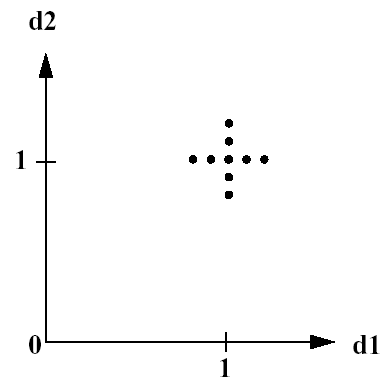

.. _ps:

Parameter Study Capabilities
============================

.. _`ps:overview`:

Overview
--------

Dakota parameter studies explore the effect of parametric changes within
simulation models by computing response data sets at a selection of
points in the parameter space, yielding one type of sensitivity
analysis. (For a comparison with DACE-based sensitivity analysis, see
Section `[dace:sa] <#dace:sa>`__.) The selection of points is
deterministic and structured, or user-specified, in each of the four
available parameter study methods:

-  **Vector**: Performs a parameter study along a line between any two
   points in an :math:`n`-dimensional parameter space, where the user
   specifies the number of steps used in the study.

-  **List**: The user supplies a list of points in an
   :math:`n`-dimensional space where Dakota will evaluate response data
   from the simulation code.

-  **Centered**: Given a point in an :math:`n`-dimensional parameter
   space, this method evaluates nearby points along the coordinate axes
   of the parameter space. The user selects the number of steps and the
   step size.

-  **Multidimensional**: Forms a regular lattice or hypergrid in an
   :math:`n`-dimensional parameter space, where the user specifies the
   number of intervals used for each parameter.

More detail on these parameter studies is found in
Sections `1.2 <#ps:vector>`__ through `1.5 <#ps:multidimensional>`__
below.

When used in parameter studies, the response data sets are not linked to
any specific interpretation, so they may consist of any allowable
specification from the responses keyword block, i.e., objective and
constraint functions, least squares terms and constraints, or generic
response functions. This allows the use of parameter studies in
alternation with optimization, least squares, and uncertainty
quantification studies with only minor modification to the input file.
In addition, the response data sets may include gradients and Hessians
of the response functions, which will be catalogued by the parameter
study. This allows for several different approaches to “sensitivity
analysis”: (1) the variation of function values over parameter ranges
provides a global assessment as to the sensitivity of the functions to
the parameters, (2) derivative information can be computed numerically,
provided analytically by the simulator, or both (mixed gradients) in
directly determining local sensitivity information at a point in
parameter space, and (3) the global and local assessments can be
combined to investigate the variation of derivative quantities through
the parameter space by computing sensitivity information at multiple
points.

In addition to sensitivity analysis applications, parameter studies can
be used for investigating nonsmoothness in simulation response
variations (so that models can be refined or finite difference step
sizes can be selected for computing numerical gradients), interrogating
problem areas in the parameter space, or performing simulation code
verification (verifying simulation robustness) through parameter ranges
of interest. A parameter study can also be used in coordination with
minimization methods as either a pre-processor (to identify a good
starting point) or a post-processor (for post-optimality analysis).

Parameter study methods will iterate any combination of design,
uncertain, and state variables defined over continuous and discrete
domains into any set of responses (any function, gradient, and Hessian
definition). Parameter studies draw no distinction among the different
types of continuous variables (design, uncertain, or state) or among the
different types of response functions. They simply pass all of the
variables defined in the variables specification into the interface,
from which they expect to retrieve all of the responses defined in the
responses specification. As described in
Section `[responses:active] <#responses:active>`__, when gradient and/or
Hessian information is being catalogued in the parameter study, it is
assumed that derivative components will be computed with respect to all
of the *continuous* variables (continuous design, continuous uncertain,
and continuous state variables) specified, since derivatives with
respect to discrete variables are assumed to be undefined. The
specification of initial values or bounds is important for parameter
studies.

.. _`ps:overview:initial`:

Initial Values
~~~~~~~~~~~~~~

The vector and centered parameter studies use the initial values of the
variables from the ``variables`` keyword block as the starting point and
the central point of the parameter studies, respectively. These
parameter study starting values for design, uncertain, and state
variables are referenced in the following sections using the identifier
“Initial Values.”

In the case of design variables, the is used, and in the case of state
variables, the is used. In the case of uncertain variables, initial
values not specified by an are inferred from the distribution
specification: all uncertain initial values are set to their means,
correcting as needed. For example, mean values for bounded normal and
bounded lognormal are repaired as needed to satisfy the specified
distribution bounds, mean values for discrete integer range
distributions are rounded down to the nearest integer, and mean values
for discrete set distributions are rounded to the nearest set value. See
the , , and keywords in the Dakota Reference
Manual :cite:p:`RefMan` for additional details on default
values.

.. _`ps:overview:bounds`:

Bounds
~~~~~~

The multidimensional parameter study uses the bounds of the variables
from the ``variables`` keyword block to define the range of parameter
values to study. In the case of design and state variables, the
``lower_bounds`` and ``upper_bounds`` specifications are used (see the
Dakota Reference Manual :cite:p:`RefMan` for default values
when ``lower_bounds`` or ``upper_bounds`` are unspecified). In the case
of uncertain variables, these values are either drawn or inferred from
the distribution specification. Distribution lower and upper bounds can
be drawn directly from required bounds specifications for uniform,
loguniform, triangular, and beta distributions, as well as from optional
bounds specifications for normal and lognormal. Distribution bounds are
implicitly defined for histogram bin, histogram point, and interval
variables (from the extreme values within the bin/point/interval
specifications) as well as for binomial (0 to ``num_trials``) and
hypergeometric (0 to min(``num_drawn``,\ ``num_selected``)) variables.
Finally, distribution bounds are inferred for normal and lognormal if
optional bounds are unspecified, as well as for exponential, gamma,
gumbel, frechet, weibull, poisson, negative binomial, and geometric
(which have no bounds specifications); these bounds are [0,
:math:`\mu + 3 \sigma`] for exponential, gamma, frechet, weibull,
poisson, negative binomial, geometric, and unspecified lognormal, and
[:math:`\mu - 3\sigma`, :math:`\mu + 3\sigma`] for gumbel and
unspecified normal.

.. _`ps:vector`:

Vector Parameter Study
----------------------

The vector parameter study computes response data sets at selected
intervals along an :math:`n`-dimensional vector in parameter space. This
capability encompasses both single-coordinate parameter studies (to
study the effect of a single variable on a response set) as well as
multiple coordinate vector studies (to investigate the response
variations along some arbitrary vector; e.g., to investigate a search
direction failure).

Dakota’s vector parameter study includes two possible specification
formulations which are used in conjunction with the Initial Values (see
Section `1.1.1 <#ps:overview:initial>`__) to define the vector and steps
of the parameter study:

::

       final_point (vector of reals) and num_steps (integer)
       step_vector (vector of reals) and num_steps (integer)

In both of these cases, the Initial Values are used as the parameter
study starting point and the specification selection above defines the
orientation of the vector and the increments to be evaluated along the
vector. In the former case, the vector from initial to final point is
partitioned by ``num_steps``, and in the latter case, the
``step_vector`` is added ``num_steps`` times. In the case of discrete
range variables, both ``final_point`` and ``step_vector`` are specified
in the actual values; and in the case of discrete sets (integer or
real), ``final_point`` is specified in the actual values but
``step_vector`` must instead specify index offsets for the (ordered,
unique) set. In all cases, the number of evaluations is
``num_steps``\ +1. Two examples are included below:

Three continuous parameters with initial values of (1.0, 1.0, 1.0),
``num_steps`` = 4, and either ``final_point`` = (1.0, 2.0, 1.0) or
``step_vector`` = (0, .25, 0):

::

       Parameters for function evaluation 1:
                             1.0000000000e+00 c1   
                             1.0000000000e+00 c2   
                             1.0000000000e+00 c3   
       Parameters for function evaluation 2:
                             1.0000000000e+00 c1   
                             1.2500000000e+00 c2   
                             1.0000000000e+00 c3   
       Parameters for function evaluation 3:
                             1.0000000000e+00 c1   
                             1.5000000000e+00 c2   
                             1.0000000000e+00 c3   
       Parameters for function evaluation 4:
                             1.0000000000e+00 c1   
                             1.7500000000e+00 c2   
                             1.0000000000e+00 c3   
       Parameters for function evaluation 5:
                             1.0000000000e+00 c1   
                             2.0000000000e+00 c2   
                             1.0000000000e+00 c3   

Two continuous parameters with initial values of (1.0, 1.0), one
discrete range parameter with initial value of 5, one discrete real set
parameter with set values of (10., 12., 18., 30., 50.) and initial value
of 10., ``num_steps`` = 4, and either ``final_point`` = (2.0, 1.4, 13,
50.) or ``step_vector`` = (.25, .1, 2, 1):

::

       Parameters for function evaluation 1:
                             1.0000000000e+00 c1
                             1.0000000000e+00 c2
                                            5 di1
                             1.0000000000e+01 dr1
       Parameters for function evaluation 2:
                             1.2500000000e+00 c1   
                             1.1000000000e+00 c2   
                                            7 di1
                             1.2000000000e+01 dr1
       Parameters for function evaluation 3:
                             1.5000000000e+00 c1   
                             1.2000000000e+00 c2   
                                            9 di1
                             1.8000000000e+01 dr1
       Parameters for function evaluation 4:
                             1.7500000000e+00 c1   
                             1.3000000000e+00 c2   
                                           11 di1
                             3.0000000000e+01 dr1
       Parameters for function evaluation 5:
                             2.0000000000e+00 c1   
                             1.4000000000e+00 c2   
                                           13 di1
                             5.0000000000e+01 dr1

An example using a vector parameter study is described in
Section `1.7 <#ps:example:vector>`__.

.. _`ps:list`:

List Parameter Study
--------------------

The list parameter study computes response data sets at selected points
in parameter space. These points are explicitly specified by the user
and are not confined to lie on any line or surface. Thus, this parameter
study provides a general facility that supports the case where the
desired set of points to evaluate does not fit the prescribed structure
of the vector, centered, or multidimensional parameter studies.

The user input consists of a ``list_of_points`` specification which
lists the requested parameter sets in succession. The list parameter
study simply performs a simulation for the first parameter set (the
first :math:`n` entries in the list), followed by a simulation for the
next parameter set (the next :math:`n` entries), and so on, until the
list of points has been exhausted. Since the Initial Values will not be
used, they need not be specified. In the case of discrete range or
discrete set variables, list values are specified using the actual
values (not set indices).

An example specification that would result in the same parameter sets as
in the second example in Section `1.2 <#ps:vector>`__ would be:

::

       list_of_points = 1.0  1.0  5 10.
                        1.25 1.1  7 12.
                        1.5  1.2  9 18.
                        1.75 1.3 11 30.
                        2.0  1.4 13 50.

For convenience, the points for evaluation in a list parameter study may
instead be specified via the specification, e.g.,
``import_points_file ’listpstudy.dat’``, where the file may be in
freeform or annotated
format `[input:tabularformat] <#input:tabularformat>`__. The ordering of
the points is in input specification order, with both active and
inactive variables by default.

.. _`ps:centered`:

Centered Parameter Study
------------------------

The centered parameter study executes multiple coordinate-based
parameter studies, one per parameter, centered about the specified
Initial Values. This is useful for investigation of function contours in
the vicinity of a specific point. For example, after computing an
optimum design, this capability could be used for post-optimality
analysis in verifying that the computed solution is actually at a
minimum or constraint boundary and in investigating the shape of this
minimum or constraint boundary.

This method requires ``step_vector`` (list of reals) and
``steps_per_variable`` (list of integers) specifications, where the
former specifies the size of the increments per variable (employed
sequentially, not all at once as for the vector study in
Section `1.2 <#ps:vector>`__) and the latter specifies the number of
increments per variable (employed sequentially, not all at once) for
each of the positive and negative step directions. As for the vector
study described in Section `1.2 <#ps:vector>`__, ``step_vector``
includes actual variable steps for continuous and discrete range
variables, but employs index offsets for discrete set variables (integer
or real).

For example, with Initial Values of (1.0, 1.0), a ``step_vector`` of
(0.1, 0.1), and a ``steps_per_variable`` of (2, 2), the center point is
evaluated followed by four function evaluations (two negative deltas and
two positive deltas) per variable:

::

       Parameters for function evaluation 1:
                             1.0000000000e+00 d1
                             1.0000000000e+00 d2
       Parameters for function evaluation 2:
                             8.0000000000e-01 d1
                             1.0000000000e+00 d2
       Parameters for function evaluation 3:
                             9.0000000000e-01 d1
                             1.0000000000e+00 d2
       Parameters for function evaluation 4:
                             1.1000000000e+00 d1
                             1.0000000000e+00 d2
       Parameters for function evaluation 5:
                             1.2000000000e+00 d1
                             1.0000000000e+00 d2
       Parameters for function evaluation 6:
                             1.0000000000e+00 d1
                             8.0000000000e-01 d2
       Parameters for function evaluation 7:
                             1.0000000000e+00 d1
                             9.0000000000e-01 d2
       Parameters for function evaluation 8:
                             1.0000000000e+00 d1
                             1.1000000000e+00 d2
       Parameters for function evaluation 9:
                             1.0000000000e+00 d1
                             1.2000000000e+00 d2

This set of points in parameter space is depicted in
Figure `1.1 <#ps:figure01>`__.

   Example centered parameter study.

.. _`ps:multidimensional`:

Multidimensional Parameter Study
--------------------------------

The multidimensional parameter study computes response data sets for an
:math:`n`-dimensional hypergrid of points. Each variable is partitioned
into equally spaced intervals between its upper and lower bounds (see
Section `1.1.2 <#ps:overview:bounds>`__), and each combination of the
values defined by these partitions is evaluated. As for the vector and
centered studies described in Sections `1.2 <#ps:vector>`__
and `1.4 <#ps:centered>`__, partitioning occurs using the actual
variable values for continuous and discrete range variables, but occurs
within the space of valid indices for discrete set variables (integer or
real). The number of function evaluations performed in the study is:

.. math::

   \prod_{i=1}^{n}(\hbox{\texttt{partitions}}_{i}+1)
     \label{ps:equation01}

The partitions information is specified using the ``partitions``
specification, which provides an integer list of the number of
partitions for each variable (i.e., ``partitions``\ :math:`_{i}`). Since
the Initial Values will not be used, they need not be specified.

In a two variable example problem with ``d1`` :math:`\in` [0,2] and
``d2`` :math:`\in` [0,3] (as defined by the upper and lower bounds from
the variables specification) and with ``partitions`` = (2,3), the
interval [0,2] is divided into two equal-sized partitions and the
interval [0,3] is divided into three equal-sized partitions. This
two-dimensional grid, shown in Figure `1.2 <#ps:figure02>`__, would
result in the following twelve function evaluations:

.. figure:: img/multi_d_pstudy.png
   :alt: Example multidimensional parameter study
   :name: ps:figure02

   Example multidimensional parameter study

::

       Parameters for function evaluation 1:
                             0.0000000000e+00 d1   
                             0.0000000000e+00 d2   
       Parameters for function evaluation 2:
                             1.0000000000e+00 d1   
                             0.0000000000e+00 d2   
       Parameters for function evaluation 3:
                             2.0000000000e+00 d1   
                             0.0000000000e+00 d2   
       Parameters for function evaluation 4:
                             0.0000000000e+00 d1   
                             1.0000000000e+00 d2   
       Parameters for function evaluation 5:
                             1.0000000000e+00 d1   
                             1.0000000000e+00 d2   
       Parameters for function evaluation 6:
                             2.0000000000e+00 d1   
                             1.0000000000e+00 d2   
       Parameters for function evaluation 7:
                             0.0000000000e+00 d1   
                             2.0000000000e+00 d2   
       Parameters for function evaluation 8:
                             1.0000000000e+00 d1   
                             2.0000000000e+00 d2   
       Parameters for function evaluation 9:
                             2.0000000000e+00 d1   
                             2.0000000000e+00 d2   
       Parameters for function evaluation 10:
                             0.0000000000e+00 d1   
                             3.0000000000e+00 d2   
       Parameters for function evaluation 11:
                             1.0000000000e+00 d1   
                             3.0000000000e+00 d2   
       Parameters for function evaluation 12:
                             2.0000000000e+00 d1   
                             3.0000000000e+00 d2

The first example shown in this User’s Manual is a multi-dimensional
parameter study. See
Section `[tutorial:examples:param_study] <#tutorial:examples:param_study>`__.

.. _`ps:usage`:

Parameter Study Usage Guidelines
--------------------------------

Parameter studies, classical design of experiments (DOE),
design/analysis of computer experiments (DACE), and sampling methods
share the purpose of exploring the parameter space. Parameter Studies
are recommended for simple studies with defined, repetitive structure. A
local sensitivity analysis or an assessment of the smoothness of a
response function is best addressed with a vector or centered parameter
study. A multi-dimensional parameter study may be used to generate grid
points for plotting response surfaces. For guidance on DACE and sampling
methods, in contrast to parameter studies, see
Section `[dace:usage] <#dace:usage>`__ and especially
Table `[dace:usage:table] <#dace:usage:table>`__, which clarifies the
different purposes of the method types.

.. _`ps:example:vector`:

Example: Vector Parameter Study with Rosenbrock
-----------------------------------------------

This section demonstrates a vector parameter study on the Rosenbrock
test function described in
Section `[tutorial:examples:rosenbrock] <#tutorial:examples:rosenbrock>`__.
An example of multidimensional parameter study is shown in
Section `[tutorial:examples:param_study] <#tutorial:examples:param_study>`__.

A vector parameter study is a study between any two design points in an
*n*-dimensional parameter space. An input file for the vector parameter
study is shown in :numref:`additional:rosenbrock_vector`. The
primary differences between this input file and the input file for the
multidimensional parameter study are found in the *variables* and
*method* sections. In the variables section, the keywords for the bounds
are removed and replaced with the keyword ``initial_point`` that
specifies the starting point for the parameter study. In the method
section, the ``vector_parameter_study`` keyword is used. The
``final_point`` keyword indicates the stopping point for the parameter
study, and ``num_steps`` specifies the number of steps taken between the
initial and final points in the parameter study.

.. literalinclude:: ../samples/rosen_ps_vector.in
   :language: dakota
   :tab-width: 2
   :caption: Rosenbrock vector parameter study example: the Dakota
       input file -- see
       ``dakota/share/dakota/examples/users/rosen_ps_vector.in``
   :name: additional:rosenbrock_vector

Figure `[additional:rosenbrock_vector_graphics] <#additional:rosenbrock_vector_graphics>`__\ (a)
shows the legacy X Windows-based graphics output created by Dakota,
which can be useful for visualizing the results.
Figure `[additional:rosenbrock_vector_graphics] <#additional:rosenbrock_vector_graphics>`__\ (b)
shows the locations of the 11 sample points generated in this study. It
is evident from these figures that the parameter study starts within the
banana-shaped valley, marches up the side of the hill, and then returns
to the valley.

+----------+
| |image|  |
+----------+
| (a)      |
+----------+
|          |
+----------+
| |image1| |
+----------+
| (b)      |
+----------+

.. |image| image:: img/dak_graphics_vector.png
.. |image1| image:: img/rosen_vect_pts.png
   :height: 2.5in
