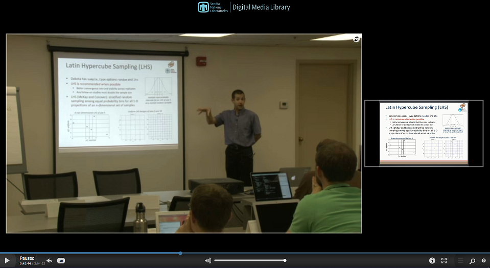

.. _uq:

Uncertainty Quantification
==========================

.. _`uq:overview`:

Overview
--------

At a high level, uncertainty quantification (UQ) or nondeterministic
analysis is the process of (1) characterizing input uncertainties, (2)
forward propagating these uncertainties through a computational model,
and (3) performing statistical or interval assessments on the resulting
responses. This process determines the effect of uncertainties and
assumptions on model outputs or results. In Dakota, uncertainty
quantification methods primarily focus on the forward propagation and
analysis parts of the process (2 and 3), where probabilistic or interval
information on parametric inputs are mapped through the computational
model to assess statistics or intervals on outputs. For an overview of
these approaches for engineering applications,
consult :cite:p:`Hal00`. Dakota also has emerging methods for
inference or inverse UQ, such as Bayesian calibration. These methods
help with (1) by inferring a statistical characterization of input
parameters that is consistent with available observational data.

UQ is related to sensitivity analysis in that the common goal is to gain
an understanding of how variations in the parameters affect the response
functions of the engineering design problem. However, for UQ, some or
all of the components of the parameter vector are considered to be
uncertain as specified by particular probability distributions (e.g.,
normal, exponential, extreme value) or other uncertainty specifications.
By assigning specific distributional structure to the inputs,
distributional structure for the outputs (i.e, response statistics) can
be inferred. This migrates from an analysis that is more *qualitative*
in nature, in the case of sensitivity analysis, to an analysis that is
more rigorously *quantitative*.

UQ methods can be distinguished by their ability to propagate aleatory
or epistemic input uncertainty characterizations, where aleatory
uncertainties are irreducible variabilities inherent in nature and
epistemic uncertainties are reducible uncertainties resulting from a
lack of knowledge.

..
   TODO: %Since sufficient data is generally available for

For aleatory uncertainties, probabilistic methods are
commonly used for computing response distribution statistics based on
input probability distribution specifications. Conversely, for epistemic
uncertainties, use of probability distributions is based on subjective
prior knowledge rather than objective data, and we may alternatively
explore nonprobabilistic methods based on interval specifications.

.. _`uq:overview:methods`:

Summary of Dakota UQ Methods
~~~~~~~~~~~~~~~~~~~~~~~~~~~~

Dakota contains capabilities for performing nondeterministic analysis
with both types of input uncertainty. These UQ methods have been
developed by Sandia Labs, in conjunction with collaborators in
academia :cite:p:`Gha99,Gha91,Eld05,Tang10a`.

The aleatory UQ methods in Dakota include various sampling-based
approaches (e.g., Monte Carlo and Latin Hypercube sampling), local and
global reliability methods, and stochastic expansion (polynomial chaos
expansions, stochastic collocation, and functional tensor train)
approaches. The epistemic UQ methods include local and global interval
analysis and Dempster-Shafer evidence theory. These are summarized below
and then described in more depth in subsequent sections of this chapter.
Dakota additionally supports mixed aleatory/epistemic UQ via
interval-valued probability, second-order probability, and
Dempster-Shafer theory of evidence. These involve advanced model
recursions and are described in
:ref:`adv_models:mixed_uq`.

..
   TODO:
   %In addition, future extensions to the DDACE package will make it 
   %applicable to general UQ problems, which will augment the Dakota/UQ 
   %capabilities.
   %Uncertainty quantification methods (also referred to as
   %nondeterministic analysis methods) in the Dakota/UQ system involve the
   %computation of probabilistic information about response functions
   %based on sets of simulations taken from the specified probability
   %distributions for uncertain parameters. That is, 
   
   %The impact on the response functions due to the probabilistic nature
   %of the parameters is often estimated using a sampling-based approach
   %such as Monte Carlo sampling or one of its variants (latin hypercube,
   %quasi-Monte Carlo, Markov-chain Monte Carlo, etc.). In these sampling
   %approaches, a random number generator is used to select different
   %values of the parameters with probability specified by their
   %probability distributions. This is the point that distinguishes UQ
   %sampling from DoE/DACE sampling, in that the former supports general
   %probabilistic descriptions of the parameter set and the latter
   %generally supports only a bounded parameter space description. A
   %particular set of parameter values is often called a \emph{sample
   %point}, or simply a \emph{sample}. With Monte Carlo and Latin
   %Hypercube sampling, the user may specify correlations among the input
   %sample points. After a user-selected number of sample points has been
   %generated, the response functions for each sample are evaluated. Then,
   %a statistical analysis is performed on the response function values to
   %yield information on their characteristics. While this approach is
   %straightforward, and readily amenable to parallel computing, it can be
   %computationally expensive depending on the accuracy requirements of
   %the statistical information (which links directly to the number of
   %sample points).
   
   %Finally, when the input uncertainties are poorly characterized, then
   %epistemic uncertainty methods, such as second-order probability or
   %Dempster-Shafer theory of evidence, can be used to compute intervals
   %of potential probability values. The second-order probability
   %approach performs an ensemble of aleatory UQ analyses, one for each
   %realization of the epistemic parameter set. The ensemble of CDF/CCDF
   %curves generates what is known as a ``horse-tail'' plot.
   %Dempster-Shafer, on the other hand, directly generates probability
   %bounds, known as the belief and plausibility functions.
   
   %This chapter has extensive details on various Dakota UQ methods, but
   %here is a high-level summary of available capabilities:
   
   % BMA TODO: Considerably shorten the following descriptions, moving
   % text to later sections if needed.

**LHS (Latin Hypercube Sampling)**: This package provides both Monte
Carlo (random) sampling and Latin Hypercube sampling methods, which can
be used with probabilistic variables in Dakota that have the following
distributions: normal, lognormal, uniform, loguniform, triangular,
exponential, beta, gamma, gumbel, frechet, weibull, poisson, binomial,
negative binomial, geometric, hypergeometric, and user-supplied
histograms. In addition, LHS accounts for correlations among the
variables :cite:p:`Ima84`, which can be used to accommodate a
user-supplied correlation matrix or to minimize correlation when a
correlation matrix is not supplied. In addition to a standard sampling
study, we support the capability to perform “incremental” LHS, where a
user can specify an initial LHS study of N samples, and then re-run an
additional incremental study which will double the number of samples (to
2N, with the first N being carried from the initial study). The full
incremental sample of size 2N is also a Latin Hypercube, with proper
stratification and correlation. Statistics for each increment are
reported separately at the end of the study.

..
   TODO (middle of above paragraph)
   %The LHS package currently serves
   %two purposes: (1) it can be used for uncertainty quantification by
   %sampling over uncertain variables characterized by probability
   %distributions, or (2) it can be used in a DACE mode in which any
   %design and state variables are treated as having uniform distributions
   %(see the \texttt{active all} view override in the Dakota Reference
   %Manual~\cite{RefMan}). The LHS package historically came in two
   %versions: ``old'' (circa 1980) and ``new'' (circa 1998), but presently
   %only the latter is supported in Dakota, requiring a Fortran 90
   %compiler. This ``new'' LHS is available under a separate GNU Lesser
   %General Public License and is distributed with Dakota. 

**Reliability Methods**: This suite of methods includes both local and
global reliability methods. Local methods include first- and
second-order versions of the Mean Value method (MVFOSM and MVSOSM) and a
variety of most probable point (MPP) search methods, including the
Advanced Mean Value method (AMV and AMV\ :math:`^2`), the iterated
Advanced Mean Value method (AMV+ and AMV\ :math:`^2`\ +), the Two-point
Adaptive Nonlinearity Approximation method (TANA-3), and the traditional
First Order and Second Order Reliability Methods (FORM and
SORM) :cite:p:`Hal00`. The MPP search methods may be used in
forward (Reliability Index Approach (RIA)) or inverse (Performance
Measure Approach (PMA)) modes, as dictated by the type of level
mappings. Each of the MPP search techniques solve local optimization
problems in order to locate the MPP, which is then used as the point
about which approximate probabilities are integrated (using first- or
second-order integrations in combination with refinements based on
importance sampling). Global reliability methods are designed to handle
nonsmooth and multimodal failure surfaces, by creating global
approximations based on Gaussian process models. They accurately resolve
a particular contour of a response function and then estimate
probabilities using multimodal adaptive importance sampling.

..
   TODO (above before global reliability):
   % Reliability mappings may involve computing reliability and
   % probability levels for prescribed response levels (forward
   % reliability analysis, commonly known as the reliability index
   % approach or RIA) or computing response levels for prescribed
   % reliability and probability levels (inverse reliability analysis,
   % commonly known as the performance measure approach or PMA).
   % Approximation-based MPP search methods (AMV, AMV$^2$, AMV+,
   % AMV$^2$+, and TANA) may be applied in either x-space or u-space, and
   % mappings may involve either cumulative or complementary cumulative
   % distribution functions.

**Stochastic Expansion Methods**: Theoretical development of these
techniques mirrors that of deterministic finite element analysis
utilizing the notions of projection, orthogonality, and weak
convergence :cite:p:`Gha99`, :cite:p:`Gha91`.

..
   TODO:
   %The objective of these
   %techniques is to characterize the response of systems whose governing
   %equations involve stochastic coefficients. 

Rather than focusing on estimating specific statistics (e.g., failure
probability), they form an approximation to the functional relationship
between response functions and their random inputs, which provides a
more complete uncertainty representation for use in more advanced
contexts, such as coupled multi-code simulations. Expansion methods
include polynomial chaos expansions (PCE), which expand in a basis of
multivariate orthogonal polynomials (e.g., Hermite, Legendre) that are
tailored to representing particular input probability distributions
(e.g., normal, uniform); stochastic collocation (SC), which expand in a
basis of multivariate interpolation polynomials (e.g., Lagrange); and
functional tensor train (FTT), which leverages concepts from data
compression to expand using low rank products of polynomial cores. For
PCE, expansion coefficients may be evaluated using a spectral projection
approach (based on sampling, tensor-product quadrature, Smolyak sparse
grid, or cubature methods for numerical integration) or a regression
approach (least squares or compressive sensing). For SC, interpolants
are formed over tensor-product or sparse grids and may be local or
global, value-based or gradient-enhanced, and nodal or hierarchical. In
global value-based cases (Lagrange polynomials), the barycentric
formulation is used :cite:p:`BerTref04,Klimke05,Higham04` to
improve numerical efficiency and stability. For FTT, regression via
regularized nonlinear least squares is employed for recovering low rank
coefficients, and cross-validation schemes are available to determine
the best rank and polynomial basis order settings. Each of these methods
provide analytic response moments and variance-based metrics; however,
PDFs and CDF/CCDF mappings are computed numerically by sampling on the
expansion.

**Importance Sampling**: Importance sampling is a method that allows one
to estimate statistical quantities such as failure probabilities in a
way that is more efficient than Monte Carlo sampling. The core idea in
importance sampling is that one generates samples that are
preferentially placed in important regions of the space (e.g. in or near
the failure region or user-defined region of interest), then
appropriately weights the samples to obtain an unbiased estimate of the
failure probability.

**Adaptive Sampling**: The goal in performing adaptive sampling is to
construct a surrogate model that can be used as an accurate predictor of
an expensive simulation. The aim is to build a surrogate that minimizes
the error over the entire domain of interest using as little data as
possible from the expensive simulation. The adaptive sampling methods
start with an initial LHS sample, and then adaptively choose samples
that optimize a particular criteria. For example, if a set of additional
possible sample points are generated, one criteria is to pick the next
sample point as the point which maximizes the minimum distance to the
existing points (maximin). Another criteria is to pick the sample point
where the surrogate indicates the most uncertainty in its prediction.

Recently, Dakota added a new method to assess failure probabilities
based on ideas from computational geometry. Part of the idea
underpinning this method is the idea of throwing “darts” which are
higher dimensional objects than sample points (e.g. lines, planes, etc.)
The POF (Probability-of-Failure) darts method uses these objects to
estimate failure probabilities.

**Interval Analysis**: Interval analysis is often used to model
epistemic uncertainty. In interval analysis, one assumes that nothing is
known about an epistemic uncertain variable except that its value lies
somewhere within an interval. In this situation, it is NOT assumed that
the value has a uniform probability of occurring within the interval.
Instead, the interpretation is that any value within the interval is a
possible value or a potential realization of that variable. In interval
analysis, the uncertainty quantification problem is one of determining
the resulting bounds on the output (defining the output interval) given
interval bounds on the inputs. Again, any output response that falls
within the output interval is a possible output with no frequency
information assigned to it.

We have the capability to perform interval analysis using either global
or local methods. In the global approach, one uses either a global
optimization method (based on a Gaussian process surrogate model) or a
sampling method to assess the bounds. The local method uses gradient
information in a derivative-based optimization approach, using either
SQP (sequential quadratic programming) or a NIP (nonlinear interior
point) method to obtain bounds.

**Dempster-Shafer Theory of Evidence**: The objective of evidence theory
is to model the effects of epistemic uncertainties. Epistemic
uncertainty refers to the situation where one does not know enough to
specify a probability distribution on a variable. Sometimes epistemic
uncertainty is referred to as subjective, reducible, or lack of
knowledge uncertainty. In contrast, aleatory uncertainty refers to the
situation where one does have enough information to specify a
probability distribution. In Dempster-Shafer theory of evidence, the
uncertain input variables are modeled as sets of intervals. The user
assigns a basic probability assignment (BPA) to each interval,
indicating how likely it is that the uncertain input falls within the
interval. The intervals may be overlapping, contiguous, or have gaps.
The intervals and their associated BPAs are then propagated through the
simulation to obtain cumulative distribution functions on belief and
plausibility. Belief is the lower bound on a probability estimate that
is consistent with the evidence, and plausibility is the upper bound on
a probability estimate that is consistent with the evidence. In addition
to the full evidence theory structure, we have a simplified capability
for users wanting to perform pure interval analysis (e.g. what is the
interval on the output given intervals on the input) using either global
or local optimization methods. Interval analysis is often used to model
epistemic variables in nested analyses, where probability theory is used
to model aleatory variables.

**Bayesian Calibration**: In Bayesian calibration, uncertain input
parameters are initially characterized by a “prior” distribution. A
Bayesian calibration approach uses experimental data together with a
likelihood function, which describes how well a realization of the
parameters is supported by the data, to update this prior knowledge. The
process yields a posterior distribution of the parameters most
consistent with the data, such that running the model at samples from
the posterior yields results consistent with the observational data.

.. _`uq:overview:varsresp`:

Variables and Responses for UQ
~~~~~~~~~~~~~~~~~~~~~~~~~~~~~~

UQ methods that perform a forward uncertainty propagation map
probability or interval information for input parameters into
probability or interval information for output response functions. The
:math:`m` functions in the Dakota response data set are interpreted as
:math:`m` general response functions by the Dakota methods (with no
specific interpretation of the functions as for optimization and least
squares).

Within the variables specification, uncertain variable descriptions are
employed to define the random variable distributions (refer to
:ref:`variables:uncertain`). For Bayesian
inference methods, these uncertain variable properties characterize the
prior distribution to be updated and constrained by the observational
data. As enumerated in
:ref:`variables:uncertain`, uncertain
variables types are categorized as either aleatory or epistemic and as
either continuous or discrete, where discrete types include integer
ranges, integer sets, string sets, and real sets. The continuous
aleatory distribution types include: normal (Gaussian), lognormal,
uniform, loguniform, triangular, exponential, beta, gamma, gumbel,
frechet, weibull, and histogram bin. The discrete aleatory distribution
types include: poisson, binomial, negative binomial, geometric,
hypergeometric, and discrete histograms for integers, strings, and
reals. The epistemic distribution types include continuous intervals,
discrete integer ranges, and discrete sets for integers, strings, and
reals. While many of the epistemic types appear similar to aleatory
counterparts, a key difference is that the latter requires probabilities
for each value within a range or set, whereas the former will use, at
most, a subjective belief specification.

When gradient and/or Hessian information is used in an uncertainty
assessment, derivative components are normally computed with respect to
the active continuous variables, which could be aleatory uncertain,
epistemic uncertain, aleatory and epistemic uncertain, or all continuous
variables, depending on the active view (see
:ref:`variables:mixed`).

.. _`uq:sampling`:

Sampling Methods
----------------

Sampling techniques are selected using the :dakkw:`method-sampling` method
selection. This method generates sets of samples according to the
probability distributions of the uncertain variables and maps them into
corresponding sets of response functions, where the number of samples is
specified by the :dakkw:`method-sampling-samples` integer specification. Means, standard
deviations, coefficients of variation (COVs), and 95% confidence
intervals are computed for the response functions. Probabilities and
reliabilities may be computed for :dakkw:`method-sampling-response_levels` specifications,
and response levels may be computed for either :dakkw:`method-sampling-probability_levels` or
:dakkw:`method-sampling-reliability_levels` specifications.

Currently, traditional Monte Carlo (MC) and Latin hypercube sampling
(LHS) are supported by Dakota and are chosen by specifying
:dakkw:`method-sampling-sample_type` as :dakkw:`method-sampling-sample_type-random`
or :dakkw:`method-sampling-sample_type-lhs`. In Monte Carlo sampling, the
samples are selected randomly according to the user-specified
probability distributions. Latin hypercube sampling is a stratified
sampling technique for which the range of each uncertain variable is
divided into :math:`N_{s}` segments of equal probability, where
:math:`N_{s}` is the number of samples requested. The relative lengths
of the segments are determined by the nature of the specified
probability distribution (e.g., uniform has segments of equal width,
normal has small segments near the mean and larger segments in the
tails). For each of the uncertain variables, a sample is selected
randomly from each of these equal probability segments. These
:math:`N_{s}` values for each of the individual parameters are then
combined in a shuffling operation to create a set of :math:`N_{s}`
parameter vectors with a specified correlation structure. A feature of
the resulting sample set is that *every row and column in the hypercube
of partitions has exactly one sample*. Since the total number of samples
is exactly equal to the number of partitions used for each uncertain
variable, an arbitrary number of desired samples is easily accommodated
(as compared to less flexible approaches in which the total number of
samples is a product or exponential function of the number of intervals
for each variable, i.e., many classical design of experiments methods).

Advantages of sampling-based methods include their relatively simple
implementation and their independence from the scientific disciplines
involved in the analysis. The main drawback of these techniques is the
large number of function evaluations needed to generate converged
statistics, which can render such an analysis computationally very
expensive, if not intractable, for real-world engineering applications.
LHS techniques, in general, require fewer samples than traditional Monte
Carlo for the same accuracy in statistics, but they still can be
prohibitively expensive. For further information on the method and its
relationship to other sampling techniques, one is referred to the works
by McKay, et al. :cite:p:`Mck79`, Iman and
Shortencarier :cite:p:`Ima84`, and Helton and
Davis :cite:p:`Hel00`. Note that under certain separability
conditions associated with the function to be sampled, Latin hypercube
sampling provides a more accurate estimate of the mean value than does
random sampling. That is, given an equal number of samples, the LHS
estimate of the mean will have less variance than the mean value
obtained through random sampling.

:numref:`dace:figure01` demonstrates Latin hypercube sampling on
a two-variable parameter space. Here, the range of both parameters,
:math:`x_1` and :math:`x_2`, is :math:`[0,1]`. Also, for this example
both :math:`x_1` and :math:`x_2` have uniform statistical distributions.
For Latin hypercube sampling, the range of each parameter is divided
into :math:`p` “bins” of equal probability. For parameters with uniform
distributions, this corresponds to partitions of equal size. For
:math:`n` design parameters, this partitioning yields a total of
:math:`p^{n}` bins in the parameter space. Next, :math:`p` samples are
randomly selected in the parameter space, with the following
restrictions: (a) each sample is randomly placed inside a bin, and (b)
for all one-dimensional projections of the :math:`p` samples and bins,
there will be one and only one sample in each bin. In a two-dimensional
example such as that shown in :numref:`dace:figure01`, these LHS
rules guarantee that only one bin can be selected in each row and
column. For :math:`p=4`, there are four partitions in both :math:`x_1`
and :math:`x_2`. This gives a total of 16 bins, of which four will be
chosen according to the criteria described above. Note that there is
more than one possible arrangement of bins that meet the LHS criteria.
The dots in :numref:`dace:figure01` represent the four sample
sites in this example, where each sample is randomly located in its bin.
There is no restriction on the number of bins in the range of each
parameter, however, all parameters must have the same number of bins.

.. figure:: img/lhs_graphic.png
   :alt: An example of Latin hypercube sampling with four bins in design
         parameters :math:`x_1` and :math:`x_2`. The dots are the sample
         sites.
   :name: dace:figure01
   :align: center

   An example of Latin hypercube sampling with four bins in design
   parameters :math:`x_1` and :math:`x_2`. The dots are the sample
   sites.

The actual algorithm for generating Latin hypercube samples is more
complex than indicated by the description given above. For example, the
Latin hypercube sampling method implemented in the LHS
code :cite:p:`Swi04` takes into account a user-specified
correlation structure when selecting the sample sites. For more details
on the implementation of the LHS algorithm, see
Reference :cite:p:`Swi04`.

In addition to Monte Carlo vs. LHS design choices, Dakota sampling
methods support options for incrementally-refined designs, generation of
approximately determinant-optimal (D-optimal) designs, and selection of
sample sizes to satisfy Wilks’ criteria.

.. _`uq:uncertainty1`:

Uncertainty Quantification Example using Sampling Methods
~~~~~~~~~~~~~~~~~~~~~~~~~~~~~~~~~~~~~~~~~~~~~~~~~~~~~~~~~

The input file in :numref:`uq:figure01` demonstrates
the use of Latin hypercube Monte Carlo sampling for assessing
probability of failure as measured by specified response levels. The
two-variable Textbook example problem (see
:ref:`additional:textbook`) will be
used to demonstrate the application of sampling methods for uncertainty
quantification where it is assumed that :math:`x_1` and :math:`x_2` are
uniform uncertain variables on the interval :math:`[0,1]`.

The number of samples to perform is controlled with the ``samples``
specification, the type of sampling algorithm to use is controlled with
the ``sample_type`` specification, the levels used for computing
statistics on the response functions is specified with the
``response_levels`` input, and the ``seed`` specification controls the
sequence of the pseudo-random numbers generated by the sampling
algorithms. The input samples generated are shown in
:numref:`uq:figure02` for the case where ``samples`` =
5 and ``samples`` = 10 for both ``random`` (:math:`\triangle`) and ``lhs``
(:math:`+`) sample types.

.. literalinclude:: ../samples/textbook_uq_sampling.in
   :language: dakota
   :tab-width: 2
   :caption: Dakota input file for UQ example using LHS --
       see ``dakota/share/dakota/examples/users/textbook_uq_sampling.in``
   :name: uq:figure01

.. table:: Distribution of input sample points for random
           (:math:`\triangle`) and lhs (:math:`+`) sampling for (a)
           samples=5 and (b) samples=10.
   :name: uq:figure02

   +------------------------------------+-------------------------------------+
   | .. image:: img/input_samples5.png  | .. image:: img/input_samples10.png  |
   |                                    |                                     |
   | (a)                                | (b)                                 |
   +------------------------------------+-------------------------------------+

Latin hypercube sampling ensures full coverage of the range of the input
variables, which is often a problem with Monte Carlo sampling when the
number of samples is small. In the case of ``samples = 5``, poor
stratification is evident in :math:`x_1` as four out of the five Monte
Carlo samples are clustered in the range :math:`0.35 < x_1 < 0.55`, and
the regions :math:`x_1 < 0.3` and :math:`0.6 < x_1 < 0.9` are completely
missed. For the case where ``samples = 10``, some clustering in the
Monte Carlo samples is again evident with ``4`` samples in the range
:math:`0.5 < x_1 < 0.55`. In both cases, the stratification with LHS is
superior.

The response function statistics returned by Dakota are shown in
:numref:`uq:figure03`. The first block of output
specifies the response sample means, sample standard deviations, and
skewness and kurtosis. The second block of output displays confidence
intervals on the means and standard deviations of the responses. The
third block defines Probability Density Function (PDF) histograms of the
samples: the histogram bins are defined by the lower and upper values of
the bin and the corresponding density for that bin. Note that these bin
endpoints correspond to the ``response_levels`` and/or
``probability_levels`` defined by the user in the Dakota input file. If
there are just a few levels, these histograms may be coarse. Dakota does
not do anything to optimize the bin size or spacing. Finally, the last
section of the output defines the Cumulative Distribution Function (CDF)
pairs. In this case, ``distribution cumulative`` was specified for the
response functions, and Dakota presents the probability levels
corresponding to the specified response levels (``response_levels``)
that were set. The default ``compute probabilities`` was used.
Alternatively, Dakota could have provided CCDF pairings, reliability
levels corresponding to prescribed response levels, or response levels
corresponding to prescribed probability or reliability levels.

.. code-block::
   :caption: Dakota response function statistics from UQ sampling example.
   :name: uq:figure03

   Statistics based on 10 samples:

   Sample moment statistics for each response function:
                               Mean           Std Dev          Skewness          Kurtosis
    response_fn_1  3.8383990322e-01  4.0281539886e-01  1.2404952971e+00  6.5529797327e-01
    response_fn_2  7.4798705803e-02  3.4686110941e-01  4.5716015887e-01 -5.8418924529e-01
    response_fn_3  7.0946176558e-02  3.4153246532e-01  5.2851897926e-01 -8.2527332042e-01

   95% confidence intervals for each response function:
                       LowerCI_Mean      UpperCI_Mean    LowerCI_StdDev    UpperCI_StdDev
    response_fn_1  9.5683125821e-02  6.7199668063e-01  2.7707061315e-01  7.3538389383e-01
    response_fn_2 -1.7333078422e-01  3.2292819583e-01  2.3858328290e-01  6.3323317325e-01
    response_fn_3 -1.7337143113e-01  3.1526378424e-01  2.3491805390e-01  6.2350514636e-01

   Probability Density Function (PDF) histograms for each response function:
   PDF for response_fn_1:
             Bin Lower          Bin Upper      Density Value
             ---------          ---------      -------------
      2.3066424677e-02   1.0000000000e-01   3.8994678038e+00
      1.0000000000e-01   2.0000000000e-01   2.0000000000e+00
      2.0000000000e-01   6.0000000000e-01   5.0000000000e-01
      6.0000000000e-01   1.2250968624e+00   4.7992562123e-01
   PDF for response_fn_2:
             Bin Lower          Bin Upper      Density Value
             ---------          ---------      -------------
     -3.5261164651e-01   1.0000000000e-01   1.1046998102e+00
      1.0000000000e-01   2.0000000000e-01   2.0000000000e+00
      2.0000000000e-01   6.0000000000e-01   5.0000000000e-01
      6.0000000000e-01   6.9844576220e-01   1.0157877573e+00
   PDF for response_fn_3:
             Bin Lower          Bin Upper      Density Value
             ---------          ---------      -------------
     -3.8118095128e-01   1.0000000000e-01   1.2469321539e+00
      1.0000000000e-01   2.0000000000e-01   0.0000000000e+00
      2.0000000000e-01   6.0000000000e-01   7.5000000000e-01
      6.0000000000e-01   6.4526450977e-01   2.2092363423e+00

   Level mappings for each response function:
   Cumulative Distribution Function (CDF) for response_fn_1:
        Response Level  Probability Level  Reliability Index  General Rel Index
        --------------  -----------------  -----------------  -----------------
      1.0000000000e-01   3.0000000000e-01
      2.0000000000e-01   5.0000000000e-01
      6.0000000000e-01   7.0000000000e-01
   Cumulative Distribution Function (CDF) for response_fn_2:
        Response Level  Probability Level  Reliability Index  General Rel Index
        --------------  -----------------  -----------------  -----------------
      1.0000000000e-01   5.0000000000e-01
      2.0000000000e-01   7.0000000000e-01
      6.0000000000e-01   9.0000000000e-01
   Cumulative Distribution Function (CDF) for response_fn_3:
        Response Level  Probability Level  Reliability Index  General Rel Index
        --------------  -----------------  -----------------  -----------------
      1.0000000000e-01   6.0000000000e-01
      2.0000000000e-01   6.0000000000e-01
      6.0000000000e-01   9.0000000000e-01

In addition to obtaining statistical summary information of the type
shown in :numref:`uq:figure03`, the results of LHS
sampling also include correlations.

.. _`uq:correlationtypes`:

Four types of correlations are returned in the output: simple and partial “raw” correlations, and
simple and partial “rank” correlations. The raw correlations refer to
correlations performed on the actual input and output data. Rank
correlations refer to correlations performed on the ranks of the data.
Ranks are obtained by replacing the actual data by the ranked values,
which are obtained by ordering the data in ascending order. For example,
the smallest value in a set of input samples would be given a rank 1,
the next smallest value a rank 2, etc. Rank correlations are useful when
some of the inputs and outputs differ greatly in magnitude: then it is
easier to compare if the smallest ranked input sample is correlated with
the smallest ranked output, for example.

Correlations are always calculated between two sets of sample data. One
can calculate correlation coefficients between two input variables,
between an input and an output variable (probably the most useful), or
between two output variables. The simple correlation coefficients
presented in the output tables are Pearson’s correlation coefficient,
which is defined for two variables :math:`x` and :math:`y` as:
:math:`\mathtt{Corr}(x,y) = \frac{\sum_{i}(x_{i}-\bar{x})(y_{i}-\bar{y})}
{\sqrt{\sum_{i}(x_{i}-\bar{x})^2\sum_{i}(y_{i}-\bar{y})^2}}`. Partial
correlation coefficients are similar to simple correlations, but a
partial correlation coefficient between two variables measures their
correlation while adjusting for the effects of the other variables. For
example, say one has a problem with two inputs and one output; and the
two inputs are highly correlated. Then the correlation of the second
input and the output may be very low after accounting for the effect of
the first input. The rank correlations in Dakota are obtained using
Spearman’s rank correlation. Spearman’s rank is the same as the Pearson
correlation coefficient except that it is calculated on the rank data.

:numref:`uq:figure04` shows an example of the
correlation output provided by Dakota for the input file in
:numref:`uq:figure01`. Note that these correlations
are presently only available when one specifies ``lhs`` as the sampling
method under ``sampling``. Also note that the simple and partial
correlations should be similar in most cases (in terms of values of
correlation coefficients). This is because we use a default “restricted
pairing” method in the LHS routine which forces near-zero correlation
amongst uncorrelated inputs.

.. code-block::
   :caption: Correlation results using LHS Sampling.
   :name: uq:figure04

   Simple Correlation Matrix between input and output:
                          x1           x2 response_fn_1 response_fn_2 response_fn_3
             x1  1.00000e+00
             x2 -7.22482e-02  1.00000e+00
   response_fn_1 -7.04965e-01 -6.27351e-01  1.00000e+00
   response_fn_2  8.61628e-01 -5.31298e-01 -2.60486e-01  1.00000e+00
   response_fn_3 -5.83075e-01  8.33989e-01 -1.23374e-01 -8.92771e-01  1.00000e+00

   Partial Correlation Matrix between input and output:
                response_fn_1 response_fn_2 response_fn_3
             x1 -9.65994e-01  9.74285e-01 -9.49997e-01
             x2 -9.58854e-01 -9.26578e-01  9.77252e-01

   Simple Rank Correlation Matrix between input and output:
                          x1           x2 response_fn_1 response_fn_2 response_fn_3
             x1  1.00000e+00
             x2 -6.66667e-02  1.00000e+00
   response_fn_1 -6.60606e-01 -5.27273e-01  1.00000e+00
   response_fn_2  8.18182e-01 -6.00000e-01 -2.36364e-01  1.00000e+00
   response_fn_3 -6.24242e-01  7.93939e-01 -5.45455e-02 -9.27273e-01  1.00000e+00

   Partial Rank Correlation Matrix between input and output:
                response_fn_1 response_fn_2 response_fn_3
             x1 -8.20657e-01  9.74896e-01 -9.41760e-01
             x2 -7.62704e-01 -9.50799e-01  9.65145e-01

Finally, note that the LHS package can be used for design of experiments
over design and state variables by including an active view override in
the variables specification section of the Dakota input file (see
:ref:`variables:mixedview`). Then, instead
of iterating on only the uncertain variables, the LHS package will
sample over all of the active variables. In the ``active all`` view,
continuous design and continuous state variables are treated as having
uniform probability distributions within their upper and lower bounds,
discrete design and state variables are sampled uniformly from within
their sets or ranges, and any uncertain variables are sampled within
their specified probability distributions.

.. _`uq:incremental`:

Incremental Sampling
~~~~~~~~~~~~~~~~~~~~

In many situations, one may run an initial sample set and then need to
perform further sampling to get better estimates of the mean, variance,
and percentiles, and to obtain more comprehensive sample coverage. We
call this capability incremental sampling. Typically, a Dakota restart
file (``dakota.rst``) would be available from the original sample,
so only the newly
generated samples would need to be evaluated. Incremental sampling
supports continuous uncertain variables and discrete uncertain variables
such as discrete distributions (e.g. binomial, Poisson, etc.) as well as
histogram variables and uncertain set types.

There are two cases, incremental random and incremental Latin hypercube
sampling, with incremental LHS being the most common. One major
advantage of LHS incremental sampling is that it maintains the
stratification and correlation structure of the original LHS sample.
That is, if one generated two independent LHS samples and simply merged
them, the calculation of the accuracy of statistical measures such as
the mean and the variance would be slightly incorrect. However, in the
incremental case, the full sample (double the original size) is a Latin
Hypercube sample itself and statistical measures and their accuracy can
be properly calculated. The incremental sampling capability is most
useful when one is starting off with very small samples. Once the sample
size is more than a few hundred, the benefit of incremental sampling
diminishes.

#. Incremental random sampling: With incremental random sampling, the
   original sample set with :math:`N1` samples must be generated using
   ``sample_type = random`` and ``samples = N1``. Then, the user can
   duplicate the Dakota input file and add ``refinement_samples = N2``
   with the number of new samples :math:`N2` to be added. Random
   incremental sampling does not require a doubling of samples each
   time. Thus, the user can specify any number of ``refinement_samples``
   (from an additional one sample to a large integer).

   For example, if the first sample has 50 samples, and 10 more samples
   are desired, the second Dakota run should specify ``samples = 50``,
   ``refinement_samples = 10``. In this situation, only 10 new samples
   will be generated, and the final statistics will be reported at the
   end of the study both for the initial 50 samples and for the full
   sample of 60. The command line syntax for running the second sample
   is ``dakota -i input60.in -r dakota.50.rst`` where ``input60.in`` is
   the input file with the refinement samples specification and
   ``dakota.50.rst`` is the
   restart file containing the initial 50 samples. Note that if the
   restart file has a different name, that is fine; the correct restart
   file name should be used.

   This process can be repeated if desired,arbitrarily extending the
   total sample size each time, e.g, ``samples = 50``,
   ``refinement_samples = 10 3 73 102``.

#. Incremental Latin hypercube sampling: With incremental LHS sampling,
   the original sample set with :math:`N1` samples must be generated
   using ``sample_type = lhs`` and ``samples = N1``. Then, the user can
   duplicate the Dakota input file and add ``refinement_samples = N1``.
   The sample size must double each time, so the first set of refinement
   samples must be the same size as the initial set. That is, if one
   starts with a very small sample size of 10, then one can use the
   incremental sampling capability to generate sample sizes of 20, 40,
   80, etc.

   For example, if the first sample has 50 samples, in the second Dakota
   run, the number of refinement samples should be set to 50 for a total
   of 100. In this situation, only 50 new samples will be generated, and
   at the end of the study final statistics will be reported both for
   the initial 50 samples and for the full sample of 100. The command
   line syntax for running the second sample is
   ``dakota -i input100.in -r dakota.50.rst``, where ``input100.in``
   is the input file with the incremental sampling specification and
   ``dakota.50.rst`` is the restart file
   containing the initial 50 samples. Note that if the restart file has
   a different name, that is fine; the correct restart file name should
   be used.

   This process can be repeated if desired, doubling the total sample
   size each time, e.g, ``samples = 50``,
   ``refinement_samples = 50 100 200 400``.

Principal Component Analysis
~~~~~~~~~~~~~~~~~~~~~~~~~~~~

As of Dakota 6.3, we added a capability to perform Principal Component
Analysis on field response data when using LHS sampling. Principal
components analysis (PCA) is a data reduction method and allows one to
express an ensemble of field data with a set of principal components
responsible for the spread of that data.

Dakota can calculate the principal components of the response matrix of
N samples \* L responses (the field response of length L) using the
keyword ``principal_components``. The Dakota implementation is under
active development: the PCA capability may ultimately be specified
elsewhere or used in different ways. For now, it is performed as a
post-processing analysis based on a set of Latin Hypercube samples.

If the user specifies LHS sampling with field data responses and also
specifies ``principal_components``, Dakota will calculate the principal
components by calculating the eigenvalues and eigenvectors of a centered
data matrix. Further, if the user specifies
``percent_variance_explained`` = 0.99, the number of components that
accounts for at least 99 percent of the variance in the responses will
be retained. The default for this percentage is 0.95. In many
applications, only a few principal components explain the majority of
the variance, resulting in significant data reduction. The principal
components are written to a file ``princ_comp.txt``.
Dakota also uses the principal
components to create a surrogate model by representing the overall
response as weighted sum of M principal components, where the weights
will be determined by Gaussian processes which are a function of the
input uncertain variables. This reduced form then can be used for
sensitivity analysis, calibration, etc.

.. _`uq:wilks`:

Wilks-based Sample Sizes
~~~~~~~~~~~~~~~~~~~~~~~~

Most of the sampling methods require the user to specify the number of
samples in advance. However, if one specifies ``random`` sampling, one
can use an approach developed by Wilks:cite:p:`Wilks` to
determine the number of samples that ensures a particular confidence
level in a percentile of interest. The Wilks method of computing the
number of samples to execute for a random sampling study is based on
order statistics, eg considering the outputs ordered from smallest to
largest :cite:p:`Wilks,Nutt04`. Given a ``probability_level``,
:math:`\alpha`, and ``confidence_level``, :math:`\beta`, the Wilks
calculation determines the minimum number of samples required such that
there is :math:`(\beta*100)`\ % confidence that the
:math:`(\alpha*100)`\ %-ile of the uncertain distribution on model
output will fall below the actual :math:`(\alpha*100)`\ %-ile given by
the sample. To be more specific, if we wish to calculate the
:math:`95\%` confidence limit on the :math:`95^{th}` percentile, Wilks
indicates that 59 samples are needed. If we order the responses and take
the largest one, that value defines a tolerance limit on the 95th
percentile: we have a situation where :math:`95\%` of the time, the
:math:`95^{th}` percentile will fall at or below that sampled value.
This represents a ``one_sided_upper`` treatment applicable to the
largest output value. This treatment can be reversed to apply to the
lowest output value by using the ``one_sided_lower`` option, and further
expansion to include an interval containing both the smallest and the
largest output values in the statistical statement can be specified via
the ``two_sided`` option. Additional generalization to higher order
statistics, eg a statement applied to the N largest outputs
(``one_sided_upper``) or the N smallest and N largest outputs
(``two_sided``), can be specified using the ``order`` option along with
value N.

.. _`uq:reliability`:

Reliability Methods
-------------------

Reliability methods provide an alternative approach to uncertainty
quantification which can be less computationally demanding than sampling
techniques. Reliability methods for uncertainty quantification are based
on probabilistic approaches that compute approximate response function
distribution statistics based on specified uncertain variable
distributions. These response statistics include response mean, response
standard deviation, and cumulative or complementary cumulative
distribution functions (CDF/CCDF). These methods are often more
efficient at computing statistics in the tails of the response
distributions (events with low probability) than sampling based
approaches since the number of samples required to resolve a low
probability can be prohibitive.

The methods all answer the fundamental question: “Given a set of
uncertain input variables, :math:`\mathbf{X}`, and a scalar response
function, :math:`g`, what is the probability that the response function
is below or above a certain level, :math:`\bar{z}`?” The former can be
written as
:math:`P[g(\mathbf{X}) \le \bar{z}] = \mathit{F}_{g}(\bar{z})` where
:math:`\mathit{F}_{g}(\bar{z})` is the cumulative distribution function
(CDF) of the uncertain response :math:`g(\mathbf{X})` over a set of
response levels. The latter can be written as
:math:`P[g(\mathbf{X}) > \bar{z}]` and defines the complementary
cumulative distribution function (CCDF).

This probability calculation involves a multi-dimensional integral over
an irregularly shaped domain of interest, :math:`\mathbf{D}`, where
:math:`g(\mathbf{X}) < z` as displayed in :numref:`uq:figure05`
for the case of two variables. The reliability methods all involve the
transformation of the user-specified uncertain variables,
:math:`\mathbf{X}`, with probability density function,
:math:`p(x_1,x_2)`, which can be non-normal and correlated, to a space
of independent Gaussian random variables, :math:`\mathbf{u}`, possessing
a mean value of zero and unit variance (i.e., standard normal
variables). The region of interest, :math:`\mathbf{D}`, is also mapped
to the transformed space to yield, :math:`\mathbf{D_{u}}` , where
:math:`g(\mathbf{U}) < z` as shown in :numref:`uq:figure06`. The
Nataf transformation :cite:p:`Der86`, which is identical to
the Rosenblatt transformation :cite:p:`Ros52` in the case of
independent random variables, is used in Dakota to accomplish this
mapping. This transformation is performed to make the probability
calculation more tractable. In the transformed space, probability
contours are circular in nature as shown in
:numref:`uq:figure06` unlike in the original uncertain variable
space, :numref:`uq:figure05`. Also, the multi-dimensional
integrals can be approximated by simple functions of a single parameter,
:math:`\beta`, called the reliability index. :math:`\beta` is the
minimum Euclidean distance from the origin in the transformed space to
the response surface. This point is also known as the most probable
point (MPP) of failure. Note, however, the methodology is equally
applicable for generic functions, not simply those corresponding to
failure criteria; this nomenclature is due to the origin of these
methods within the disciplines of structural safety and reliability.
Note that there are local and global reliability methods. The majority
of the methods available are local, meaning that a local optimization
formulation is used to locate one MPP. In contrast, global methods can
find multiple MPPs if they exist.

.. figure:: img/cdf_orig_graphic.png
   :alt: Graphical depiction of calculation of cumulative distribution
         function in the original uncertain variable space.
   :name: uq:figure05
   :align: center

   Graphical depiction of calculation of cumulative distribution
   function in the original uncertain variable space.

.. figure:: img/cdf_tran_graphic.png
   :alt: Graphical depiction of integration for the calculation of
         cumulative distribution function in the transformed uncertain
         variable space.
   :name: uq:figure06
   :align: center

   Graphical depiction of integration for the calculation of cumulative
   distribution function in the transformed uncertain variable space.

.. _`uq:reliability:local`:

Local Reliability Methods
~~~~~~~~~~~~~~~~~~~~~~~~~

:ref:`The main section on Local Reliability Methods <theory:uq:reliability:local>`
provides the algorithmic details for the local reliability methods, including the Mean Value method
and the family of most probable point (MPP) search methods.

.. _`uq:reliability:local:map`:

Method mapping
^^^^^^^^^^^^^^

Given settings for limit state approximation, approximation order,
integration approach, and other details presented to this point, it is
evident that the number of algorithmic combinations is high.
:numref:`tab:rel_meth_map` provides a succinct mapping for some
of these combinations to common method names from the reliability
literature, where bold font indicates the most well-known combinations and
regular font indicates other supported combinations.

.. table:: Mapping from Dakota options to standard reliability
   methods.
   :name: tab:rel_meth_map
   :align: center
   :class: tr:nth-child(3) {color: red;}

   +---------------+-------------------------+-------------------------+
   |               | Order of approximation  |                         |
   |               | and integration         |                         |
   +===============+=========================+=========================+
   | MPP search    | First order             | Second order            |
   +---------------+-------------------------+-------------------------+
   | none          | **MVFOSM**              | MVSOSM                  |
   +---------------+-------------------------+-------------------------+
   | x_taylor_mean | **AMV**                 | AMV\ :math:`^2`         |
   +---------------+-------------------------+-------------------------+
   | u_taylor_mean | u-space AMV             | u-space AMV\ :math:`^2` |
   +---------------+-------------------------+-------------------------+
   | x_taylor_mpp  | **AMV+**                | AMV\ :math:`^2`\ +      |
   +---------------+-------------------------+-------------------------+
   | u_taylor_mpp  | u-space AMV+            | u-space                 |
   |               |                         | AMV\ :math:`^2`\ +      |
   +---------------+-------------------------+-------------------------+
   | x_two_point   | **TANA**                |                         |
   +---------------+-------------------------+-------------------------+
   | u_two_point   | u-space TANA            |                         |
   +---------------+-------------------------+-------------------------+
   | no_approx     | **FORM**                | **SORM**                |
   +---------------+-------------------------+-------------------------+

Within the Dakota specification (refer to :dakkw:`method-local_reliability`),
the MPP search and integration order
selections are explicit in the method specification, but the order of
the approximation is inferred from the associated response specification
(as is done with local taylor series approximations described in
:ref:`models:surf:taylor`). Thus,
reliability methods do not have to be synchronized in approximation and
integration order as shown in the table; however, it is often desirable
to do so.

.. _`uq:reliability:global`:

Global Reliability Methods
~~~~~~~~~~~~~~~~~~~~~~~~~~

Global reliability methods are designed to handle nonsmooth and
multimodal failure surfaces, by creating global approximations based on
Gaussian process models. They accurately resolve a particular contour of
a response function and then estimate probabilities using multimodal
adaptive importance sampling.

The global reliability method in Dakota is called Efficient Global
Reliability Analysis (EGRA)  :cite:p:`Bichon2008`. The name is
due to its roots in efficient global optimization (EGO)
 :cite:p:`Jon98,Hua06`. The main idea in EGO-type optimization
methods is that a global approximation is made of the underlying
function. This approximation, which is a Gaussian process model, is used
to guide the search by finding points which maximize the expected
improvement function (EIF). The EIF is used to select the location at
which a new training point should be added to the Gaussian process model
by maximizing the amount of improvement in the objective function that
can be expected by adding that point. A point could be expected to
produce an improvement in the objective function if its predicted value
is better than the current best solution, or if the uncertainty in its
prediction is such that the probability of it producing a better
solution is high. Because the uncertainty is higher in regions of the
design space with fewer observations, this provides a balance between
exploiting areas of the design space that predict good solutions, and
exploring areas where more information is needed.

The general procedure of these EGO-type methods is:

#. Build an initial Gaussian process model of the objective function.

#. Find the point that maximizes the EIF. If the EIF value at this point
   is sufficiently small, stop.

#. Evaluate the objective function at the point where the EIF is
   maximized. Update the Gaussian process model using this new point. Go
   to Step 2.

..
   TODO: %\item Use cross validation to ensure that the GP model is satisfactory.

Gaussian process (GP) models are used because they provide not just a
predicted value at an unsampled point, but also an estimate of the
prediction variance. This variance gives an indication of the
uncertainty in the GP model, which results from the construction of the
covariance function. This function is based on the idea that when input
points are near one another, the correlation between their corresponding
outputs will be high. As a result, the uncertainty associated with the
model’s predictions will be small for input points which are near the
points used to train the model, and will increase as one moves further
from the training points.

The expected improvement function is used in EGO algorithms to select
the location at which a new training point should be added. The EIF is
defined as the expectation that any point in the search space will
provide a better solution than the current best solution based on the
expected values and variances predicted by the GP model. It is important
to understand how the use of this EIF leads to optimal solutions. The
EIF indicates how much the objective function value at a new potential
location is expected to be less than the predicted value at the current
best solution. Because the GP model provides a Gaussian distribution at
each predicted point, expectations can be calculated. Points with good
expected values and even a small variance will have a significant
expectation of producing a better solution (exploitation), but so will
points that have relatively poor expected values and greater variance
(exploration).

The application of EGO to reliability analysis, however, is made more
complicated due to the inclusion of equality constraints. In forward
reliability analysis, the response function appears as a constraint
rather than the objective. That is, we want to satisfy the constraint
that the response equals a threshold value and is on the limit state:
:math:`G({\bf u})\!=\!\bar{z}`. Therefore, the EIF function was modified
to focus on feasibility, and instead of using an expected improvement
function, we use an expected feasibility function (EFF)
 :cite:p:`Bichon2008`. The EFF provides an indication of how
well the response is expected to satisfy the equality constraint. Points
where the expected value is close to the threshold
(:math:`\mu_G\!\approx\!\bar{z}`) and points with a large uncertainty in
the prediction will have large expected feasibility values.

The general outline of the EGRA algorithm is as follows: LHS sampling is
used to generate a small number of samples from the true response
function. Then, an initial Gaussian process model is constructed. Based
on the EFF, the point with maximum EFF is found using the global
optimizer DIRECT. The true response function is then evaluated at this
new point, and this point is added to the sample set and the process of
building a new GP model and maximizing the EFF is repeated until the
maximum EFF is small. At this stage, the GP model is accurate in the
vicinity of the limit state. The GP model is then used to calculate the
probability of failure using multimodal importance sampling, which is
explained below.

One method to calculate the probability of failure is to directly
perform the probability integration numerically by sampling the response
function. Sampling methods can be prohibitively expensive because they
generally require a large number of response function evaluations.
Importance sampling methods reduce this expense by focusing the samples
in the important regions of the uncertain space. They do this by
centering the sampling density function at the MPP rather than at the
mean. This ensures the samples will lie the region of interest, thus
increasing the efficiency of the sampling method. Adaptive importance
sampling (AIS) further improves the efficiency by adaptively updating
the sampling density function. Multimodal adaptive importance
sampling :cite:p:`Dey98` is a variation of AIS that allows for
the use of multiple sampling densities making it better suited for cases
where multiple sections of the limit state are highly probable.

Note that importance sampling methods require that the location of at
least one MPP be known because it is used to center the initial sampling
density. However, current gradient-based, local search methods used in
MPP search may fail to converge or may converge to poor solutions for
highly nonlinear problems, possibly making these methods inapplicable.
The EGRA algorithm described above does not depend on the availability
of accurate gradient information, making convergence more reliable for
nonsmooth response functions. Moreover, EGRA has the ability to locate
multiple failure points, which can provide multiple starting points and
thus a good multimodal sampling density for the initial steps of
multimodal AIS. The probability assessment using multimodal AIS thus
incorporates probability of failure at multiple points.

.. _`uq:reliability:ex`:

Uncertainty Quantification Examples using Reliability Analysis
~~~~~~~~~~~~~~~~~~~~~~~~~~~~~~~~~~~~~~~~~~~~~~~~~~~~~~~~~~~~~~

..
   TODO:
   %Reliability methods provide an alternative approach to uncertainty
   %quantification which can be less computationally demanding than
   %sampling techniques. 

In summary, the user can choose to perform either forward (RIA) or
inverse (PMA) mappings when performing a reliability analysis. With
either approach, there are a variety of methods from which to choose in
terms of limit state approximations (MVFOSM, MVSOSM, x-/u-space AMV,
x-/u-space AMV\ :math:`^2`, x-/u-space AMV+, x-/u-space
AMV\ :math:`^2`\ +, x-/u-space TANA, and FORM/SORM), probability
integrations (first-order or second-order), limit state Hessian
selection (analytic, finite difference, BFGS, or SR1), and MPP
optimization algorithm (SQP or NIP) selections.

All reliability methods output approximate values of the CDF/CCDF
response-probability-reliability levels for prescribed response levels
(RIA) or prescribed probability or reliability levels (PMA). In
addition, mean value methods output estimates of the response means and
standard deviations as well as importance factors that attribute
variance among the set of uncertain variables (provided a nonzero
response variance estimate).

.. _`uq:examples:mv`:

Mean-value Reliability with Textbook
^^^^^^^^^^^^^^^^^^^^^^^^^^^^^^^^^^^^

:numref:`uq:examples:mv_input` shows the
Dakota input file for an example problem that demonstrates the simplest
reliability method, called the mean value method (also referred to as
the Mean Value First Order Second Moment method). It is specified with
method keyword ``local_reliability``. This method calculates the mean
and variance of the response function based on information about the
mean and variance of the inputs and gradient information at the mean of
the inputs. The mean value method is extremely cheap computationally
(only five runs were required for the textbook function), but can be
quite inaccurate, especially for nonlinear problems and/or problems with
uncertain inputs that are significantly non-normal. More detail on the
mean value method can be found in the main :ref:`Local Reliability Methods section <theory:uq:reliability:local>`,
and more detail on reliability methods in general (including the more advanced methods)
is found in :ref:`uq:reliability`.

Example output from the mean value method is displayed in
:numref:`uq:examples:mv_results`. Note that
since the mean of both inputs is 1, the mean value of the output for
response 1 is zero. However, the mean values of the constraints are both
0.5. The mean value results indicate that variable x1 is more important
in constraint 1 while x2 is more important in constraint 2, which is the
case based on :ref:`additional:textbook`. The
importance factors are not available for the first response as the
standard deviation is zero.

.. literalinclude:: ../samples/textbook_uq_meanvalue.in
   :language: dakota
   :tab-width: 2
   :caption: Mean Value Reliability Method: the Dakota input file -- see
       ``dakota/share/dakota/examples/users/textbook_uq_meanvalue.in``
   :name: uq:examples:mv_input

.. code-block::
   :caption: Results of the Mean Value Method on the Textbook Function
   :name: uq:examples:mv_results

   MV Statistics for response_fn_1:
     Approximate Mean Response                  =  0.0000000000e+00
     Approximate Standard Deviation of Response =  0.0000000000e+00
     Importance Factors not available.
   MV Statistics for response_fn_2:
     Approximate Mean Response                  =  5.0000000000e-01
     Approximate Standard Deviation of Response =  1.0307764064e+00
     Importance Factor for TF1ln                =  9.4117647059e-01
     Importance Factor for TF2ln                =  5.8823529412e-02
   MV Statistics for response_fn_3:
     Approximate Mean Response                  =  5.0000000000e-01
     Approximate Standard Deviation of Response =  1.0307764064e+00
     Importance Factor for TF1ln                =  5.8823529412e-02
     Importance Factor for TF2ln                =  9.4117647059e-01

FORM Reliability with Lognormal Ratio
^^^^^^^^^^^^^^^^^^^^^^^^^^^^^^^^^^^^^

This example quantifies the uncertainty in the “log ratio” response
function:

.. math:: g(x_1,x_2) = \frac{x_1}{x_2}

by computing approximate response statistics using reliability analysis
to determine the response cumulative distribution function:

.. math:: P[g(x_1,x_2) < \bar{z}]

where :math:`X_1` and :math:`X_2` are identically distributed lognormal
random variables with means of ``1``, standard deviations of ``0.5``,
and correlation coefficient of ``0.3``.

A Dakota input file showing RIA using FORM (option 7 in limit state
approximations combined with first-order integration) is listed in
:numref:`uq:rel_input_form`. The user first
specifies the ``local_reliability`` method, followed by the MPP search
approach and integration order. In this example, we specify
``mpp_search no_approx`` and utilize the default first-order integration
to select FORM. Finally, the user specifies response levels or
probability/reliability levels to determine if the problem will be
solved using an RIA approach or a PMA approach. In the example of
:numref:`uq:rel_input_form`, we use RIA by
specifying a range of ``response_levels`` for the problem. The resulting
output for this input is shown in
:numref:`uq:rel_output_form`, with probability
and reliability levels listed for each response level.
:numref:`uq:rel_form_compare` shows that FORM compares favorably
to an exact analytic solution for this problem. Also note that FORM does
have some error in the calculation of CDF values for this problem, but
it is a very small error (on the order of e-11), much smaller than the
error obtained when using a Mean Value method, which will be discussed
next.

.. literalinclude:: ../samples/logratio_uq_reliability.in
   :language: dakota
   :tab-width: 2
   :caption: Dakota input file for Reliability UQ example using FORM --
       see ``dakota/share/dakota/examples/users/logratio_uq_reliability.in``
   :name: uq:rel_input_form

.. code-block::
   :caption: Output from Reliability UQ example using FORM.
   :name: uq:rel_output_form

   Cumulative Distribution Function (CDF) for response_fn_1:
        Response Level  Probability Level  Reliability Index
        --------------  -----------------  -----------------
      4.0000000000e-01   4.7624085962e-02   1.6683404020e+00
      5.0000000000e-01   1.0346525475e-01   1.2620507942e+00
      5.5000000000e-01   1.3818404972e-01   1.0885143628e+00
      6.0000000000e-01   1.7616275822e-01   9.3008801339e-01
      6.5000000000e-01   2.1641741368e-01   7.8434989943e-01
      7.0000000000e-01   2.5803428381e-01   6.4941748143e-01
      7.5000000000e-01   3.0020938124e-01   5.2379840558e-01
      8.0000000000e-01   3.4226491013e-01   4.0628960782e-01
      8.5000000000e-01   3.8365052982e-01   2.9590705956e-01
      9.0000000000e-01   4.2393548232e-01   1.9183562480e-01
      1.0000000000e+00   5.0000000000e-01   6.8682233460e-12
      1.0500000000e+00   5.3539344228e-01  -8.8834907167e-02
      1.1500000000e+00   6.0043460094e-01  -2.5447217462e-01
      1.2000000000e+00   6.3004131827e-01  -3.3196278078e-01
      1.2500000000e+00   6.5773508987e-01  -4.0628960782e-01
      1.3000000000e+00   6.8356844630e-01  -4.7770089473e-01
      1.3500000000e+00   7.0761025532e-01  -5.4641676380e-01
      1.4000000000e+00   7.2994058691e-01  -6.1263331274e-01
      1.5000000000e+00   7.6981945355e-01  -7.3825238860e-01
      1.5500000000e+00   7.8755158269e-01  -7.9795460350e-01
      1.6000000000e+00   8.0393505584e-01  -8.5576118635e-01
      1.6500000000e+00   8.1906005158e-01  -9.1178881995e-01
      1.7000000000e+00   8.3301386860e-01  -9.6614373461e-01
      1.7500000000e+00   8.4588021938e-01  -1.0189229206e+00

.. figure:: img/cdf_form.png
   :alt: Comparison of the cumulative distribution function (CDF)
         computed by FORM, the Mean Value method, and the exact CDF for
         :math:`g(x_1,x_2)=\frac{x_1}{x_2}`
   :name: uq:rel_form_compare

   Comparison of the cumulative distribution function (CDF) computed by
   FORM, the Mean Value method, and the exact CDF for
   :math:`g(x_1,x_2)=\frac{x_1}{x_2}`

If the user specifies ``local_reliability`` as a method with no
additional specification on how to do the MPP search (for example, by
commenting out ``mpp_search no_approx`` in
:numref:`uq:rel_input_form`), then no MPP search
is done: the Mean Value method is used. The mean value results are shown
in :numref:`uq:rel_output_mv` and consist of
approximate mean and standard deviation of the response, the importance
factors for each uncertain variable, and approximate
probability/reliability levels for the prescribed response levels that
have been inferred from the approximate mean and standard deviation (see
the :ref:`Mean Value section of the main Reliability Methods page <theory:uq:reliability:local:mv>`). It is evident that the statistics
are considerably different from the fully converged FORM results;
however, these rough approximations are also much less expensive to
calculate. The importance factors are a measure of the sensitivity of
the response function(s) to the uncertain input variables. A comparison
of the mean value results with the FORM results is shown in
:numref:`uq:rel_form_compare`. The mean value results are not
accurate near the tail values of the CDF, and can differ from the exact
solution by as much as 0.11 in CDF estimates. A comprehensive comparison
of various reliability methods applied to the logratio problem is
provided in  :cite:p:`Eld06a`.

.. code-block::
   :caption: Output from Reliability UQ example using mean value.
   :name: uq:rel_output_mv

   MV Statistics for response_fn_1:
     Approximate Mean Response                  =  1.0000000000e+00
     Approximate Standard Deviation of Response =  5.9160798127e-01
     Importance Factor for TF1ln                =  7.1428570714e-01
     Importance Factor for TF2ln                =  7.1428572143e-01
     Importance Factor for TF1ln     TF2ln      = -4.2857142857e-01
   Cumulative Distribution Function (CDF) for response_fn_1:
        Response Level  Probability Level  Reliability Index  General Rel Index
        --------------  -----------------  -----------------  -----------------
      4.0000000000e-01   1.5524721837e-01   1.0141851006e+00   1.0141851006e+00
      5.0000000000e-01   1.9901236093e-01   8.4515425050e-01   8.4515425050e-01
      5.5000000000e-01   2.2343641149e-01   7.6063882545e-01   7.6063882545e-01
      6.0000000000e-01   2.4948115037e-01   6.7612340040e-01   6.7612340040e-01
      6.5000000000e-01   2.7705656603e-01   5.9160797535e-01   5.9160797535e-01
      7.0000000000e-01   3.0604494093e-01   5.0709255030e-01   5.0709255030e-01
      7.5000000000e-01   3.3630190949e-01   4.2257712525e-01   4.2257712525e-01
      8.0000000000e-01   3.6765834596e-01   3.3806170020e-01   3.3806170020e-01
      8.5000000000e-01   3.9992305332e-01   2.5354627515e-01   2.5354627515e-01
      9.0000000000e-01   4.3288618783e-01   1.6903085010e-01   1.6903085010e-01
      1.0000000000e+00   5.0000000000e-01   0.0000000000e+00   0.0000000000e+00
      1.0500000000e+00   5.3367668035e-01  -8.4515425050e-02  -8.4515425050e-02
      1.1500000000e+00   6.0007694668e-01  -2.5354627515e-01  -2.5354627515e-01
      1.2000000000e+00   6.3234165404e-01  -3.3806170020e-01  -3.3806170020e-01
      1.2500000000e+00   6.6369809051e-01  -4.2257712525e-01  -4.2257712525e-01
      1.3000000000e+00   6.9395505907e-01  -5.0709255030e-01  -5.0709255030e-01
      1.3500000000e+00   7.2294343397e-01  -5.9160797535e-01  -5.9160797535e-01
      1.4000000000e+00   7.5051884963e-01  -6.7612340040e-01  -6.7612340040e-01
      1.5000000000e+00   8.0098763907e-01  -8.4515425050e-01  -8.4515425050e-01
      1.5500000000e+00   8.2372893005e-01  -9.2966967555e-01  -9.2966967555e-01
      1.6000000000e+00   8.4475278163e-01  -1.0141851006e+00  -1.0141851006e+00
      1.6500000000e+00   8.6405064339e-01  -1.0987005257e+00  -1.0987005257e+00
      1.7000000000e+00   8.8163821351e-01  -1.1832159507e+00  -1.1832159507e+00
      1.7500000000e+00   8.9755305196e-01  -1.2677313758e+00  -1.2677313758e+00

Additional reliability analysis and design results are provided in
Sections :ref:`additional:logratio` through :ref:`additional:steel_column`.

.. _`uq:expansion`:

Stochastic Expansion Methods
----------------------------

..
   TODO:
   %The objective of these techniques is to characterize the response of
   %systems whose governing equations involve stochastic coefficients. 

The development of these techniques mirrors that of deterministic finite
element analysis through the utilization of the concepts of projection,
orthogonality, and weak convergence. The polynomial chaos expansion is
based on a multidimensional orthogonal polynomial approximation and the
stochastic collocation approach is based on a multidimensional
interpolation polynomial approximation, both formed in terms of
standardized random variables. A distinguishing feature of these two
methodologies is that the final solution is expressed as a functional
mapping, and not merely as a set of statistics as is the case for many
other methodologies (sampling, reliability, et al.). This makes these
techniques particularly attractive for use in multi-physics applications
which link different analysis packages. The first stochastic expansion
method is the polynomial chaos expansion
(PCE) :cite:p:`Gha99,Gha91`. For smooth functions (i.e.,
analytic, infinitely-differentiable) in :math:`L^2` (i.e., possessing
finite variance), exponential convergence rates can be obtained under
order refinement for integrated statistical quantities of interest such
as mean, variance, and probability. Dakota implements the generalized
PCE approach using the Wiener-Askey
scheme :cite:p:`XiuKarn02`, in which Hermite, Legendre,
Laguerre, Jacobi, and generalized Laguerre orthogonal polynomials are
used for modeling the effect of continuous random variables described by
normal, uniform, exponential, beta, and gamma probability distributions,
respectively [1]_. These orthogonal polynomial selections are optimal
for these distribution types since the inner product weighting function
corresponds [2]_ to the probability density functions for these
continuous distributions. Orthogonal polynomials can be computed for any
positive weight function, so these five classical orthogonal polynomials
may be augmented with numerically-generated polynomials for other
probability distributions (e.g., for lognormal, extreme value, and
histogram distributions). When independent standard random variables are
used (or computed through transformation), the variable expansions are
uncoupled, allowing the polynomial orthogonality properties to be
applied on a per-dimension basis. This allows one to mix and match the
polynomial basis used for each variable without interference with the
spectral projection scheme for the response.

In non-intrusive PCE, simulations are used as black boxes and the
calculation of chaos expansion coefficients for response metrics of
interest is based on a set of simulation response evaluations. To
calculate these response PCE coefficients, two classes of approaches are
available: spectral projection and regression. The spectral projection
approach projects the response against each basis function using inner
products and employs the polynomial orthogonality properties to extract
each coefficient. Each inner product involves a multidimensional
integral over the support range of the weighting function, which can be
evaluated numerically using sampling, tensor-product quadrature, Smolyak
sparse grid :cite:p:`Smolyak_63`, or
cubature :cite:p:`stroud` approaches. The regression approach
finds a set of PCE coefficients which best match a set of response
values obtained from either a design of computer experiments (“point
collocation” :cite:p:`pt_colloc1`) or from a randomly selected
subset of tensor Gauss points (“probabilistic
collocation” :cite:p:`Tat95`). Various methods can be used to
solve the resulting linear system, including least squares methods for
over-determined systems and compressed sensing methods for
under-determined systems. Details of these methods are documented in
:ref:`theory:uq:expansion:regress` and the necessary specifications
needed to activate these techniques are provided in the documentation
for the :dakkw:`method-polynomial_chaos` keyword.

Stochastic collocation (SC) is another stochastic expansion technique
for UQ that is closely related to PCE. As for PCE, exponential
convergence rates can be obtained under order refinement for integrated
statistical quantities of interest, provided that the response functions
are smooth with finite variance. The primary distinction is that,
whereas PCE estimates coefficients for known multivariate orthogonal
polynomial basis functions, SC forms multivariate interpolation
polynomial basis functions for known coefficients. The interpolation
polynomials may be either local or global and either value-based or
gradient-enhanced (four combinations: Lagrange interpolation, Hermite
interpolation, piecewise linear spline, and piecewise cubic spline), and
may be used within nodal or hierarchical interpolation formulations.
Interpolation is performed on structured grids such as tensor-product or
sparse grids. Starting from a tensor-product multidimensional
interpolation polynomial in the value-based case (Lagrange or piecewise
linear spline), we have the feature that the :math:`i^{th}`
interpolation polynomial has a value of 1 at collocation point :math:`i`
and a value of 0 for all other collocation points, leading to the use of
expansion coefficients that are just the response values at each of the
collocation points. In the gradient-enhanced case (:ref:`Hermite <theory:uq:expansion:interp:Hermite>`
or :ref:`piecewise cubic spline <theory:uq:expansion:interp:linear>`),
SC includes both “type 1” and “type 2” interpolation
polynomials, where the former interpolate the values while producing
zero gradients and the latter interpolate the gradients while producing
zero values. Sparse interpolants are weighted sums of these tensor
interpolants;

..
   TODO: %and retain the use of response values as expansion coefficients;

however, they are only interpolatory for sparse grids
based on fully nested rules and will exhibit some interpolation error at
the collocation points for sparse grids based on non-nested rules. A key
to maximizing performance with SC is performing collocation using the
Gauss points and weights from the same optimal orthogonal polynomials
used in PCE. For use of standard Gauss integration rules (not nested
variants such as Gauss-Patterson or Genz-Keister) within tensor-product
quadrature, tensor PCE expansions and tensor SC interpolants are
equivalent in that identical polynomial approximations are
generated :cite:p:`ConstTPQ`. Moreover, this equivalence can
be extended to sparse grids based on standard Gauss rules, provided that
a sparse PCE is formed based on a weighted sum of tensor
expansions :cite:p:`ConstSSG`.

.. note::

   :ref:`theory:uq:expansion` provides full algorithmic details for the PCE and SC methods.

A recent addition is functional tensor train (FTT) expansions which
leverage concepts from data/image compression using products of
dimensional basis “cores.” When the response admits a “low rank”
representation, this means that the size of the cores required for an
accurate recovery is not large and a compressed format for the expansion
can be achieved based on a tensor train composition. In Dakota, the
basis functions used within the core for each random dimension are
univariate orthogonal polynomials, similar to PCE. Solution for the
expansion coefficients is based on regression and employs a numerical
solution of a regularized nonlinear least squares problem. Both the rank
and polynomial order per dimension are resolution controls for the
method, and cross-validation procedures are provided to automate the
selection of the best settings for a given response data set. Additional
FTT theory will be provided in future releases as this capability is
promoted to a default part of the Dakota software configuration.

Finally, advanced multilevel and multifidelity approaches are provided
for PCE, SC, and FT (refer to
:dakkw:`method-multilevel_polynomial_chaos`,
:dakkw:`method-multifidelity_polynomial_chaos`,
:dakkw:`method-multilevel_function_train`,
:dakkw:`method-multifidelity_function_train`
and :dakkw:`method-multifidelity_stoch_collocation`). These approaches decompose the
input-output mapping and form multiple expansions in order to reduce
reliance on the most expensive computational models by integrating
information from low cost modeling alternatives.

..
   TODO:
   %rich information coming from low cost approximate models and sparse
   %information coming from expensive high-fidelity models.

.. _`uq:stoch_exp:ex`:

Uncertainty Quantification Examples using Stochastic Expansions
~~~~~~~~~~~~~~~~~~~~~~~~~~~~~~~~~~~~~~~~~~~~~~~~~~~~~~~~~~~~~~~

.. _`uq:stoch_exp:ex:pce`:

Polynomial Chaos Expansion for Rosenbrock
^^^^^^^^^^^^^^^^^^^^^^^^^^^^^^^^^^^^^^^^^

..
   TODO:
   %The term ``Polynomial Chaos'' refers to the representation of a stochastic 
   %process as a polynomial expansion in random (or stochastic) variables. This 
   %representation acts as a response surface that maps stochastic inputs to 
   %stochastic outputs. Desired statistics can then be obtained from the 
   %response surface either analytically or by re-sampling the fast surrogate.
   %Additional details regarding the method are provided in

A typical Dakota input file for performing an uncertainty quantification
using PCE is shown in :numref:`uq:examples:pce_input`. In this
example, we compute CDF probabilities for six response levels of
Rosenbrock’s function. Since Rosenbrock is a fourth order polynomial and
we employ a fourth-order expansion using an optimal basis (Legendre for
uniform random variables), we can readily obtain a polynomial expansion
which exactly matches the Rosenbrock function. In this example, we
select Gaussian quadratures using an anisotropic approach (fifth-order
quadrature in :math:`x_1` and third-order quadrature in :math:`x_2`),
resulting in a total of 15 function evaluations to compute the PCE
coefficients.

.. literalinclude:: ../samples/rosen_uq_pce.in
   :language: dakota
   :tab-width: 2
   :caption: Dakota input file for performing UQ using polynomial chaos expansions --
       see ``dakota/share/dakota/examples/users/rosen_uq_pce.in``
   :name: uq:examples:pce_input

The tensor product quadature points upon which the expansion is
calculated are shown in :numref:`uq:examples:rosen_pce_points`.
The tensor product generates all combinations of values from each
individual dimension: it is an all-way pairing of points.

.. figure:: img/rosen_pce_pts.png
   :alt: Rosenbrock polynomial chaos example: tensor product quadrature
         points.
   :name: uq:examples:rosen_pce_points
   :align: center
   :height: 2.5in

   Rosenbrock polynomial chaos example: tensor product quadrature
   points.

Once the expansion coefficients have been calculated, some statistics
are available analytically and others must be evaluated numerically. For
the numerical portion, the input file specifies the use of 10000
samples, which will be evaluated on the expansion to compute the CDF
probabilities. In
:numref:`uq:examples:pce_out`, excerpts from
the results summary are presented, where we first see a summary of the
PCE coefficients which exactly reproduce Rosenbrock for a Legendre
polynomial basis. The analytic statistics for mean, standard deviation,
and COV are then presented. For example, the mean is 455.66 and the
standard deviation is 606.56. The moments are followed by global
sensitivity indices (Sobol’ indices).This example shows that variable x1
has the largest main effect (0.497) as compared with variable x2 (0.296)
or the interaction between x1 and x2 (0.206). After the global
sensitivity indices, the local sensitivities are presented, evaluated at
the mean values. Finally, we see the numerical results for the CDF
probabilities based on 10000 samples performed on the expansion. For
example, the probability that the Rosenbrock function is less than 100
over these two uncertain variables is 0.342. Note that this is a very
similar estimate to what was obtained using 200 Monte Carlo samples,
with fewer true function evaluations.

.. code-block::
   :caption: Excerpt of UQ output for polynomial chaos example.
   :name: uq:examples:pce_out

   Polynomial Chaos coefficients for response_fn_1:
           coefficient   u1   u2
           ----------- ---- ----
      4.5566666667e+02   P0   P0
     -4.0000000000e+00   P1   P0
      9.1695238095e+02   P2   P0
     -9.9475983006e-14   P3   P0
      3.6571428571e+02   P4   P0
     -5.3333333333e+02   P0   P1
     -3.9968028887e-14   P1   P1
     -1.0666666667e+03   P2   P1
     -3.3573144265e-13   P3   P1
      1.2829737273e-12   P4   P1
      2.6666666667e+02   P0   P2
      2.2648549702e-13   P1   P2
      4.8849813084e-13   P2   P2
      2.8754776338e-13   P3   P2
     -2.8477220582e-13   P4   P2
   -------------------------------------------------------------------
   Statistics derived analytically from polynomial expansion:

   Moment-based statistics for each response function:
                               Mean           Std Dev          Skewness          Kurtosis
   response_fn_1
     expansion:    4.5566666667e+02  6.0656024184e+02
     numerical:    4.5566666667e+02  6.0656024184e+02  1.9633285271e+00  3.3633861456e+00

   Covariance among response functions:
   [[  3.6791532698e+05 ]] 

   Local sensitivities for each response function evaluated at uncertain variable means:
   response_fn_1:
    [ -2.0000000000e+00  2.4055757386e-13 ] 

   Global sensitivity indices for each response function:
   response_fn_1 Sobol indices:
                                     Main             Total
                         4.9746891383e-01  7.0363551328e-01 x1
                         2.9636448672e-01  5.0253108617e-01 x2
                              Interaction
                         2.0616659946e-01 x1 x2 

   Statistics based on 10000 samples performed on polynomial expansion:

   Probability Density Function (PDF) histograms for each response function:
   PDF for response_fn_1:
             Bin Lower          Bin Upper      Density Value
             ---------          ---------      -------------
      6.8311107124e-03   1.0000000000e-01   2.0393073423e-02
      1.0000000000e-01   1.0000000000e+00   1.3000000000e-02
      1.0000000000e+00   5.0000000000e+01   4.7000000000e-03
      5.0000000000e+01   1.0000000000e+02   1.9680000000e-03
      1.0000000000e+02   5.0000000000e+02   9.2150000000e-04
      5.0000000000e+02   1.0000000000e+03   2.8300000000e-04
      1.0000000000e+03   3.5755437782e+03   5.7308286215e-05

   Level mappings for each response function:
   Cumulative Distribution Function (CDF) for response_fn_1:
        Response Level  Probability Level  Reliability Index  General Rel Index
        --------------  -----------------  -----------------  -----------------
      1.0000000000e-01   1.9000000000e-03
      1.0000000000e+00   1.3600000000e-02
      5.0000000000e+01   2.4390000000e-01
      1.0000000000e+02   3.4230000000e-01
      5.0000000000e+02   7.1090000000e-01
      1.0000000000e+03   8.5240000000e-01
   -------------------------------------------------------------------

.. _`uq:stoch_exp:ex:sc`:

Uncertainty Quantification Example using Stochastic Collocation
^^^^^^^^^^^^^^^^^^^^^^^^^^^^^^^^^^^^^^^^^^^^^^^^^^^^^^^^^^^^^^^

..
   TODO:
   %A typical Dakota input file for performing an uncertainty
   %quantification using polynomial chaos expansions is shown in
   %Section~\ref{uq:stoch_exp:ex:pce}, which illustrates PCE defined from an
   %anisotropic tensor-product quadrature grid. The uncertain variables
   %are uniforms, so the expansion is built using classical Legendre
   %polynomials. 

Compared to the previous PCE example, this section presents a more
sophisticated example, where we use stochastic collocation built on an
anisotropic sparse grid defined from numerically-generated orthogonal
polynomials. The uncertain variables are lognormal in this example and
the orthogonal polynomials are generated from Gauss-Wigert recursion
coefficients :cite:p:`simpson_gw` in combination with the
Golub-Welsch procedure :cite:p:`GolubWelsch69`. The input file
is shown in :numref:`uq:figure11`. Note that the
dimension preference of :math:`(2,1)` is inverted to define a
:math:`\gamma` weighting vector of :math:`(0.5,1)` (and
:math:`\underline{\gamma}` of :math:`0.5`) for use in the anisotropic
Smolyak index set constraint (see :ref:`theory:uq:expansion:spectral_sparse`). In this example, we compute CDF
probabilities for six response levels of Rosenbrock’s function. This
example requires 19 function evaluations to calculate the interpolating
polynomials in stochastic collocation and the resulting expansion
exactly reproduces Rosenbrock’s function. The placement of the points
generated by the sparse grid is shown in :numref:`uq:figure11b`.

.. literalinclude:: ../samples/rosen_uq_sc.in
   :language: dakota
   :tab-width: 2
   :caption: Dakota input file for performing UQ using stochastic collocation --
       see ``dakota/share/dakota/examples/users/rosen_uq_sc.in``
   :name: uq:figure11

.. figure:: img/rosen_sc_pts.png
   :alt: Rosenbrock stochastic collocation example: sparse grid points.
   :name: uq:figure11b
   :align: center
   :height: 2.5in

   Rosenbrock stochastic collocation example: sparse grid points.

Once the expansion coefficients have been calculated, some statistics
are available analytically and others must be evaluated numerically. For
the numerical portion, the input file specifies the use of 10000
samples, which will be evaluated on the expansion to compute the CDF
probabilities. In :numref:`uq:figure12`, excerpts from
the results summary are presented. We first see the moment statistics
for mean, standard deviation, skewness, and kurtosis computed by
numerical integration (see :ref:`theory:uq:expansion:moment`), where the numerical row corresponds
to integration using the original response values and the expansion row
corresponds to integration using values from the interpolant. The
response covariance (collapsing to a single variance value for one
response function) and global sensitivity indices (Sobol’ indices) are
presented next. This example shows that variable x1 has the largest main
effect (0.99) as compared with variable x2 (0.0007) or the interaction
between x1 and x2 (0.005).

..
   TODO:
   %After the global sensitivity indices, the local, analytic random 
   %variable sensitivities are presented, as computed from
   %Eqs.~\ref{eq:dR_dx}-\ref{eq:dR_dxi_sc}, evaluated at the mean values.

Finally, we see the numerical results for the
CDF probabilities based on 10000 samples performed on the expansion. For
example, the probability that the Rosenbrock function is less than 100
is 0.7233. Note that these results are significantly different than the
ones presented in :ref:`uq:stoch_exp:ex:pce` because of
the different assumptions about the inputs: uniform[-2,2] versus
lognormals with means of 1.0 and standard deviations of 0.5.

.. code-block::
   :caption: Excerpt of UQ output for stochastic collocation example.
   :name: uq:figure12

   Statistics derived analytically from polynomial expansion:

   Moment-based statistics for each response function:
                               Mean           Std Dev          Skewness          Kurtosis
   response_fn_1
     expansion:    2.5671972656e+02  2.0484189184e+03  2.7419241630e+02  1.9594567379e+06
     numerical:    2.5671972656e+02  2.0484189184e+03  2.7419241630e+02  1.9594567379e+06

   Covariance among response functions:
   [[  4.1960200651e+06 ]] 

   Global sensitivity indices for each response function:
   response_fn_1 Sobol indices:
                                     Main             Total
                         9.9391978710e-01  9.9928724777e-01 x1
                         7.1275222945e-04  6.0802128961e-03 x2
                              Interaction
                         5.3674606667e-03 x1 x2 

   Statistics based on 10000 samples performed on polynomial expansion:

   Level mappings for each response function:
   Cumulative Distribution Function (CDF) for response_fn_1:
        Response Level  Probability Level  Reliability Index  General Rel Index
        --------------  -----------------  -----------------  -----------------
      1.0000000000e-01   1.8100000000e-02
      1.0000000000e+00   8.7800000000e-02
      5.0000000000e+01   5.8410000000e-01
      1.0000000000e+02   7.2330000000e-01
      5.0000000000e+02   9.2010000000e-01
      1.0000000000e+03   9.5660000000e-01

.. _`uq:importance`:

Importance Sampling Methods
---------------------------

Importance sampling is a method that allows one to estimate statistical
quantities such as failure probabilities (e.g. the probability that a
response quantity will exceed a threshold or fall below a threshold
value) in a way that is more efficient than Monte Carlo sampling. The
core idea in importance sampling is that one generates samples that
preferentially samples important regions in the space (e.g. in or near
the failure region or user-defined region of interest), and then
appropriately weights the samples to obtain an unbiased estimate of the
failure probability  :cite:p:`Srinivasan2002`. In importance
sampling, the samples are generated from a density which is called the
importance density: it is not the original probability density of the
input distributions. The importance density should be centered near the
failure region of interest. For black-box simulations such as those
commonly interfaced with Dakota, it is difficult to specify the
importance density a priori: the user often does not know where the
failure region lies, especially in a high-dimensional
space. :cite:p:`Swiler2010`

More formally, we define the objective of importance sampling as
calculating the probability, :math:`P`, that the output will exceed a
threshold level. This is a failure probability, where the failure
probability is defined as some scalar function,
:math:`y\left(\textbf{X}\right)`, exceeding a threshold, :math:`T`,
where the inputs, :math:`\textbf{X}`, are randomly distributed with
density, :math:`\rho\left(\textbf{X}\right)`. When evaluating
:math:`y\left(\textbf{X}\right)` is sufficiently expensive or :math:`P`
is sufficiently small, Monte Carlo (MC) sampling methods to estimate
:math:`P` will be infeasible due to the large number of function
evaluations required for a specified accuracy.

The probability of failure can be thought of as the mean rate of
occurrence of failure. The Monte Carlo (MC) estimate of :math:`P` is
therefore the sample mean of the indicator function,
:math:`I\left(\textbf{X}\right)`,

.. math::
   :label: mc_ind

   P_{MC}=\frac{1}{N}\sum_{i=1}^{N}I\left(\mathbf{X_i}\right)\ \ \textbf{X}\sim \rho\left(\textbf{X}\right),

where :math:`N` samples, :math:`\mathbf{X_i}`, are drawn from
:math:`\rho\left(\textbf{X}\right)`, and the indicator function
:math:`I\left(\textbf{X}\right)` is 1 if failure occurs and zero
otherwise.

Importance sampling draws samples from the importance density
:math:`\rho'\left(\textbf{X}\right)` and scales the sample mean by the
importance density:

.. math:: 
   :label: eqn:ispfail

   P_{IS}=\frac{1}{N}\sum_{i=1}^N \left(I\left(\mathbf{X_i}\right)\frac{\rho\left(\mathbf{X_i}\right)}{\rho'\left(\mathbf{X_i}\right)}\right)\ \ \textbf{X}\sim\rho'\left(\textbf{X}\right).

This reduces the asymptotic error variance from:

.. math:: \sigma_{err_{MC}}^2=\frac{{\rm E}\left[\left(I\left(\textbf{X}\right)-P\right)^2\right]}{N}

to

.. math::
   :label: eq:iserrorvar

   \sigma_{err_{IS}}^2=\frac{{\rm E}\left[\left(I\left(\textbf{X}\right)\frac{\rho\left(\textbf{X}\right)}{\rho'\left(\textbf{X}\right)}
   -P\right)^2\right]}{N}.

Inspection of Eq. :math:numref:`eq:iserrorvar` reveals
:math:`\sigma_{err_{IS}}^2=0` if :math:`\rho'\left(\textbf{X}\right)`
equals the ideal importance density
:math:`\rho^*\left(\textbf{X}\right)`,

.. math:: \rho^*\left(\textbf{X}\right)=\frac{I\left(\textbf{X}\right)\rho\left(\textbf{X}\right)}{P}.

However, :math:`\rho^*\left(\textbf{X}\right)` is unknown a priori
because :math:`I\left(\textbf{X}\right)` is only known where it has been
evaluated. Therefore, the required :math:`P` in the denominator is also
unknown: this is what we are trying to estimate.

If importance sampling is to be effective, the practitioner must be able
to choose a good :math:`\rho'\left(\textbf{X}\right)` without already
knowing :math:`I\left(\textbf{X}\right)` everywhere. There is a danger:
a poor choice for :math:`\rho'\left(\textbf{X}\right)` can put most of
the samples in unimportant regions and make :math:`\sigma_{err_{IS}}^2`
much greater than :math:`\sigma_{err_{MC}}^2`. In particular, importance
sampling can be challenging for very low probability events in
high-dimensional spaces where the output :math:`y` is calculated by a
simulation. In these cases, usually one does not know anything a priori
about where the failure region exists in input space. We have developed
two importance sampling approaches which do not rely on the user
explicitly specifying an importance density.

.. _`uq:importance_rel`:

Importance Sampling Method based on Reliability Approach
~~~~~~~~~~~~~~~~~~~~~~~~~~~~~~~~~~~~~~~~~~~~~~~~~~~~~~~~

The first method is based on ideas in reliability modeling
:ref:`uq:reliability:local`. An initial Latin Hypercube sampling
is performed to generate an initial set of samples. These initial
samples are augmented with samples from an importance density as
follows: The variables are transformed to standard normal space. In the
transformed space, the importance density is a set of normal densities
centered around points which are in the failure region. Note that this
is similar in spirit to the reliability methods, in which importance
sampling is centered around a Most Probable Point (MPP). In the case of
the LHS samples, the importance sampling density will simply by a
mixture of normal distributions centered around points in the failure
region.

This method is specified by the keyword ``importance_sampling``. The
options for importance sampling are as follows: ``import`` centers a
sampling density at one of the initial LHS samples identified in the
failure region. It then generates the importance samples, weights them
by their probability of occurence given the original density, and
calculates the required probability (CDF or CCDF level).
``adapt_import`` is the same as ``import`` but is performed iteratively
until the failure probability estimate converges. ``mm_adapt_import``
starts with all of the samples located in the failure region to build a
multimodal sampling density. First, it uses a small number of samples
around each of the initial samples in the failure region. Note that
these samples are allocated to the different points based on their
relative probabilities of occurrence: more probable points get more
samples. This early part of the approach is done to search for
“representative” points. Once these are located, the multimodal sampling
density is set and then the multi-modal adaptive method proceeds
similarly to the adaptive method (sample until convergence).

.. _`uq:gpais`:

Gaussian Process Adaptive Importance Sampling Method
~~~~~~~~~~~~~~~~~~~~~~~~~~~~~~~~~~~~~~~~~~~~~~~~~~~~

The second importance sampling method in Dakota is the one we recommend,
at least for problems that have a relatively small number of input
variables (e.g. less than 10). This method, Gaussian Process Adaptive
Importance Sampling, is outlined in the paper
 :cite:p:`Dalbey2014`. This method starts with an initial set
of LHS samples and adds samples one at a time, with the goal of
adaptively improving the estimate of the ideal importance density during
the process. The approach uses a mixture of component densities. An
iterative process is used to construct the sequence of improving
component densities. At each iteration, a Gaussian process (GP)
surrogate is used to help identify areas in the space where failure is
likely to occur. The GPs are not used to directly calculate the failure
probability; they are only used to approximate the importance density.
Thus, the Gaussian process adaptive importance sampling algorithm
overcomes limitations involving using a potentially inaccurate surrogate
model directly in importance sampling calculations.

This method is specified with the keyword ``gpais``. There are three
main controls which govern the behavior of the algorithm. ``samples``
specifies the initial number of Latin Hypercube samples which are used
to create the initial Gaussian process surrogate. ``emulator_samples``
specifies the number of samples taken on the latest Gaussian process
model each iteration of the algorithm. These samples are used in the
construction of the next importance sampling density. The default is
10,000 samples. The third control is ``max_iterations``, which controls
the number of iterations of the algorithm. Each iteration, one
additional sample of the “true” simulation is taken. Thus, if
``samples`` were set at 100 and ``max_iterations`` were set to 200,
there would be a total of 300 function evaluations of the simulator
model taken.

.. _`uq:adaptive`:

Adaptive Sampling Methods
-------------------------

The goal in performing adaptive sampling is to construct a surrogate
model that can be used as an accurate predictor to some expensive
simulation, thus it is to one’s advantage to build a surrogate that
minimizes the error over the entire domain of interest using as little
data as possible from the expensive simulation. The adaptive part
alludes to the fact that the surrogate will be refined by focusing
samples of the expensive simulation on particular areas of interest
rather than rely on random selection or standard space-filling
techniques.

.. _`uq:adaptive:surrogate`:

Adaptive sampling based on surrogates
~~~~~~~~~~~~~~~~~~~~~~~~~~~~~~~~~~~~~

At a high-level, the adaptive sampling pipeline is a four-step process:

#. Evaluate the expensive simulation (referred to as the true model) at
   initial sample points

#. Fit/refit a surrogate model

#. Create a candidate set and score based on information from surrogate

#. Select a candidate point to evaluate the true model and Repeat 2-4

In terms of the Dakota implementation, the adaptive sampling method
currently uses Latin Hypercube sampling (LHS) to generate the initial
points in Step 1 above. For Step 2, we use a Gaussian process model. The
user can specify the scoring metric used to select the next point (or
points) to evaluate and add to the set. We have investigated several
scoring metrics with which to evaluate candidate points for Step 3.
There are some classical ones such as distance (e.g. add a point which
maximizes the minimum distance to all of the existing points). This
distance metric tends to generate points that are space-filling. We have
investigated several methods that involve interesting topological
features of the space (e.g. points that are near saddle points). These
are an area of active investigation but are not currently included in
Dakota. The fitness metrics for scoring candidate points currently
include:

Predicted Variance
   First introduced in :cite:p:`MacKay` and later used in
   :cite:p:`Seo`, this method uses the predicted variance of
   the Gaussian process surrogate as the score of a candidate point.
   Thus, the adaptively chosen points will be in areas of highest
   uncertainty according to the Gaussian process model.

Distance
   A candidate’s score is the Euclidean distance in domain space between
   the candidate and its nearest neighbor in the set of points already
   evaluated on the true model. Therefore, the most undersampled area of
   the domain will always be selected. The adaptivity of this method
   could be brought to question as it would chose the exact same points
   regardless of the surrogate model used. However, it is useful to use
   to compare other adaptive metrics to one that relies purely on
   space-filling in an equivalent context.

..
   TODO: %DPM: PROBABLY WANT TO CHANGE THE NAME OF THIS METRIC:

Gradient
   Similar to the above metric, a candidate’s nearest neighbor is
   determined as in the distance metric, only now the score is the
   absolute value of the difference in range space of the two points.
   The range space values used are predicted from the surrogate model.
   Though this method is called the gradient metric, it actually does
   not take into account how close the candidate and its neighbor are in
   domain space. This method attempts to evenly fill the range space of
   the surrogate.

Note that in our approach, a Latin Hypercube sample is generated (a new
one, different from the initial sample) and the surrogate model is
evaluated at this points. These are the “candidate points” that are then
evaluated according to the fitness metric outlined above. The number of
candidates used in practice should be high enough to fill most of the
input domain: we recommend at least hundreds of points for a low-
dimensional problem. All of the candidates (samples on the emulator) are
given a score and then the highest-scoring candidate is selected to be
evaluated on the true model.

The adaptive sampling method also can generate batches of points to add
at a time. With batch or multi-point selection, the true model can be
evaluated in parallel and thus increase throughput before refitting our
surrogate model. This proposes a new challenge as the problem of
choosing a single point and choosing multiple points off a surrogate are
fundamentally different. Selecting the :math:`n` best scoring candidates
is more than likely to generate a set of points clustered in one area
which will not be conducive to adapting the surrogate. We have
implemented several strategies for batch selection of points:

**Naive Selection**
   This strategy will select the :math:`n` highest scoring candidates
   regardless of their position. This tends to group an entire round of
   points in the same area.

**Distance Penalized Re-weighted Scoring**
   In this strategy, the highest scoring candidate is selected and then
   all remaining candidates are re-scored with a distance penalization
   factor added in to the score. Only points selected within a round are
   used for the distance penalization. The factor is the same as used in
   the distance penalization scoring metrics from
   :cite:p:`Maljovec`. First, compute all of the minimum
   distances from each remaining candidate to the selected candidates.
   Then, determine the median value of these distances. If the smallest
   distance, :math:`d`, between a point and the selected set is less
   than the computed median distance its score is unaltered, otherwise
   the score is multiplied by a value :math:`\rho` determined by the
   following equation:

   .. math:: \rho = 1.5*d - 0.5*d^3

**Topological Maxima of Scoring Function**
   In this strategy we look at the topology of the scoring function and
   select the :math:`n` highest maxima in the topology. To determine
   local maxima, we construct the approximate Morse-Smale complex. If
   the number of local maxima is less than :math:`n`, we revert to the
   distance strategy above. As a further extension, one may want to
   filter low-persistence maxima, but to keep the framework general, we
   chose to omit this feature as defining a threshold for what deems a
   critical point as "low persistence" can vary drastically from problem
   to problem.

**Constant Liar**
   We adapt the constant liar strategy presented in
   :cite:p:`Ginsbourger` with the scoring metrics. The
   strategy first selects the highest scoring candidate, and then refits
   the surrogate using a “lie” value at the point selected and repeating
   until :math:`n` points have been selected whereupon the lie values
   are removed from the surrogate and the selected points are evaluated
   on the true model and the surrogate is refit with these values.

The adaptive sampling method is specified by the method keyword
``adaptive_sampling``. There are many controls, including the number of
candidate samples to investigate each iteration (``emulator_samples``),
the fitness metric used in scoring candidates (``fitness_metric``), and
the number of iterations to perform the adaptive sampling
(``max_iterations``). For batch selection of points, one specifies a
``batch_selection`` strategy and a ``batch_size``. The details of the
specification are provided in the Dakota reference manual.

.. _`uq:adaptive:darts`:

Adaptive sampling based on dart throwing
~~~~~~~~~~~~~~~~~~~~~~~~~~~~~~~~~~~~~~~~

``pof_darts`` is a novel method for estimating the tail probability
(Probability of Failure) based on random sphere-packing in the uncertain
parameter space. Random points are sequentially sampled from the domain
and consequently surrounded by protecting spheres, with the constraint
that each new sphere center has to be outside all prior
spheres :cite:p:`ebeida2016pof`. The radius of each sphere is
chosen such that the entire sphere lies either in the failure or the
non-failure region. This radius depends of the function evaluation at
the disk center, the failure threshold and an estimate of the function
gradient at the disk center. After exhausting the sampling budget
specified by ``build_samples``, which is the number of spheres per
failure threshold, the domain is decomposed into two regions. These
regions correspond to failure and non-failure categories, each
represented by the union of the spheres of each type. The volume of the
union of failure spheres gives a lower bound on the required estimate of
the probability of failure, while the volume of the union of the
non-failure spheres subtracted from the volume of the domain gives an
upper estimate. After all the spheres are constructed, we construct a
surrogate model, specified via a ``model_pointer``, and sample the
surrogate model extensively to estimate the probability of failure for
each threshold.

``pof_darts`` handles multiple response functions and allows each to
have multiple failure thresholds. For each failure threshold
``pof_darts`` will insert a number of spheres specified by the
user-input parameter "samples". However, estimating the probability of
failure for each failure threshold would utilize the total number of
disks sampled for all failure thresholds. For each failure threshold,
the sphere radii changes to generate the right spatial decomposition.
The POF-Darts method is specified by the method keyword ``pof_darts``.
The sample budget is specified by ``build_samples``. By default, the
method employs a local approach to estimate the Lipschitz constant per
sphere.

..
   TODO:
   %The method can generally support local or global approaches to estimate the
   %Lipschitz constant per sphere, given by (\texttt{lipschitz local} or
   %\texttt{lipschitz global}). However, only the local approach is currently
   %supported and is the default if not specified by the user.

The surrogate model used by the ``pof_darts`` method for extensive
sampling is specified using a ``model_pointer``, and its parameters are
therefore defined in that model. It can typically be any global
surrogate in Dakota (e.g., Gaussian process, polynomial chaos expansion,
polynomial regression, etc). POF-Darts can also use piecewise-decomposed
surrogates which build local pieces of the surrogate over different
domain patches. The piecewise decomposition option is a new capability
added to Dakota to help construct surrogates in high-dimensional spaces,
using known function evaluations as well as gradient and Hessian
information, if available. The piecewise decomposition option is
declared using the keyword ``domain_decomp`` and currently supports
polynomial, Gaussian Process (GP), and Radial Basis Functions (RBF)
surroagte models only. For example: a polynomial regression global
surrogate is specified with ``model polynomial``, its order is selected
using ``surrogate_order``, and the piecewise decomposition option is
specified with ``domain_decomp``. The ``domain_decomp`` option is
parametrized by a ``cell_type`` set by default to Voronoi cells, an
optional number of ``support_layers``, and an optional
``discontinuity_detection`` capability.
See :ref:`models:surf:piecewise_decomp`
for more details.

.. _`uq:epistemic`:

Epistemic Nondeterministic Methods
----------------------------------

Uncertainty quantification is often used as part of the risk assessment
of performance, reliability, and safety of engineered systems.
Increasingly, uncertainty is separated into two categories for analysis
purposes: aleatory and epistemic
uncertainty :cite:p:`Obe03,Hel07`. Aleatory uncertainty is
also referred to as variability, irreducible or inherent uncertainty, or
uncertainty due to chance. Examples of aleatory uncertainty include the
height of individuals in a population, or the temperature in a
processing environment. Aleatory uncertainty is usually modeled with
probability distributions, and sampling methods such as Latin Hypercube
sampling in Dakota can be used to model aleatory uncertainty. In
contrast, epistemic uncertainty refers to lack of knowledge or lack of
information about a particular aspect of the simulation model, including
the system and environment being modeled. An increase in knowledge or
information relating to epistemic uncertainty will lead to a reduction
in the predicted uncertainty of the system response or performance. For
epistemic uncertain variables, typically one does not know enough to
specify a probability distribution on a variable. Epistemic uncertainty
is referred to as subjective, reducible, or lack of knowledge
uncertainty. Examples of epistemic uncertainty include little or no
experimental data for a fixed but unknown physical parameter, incomplete
understanding of complex physical phenomena, uncertainty about the
correct model form to use, etc.

There are many approaches which have been developed to model epistemic
uncertainty, including fuzzy set theory, possibility theory, and
evidence theory. It is also possible to use simple interval analysis in
an epistemic context. Interval analysis and evidence theory are
described in more detail below.

.. _`uq:interval`:

Interval Methods for Epistemic Analysis
~~~~~~~~~~~~~~~~~~~~~~~~~~~~~~~~~~~~~~~

In interval analysis, one assumes that nothing is known about an
epistemic uncertain variable except that its value lies somewhere within
an interval. In this situation, it is NOT assumed that the value has a
uniform probability of occuring within the interval. Instead, the
interpretation is that any value within the interval is a possible value
or a potential realization of that variable. In interval analysis, the
uncertainty quantification problem is one of determining the resulting
bounds on the output (defining the output interval) given interval
bounds on the inputs. Again, any output response that falls within the
output interval is a possible output with no frequency information
assigned to it.

We have the capability to perform interval analysis using either
``global_interval_est`` or ``local_interval_est``. In
the global approach, one uses either a global optimization method or a
sampling method to assess the bounds. ``global_interval_est`` allows the
user to specify either ``lhs``, which performs Latin Hypercube Sampling
and takes the minimum and maximum of the samples as the bounds (no
optimization is performed) or ``ego``. In the case of ``ego``, the
efficient global optimization method is used to calculate bounds. The
ego method is described in
:ref:`opt:methods:gradientfree:global`.
If the problem is amenable to local optimization methods (e.g. can
provide derivatives or use finite difference method to calculate
derivatives), then one can use local methods to calculate these bounds.
``local_interval_est`` allows the user to specify either ``sqp`` which
is sequential quadratic programming, or ``nip`` which is a nonlinear
interior point method.

Note that when performing interval analysis, it is necessary to define
interval uncertain variables as described in
:ref:`variables:uncertain`. For interval
analysis, one must define only one interval per input variable, in
contrast with Dempster-Shafer evidence theory, where an input can have
several possible intervals. Interval analysis can be considered a
special case of Dempster-Shafer evidence theory where each input is
defined by one input interval with a basic probability assignment of
one. In Dakota, however, the methods are separate and semantic
differences exist in the output presentation. If you are performing a
pure interval analysis, we recommend using either
``global_interval_est`` or ``local_interval_est`` instead of
``global_evidence`` or ``local_evidence``, for reasons of simplicity.

..
   TODO:
   %An example of interval estimation is found in
   %the \path{dakota/share/dakota/examples/users/cantilever_uq_global_interval.in},
   %and also in Section~\ref{uq:examples:interval}.
   
   %Note that we have kept separate implementations of interval analysis and
   %Dempster-Shafer evidence theory because our users often want to couple
   %interval analysis on an ``outer loop'' with an aleatory, probabilistic
   %analysis on an ``inner loop'' for nested, second-order probability
   %calculations. See Section~\ref{adv_models:mixed_uq} for additional
   %details on these nested approaches.

These interval methods can also be used as the outer loop within an
interval-valued probability analysis for propagating mixed aleatory and
epistemic uncertainty – refer to
:ref:`adv_models:mixed_uq:ivp` for
additional details.

..
   TODO:
   %\subsubsection{Interval Analysis for Cantilever}\label{uq:examples:interval}
   
   %Interval analysis is often used to model epistemic uncertainty. 
   %In interval analysis, the 
   %uncertainty quantification problem is one of determining the 
   %resulting bounds on the output (defining the output interval) 
   %given interval bounds on the inputs. 
   
   %We can do interval analysis using either
   %\texttt{global\_interval\_est} or \texttt{local\_interval\_est}.
   %In the global approach, one uses either a global optimization 
   %method or a sampling method to assess the bounds, whereas the 
   %local method uses gradient information in a derivative-based 
   %optimization approach. 

An example of interval estimation is shown in
:numref:`uq:examples:interval_input`, with example results in
:numref:`uq:examples:interval_out`. This
example is a demonstration of calculating interval bounds for three
outputs of the cantilever beam problem. The cantilever beam problem is
described in detail in
:ref:`additional:cantilever`. Given
input intervals of [1,10] on beam width and beam thickness, we can see
that the interval estimate of beam weight is approximately [1,100].

.. literalinclude:: ../samples/cantilever_uq_global_interval.in
   :language: dakota
   :tab-width: 2
   :caption: Dakota input file for performing UQ using interval analysis --
       see ``dakota/share/dakota/examples/users/cantilever_uq_global_interval.in``
   :name: uq:examples:interval_input

.. code-block::
   :caption: Excerpt of UQ output for interval example.
   :name: uq:examples:interval_out

   ------------------------------------------------------------------
   Min and Max estimated values for each response function:
   weight:  Min = 1.0000169352e+00  Max = 9.9999491948e+01
   stress:  Min = -9.7749994284e-01  Max = 2.1499428450e+01
   displ:  Min = -9.9315672724e-01  Max = 6.7429714485e+01
   -----------------------------------------------------------------

.. _`uq:dempshaf`:

Dempster-Shafer Theory of Evidence
~~~~~~~~~~~~~~~~~~~~~~~~~~~~~~~~~~

We have chosen to pursue evidence theory at Sandia as a way to model
epistemic uncertainty, in part because evidence theory is a
generalization of probability theory. Evidence theory is also referred
to as Dempster-Shafer theory or the theory of random
sets :cite:p:`Obe03`. This section focuses on the use of
Dempster-Shafer evidence theory for propagating epistemic uncertainties.
When aleatory uncertainties are also present, we may choose either to
discretize the aleatory probability distributions into sets of intervals
and treat them as well-characterized epistemic variables, or we may
choose to segregate the aleatory uncertainties and treat them within an
inner loop. A nested Dempster-Shafer approach for propagating mixed
aleatory and epistemic uncertainty is described in
Section :ref:`adv_models:mixed_uq`.

..
   Section :ref:`adv_models:mixed_uq:dste`.

..
   TODO:
   %We also use a technique called second-order probability to perform
   %uncertainty quantification when there is both epistemic and aleatory
   %uncertainty present. Second-order probability is a nested technique
   %with two levels of uncertainty quantification. The outer level UQ is
   %typically linked to epistemic uncertainties and the inner level UQ is
   %commonly associated with aleatory uncertainties. A common approach
   %used is to sample possible realizations of epistemic variables in the
   %outer loop, then send these to the inner loop for additional sampling
   %over the aleatory variables. In this way one generates ``families''
   %or ensembles of cumulative distribution functions, where each
   %individual CDF is based on aleatory uncertainty, and the ensemble is
   %based on epistemic uncertainty. See Section~\ref{adv_models:mixed_uq}
   %for more details.

In evidence theory, there are two complementary measures of uncertainty:
belief and plausibility. Together, belief and plausibility can be
thought of as defining lower and upper bounds, respectively, on
probabilities. Belief and plausibility define the lower and upper limits
or intervals on probability values. Typical plots of cumulative and
complementary cumulative belief and plausibility functions are shown in
:numref:`uq:figure15` :cite:p:`Hel07`.

.. figure:: img/belief_plaus.png
   :alt: Example cumulative belief and plausibility distribution
         functions on left; complementary cumulative belief and plausibility
         distribution functions on right
   :name: uq:figure15

   Example cumulative belief and plausibility distribution functions on
   left; complementary cumulative belief and plausibility distribution
   functions on right

In evidence theory, it is not possible to specify one probability value.
Instead, there is a range of values that is consistent with the
evidence. The range of values is defined by belief and plausibility.
Note that no statement or claim is made about one value within an
interval being more or less likely than any other value.

In Dempster-Shafer evidence theory, the uncertain input variables are
modeled as sets of intervals. The user assigns a basic probability
assignment (BPA) to each interval, indicating how likely it is that the
uncertain input falls within the interval. The BPAs for a particular
uncertain input variable must sum to one. The intervals may be
overlapping, contiguous, or have gaps. In Dakota, an interval
uncertain variable is specified as ``interval_uncertain``. When one
defines an interval type variable in Dakota, it is also necessary
to specify the number of intervals defined for each variable with
``iuv_num_intervals`` as well the basic probability assignments per
interval, ``iuv_interval_probs``, and the associated bounds per each
interval, ``iuv_interval_bounds``.  :numref:`uq:figure16` shows the input
specification for interval uncertain variables. The example has two
epistemic uncertain interval variables. The first uncertain variable
has three intervals and the second has two. The basic probability
assignments for the first variable are 0.5, 0.1, and 0.4, while the
BPAs for the second variable are 0.7 and 0.3. Note that it is possible
(and often the case) to define an interval uncertain variable with only
ONE interval. This means that you only know that the possible value of
that variable falls within the interval, and the BPA for that interval
would be 1.0. In the case we have shown, the interval bounds on the
first interval for the first variable are 0.6 and 0.9, and the bounds
for the second interval for the first variable are 0.1 to 0.5, etc.

.. literalinclude:: ../samples/textbook_uq_glob_evidence.in
   :language: dakota
   :tab-width: 2
   :caption: Dakota input file for UQ example using Evidence Theory --
       see ``dakota/share/dakota/examples/users/textbook_uq_glob_evidence.in``
   :name: uq:figure16

Once the intervals, the BPAs, and the interval bounds are defined, the
user can run an epistemic analysis by specifying the method as either
``global_evidence`` or ``local_evidence`` in the Dakota input file. Both
of these methods perform Dempster-Shafer calculations: the difference is
that the local method uses a local optimization algorithm to calculate
the interval bounds and the global method uses either sampling or a
global optimization approach to calculate an interval bound. These
differences are discussed in more detail below. The intervals and their
associated BPAs are then propagated through the simulation to obtain
cumulative distribution functions on belief and plausibility. As
mentioned above, belief is the lower bound on a probability estimate
that is consistent with the evidence, and plausibility is the upper
bound on a probability estimate that is consistent with the evidence.

:numref:`uq:figure17` shows results for the first
response function obtained when running the example in
:numref:`uq:figure16`. In this example, there are 6
output intervals (as a result of the 2 interval input variables with 3
and 2 intervals, respectively). The output intervals are ordered to
obtain cumulative bound functions for both belief and plausibility. The
cumulative distribution function is presented for both belief (CBF) and
plausibility (CPF). The CBF value is the cumulative belief corresponding
to a certain output value. For example, the belief that the output value
is less than or equal to 0.2 for response 1 is 0.27, and the
plausibility that the output is less than or equal to 0.2 is 1 for
response 1. The belief that the output value is less than 0.6217 is
0.75, while the plausbility that the output is less than 0.0806 is 0.75.
The CBF and CPF may be plotted on a graph and interpreted as bounding
the cumulative distribution function (CDF), which is the probability
that the output is less than or equal to a certain value. The interval
bounds on probability values show the value of epistemic uncertainty
analysis: the intervals are usually much larger than expected, giving
one a truer picture of the total output uncertainty caused by lack of
knowledge or information about the epistemic input quantities.

.. code-block::
   :caption: Results of an Epistemic Uncertainty Quantification using Evidence Theory.
   :name: uq:figure17

   Belief and Plausibility for each response function:
   Cumulative Belief/Plausibility Functions (CBF/CPF) for response_fn_1:
        Response Level  Belief Prob Level   Plaus Prob Level
        --------------  -----------------   ----------------
      1.0000000000e-03   0.0000000000e+00   0.0000000000e+00
      3.0000000000e-02   0.0000000000e+00   2.7000000000e-01
      2.0000000000e-01   2.7000000000e-01   1.0000000000e+00
      8.0000000000e-01   9.3000000000e-01   1.0000000000e+00
     Probability Level  Belief Resp Level   Plaus Resp Level
     -----------------  -----------------   ----------------
      2.5000000000e-01   2.6187288772e-01   6.2609206069e-02
      5.0000000000e-01   2.9829775860e-01   6.3736734971e-02
      7.5000000000e-01   6.2173551556e-01   8.0596931719e-02

As in other nondeterministic methods, with ``local_evidence`` or
``global_evidence``, one can specify probability levels and response
levels. If response levels are specified, the belief and plausibility
function values corresponding to those response levels are calculated
(see Belief Prob Level and Plaus Prob Level in the tables shown in
:numref:`uq:figure17`). Similarly, if probability
levels are specified, these are first interpreted to be belief values,
and the corresponding response levels are calculated (see Belief Resp
Level); then they are interpreted to be plausibility values and the
corresponding response levels are calculated (see Plaus Resp Level in
the table in :numref:`uq:figure17`). We have recently
added the capability to support generalized reliability mappings in the
evidence methods. If the user specifies a generalized reliability level,
it will be first converted to a probability, then interpreted as a
belief and plausibility and the corresponding response levels will be
calculated. Likewise, if response levels are specified, the
corresponding belief and plausibility values will be mapped to bounds on
the generalized reliability levels.

To elaborate on the differences between ``global_evidence`` and
``local_evidence``: both of these methods take the Dempster-Shafer
structures specified on the inputs and calculate a resulting
Dempster-Shafer structure on the outputs (e.g. a cumulative belief and
plausibility function). To calculate the belief and plausibility
measures, it is necessary to calculate the minimum and maximum of the
response function in each “interval cell combination.” For example, in a
two variable problem, if the first variable had three intervals and
associated BPAs assigned and the second variable had two intervals and
associated BPAs assigned, there would be 6 interval cells in total. In
each of these six cells, one needs to identify a minimum and maximum
value of the response function. This is easy to do if the function is
monotonic in both variables, but in general it is not. We offer the
capability to use local optimization methods to calculate these bounds:
``local_evidence`` allows the user to specify either ``sqp`` which is
sequential quadratic programming, or ``nip`` which is a nonlinear
interior point method. We also offer the capability to use global
methods to assess these interval cell bounds. ``global_evidence`` allows
the user to specify either ``lhs``, which performs Latin Hypercube
Sampling and takes the minimum and maximum of the samples within each
cell as the bounds (no optimization is performed) or ``ego``. In the
case of ``ego``, the efficient global optimization method is used to
calculate bounds. The ``ego`` method is described in
:ref:`opt:methods:gradientfree:global`.
Note that for a situation with many uncertain variables, each with a
fairly complicated Dempster-Shafer structure described by many
intervals, there will be a huge number of interval calls, and the
overall process of performing Dempster-Shafer analysis will be extremely
expensive. Reference :cite:p:`Tang10b` provides more details
about the implementation of the optimization methods to perform
Dempster-Shafer calculations, as well as comparisons on test problems.

.. _`uq:bayesian`:

Bayesian Calibration Methods
----------------------------

In Bayesian calibration a “prior distribution” on a parameter is updated
through a Bayesian framework involving experimental data and a
likelihood function. Bayesian inference theory is best left to other
sources  :cite:p:`Kenn01` and only a brief summary is given
here. In Bayesian methods, uncertain parameters are characterized by
probability density functions. These probability density functions
define the permissible parameter values - the support, as well as the
relative plausibility of each permissible parameter value. In the
context of calibration or any inference step, the probability density
function that describes knowledge before the incorporation of data is
called the prior,
:math:`f_{\boldsymbol{\Theta}}\left( \boldsymbol{\theta}
\right)`.

Note: In Dakota, the prior distribution is characterized by the
properties of the active uncertain variables. Correlated priors are only
supported for unbounded normal, untruncated lognormal, uniform,
exponential, gumbel, frechet, and weibull distributions and require a
probability transformation by specifying ``standardized_space``.

When data are available, the likelihood function describes how well each
parameter value is supported by the data. Bayes
Theorem :cite:p:`Jaynes`, shown in
:math:numref:`eq:BayesThm`, is used for inference: to
derive the plausible parameter values, based on the prior probability
density and the data :math:`\boldsymbol{d}`. The result is the posterior
probability density function of the parameters
:math:`f_{\boldsymbol{{\Theta |D}}}\left( \boldsymbol{{\theta |d}}
\right)`. It is interpreted the same way as the prior, but includes the
information derived from the data.

.. math:: {f_{\boldsymbol{\Theta |D}}}\left( \boldsymbol{\theta |d} \right) = \frac{{{f_{\boldsymbol{\Theta}}}\left( \boldsymbol{\theta}  \right)\mathcal{L}\left( \boldsymbol{\theta;d} \right)}}{{{f_{\boldsymbol{D}}}\left( \boldsymbol{d} \right)}}.
   :label: eq:BayesThm
   
..
   TODO:
   %\begin{equation}
   %  \label{eqn:BayesThm}
   %  {f_{\Theta |D}}\left( {\theta |d} \right) = \frac{{{f_\Theta }\left( \theta  
   \right)\mathcal{L}\left( {\theta ;d} \right)}}{{{f_D}\left( d \right)}}
   %\end{equation}

The likelihood function is used to describe how well a model’s
predictions are supported by the data. The likelihood function can be
written generally as:

.. math:: \mathcal{L}\left(\boldsymbol{{\theta ;d}} \right) =  \mathcal{F}(q(\boldsymbol{\theta)} -\boldsymbol{d}),

where :math:`\boldsymbol{\theta}` are the parameters of model quantity
of interest :math:`q`. The form of the function :math:`\mathcal{F}` can
greatly influence the results. The specific likelihood function used in
Dakota is based on Gaussian probability density functions. This means
that we assume the difference between the model quantity (e.g. quantity
of interest returned from a computer simulation) and the experimental
observations are Gaussian:

.. math::
   :label: eq:model

   d_i = q_i(\boldsymbol{\theta}) + \epsilon_i,

where :math:`\epsilon_i` is a random variable that can encompass both
measurement errors on :math:`d_i` and modeling errors associated with
the simulation quantity of interest :math:`q_i`, for each of :math:`n`
observations.

If we assume that all experiments and observations are independent, then
the probabilistic model defined by :math:numref:`eq:model`
results in a likelihood function for :math:`\boldsymbol{\theta}` that is
the product of :math:`n` normal probability density functions:

.. math::
   :label: eq:Likelihood

   \mathcal{L}(\boldsymbol{{\theta};d}) = \prod_{i=1}^n
   \frac{1}{\sigma_d \sqrt{2\pi}} \exp
   \left[ - \frac{\left(d_i-q_i(\boldsymbol{{\theta}})\right)^2}{2{\sigma_d}^2} \right],

..
    preserved comment:
    %\mathcal{L}\left( {{\theta};d} \right) = \prod\limits_{i = 1}^n {\frac{1}{{\sigma \sqrt {2\pi } }}  \exp \left[  - \frac{\left(d_i - \mathcal{M}({\theta})\right)^2}{2\sigma^2} \right]

where :math:`{\sigma_d}^2` refers to the measurement error of the data,
assumed constant across all data observations in this case.

We also support the more general case of a full covariance matrix,
:math:`\boldsymbol{\Sigma_d}`, that specifies the covariance between
each observation :math:`i` and :math:`j`. In this case, the likelihood
is commonly written in log form, where the log-likelihood is:

.. math::

   \label{eqn:LogLikelihood}  
   \log{\mathcal{L}(\boldsymbol{{\theta};d})} \propto % =-0.5 {R}^{T} {\Sigma_d}^{-1} {R}
   -\frac{1}{2} \boldsymbol{r}^T \boldsymbol{\Sigma_d}^{-1} \boldsymbol{r},

where :math:`\boldsymbol{r}` is the vector of residuals between the data
points and the model quantity of interest,
:math:`q(\boldsymbol{\theta})-\boldsymbol{d}`.

Dakota admits four ``experiment_variance_type`` options to specify the
measurement error covariance: ``none`` for no measurement error
specified (in this case, the variance is assumed to be one), ``scalar``
where a constant value :math:`{\sigma_d}^2` is given for all
observations, ``diagonal`` where a value is specified for the diagonal
elements of the covariance matrix :math:`\boldsymbol{\Sigma_d}` meaning
that each observation has its own measurement error but there are no
cross terms, and ``matrix`` where the full covariance matrix
:math:`\boldsymbol{\Sigma_d}` is specified. The ``diagonal`` and
``matrix`` terms are only available for field response data. In contrast
to earlier versions of Dakota, all measurement error variance should be
specified with units of variance/covariance, not standard deviation.

Markov Chain Monte Carlo (MCMC) is the prototypical method used to
estimate posterior parameter densities, given the observational data and
the priors. There are many references that describe the basic
algorithm :cite:p:`Gilks` and this is an active research area.
MCMC algorithms may require hundreds of thousands of steps to converge,
depending on dimensionality, response nonlinearity, and the desired set
of posterior statistics. Since each iteration involves an evaluation of
the model to obtain :math:`q(\boldsymbol{\theta})`, surrogate models of
expensive simulations are often employed to make the MCMC process
tractable.

Dakota offers five approaches for Bayesian calibration: QUESO, DREAM,
GPMSA, MUQ, and WASABI. They are specified with the
``bayes_calibration`` keyword in combination with the ``queso``,
``dream``, ``gpmsa``, ``muq``, or ``wasabi`` selections, respectively.
The QUESO and GPMSA methods use components from the QUESO library
(Quantification of Uncertainty for Estimation, Simulation, and
Optimization) developed at The University of Texas at Austin. It
implements the Delayed Rejection and Adaptive
Metropolis :cite:p:`Haario` (DRAM) algorithm, among others.
Algorithm variants selectively combine the delayed rejection and
adaptive elements. The QUESO/GPMSA capability is based on the GPMSA
Matlab toolbox developed at Los Alamos National Laboratory and uses
tightly integrated Gaussian process models during calibration. The
Dakota implementation of QUES0/GPMSA is in a prototype stage. DREAM uses
an implementation of DiffeRential Evolution Adaptive Metropolis
developed by John Burkardt. The DREAM approach runs concurrent chains
for global exploration, and automatically tunes the proposal covariance
during the process by a self-adaptive randomized subspace
sampling :cite:p:`Vrugt`. MUQ uses components from the MIT
Uncertainty Quantification library and also implements the Delayed
Rejection and Adaptive Metropolis :cite:p:`Haario` (DRAM)
algorithms, among others. The prototype WASABI method is an MCMC-free
Bayesian calibration approach. QUESO/DRAM and variants are the most
well-developed within Dakota.

.. _`uq:bayesian:queso`:

QUESO
~~~~~

The QUESO library includes several sampling algorithm variants. One can
use a standard Metropolis-Hastings algorithm (``metropolis_hastings``),
adaptive Metropolis (``adaptive_metropolis``) for adapting the proposal
covariance during the sampling, delayed rejection
(``delayed_rejection``) for backtracking from sample rejections, the
full DRAM (``dram``) which involves both delayed rejection and adaptive
Metropolis, or a multi-level algorithm (``multilevel``). This last
option is not yet production-ready in Dakota.

With any choice of sampling algorithm, one may manually set the burn in
period for the MCMC chain with ``burn_in_samples``. If a
``sub_sampling_period`` is specified, the MCMC chain is further filtered
such that only the sample at the beginning of each period is in the
final MCMC chain. The ``sub_sampling_period`` should therefore be
greater than or equal to the correlation length of the samples.

With the QUESO method, one may run the MCMC sampling on the simulation
model directly. However, if the model is expensive, use of a surrogate
(emulator) model is recommended. Options include a Gaussian process, a
polynomial chaos expansion, or a stochastic collocation expansion.

The proposal covariance refers to the covariance structure of a
multivariate normal distribution, which governs sample generation in the
chain. One may specify ``proposal_covariance``, followed by ``prior``
(the default), ``values``, ``filename``, or ``derivatives``. With the
``prior`` setting, the proposal covariance will be set to the variance
of the prior distributions of the parameters being calibrated. When
specifying the proposal covariance with input file values or from a
separate file, the user may specify only the diagonals of the covariance
matrix or the full covariance matrix.

The derivatives option will use derivatives from the simulation or
emulator model to form or approximate the Hessian of the misfit function
(the negative log likelihood). Especially when derivative information is
available inexpensively (e.g. from an emulator), the derivative-based
proposal covariance forms a more accurate proposal distribution,
resulting in lower rejection rates and faster chain mixing. When using
an emulator, the derivative-based proposal covariance should be updated
periodically using the ``posterior_adaptive`` specification. This will
add simulation truth evaluations in areas of high-likelihood to the
emulator training data, thus refining the Hessian. For more detail about
derivative-based formulations involving the misfit Hessian, refer to
:ref:`uq:bayes:prop`.

An additional control for QUESO is to perform a logit transformation
(``logit_transform``) which performs an internal variable transformation
from bounded domains to unbounded domains. 

..
   TODO: %in order to reduce sample rejection due to an out-of-bounds condition.

This option can be helpful
when regions of high posterior density exist in the corners of a
multi-dimensional bounded domain. In these cases, it may be difficult to
generate feasible samples from the proposal density, and transformation
to unbounded domains may greatly reduce sample rejection rates.

The ``pre_solve`` option will perform a deterministic gradient-based
optimization before the MCMC sampling to get a good starting point for
the chain. This pre-solve seeks to maximize the log-posterior (the
log-likelihood minus the log-prior) to identify the maximum a posteriori
probability point, also called the MAP point. The Markov Chain will then
start at the MAP point, which can circumvent a lot of initial searching
for high posterior probability points. The pre-solve option can be used
with an emulator or with no emulator.

Credible and prediction intervals will be calculated if
``probability_levels`` is specified. Credible intervals propagate
uncertainties in parameter density information to the quantity of
interest and quantify how well the model fits the provided data, while
prediction intervals propagate both parameter and experimental
measurement uncertainties and contain the next experimental or simulated
observation with the specified probability. Further details can be found
in :cite:p:`Smith2013`. If ``probability_levels`` is
specified, credible intervals will always be calculated. Prediction
intervals will only be calculated if ``experiment_variance_type`` is
also specified in the ``responses`` block. By specifying
``posterior_stats``, information-theoretic metrics may be calculated
using the posterior distribution of parameters. If the ``kl_divergence``
option is selected, the Kullback-Leibler Divergence will be calculated
between the posterior and the prior distributions such that

.. math::

   D_{KL} = \int {f_{\boldsymbol{\Theta |D}}}\left( \boldsymbol{\theta |d} \right) 
   \log \frac{ {f_{\boldsymbol{\Theta |D}}}\left( \boldsymbol{\theta |d} \right) }
   {{f_{\boldsymbol{\Theta}}}\left( \boldsymbol{\theta}  \right)} 
   d\boldsymbol{\theta}.

This quantity represents the amount of information gained about the
parameters during the Bayesian update. Further details regarding the
calculation and use of :math:`D_{KL}` can be found
in :ref:`uq:info_theory`.

DREAM
~~~~~

For the DREAM method, one can define the number of chains (minimum 3)
used with the
``chains`` specification. The total number of generations per chain in
DREAM is the number of samples divided by the number of chains. The
number of chains randomly selected to be used in the crossover each time
a crossover occurs is ``crossover_chain_pairs``. There is an extra
adaptation during burn-in, in which DREAM estimates a distribution of
crossover probabilities that favors large jumps over smaller ones in
each of the chains. Normalization is required to ensure that all of the
input dimensions contribute equally. In this process, a discrete number
of candidate points for each crossover value is generated, which can be
specified with ``num_cr``. The ``gr_threshold`` control is the
convergence tolerance for the Gelman-Rubin statistic, which governs the
convergence of the multiple chain process. The integer ``jump_step``
forces a long jump every ``jump_step`` generations. For more details
about these parameters, refer to :cite:p:`Vrugt`. Credible and
prediction intervals can be calculated by specifying
``probability_levels``, and statistics regarding the posterior may be
calculated by specifying ``posterior_stats``, as described in
:ref:`uq:bayesian:queso`.

GPMSA
~~~~~

Core to GPMSA is the construction of a Gaussian process emulator from
simulation runs collected at various settings of input parameters. The
emulator is a statistical model of the system response, and it is used
to incorporate the observational data to improve system predictions and
constrain or calibrate the unknown parameters. The GPMSA code draws
heavily on the theory developed in the seminal Bayesian calibration
paper by Kennedy and O’Hagan :cite:p:`Kenn01`. The particular
approach developed by the Los Alamos group, and implemented in QUESO and
therefore Dakota, is provided in :cite:p:`Hig08`. It includes
an embedded discrepancy model and the ability to estimate various
hyper-parameters of the Gaussian process, observation error model, and
discrepancy model. Dakota’s :dakkw:`method-bayes_calibration-gpmsa` capability is an experimental
prototype with a number of limitations.

MUQ
~~~

MUQ is the MIT Uncertainty Quantification library. See
https://bitbucket.org/mituq/muq2/src/master/ and
https://mituq.bitbucket.io/index.html for additional documentation.
Dakota currently exposes four MCMC approaches from MUQ:
Metropolis-Hastings, Adaptive Metropolis, Delayed Rejection, and
Delayed-Rejection Adaptive Metropolis. Dakota’s MUQ integration is
preliminary, anticipated to extend to use MUQ components for Hamiltonian
Monte Carlo and Langevin-based sampling. MUQ is an experimental Dakota
capability, and as such, it is not turned on by default, and must be
explicitly enabled when compiling Dakota.

WASABI
~~~~~~

WASABI differs from the other Bayesian approaches in that it is not an
MCMC-based approach. Instead, it is based on the idea of “consistent
Bayes” which is outlined in  :cite:p:`Butler2017`. This
approach to stochastic inference uses measure-theoretic principles to
construct a probability measure or density on model parameters that is
consistent with the model and the data. The idea is that the probability
measure on the parameters, when “pushed-foward” through the
computational model, will give results that match the probability
measure on the observational data.

We use a similar notation as with the Bayesian methods, but the
interpretation is different here. The goal is to identify the posterior
density on the parameters, :math:`\pi_{post}({\theta})`, which is equal
to the prior density on the parameters times a ratio. The numerator of
the ratio, :math:`\pi_{D}^{obs}`, describes the relative likelihood that
the output of the model corresponds to the observed data :math:`{D}`:
this is the density of the data evaluated at the model output.
:math:`q(\boldsymbol{\theta})` refers to the model output.
:math:`\pi_{D}^{q_{prior}}` refers to the push-forward of the prior
through the model and represents a forward propagation of uncertainty.

.. math::

   \pi_{post}(\boldsymbol{\theta})=\pi_{prior}(\boldsymbol{\theta})\frac{\pi_{D}^{obs}(q(\boldsymbol{\theta}))}{\pi_{D}^{q_{prior}}(q(\boldsymbol{\theta}))}. 
   \label{eq:consistentBayesEq}

:ref:`The Fundamentals section of the main Bayesian Methods theory page <uq:bayes:basic>`
has more detail about the assumptions and mathematical foundations for this method. Note a major
difference in interpretation of the posterior results with respect to a
standard Bayesian approach: In a standard Bayesian approach, the
posterior reflects an updated state of information about the prior
distribution on parameter values induced by the observational data. In
consistent Bayes, the posterior reflects a stochastic mapping of
parameter values such that the posterior parameters, when pushed-forward
through the model, give results that are consistent with the density of
the observational data. Dakota's :dakkw:`method-bayes_calibration-wasabi`
keyword is a prototype capability.

Feature Comparison
~~~~~~~~~~~~~~~~~~

:numref:`tab:bayes_comparison` compares the options available with the
QUESO, DREAM, GPMSA, MUQ, and WASABI implementations in Dakota.

.. table:: Capabilities of Bayesian methods in Dakota
   :name: tab:bayes_comparison

   +---------------------+------------------------------+------------------------------+------------------------------+--------------------+--------------+
   | Capability          | QUESO                        | MUQ                          | GPMSA                        | DREAM              | WASABI       |
   +=====================+==============================+==============================+==============================+====================+==============+
   | Prior               | Any continuous variable type | Any                          | Any                          | Uniform only       | Uniform      |
   | Distributions       |                              | continuous                   | continuous                   |                    | only         |
   |                     |                              | variable type                | variable type                |                    |              |
   +---------------------+------------------------------+------------------------------+------------------------------+--------------------+--------------+
   | Inference Type      | MCMC with                    | MCMC with                    | MCMC with                    | MCMC with          | MCMC-        |
   |                     | DR, AM,                      | DR, AM,                      | DR, AM,                      | Differential       | free         |
   |                     | DRAM, or                     | DRAM, or                     | DRAM, or                     | Evolution Adaptive | interval     |
   |                     | MH                           | MH                           | MH                           | Metropolis         | analysis     |
   +---------------------+------------------------------+------------------------------+------------------------------+--------------------+--------------+
   | Can use PCE/SC      | Yes                          | Yes                          | Yes                          | Yes                | Yes          |
   | Emulator            |                              |                              |                              |                    |              |
   +---------------------+------------------------------+------------------------------+------------------------------+--------------------+--------------+
   | Can use GP Emulator | Yes                          | Yes                          | Yes (required)               | Yes                | Yes          |
   +---------------------+------------------------------+------------------------------+------------------------------+--------------------+--------------+
   | Likelihood-based    | Yes                          | No                           | No                           | No                 | No           |
   | adaptive emulator   |                              |                              |                              |                    |              |
   | update              |                              |                              |                              |                    |              |
   +---------------------+------------------------------+------------------------------+------------------------------+--------------------+--------------+
   | Initialize with     | Yes                          | Yes                          | No                           | No                 | No           |
   | MAP pre-solve       |                              |                              |                              |                    |              |
   +---------------------+------------------------------+------------------------------+------------------------------+--------------------+--------------+
   | Proposal covariance | prior, user,                 | n/a                          | prior, user                  | n/a                | n/a          |
   | options             | derivative-based             |                              |                              |                    |              |
   +---------------------+------------------------------+------------------------------+------------------------------+--------------------+--------------+
   | Can calibrate error | Yes                          | Yes                          | Yes (internal)               | Yes                | No           |
   | covariance          |                              |                              |                              |                    |              |
   | multipliers         |                              |                              |                              |                    |              |
   +---------------------+------------------------------+------------------------------+------------------------------+--------------------+--------------+
   | Supports            | Yes                          | Yes                          | Yes                          | Yes                | Yes          |
   | standardized space  |                              |                              |                              |                    |              |
   +---------------------+------------------------------+------------------------------+------------------------------+--------------------+--------------+
   | Logit transform     | Yes                          | Yes                          | Yes                          | No                 | No           |
   +---------------------+------------------------------+------------------------------+------------------------------+--------------------+--------------+
   | Posterior export    | samples                      | samples                      | samples                      | samples            | samples,     |
   |                     |                              |                              |                              |                    | density      |
   +---------------------+------------------------------+------------------------------+------------------------------+--------------------+--------------+

.. _`uq:bayesian:ex`:

Bayesian Calibration Example
~~~~~~~~~~~~~~~~~~~~~~~~~~~~

To run a QUESO-based Bayesian calibration in Dakota, create a Dakota
input file such as the one shown in :numref:`uq:figure18`.
Here, the QUESO DRAM (delayed
rejection adaptive metropolis) solver is selected. The number of samples
= 1000 indicates how many points to generate in the acceptance
chain [3]_. This example uses the ``mod_cantilever`` algebraic model, so
an emulator is not warranted. The proposal covariance used has diagonal
element values of 1.e6 and 0.1. Two credible and prediction intervals
will be calculated for each model output: a 5/95 interval and a 10/90
interval. The calibration terms in the responses section refers to the
number of outputs that will be used in the calibration process: in this
case, it is just two. The calibration data file has the observational
data: in this case, it is a freeform file (e.g. no header or annotation)
with ten experiments. For each experiment, there are two experiment
values, one for stress and one for displacement, followed by two
variance values for the error associated with that experiment for each
quantity of interest.

.. literalinclude:: ../samples/queso_uq.in
   :language: dakota
   :tab-width: 2
   :caption: Dakota input file for Bayesian calibration
   :name: uq:figure18

When the input file shown in :numref:`uq:figure18` is run,
Dakota will run the MCMC algorithm and generate a posterior sample of
:math:`\boldsymbol{\theta}` in accordance with Bayes
Theorem :math:numref:`eq:BayesThm` and the likelihood
function :math:numref:`eq:Likelihood`. Dakota’s final output
summary reports an evaluation count summary and the best sample point
visited during the MCMC process as measured by maximum posterior
probability (an estimate of the MAP point). The final output also
summarizes the moments of the posterior samples from the chain (e.g.
mean of the chain, standard deviation of the chain samples, etc.), as
well as the credible and prediction intervals for each model output.

Auxilliary output is also generated to a directory called
``QuesoDiagnostics/`` in the directory from which Dakota is run. The
file ``display_sub0.txt`` contains diagnostic information regarding
the MCMC process. The Matlab files contained in the
``QuesoDiagnostics/`` directory contain the chain files. The files to
load in Matlab are ``raw_chain.m`` or ``filtered_chain.m``, containing
the full chain or the filtered chain values of the
parameters [4]_. In addition, the accepted chain values that Dakota
generates are written to a file in the run directory called (by default)
``dakota_mcmc_tabular.dat``. The first columns of this file are the posterior values of the input
variables. If ``burn_in`` or ``sub_sampling_period`` are specified, the
filtered acceptance chain is instead written to the file ``dakota_mcmc_tabular.dat``. This file
contains the posterior values of the filtered MCMC chain, as well as the
values of state variables and the resulting model responses. Finally, if
one wants to see the likelihood of each point, specifying verbose output
in the method section will result in the likelihoods being printed.

Chain Diagnostics
~~~~~~~~~~~~~~~~~

The convergence of the chain produced by MCMC may require many thousands
of steps, if not millions, as discussed earlier in this section.
Assessing the convergence of MCMC chains is an active area of research,
and the implementation of metrics for chain convergence is undergoing
active development in Dakota, and can be triggered during a Bayesian
calibration study through the use of the keyword ``chain_diagnostics``.

.. note::

   As of Dakota 6.10, ``confidence_intervals`` is the only diagnostic
   implemented.

Suppose :math:`g` is a function that represents some characteristic
(e.g. moment) of an underlying distribution, such as the mean or
variance. Then under the standard assumptions of an MCMC chain, the true
value can be approximated by taking the ensemble mean over the MCMC
chain. The confidence interval for the true moment calculated using the
asymptotically valid interval estimator is given
by :cite:p:`Fle10`

.. math:: \bar{g}_{n} \pm t_{*} \frac{\hat{\sigma}_{n}}{\sqrt{n}},

where :math:`\bar{g}_{n}` is the estimated moment (i.e. mean or
variance), :math:`t_{*}` is the Student’s :math:`t`-value for the 95th
quantile, :math:`n` is the MCMC chain length, and
:math:`\hat{\sigma}_{n}` is an estimate of the standard error whose
square is obtained using batch means estimation. To obtain the estimate
:math:`\hat{\sigma}_{n}`, the Markov chain produced during calibration
is broken up into “batches," the sample moment is calculated for each
batch, and :math:`\hat{\sigma}_{n}` is subsequently obtained as an
unbiased estimate of the standard deviation in the moment calculations
over the batches. The confidence intervals produced are 95% confidence
intervals, and they are calculated for the mean and variance (first and
second moments) for each parameter and each response. Further details
regarding the default settings for these calculations can be found in
:ref:`uq:chain_diagnostics`.

Confidence intervals may be used as a chain diagnostic by setting
fixed-width stopping rules :cite:p:`Rob18`. For example, if
the interval width is below some threshold value, that may indicate that
enough samples have been drawn. Common choices for the threshold value
include:

-  Fixed width: :math:`\epsilon`

-  Relative magnitude: :math:`\epsilon \| \bar{g}_{n} \|`

-  Relative standard deviation: :math:`\epsilon \| \hat{\sigma}_{n} \|`

If the chosen threshold is exceeded, ``samples`` may need to be
increased, say by 10%, and the diagnostics reevaluated for signs of
chain convergence. Furthermore, if ``output`` is set to ``debug``, the
sample moment for each batch (for each parameter and response) is output
to the screen. The user can then analyze the convergence of these batch
means in order to deduce whether the MCMC chain has converged.

Calibrating the Observation Error Model
~~~~~~~~~~~~~~~~~~~~~~~~~~~~~~~~~~~~~~~

As discussed in :ref:`input:calib_data`,
Dakota accepts user information on the covariance :math:`\Sigma_d` among
observation errors and includes this in the likelihood formulation:

.. math::

   \log{\mathcal{L}(\boldsymbol{{\theta};d})} \propto % =-0.5 {R}^{T} {\Sigma_d}^{-1} {R}
   -\frac{1}{2} \boldsymbol{r}^T \boldsymbol{\Sigma_d}^{-1} \boldsymbol{r}.

In some cases, it can be helpful to fine tune the assumptions in this
covariance during the calibration process. Dakota supports calibrating
one or more multipliers on the blocks of the error covariance. So if
:math:`\Sigma_d` is block diagonal such that :math:`\Sigma_d =
\mbox{diag}({\Sigma_d}_1, ..., {\Sigma_d}_N)`, we instead formulate as
:math:`\Sigma_d = \mbox{diag}(m_1{\Sigma_d}_1, ..., m_P{\Sigma_d}_P)`
and calibrate the multipliers :math:`m_i` as hyper-parameters in the
Bayesian inference process.

The supported modes for calibrating observation error multipliers are
shown in :numref:`uq:obs_err_mult`: ``one``,
``per_experiment``, ``per_response``, and ``both``. Here, the two major
blocks denote two experiments, while the inner blocks denote five response
groups (two scalar, three field). The priors on the hyper-parameters
:math:`m_i` are taken to be inverse gamma distributions, with mean and
mode approximately 1.0 and standard deviation approximately 0.1.

.. table:: Calibrating observational error covariance multipliers: (a)
   one multiplier on whole user-provided covariance structure, (b)
   multiplier per-experiment, (c) multiplier per-response, and (d)
   both.
   :name: uq:obs_err_mult

   +------------------------------------------+-------------------------------------------------+
   | .. image:: img/CalibrateOne.png          | .. image:: img/CalibratePerExperiment.png       |
   |                                          |                                                 |
   | (a)                                      | (b)                                             |
   +------------------------------------------+-------------------------------------------------+
   | .. image:: img/CalibratePerResponse.png  | .. image:: img/CalibrateBoth.png                |
   |                                          |                                                 |
   | (c)                                      | (d)                                             |
   +------------------------------------------+-------------------------------------------------+

Scaling and Weighting of Residuals
~~~~~~~~~~~~~~~~~~~~~~~~~~~~~~~~~~

Dakota’s scaling options, described in
:ref:`opt:additional:scaling`,
can be used on Bayesian calibration problems, using the
:dakkw:`responses-calibration_terms-primary_scales` keyword, to scale the residuals between
the data points and the model predictions, if desired.  Additionally,
Bayesian calibration residuals-squared can be weighted via the
:dakkw:`responses-calibration_terms-weights` specification. Neither set of weights nor
scales are adjusted during calibration. When response scaling is active,
it is applied after error variance weighting and before :dakkw:`responses-calibration_terms-weights`
application. The :dakkw:`responses-calibration_terms` documentation
has more detail about weighting and scaling of the residual terms.

Model Evidence
~~~~~~~~~~~~~~

In some situations, there are multiple models that may represent a
phenomenon and the user is left with the task to determine which is most
appropriate given the available data. In this case, Bayesian model
selection may help. Suppose that the user has a set of models,
:math:`\mathcal{M}`\ =\ :math:`M_1,M_2...M_m` from which to choose. In
the Bayesian setting, the parameters of each of these models may be
updated according to Bayes’ rule:

.. math:: \pi_{post}(\boldsymbol{\theta_i}|D,M_i)=\pi_{prior}(\boldsymbol{\theta_i}|M_i)\frac{\pi(D|\boldsymbol{\theta_i},M_i)}{\pi(D|M_i)}

where the dependence on the model has been made explicit. The
denominator is used as the likelihood of a specific model of interest in
a version of Bayes’ rule which calculates the posterior model
plausibility as:

.. math::
   :label: eq:model_plausibility

   \pi_{post}(M_i|D)=\pi_{prior}(M_i)\frac{\pi(D|M_i)}{\pi(D)}

In this equation, the posterior model probability given the data is also
referred to as model plausibility. The prior model plausibility,
:math:`\pi(M_i)`, is usually taken to be uniform, meaning equally likely
for all models, but it does not have to be. :math:`\pi(D)` is a
normalizing factor such that the sum of all model plausibilities is 1.
In this context, model selection involves choosing the model with the
highest posterior model plausibility. Model evidence is defined as the
likelihood in :math:numref:`eq:model_plausibility`, denoted
by :math:`\pi(D|M_i)`. Model evidence is determined by averaging the
likelihood of its model parameters over all possible values of the model
parameters, according to their prior distributions. It is also called
the marginal likelihood of the model. Model evidence is defined as:

.. math::
   :label: eq:uq:model_evidence

   \pi(D|M_i)=\int \pi(D|\boldsymbol{\theta_i},M_i)\pi_{prior}(\boldsymbol{\theta_i}|M_i)d \boldsymbol{\theta_i}

There are many ways to calculate model evidence. There are currently two
methods implemented in Dakota. The user first specifies
``model_evidence``, then either ``mc_approx`` and/or ``laplace_approx``
depending on the method(s) used to calculate model evidence.

#. Monte Carlo approximation. This involves sampling from the prior
   distribution of the parameters, calculating the corresponding
   likelihood values at those samples, and estimating the integral given
   in Eq. :math:numref:`eq:uq:model_evidence` by brute
   force. The number of samples used in the sampling of the integral
   is determined by ``evidence_samples``. Although this method is easy,
   it is not efficient because each sample of the prior density requires
   an evaluation of the simulation model to compute the corresponding
   likelihood.  Additionally, many prior samples will have very low
   (near zero) likelihood, so millions of samples may be required for
   accurate computation of the integral.

#. Laplace approximation. This approach is based on the Laplace
   approximation, as outlined in :cite:p:`Wasserman`. It has
   the assumption that the posterior distribution is nearly Gaussian,
   which is not always a safe assumption. Then, with maximum a
   posteriori (MAP) point :math:`\hat{\boldsymbol{\theta}}`, the Laplace
   approximation of model evidence is:

   .. math:: \int \pi(D|\boldsymbol{\theta_i},M_i)\pi_{prior}(\boldsymbol{\theta_i}|M_i)d \boldsymbol{\theta_i} \approx \pi(D|\hat{\boldsymbol{\theta}},M_i)\pi(\hat{\boldsymbol{\theta}}|M_i)(2\pi)^{N_i/2}{\|\det(H(\hat{\boldsymbol{\theta}}))\|}^{-1/2}

   where :math:`N_i` is the number of unknown parameters in the i-th
   model and :math:`H` is the negative Hessian of the log-posterior
   evaluated at the MAP point :math:`\hat{\boldsymbol{\theta}}`.
   Therefore, this implementation only requires the evaluation of the
   model likelihood and the Hessian of the log-posterior density at the
   MAP point.

Model Discrepancy
~~~~~~~~~~~~~~~~~

Whether in a Bayesian setting or otherwise, the goal of model
calibration is to minimize the difference between the observational data
:math:`d_i` and the corresponding model response
:math:`q_i(\boldsymbol{\theta})`. In the presence of scenario or
configuration variables :math:`x`, Eq. :math:numref:`eq:model` can be
modified,

.. math:: d_i(x) = q_i\left(\boldsymbol{\theta}, x\right) + \epsilon_i,

with the ensuing equations of the likelihood and Bayes’ Theorem updated
likewise. The configuration variables represent experimental settings,
such as temperature or pressure, that may vary between experiments.

However, it is often the case that the agreement between the data and
the model after calibration is not sufficiently close. This is generally
attributed to model form or structural error, and can be corrected to
some extent with the use of model discrepancy. The Kennedy and
O’Hagan :cite:p:`Kenn01` formulation takes the form

.. math:: d_i(x) = q_i\left(\boldsymbol{\theta}, x\right) + \delta_i(x) + \epsilon_i,

where :math:`\delta_i(x)` represents the model discrepancy. For scalar
responses, the model discrepancy is *only* a function of the
configuration variables. Furthermore, one discrepancy model is
calculated for *each* observable :math:`d_i`, :math:`i = 1, \ldots, n`,
yielding :math:`\delta_1, \ldots, \delta_n`. For field responses, a
single, global :math:`\delta` is a function of the configuration
variables as well as the independent field coordinates, which are
usually points in time or space. The construction of the model
discrepancy in cases with mixed scalar and field responses has not been
tested.

The current implementation of the model discrepancy capability in Dakota
serves as a post-processing mechanism after the completion of a Bayesian
update. If ``model_discrepancy`` is specified in the input file, Dakota
will perform the Bayesian update as detailed in the section above, and
then begin the process of approximating :math:`\delta`. For each scalar
observable :math:`d_i` and for each configuration :math:`x_j`,

.. math::

   \delta_i \left( x_j \right) = d_i \left( x_j \right) - 
   q_i \left(\boldsymbol{\theta}^*, x_j \right),

where :math:`\boldsymbol{\theta}^*` is the average of the calibrated
posterior distribution of the model parameters. The :math:`i^{th}`
discrepancy function will be built over the computed
:math:`\delta_i \left( x_j \right)`, :math:`j = 1, \ldots,
m`. For field observable :math:`d`, the discrepancy is calculated for
each independent field coordinate :math:`t_{i}` and for each
configuration :math:`x_{j}`,

.. math::

   \delta(t_{i}, x_{j}) = d(t_{i}, x_{j}) - q(\boldsymbol{\theta}^{*}, t_{i},
     x_{j}).

The global discrepancy function is then built over the computed
:math:`\delta(t_{i},
x_{j})`, :math:`i = 1, \ldots, n`, :math:`j = 1, \ldots, m`. For
simplicity in future notation, we let
:math:`\delta_{i}(x_i) = \delta(t_i, x_i)`.

The field discrepancy function is built using a Gaussian process
regression model with a quadratic trend function. If instead the
responses are scalars, more options for the regression model are
available. Within the Dakota input file, the user may specify the
``discrepancy_type`` to be either a Gaussian process or polynomial
regression model with the ``gaussian_process`` or ``polynomial``
commands, respectively. Additionally, the order of the trend function
may be selected using the ``correction_order`` command and choosing one
of ``constant``, ``linear``, or ``quadratic``. Any specifications using
these keywords will apply to all :math:`\delta_i`. By default, Dakota
will build a Gaussian process discrepancy model with a quadratic trend
function. Information regarding how polynomial and Gaussian process
models are built can be found in
:ref:`models:surf:polynomial` and :ref:`models:surf:kriging`, respectively.

The user may specify new “prediction" configurations at which the
corrected model should be calculated. For each response and for each new
configuration,
:math:`q_i(\boldsymbol{\theta}, x_{k,new}) + \delta_i(x_{k,new})` will
be computed. The prediction configurations can be specified in one of
three ways. If ``num_prediction_configs`` is included, Dakota will
uniformly distribute the indicated number of prediction configurations
throughout the domain of the configuration variable that is given in the
``variables`` block of the input file. Alternatively, the user may
explicitly list desired prediction configuration locations within the
input file following the ``prediction_configs`` keyword, or in an
external file to be read in with the ``import_prediction_configs``
option. If none of these three options is selected, Dakota will
automatically calculate corrected model predictions at ten
configurations in the scalar response case, with the predictions spread
uniformly in the configuration variable domain. In the case of field
responses, corrected model predictions are calculated for each value of
the input configuration variable(s).

Calculations corresponding to each prediction configuration and to each
observable will be output to tabular files. The responses from the
discrepancy model itself is output to ``dakota_discrepancy_tabular.dat``.
Those from the corrected model
are output to ``dakota_corrected_tabular.dat``.
The user may specify the output file names for the
discrepancy and corrected model tabular files using the
``export_discrepancy_file`` and ``export_corrected_model_file``
keywords, respectively.

Variance information corresponding to each specified configuration
location and for each observable is also computed. In a prediction
setting for scalar responses, the variance calculated from the
discrepancy model is additively combined with the variance information
provided with the experimental data, such that

.. math::
   :label: eq:discrep_var

   \Sigma_{total,i}(x) = \Sigma_{\delta, i}(x) + \sigma^{2}_{exp,i} I

for each observable :math:`i`. Further details of how the variance
:math:`\Sigma_{\delta,i}(x)` is computed for Gaussian process and
polynomial regression models can be found in :ref:`uq:model_disc`.
The experimental variance provided
for parameter calibration may vary for the same observable from
experiment to experiment, thus :math:`\sigma^{2}_{exp,i}` is taken to be
the maximum variance given for each observable. That is,

.. math:: \sigma^2_{exp,i} = \max_{j} \sigma^2_{i}(x_j),

where :math:`\sigma^2_{i}(x_j)` is the variance provided for the
:math:`i^{th}` observable :math:`d_i`, computed or measured with the
configuration variable :math:`x_j`.

When each corrected model value
:math:`q_i(\boldsymbol{\theta}^{*}, x_{k, new}) +
\delta_i(x_{k,new})` is considered, the variance calculated
via :math:numref:`eq:discrep_var` provides a prediction
interval, similar to those described in
:ref:`uq:bayesian:queso`. Including
:math:`\sigma^{2}_{exp,i}` in the variance calculation accounts for the
uncertainty in the model predictions that arise due to uncertainties in
the calibration data. These prediction variances are output to the file
``dakota_discrepancy_variance_tabular.dat`` by default.
The name of this file can be modified using the
``export_corrected_variance_file`` keyword in the input script. If the
response is a field, the variance information written to this file is
the variance of the Gaussian process alone. Future work includes
calculation of combined experimental variance and discrepancy model
variance for field responses.

.. note::

   Additional details and an illustrative example of these calculations are
   given in :ref:`uq:model_disc:scalar_example` and :ref:`uq:model_disc:field_example`.

.. _`sec:bayes_expdesign`:

Bayesian Experimental Design
~~~~~~~~~~~~~~~~~~~~~~~~~~~~

The goal of experimental design is to add observational data to the
Bayesian update that informs model parameters and reduces their
uncertainties. In Bayesian approaches, data from physical experiments is
typically used to calibrate a model. However, another common practice is
to use responses or output from a high-fidelity model as “truth data" in
place of experimental data in a low-fidelity model calibration. This can
be done in with a single Bayesian calibration, or it can be done
iteratively with the use of experimental design, where an initial set of
high-fidelity runs is augmented sequentially to find the next “best"
high-fidelity design point at which to run the high-fidelity model to
add to the calibration data. The low-fidelity posterior parameter
distribution is then updated again using Bayesian calibration. The
mutual information is used as the selection criterion to guide the
process of high-fidelity data acquisition.

In Dakota, design conditions, such as temperature or spatial location,
can be specified using so-called configuration variables. The design
selection algorithm implemented in Dakota uses a user-specified
high-fidelity code to produce the “experimental" or observational data
that is used in the calibration of the desired low-fidelity model. The
high-fidelity model is dependent only upon the design or configuration
variables while the low-fidelity model depends on both the design
variables and uncertain model parameters.

An example Dakota input file that implements this Bayesian experimental
design algorithm is shown in
:numref:`figure:uq_expdesign1`.
Note that there are three ``model`` blocks, one describing the model
hierarchy and one each for the high-fidelity and low-fidelity models.
There are two ``variables``, ``interface``, and ``responses`` blocks
such that each model has its own specifications. The low-fidelity
``variables`` block contains information about both the design
variables, which are specified with ``continuous_state``, and the
parameters to be updated via Bayes’
Theorem :math:numref:`eq:BayesThm`, which are specified using one
of the aleatory uncertain variable types discussed in
Section :ref:`variables:uncertain`. In
the high-fidelity ``variables`` block, only the ``continuous_state``
parameters are included. The specifications of the design variables
should be consistent in both blocks. Each ``interface`` block should
point to the appropriate high- or low-fidelity code, and the
``responses`` blocks should contain consistent details about the
responses from each code. For example, both of the models should return
the same number of :dakkw:`responses-calibration_terms`.

.. literalinclude:: ../samples//bayes_experimental_design.in
   :language: dakota
   :tab-width: 2
   :caption: Dakota input file for Bayesian Experimental Design.
   :name: figure:uq_expdesign1

The mutual information experimental design algorithm is selected by
specifying :dakkw:`method-bayes_calibration`, :dakkw:`method-bayes_calibration-queso`, and
:dakkw:`method-bayes_calibration-experimental_design` within the 
:dakkw:`method` block of the input file, and the first :dakkw:`model`
block should contain the :dakkw:`model-surrogate-hierarchical`
specification of the :dakkw:`model-surrogate` keyword. The algorithm starts by
performing a Bayesian calibration using a number of data points,
specified in Dakota by :dakkw:`method-bayes_calibration-experimental_design-initial_samples`.
These initial data points can be pulled from external data using the
:dakkw:`responses-calibration_terms-calibration_data_file`
keyword in the high-fidelity :dakkw:`responses` block. In this case,
:dakkw:`responses-calibration_terms-calibration_data_file-num_config_variables`
should be specified and set to the number of
configuration variables captured in the :dakkw:`variables` blocks.
Furthermore, for use in Bayesian experimental design,
:dakkw:`responses-calibration_terms-calibration_data_file`
should contain the configuration variables and
the corresponding high-fidelity model responses. Scalar variance
information may be included for the calibration data through the use of
the :dakkw:`responses-calibration_terms-calibration_data_file-experiment_variance_type`
or :dakkw:`responses-calibration_terms-simulation_variance` command
within the high-fidelity :dakkw:`responses` block. The former is applied to
any user-provided data, such as through the
:dakkw:`responses-calibration_terms-calibration_data_file` keyword, while
the latter applies only to those high-fidelity model responses produced by
the high-fidelity code run by Dakota. If the number of points taken from
this file is less than :dakkw:`method-bayes_calibration-experimental_design-initial_samples`, or if no such file is
provided, Latin Hypercube Sampling is used to draw samples of the design
space, and the high-fidelity model is run at these points to supplement
the user-specified data. After this initial calibration, a set of design
conditions (i.e. configuration variables) of size :dakkw:`method-bayes_calibration-experimental_design-num_candidates` is
proposed. Users may specify these candidate points through the
:dakkw:`method-bayes_calibration-experimental_design-import_candidate_points_file` command. Again, if the number of points
in this file is less than :dakkw:`method-bayes_calibration-experimental_design-num_candidates`, or if no such file is
provided, Latin Hypercube Sampling is used to draw samples of the design
space.

From these candidate designs, that which maximizes the mutual
information with respect to the low-fidelity model parameters is deemed
“optimal." The mutual information is approximated using the low-fidelity
model and a :math:`k`-nearest neighbor algorithm, as detailed
in :cite:p:`Lew16`. This optimal design is used in the
high-fidelity model to create a new observation, which is appended to
the initial data. This updated data is used to recalculate the Bayesian
posterior, and the process repeats until one of three stopping criteria
are met. Multiple optimal designs may be selected concurrently by
specifying :dakkw:`method-bayes_calibration-experimental_design-batch_size` in the input script.
These designs are selected using the greedy algorithm described in detail
in :ref:`uq:bayes_experimental_design`. In this case, the high-fidelity model is
run at all batch-selected optimal designs before the Bayesian posterior
is recalculated with the updated data for an ensuing iteration of the
experimental design algorithm.

There are two algorithms that may be used to calculate the mutual
information, both of which are derived in :cite:p:`Kra04`. The
first algorithm discussed therein is used as the default algorithm
within Dakota; the second may be selected by including the keyword
``ksg2`` in the Dakota input script. Furthermore, the user may choose to
include, during the computation of the mutual information, a stochastic
error term on the low-fidelity model responses. This is done by
specifying :dakkw:`responses-calibration_terms-simulation_variance` in the :dakkw:`responses` block
corresponding to the low-fidelity model. See :ref:`uq:bayes_experimental_design` for more
information regarding the implementation of the mutual information calculations.

There are three criteria by which this algorithm is considered complete.
The user may specify :dakkw:`method-bayes_calibration-experimental_design-max_hifi_evaluations`, which limits the number of
high-fidelity model simulations Dakota will run. Note that this does not
include any simulations needed to perform the initial Bayesian calibration
of the low-fidelity model parameters. Alternatively, if the change in the
mutual information from one iteration to the next is sufficiently small or
if all candidate points have been exhausted, the algorithm will terminate.

Progress of the algorithm will be reported to the screen with the rest
of the Dakota output. Furthermore, a summary of the algorithm’s results,
including, for each iteration, the optimal design, the mutual
information, and the corresponding high-fidelity model response, can be
found in the file ``experimental_design_output.txt``.

One-at-a-time Implementation
^^^^^^^^^^^^^^^^^^^^^^^^^^^^

There may be some applications for which the high-fidelity model must be
run independently of Dakota. This algorithm may still be implemented in
this case, however, it requires some extra work by the user to ensure
that the high-fidelity model information is properly communicated to
Dakota, as a "dummy" high-fidelity model code must be supplied to
Dakota. The data to be used in the initial Bayesian calibration should
be gathered from the high-fidelity model or physical experiment and
imported via the ``calibration_data_file`` in the high-fidelity
``responses`` block, and extra care should be taken to ensure that
``initial_samples`` matches the number of experiments in this file. It
is also best, for this use-case, to use
``import_candidate_points_file``, with ``num_candidates`` exactly
matching the number of candidate points in the file.

By setting ``max_hifi_evaluations`` to zero, Dakota will run the initial
calibration of the low-fidelity model, select the optimal design (or
multiple optimal designs when ``batch_size`` is greater than 1) from
those provided in ``import_candidate_points_file``, and exit *without*
running the “dummy" high-fidelity model code. The selected design(s)
will be output to the screen, as well as to ``experimental_design_output.txt``,
as detailed above. The
high-fidelity model may then be run offline with the newly selected
design point(s).

The user must update ``calibration_data_file`` with the new
high-fidelity data when it becomes available, as well as remove the
previously selected design point(s) from
``import_candidate_points_file``. Within the Dakota input file,
``initial_samples``, ``num_experiments``, and ``num_candidates`` should
be correspondingly updated. Dakota may then be run again to yield the
next optimal experimental design(s). It should be noted that the
stopping criteria will not be automatically evaluated by Dakota when
one-at-a-time implementation is used. The user must determine when the
algorithm should be terminated.

.. _`usage:uq`:

Uncertainty Quantification Usage Guidelines
-------------------------------------------

The choice of uncertainty quantification method depends on how the input
uncertainty is characterized, the computational budget, and the desired
output accuracy. The recommendations for UQ methods are summarized in
:numref:`usage:guideuq` and are discussed in the remainder of the
section.

.. table:: Guidelines for UQ method selection.
   :name: usage:guideuq

   +--------------------+-----------------------+-----------------------+
   | **Method**         | **Desired Problem**   | **Applicable          |
   |                    |                       | Methods**             |
   +--------------------+-----------------------+-----------------------+
   | **Classification** | **Characteristics**   |                       |
   +--------------------+-----------------------+-----------------------+
   | Sampling           | nonsmooth, multimodal | sampling (Monte Carlo |
   |                    | response functions;   | or LHS)               |
   +--------------------+-----------------------+-----------------------+
   |                    | response evaluations  |                       |
   |                    | are relatively        |                       |
   |                    | inexpensive           |                       |
   +--------------------+-----------------------+-----------------------+
   | Local              | smooth, unimodal      | local_reliability     |
   |                    | response functions;   | (MV,                  |
   |                    |                       | AMV/AMV\ :math:`^2`,  |
   +--------------------+-----------------------+-----------------------+
   | reliability        | larger sets of random | AMV                   |
   |                    | variables;            | +/AMV\ :math:`^2`\ +, |
   |                    |                       | TANA, FORM/SORM)      |
   +--------------------+-----------------------+-----------------------+
   |                    | estimation of tail    |                       |
   |                    | probabilities         |                       |
   +--------------------+-----------------------+-----------------------+
   | Global             | smooth or limited     | global_reliability    |
   |                    | nonsmooth response;   |                       |
   +--------------------+-----------------------+-----------------------+
   | reliability        | multimodal response;  |                       |
   |                    | low dimensional;      |                       |
   +--------------------+-----------------------+-----------------------+
   |                    | estimation of tail    |                       |
   |                    | probabilities         |                       |
   +--------------------+-----------------------+-----------------------+
   | Adaptive           | smooth or limited     | importance_sampling,  |
   |                    | nonsmooth response;   |                       |
   +--------------------+-----------------------+-----------------------+
   | Sampling           | multimodal response;  | gpais,                |
   |                    | low dimensional;      | adaptive_sampling,    |
   +--------------------+-----------------------+-----------------------+
   |                    | estimation of tail    | pof_darts             |
   |                    | probabilities         |                       |
   +--------------------+-----------------------+-----------------------+
   | Stochastic         | smooth or limited     | polynomial_chaos,     |
   |                    | nonsmooth response;   |                       |
   +--------------------+-----------------------+-----------------------+
   | expansions         | multimodal response;  | stoch_collocation     |
   |                    | low dimensional;      |                       |
   +--------------------+-----------------------+-----------------------+
   |                    | estimation of moments |                       |
   |                    | or moment-based       |                       |
   |                    | metrics               |                       |
   +--------------------+-----------------------+-----------------------+
   | Epistemic          | uncertainties are     | interval:             |
   |                    | poorly characterized  | local_interval_est,   |
   +--------------------+-----------------------+-----------------------+
   |                    |                       | global_interval_est,  |
   |                    |                       | sampling;             |
   +--------------------+-----------------------+-----------------------+
   |                    |                       | BPA: local_evidence,  |
   |                    |                       | global_evidence       |
   +--------------------+-----------------------+-----------------------+
   | Mixed UQ           | some uncertainties    | nested UQ (IVP, SOP,  |
   |                    | are poorly            | DSTE) with epistemic  |
   |                    | characterized         |                       |
   +--------------------+-----------------------+-----------------------+
   |                    |                       | outer loop and        |
   |                    |                       | aleatory inner loop,  |
   |                    |                       | sampling              |
   +--------------------+-----------------------+-----------------------+

| **Sampling Methods**
| Sampling-based methods are the most robust uncertainty techniques
  available, are applicable to almost all simulations, and possess
  rigorous error bounds; consequently, they should be used whenever the
  function is relatively inexpensive to compute and adequate sampling
  can be performed. In the case of terascale computational simulations,
  however, the number of function evaluations required by traditional
  techniques such as Monte Carlo and Latin hypercube sampling (LHS)
  quickly becomes prohibitive, especially if tail statistics are needed.

..
   TODO:
   %Additional sampling options include quasi-Monte Carlo (QMC)
   %sampling and importance sampling (IS),
   %or Markov Chain Monte Carlo (MCMC) sampling
   %and incremental sampling may also be used to incrementally add samples 
   %to an existing sample set.

Alternatively, one can apply the traditional sampling techniques to a
surrogate function approximating the expensive computational simulation
(see :ref:`adv_models:sbuq`). However, if this
approach is selected, the user should be aware that it is very difficult
to assess the accuracy of the results obtained. Unlike the case of
surrogate-based local minimization (see
:ref:`adv_meth:sbm:sblm`), there is no
simple pointwise calculation to verify the accuracy of the approximate
results. This is due to the functional nature of uncertainty
quantification, i.e. the accuracy of the surrogate over the entire
parameter space needs to be considered, not just around a candidate
optimum as in the case of surrogate-based local. This issue especially
manifests itself when trying to estimate low probability events such as
the catastrophic failure of a system.

| **Reliability Methods**
| Local reliability methods (e.g., MV, AMV/AMV\ :math:`^2`,
  AMV+/AMV\ :math:`^2`\ +, TANA, and FORM/SORM) are more computationally
  efficient in general than the sampling methods and are effective when
  applied to reasonably well-behaved response functions; i.e., functions
  that are smooth, unimodal, and only mildly nonlinear. They can be used
  to provide qualitative sensitivity information concerning which
  uncertain variables are important (with relatively few function
  evaluations), or compute full cumulative or complementary cumulative
  response functions (with additional computational effort). Since they
  rely on gradient calculations to compute local optima (most probable
  points of failure), they scale well for increasing numbers of random
  variables, but issues with nonsmooth, discontinuous, and multimodal
  response functions are relevant concerns. In addition, even if there
  is a single MPP and it is calculated accurately, first-order and
  second-order integrations may fail to accurately capture the shape of
  the failure domain. In these cases, adaptive importance sampling
  around the MPP can be helpful. Overall, local reliability methods
  should be used with some care and their accuracy should be verified
  whenever possible.

An effective alternative to local reliability analysis when confronted
with nonsmooth, multimodal, and/or highly nonlinear response functions
is efficient global reliability analysis (EGRA). This technique employs
Gaussian process global surrogate models to accurately resolve the
failure domain and then employs multimodal adaptive importance sampling
to resolve the probabilities. For relatively low dimensional problems
(i.e, on the order of 10 variables), this method displays the efficiency
of local reliability analysis with the accuracy of exhaustive sampling.
While extremely promising, this method is still relatively new and is
the subject of ongoing refinements as we deploy it to additional
applications.

| **Adaptive Sampling Methods**
| There are now a number of methods in Dakota which are tailored to
  estimating tail probabilities. These methods include both standard
  importance sampling and Gaussian Process Adaptive Importance Sampling,
  as well as adaptive sampling and the POF-darts method. These methods
  are suitable for smooth or limited non-smooth responses, and work well
  in low dimensions. GPAIS and POF-darts utilize a Gaussian process
  surrogate model.

| **Stochastic Expansions Methods**
| The next class of UQ methods available in Dakota is comprised of
  stochastic expansion methods (polynomial chaos and stochastic
  collocation), which are general purpose techniques provided that the
  response functions possess finite second order moments. Further, these
  methods capture the underlying functional relationship between a key
  response metric and its random variables, rather than just
  approximating statistics such as mean and standard deviation. This
  class of methods parallels traditional variational methods in
  mechanics; in that vein, efforts are underway to compute rigorous
  error bounds of the approximations produced by the methods. Another
  strength of these methods is their potential use in a multiphysics
  environment as a means to propagate the uncertainty through a series
  of simulations while retaining as much information as possible at each
  stage of the analysis. The current challenge in the development of
  these methods, as for other global surrogate-based methods, is
  effective scaling for large numbers of random variables. Recent
  advances in adaptive collocation and sparsity detection methods
  address some of the scaling issues for stochastic expansions.

| **Epistemic Uncertainty Quantification Methods**
| The final class of UQ methods available in Dakota are focused on
  epistemic uncertainties, or uncertainties resulting from a lack of
  knowledge. In these problems, the assignment of input probability
  distributions when data is sparse can be somewhat suspect. One
  approach to handling epistemic uncertainties is interval analysis
  (``local_interval_est`` and ``global_interval_est``), where a set of
  intervals on inputs, one interval for each input variable, is mapped
  to a set of intervals on outputs. To perform this process efficiently,
  optimization methods can be used. Another related technique is
  Dempster-Shafer theory of evidence (Dakota methods ``local_evidence``
  and ``global_evidence``), where multiple intervals per input variable
  (which can be overlapping, contiguous, or disjoint) are propagated,
  again potentially using optimization methods. The choice between local
  or global optimization methods for interval computation is governed by
  the same issues described in :ref:`opt:usage`.

| **Mixed Aleatoric and Epistemic Methods**
| For problems with a mixture of epistemic and aleatoric uncertainties,
  it is desirable to segregate the two uncertainty types within a nested
  analysis, allowing stronger probabilistic inferences for the portion
  of the problem where they are appropriate. In this nested approach, an
  outer epistemic level selects realizations of epistemic parameters
  (augmented variables) and/or realizations of random variable
  distribution parameters (inserted variables). These realizations
  define the objective probabilistic analysis to be performed on the
  inner aleatoric level. In the case where the outer loop involves
  propagation of subjective probability, the nested approach is known as
  second-order probability and the study generates a family of CDF/CCDF
  respresentations known as a “horse tail” plot. In the case where the
  outer loop is an interval propagation approach (``local_interval_est``
  or ``global_interval_est``), the nested approach is known as
  interval-valued probability (see also
  :ref:`models:nested`) . In the case where the
  outer loop is an evidence-based approach (``local_evidence`` or
  ``global_evidence``), the approach generates epistemic belief and
  plausibility bounds on aleatory statistics.

..
   TODO:
   \section{Future Nondeterministic Methods}\label{uq:future}
   
   Uncertainty analysis methods under investigation for future inclusion
   into the Dakota framework include extensions to the stochastic
   expansion methods and sampling capabilities currently supported.
   In particular, smart adaptive methods that can mitigate the curse
   of dimensionality are a research emphasis.
   %
   %Advanced ``smart sampling'' techniques such as bootstrap sampling (BS)
   %and Markov chain Monte Carlo simulation (McMC) are being considered.
   %We also have an active research focus on adaptive sparse grid methods,
   %to more efficiently construct stochastic expansions. 
   %
   %Efforts have been initiated to allow for non-traditional
   %representations of uncertainty. We have implemented Dempster-Shafer
   %theory of evidence, and other non-traditional approaches may follow. 
   %
   We are also currently emphasizing the development of Bayesian methods,
   specifically focusing on surrogate-modeling, discrepancy, 
   post-processing, and multi-model extensions to the Bayesian
   calibration capabilities.
   %
   %, where a ``prior
   %distribution'' on a parameter is updated through a Bayesian framework
   %involving experimental data and a likelihood function.
   %
   %Finally, the tractability and efficacy of the more intrusive
   %variant of stochastic finite element/polynomial chaos expansion
   %methods, previously mentioned, is being assessed for possible
   %implementation in Dakota.

.. [1]
   Orthogonal polynomial selections also exist for discrete probability
   distributions, but are not yet supported in Dakota.

.. [2]
   Identical support range; weight differs by at most a constant factor.

.. [3]
   If delayed rejection is active, the number of simulation evaluations
   will typically be higher due to backtracking.

.. [4]
   The full chain will be output in cases of adaptive posterior
   refinement or proposal updating, since these use cases access the
   entire acceptance chain to identify refinement data or restarting
   points, respectively.
   
Video Resources
---------------

+--------------------------------------+-----------------+----------------+
| Title                                | Link            | Resources      |
+======================================+=================+================+
| Uncertainty Quantification           | |Training|_     | `Slides`__ /   |
|                                      |                 | `Exercises`__  |
+--------------------------------------+-----------------+----------------+
| Sampling                             | |Video|_        |                |
+--------------------------------------+-----------------+----------------+

.. __: https://dakota.sandia.gov/sites/default/files/training/DakotaTraining_UncertaintyQuantification.pdf
__ https://dakota.sandia.gov/sites/default/files/training/uncertainty_analysis-220216.zip

.. _Training: http://digitalops.sandia.gov/Mediasite/Play/8105e6e9c2cb45089cf24cd4585fc8cb1d

.. |Video| image:: img/SamplingScreencastTeaser.png
             :alt: Sampling
.. _Video: https://www.youtube.com/watch?v=dnqoUCw6wSo

