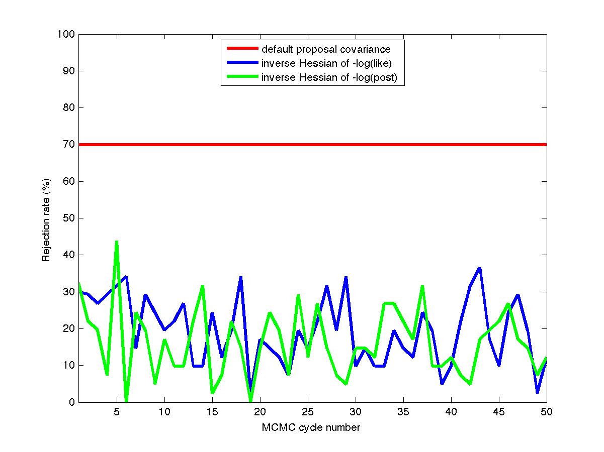
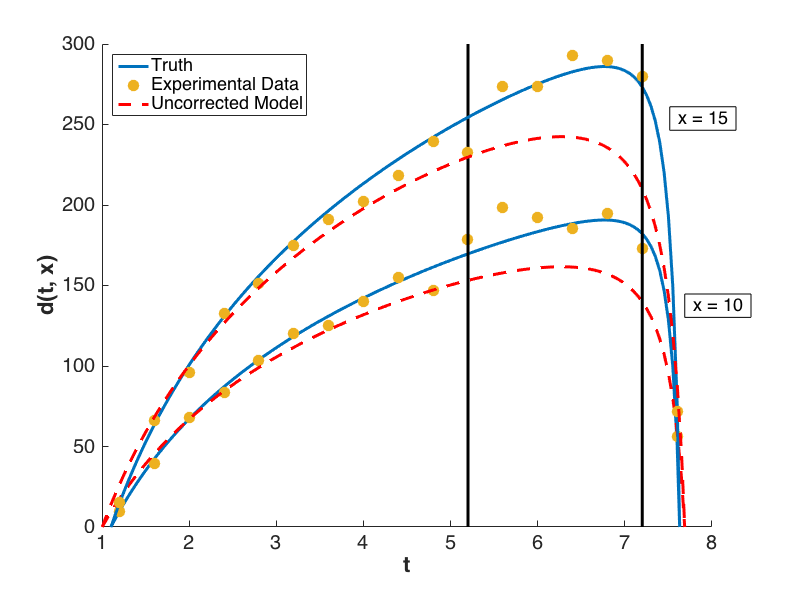
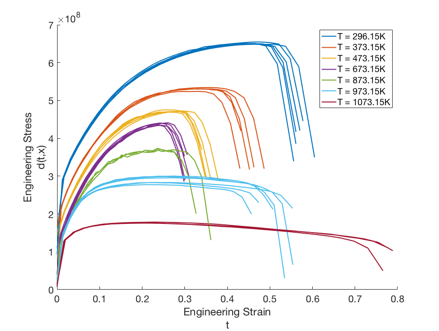

 .. _`uq:bayes`:

Bayesian Methods
================

This chapter covers various topics relating to Bayesian methods for
inferring input parameter distributions for computer models, which is
sometimes called “Bayesian calibration of computer models.” One common
solution approach for Bayesian calibration involves Markov Chain Monte
Carlo (MCMC) sampling.

- :ref:`Fundamentals <uq:bayes:basic>`,
  :ref:`Proposal Densities <uq:bayes:prop>`,
  :ref:`Pre-solve for MAP point <uq:bayes:map>`, and
  :ref:`Rosenbrock Example <uq:bayes:ex>` describe Bayesian fundamentals and then cover
  specialized approaches for accelerating the MCMC sampling process used
  within Bayesian inference.
- Chain diagnostic metrics for analyzing the convergence of the MCMC chain are discussed in
  :ref:`Chain Diagnostics <uq:chain_diagnostics>`.
- :ref:`Model Discrepancy <uq:model_disc>` describes ways of handling a
  discrepancy between the model estimate and the responses.
- :ref:`Experimental Design <uq:bayes_experimental_design>` describes a way of
  determining the optimal experimental design to identify high-fidelity
  runs that can be used to best inform the calibration of a low-fidelity
  model. This is followed by a discussion of information-theoretic metrics
  in :ref:`Information Theoretic Tools <uq:info_theory>`.
- Finally, we conclude this chapter with a discussion of a new Bayesian approach in
  :ref:`Measure-theoretic Stochastic Inverstion <uq:cbayes>` which does not use MCMC and relies on a
  measure-theoretic approach for stochastic inference instead of MCMC. In
  Dakota, the Bayesian methods called QUESO, GPMSA, and DREAM use Markov
  Chain Monte Carlo sampling. The Bayesian method called WASABI implements
  the measure-theoretic approach.

.. _`uq:bayes:basic`:

Fundamentals
------------

Bayes Theorem :cite:p:`Jaynes`, shown in
:eq:`BayesThm`, is used for performing inference.
In particular, we derive the plausible parameter values based on the
prior probability density and the data :math:`\boldsymbol{d}`. A typical
case involves the use of a conservative prior notion of an uncertainty,
which is then constrained to be consistent with the observational data.
The result is the posterior parameter density of the parameters
:math:`f_{\boldsymbol{\Theta |D}}\left( \boldsymbol{\theta |d} \right)`.

.. math::
   :label: BayesThm

   {f_{\boldsymbol{\Theta |D}}}\left( \boldsymbol{\theta |d} \right) = \frac{{{f_{\boldsymbol{\Theta}}}\left( \boldsymbol{\theta}  \right)\mathcal{L}\left( \boldsymbol{\theta;d} \right)}}{{{f_{\boldsymbol{D}}}\left( \boldsymbol{d} \right)}}

..
   TODO: The likelihood function can be written generally as:
   \begin{equation*}
     \mathcal{L}\left( {\theta ;d} \right) = f\left( {q\left( \theta  \right) - d} \right)
   \end{equation*}

The likelihood function is used to describe how well a model’s
predictions are supported by the data. The specific likelihood function
currently used in Dakota is a Gaussian likelihood. This means that we
assume the difference between the model quantity of interest (e.g.
result from a computer simulation) and the experimental observations are
Gaussian:

.. math::
   :label: bayes_model

   d_i = q_i(\boldsymbol{\theta}) + \epsilon_i,

where :math:`\boldsymbol{\theta}` are the parameters of a model quantity
of interest :math:`q_i` and :math:`\epsilon_i` is a random variable that
can encompass both measurement errors on :math:`d_i` and modeling errors
associated with the simulation quantity of interest
:math:`q_i(\boldsymbol{\theta})`. If we have :math:`n` observations, the
probabilistic model defined by :eq:`bayes_model` results
in a likelihood function for :math:`\boldsymbol{\theta}` as shown in
:eq:`bayes_Likelihood`:

..
    TODO:

    We further assume that all experiments and observations are independent. 

    ...that (likelihood) is the product of $n$ normal probability
    density functions

.. math::
   :label: bayes_Likelihood

   \mathcal{L}(\boldsymbol{\theta;d}) = 
   \frac{1}{\sqrt{(2\pi)^n |\boldsymbol{\Sigma_d}|}}
   \exp \left(
   -\frac{1}{2} \boldsymbol{r}^T \boldsymbol{\Sigma}_{\boldsymbol{d}}^{-1} \boldsymbol{r} 
   \right),

..
   TODO:
   %\mathcal{L}({\theta};d) = \prod_{i=1}^n \frac{1}{\sigma \sqrt{2\pi}} \exp
   %\left[ - \frac{\left(d_i-\mathcal{M}({\theta})\right)^2}{2\sigma^2} \right]

where the residual vector :math:`\boldsymbol{r}` is defined from the
differences between the model predictions and the corresponding
observational data (i.e., :math:`r_i = q_i(\boldsymbol{\theta}) - d_i`
for :math:`i = 1,\dots,n`), and :math:`\boldsymbol{\Sigma_d}` is the
covariance matrix of the Gaussian data uncertainties.

..
   TODO: , and we omit the leading multivariate normal (MVN)
   constant $1/\sqrt{(2\pi)^n |\boldsymbol{\Sigma_d}|}$ for
   simplicity. \footnote{In practice, omitting this MVN constant can
   avoid precision loss due to subtractive cancellation in
   log-likelihood calculations; further, this shortcut will be
   canceled out by the normalization factor in the denominator of
   Eq.~\ref{eq:BayesThm}.}.

The negative log-likelihood is comprised of the misfit function

.. math::
   :label: bayes_misfit

   M(\boldsymbol{\theta;d}) 
     = \frac{1}{2} \boldsymbol{r}^T \boldsymbol{\Sigma}_{\boldsymbol{d}}^{-1} \boldsymbol{r}

plus contributions from the leading normalization factor
(:math:`\frac{n}{2}\log(2\pi)` and
:math:`\frac{1}{2}\log(|\boldsymbol{\Sigma_d}|)`). It is evident that
dropping :math:`\boldsymbol{\Sigma_d}` from
:eq:`bayes_misfit` (or equivalently, taking it to be the
identity) results in the ordinary least squares (OLS) approach commonly
used in deterministic calibration. For a fixed
:math:`\boldsymbol{\Sigma_d}` (no hyper-parameters in the calibration),
minimizing the misfit function is equivalent to maximizing the
likelihood function and results in a solution known as the maximum
likelihood estimate (MLE), which will be the same as the OLS estimate
when the residuals have no relative weighting (any multiple of identity
in the data covariance matrix).

When incorporating the prior density, the maximum *a posteriori*
probability (MAP) point is the solution that maximizes the posterior
probability in :eq:`BayesThm`. This point will
differ from the MLE for cases of non-uniform prior probability.

..
   TODO:

   \begin{equation}
   p(\mathbf{d}|\xi) \;=\; \text{exp}\left[-\frac{1}{2}(f(\xi)-\mathbf{d})^T\boldsymbol{\Sigma_d}^{-1}(f(\xi)-\mathbf{d})\right]
   \end{equation}
   \begin{equation}
   -\text{log}\left[p(\mathbf{d}|\xi)\right] \;=\; \frac{1}{2}(f(\xi)-\mathbf{d})^T\boldsymbol{\Sigma_d}^{-1}(f(\xi)-\mathbf{d}) \;=\; M(\xi)
   \end{equation}
   
   pre_solve needs a deactivation option

In the sections to follow, we describe approaches for preconditioning
the MCMC process by computing a locally-accurate proposal density and
for jump-starting the MCMC process by pre-solving for the MAP point.
Within Dakota, these are separate options: one can configure a run to
use either or both, although it is generally advantageous to employ both
when the necessary problem structure (i.e., derivative support) is
present.

.. _`uq:bayes:prop`:

Proposal Densities
------------------

When derivatives of :math:`q(\theta)` are readily available (e.g., from
adjoint-capable simulations or from emulator models such as polynomial
chaos, stochastic collocation, or Gaussian processes), we can form
derivatives of the misfit function as

.. math::
   :label: grad_misfit

   \nabla_{\boldsymbol{\theta}} M(\boldsymbol{\theta}) = \nabla_{\boldsymbol{\theta}} \boldsymbol{q}(\boldsymbol{\theta})^T\,\boldsymbol{\Sigma}_{\boldsymbol{d}}^{-1}\,\boldsymbol{r}

.. math::   
   :label: hess_misfit
   
   \nabla^2_{\boldsymbol{\theta}} M(\boldsymbol{\theta}) = \nabla_{\boldsymbol{\theta}} \boldsymbol{q}(\boldsymbol{\theta})^T\,\boldsymbol{\Sigma}_{\boldsymbol{d}}^{-1}\,\nabla_{\boldsymbol{\theta}} \boldsymbol{q}(\boldsymbol{\theta}) + \nabla^2_{\boldsymbol{\theta}} \boldsymbol{q}(\boldsymbol{\theta}) \cdot \left[\boldsymbol{\Sigma}_{\boldsymbol{d}}^{-1}\,\boldsymbol{r}\right]

Neglecting the second term in :eq:`hess_misfit`
(a three-dimensional Hessian tensor dotted with the residual vector)
results in the Gauss-Newton approximation to the misfit Hessian:

.. math::
   :label: hess_misfit_gn

   \nabla^2_{\boldsymbol{\theta}} M(\boldsymbol{\theta}) \approx \nabla_{\boldsymbol{\theta}} \boldsymbol{q}(\boldsymbol{\theta})^T\,\boldsymbol{\Sigma}_{\boldsymbol{d}}^{-1}\,\nabla_{\boldsymbol{\theta}} \boldsymbol{q}(\boldsymbol{\theta})

This approximation requires only gradients of the residuals, enabling
its use in cases where models or model emulators only provide
first-order derivative information. Since the second term in
:eq:`hess_misfit` includes the residual vector,
it becomes less important as the residuals are driven toward zero. This
makes the Gauss-Newton approximation a good approximation for solutions
with small residuals. It also has the feature of being at least positive
semi-definite, whereas the full misfit Hessian may be indefinite in
general.

..
   TODO: To form the MVN proposal density for the MCMC process, we
   define the proposal covariance to be the inverse of the misfit
   Hessian.  Since the full Hessian may be indefinite while the
   Gauss-Newton approximation is at least positive semi-definite, we
   may first attempt to invert the full Hessian, followed by recourse
   when necessary to inverting the Gauss-Newton approximate Hessian.

We are interested in preconditioning the MCMC sampling using an accurate
local representation of the curvature of the posterior distribution, so
we will define the MCMC proposal covariance to be the inverse of the
Hessian of the negative log posterior. From :eq:`BayesThm` and simplifying notation to
:math:`\pi_{\rm post}` for the posterior and :math:`\pi_0` for the
prior, we have

.. math::
   :label: hess_post

   \nabla^2_{\boldsymbol{\theta}} 
     \left[ -\log(\pi_{\rm post}(\boldsymbol{\theta})) \right] = 
     \nabla^2_{\boldsymbol{\theta}} M(\boldsymbol{\theta}) - 
     \nabla^2_{\boldsymbol{\theta}} \left[ \log(\pi_0(\boldsymbol{\theta})) \right] 

A typical approach for defining a proposal density is to utilize a
multivariate normal (MVN) distribution with mean centered at the current
point in the chain and prescribed covariance. Thus, in the specific case
of an MVN proposal, we will utilize the fact that the Hessian of the
negative log prior for a normal prior distribution is just the inverse
covariance:

.. math::
   :label: normal_prior_hess

   -\nabla^2_{\boldsymbol{\theta}} \left[ \log(\pi_0(\boldsymbol{\theta})) \right] 
   = \boldsymbol{\Sigma}_{\boldsymbol{0}}^{-1}

For non-normal prior distributions, this is not true and, in the case of
uniform or exponential priors, the Hessian of the negative log prior is
in fact zero. However, as justified by the approximation of an MVN
proposal distribution and the desire to improve the conditioning of the
resulting Hessian, we will employ :eq:`normal_prior_hess` for all prior
distribution types.

From here, we follow :cite:p:`Petra2014` and decompose the
prior covariance into its Cholesky factors, resulting in

.. math::
   :label: bayes_cholesky_factors

   \begin{aligned}
   \boldsymbol{H_{\rm nlpost}} 
     &=& \boldsymbol{H_M} + \boldsymbol{\Sigma}_{\boldsymbol{0}}^{-1} \\
     &=& \boldsymbol{H_M} + 
         \boldsymbol{L}_{\boldsymbol{0}}^{-T}\boldsymbol{L}_{\boldsymbol{0}}^{-1} \\
     &=& \boldsymbol{L}_{\boldsymbol{0}}^{-T} 
         \left[\boldsymbol{L}_{\boldsymbol{0}}^T \boldsymbol{H_M} 
               \boldsymbol{L}_{\boldsymbol{0}} + \boldsymbol{I} \right]
         \boldsymbol{L}_{\boldsymbol{0}}^{-1}\end{aligned}

where we again simplify notation to represent
:math:`\nabla^2_{\boldsymbol{\theta}} \left[ -\log(\pi_{\rm post}(\boldsymbol{\theta})) \right]` as
:math:`\boldsymbol{H_{\rm nlpost}}` and
:math:`\nabla^2_{\boldsymbol{\theta}} M(\boldsymbol{\theta})` as
:math:`\boldsymbol{H_M}`. The inverse of this matrix is then

.. math::
   :label: inv_hess_nlpost

   \boldsymbol{H}_{\boldsymbol{\rm nlpost}}^{-1} = 
     \boldsymbol{L}_{\boldsymbol{0}} \left[\boldsymbol{L}_{\boldsymbol{0}}^T \boldsymbol{H_M} \boldsymbol{L}_{\boldsymbol{0}} +
     \boldsymbol{I} \right]^{-1} \boldsymbol{L}_{\boldsymbol{0}}^T

Note that the use of :math:`\boldsymbol{\Sigma}_{\boldsymbol{0}}^{-1}`
for the Hessian of the negative log prior in
:eq:`normal_prior_hess` provides some
continuity between the default proposal covariance and the proposal
covariance from Hessian-based preconditioning: if the contributions from
:math:`\boldsymbol{H_M}` are neglected, then
:math:`\boldsymbol{H}_{\boldsymbol{\rm nlpost}}^{-1} = \boldsymbol{\Sigma_0}`,
the default.

To address the indefiniteness of :math:`\boldsymbol{H_M}` (or to reduce
the cost for large-scale problems by using a low-rank Hessian
approximation), we perform a symmetric eigenvalue decomposition of this
prior-preconditioned misfit and truncate any eigenvalues below a
prescribed tolerance, resulting in

.. math::
  :label: bayes_decomp_result

   \boldsymbol{L}_{\boldsymbol{0}}^T \boldsymbol{H_M} \boldsymbol{L}_{\boldsymbol{0}} 
   \approx \boldsymbol{V}_r \boldsymbol{\Lambda}_r \boldsymbol{V}_r^T.

for a matrix :math:`\boldsymbol{V}_r` of truncated eigenvectors and a
diagonal matrix of truncated eigenvalues
:math:`\boldsymbol{\Lambda}_r = {\rm diag}(\lambda_1, \lambda_2, \dots, \lambda_r)`.
We then apply the Sherman-Morrison-Woodbury formula to invert the sum of
the decomposed matrix and identity as

.. math::
   :label: bayes_invert_result

   \left[\boldsymbol{V}_r \boldsymbol{\Lambda}_r \boldsymbol{V}_r^T +
     \boldsymbol{I} \right]^{-1} = \boldsymbol{I} - 
     \boldsymbol{V}_r \boldsymbol{D}_r \boldsymbol{V}_r^T.

for
:math:`\boldsymbol{D}_r = {\rm diag}(\frac{\lambda_1}{\lambda_1+1}, \frac{\lambda_2}{\lambda_2+1}, \dots, \frac{\lambda_r}{\lambda_r+1})`.
We now arrive at our final result for the covariance of the MVN proposal
density:

.. math::
   :label: inv_hess_nlpost_approx

   \boldsymbol{\Sigma_{MVN}} = \boldsymbol{H}_{\boldsymbol{\rm nlpost}}^{-1} \approx
     \boldsymbol{L}_{\boldsymbol{0}} \left[ \boldsymbol{I} - 
     \boldsymbol{V}_r \boldsymbol{D}_r \boldsymbol{V}_r^T \right] 
     \boldsymbol{L}_{\boldsymbol{0}}^T

.. _`uq:bayes:map`:

Pre-solve for MAP point
-----------------------

When an emulator model is in use, it is inexpensive to pre-solve for the
MAP point by finding the optimal values for :math:`\boldsymbol{\theta}`
that maximize the log posterior (minimize the negative log posterior):

.. math::
   :label: map_soln

   \boldsymbol{\theta}_{MAP} = \text{arg min}_{\boldsymbol{\theta}} 
   \left[ -\log(\pi_{\rm post}(\boldsymbol{\theta})) \right]

This effectively eliminates the burn-in procedure for an MCMC chain
where some initial portion of the Markov chain is discarded, as the MCMC
chain can instead be initiated from a high probability starting point:
the MAP solution. Further, a full Newton optimization solver can be used
with the Hessian defined from :eq:`hess_post`,
irregardless of whether the misfit Hessian is a full Hessian (residual
values, gradients, and Hessians are available for
:eq:`hess_misfit`) or a Gauss-Newton Hessian
(residual gradients are available for
:eq:`hess_misfit_gn`). Note that, in this
case, there is no MVN approximation as in :ref:`Proposal Densities <uq:bayes:prop>`,
so we will not employ :eq:`normal_prior_hess`. Rather, we
employ the actual Hessians of the negative log priors for the prior
distributions in use.

.. _`uq:bayes:ex`:

Rosenbrock Example
------------------

Defining two residuals as:

.. math::
   :label: bayes_rosen_residuals

   \begin{aligned}
   r_1 &=& 10 (\theta_2 - \theta_1^2) \\
   r_2 &=& 1 - \theta_1 \end{aligned}

with :math:`\boldsymbol{d} = \boldsymbol{0}` and
:math:`\boldsymbol{\Sigma_d} =
\text{diag}(\boldsymbol{.5})`, it is evident from
:eq:`bayes_misfit` that :math:`M(\theta;d)` is exactly the
Rosenbrock function [1]_ with its well-known banana-shaped contours.

Assuming a uniform prior on :math:`[-2,2]`,
:numref:`fig:rosen_prop_covar_a` and :numref:`fig:rosen_prop_covar_b`
show the effect of different proposal covariance components, with the default
prior covariance
(:math:`\boldsymbol{\Sigma_{MVN}} = \boldsymbol{\Sigma_0}`) in
:numref:`fig:rosen_prop_covar_a` and a
misfit Hessian-based proposal covariance
(:math:`\boldsymbol{\Sigma_{MVN}} = \boldsymbol{H}_{\boldsymbol{M}}^{-1}`)
in :numref:`fig:rosen_prop_covar_b`.

.. figure:: img/rosen_00_prior.png
   :alt: Proposal covariance defined from uniform prior.
   :name: fig:rosen_prop_covar_a
   :width: 600
   :align: center

   Proposal covariance defined from uniform prior.

.. figure:: img/rosen_00_pce_hessian.png
   :alt: Proposal covariance defined from misfit Hessian.
   :name: fig:rosen_prop_covar_b
   :width: 600
   :align: center

   Proposal covariance defined from uniform prior.

Rejection rates for 2000 MCMC samples were 73.4% for the former and
25.6% for the latter. Reducing the number of MCMC samples to 40, for
purposes of assessing local proposal accuracy, results in a similar
72.5% rejection rate for prior-based proposal covariance and a reduced
17.5% rate for misfit Hessian-based proposal covariance. The prior-based
proposal covariance only provides a global scaling and omits information
on the structure of the likelihood; as a result, the rejection rates are
relatively high for this problem and are not a strong function of
location or chain length. The misfit Hessian-based proposal covariance,
on the other hand, provides accurate local information on the structure
of the likelihood, resulting in low rejection rates for samples in the
vicinity of this Hessian update. Once the chain moves away from this
vicinity, however, the misfit Hessian-based approach may become
inaccurate and actually impede progress. This implies the need to
regularly update a Hessian-based proposal covariance to sustain these
MCMC improvements.

.. figure:: img/rosen_restart_mle_map.png
   :alt: Restarted chain
   :name: fig:rosen_restart_a
   :width: 600
   :align: center

   Restarted chain

   Rejection rates

In :numref:`fig:rosen_restart_a`, we show a result
for a total of 2000 MCMC samples initiated from :math:`(-1,1)`, where we
restart the chain with an updated Hessian-based proposal covariance
every 40 samples:

.. code-block::

   samples = 2000
   proposal_updates = 50

This case uses a standard
normal prior, resulting in differences in the MLE and MAP estimates, as
shown in :numref:`fig:rosen_restart_a`.
:numref:`fig:rosen_restart_b` shows the
history of rejection rates for each of the 50 chains for misfit
Hessian-based proposals
(:math:`\boldsymbol{\Sigma_{MVN}} = \boldsymbol{H}_{\boldsymbol{M}}^{-1}`)
and negative log posterior Hessian-based proposals
(:math:`\boldsymbol{\Sigma_{MVN}} = \boldsymbol{H}_{\boldsymbol{\rm nlpost}}^{-1}`)
compared to the rejection rate for a single 2000-sample chain using
prior-based proposal covariance
(:math:`\boldsymbol{\Sigma_{MVN}} = \boldsymbol{\Sigma_0}`).

A standard normal prior is not a strong prior in this case, and the
posterior is likelihood dominated. This leads to similar performance
from the two Hessian-based proposals, with average rejection rates of
70%, 19.5%, and 16.4% for prior-based, misfit Hessian-based, and
posterior Hessian-based cases, respectively.

.. _`uq:chain_diagnostics`:

Chain Diagnostics
-----------------

The implementation of a number of metrics for assessing the convergence
of the MCMC chain drawn during Bayesian calibration is undergoing active
development in Dakota. As of Dakota 6.10,
:dakkw:`method-bayes_calibration-chain_diagnostics-confidence_intervals` is
the only diagnostic implemented.

Confidence Intervals
~~~~~~~~~~~~~~~~~~~~

Suppose :math:`g` is a function that represents some characteristic of
the probability distribution :math:`\pi` underlying the MCMC
chain :cite:p:`Fle10`, such as the mean or variance. Then
under the standard assumptions of an MCMC chain, the true expected value
of this function, :math:`\mathbb{E}_{\pi}g` can be approximated by
taking the mean over the :math:`n` samples in the MCMC chain, denoted
:math:`X = \{X_{1}, X_{2}, \ldots, X_{n} \}`,

.. math::
   :label: ci_eq_1

   \bar{g}_{n} = \frac{1}{n} \sum_{i = 1}^{n} g(X_{i}).

The error in this approximation converges to zero, such that

.. math::
   :label: ci_eq_2
   
   \sqrt{n}\left( \bar{g}_{n} - \mathbb{E}_{\pi}g \right) \rightarrow
     \mathcal{N}(0, \sigma_{g}^{2}), \quad n \rightarrow \infty.

Thus, in particular, we would like to estimate the variance of this
error, :math:`\sigma_{g}^{2}`. Let :math:`\hat{\sigma}_{n}^{2}` be a
consistent estimator of the true variance :math:`\sigma_{g}^{2}`. Then

.. math::
   :label: ci_eq_3

   \bar{g}_{n} \pm t_{*} \frac{\hat{\sigma}_{n}}{\sqrt{n}}

is an asymptotically valid interval estimator of
:math:`\mathbb{E}_{\pi}g`, where :math:`t_{*}` is a Student’s :math:`t`
quantile. In Dakota, confidence intervals are computed for the mean and
variance of the parameters and of the responses, all confidence
intervals are given at the 95th percentile, and :math:`\hat{\sigma}_{n}`
is calculated via non-overlapping batch means, or “batch means" for
simplicity.

When batch means is used to calculate :math:`\hat{\sigma}_{n}`, the MCMC
chain :math:`X` is divided into blocks of equal size. Thus, we have
:math:`a_{n}` batches of size :math:`b_{n}`, and :math:`n = a_{n}b_{n}`.
Then the batch means estimate of :math:`\sigma_{g}^{2}` is given by

.. math::
   :label: ci_eq_4

   \hat{\sigma}_{n}^{2} = \frac{b_{n}}{a_{n} -1} \sum_{k = 0}^{a_{n}-1}
                            \left( \bar{g}_{k} - \bar{g}_{n} \right)^{2},

where :math:`\bar{g}_{k}` is the expected value of :math:`g` for batch
:math:`k = 0, \ldots,
a_{n}-1`,

.. math::
   :label: ci_eq_5

   \bar{g}_{k} = \frac{1}{b_{n}} \sum_{i = 1}^{b_{n}} 
                   g\left(X_{kb_{n}+i}\right).

It has been found that an appropriate batch size is
:math:`b_{n} = \left 
\lfloor{\sqrt{n}}\right \rfloor`. Further discussion and comparison to
alternate estimators of :math:`\sigma_{g}^{2}` can be found
in :cite:p:`Fle10`.

Confidence intervals may be used as a chain diagnostic by setting
fixed-width stopping rules :cite:p:`Rob18`. For example, if
the width of one or more intervals is below some threshold value, that
may indicate that enough samples have been drawn. Common choices for the
threshold value include:

-  Fixed width: :math:`\epsilon`
-  Relative magnitude: :math:`\epsilon \| \bar{g}_{n} \|`
-  Relative standard deviation: :math:`\epsilon \| \hat{\sigma}_{n} \|`

If the chosen threshold is exceeded, ``samples`` may need to be
increased. Sources :cite:p:`Fle10, Rob18` suggest increasing
the sample size by 10% and reevaluating the diagnostics for signs of
chain convergence.

If :dakkw:`method-output` is set to :dakkw:`method-output-debug`,
the sample mean and variance for each batch (for each parameter and response)
is output to the screen. The user can then analyze the convergence of these
batch means in order to deduce whether the MCMC chain has converged.

.. _`uq:model_disc`:

Model Discrepancy
-----------------

Whether in a Bayesian setting or otherwise, the goal of model
calibration is to minimize the difference between the observational data
:math:`d_i` and the corresponding model response
:math:`q_i(\boldsymbol{\theta})`. That is, one seeks to minimize the
misfit :eq:`bayes_misfit`. For a given set of data, this
formulation explicitly depends on model parameters that are to be
adjusted and implicitly on conditions that may vary between experiments,
such as temperature or pressure. These experimental conditions can be
represented in Dakota by configuration variables, in which case
:eq:`bayes_model` can be rewritten,

.. math::
   :label: model_discrepancy_1

   d_i(x) = q_i(\boldsymbol{\theta}, x) + \epsilon_i,

where :math:`x` represents the configuration variables. Updated forms of
the likelihood :eq:`bayes_Likelihood` and misfit :eq:`bayes_misfit` are easily obtained.

It is often the case that the calibrated model provides an insufficient
fit to the experimental data. This is generally attributed to model form
or structural error, and can be corrected to some extent with the use of
a model discrepancy term. The seminal work in model discrepancy
techniques, Kennedy and O’Hagan :cite:p:`Kenn01`, introduces
an additive formulation

.. math::
   :label: koh_discrep

   d_i(x) = q_i\left(\boldsymbol{\theta}, x\right) + \delta_i(x) + \epsilon_i,

where :math:`\delta_i(x)` represents the model discrepancy. For scalar
responses, :math:`\delta_i` depends *only* on the configuration
variables, and one discrepancy model is calculated for *each* observable
:math:`d_i`, :math:`i = 1, 
\ldots, n`, yielding :math:`\delta_1, \ldots, \delta_n`. For field
responses in which the observational data and corresponding model
responses are also functions of independent field coordinates such as
time or space, :eq:`koh_discrep` can be rewritten as

.. math::
   :label: model_discrepancy_2

   d(t,x) = q(t, \boldsymbol{\theta}, x) + \delta(t,x) + \epsilon.

In this case, a single, global discrepancy model :math:`\delta` is
calculated over the entire field. The current model discrepancy
implementation in Dakota has not been tested for cases in which scalar
and field responses are mixed.

The Dakota implementation of model discrepancy for scalar responses also
includes the calculation of prediction intervals for each prediction
configuration :math:`x_{k,new}`. These intervals capture the uncertainty
in the discrepancy approximation as well as the experimental uncertainty
in the response functions. It is assumed that the uncertainties,
representated by their respective variance values, are combined
additively for each observable :math:`i` such that

.. math::
   :label: md_totalvar

   \Sigma_{total,i}(x) = \Sigma_{\delta,i}(x) + \sigma^2_{exp,i}(x)I,

where :math:`\Sigma_{\delta,i}` is the variance of the discrepancy
function, and :math:`\sigma^2_{exp,i}` is taken from the user-provided
experimental variances. The experimental variance provided for parameter
calibration may vary for the same observable from experiment to
experiment, thus :math:`\sigma^{2}_{exp,i}` is taken to be the maximum
variance given for each observable. That is,

.. math::
   :label: model_discrepancy_3
   
   \sigma^2_{exp,i} = \max_{j} \sigma^2_{i}(x_j),

where :math:`\sigma^2_{i}(x_j)` is the variance provided for the
:math:`i^{th}` observable :math:`d_i`, computed or measured with the
configuration variable :math:`x_j`. When a Gaussian process discrepancy
function is used, the variance is calculated according to
:eq:`KrigVar`. For polynomial discrepancy
functions, the variance is given by :eq:`poly_var`.

It should be noted that a Gaussian process discrepancy function is used
when the response is a field instead of a scalar; the option to use a
polynomial discrepancy function has not yet been activated. The variance
of the discrepancy function :math:`\Sigma_{\delta, i}` is calculated
according to :eq:`KrigVar`. Future work includes
extending this capability to include polynomial discrepancy formulations
for field responses, as well as computation of prediction intervals
which include experimental variance information.

..
   TODO:

   Introducing a discrepancy term gives rise to practical, as well as 
   philosphical, issues: What model form is most appropriate for $\delta_i$? How
   should $\delta_i$ be estimated? How does including $\delta_i$ change the 
   meaning or interpretation of the model responses? What is the appropriate way
   of using $\delta_i$ to improve the predictive capability of the model? 
   
   add comments regarding interpolation vs extrapolation? kam

.. _`uq:model_disc:scalar_example`:

Scalar Responses Example
~~~~~~~~~~~~~~~~~~~~~~~~

For the purposes of illustrating the model discrepancy capability
implemented in Dakota, consider the following example. Let the “truth"
be given by

.. math::
   :label: md_truth

   y(t,x) = 10.5 x \log(t-0.1) - \frac{x}{(t-0.1-\theta^{*})^2},

where :math:`t` is the independent variable, :math:`x` is the
configuration parameter, and :math:`\theta^{*}` is :math:`7.75`, the
“true" value of the parameter :math:`\theta`. Let the “model" be given
by

.. math::
   :label: md_model

   m(t,\theta, x) = \frac{10 x \log(t) (t-\theta)^2 - x}{(t-8)^2}.

Again, :math:`t` is the independent variable and :math:`x` is the
configuration parameter, and :math:`\theta` now represents the model
parameter to be calibrated. It is clear from the given formulas that the
model is structurally different from the truth and will be inadequate.

The “experimental" data is produced by considering two configurations,
:math:`x=10` and :math:`x=15`. Data points are taken over the range
:math:`t \in [1.2, 7.6]` at intervals of length :math:`\Delta t = 0.4`.
Normally distributed noise :math:`\epsilon_i` is added such that

.. math::
   :label: md_data

   d_i(x_j) = y(t_i, x_j) + \epsilon_i,

with :math:`i = 1, \ldots, 17` and :math:`j = 1,2`. Performing a
Bayesian update in Dakota yields a posterior distribution of
:math:`\theta` that is tightly peaked around the value
:math:`\bar{\theta} = 7.9100`. Graphs of :math:`m(t, \bar{\theta}, 10)`
and :math:`m(t, \bar{\theta}, 15)` are compared to :math:`y(t, 10)` and
:math:`y(t, 15)`, respectively, for :math:`t \in [1.2, 7.6]` in
:numref:`fig:md_uncorr`, from which it is clear that the model
insufficiently captures the given experimental data.

.. figure:: img/moddiscrep_TruthExpModel.png
   :alt: Graphs of the uncorrected model output :math:`m(t,x)`, the
         truth :math:`y(t,x)`, and experimental data :math:`d(t,x)` for
         configurations :math:`x = 10` and :math:`x = 15`.
   :name: fig:md_uncorr
   :width: 600
   :align: center

   Graphs of the uncorrected model output :math:`m(t,x)`, the truth
   :math:`y(t,x)`, and experimental data :math:`d(t,x)` for
   configurations :math:`x = 10` and :math:`x = 15`.

Following the Bayesian update, Dakota calculates the model discrepancy
values

.. math::
   :label: md_discrep

   \delta_i(x_j) = d_i(x_j) - m_i(\bar{\theta}, x_j)

for the experimental data points, *i.e.* for :math:`i = 1, \ldots, 17`
and :math:`j = 1,2`. Dakota then approximates the model discrepancy
functions :math:`\delta_1(x), \ldots \delta_{17}(x)`, and computes the
responses and prediction intervals of the corrected model
:math:`m_i(\bar{\theta}, x_{j,new}) 
+ \delta_i(x_{j,new})` for each prediction configuration. The prediction
intervals have a radius of two times the standard deviation calculated
with :eq:`md_totalvar`. The discrepancy function in
this example was taken to be a Gaussian process with a quadratic trend,
which is the default setting for the model discrepancy capability in
Dakota.

The prediction configurations are taken to be
:math:`x_{new} = 5, 5.5, \ldots, 20`. Examples of two corrected models
are shown in :numref:`fig:md_corr`. The substantial
overlap in the measurement error bounds and the corrected model
prediction intervals indicate that the corrected model is sufficiently
accurate. This conclusion is supported by :numref:`fig:md_pred`,
in which the “truth" models for three prediction figurations are
compared to the corrected model output. In each case, the truth falls
within the prediction intervals.

   Locations of the corrected models shown below.
   
.. figure:: img/moddiscrep_GPt5.png
   :alt: Corrected model values with prediction intervals for t = 5.2
   :name: fig:md_corr_b
   :width: 600
   :align: center

   Corrected model values with prediction intervals for t = 5.2
   
.. figure:: img/moddiscrep_GPt7.png
   :alt: Corrected model values with prediction intervals for t = 7.2
   :name: fig:md_corr_c
   :width: 600
   :align: center

   Corrected model values with prediction intervals for t = 7.2
   
.. figure:: img/moddiscrep_correctedlowmidhigh.png
   :alt: The graphs of :math:`y(t,x)` for :math:`x = 7.5, 12.5, 17.5`
         are compared to the corrected model and its prediction intervals.
         The uncorrected model is also shown to illustrate its inadequacy.
   :name: fig:md_pred
   :width: 600
   :align: center

   The graphs of :math:`y(t,x)` for :math:`x = 7.5, 12.5, 17.5` are
   compared to the corrected model and its prediction intervals. The
   uncorrected model is also shown to illustrate its inadequacy.

.. _`uq:model_disc:field_example`:

Field Responses Example
~~~~~~~~~~~~~~~~~~~~~~~

To illustrate the model discrepancy capability for field responses,
consider the stress-strain experimental data shown in
:numref:`fig:mat_exp`. The configuration variable in this
example represents temperature. Unlike the example discussed in the
previous section, the domain of the independent variable (strain)
differs from temperature to temperature, as do the shapes of the stress
curves. This presents a challenge for the simulation model as well as
the discrepancy model.

Let the "model" be given by

.. math::
   :label: bayes_field_responses_1

   m(t, \boldsymbol{\theta}, x) = \theta_{1} \left[ \frac{\log(100t + 1)}{x^0.5}
     - \frac{1}{x^{0.2}\left(100t - 1.05\left(\frac{x}{100} - 6.65\right)^{2}
   \theta_{2}\right)^{2}} \right],

where :math:`t` is the independent variable (strain) and :math:`x` is
the configuration parameter (temperature). Note that there are two
parameters to be calibrated,
:math:`\boldsymbol{\theta} = (\theta_{1}, \theta_{2})`.

The average and standard deviation of the experimental data at
temperatures :math:`x = 373.15`, :math:`x = 673.15`, and
:math:`x = 973.15` are calculated and used as calibration data. The four
remaining temperatures will be used to evaluate the performance of the
corrected model. The calibration data and the resulting calibrated model
are shown in Figure `1.4 <#fig:mat_uncorr>`__. With experimental data,
the observations may not be taken at the same independent field
coordinates, so the keyword :dakkw:`responses-calibration_terms-calibration_data-interpolate`
can be used in the :dakkw:`responses` block of the Dakota input file.
The uncorrected model does not adequately capture the experimental data.

         configurations (temperatures) ranging from :math:`x = 296.15K` to
         :math:`x = 1073.15K`.
   :name: fig:mat_exp
   :width: 600
   :align: center

   Graphs of the experimental data :math:`d(t,x)` for configurations
   (temperatures) ranging from :math:`x = 296.15K` to :math:`x = 1073.15K`.

Following the Bayesian update, Dakota calculates the build points of the
model discrepancy,

.. math::
   :label: bayes_field_responses_2

   \delta(t_{i}, x_{j}) = d(t_{i}, x_{j}) - m(t_{i}, \boldsymbol{\theta}, x_j),

for each experimental data point. Dakota then approximates the global
discrepancy function :math:`\delta(t, x)` and computes the corrected
model responses
:math:`m(t_{i}, \boldsymbol{\theta}, x_{j, new}) + \delta(t_{i}, x_{j, new})`
and variance of the discrepancy model
:math:`\sigma_{\delta, x_{j, new}}` for each prediction configuration.
The corrected model for the prediction configurations is shown in
:numref:`fig:mat_uncorr`. The corrected model is able
to capture the shape of the stress-strain curve quite well in all four
cases; however, the point of failure is difficult to capture for the
extrapolated temperatures. The difference in shape and point of failure
between temperatures may also explain the large variance in the
discrepancy model.

.. figure:: img/moddiscrep_ExpUncorr.png
   :alt: Graphs of the calibration data :math:`d(t,x)` and
         uncorrected calibrated model :math:`m(t, \boldsymbol{\theta}, x)`
         for configurations (temperatures) :math:`x = 
         373.15K`, :math:`x = 673.15K`, and :math:`x = 973.15K`.
   :name: fig:mat_uncorr
   :width: 600
   :align: center

   Graphs of the calibration data :math:`d(t,x)` and uncorrected
   calibrated model :math:`m(t, \boldsymbol{\theta}, x)` for
   configurations (temperatures) :math:`x = 
   373.15K`, :math:`x = 673.15K`, and :math:`x = 973.15K`.

.. _`uq:bayes_experimental_design`:

Experimental Design
-------------------

Experimental design algorithms seek to add observational data that
informs model parameters and reduces their uncertainties. Typically, the
observational data :math:`\boldsymbol{d}` used in the Bayesian
update :eq:`BayesThm` is taken from physical
experiments. However, it is also common to use the responses or output
from a high-fidelity model as :math:`\boldsymbol{d}` in the calibration
of a low-fidelity model. Furthermore, this calibration can be done with
a single Bayesian update or iteratively with the use of experimental
design. The context of experimental design mandates that the
high-fidelity model or physical experiment depend on design conditions
or configurations, such as temperature or spatial location. After a
preliminary Bayesian update using an initial set of high-fidelity (or
experimental) data, the next “best" design points are determined and
used in the high-fidelity model to augment :math:`\boldsymbol{d}`, which
is used in subsequent Bayesian updates of the low-fidelity model
parameters.

The question then becomes one of determining the meaning of “best." In
information theory, the mutual information is a measure of the reduction
in the uncertainty of one random variable due to the knowledge of
another :cite:p:`Cov2006`. Recast into the context of
experimental design, the mutual information represents how much the
proposed experiment and resulting observation would reduce the
uncertainties in the model parameters. Therefore, given a set of
experimental design conditions, that which maximizes the mutual
information is the most desirable. This is the premise that motivates
the Bayesian experimental design algorithm implemented in Dakota.

The initial set of high-fidelity data may be either user-specified or
generated within Dakota by performing Latin Hypercube Sampling on the
space of configuration variables specified in the input file. If
Dakota-generated, the design variables will be run through the
high-fidelity model specified by the user to produce the initial data
set. Whether user-specified or Dakota-generated, this initial data is
used in a Bayesian update of the low-fidelity model parameters.

It is important to note that the low-fidelity model depends on both
parameters to be calibrated :math:`\boldsymbol{\theta}` and the design
conditions :math:`\boldsymbol{\xi}`. During Bayesian calibration,
:math:`\boldsymbol{\xi}` are not calibrated; they do, however, play an
integral role in the calculation of the likelihood. Let us rewrite
Bayes’ Rule as

.. math::
   :label: expdesign_bayes

   {f_{\boldsymbol{\Theta |D}}}\left( \boldsymbol{\theta |d(\xi)} \right) 
   = \frac{{{f_{\boldsymbol{\Theta}}}\left( \boldsymbol{\theta} \right)
   \mathcal{L}\left( \boldsymbol{\theta;d(\xi)} \right)}}
   {{{f_{\boldsymbol{D}}}\left( \boldsymbol{d(\xi)} \right)}},

making explicit the dependence of the data on the design conditions. As
in :ref:`Fundamentals <uq:bayes:basic>`, the difference between the
high-fidelity and low-fidelity model responses is assumed to be Gaussian
such that

.. math::
   :label: expdesign_bayes_2

   d_{i}(\boldsymbol{\xi_{j}}) = q_{i}(\boldsymbol{\theta,\xi}_{j}) + \epsilon_{i},

where :math:`\boldsymbol{\xi}_{j}` are the configuration specifications
of the :math:`j`\ th experiment. The experiments are considered to be
independent, making the misfit

.. math::
   :label: expdesign_bayes_3

   M(\boldsymbol{\theta, d(\xi)}) = \frac{1}{2} \sum_{j = 1}^{m} 
   \left( \boldsymbol{d}(\boldsymbol{\xi}_{j}) - 
   \boldsymbol{q}(\boldsymbol{\theta, \xi}_{j}) \right)^{T}
   \boldsymbol{\Sigma}_{\boldsymbol{d}}^{-1}
   \left( \boldsymbol{d}(\boldsymbol{\xi}_{j}) - 
   \boldsymbol{q}(\boldsymbol{\theta, \xi}_{j}) \right).

At the conclusion of the initial calibration, a set of candidate design
conditions is proposed. As before, these may be either user-specified or
generated within Dakota via Latin Hypercube Sampling of the design
space. Among these candidates, we seek that which maximizes the mutual
information,

.. math::
   :label: optimal_design

   \boldsymbol{\xi}^{*} = \text{arg max}_{\boldsymbol{\xi}_{j}} I(\boldsymbol{\theta},
   \boldsymbol{d}(\boldsymbol{\xi}_{j}) ),   

where the mutual information is given by

.. math::
   :label: mutual_info

   I(\boldsymbol{\theta}, \boldsymbol{d}(\boldsymbol{\xi}_{j})) = \iint 
   {f_{\boldsymbol{\Theta ,D}}}\left( \boldsymbol{\theta ,d(\xi}_{j}) \right)
   \log \frac{ {f_{\boldsymbol{\Theta,D}}}\left( \boldsymbol{\theta,d(\xi}_{j}) 
   \right)}{f_{\boldsymbol{\Theta}}\left(\boldsymbol{\theta} \right) 
   f_{\boldsymbol{D}}\left(\boldsymbol{d}(\boldsymbol{\xi}_{j}) \right) }
   d\boldsymbol{\theta} d\boldsymbol{d}.

The mutual information must, therefore, be computed for each candidate
design point :math:`\boldsymbol{\xi}_{j}`. There are two
:math:`k`-nearest neighbor methods available in Dakota that can be used
to approximate :eq:`mutual_info`, both of which
are derived in :cite:p:`Kra04`. Within Dakota, the posterior
distribution
:math:`f_{\boldsymbol{\Theta | D}}\left(\boldsymbol{\theta | d(\xi)}\right)`
is given by MCMC samples. From these, :math:`N` samples are drawn and
run through the low-fidelity model with :math:`\boldsymbol{\xi}_{j}`
fixed. This creates a matrix whose rows consist of the vector
:math:`\boldsymbol{\theta}^{i}` and the low-fidelity model responses
:math:`\tilde{\boldsymbol{d}}(\boldsymbol{\theta}^{i}, 
\boldsymbol{\xi}_{j})` for :math:`i = 1, \ldots, N`. These rows
represent the joint distribution between the parameters and model
responses. For each row :math:`X_{i}`, the distance to its
:math:`k^{th}`-nearest neighbor among the other rows is approximated
:math:`\varepsilon_{i} = \| X_{i} - X_{k(i)} \|_{\infty}`. As noted
in :cite:p:`Lew16`, :math:`k` is often taken to be six. The
treatment of the marginal distributions is where the two mutual
information algorithms differ. In the first algorithm, the marginal
distributions are considered by calculating
:math:`n_{\boldsymbol{\theta},i}`, which is the number of parameter
samples that lie within :math:`\varepsilon_{i}` of
:math:`\boldsymbol{\theta}^{i}`, and :math:`n_{\boldsymbol{d},i}`, which
is the number of responses that lie within :math:`\varepsilon_{i}` of
:math:`\tilde{\boldsymbol{d}}(\boldsymbol{\theta}^{i}, 
\boldsymbol{\xi}_{j})`. The mutual information then is approximated
as :cite:p:`Kra04`

.. math::
   :label: ksg1
   
   I(\boldsymbol{\theta}, \boldsymbol{d}(\boldsymbol{\xi}_{j})) \approx
   \psi(k) + \psi(N) - \frac{1}{N-1} \sum_{i = 1}^{N} \left[ 
   \psi(n_{\boldsymbol{\theta},i}) - \psi(n_{\boldsymbol{d},i}) \right],

where :math:`\psi(\cdot)` is the digamma function.

In the second mutual information approximation method, :math:`X_{i}` and
all of its :math:`k`-nearest neighbors such that
:math:`\| X_{i} - X_{l} \|_{\infty} < 
\varepsilon_{i}` are projected into the marginal subspaces for
:math:`\boldsymbol{\theta}` and :math:`\tilde{\boldsymbol{d}}`. The
quantity :math:`\varepsilon_{\boldsymbol{\theta},i}` is then defined as
the radius of the :math:`l_{\infty}`-ball containing all :math:`k+1`
projected values of :math:`\boldsymbol{\theta}_{l}`. Similarly,
:math:`\varepsilon_{\boldsymbol{d},i}` is defined as the radius of the
:math:`l_{\infty}`-ball containing all :math:`k+1` projected values of
:math:`\tilde{\boldsymbol{d}}(\boldsymbol{\theta}_{l}, 
\boldsymbol{\xi}_{j})` :cite:p:`Gao14`. In this version of the
mutual information calculation, :math:`n_{\boldsymbol{\theta},i}` is the
number of parameter samples that lie within
:math:`\varepsilon_{\boldsymbol{\theta},i}` of
:math:`\boldsymbol{\theta}^{i}`, and :math:`n_{\boldsymbol{d},i}` is the
number of responses that lie within
:math:`\varepsilon_{\boldsymbol{d}, i}` of
:math:`\tilde{\boldsymbol{d}}(\boldsymbol{\theta}^{i}, \boldsymbol{\xi}_{j})`.
The mutual information then is approximated as :cite:p:`Kra04`

.. math::
   :label: ksg2
   
   I(\boldsymbol{\theta}, \boldsymbol{d}(\boldsymbol{\xi}_{j})) \approx
   \psi(k) + \psi(N) - \frac{1}{k} - \frac{1}{N-1} \sum_{i = 1}^{N} \left[ 
   \psi(n_{\boldsymbol{\theta},i}) - \psi(n_{\boldsymbol{d},i}) \right].

By default, Dakota uses :eq:`ksg1` to approximate the
mutual information. The user may decide to use
:eq:`ksg2` by including the keyword :dakkw:`method-bayes_calibration-experimental_design-ksg2` in the
Dakota input file.

Users also have the option of specifying
statistical noise in the low-fidelity model through the
:dakkw:`responses-calibration_terms-simulation_variance` keyword.
When this option is included in the
Dakota input file, a random “error" is added to the low-fidelity model
responses when the matrix :math:`X` is built. This random error is
normally distributed, with variance equal to ``simulation_variance``.

Once the optimal design :math:`\boldsymbol{\xi}^{*}` is identified, it
is run through the high-fidelity model to produce a new data point
:math:`\boldsymbol{d}(
\boldsymbol{\xi}^{*})`, which is added to the calibration data.
Theoretically, the current posterior
:math:`f_{\boldsymbol{\Theta | D}}\left(\boldsymbol{\theta | 
d(\xi)}\right)` would become the prior in the new Bayesian update, and
the misfit would compare the low-fidelity model output *only* to the new
data point. However, as previously mentioned, we do not have the
posterior distribution; we merely have a set of samples of it. Thus,
each time the set of data is modified, the *user-specified* prior
distribution is used and a full Bayesian update is performed from
scratch. If none of the three stopping criteria is met,
:math:`\boldsymbol{\xi}^{*}` is removed from the set of candidate
points, and the mutual information is approximated for those that remain
using the newly updated parameters. These stopping criteria are:

-  the user-specified maximum number of high-fidelity model evaluations
   is reached (this does not include those needed to create the initial
   data set)
-  the relative change in mutual information from one iteration to the
   next is sufficiently small (less than :math:`5\%`)
-  the set of proposed candidate design conditions has been exhausted

If any one of these criteria is met, the algorithm is considered
complete.

Batch Point Selection
~~~~~~~~~~~~~~~~~~~~~

The details of the experimental design algorithm above assume only one
optimal design point is being selected for each iteration of the
algorithm. The user may specify the number of optimal design points to
be concurrently selected by including the :dakkw:`method-bayes_calibration-experimental_design-batch_size`
in the input file. The optimality condition :eq:`optimal_design` is then replaced by

.. math::
   :label: batch_xi_true

   \left\{ \boldsymbol{\xi}^{*} \right\} = \text{arg max} I\left(\boldsymbol{\theta}, 
   \left\{ \boldsymbol{d}(\boldsymbol{\xi})\right\}\right),

where :math:`\left\{ \boldsymbol{\xi}^{*} \right\} = \left\{ \boldsymbol{\xi}^{*}_{1},
\boldsymbol{\xi}_{2}^{*}, \ldots, \boldsymbol{\xi}_{s}^{*} \right\}` is
the set of optimal designs, :math:`s` being defined by ``batch_size``.
If the set of design points from which the optimal designs are selected
is of size :math:`m`, finding :math:`\left\{ \boldsymbol{\xi}^{*} \right\}` as
in :eq:`batch_xi_true` would require :math:`m!/(m-s)!` mutual information
calculations, which may become quite costly. Dakota therefore implements a
greedy batch point selection algorithm in which the first optimal design,

.. math::
   :label: bayes_bps_1

   \boldsymbol{\xi}^{*}_{1} = \text{arg max}_{\boldsymbol{\xi}_{j}} I(\boldsymbol{\theta},
   \boldsymbol{d}(\boldsymbol{\xi}_{j}) ),

is identified, and then used to find the second,

.. math::
   :label: bayes_bps_2

   \boldsymbol{\xi}^{*}_{2} = \text{arg max}_{\boldsymbol{\xi}_{j}} 
   I(\boldsymbol{\theta}, \boldsymbol{d}(\boldsymbol{\xi}_{j}) |
   \boldsymbol{d}(\boldsymbol{\xi}_{1}^{*})).

Generally, the :math:`i^{th}` selected design will satisfy

.. math::
   :label: bayes_bps_3

   \boldsymbol{\xi}^{*}_{i} = \text{arg max}_{\boldsymbol{\xi}_{j}} 
   I(\boldsymbol{\theta}, \boldsymbol{d}(\boldsymbol{\xi}_{j}) |
   \boldsymbol{d}(\boldsymbol{\xi}_{1}^{*}), \ldots, 
   \boldsymbol{d}(\boldsymbol{\xi}_{i-1}^{*})).

The same mutual information calculation
algorithms :eq:`ksg1` and :eq:`ksg2`
described above are applied when calculating the conditional mutual
information. The additional low-fidelity model information is appended
to the responses portion of the matrix :math:`X`, and the calculation of
:math:`\varepsilon_{i}` or :math:`\varepsilon_{\boldsymbol{d}, i}` as
well as :math:`n_{\boldsymbol{d}, i}` are adjusted accordingly.

.. _`uq:info_theory`:

Information Theoretic Tools
---------------------------

The notion of the entropy of a random variable was introduced by C.E.
Shannon in 1948 :cite:p:`Sha1948`. So named for its
resemblance to the statistical mechanical entropy, the Shannon entropy
(or simply the entropy), is characterized by the probability
distribution of the random variable being investigated. For a random
variable :math:`X \in \mathcal{X}` with probability distribution
function :math:`p`, the entropy :math:`h` is given by

.. math::
   :label: ent_cont

   h(p) = -\int_{\mathcal{X}} p(x) \log p(x) dx.

The entropy captures the average uncertainty in a random
variable :cite:p:`Cov2006`, and is therefore quite commonly
used in predictive science. The entropy also provides the basis for
other information measures, such as the relative entropy and the mutual
information, both of which compare the information content between two
random variables but have different purposes and interpretations.

The relative entropy provides a measure of the difference between two
probability distributions. It is characterized by the Kullback-Leibler
Divergence,

.. math::
   :label: dkl_discrete

   D_{KL}(p \| q) = \int p(x) \log \frac{p(x)}{q(x)} dx,

which can also be written as

.. math::
   :label: dkl_discrete_2

   D_{KL}( p \| q)  = h(p,q) - h(p),

where :math:`h(p,q)` is the cross entropy of two distributions,

.. math::
   :label: dkl_discrete_3

   h(p,q) = \int p(x) \log q(x) dx.

Because it is not symmetric
(:math:`D_{KL} (p \| q) \neq D_{KL} (q \| p)`), the Kullback-Leibler
Divergence is sometimes referred to as a pseudo-metric. However, it is
non-negative, and equals zero if and only if :math:`p = q`.

As in :ref:`Experimental Design <uq:bayes_experimental_design>`, the
Kullback-Leibler Divergence is approximated with the :math:`k`-nearest
neighbor method advocated in :cite:p:`Per2008`. Let the
distributions :math:`p` and :math:`q` be represented by a collection of
samples of size :math:`n` and :math:`m`, respectively. For each sample
:math:`x_{i}` in :math:`p`, let :math:`\nu_{k}(i)` be the distance to
it’s :math:`k^{th}`-nearest neighbor among the remaining samples of
:math:`p`. Furthermore, let :math:`\rho_{k}(i)` be the distance between
:math:`x_{i}` and its :math:`k^{th}`-nearest neighbor among the samples
of :math:`q`. If either of these distances is zero, the first non-zero
neighbor distance is found, yielding a more general notation:
:math:`\nu_{k_i}(i)` and :math:`\rho_{l_i}(i)`, where :math:`k_{i}` and
:math:`l_{i}` are the new neighbor counts and are greather than or equal
to :math:`k`. Then

.. math::
   :label: itt_eq_misc_1

   D_{KL}(p \| q) \approx \frac{d}{n} \sum_{i=1}^{n} \left[ \log \frac{
   \nu_{k_{i}}(i)}{\rho_{l_{i}}(i)} \right] + \frac{1}{n} \sum_{i=1}^{n} 
   \left[ \psi(l_{i}) - \psi(k_{i}) \right] + \log \frac{m}{n-1},

where :math:`\psi(\cdot)` is the digamma function. In Dakota, :math:`k`
is taken to be six.

The Kullback-Leibler Divergence is used within Dakota to quantify the
amount of information gained during Bayesian calibration,

.. math::
   :label: itt_eq_misc_2

   IG( f_{\boldsymbol{\Theta | D}}(\boldsymbol{\theta| d}); 
   f_{\boldsymbol{\Theta}}(\boldsymbol{\theta}))
   = D_{KL}( f_{\boldsymbol{\Theta | D}}(\boldsymbol{\theta| d}) \| 
   f_{\boldsymbol{\Theta}}(\boldsymbol{\theta}) ).

If specified in the input file, the approximate value will be output to
the screen at the end of the calibration.

In the presence of two (possibly multi-variate) random variables, the
mutual information quantifies how much information they contain about
each other. In this sense, it is a measure of the mutual dependence of
two random variables. For continuous :math:`X` and :math:`Y`,

.. math::
   :label: itt_eq_misc_3

   I(X, Y) = \iint p(x,y) \log \frac{ p(x,y) }{p(x)p(y)} \; dx \, dy,

where :math:`p(x,y)` is the joint pdf of :math:`X` and :math:`Y`, while
:math:`p(x)` and :math:`p(y)` are the marginal pdfs of :math:`X` and
:math:`Y`, respectively. The mutual information is symmetric and
non-negative, with zero indicating the independence of :math:`X` and
:math:`Y`. It is related to the Kullback-Leibler Divergence through the
expression

.. math::
   :label: itt_eq_misc_4
   
   I(X,Y) = D_{KL} ( p(x,y) \| p(x) p(y) ).

The uses of the mutual information within Dakota have been noted in
:ref:`Experimental Design <uq:bayes_experimental_design>`.

.. _`uq:cbayes`:

Measure-theoretic Stochastic Inversion
--------------------------------------

..
   TODO:

   % MACROS FOR THIS SECTION
   \newcommand{\pspace}{\mathbf{\Lambda}}
   \newcommand{\dspace}{\mathbf{\mathcal{D}}}
   \newcommand{\pmeas}{\mu_{\pspace}}
   \newcommand{\dmeas}{\mu_{\dspace}}
   \newcommand{\pborel}{\mathcal{B}_{\pspace}}
   \newcommand{\dborel}{\mathcal{B}_{\dspace}}
   \newcommand{\priormeas}{P_{\pspace}^{\text{prior}}}
   \newcommand{\postmeas}{P_{\pspace}^{\text{post}}}
   \newcommand{\priordens}{\pi_{\pspace}^{\text{prior}}}
   \newcommand{\postdens}{\pi_{\pspace}^{\text{post}}}
   \newcommand{\pfpriormeas}{P_{\dspace}^{Q(\text{prior})}}
   \newcommand{\pfpostmeas}{P_{\dspace}^{Q(\text{post})}}
   \newcommand{\pfpriordens}{\pi_{\dspace}^{Q(\text{prior})}}
   \newcommand{\pfpostdens}{\pi_{\dspace}^{Q(\text{post})}}
   \newcommand{\obsmeas}{P_{\dspace}^{\text{obs}}}
   \newcommand{\obsdens}{\pi_{\dspace}^{\text{obs}}}
   \newcommand{\postdenssbayes}{\tilde{\pi}_{\pspace}^{\text{post}}}

In this section we present an overview of a specific implementation of
the measure-theoretic approach for solving a stochastic inverse problem
that incorporates prior information and Bayes’ rule to define a unique
solution. This approach differs from the standard Bayesian counterpart
described in previous sections in that the posterior satisfies a
consistency requirement with the model and the observed data. The
material in this section is based on the foundational work in
:cite:p:`Butler2017, Walsh2017`. A more thorough description
of this consistent Bayesian approach and a comparison with the standard
Bayesian approach can be found in :cite:p:`Butler2017` and an
extension to solve an optimal experimental design problem can be found
in :cite:p:`Walsh2017`.

Let :math:`M(Y,\lambda)` denote a deterministic model with solution
:math:`Y(\lambda)` that is an implicit function of model parameters
:math:`\lambda\in\mathbf{\Lambda}\subset \mathbb{R}^n`. The set
:math:`\mathbf{\Lambda}` represents the largest physically meaningful
domain of parameter values, and, for simplicity, we assume that
:math:`\mathbf{\Lambda}` is compact. We assume we are only concerned
with computing a relatively small set of quantities of interest (QoI),
:math:`\{Q_i(Y)\}_{i=1}^m`, where each :math:`Q_i` is a real-valued
functional dependent on the model solution :math:`Y`. Since :math:`Y` is
a function of parameters :math:`\lambda`, so are the QoI and we write
:math:`Q_i(\lambda)` to make this dependence explicit. Given a set of
QoI, we define the QoI map
:math:`Q(\lambda) := (Q_1(\lambda), \cdots, Q_m(\lambda))^\top:\mathbf{\Lambda}\to\mathbf{\mathcal{D}}\subset\mathbb{R}^m`
where :math:`\mathbf{\mathcal{D}}:= Q(\mathbf{\Lambda})` denotes the
range of the QoI map.

We assume
:math:`(\mathbf{\Lambda}, \mathcal{B}_{\mathbf{\Lambda}}, \mu_{\mathbf{\Lambda}})`
and
:math:`(\mathbf{\mathcal{D}}, \mathcal{B}_{\mathbf{\mathcal{D}}}, \mu_{\mathbf{\mathcal{D}}})`
are measure spaces and let :math:`\mathcal{B}_{\mathbf{\Lambda}}` and
:math:`\mathcal{B}_{\mathbf{\mathcal{D}}}` denote the Borel
:math:`\sigma`-algebras inherited from the metric topologies on
:math:`\mathbb{R}^n` and :math:`\mathbb{R}^m`, respectively. We also
assume that the QoI map :math:`Q` is at least piecewise smooth implying
that :math:`Q` is a measurable map between the measurable spaces
:math:`(\mathbf{\Lambda}, \mathcal{B}_{\mathbf{\Lambda}})` and
:math:`(\mathbf{\mathcal{D}}, \mathcal{B}_{\mathbf{\mathcal{D}}})`. For
any :math:`A\in\mathcal{B}_{\mathbf{\mathcal{D}}}`, we then have

.. math::
   :label: mtsi_eq_misc_1

   Q^{-1}(A) = \left\{ \lambda \in \mathbf{\Lambda}\ | \ Q(\lambda) \in A \right\}\in\mathcal{B}_{\mathbf{\Lambda}}, \quad \text{and} \quad Q(Q^{-1}(A))=A.

Furthermore, given any :math:`B\in\mathcal{B}_{\mathbf{\Lambda}}`,

.. math::
   :label: mapprops
   
   B \subseteq Q^{-1}(Q(B)),

although we note that in most cases :math:`B\neq Q^{-1}(Q(B))` even when
:math:`n=m`.

Finally, we assume that an observed probability measure,
:math:`P_{\mathbf{\mathcal{D}}}^{\text{obs}}`, is given on
:math:`(\mathbf{\mathcal{D}},\mathcal{B}_{\mathbf{\mathcal{D}}})`, and
the stochastic inverse problem seeks a probability measure
:math:`P_\mathbf{\Lambda}` such that the subsequent push-forward measure
induced by the map, :math:`Q(\lambda)`, satisfies

.. math::
   :label: invdefn
   
   P_\mathbf{\Lambda}(Q^{-1}(A)) = P^{Q(P_\mathbf{\Lambda})}_\mathbf{\mathcal{D}}(A) = P_{\mathbf{\mathcal{D}}}^{\text{obs}}(A),

for any :math:`A\in \mathcal{B}_{\mathbf{\mathcal{D}}}`.

This inverse problem may not have a unique solution, i.e., there may be
multiple probability measures that have the proper push-forward measure.
A unique solution may be obtained by imposing additional constraints or
structure on the stochastic inverse problem. The approach we consider in
this section incorporates prior information and Bayes rule to construct
a unique solution to the stochastic inverse problem. The prior
probability measure and the map induce a push-forward measure
:math:`P_{\mathbf{\mathcal{D}}}^{Q(\text{prior})}` on
:math:`\mathbf{\mathcal{D}}`, which is defined for all
:math:`A\in \mathcal{B}_{\mathbf{\mathcal{D}}}`,

.. math::
   :label: pfprior
   
   P_{\mathbf{\mathcal{D}}}^{Q(\text{prior})}(A) = P_{\mathbf{\Lambda}}^{\text{prior}}(Q^{-1}(A)).

We assume that all of the probability measures (prior, observed and
push-forward of the prior) are absolutely continuous with respect to
some reference measure and can be described in terms of a probability
densities. We use :math:`\pi_{\mathbf{\Lambda}}^{\text{prior}}`,
:math:`\pi_{\mathbf{\mathcal{D}}}^{\text{obs}}` and
:math:`\pi_{\mathbf{\mathcal{D}}}^{Q(\text{prior})}` to denote the
probability densities associated with
:math:`P_{\mathbf{\Lambda}}^{\text{prior}}`,
:math:`P_{\mathbf{\mathcal{D}}}^{\text{obs}}` and
:math:`P_{\mathbf{\mathcal{D}}}^{Q(\text{prior})}` respectively. From
:cite:p:`Butler2017`, the following posterior probability
density, when interpreted through a disintegration theorem, solves the
stochastic inverse problem:

.. math::
   :label: postpdf
   
   \pi_{\mathbf{\Lambda}}^{\text{post}}(\lambda) = \pi_{\mathbf{\Lambda}}^{\text{prior}}(\lambda)\frac{\pi_{\mathbf{\mathcal{D}}}^{\text{obs}}(Q(\lambda))}{\pi_{\mathbf{\mathcal{D}}}^{Q(\text{prior})}(Q(\lambda))}, \quad \lambda \in \mathbf{\Lambda}.

One can immediately observe that if
:math:`\pi_{\mathbf{\mathcal{D}}}^{Q(\text{prior})}= \pi_{\mathbf{\mathcal{D}}}^{\text{obs}}`,
i.e., if the prior solves the stochastic inverse problem in the sense
that the push-forward of the prior matches the observations, then the
posterior will be equal to the prior. Approximating this posterior
density requires an approximation of the push-forward of the prior,
which is simply a forward propagation of uncertainty.

.. [1]
   The two-dimensional Rosenbrock test function is defined as
   :math:`100 (x_2 - x_1^2)^2 + (1 - x_1)^2`
