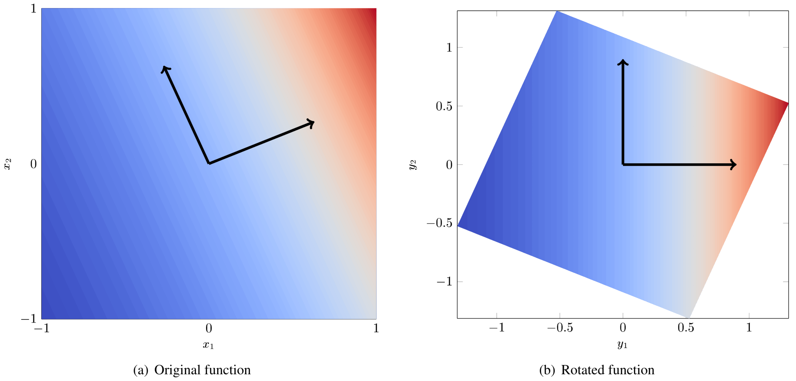

.. _`Chap:DimRed`:

Dimension Reduction Strategies
==============================

In this section dimension reduction strategies are introduced. All
dimension reduction strategies are based on the idea of finding the
important directions in the original input space in order to approximate
the response on a lower dimensional space. Once a lower dimensional
space is identified, several UQ strategies can be deployed on it making
the UQ studies less computational expensive.

In the following two approaches are introduced, namely the Active
Subspace method :cite:p:`constantine2015active` and the Basis
Adaptation :cite:p:`Tip14`.

.. _`Chap:ActSub`:

Active Subspace Models
----------------------

The idea behind active subspaces is to find directions in the input
variable space in which the quantity of interest is nearly constant.
After rotation of the input variables, this method can allow significant
dimension reduction. Below is a brief summary of the process.

#. Compute the gradient of the quantity of interest,
   :math:`q = f(\mathbf{x})`, at several locations sampled from the full
   input space,

   .. math:: \nabla_{\mathbf{x}} f_i = \nabla f(\mathbf{x}_i).

#. Compute the eigendecomposition of the matrix
   :math:`\hat{\mathbf{C}}`,

   .. math:: \hat{\mathbf{C}} = \frac{1}{M}\sum_{i=1}^{M}\nabla_{\mathbf{x}} f_i\nabla_{\mathbf{x}} f_i^T = \hat{\mathbf{W}}\hat{\mathbf{\Lambda}}\hat{\mathbf{W}}^T,

   where :math:`\hat{\mathbf{W}}` has eigenvectors as columns,
   :math:`\hat{\mathbf{\Lambda}} = \text{diag}(\hat{\lambda}_1,\:\ldots\:,\hat{\lambda}_N)`
   contains eigenvalues, and :math:`N` is the total number of
   parameters.

#. Using a truncation method or specifying a dimension to estimate the
   active subspace size, split the eigenvectors into active and inactive
   directions,

   .. math:: \hat{\mathbf{W}} = \left[\hat{\mathbf{W}}_1\quad\hat{\mathbf{W}}_2\right].

   These eigenvectors are used to rotate the input variables.

#. Next the input variables, :math:`\mathbf{x}`, are expanded in terms
   of active and inactive variables,

   .. math:: \mathbf{x} = \hat{\mathbf{W}}_1\mathbf{y} + \hat{\mathbf{W}}_2\mathbf{z}.

#. A surrogate is then built as a function of the active variables,

   .. math:: g(\mathbf{y}) \approx f(\mathbf{x})

As a concrete example, consider the
function: :cite:p:`constantine2015active`

.. math:: f(x) = \exp\left(0.7x_1 + 0.3x_2\right).

Figure :numref:`fig:activesubspace` (a) is a contour
plot of :math:`f(x)`. The black arrows indicate the eigenvectors of the
matrix :math:`\hat{\mathbf{C}}`. Figure
:numref:`fig:activesubspace` (b) is the same function
but rotated so that the axes are aligned with the eigenvectors. We
arbitrarily give these rotated axes the labels :math:`y_1` and
:math:`y_2`. From
fig. :numref:`fig:activesubspace` (b) it is clear
that all of the variation is along :math:`y_1` and the dimension of the
rotated input space can be reduced to 1.

   Example of a 2D function with a 1D active subspace

For additional information, see
references :cite:p:`Constantine-preprint-active,constantine2014active,constantine2015active`.

.. _`Sec:trunc`:

Truncation Methods
~~~~~~~~~~~~~~~~~~

Once the eigenvectors of :math:`\hat{\mathbf{C}}` are obtained we must
decide how many directions to keep. If the exact subspace size is known
*a priori* it can be specified. Otherwise there are three automatic
active subspace detection and truncation methods implemented:

-  Constantine metric (default),

-  Bing Li metric,

-  and Energy metric.

.. _`SubSec:constantine`:

Constantine metric
^^^^^^^^^^^^^^^^^^

The Constantine metric uses a criterion based on the variability of the
subspace estimate. Eigenvectors are computed for bootstrap samples of
the gradient matrix. The subspace size associated with the minimum
distance between bootstrap eigenvectors and the nominal eigenvectors is
the estimated active subspace size.

Below is a brief outline of the Constantine method of active subspace
identification. The first two steps are common to all active subspace
truncation methods.

#. Compute the gradient of the quantity of interest,
   :math:`q = f(\mathbf{x})`, at several locations sampled from the
   input space,

   .. math:: \nabla_{\mathbf{x}} f_i = \nabla f(\mathbf{x}_i).

#. Compute the eigendecomposition of the matrix
   :math:`\hat{\mathbf{C}}`,

   .. math:: \hat{\mathbf{C}} = \frac{1}{M}\sum_{i=1}^{M}\nabla_{\mathbf{x}} f_i\nabla_{\mathbf{x}} f_i^T = \hat{\mathbf{W}}\hat{\mathbf{\Lambda}}\hat{\mathbf{W}}^T,

   where :math:`\hat{\mathbf{W}}` has eigenvectors as columns,
   :math:`\hat{\mathbf{\Lambda}} = \text{diag}(\hat{\lambda}_1,\:\ldots\:,\hat{\lambda}_N)`
   contains eigenvalues, and :math:`N` is the total number of
   parameters.

#. Use bootstrap sampling of the gradients found in step 1 to compute
   replicate eigendecompositions,

   .. math:: \hat{\mathbf{C}}_j^* = \hat{\mathbf{W}}_j^*\hat{\mathbf{\Lambda}}_j^*\left(\hat{\mathbf{W}}_j^*\right)^T.

#. Compute the average distance between nominal and bootstrap subspaces,

   .. math:: e^*_n = \frac{1}{M_{boot}}\sum_j^{M_{boot}} \text{dist}(\text{ran}(\hat{\mathbf{W}}_n),
             \text{ran}(\hat{\mathbf{W}}_{j,n}^*)) = \frac{1}{M_{boot}}\sum_j^{M_{boot}}
             \left\| \hat{\mathbf{W}}_n\hat{\mathbf{W}}_n^T - \hat{\mathbf{W}}_{j,n}^*\left(\hat{\mathbf{W}}_{j,n}^*\right)^T\right\|,

   where :math:`M_{boot}` is the number of bootstrap samples,
   :math:`\hat{\mathbf{W}}_n` and :math:`\hat{\mathbf{W}}_{j,n}^*` both
   contain only the first :math:`n` eigenvectors, and :math:`n < N`.

#. The estimated subspace rank, :math:`r`, is then,

   .. math:: r = \operatorname*{arg\,min}_n \, e^*_n.

For additional information, see
Ref. :cite:p:`constantine2015active`.

.. _`SubSec:bingli`:

Bing Li metric
^^^^^^^^^^^^^^

The Bing Li metric uses a trade-off criterion to determine where to
truncate the active subspace. The criterion is a function of the
eigenvalues and eigenvectors of the active subspace gradient matrix.
This function compares the decrease in eigenvalue amplitude with the
increase in eigenvector variability under bootstrap sampling of the
gradient matrix. The active subspace size is taken to be the index of
the first minimum of this quantity.

Below is a brief outline of the Bing Li method of active subspace
identification. The first two steps are common to all active subspace
truncation methods.

#. Compute the gradient of the quantity of interest,
   :math:`q = f(\mathbf{x})`, at several locations sampled from the
   input space,

   .. math:: \nabla_{\mathbf{x}} f_i = \nabla f(\mathbf{x}_i).

#. Compute the eigendecomposition of the matrix
   :math:`\hat{\mathbf{C}}`,

   .. math:: \hat{\mathbf{C}} = \frac{1}{M}\sum_{i=1}^{M}\nabla_{\mathbf{x}} f_i\nabla_{\mathbf{x}} f_i^T = \hat{\mathbf{W}}\hat{\mathbf{\Lambda}}\hat{\mathbf{W}}^T,

   where :math:`\hat{\mathbf{W}}` has eigenvectors as columns,
   :math:`\hat{\mathbf{\Lambda}} = \text{diag}(\hat{\lambda}_1,\:\ldots\:,\hat{\lambda}_N)`
   contains eigenvalues, and :math:`N` is the total number of
   parameters.

#. Normalize the eigenvalues,

   .. math:: \lambda_i = \frac{\hat{\lambda}_i}{\sum_j^N \hat{\lambda}_j}.

#. Use bootstrap sampling of the gradients found in step 1 to compute
   replicate eigendecompositions,

   .. math:: \hat{\mathbf{C}}_j^* = \hat{\mathbf{W}}_j^*\hat{\mathbf{\Lambda}}_j^*\left(\hat{\mathbf{W}}_j^*\right)^T.

#. Compute variability of eigenvectors,

   .. math:: f_i^0 = \frac{1}{M_{boot}}\sum_j^{M_{boot}}\left\lbrace 1 - \left\vert\text{det}\left(\hat{\mathbf{W}}_i^T\hat{\mathbf{W}}_{j,i}^*\right)\right\vert\right\rbrace ,

   where :math:`\hat{\mathbf{W}}_i` and :math:`\hat{\mathbf{W}}_{j,i}^*`
   both contain only the first :math:`i` eigenvectors and
   :math:`M_{boot}` is the number of bootstrap samples. The value of the
   variability at the first index, :math:`f_1^0`, is defined as zero.

#. Normalize the eigenvector variability,

   .. math:: f_i = \frac{f_i^0}{\sum_j^N f_j^0}.

#. The criterion, :math:`g_i`, is defined as,

   .. math:: g_i = \lambda_i + f_i.

#. The index of first minimum of :math:`g_i` is then the estimated
   active subspace rank.

For additional information, see Ref. :cite:p:`bing-li`.

.. _`SubSec:energy`:

Energy metric
^^^^^^^^^^^^^

The energy metric truncation method uses a criterion based on the
derivative matrix eigenvalue energy. The user can specify the maximum
percentage (as a decimal) of the eigenvalue energy that is not captured
by the active subspace represenation.

Using the eigenvalue energy truncation metric, the subspace size is
determined using the following equation:

.. math:: n = \inf \left\lbrace d \in \mathbb{Z} \quad\middle|\quad 1 \le d \le N \quad \wedge\quad 1 - \frac{\sum_{i = 1}^{d} \lambda_i}{\sum_{i = 1}^{N} \lambda_i} \,<\, \epsilon \right\rbrace

where :math:`\epsilon` is the ``truncation_tolerance``, :math:`n` is the
estimated subspace size, :math:`N` is the size of the full space, and
:math:`\lambda_i` are the eigenvalues of the derivative matrix.

.. _`Chap:BasAdapt`:

Basis Adaptation Models
-----------------------

The idea behind the basis adaptation is similar to the one employed in
the active subspaces that is to find the directions in the input space
where the variations of the QoI are negligible or they can be safely
discarded, *i.e.* without significantly affecting the QoI’s statistics,
according to a truncation criterion. One of the main differences between
the basis adaptation and the active subspaces strategy is that the basis
adaptation approach relies on the construction of a Polynomial Chaos
Expansion (PCE) that is subsequently rotated to decrease the
dimensionality of the problem.

As in the case of PCE, let :math:`\mathcal{H}` be the Hilbert space
formed by the closed linear span of :math:`\boldsymbol{\xi}` and let
:math:`\mathcal{F}(\mathcal{H})` be the :math:`\sigma`-algebra generated
by :math:`\boldsymbol{\xi}`. A generic QoI :math:`Q` can be approximated by the
PCE up to order :math:`p` as

.. math:: Q(\boldsymbol \xi) = \sum_{\boldsymbol{\alpha}\in\mathcal{J}_{d,p}}Q_{\boldsymbol{\alpha}}\psi_{\boldsymbol \alpha}(\boldsymbol \xi)\,,

where
:math:`\boldsymbol{\alpha} = (\alpha_1,...,\alpha_d) \in \mathcal{J}_{d,p}:=(\mathbb{N}_0)^d`
with :math:`|\boldsymbol{\alpha}| = \sum_{i=1}^{d} \alpha_i<= d` is multi-index
of dimension :math:`d` and order up to :math:`p`. In this chapter, for
simplicity of exposure, we assume the expansion with respect to a basis
of (normalized) Hermite polynomials and :math:`\boldsymbol\xi` is assumed to
have standard multivariate Gaussian distribution. The general case of
arbitrary distribution can be handled, at least from a theoretical
standpoint, by resorting to input parameter transformations as the
inverse of cumulative distribution function or other more sophisticated
transformations like the Rosenblatt transformation. The
:math:`P={n+p\choose p}` PCE coefficients can be computed by projecting
:math:`Q` to the space spanned by
:math:`\{\psi_{\boldsymbol \alpha}, \boldsymbol{\alpha} \in \mathcal{J}_{d,p} \}` (or
other methods like Monte Carlo and regression) as

.. math:: Q_{\boldsymbol{\alpha}} = \frac{\langle Q, \psi_{\boldsymbol \alpha} \rangle}{\langle \psi_{\boldsymbol \alpha}^2 \rangle} =\langle Q, \psi_{\boldsymbol \alpha} \rangle,  \quad \boldsymbol{\alpha} \in \mathcal{J}_{d,p}\,.

The basis adaptation method tries to rotate the input Gaussian variables
by an isometry such that the QoI can be well approximated by PCE of the
first several dimensions of the new orthogonal basis. Let :math:`\boldsymbol A`
be an isometry on :math:`\mathbb{R}^{d\times d}` such that
:math:`\boldsymbol{AA^T}=\boldsymbol I`, and :math:`\boldsymbol \eta` be defined as

.. math:: \boldsymbol \eta = \boldsymbol{A\xi}, \qquad \boldsymbol \eta = \begin{Bmatrix} \boldsymbol{\eta}_r\\ \boldsymbol{\eta }_{\neg r}\end{Bmatrix} \,,

It follows that :math:`\boldsymbol{\eta}` also has multivariate Gaussian
distribution. Then the expansion :math:`{Q}^{\boldsymbol A}` in terms of
:math:`\boldsymbol{\eta}` can be obtained as

.. math:: {Q}^{\boldsymbol A}(\boldsymbol{\eta}) = \sum_{\boldsymbol{\beta}\in\mathcal{J}_{d,p}}Q_{\boldsymbol{\beta}}^{\boldsymbol A}\psi_{\boldsymbol \beta}(\boldsymbol \eta) \,.

Since :math:`\{{\psi_{ \boldsymbol{\alpha}}(\boldsymbol{\xi})}\}` and
:math:`\{{\psi_{ \boldsymbol{\beta}}(\boldsymbol{\eta})}\}` span the same space,
:math:`{Q}^{\boldsymbol{A}}(\boldsymbol{\eta}(\boldsymbol{\xi})) \triangleq {Q}(\boldsymbol{\xi})`, and
thus

.. math::

   \label{eq14}
   Q_{\boldsymbol{\alpha}} = \sum_{\boldsymbol{\beta}\in\mathcal{J}_{d,p}}Q_{\boldsymbol{\beta}}^{\boldsymbol A}\langle\psi_{\boldsymbol \beta}^{\boldsymbol A},\psi_{\boldsymbol \alpha}\rangle, \ \boldsymbol{\alpha}\in \mathcal{J}_{d,p}\,.

This latter equation provides foundation to transform PCE from the
original space spanned by :math:`\boldsymbol{\xi}` to the new space spanned by
:math:`\boldsymbol{\eta}`. In the classical Gaussian adaptation, also called
linear adaptation, the rotation matrix :math:`\boldsymbol A` is constructed such
that

.. math::

   \label{eq15}
   \eta_1 = \sum_{\boldsymbol{\alpha}\in\mathcal{J}_{d,1}} Q_{\boldsymbol{\alpha}}\psi_{\boldsymbol \alpha}(\boldsymbol{\xi}) = \sum_{i=1}^{d}Q_{\boldsymbol e_i} \xi_i

where :math:`\boldsymbol e_i` is :math:`d`-dimensional multi-index with 1 at
:math:`i`-th location and zeros elsewhere, *i.e.* the first order PCE
coefficients in the original space are placed in the first row of the
initial construction of :math:`\boldsymbol{A}`. The benefit of this approach is
that the complete Gaussian components of :math:`Q` are contained in the
variable :math:`\eta_1`. Note that the first order PC coefficients also
represent the sensitivities of the input parameters because the
derivative of the first order PCE expansion with respect to each
variable is always equal to its coefficient. Once the first the row of
:math:`\boldsymbol{A}` is defined, the first order PC coefficient with largest
absolute value are placed on each subsequent row of :math:`\boldsymbol{A}` in
the same columns as they appear in the first row of :math:`\boldsymbol{A}`. All
other elements are equal to zero. For instance, if we consider the
following PCE expansion

.. math:: Q(\boldsymbol{\xi}) = \beta_0 + 2 \xi_1 + 5 \xi_2 + 1 \xi_3,

the corresponding :math:`\boldsymbol{A}` would be

.. math::

   \begin{bmatrix}
   2.0 & 5.0 & 1.0 \\
   0.0 & 5.0 & 0.0 \\
   2.0 & 0.0 & 0.0
   \end{bmatrix}.

The procedure described above reflects the relative
importance/sensitivities with respect to the original input parameters.
A Gram-Schmidt procedure is then applied to make :math:`\boldsymbol{A}` an
isometry. The transformed variables has descending importance in the
probabilistic space which is the foundation that we could achieve
accurate representation of QoI by only the first several dimensions.

Suppose the dimension after reduction is :math:`r<d`, we can project
:math:`Q` to the space spanned by Hermite polynomials
:math:`\{ \psi_{ \boldsymbol{\beta} }^{ \boldsymbol{A}_r }, \boldsymbol\beta \in \mathcal{J}_{r,p}\}`,

.. math::

   \label{eq10}
   {Q}^{\boldsymbol{A}_r}(\boldsymbol{\eta}_r)
   = {Q}^{\boldsymbol{A}}\left(\begin{Bmatrix} \boldsymbol{\eta}_r \\ \boldsymbol{0} \end{Bmatrix}\right)
   = \sum_{\boldsymbol{\beta}\in\mathcal{J}_{r,p}} Q_{\boldsymbol{\beta}}^{\boldsymbol{A}_r} \psi_{\boldsymbol{\beta}}(\boldsymbol{\eta}_r)

where :math:`\mathcal{J}_{r,p}\subset\mathcal{J}_{d,p}` is the set of
multi-indices that only have non-zero entries regarding
:math:`\boldsymbol{\eta}_r`; :math:`\boldsymbol{A}_r` are the first :math:`r` rows of
the rotation matrix :math:`\boldsymbol{A}`; and the superscript :math:`\boldsymbol{A}_r`
stresses that the expansion is in terms of :math:`\boldsymbol{\eta}_r`. PC
coefficients of the above expansion are obtained by projecting :math:`Q`
to the space spanned by
:math:`\{\psi_{\boldsymbol{\beta}}^{\boldsymbol{A}_r}, \boldsymbol\beta \in \mathcal{J}_{r,p}\}`

.. math::

   \label{eq11}
   Q_{\boldsymbol{\beta}}^{\boldsymbol{A}_r} = \langle Q, \psi_{ \boldsymbol{\beta}}^{\boldsymbol{A}_r} \rangle\,.

The PC coefficient in :math:`\eta` space can be transformed to
:math:`\xi` space by eq. (`[eq14] <#eq14>`__) as

.. math:: \tilde{Q}_{\boldsymbol{\alpha}} = \sum_{\boldsymbol{\beta}\in\mathcal{J}_{r,p}} Q_{\boldsymbol{\beta}}^{\boldsymbol{A}_r} \langle \psi_{\boldsymbol{\beta}}^{\boldsymbol{A}_r}, \psi_{\boldsymbol \alpha} \rangle\,.

If we define the vectors of the PCE coefficients
:math:`\tilde{\boldsymbol{Q}}_{coeff} := \{\tilde{Q}_{\boldsymbol{\alpha}},\, \boldsymbol{\alpha}\in\mathcal{J}_{d,p}\}`
and
:math:`\boldsymbol{Q}_{coeff} := \{Q_{\boldsymbol{\alpha}},\, \boldsymbol{\alpha}\in\mathcal{J}_{d,p}\}`,
the relative 2-norm error of PCE in :math:`\xi` space can be measured by

.. math::

   \label{eq19}
   \boldsymbol{\epsilon}_D = \frac{\left\| \boldsymbol{Q}_{coeff} - \tilde{\boldsymbol{Q}}_{coeff} \right\|_2} {\left\| \boldsymbol{Q}_{coeff} \right\|_2} \,.

Note that although (`[eq19] <#eq19>`__) provides a way to compare the
:math:`r`-d adaptation with the full dimensional PCE, in practical, it
is more convenient to compare two adaptations with successive
dimensions, say, :math:`r`-d and :math:`(r+1)`-d, to check the
convergence. The accuracy of basis adaptation increases with increase of
:math:`r` and will recover full dimensional expansion with :math:`r=d`.

In order to obtain a truncation of the rotation matrix, which is both
efficient and based entirely on the pilot samples, the current Dakota
implementation relies on the sample average of the weighted 2-norm of
the difference between the physical coordinates of the pilot samples,
:math:`\xi^{(i)}`, and their approximation after the mapping through the
reduced rotation matrix,
:math:`\tilde{\xi}^{(i)} = \boldsymbol{A}_r^{\mathrm{T}} \boldsymbol{\eta}_r^{(i)} = \boldsymbol{A}_r^{\mathrm{T}} \boldsymbol{A}_r \xi^{(i)}`:

.. math:: \varpi = \frac{1}{N_p} \sum_{i=1}^{N_p} \parallel \boldsymbol{w} \odot \tilde{\boldsymbol{\xi}}^{(i)} - \boldsymbol{w} \odot {\boldsymbol{\xi}}^{(i)} \parallel_2.

The weights :math:`\boldsymbol{w}` in this metrics are the :math:`d` first order
coefficients, obtained after the pilot samples in the original space.
Subsequent approximations for :math:`\tilde{\xi}^{(i)}` are considered
for :math:`r=1,\dots,d` and the final truncation dimension is determined
when the convergence criterion, specified by the user for this metric,
is reached.
