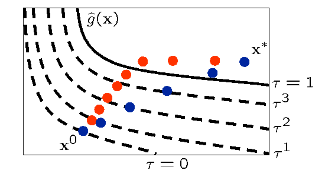

.. _sblm:

Surrogate-Based Local Minimization
==================================

A generally-constrained nonlinear programming problem takes the form

.. math::
   :label: eq:NLP_standard

   {\rm minimize\ } \hfil & f({\bf x}) \nonumber \\
   {\rm subject\ to\ } & {\bf g}_l \le {\bf g}({\bf x}) \le {\bf g}_u \nonumber \\
               &               {\bf h}({\bf x}) = {\bf h}_t \nonumber \\
               & {\bf x}_l \le {\bf x} \le {\bf x}_u

where :math:`{\bf x} \in \Re^n` is the vector of design variables, and
:math:`f`, :math:`{\bf g}`, and :math:`{\bf h}` are the objective
function, nonlinear inequality constraints, and nonlinear equality
constraints, respectively (Any linear constraints are not approximated
and may be added without modification to all formulations). Individual nonlinear inequality and
equality constraints are enumerated using :math:`i` and :math:`j`,
respectively (e.g., :math:`g_i` and :math:`h_j`). The corresponding
surrogate-based optimization (SBO) algorithm may be formulated in
several ways and applied to either optimization or least-squares
calibration problems. In all cases, SBO solves a sequence of :math:`k`
approximate optimization subproblems subject to a trust region
constraint :math:`\Delta^k`; however, many different forms of the
surrogate objectives and constraints in the approximate subproblem can
be explored. In particular, the subproblem objective may be a surrogate
of the original objective or a surrogate of a merit function (most
commonly, the Lagrangian or augmented Lagrangian), and the subproblem
constraints may be surrogates of the original constraints, linearized
approximations of the surrogate constraints, or may be omitted entirely.
Each of these combinations is shown in :numref:`tab:sbo_subprob`,
where some combinations are marked *inappropriate*, others *acceptable*,
and the remaining are common.

.. table:: SBO approximate subproblem formulations.
   :name: tab:sbo_subprob

   +------------------------+--------------------+--------------+----------------------+
   |                        | Original Objective | Lagrangian   | Augmented Lagrangian |
   +========================+====================+==============+======================+
   | No constraints         | *inappropriate*    | *acceptable* | TRAL                 |
   +------------------------+--------------------+--------------+----------------------+
   | Linearized constraints |  *acceptable*      | SQP-like     |  *acceptable*        |
   +------------------------+--------------------+--------------+----------------------+
   | Original constraints   | Direct surrogate   | *acceptable* | IPTRSAO              |
   +------------------------+--------------------+--------------+----------------------+

Initial approaches to nonlinearly-constrained SBO optimized an
approximate merit function which incorporated the nonlinear
constraints :cite:p:`Rod98,Ale00`:

.. math::
   :label: eq:NLP_SBO_TRAL

   {\rm minimize\ } & {\hat \Phi}^k({\bf x}) \nonumber \\
   {\rm subject\  to\ } 
       & {\parallel {\bf x} - {\bf x}^k_c \parallel}_\infty \le \Delta^k

where the surrogate merit function is denoted as
:math:`\hat \Phi({\bf x})`, :math:`{\bf x}_c` is the center point of the
trust region, and the trust region is truncated at the global variable
bounds as needed. The merit function to approximate was typically chosen
to be a standard implementation :cite:p:`Van84,Noc99,Gil81` of
the augmented Lagrangian merit function (see Eqs. :math:numref:`eq:aug_lag_merit`
and :math:numref:`eq:aug_lang_psi`), where the surrogate augmented Lagrangian 
is constructed from individual
surrogate models of the objective and constraints (approximate and
assemble, rather than assemble and approximate). In
:numref:`tab:sbo_subprob`, this corresponds to row 1, column 3,
and is known as the trust-region augmented Lagrangian (TRAL) approach.
While this approach was provably convergent, convergence rates to
constrained minima have been observed to be slowed by the required
updating of Lagrange multipliers and penalty
parameters :cite:p:`Per04a`. Prior to converging these
parameters, SBO iterates did not strictly respect constraint boundaries
and were often infeasible. A subsequent approach
(IPTRSAO :cite:p:`Per04a`) that sought to directly address
this shortcoming added explicit surrogate constraints (row 3, column 3
in :numref:`tab:sbo_subprob`):

.. math::
   :label: eq:NLP_SBO_TRAL2

   {\rm minimize\ } & {\hat \Phi}^k({\bf x}) \nonumber \\
   {\rm subject\  to\ } 
       & {\bf g}_l \le {\bf {\hat g}}^k({\bf x}) \le {\bf g}_u \nonumber \\
       &               {\bf {\hat h}}^k({\bf x}) = {\bf h}_t \nonumber \\
       & {\parallel {\bf x} - {\bf x}^k_c \parallel}_\infty \le \Delta^k \; . 

While this approach does address infeasible iterates, it still shares
the feature that the surrogate merit function may reflect inaccurate
relative weightings of the objective and constraints prior to
convergence of the Lagrange multipliers and penalty parameters. That is,
one may benefit from more feasible intermediate iterates, but the
process may still be slow to converge to optimality. The concept of this
approach is similar to that of SQP-like SBO
approaches :cite:p:`Ale00` which use linearized constraints:

.. math::
   :label: eq:NLP_SBO_SQP

   {\rm minimize\ } & {\hat \Phi}^k({\bf x}) \nonumber \\
   {\rm subject\  to\ } 
   & {\bf g}_l \le {\bf {\hat g}}^k({\bf x}^k_c) + 
   \nabla {\bf {\hat g}}^k({\bf x}^k_c)^T ({\bf x} - {\bf x}^k_c) \le {\bf g}_u 
   \nonumber \\
   & {\bf {\hat h}}^k({\bf x}^k_c) + \nabla {\bf {\hat h}}^k({\bf x}^k_c)^T 
   ({\bf x} - {\bf x}^k_c) = {\bf h}_t \nonumber \\
   & {\parallel {\bf x} - {\bf x}^k_c \parallel}_\infty \le \Delta^k \; . 

in that the primary concern is minimizing a composite merit function of
the objective and constraints, but under the restriction that the
original problem constraints may not be wildly violated prior to
convergence of Lagrange multiplier estimates. Here, the merit function
selection of the Lagrangian function (row 2, column 2 in
:numref:`tab:sbo_subprob` see also
Eq. :math:numref:`eq:lag_merit`) is most closely related to SQP,
which includes the use of first-order Lagrange multiplier updates
(Eq. :math:numref:`eq:lls_lambda>`) that should converge more
rapidly near a constrained minimizer than the zeroth-order updates
(Eqs. :math:numref:`eq:lambda_psi` and :math:numref:`eq:lambda_h`)
used for the augmented Lagrangian.

All of these previous constrained SBO approaches involve a recasting of
the approximate subproblem objective and constraints as a function of
the original objective and constraint surrogates. A more direct approach
is to use a formulation of:

.. math::
   :label: eq:NLP_SBO_direct

   {\rm minimize\ } & {\hat f}^k({\bf x}) \nonumber \\
   {\rm subject\  to\ } 
       & {\bf g}_l \le {\bf {\hat g}}^k({\bf x}) \le {\bf g}_u \nonumber \\
       &               {\bf {\hat h}}^k({\bf x}) = {\bf h}_t \nonumber \\
       & {\parallel {\bf x} - {\bf x}^k_c \parallel}_\infty \le \Delta^k 

This approach has been termed the direct surrogate approach since it
optimizes surrogates of the original objective and constraints (row 3,
column 1 in :numref:`tab:sbo_subprob`) without any recasting. It
is attractive both from its simplicity and potential for improved
performance, and is the default approach taken in Dakota. Other Dakota
defaults include the use of a filter method for :ref:`iterate acceptance <sbm:sblm_con_iter>`,
an augmented Lagrangian merit :ref:`merit function <sbm:sblm_con_merit>`),
Lagrangian :ref:`hard convergence assessment <sbm:sblm_con_hard>`), and
:ref:`no constraint relaxation <sbm:sblm_con_relax>`.

..
   TODO: It is attractive both from its simplicity and potential for
   improved performance, assuming that all of the trust region
   updating machinery can be rendered compatible with the lack of an
   explicitly-optimized merit function.  and is the default approach
   taken in Dakota.

While the formulation of Eq. :math:numref:`eq:NLP_SBO_TRAL`
(and others from row 1 in :numref:`tab:sbo_subprob`) can suffer
from infeasible intermediate iterates and slow convergence to
constrained minima, each of the approximate subproblem formulations with
explicit constraints
(Eqs. :math:numref:`eq:NLP_SBO_TRAL2`, :math:numref:`eq:NLP_SBO_SQP`, and
:math:numref:`eq:NLP_SBO_direct`,
and others from rows 2-3 in :numref:`tab:sbo_subprob`) can suffer
from the lack of a feasible solution within the current trust region.
Techniques for dealing with this latter challenge involve some form of
constraint relaxation. Homotopy
approaches :cite:p:`Per04a,Per04b` or composite step
approaches such as Byrd-Omojokun :cite:p:`Omo89`,
Celis-Dennis-Tapia :cite:p:`Cel85`, or
MAESTRO :cite:p:`Ale00` may be used for this purpose (see
:ref:`Constraint relaxation <sbm:sblm_con_relax>`).

After each of the :math:`k` iterations in the SBO method, the predicted
step is validated by computing :math:`f({\bf x}^k_\ast)`,
:math:`{\bf g}({\bf x}^k_\ast)`, and :math:`{\bf h}({\bf x}^k_\ast)`.
One approach forms the trust region ratio :math:`\rho^k` which measures
the ratio of the actual improvement to the improvement predicted by
optimization on the surrogate model. When optimizing on an approximate
merit function
(Eqs. :math:numref:`eq:NLP_SBO_TRAL`, :math:numref:`eq:NLP_SBO_TRAL2`, and
:math:numref:`eq:NLP_SBO_SQP`),
the following ratio is natural to compute

.. math::
   :label: eq:rho_phi_k

   \rho^k = \frac{     \Phi({\bf x}^k_c)      - \Phi({\bf x}^k_\ast)}
             {\hat \Phi({\bf x}^k_c) - \hat \Phi({\bf x}^k_\ast)} \; .

The formulation in Eq. :math:numref:`eq:NLP_SBO_direct` may
also form a merit function for computing the trust region ratio;
however, the omission of this merit function from explicit use in the
approximate optimization cycles can lead to synchronization problems
with the optimizer.

..
   TODO: In this case, penalty-free and multiplier-free trust region
   ratios (see Section~\ref{sbm:sblm_con_merit}) become attractive.

Once computed, the value for :math:`\rho^k` can be used to define the
step acceptance and the next trust region size :math:`\Delta^{k+1}`
using logic similar to that shown in :numref:`tab:rho_k`. Typical
factors for shrinking and expanding are 0.5 and 2.0, respectively, but
these as well as the threshold ratio values are tunable parameters in
the algorithm (see Surrogate-Based Method controls in the
:ref:`keyword reference area <keyword-reference-area>`
In addition, the use of
discrete thresholds is not required, and continuous relationships using
adaptive logic can also be explored :cite:p:`Wuj98a,Wuj98b`.
Iterate acceptance or rejection completes an SBO cycle, and the cycles
are continued until either soft or 
:ref:`hard convergence criteria <sbm:sblm_con_hard>` are satisfied.

.. table:: Sample trust region ratio logic.
   :name: tab:rho_k

   +----------------+----------------+----------------+----------------+
   | Ratio Value    | Surrogate      | Iterate        | Trust Region   |
   |                | Accuracy       | Acceptance     | Sizing         |
   +================+================+================+================+
   | :math:`\rho^k  | poor           | reject step    | shrink         |
   | \le 0`         |                |                |                |
   +----------------+----------------+----------------+----------------+
   | :math:`0 < \r  | marginal       | accept step    | shrink         |
   | ho^k \le 0.25` |                |                |                |
   +----------------+----------------+----------------+----------------+
   | :math:`0.25 <  | moderate       | accept step    | retain         |
   | \rho^k < 0.75` |                |                |                |
   | or             |                |                |                |
   | :math:`        |                |                |                |
   | \rho^k > 1.25` |                |                |                |
   +----------------+----------------+----------------+----------------+
   | :mat           | good           | accept step    | expand         |
   | h:`0.75 \le \r |                |                |                |
   | ho^k \le 1.25` |                |                |                |
   +----------------+----------------+----------------+----------------+

.. _`sbm:sblm_con_iter`:

Iterate acceptance logic
------------------------

TODO: Figure, image, and reference/caption.

.. container:: wrapfigure

   r.3 |image|

When a surrogate optimization is completed and the approximate solution
has been validated, then the decision must be made to either accept or
reject the step. The traditional approach is to base this decision on
the value of the trust region ratio, as outlined previously in
Table `1.2 <#tab:rho_k>`__. An alternate approach is to utilize a filter
method :cite:p:`Fle02`, which does not require penalty
parameters or Lagrange multiplier estimates. The basic idea in a filter
method is to apply the concept of Pareto optimality to the objective
function and constraint violations and only accept an iterate if it is
not dominated by any previous iterate. Mathematically, a new iterate is
not dominated if at least one of the following:

.. math::

   {\rm either~~~} f < f^{(i)} {\rm ~~~or~~~} c < c^{(i)}
   %  if (new_f >= filt_f && new_g >= filt_g)
   %    return false;            // new point is dominated: reject iterate
   %  else if (new_f < filt_f && new_g < filt_g)
   %    rm_list.insert(filt_it); // old pt dominated by new: queue for removal

is true for all :math:`i` in the filter, where :math:`c` is a selected
norm of the constraint violation. This basic description can be
augmented with mild requirements to prevent point accumulation and
assure convergence, known as a slanting
filter :cite:p:`Fle02`. Figure `[fig:filter] <#fig:filter>`__
illustrates the filter concept, where objective values are plotted
against constraint violation for accepted iterates (blue circles) to
define the dominated region (denoted by the gray lines). A filter method
relaxes the common enforcement of monotonicity in constraint violation
reduction and, by allowing more flexibility in acceptable step
generation, often allows the algorithm to be more efficient.

.. 
   TODO: Note: filter method idea could allow even more flexibility
   with elimination of the reduction of individual constraint
   violations into a single norm.  That is, the Pareto concept could
   be extended to N_con + 1 dimensions.  However, without another
   mechanism to enforce violation reduction, the algorithm could
   easily generate steps that are acceptable to the filter but which
   diverge in constraint violation.

The use of a filter method is compatible with any of the SBO
formulations in
Eqs. `[eq:NLP_SBO_TRAL] <#eq:NLP_SBO_TRAL>`__–`[eq:NLP_SBO_direct] <#eq:NLP_SBO_direct>`__.

..
   TODO: ; however, it is particularly attractive for the latter since the only
   remaining purpose for a merit function is for managing trust region
   expansion/retention/contraction when the filter accepts a step.
   If alternate logic can be developed
   for that portion, then the entire SBO algorithm can become penalty and
   multiplier free.  In~\cite{Fle02}, for example, trust
   region updates are less structured than in Table~\ref{tab:rho_k} and
   only basic logic is provided (no $\rho^k$ is used).

.. _`sbm:sblm_con_merit`:

Merit functions
---------------

..
   TODO: Merit functions are used in the trust region ratio
   calculations for sizing subsequent trust regions.  They may also be
   used for the surrogate objective function as described
   in~\cite{Rod98,Ale00,Per04b}, which has the advantage of better
   synchronizing the trust region ratios with the approximate
   optimization steps, but which has the disadvantage that it can slow
   convergence.

The merit function :math:`\Phi({\bf x})` used in
Eqs. `[eq:NLP_SBO_TRAL] <#eq:NLP_SBO_TRAL>`__-`[eq:NLP_SBO_SQP] <#eq:NLP_SBO_SQP>`__,\ `[eq:rho_phi_k] <#eq:rho_phi_k>`__
may be selected to be a penalty function, an adaptive penalty function,
a Lagrangian function, or an augmented Lagrangian function. In each of
these cases, the more flexible inequality and equality constraint
formulations with two-sided bounds and targets
(Eqs. `[eq:NLP_standard] <#eq:NLP_standard>`__,\ `[eq:NLP_SBO_TRAL2] <#eq:NLP_SBO_TRAL2>`__-`[eq:NLP_SBO_direct] <#eq:NLP_SBO_direct>`__),
have been converted to a standard form of :math:`{\bf g}({\bf x}) \le 0`
and :math:`{\bf h}({\bf x}) = 0` (in
Eqs. `[eq:penalty_merit] <#eq:penalty_merit>`__,\ `[eq:lag_merit] <#eq:lag_merit>`__-`[eq:lls_lambda] <#eq:lls_lambda>`__).
The active set of inequality constraints is denoted as
:math:`{\bf g}^+`.

The penalty function employed in this paper uses a quadratic penalty
with the penalty schedule linked to SBO iteration number

.. math::
   :label: eq:exp_rp

   \Phi({\bf x}, r_p) & = & f({\bf x})
   %+ \sum_{i=1}^{n_g} r_p (g_i^+({\bf x}))^2
   %+ \sum_{i=1}^{n_h} r_p (h_i^+({\bf x}))^2
   + r_p {\bf g}^+({\bf x})^T {\bf g}^+({\bf x})
   + r_p {\bf h}({\bf x})^T {\bf h}({\bf x}) \label{eq:penalty_merit} \\
   r_p & = & e^{(k + {\rm offset})/10} % static offset = 21 gives r_p ~ 8 for k = 0

The adaptive penalty function is identical in form to
Eq. `[eq:penalty_merit] <#eq:penalty_merit>`__, but adapts :math:`r_p`
using monotonic increases in the iteration offset value in order to
accept any iterate that reduces the constraint violation.

The Lagrangian merit function is

.. math::
   :label: eq:lag_merit

   \Phi({\bf x}, \mbox{\boldmath $\lambda$}_g, \mbox{\boldmath
   $\lambda$}_h) = f({\bf x})
   %+ \sum_{i=1}^{n_g} (\lambda_i g_i({\bf x})
   %+ \sum_{i=1}^{n_h} (\lambda_i h_i({\bf x})
   + \mbox{\boldmath $\lambda$}_g^T {\bf g}^+({\bf x})
   + \mbox{\boldmath $\lambda$}_h^T {\bf h}({\bf x}) 

for which the Lagrange multiplier estimation is discussed in
Section `1.3 <#sbm:sblm_con_hard>`__. Away from the optimum, it is
possible for the least squares estimates of the Lagrange multipliers for
active constraints to be zero, which equates to omitting the
contribution of an active constraint from the merit function. This is
undesirable for tracking SBO progress, so usage of the Lagrangian merit
function is normally restricted to approximate subproblems and hard
convergence assessments.

The augmented Lagrangian employed in this paper follows the sign
conventions described in :cite:p:`Van84`

.. math::
   :label: eq:aug_lag_merit

   \Phi({\bf x}, \mbox{\boldmath $\lambda$}_{\psi}, \mbox{\boldmath
   $\lambda$}_h, r_p) & = & f({\bf x})
   %+ \sum_{i=1}^{n_g} (\lambda_i g_i({\bf x}) + r_p (g_i^+({\bf x}))^2)
   %+ \sum_{i=1}^{n_h} (\lambda_i h_i({\bf x}) + r_p (h_i^+({\bf x}))^2)
   + \mbox{\boldmath $\lambda$}_{\psi}^T \mbox{\boldmath $\psi$}({\bf x})
   + r_p \mbox{\boldmath $\psi$}({\bf x})^T \mbox{\boldmath $\psi$}({\bf x})
   + \mbox{\boldmath $\lambda$}_h^T {\bf h}({\bf x})
   + r_p {\bf h}({\bf x})^T {\bf h}({\bf x}) 

.. math::
   :label: eq:aug_lang_psi

   \psi_i & = & \max\left\{g_i, -\frac{\lambda_{\psi_i}}{2r_p}\right\}

where :math:`\psi`\ (**x**) is derived from the elimination of slack
variables for the inequality constraints. In this case, simple
zeroth-order Lagrange multiplier updates may be used:

.. math::
   :label: eq:lambda_psi

   \mbox{\boldmath $\lambda$}_{\psi}^{k+1} & = & \mbox{\boldmath
   $\lambda$}_{\psi}^k + 2r_p\mbox{\boldmath $\psi$}({\bf x})

.. math::
   :label: eq:lambda_h 

   \mbox{\boldmath $\lambda$}_h^{k+1} & = & \mbox{\boldmath $\lambda$}_h^k 
   + 2 r_p {\bf h}({\bf x})

The updating of multipliers and penalties is carefully
orchestrated :cite:p:`Con00` to drive reduction in constraint
violation of the iterates. The penalty updates can be more conservative
than in Eq. `[eq:exp_rp] <#eq:exp_rp>`__, often using an infrequent
application of a constant multiplier rather than a fixed exponential
progression.

..
   TODO: As mentioned previously, a goal for the formulation in
   Eq.~\ref{eq:NLP_SBO_direct} is to employ a penalty and multiplier
   free approach for the merit function and/or trust region logic.  A
   Lagrangian merit function is penalty free and a penalty merit
   function is multiplier free, but no merit functions to this point
   are both.  One concept~\cite{Giu00} is to bypass the need for a
   merit function by forming a set of trust region ratios, one for
   each surrogate function (${\hat f}$, ${\hat g}_i$, and ${\hat
   h}_j$).  In this case, a single ratio could be determined from the
   minimum (or average, norm, etc.) of the set, ----- The weakness of
   this approach is one of scaling near optimality/balancing
   optimality and feasibility: when constraint values are near zero,
   the feasibility trust region ratios are less important than the
   optimality trust region ratios.  This is naturally captured in
   merit function approaches.  ----- or a composite step approach
   could be used with different trust region sizes for the constraint
   reduction and objective reduction subproblems~\cite{Ale00}.
   Another concept is to utilize a merit function derived from the
   filter concept using, for example, metrics of filter area swept out
   by accepted iterates.  This concept will be investigated further in
   future work.  Initial concepts for swept filter area have issues
   with potential unboundedness, but will be investigated further in
   future work.

.. _`sbm:sblm_con_hard`:

Convergence assessment
----------------------

To terminate the SBO process, hard and soft convergence metrics are
monitored. It is preferable for SBO studies to satisfy hard convergence
metrics, but this is not always practical (e.g., when gradients are
unavailable or unreliable). Therefore, simple soft convergence criteria
are also employed which monitor for diminishing returns (relative
improvement in the merit function less than a tolerance for some number
of consecutive iterations).

..
   TODO Note: soft convergence is not discussed in \cite{Giu00} (and
   can't be cited)

To assess hard convergence, one calculates the norm of the projected
gradient of a merit function whenever the feasibility tolerance is
satisfied. The best merit function for this purpose is the Lagrangian
merit function from Eq. `[eq:lag_merit] <#eq:lag_merit>`__. This
requires a least squares estimation for the Lagrange multipliers that
best minimize the projected gradient:

.. math::
   :label: eq:lag_merit_grad

   \nabla_x \Phi({\bf x}, \mbox{\boldmath $\lambda$}_g, \mbox{\boldmath
   $\lambda$}_h) = \nabla_x f({\bf x})
   %+ \sum_{i=1}^{n_g} (\lambda_i g_i({\bf x})
   %+ \sum_{i=1}^{n_h} (\lambda_i h_i({\bf x})
   + \mbox{\boldmath $\lambda$}_g^T \nabla_x {\bf g}^+({\bf x}) +
   \mbox{\boldmath $\lambda$}_h^T \nabla_x {\bf h}({\bf x})

where gradient portions directed into active global variable bounds have
been removed. This can be posed as a linear least squares problem for
the multipliers:

.. math::
  :label: eq:lls_lambda

  {\bf A} \mbox{\boldmath $\lambda$} = -\nabla_x f 

where :math:`{\bf A}` is the matrix of active constraint gradients,
:math:`\mbox{\boldmath $\lambda$}_g` is constrained to be non-negative,
and :math:`\mbox{\boldmath $\lambda$}_h` is unrestricted in sign. To
estimate the multipliers using non-negative and bound-constrained linear
least squares, the NNLS and BVLS routines :cite:p:`Law74` from
NETLIB are used, respectively.

.. _`sbm:sblm_con_relax`:

Constraint relaxation
---------------------

.. 
   TODO: trConstraintRelax may be COMPOSITE\_STEP or HOMOTOPY.  

The goal of constraint relaxation is to achieve efficiency through the
balance of feasibility and optimality when the trust region restrictions
prevent the location of feasible solutions to constrained approximate
subproblems
(Eqs. `[eq:NLP_SBO_TRAL2] <#eq:NLP_SBO_TRAL2>`__-`[eq:NLP_SBO_direct] <#eq:NLP_SBO_direct>`__,
and other formulations from rows 2-3 in
Table `1.1 <#tab:sbo_subprob>`__). The SBO algorithm starting from
infeasible points will commonly generate iterates which seek to satisfy
feasibility conditions without regard to objective
reduction :cite:p:`Per04b`.

One approach for achieving this balance is to use *relaxed constraints*
when iterates are infeasible with respect to the surrogate constraints.
We follow Perez, Renaud, and Watson :cite:p:`Per04a`, and use
a *global homotopy* mapping the relaxed constraints and the surrogate
constraints. For formulations in
Eqs. `[eq:NLP_SBO_TRAL2] <#eq:NLP_SBO_TRAL2>`__
and `[eq:NLP_SBO_direct] <#eq:NLP_SBO_direct>`__ (and others from row 3
in Table `1.1 <#tab:sbo_subprob>`__), the relaxed constraints are
defined from

.. math::
   :label: eq:relaxed_eq

   {\bf {\tilde g}}^k({\bf x}, \tau) &=& {\bf {\hat g}}^k({\bf x}) + 
   (1-\tau){\bf b}_{g} \label{eq:relaxed_ineq}\\
   {\bf {\tilde h}}^k({\bf x}, \tau) &=& {\bf {\hat h}}^k({\bf x}) + 
   (1-\tau){\bf b}_{h} 

For Eq. `[eq:NLP_SBO_SQP] <#eq:NLP_SBO_SQP>`__ (and others from row 2 in
Table `1.1 <#tab:sbo_subprob>`__), the original surrogate constraints
:math:`{\bf {\hat g}}^k({\bf x})` and :math:`{\bf {\hat h}}^k({\bf x})`
in
Eqs. `[eq:relaxed_ineq] <#eq:relaxed_ineq>`__-`[eq:relaxed_eq] <#eq:relaxed_eq>`__
are replaced with their linearized forms
(:math:`{\bf {\hat g}}^k({\bf x}^k_c) + 
\nabla {\bf {\hat g}}^k({\bf x}^k_c)^T ({\bf x} - {\bf x}^k_c)` and
:math:`{\bf {\hat h}}^k({\bf x}^k_c) + \nabla {\bf {\hat h}}^k({\bf x}^k_c)^T 
({\bf x} - {\bf x}^k_c)`, respectively). The approximate subproblem is
then reposed using the relaxed constraints as

.. math::
   :label: eq:NLP_relaxed

   {\rm minimize\ } & {\hat f^k}({\bf x})~~{\rm or}~~{\hat \Phi}^k({\bf x})
   \nonumber \\
   {\rm subject\  to\ } 
     & {\bf g}_l \le {\bf {\tilde g}}^k({\bf x},\tau^k) \le {\bf g}_u \nonumber \\
     &               {\bf {\tilde h}}^k({\bf x},\tau^k) = {\bf h}_t \nonumber \\
     & {\parallel {\bf x} - {\bf x}^k_c \parallel}_\infty \le \Delta^k
   % & {\bf x}_l \le {\bf x} \le {\bf x}_u \nonumber\\
   %  & 0 \le \tau \le 1 

in place of the corresponding subproblems in
Eqs. `[eq:NLP_SBO_TRAL2] <#eq:NLP_SBO_TRAL2>`__-`[eq:NLP_SBO_direct] <#eq:NLP_SBO_direct>`__.
Alternatively, since the relaxation terms are constants for the
:math:`k^{th}` iteration, it may be more convenient for the
implementation to constrain :math:`{\bf {\hat g}}^k({\bf x})` and
:math:`{\bf {\hat h}}^k({\bf x})` (or their linearized forms) subject to
relaxed bounds and targets (:math:`{\bf {\tilde g}}_l^k`,
:math:`{\bf {\tilde g}}_u^k`, :math:`{\bf {\tilde h}}_t^k`). The
parameter :math:`\tau` is the homotopy parameter controlling the extent
of the relaxation: when :math:`\tau=0`, the constraints are fully
relaxed, and when :math:`\tau=1`, the surrogate constraints are
recovered. The vectors :math:`{\bf b}_{g}, {\bf b}_{h}` are chosen so
that the starting point, :math:`{\bf x}^0`, is feasible with respect to
the fully relaxed constraints:

..
   TODO: NOTE: these _could_ need updating in the case of global data fits

.. math::

   &{\bf g}_l \le {\bf {\tilde g}}^0({\bf x}^0, 0) \le {\bf g}_u \\
   &{\bf {\tilde h}}^0({\bf x}^0, 0) =  {\bf h}_t

At the start of the SBO algorithm, :math:`\tau^0=0` if :math:`{\bf x}^0`
is infeasible with respect to the unrelaxed surrogate constraints;
otherwise :math:`\tau^0=1` (i.e., no constraint relaxation is used). At
the start of the :math:`k^{th}` SBO iteration where
:math:`\tau^{k-1} < 1`, :math:`\tau^k` is determined by solving the
subproblem

.. math::
   :label: eq:tau_max

   {\rm maximize } & \tau^k \nonumber \\
   {\rm subject\  to } 
     & {\bf g}_l \le {\bf {\tilde g}}^k({\bf x},\tau^k) \le {\bf g}_u \nonumber \\
     &               {\bf {\tilde h}}^k({\bf x},\tau^k) = {\bf h}_t \nonumber \\
     & {\parallel {\bf x} - {\bf x}^k_c \parallel}_\infty \le \Delta^k \nonumber\\
   % & {\bf x}_l \le {\bf x} \le {\bf x}_u \nonumber\\
     & \tau^k \ge 0

starting at :math:`({\bf x}^{k-1}_*, \tau^{k-1})`, and then adjusted as
follows:

.. math::

   \tau^k = \min\left\{1,\tau^{k-1} + \alpha
   \left(\tau^{k}_{\max}-\tau^{k-1}\right)\right\}

The adjustment parameter :math:`0 < \alpha < 1` is chosen so that that
the feasible region with respect to the relaxed constraints has positive
volume within the trust region. Determining the optimal value for
:math:`\alpha` remains an open question and will be explored in future
work.

..
   TODO: Note: could just use $\tau^k$ in previous equations above

After :math:`\tau^k` is determined using this procedure, the problem in
Eq. `[eq:NLP_relaxed] <#eq:NLP_relaxed>`__ is solved for
:math:`{\bf x}^k_\ast`. If the step is accepted, then the value of
:math:`\tau^k` is updated using the current iterate
:math:`{\bf x}^k_\ast` and the validated constraints
:math:`{\bf g}({\bf x}^k_\ast)` and :math:`{\bf h}({\bf x}^k_\ast)`:

.. math::

   \tau^{k} & = \min\left\{1,\min_i \tau_i , \min_j \tau_j \right\} \\
   \rm{where}~~
   \tau_i & = 1 + \frac{\min \left\{g_i({\bf x}^k_\ast) - g_{l_{i}}, 
   g_{u_{i}} - g_i({\bf x}^k_\ast)\right\}}{b_{g_{i}}} \\ 
   \tau_j & = 1 - \frac{| h_j({\bf x}^k_\ast) - h_{t_{j}} |}{b_{h_{j}}}

..
   TODO: 
   \begin{align}
   \tau^{k} & = \min\left\{1,\min_i \tau_i , \min_j \tau_j \right\} \; ,\\
   \intertext{where}
   \tau_i & = \frac{\min \left\{\hat g_i({\bf x}^k) - ({\bf g}_l)_i, 
   ({\bf g}_u)_i - \hat g_i({\bf x}^k)\right\}}{b_i^{g}} + 1\\ 
   \tau_j & = \frac{- | \hat h_j({\bf x}^k) - ({\bf h}_t)_j |}{b_j^{h}} + 1 \; .
   \end{align}

TODO: Figure, image, and reference/caption.

.. container:: wrapfigure

   r.35 |image1|

Figure `[fig:constr_relax] <#fig:constr_relax>`__ illustrates the SBO
algorithm on a two-dimensional problem with one inequality constraint
starting from an infeasible point, :math:`{\bf x}^0`. The minimizer of
the problem is denoted as :math:`{\bf x}^*`. Iterates generated using
the surrogate constraints are shown in red, where feasibility is
achieved first, and then progress is made toward the optimal point. The
iterates generated using the relaxed constraints are shown in blue,
where a balance of satisfying feasibility and optimality has been
achieved, leading to fewer overall SBO iterations.

..
   TODO:
   \begin{figure}[ht!]
   \epsfxsize 3in \centerline{\epsfbox{tau_updates.eps}}
   \caption{Example SBO iterates using surrogate (red) and relaxed (blue)
   constraints.}
   \label{fig:constr_relax}
   \end{figure}

The behavior illustrated in
Fig. `[fig:constr_relax] <#fig:constr_relax>`__ is an example where
using the relaxed constraints over the surrogate constraints may improve
the overall performance of the SBO algorithm by reducing the number of
iterations performed. This improvement comes at the cost of solving the
minimization subproblem in Eq. `[eq:tau_max] <#eq:tau_max>`__, which can
be significant in some cases (i.e., when the cost of evaluating
:math:`{\bf {\hat g}}^k({\bf x})` and :math:`{\bf {\hat h}}^k({\bf x})`
is not negligible, such as with multifidelity or ROM surrogates). As
shown in the numerical experiments involving the Barnes problem
presented in  :cite:p:`Per04a`, the directions toward
constraint violation reduction and objective function reduction may be
in opposing directions. In such cases, the use of the relaxed
constraints may result in an *increase* in the overall number of SBO
iterations since feasibility must ultimately take precedence.

.. [1]
   Any linear constraints are not approximated and may be added without
   modification to all formulations

.. |image| image:: img/filter.png

