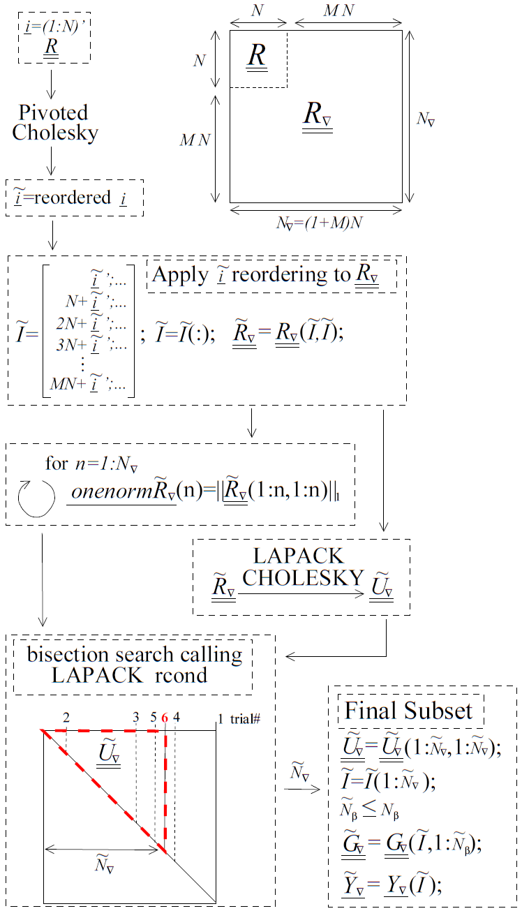

.. _`Chap:SurMod`:

Surrogate Models
================

This chapter deals with the theory behind Dakota’s surrogate models,
which are also known as response surfaces and meta-models.

.. _`Sec:KrigGP`:

Kriging and Gaussian Process Models
-----------------------------------

In this discussion of Kriging and Gaussian Process (GP) models, vectors
are indicated by a single underline and matrices are indicated by a
double underline. Capital letters indicate data, or functions of data,
that is used to construct an emulator. Lower case letters indicate
arbitrary points, i.e. points where the simulator may or may not have
been evaluated, and functions of arbitrary points. Estimates,
approximations, and models are indicated by hats. For instance,
:math:`\hat{f}\left(\underline{x}\right)` is a model/emulator of the
function :math:`f\left(\underline{x}\right)` and :math:`\hat{y}` is the
emulator’s prediction or estimate of the true response
:math:`y=f(\underline{x})` evaluated at the point :math:`\underline{x}`.
A tilde indicates a reordering of points/equations, with the possible
omission of some but not all points. :math:`N` is the number of points
in the sample design and :math:`M` is the number of input dimensions.

.. _`SubSec:KrigGP`:

Kriging & Gaussian Processes: Function Values Only
~~~~~~~~~~~~~~~~~~~~~~~~~~~~~~~~~~~~~~~~~~~~~~~~~~

The set of interpolation techniques known as Kriging, also referred to
as Gaussian Processes, were originally developed in the geostatistics
and spatial statistics communities to produce maps of underground
geologic deposits based on a set of widely and irregularly spaced
borehole sites :cite:p:`Cre91`. Building a Kriging model
typically involves the

1. Choice of a trend function,
2. Choice of a correlation function, and
3. Estimation of correlation parameters.

A Kriging emulator, :math:`\hat{f}\left(\underline{x}\right)`, consists
of a trend function (frequently a least squares fit to the data,
:math:`\underline{g}\left(\underline{x}\right)^T\underline{\beta}`) plus
a Gaussian process error model,
:math:`\epsilon\left(\underline{x}\right)`, that is used to correct the
trend function.

.. math:: \hat{f}\left(\underline{x}\right)=\underline{g}\left(\underline{x}\right)^T\underline{\beta}+\epsilon\left(\underline{x}\right)

This represents an estimated distribution for the unknown true surface,
:math:`f\left(\underline{x}\right)`. The error model,
:math:`\epsilon\left(\underline{x}\right)`, makes an adjustment to the
trend function so that the emulator will interpolate, and have zero
uncertainty at, the data points it was built from. The covariance
between the error at two arbitrary points, :math:`\underline{x}` and
:math:`\underline{x'}`, is modeled as

.. math:: {\rm Cov}\left(y\left(\underline{x}\right),y\left(\underline{x'}\right)\right)={\rm Cov}\left(\epsilon\left(\underline{x}\right),\epsilon\left(\underline{x'}\right)\right)=\sigma^2\ r\left(\underline{x},\underline{x'}\right).

Here :math:`\sigma^2` is known as the unadjusted variance and
:math:`r\left(\underline{x},\underline{x'}\right)` is a correlation
function. Measurement error can be modeled explicitly by modifying this
to

.. math:: {\rm Cov}\left(\epsilon\left(\underline{x}\right),\epsilon\left(\underline{x'}\right)\right)=\sigma^2\ r\left(\underline{x},\underline{x'}\right)+\Delta^2\delta\left(\underline{x}-\underline{x}'\right)

where

.. math:: \delta\left(\underline{x}-\underline{x}'\right)=\left\{\begin{array}{ll} 1 & if & \underline{x}-\underline{x}'=\underline{0} \\ 0 & otherwise \end{array} \right.

and :math:`\Delta^2` is the variance of the measurement error. In this
work, the term “nugget” refers to the ratio
:math:`\eta=\frac{\Delta^2}{\sigma^2}`.

By convention, the terms simple Kriging, ordinary Kriging, and universal
Kriging are used to indicate the three most common choices for the trend
function. In simple Kriging, the trend is treated as a known constant,
usually zero, :math:`g\left(\underline{x}\right)\beta\equiv 0`.
Universal Kriging :cite:p:`Mat71` uses a general polynomial
trend model
:math:`\underline{g}\left(\underline{x}\right)^T\underline{\beta}` whose
coefficients are determined by least squares regression. Ordinary
Kriging is essentially universal Kriging with a trend order of zero,
i.e. the trend function is treated as an unknown constant and
:math:`g\left(\underline{x}\right)=1`. :math:`N_{\beta}` is the number
of basis functions in :math:`\underline{g}\left(\underline{x}\right)`
and therefore number of elements in the vector
:math:`\underline{\beta}`.

For a finite number of sample points, :math:`N`, there will be
uncertainty about the most appropriate value of the vector,
:math:`\underline{\beta}`, which can therefore be described as having a
distribution of possible values. If one assumes zero prior knowledge
about this distribution, which is referred to as the “vague prior”
assumption, then the maximum likelihood value of
:math:`\underline{\beta}` can be computed via least squares generalized
by the inverse of the error model’s correlation matrix,
:math:`\underline{\underline{R}}`

.. math:: \underline{\hat{\beta}}=\left(\underline{\underline{G}}^T\underline{\underline{R}}^{-1}\underline{\underline{G}}\right)^{-1}\left(\underline{\underline{G}}^T\underline{\underline{R}}^{-1}\underline{Y}\right).

Here :math:`\underline{\underline{G}}` is a :math:`N` by :math:`N_\beta`
matrix that contains the evaluation of the least squares basis functions
at all points in :math:`\underline{\underline{X}}`, such that
:math:`G_{i,l}=g_l\left(\underline{X_i}\right)`. The real, symmetric,
positive-definite correlation matrix, :math:`\underline{\underline{R}}`,
of the error model contains evaluations of the correlation function,
:math:`r`, at all pairwise combination of points (rows) in the sample
design, :math:`\underline{\underline{X}}`.

.. math:: R_{i,j}=R_{j,i}=r\left(\underline{X_i},\underline{X_j}\right)=r\left(\underline{X_j},\underline{X_i}\right)

There are many options for :math:`r`, among them are the following
families of correlation functions:

-  **Powered-Exponential**

   .. math::
      :label: PowExpCorrFunc

      r\left(\underline{X_i},\underline{X_j}\right)=\exp\left(-\sum_{k=1}^M \theta_k\left|X_{i,k}-X_{j,k}\right|^\gamma\right)

   where :math:`0<\gamma\le2` and :math:`0<\theta_k`.

-  **Matern**

   .. math:: r\left(\underline{X_i},\underline{X_j}\right)=\prod_{k=1}^M \frac{2^{1-\nu}}{\Gamma(\nu)}\left(\theta_k\left|X_{i,k}-X_{j,k}\right|\right)^\nu\mathcal{K}_\nu\left(\theta_k\left|X_{i,k}-X_{j,k}\right|\right)

   where :math:`0<\nu`, :math:`0<\theta_k`, and
   :math:`\mathcal{K}_\nu(\cdot)` is the modified Bessel function of
   order :math:`\nu`; :math:`\nu=s+\frac{1}{2}` is the smallest value of
   :math:`\nu` which results in a Kriging model that is :math:`s` times
   differentiable.

-  **Cauchy**

   .. math:: r\left(\underline{X_i},\underline{X_j}\right)=\prod_{k=1}^M \left(1+\theta_k\left|X_{i,k}-X_{j,k}\right|^\gamma\right)^{-\nu}

   where :math:`0<\gamma\le2`, :math:`0<\nu`, and :math:`0<\theta_k`.

Gneiting et al. :cite:p:`Gne07` provide a more thorough
discussion of the properties of and relationships between these three
families. Some additional correlation functions include the Dagum family
:cite:p:`Ber08` and cubic splines.

The squared exponential or Gaussian correlation function
(Equation :eq:`PowExpCorrFunc` with :math:`\gamma=2`)
was selected to be the first correlation function implemented in Dakota
on the basis that its infinite smoothness or differentiability should
aid in leveraging the anticipated and hopefully sparse data. For the
Gaussian correlation function, the correlation parameters,
:math:`\underline{\theta}`, are related to the correlation lengths,
:math:`\underline{L}`, by

.. math::
   :label: GaussCorrFunc

   \theta_k=\frac{1}{2\ L_k^2}.

Here, the correlation lengths, :math:`\underline{L}`, are analogous to
standard deviations in the Gaussian or normal distribution and often
have physical meaning. The adjusted (by data) mean of the emulator is a
best linear unbiased estimator of the unknown true function,

.. math::
   :label: KrigMean

   \hat{y}={\rm E}\left(\hat{f}\left(\underline{x}\right)|\underline{f}\left(\underline{\underline{X}}\right)\right)=\underline{g}\left(\underline{x}\right)^T\underline{\hat{\beta}}+\underline{r}\left(\underline{x}\right)^T\ \underline{\underline{R}}^{-1}\underline{\epsilon}.

Here,
:math:`\underline{\epsilon}=\left(\underline{Y}-\underline{\underline{G}}\ \underline{\hat{\beta}}\right)`
is the known vector of differences between the true outputs and trend
function at all points in :math:`\underline{\underline{X}}` and the
vector :math:`\underline{r}\left(\underline{x}\right)` is defined such
that
:math:`r_i\left(\underline{x}\right)=r\left(\underline{x},\underline{X_i}\right)`.
This correction can be interpreted as the projection of prior belief
(the least squares fit) into the span of the data. The adjusted mean of
the emulator will interpolate the data that the Kriging model was built
from as long as its correlation matrix,
:math:`\underline{\underline{R}}`, is numerically non-singular.

Ill-conditioning of :math:`\underline{\underline{R}}` and other matrices
is a recognized as a significant challenge for Kriging. Davis and Morris
:cite:p:`Dav97` gave a thorough review of six factors
affecting the condition number of matrices associated with Kriging (from
the perspective of semivariograms rather than correlation functions).
They concluded that “Perhaps the best advice we can give is to be
mindful of the condition number when building and solving kriging
systems.”

In the context of estimating the optimal :math:`\underline{\theta}`,
Martin :cite:p:`Mar09` stated that Kriging’s “three most
prevalent issues are (1) ill-conditioned correlation matrices,(2)
multiple local optimum, and (3) long ridges of near optimal values.”
Because of the second issue, global optimization methods are more robust
than local methods. Martin used constrained optimization to address
ill-conditioning of :math:`\underline{\underline{R}}`.

Rennen :cite:p:`Ren09` advocated that ill-conditioning be
handled by building Kriging models from a uniform subset of available
sample points. That option has been available in Dakota’s “Gaussian
process” model (a separate implementation from Dakota’s “Kriging” model)
since version 4.1 :cite:p:`UserMan4_1`. Note that
Kriging/Gaussian-Process models will not exactly interpolate the
discarded points. The implicit justification for this type of approach
is that the row or columns of an ill-conditioned matrix contain a
significant amount of duplicate information, and that when discarded,
duplicate information should be easy to predict.

Dakota’s :dakkw:`model-surrogate-global-gaussian_process-surfpack` model has a similar “discard
near duplicate points” capability. However, it explicitly addresses the
issue of unique information content. Points are **not** discarded prior
to the construction of the Kriging model. Instead, for each vector
:math:`\underline{\theta}` examined that results in an ill-conditioned
correlation matrix, :math:`\underline{\underline{R}}`, a pivoted
Cholesky factorization of :math:`\underline{\underline{R}}` is
performed. This ranks the points according to how much unique
information they contain. Note that the definition of information
content depends on :math:`\underline{\theta}`. Low information points
are then discarded until :math:`\underline{\underline{R}}` is no longer
ill-conditioned, i.e. until it tightly meets a constraint on condition
number. This can be done efficiently using a bisection search that calls
LAPACK’s fast estimate of the (reciprocal of the) condition number. The
possibly, and often, improper subset of points used to construct the
Kriging model is the one associated with the chosen
:math:`\underline{\theta}`. Methods for selecting
:math:`\underline{\theta}` are discussed below. Since the points that
are discarded are the ones that contain the least unique information,
they are the ones that are easiest to predict and provide maximum
improvement to the condition number.

Adding a nugget, :math:`\eta`, to the diagonal entries of
:math:`\underline{\underline{R}}` is a popular approach for both
accounting for measurement error in the data and alleviating
ill-conditioning. However, doing so will cause the Kriging model to
smooth or approximate rather than interpolate the data. Methods for
choosing a nugget include:

-  Choosing a nugget based on the variance of measurement error (if
   any); this will be an iterative process if :math:`\sigma^2` is not
   known in advance.

-  Iteratively adding a successively larger nugget until
   :math:`\underline{\underline{R}}+\eta\underline{\underline{I}}` is no
   longer ill-conditioned.

-  Exactly calculating the minimum nugget needed for a target condition
   number from :math:`\underline{\underline{R}}`\ ’s maximum
   :math:`\lambda_{max}` and minimum :math:`\lambda_{min}` eigenvalues.
   The condition number of
   :math:`\underline{\underline{R}}+\eta\underline{\underline{I}}` is
   :math:`\frac{\lambda_{max}+\eta}{\lambda_{min}+\eta}`. However,
   calculating eigenvalues is computationally expensive. Since Kriging’s
   :math:`\underline{\underline{R}}` matrix has all ones on the
   diagonal, its trace and therefore sum of eigenvalues is :math:`N`.
   Consequently, a nugget value of
   :math:`\eta=\frac{N}{{\rm target\ condition\ number} - 1}` will
   always alleviate ill-conditioning. A smaller nugget that is also
   guaranteed to alleviate ill-conditioning can be calculated from
   LAPACK’s fast estimate of the reciprocal of
   :math:`\underline{\underline{R}}`\ ’s condition number,
   :math:`{\rm rcond}\left(\underline{\underline{R}}\right)`.

-  Treating :math:`\eta` as another parameter to be selected by the same
   process used to choose :math:`\underline{\theta}`. Two such
   approaches are discussed below.

The Kriging model’s adjusted variance is commonly used as a spatially
varying measure of uncertainty. Knowing where, and by how much, the
model “doubts” its own predictions helps build user confidence in the
predictions and can be utilized to guide the selection of new sample
points during optimization or to otherwise improve the surrogate. The
adjusted variance is

.. math::
   :label: KrigVar

   \begin{aligned}
   {\rm Var}\left(\hat{y}\right) &=& {\rm Var}\left(\hat{f}\left(\underline{x}\right)|\underline{f}\left(\underline{\underline{X}}\right)\right) \\ 
   &=&\hat{\sigma}^2\left(1-\underline{r}\left(\underline{x}\right)^T\ \underline{\underline{R}}^{-1}\underline{r}\left(\underline{x}\right) + \right. ... \\
   &&\left. \left(\underline{g}\left(\underline{x}\right)^T-\underline{r}\left(\underline{x}\right)^T\ \underline{\underline{R}}^{-1}\underline{\underline{G}}\right) \left(\underline{\underline{G}}^T\underline{\underline{R}}^{-1} \underline{\underline{G}}\right)^{-1}\left(\underline{g}\left(\underline{x}\right)^T-\underline{r}\left(\underline{x}\right)^T\ \underline{\underline{R}}^{-1}\underline{\underline{G}}\right)^T\right)\end{aligned}

where the maximum likelihood estimate of the unadjusted variance is

.. math:: \hat{\sigma}^2=\frac{\underline{\epsilon}^T\underline{\underline{R}}^{-1}\underline{\epsilon}}{N-N_{\beta}}.

There are two types of numerical approaches to choosing
:math:`\underline{\theta}`. One of these is to use Bayesian techniques
such as Markov Chain Monte Carlo to obtain a distribution represented by
an ensemble of vectors :math:`\underline{\theta}`. In this case,
evaluating the emulator’s mean involves taking a weighted average of
Equation :eq:`KrigMean` over the ensemble of :math:`\underline{\theta}` vectors.

The other, more common, approach to constructing a Kriging model
involves using optimization to find the set of correlation parameters
:math:`\underline{\theta}` that maximizes the likelihood of the model
given the data. Dakota’s :dakkw:`model-surrogate-global-gaussian_process` and
:dakkw:`model-surrogate-global-gaussian_process-surfpack` models use
the maximum likelihood approach. It is equivalent, and more convenient
to maximize the natural logarithm of the likelihood, which assuming a
vague prior is,

.. math::

   \begin{aligned}
   \log\left({\rm lik}\left(\underline{\theta}\right)\right)&=&
   -\frac{1}{2}\Bigg(\left(N-N_{\beta}\right)\left(\frac{\hat{\sigma}^2}{\sigma^2}+\log\left(\sigma^2\right)+\log(2\pi)\right)+...\\
   && \log\left(\det\left(\underline{\underline{R}}\right)\right)+\log\left(\det\left(\underline{\underline{G}}^T\underline{\underline{R}}^{-1}\underline{\underline{G}}\right)\right)\Bigg).\end{aligned}

And, if one substitutes the maximum likelihood estimate
:math:`\hat{\sigma}^2` in for :math:`\sigma^2`, then it is equivalent to
minimize the following objective function

.. math:: {\rm obj}\left(\underline{\theta}\right)=\log\left(\hat{\sigma}^2\right)+\frac{\log\left(\det\left(\underline{\underline{R}}\right)\right)+\log\left(\det\left(\underline{\underline{G}}^T\underline{\underline{R}}^{-1}\underline{\underline{G}}\right)\right)}{N-N_{\beta}}.

Because of the division by :math:`N-N_{\beta}`, this “per-equation”
objective function is mostly independent of the number of sample points,
:math:`N`. It is therefore useful for comparing the (estimated)
“goodness” of Kriging models that have different numbers of sample
points, e.g. when an arbitrary number of points can be discarded by the
pivoted Cholesky approach described above.

Note that the determinant of :math:`\underline{\underline{R}}` (and
:math:`\left(\underline{\underline{G}}^T\underline{\underline{R}}^{-1}\underline{\underline{G}}\right)`)
can be efficiently calculated as the square of the product of the
diagonals of its Cholesky factorization. However, this will often
underflow, i.e. go to zero, making its log incorrectly go to
:math:`-\infty`. A more accurate and robust calculation of
:math:`\log\left(\det\left(\underline{\underline{R}}\right)\right)` can
be achieved by taking twice the sum of the log of the diagonals of
:math:`\underline{\underline{R}}`\ ’s Cholesky factorization.

Also note, that in the absence of constraints, maximizing the likelihood
would result in singular :math:`\underline{\underline{R}}` which makes
the emulator incapable of reproducing the data from which it was built.
This is because a singular :math:`\underline{\underline{R}}` makes
:math:`\log\left(\det\left(\underline{\underline{R}}\right)\right)=-\infty`
and the *estimate* of likelihood infinite. Constraints are therefore
required. Two types of constraints are used in Dakota’s
:dakkw:`model-surrogate-global-gaussian_process-surfpack` models.

The first of these is an explicit constraint on LAPACK’s fast estimate
of the (reciprocal of the) condition number,
:math:`2^{-40}<{\rm rcond}\left(\underline{\underline{R}}\right)`. The
value :math:`2^{-40}` was chosen based on the assumption that double
precision arithmetic is used. Double precision numbers have 52 bits of
precision. Therefore the
:math:`2^{-40}<{\rm rcond}\left(\det\left(\underline{\underline{R}}\right)\right)`
implies that at least the leading three significant figures should be
uncorrupted by round off error. In Dakota 5.2, this constraint is used
to determine how many points can be retained in the pivoted Cholesky
approach to subset selection described above.

The second, is a box constraint defining a small “feasible” region in
correlation length space to search during the maximum likelihood
optimization. Many global optimizers, such as the DIRECT (DIvision of
RECTangles) used by Dakota’s Gaussian Process (as the only option) and
Kriging (as the default option) models, require a box constraint
definition for the range of acceptable parameters. By default, Dakota’s
:dakkw:`model-surrogate-global-gaussian_process-surfpack` model defines the input space to be the smallest
hyper-rectangle that contains the sample design. The user has the option
to define a larger input space that includes a region where they wish to
extrapolate. Note that the emulator can be evaluated at points outside
the defined input space, but this definition helps to determine the
extent of the “feasible” region of correlation lengths. Let the input
space be normalized to the unit hypercube centered at the origin. The
average distance between nearest neighboring points is then

.. math:: d=\left(\frac{1}{N}\right)^{1/M}.

Dakota’s “feasible” range of correlation lengths, :math:`\underline{L}`,
for the Gaussian correlation function is

.. math:: \frac{d}{4}\le L_k \le 8d.

This range was chosen based on correlation lengths being analogous to
the standard deviation in the Gaussian or Normal distribution. If the
correlation lengths are set to :math:`L_k=d/4`, then nearest neighboring
points “should be” roughly four “standard deviations” away making them
almost completely uncorrelated with each other.
:math:`\underline{\underline{R}}` would then be a good approximation of
the identity matrix and have a condition number close to one. In the
absence of a pathological spacing of points, this range of
:math:`\underline{L}` should contain some non-singular
:math:`\underline{\underline{R}}`. :math:`L_k=8d` implies approximately
:math:`32\%` trust in what points 8 neighbors away have to say and
:math:`5\%` trust in what points 16 neighbors away have to say. It is
possible that the optimal correlation lengths are larger than
:math:`8d`; but if so, then either almost all of the same information
will be contained in more nearby neighbors, or it was not appropriate to
use the squared-exponential/Gaussian correlation function. When other
correlation functions are added to the Dakota Kriging implementation,
each will be associated with its own range of appropriate correlation
lengths chosen by similar reasoning. A different definition of :math:`d`
could be used for non-hypercube input domains.

.. _`SubSec:GEK`:

Gradient Enhanced Kriging
~~~~~~~~~~~~~~~~~~~~~~~~~

This section focuses on the incorporation of derivative information into
Kriging models and challenges in their implementation. Special attention
is paid to conditioning issues.

There are at least three basic approaches for incorporating derivative
information into Kriging. These are

#. **Indirect**: The sample design is augmented with fictitious points
   nearby actual sample points which are predicted from derivative
   information and then a Kriging model is built from the augmented
   design.

#. **Co-Kriging**: The derivatives with respect to each input variables
   are treated as separate but correlated output variables and a
   Co-Kriging model is built for the set of output variables. This would
   use
   :math:`\left(\begin{array}{c} M+2 \\ 2 \end{array}\right)`
   :math:`\underline{\theta}` vectors.

#. **Direct**: The relationship between the response value and its
   derivatives is leveraged to use a single :math:`\underline{\theta}`
   by assuming

   .. math::
      :label: GEKCovAssume

      {\rm Cov}\left(y\left(\underline{x^1}\right),\frac{\partial y\left(\underline{x^2}\right)}{\partial x_k^2}\right)=\frac{\partial}{\partial x_k^2}\left({\rm Cov}\left(y\left(\underline{x^1}\right),y\left(\underline{x^2}\right)\right)\right).

Dakota includes an implementation of the direct approach,
herein referred to simply as Gradient Enhanced (universal) Kriging
(GEK). The equations for GEK can be derived by assuming Equation
:eq:`GEKCovAssume` and then taking the same
steps used to derive function value only Kriging. The superscript on
:math:`\underline{x}` in Equation :eq:`GEKCovAssume` and below indicates whether
it’s the 1st or 2nd input to
:math:`r\left(\underline{x^1},\underline{x^2}\right)`. Note that when
the first and second arguments are the same, the derivative of
:math:`r\left(\ ,\ \right)` with respect to the first argument is equal
in magnitude but opposite in sign compared to the derivative with
respect to the second argument. The GEK equations can also be obtained
by starting from a Kriging model and making the following substitutions
:math:`\underline{Y}\rightarrow\underline{Y_{\nabla}}`,
:math:`\underline{\underline{G}}\rightarrow\underline{\underline{G_{\nabla}}}`,
:math:`\underline{r}\rightarrow\underline{r_{\nabla}}`,
:math:`\underline{\underline{R}}\rightarrow\underline{\underline{R_{\nabla}}}`,
and :math:`N\rightarrow N_{\nabla}=N\ (1+M)`, where :math:`N_{\nabla}`
is the number of equations rather than the number of points,

.. math::

   \underline{Y_{\nabla}}=\begin{bmatrix} 
   \underline{Y} \\ \\
   \frac{\partial \underline{Y}}{\partial X_{:,1}} \\ \\
   \frac{\partial \underline{Y}}{\partial X_{:,2}} \\ \\ 
   \vdots \\ \\
   \frac{\partial \underline{Y}}{\partial X_{:,M}}
   \end{bmatrix}, 
   \underline{\underline{G_{\nabla}}}=\begin{bmatrix}
   \underline{\underline{G}}\\ \\
   \frac{\partial \underline{\underline{G}}}{\partial X_{:,1}}\\ \\
   \frac{\partial \underline{\underline{G}}}{\partial X_{:,2}}\\ \\
   \vdots \\ \\
   \frac{\partial \underline{\underline{G}}}{\partial X_{:,M}}
   \end{bmatrix}, 
   \underline{r_{\nabla}}=\begin{bmatrix} 
   \underline{r} \\ \\
   \frac{\partial \underline{r}}{\partial X_{:,1}} \\ \\
   \frac{\partial \underline{r}}{\partial X_{:,2}} \\ \\ 
   \vdots \\ \\
   \frac{\partial \underline{r}}{\partial X_{:,M}}
   \end{bmatrix}

.. math::

   \underline{\underline{R_{\nabla}}}=\begin{bmatrix}
   \underline{\underline{R}} & \frac{\partial \underline{\underline{R}}}{\partial X_{:,1}^2} & \frac{\partial \underline{\underline{R}}}{\partial X_{:,2}^2} & \dotsc & \frac{\partial \underline{\underline{R}}}{\partial X_{:,M}^2} \\ \\
   \frac{\partial \underline{\underline{R}}}{\partial X_{:,1}^1} & \frac{\partial^2 \underline{\underline{R}}}{\partial X_{:,1}^1 \partial X_{:,1}^2} & \frac{\partial^2 \underline{\underline{R}}}{\partial X_{:,1}^1 \partial X_{:,2}^2} & \dotsc & \frac{\partial^2 \underline{\underline{R}}}{\partial X_{:,1}^1 \partial X_{:,M}^2} \\ \\
   \frac{\partial \underline{\underline{R}}}{\partial X_{:,2}^1} & \frac{\partial^2 \underline{\underline{R}}}{\partial X_{:,2}^1 \partial X_{:,1}^2} & \frac{\partial^2 \underline{\underline{R}}}{\partial X_{:,2}^1 \partial X_{:,2}^2} & \dotsc & \frac{\partial^2 \underline{\underline{R}}}{\partial X_{:,2}^1 \partial X_{:,M}^2} \\ \\
   \vdots & \vdots & \vdots & \ddots & \vdots \\ \\
   \frac{\partial \underline{\underline{R}}}{\partial X_{:,M}^1} & \frac{\partial^2 \underline{\underline{R}}}{\partial X_{:,M}^1 \partial X_{:,1}^2} & \frac{\partial^2 \underline{\underline{R}}}{\partial X_{:,M}^1 \partial X_{:,2}^2} & \dotsc & \frac{\partial^2 \underline{\underline{R}}}{\partial X_{:,M}^1 \partial X_{:,M}^2} 
   \end{bmatrix}

.. math:: \frac{\partial \underline{\underline{R}}}{\partial X_{:,I}^1}=-\left(\frac{\partial \underline{\underline{R}}}{\partial X_{:,I}^1}\right)^T=-\frac{\partial \underline{\underline{R}}}{\partial X_{:,I}^2}=\left(\frac{\partial \underline{\underline{R}}}{\partial X_{:,I}^2}\right)^T

.. math:: \frac{\partial^2 \underline{\underline{R}}}{\partial X_{:,I}^1 \partial X_{:,J}^2}=\left(\frac{\partial^2 \underline{\underline{R}}}{\partial X_{:,I}^1 \partial X_{:,J}^2}\right)^T=\frac{\partial^2 \underline{\underline{R}}}{\partial X_{:,J}^1 \partial X_{:,I}^2}=\left(\frac{\partial^2 \underline{\underline{R}}}{\partial X_{:,J}^1 \partial X_{:,I}^2}\right)^T

Here capital :math:`I` and :math:`J` are scalar indices for the input
dimension (column) of the sample design,
:math:`\underline{\underline{X}}`. Note that for the Gaussian
correlation function

.. math:: \frac{\partial^2 R_{j,j}}{\partial X_{j,I}^1 \partial X_{j,I}^2}=2\theta_I

and has units of :math:`{\rm length}^{-2}`. Two of the conditions
necessary for a matrix to qualify as a correlation matrix are that all
of its elements must be dimensionless and all of its diagonal elements
must identically equal one. Since
:math:`\underline{\underline{R_{\nabla}}}` does not satisfy these
requirements, it technically does not qualify as a “correlation matrix.”
However, referring to :math:`\underline{\underline{R_{\nabla}}}` as such
is a small abuse of terminology and allows GEK to use the same naming
conventions as Kriging.

A straight-forward implementation of GEK tends be significantly more
accurate than Kriging given the same sample design provided that the

-  Derivatives are accurate
-  Derivatives are not infinite (or nearly so)
-  Function is sufficiently smooth, and
-  :math:`\underline{\underline{R_{\nabla}}}` is not ill-conditioned
   (this can be problematic).

If gradients can be obtained cheaply (e.g. by automatic differentiation
or adjoint techniques) and the previous conditions are met, GEK also
tends to outperform Kriging for the same computational budget. Previous
works, such as Dwight :cite:p:`Dwi09`, state that the direct
approach to GEK is significantly better conditioned than the indirect
approach. While this is true, (direct) GEK’s
:math:`\underline{\underline{R_{\nabla}}}` matrix can still be, and
often is, horribly ill-conditioned compared to Kriging’s
:math:`\underline{\underline{R}}` for the same
:math:`\underline{\theta}` and :math:`\underline{\underline{X}}`

In the literature, ill-conditioning is often attributed to the choice of
the correlation function. Although a different correlation function may
alleviate the ill-conditioning for some problems, the root cause of the
ill-conditioning is a poorly spaced sample design. Furthermore, a
sufficiently bad sample design could make any interpolatory Kriging
model, gradient enhanced or otherwise, ill-conditioned, regardless of
the choice of correlation function. This root cause can be addressed
directly by discarding points/equations.

Discarding points/equations is conceptually similar to using a
Moore-Penrose pseudo inverse of
:math:`\underline{\underline{R_{\nabla}}}`. However, there are important
differences. A pseudo inverse handles ill-conditioning by discarding
small singular values, which can be interpreted as throwing away the
information that is least present while keeping all of what is most
frequently duplicated. This causes a Kriging model to not interpolate
any of the data points used to construct it while using some information
from all rows.

An alternate strategy is to discard additional copies of the information
that is most duplicated and keep more of the barely present information.
In the context of eigenvalues, this can be described as decreasing the
maximum eigenvalue and increasing the minimum eigenvalue by a smaller
amount than a pseudo inverse. The result is that the GEK model will
exactly fit all of the retained information. This can be achieved using
a pivoted Cholesky factorization, such as the one developed by Lucas
:cite:p:`Luc04` to determine a reordering
:math:`\underline{\underline{\tilde{R}_{\nabla}}}` and dropping
equations off its end until it tightly meets the constraint on rcond.
However, a straight-forward implementation of this is neither efficient
nor robust.

In benchmarking tests, Lucas’ level 3 pivoted Cholesky implementation
was not competitive with the level 3 LAPACK non-pivoted Cholesky in
terms of computational efficiency. In some cases, it was an order of
magnitude slower. Note that Lucas’ level 3 implementation can default to
his level 2 implementation and this may explain some of the loss in
performance.

More importantly, applying pivoted Cholesky to
:math:`\underline{\underline{R_{\nabla}}}` tends to sort derivative
equations to the top/front and function value equations to the end. This
occurred even when :math:`\underline{\underline{R_{\nabla}}}` was
equilibrated to have ones for all of its diagonal elements. The result
was that for many points at least some of the derivative equations were
retained while the function values at the same points were discarded.
This can (and often did) significantly degrade the accuracy of the GEK
predictions. The implication is that derivative equations contain more
information than, but are not as reliable as, function value equations.

         used to select the subset of equations to retain when
         :math:`\underline{\underline{R_{\nabla}}}` is ill-conditioned.
         Although it is part of the algorithm, the equilibration of
         :math:`\underline{\underline{R_{\nabla}}}` is not shown in this
         figure. The pseudo code uses MATLAB notation.
   :align: center
   :width: 600
   :name: fig:SubsetSelectAlgorithm

   A diagram with pseudo code for the pivoted Cholesky algorithm used to
   select the subset of equations to retain when
   :math:`\underline{\underline{R_{\nabla}}}` is ill-conditioned.
   Although it is part of the algorithm, the equilibration of
   :math:`\underline{\underline{R_{\nabla}}}` is not shown in this
   figure. The pseudo code uses MATLAB notation.

To address computational efficiency and robustness, Dakota’s pivoted
Cholesky approach for GEK was modified to:

-  Equilibrate :math:`\underline{\underline{R_{\nabla}}}` to improve the
   accuracy of the Cholesky factorization; this is beneficial because
   :math:`\underline{\underline{R_{\nabla}}}` can be poorly scaled.
   Theorem 4.1 of van der Sluis :cite:p:`Van69` states that if
   :math:`\underline{\underline{a}}` is a real, symmetric, positive
   definite :math:`n` by :math:`n` matrix and the diagonal matrix
   :math:`\underline{\underline{\alpha}}` contains the square roots of
   the diagonals of :math:`\underline{\underline{a}}`, then the
   equilibration

   .. math:: \underline{\underline{\breve{a}}}=\underline{\underline{\alpha}}^{-1}\underline{\underline{a}}\ \underline{\underline{\alpha}}^{-1},

   minimizes the 2-norm condition number of
   :math:`\underline{\underline{\breve{a}}}` (with respect to solving
   linear systems) over all such symmetric scalings, to within a factor
   of :math:`n`. The equilibrated matrix
   :math:`\underline{\underline{\breve{a}}}` will have all ones on the
   diagonal.

-  Perform pivoted Cholesky on :math:`\underline{\underline{R}}`,
   instead of :math:`\underline{\underline{R_{\nabla}}}`, to rank points
   according to how much new information they contain. This ranking was
   reflected by the ordering of points in
   :math:`\underline{\underline{\tilde{R}}}`.

-  Apply the ordering of points in
   :math:`\underline{\underline{\tilde{R}}}` to whole points in
   :math:`\underline{\underline{R_{\nabla}}}` to produce
   :math:`\underline{\underline{\tilde{R}_{\nabla}}}`. Here a whole
   point means the function value at a point immediately followed by the
   derivatives at the same point.

-  Perform a LAPACK non-pivoted Cholesky on the equilibrated
   :math:`\underline{\underline{\tilde{R}_{\nabla}}}` and drop equations
   off the end until it satisfies the constraint on rcond. LAPACK’s
   rcond estimate requires the 1-norm of the original (reordered) matrix
   as input so the 1-norms for all possible sizes of
   :math:`\underline{\underline{\tilde{R}_{\nabla}}}` are precomputed
   (using a rank one update approach) and stored prior to the Cholesky
   factorization. A bisection search is used to efficiently determine
   the number of equations that need to be retained/discarded. This
   requires :math:`{\rm ceil}\left(\log2\left(N_{\nabla}\right)\right)`
   or fewer evaluations of rcond. These rcond calls are all based off
   the same Cholesky factorization of
   :math:`\underline{\underline{\tilde{R}_{\nabla}}}` but use different
   numbers of rows/columns, :math:`\tilde{N}_{\nabla}`.

This algorithm is visually depicted in
:numref:`fig:SubsetSelectAlgorithm`. Because inverting/factorizing a
matrix with :math:`n` rows and columns requires
:math:`\mathcal{O}\left(n^3\right)` flops, the cost to perform pivoted
Cholesky on :math:`\underline{\underline{R}}` will be much less than,
i.e. :math:`\mathcal{O}\left((1+M)^{-3}\right)`, that of
:math:`\underline{\underline{R_{\nabla}}}` when the number of dimensions
:math:`M` is large. It will also likely be negligible compared to the
cost of performing LAPACK’s non-pivoted Cholesky on
:math:`\underline{\underline{\tilde{R}_{\nabla}}}`.

.. _`SubSec:ExpGP`:

Experimental Gaussian Process
~~~~~~~~~~~~~~~~~~~~~~~~~~~~~

The experimental semi-parametric Gaussian process (GP) regression model
in Dakota’s surrogates module contains two types of variables:
hyperparameters :math:`\boldsymbol{\theta}` that influence the kernel
function :math:`k(\boldsymbol{x},\boldsymbol{x}')` and polynomial trend
coefficients :math:`\boldsymbol{\beta}`. Building or fitting a GP
involves determining these variables given a data matrix
:math:`\boldsymbol{X}` and vector of response values
:math:`\boldsymbol{y}` by minimizing the negative log marginal
likelihood function :math:`J(\boldsymbol{\theta},\boldsymbol{\beta})`.

We consider an anisotropic squared exponential kernel
:math:`k_{\text{SE}}` augmented with a white noise term
:math:`k_{\text{W}}`, sometimes referred to as a “nugget” or “jitter” in
the literature:

.. math::
   :label: ExpGP_eq1

   \begin{gathered}
     \begin{aligned}
       \bar{D} &= \sum_{m=1}^{d} \frac{ \left(x_m - x'_m \right)^2}{\ell_m^2}, \\
       k_{\text{SE}}(\boldsymbol{x},\boldsymbol{x}') &= \sigma^2 \exp \left( - \frac{1}{2} \bar{D}^2 \right), \\
       k_{\text{W}}(\boldsymbol{x},\boldsymbol{x}') &= \eta^2 \delta_{\boldsymbol{x}\boldsymbol{x}'}.
     \end{aligned}\end{gathered}

The parameter :math:`\sigma^2` is a scaling term that affects the range
of the output space. The vector
:math:`\boldsymbol{\ell} \in \mathbb{R}^d` contains the correlation
lengths for each dimension of the input space. The smaller a given
:math:`\ell_m` the larger the variation of the function along that
dimension. Lastly, the :math:`\eta^2` parameter determines the size of
the white noise term.

As of Dakota 6.14, the Matérn :math:`\nu = \frac{3}{2}` and
:math:`\nu = \frac{5}{2}` kernels may be used in place of the squared
exponential kernel.

.. math::
   :label: ExpGP_eq2

   \begin{gathered}
     \begin{aligned}
       k_{\text{M32}}(\boldsymbol{x},\boldsymbol{x}') &= \sigma^2 \left( 1 + \sqrt{3} \bar{D} \right) \exp \left( - \sqrt{3} \bar{D} \right), \\
       k_{\text{M52}}(\boldsymbol{x},\boldsymbol{x}') &= \sigma^2 \left( 1 + \sqrt{5} \bar{D} + \frac{5}{3} \bar{D}^2 \right) \exp \left( - \sqrt{5} \bar{D} \right).
     \end{aligned}\end{gathered}

All of the kernel hyperparameters are strictly positive except for the
nugget which is non-negative and will sometimes be omitted or set to a
fixed value. These parameters may vary over several orders of magnitude
such that variable scaling can have a significant effect on the
performance of the optimizer used to find :math:`\boldsymbol{\beta}` and
:math:`\boldsymbol{\theta}`. We perform log-scaling for each of the
hyperparameters :math:`\boldsymbol{\theta}` according to the
transformation

.. math::
   :label: ExpGP_eq3

   \begin{gathered}
   \theta_i = \log \left( \frac{p_i}{p_{\text{ref}}} \right),\end{gathered}

with :math:`p_{\text{ref}} = 1` for all parameters for simplicity. Note
that we take the original variables to be
:math:`\left\lbrace \sigma, \boldsymbol{\ell}, \eta \right\rbrace`, not
their squares as is done by some authors. The log-transformed version of
the squared exponential and white kernels are

.. math::
   :label: ExpGP_eq4

   \begin{gathered}
     \begin{aligned}
       \bar{D} &= \sum_{m=1}^{d} \left(x_m - x'_m \right)^2 \exp(-2 \theta_m), \\
       k_{\text{SE}}(\boldsymbol{x},\boldsymbol{x}') &= \exp( 2 \theta_0 ) \exp \left( - \frac{1}{2} \bar{D}^2 \right), \\
       k_{\text{W}}(\boldsymbol{x},\boldsymbol{x}') &= \exp(2 \theta_{-1})  \delta_{\boldsymbol{x}\boldsymbol{x}'}.
     \end{aligned}\end{gathered}

where the hyperparameters are ordered so that the log-transformed
variables :math:`\sigma = \theta_0` and :math:`\eta = \theta_{-1}` are
at the beginning and end of the vector of hyperparameters
:math:`\boldsymbol{\theta}`, respectively. The polynomial regression
coefficients :math:`\boldsymbol{\beta}` are left unscaled.

An important quantity in Gaussian process regression is the *Gram
matrix* :math:`\boldsymbol{G}`:

.. math::
   :label: ExpGP_eq5

   \begin{gathered}
   G_{ij} := k(\boldsymbol{x}^i,\boldsymbol{x}^j),\end{gathered}

where if the layout of the surrogate build samples matrix
:math:`\boldsymbol{X}` is number of samples :math:`N` by dimension of
the feature space :math:`d` the quantities :math:`\boldsymbol{x}^i` and
:math:`\boldsymbol{x}^j` represent the :math:`i^{\text{th}}` and
:math:`j^{\text{th}}` rows of this matrix, respectively. The Gram matrix
is positive definite provided there are no repeated samples, but it can
be ill-conditioned if sample points are close together. Factorization of
the (dense) Gram matrix and the computation of its inverse (needed for
the gradient of the negative marginal log-likelihood function) are the
computational bottlenecks in Gaussian process regression.

The derivatives (shown only for the squared exponential and white/nugget
kernels here) of the Gram matrix with respect to the hyperparameters are
used in the regression procedure. To compute them it is helpful to
partition the Gram matrix into two components, one that depends on the
squared exponential piece of the kernel :math:`\boldsymbol{K}` and
another associated with the nugget term

.. math::
   :label: ExpGP_eq6

   \begin{gathered}
   \boldsymbol{G} =  \boldsymbol{K} + \exp(2 \theta_{-1})  \boldsymbol{I}.\end{gathered}

Let :math:`\boldsymbol{D}_m` denote the matrix of component-wise squared
distances between points in the space of build points for dimension
:math:`m`:

.. math::
   :label: ExpGP_eq7

   \begin{gathered}
   D_{ijm}  = \left( x^i_m - x^j_m \right)^2.\end{gathered}

The derivatives of :math:`\boldsymbol{G}` are

.. math::
   :label: ExpGP_eq8

   \begin{gathered}
   \begin{aligned}
   \frac{d\boldsymbol{G}}{d\theta_0} &= 2 \boldsymbol{K}, \\
   \frac{d\boldsymbol{G}}{d\theta_m} &= \exp \left( -2 \theta_m \right) \boldsymbol{D}_m \odot \boldsymbol{K},  \quad  m = 1 \ldots d, \\
   \frac{d\boldsymbol{G}}{d\theta_{-1}} &= 2 \exp(2 \theta_{-1}) \boldsymbol{I},
   \end{aligned}\end{gathered}

where :math:`\odot` denotes the Hadamard (i.e. element-wise) product.

A polynomial trend function is obtained by multiplying a basis matrix
for the samples :math:`\boldsymbol{\Phi}` by the trend coefficients
:math:`\boldsymbol{\beta}`. The objective function for maximum
likelihood estimation :math:`J` depends on the residual
:math:`\boldsymbol{z} := \boldsymbol{y} - \Phi \boldsymbol{\beta}`.

.. math::
   :label: ExpGP_eq9

   \begin{gathered}
   J(\boldsymbol{\theta},\boldsymbol{\beta}) = \frac{1}{2} \log \left( \text{det} \left( \boldsymbol{G} \right) \right) + \frac{1}{2} \boldsymbol{z}^T \boldsymbol{G}^{-1} \boldsymbol{z} + \frac{N}{2} \log \left( 2 \pi \right).\end{gathered}

The gradient of the objective function can be computed analytically
using the derivatives of the Gram matrix. First we introduce

.. math::
   :label: ExpGP_eq10

   \begin{gathered}
   \begin{aligned}
   \boldsymbol{\alpha} &:= \boldsymbol{G}^{-1} \boldsymbol{z}, \\
   \boldsymbol{Q} &:= -\frac{1}{2} \left( \boldsymbol{\alpha} \boldsymbol{\alpha}^T - \boldsymbol{G}^{-1} \right).
   \end{aligned}\end{gathered}

The gradient is

.. math::
   :label: ExpGP_eq11

   \begin{gathered}
   \begin{aligned}
   \frac{dJ}{d\theta_0} &= \sum_{i,j}  2 Q_{ij} K_{ij}, \\
   \frac{dJ}{d\theta_m} &= \sum_{i,j} \left[   \boldsymbol{Q} \odot \boldsymbol{K}  \right]_{ij}   D_{ijm} \exp(-2 \theta_m), \quad m = 1, \ldots, d, \\
   \frac{dJ}{d\theta_{-1}} &= \text{trace}(2 \boldsymbol{Q}) \exp(2\theta_{-1}), \\
   \frac{dJ}{d \boldsymbol{\beta}} &= - \boldsymbol{\Phi}^T \boldsymbol{\alpha}.
   \end{aligned}\end{gathered}

We use the Rapid Optimization Library’s :cite:p:`Kou2014`
gradient-based, bound-constrained implementation of the optimization
algorithm L-BFGS-B :cite:p:`Byrd95` to minimize :math:`J`.
This is a local optimization method so it is typically run multiple
times from different initial guesses to increase the chances of finding
the global minimum.

Once the regression problem has been solved, we may wish to evaluate the
GP at a set of predictions points :math:`\boldsymbol{X}^*` with an
associated basis matrix :math:`\boldsymbol{\Phi}^*`. Some useful
quantities are

.. math::
   :label: ExpGP_eq12

   \begin{gathered}
   \begin{aligned}
   P^*_{ij} &=  k\left(\left(\boldsymbol{x}^*\right)^i,\boldsymbol{x}^j\right), \\
   G^{**}_{ij} &=  k\left(\left(\boldsymbol{x}^*\right)^i,\left(\boldsymbol{x}^*\right)^j\right), \\
   \boldsymbol{H} &= \boldsymbol{\Phi}^T  \boldsymbol{G}^{-1}  \boldsymbol{\Phi}, \\
   \boldsymbol{R}^{*} &= \boldsymbol{\Phi}^* - \boldsymbol{P}^{*} \boldsymbol{G}^{-1}  \boldsymbol{\Phi}.
   \end{aligned}\end{gathered}

The mean and covariance of the GP at the prediction points are

.. math::
   :label: ExpGP_eq13

   \begin{gathered}
   \begin{aligned}
   \boldsymbol{\mu}^{*} &= \boldsymbol{\Phi}^* \boldsymbol{\beta} + \boldsymbol{P}^{*} \boldsymbol{\alpha}, \\
   \boldsymbol{\Sigma}^{**} &= \boldsymbol{G}^{**} - \boldsymbol{P}^{*}  \boldsymbol{G}^{-1}  \left(\boldsymbol{P}^{*}\right)^T + \boldsymbol{R}^{*} \boldsymbol{H}^{-1} \left(\boldsymbol{R}^{*}\right)^T.
   \end{aligned}\end{gathered}

.. _`sec:poly_surr`:

Polynomial Models
-----------------

A preliminary discussion of the surrogate polynomial models available in
Dakota is presented in the :ref:`main Surrogate Models section <models:surrogate>`,
with select details reproduced here. For ease of notation, the discussion
in this section assumes that the model returns a single response :math:`\hat{f}`
and that the design parameters :math:`x` have dimension :math:`n`.

For each point :math:`x`, a linear polynomial model is approximated by

.. math::
   :label: polynomial_eq1

   \hat{f}(x) \approx c_0 + \sum_{i = 1}^{n} c_i x_i,

a quadratic polynomial model is

.. math::
   :label: polynomial_eq2

   \hat{f}(x) \approx c_0 + \sum_{i = 1}^{n} c_i x_i + \sum_{i = 1}^{n} 
   \sum_{j \geq i}^{n} c_{ij} x_i x_j,

and a cubic polynomial model is

.. math::
   :label: polynomial_eq3

   \hat{f}(x) \approx c_0 + \sum_{i = 1}^{n} c_i x_i + \sum_{i = 1}^{n} 
   \sum_{j \geq i}^{n} c_{ij} x_i x_j + \sum_{i = 1}^{n} \sum_{j \geq i}^{n}
   \sum_{k \geq j}^{n} c_{ijk} x_i x_j x_k.

In these equations, :math:`c_0`, :math:`c_i`, :math:`c_{ij}`, and
:math:`c_{ijk}` are the polynomial coefficients that are determined
during the approximation of the surrogate. Furthermore, each point
:math:`x` corresponds to a vector :math:`v_x` with entries given by the
terms :math:`1`, :math:`x_i`, :math:`x_i x_j`, and :math:`x_i x_j x_k`.
The length :math:`n_c` of this vector corresponds to the number of
coefficients present in the polynomial expression. For the linear,
quadratic, and cubic polynomials, respectively,

.. math::
   :label: polynomial_eq4

   \begin{aligned}
   n_{c}   &=& n+1, \\
   n_{c}   &=& \frac{(n+1)(n+2)}{2}, \\
   n_{c}   &=& \frac{n^3 + 6n^2 + 11n + 6}{6}.\end{aligned}

Let the matrix :math:`X` be such that each row corresponds to the vector
of a training point. Thus, given :math:`m` training points,
:math:`X \in \mathbb{R}^{m \times
n_c}`. Approximating the polynomial model then amounts to approximating
the solution to

.. math::
   :label: polynomial_eq5

   Xb = Y,

where :math:`b` is the vector of the polynomial coefficients described
above, and :math:`Y` contains the true responses :math:`y(x)`. Details
regarding the solution or approximate solution of this equation can be
found in most mathematical texts and are not discussed here. For any of
the training points, the estimated variance is given by

.. math::
   :label: polynomial_eq6

   \sigma^{2}\left(\hat{f}(x)\right) = MSE\left(v_x^{T} (X^{T} X)^{-1} v_x\right),

where :math:`MSE` is the mean-squared error of the approximation over
all of the training points. For any new design parameter, the prediction
variance is given by 

.. math::
   :label: poly_var

   \sigma^{2}\left(\hat{f}(x_{new})\right) = MSE\left(1 + v_{x_{new}}^{T} 
   (X^{T} X)^{-1} v_{x_{new}} \right).

Additional discussion and detail can be found
in :cite:p:`Net85`.
