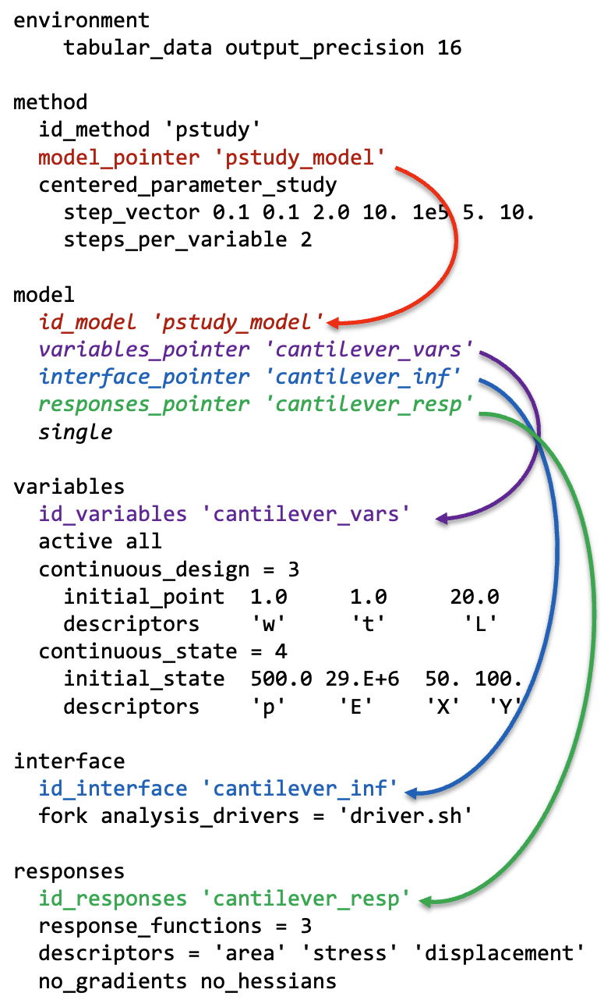

.. _`topic-pointers`:
.. _`topic-block_pointer`:
.. _`topic-block_identifier`:

Pointers
========

The structure of a Dakota study is specified using string-based
pointers and block IDs. Except for ``environment``, of which there can be
at most one per study, each block (e.g. method, model) can have a unique ID,
which is provided using the ``id_<block>`` keyword. This makes the block
referenceable by other blocks, typically using ``<block>_pointer`` keywords.

For simple studies, where there is only one of each block type in the input
file, use of IDs and pointers to disambiguate structure is not required. However,
they may still be used to clarify output.

Example
-------

:numref:`topic:pointers:input` illustrates how pointers and IDs are used to
specify the structure of a Dakota study using colored arrows.

    
    The colored errors draw attention to pointers and IDs that define the structure
    of the study
