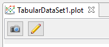
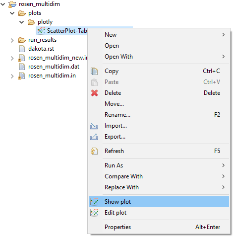

.. _chartreuse-editing:

""""""""""""""""""
Editing Plot Files
""""""""""""""""""

--------------------
From the editor area
--------------------

When you are viewing a Chartreuse plot in the editor area, an action bar will be displayed along the top of the plot.

- **Screenshot (the camera icon)** Save your plot to an image file on disk.
- **Edit plot (the pencil icon)** Go back and make modifications to this plot.  Clicking this will open the more
  sophisticated :ref:`Plot Manager dialog <chartreuse-plot-manager>`.

---------------------
From the context menu
---------------------

Right-clicking a created .plot file gives you some context menu options:

- **Chartreuse > Show Plot** Re-render the plot in the editor area of your current perspective.
- **Chartreuse > Edit Plot** Go back and make modifications to this plot.  Clicking this will open
  the more sophisticated :ref:`Plot Manager dialog <chartreuse-plot-manager>`.