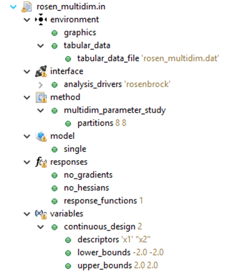

.. _gui-inputfiles-treeview:

"""""""""""""""""""""""""""""""""""""""""""""""""""""""
Editing Dakota Input Files in the Project Explorer tree
"""""""""""""""""""""""""""""""""""""""""""""""""""""""

A Dakota input file can be expanded in the Project Explorer view's tree to reveal its content hierarchically:

"New Keyword" context menu option
---------------------------------

With a Dakota study expanded in the Project Explorer, right-click a Dakota keyword and choose "New Keyword."  A sub-context menu will pop
out with available keywords at the point in the Dakota study you clicked on.  Choosing a keyword from this sub-context menu will automatically
add it to your Dakota study.

.. image:: img/DakotaStudyIntro_NewKeywordMenu_1.png
   :alt: New Keyword submenu