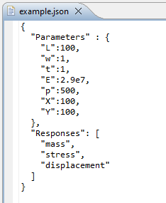
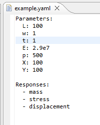
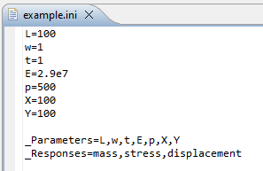

.. _gui-simulation-models-overview:

""""""""""""""""""""""""""""""
Working with Simulation Models
""""""""""""""""""""""""""""""

Dakota's primary mechanism for iterating over an external simulation model is to exchange parameters and responses between itself
and the simulation model.

.. note::
   Please refer to the main article on :ref:`coupling Dakota to a simulation <couplingtosimulations-main>`
   for a detailed, general explanation.

In the context of Dakota GUI, there are two main approaches for defining an external simulation model:

=================
Next-Gen Workflow
=================

:ref:`Next-Gen Workflow <ngw-main>` is a powerful, node-based workflow tool that allows you to create an arbitrarily complex,
visual representation of a workflow that passes information from beginning to end. The nature of Next-Gen Workflow makes it
ideal for constructing simulation model defintions, as well as analysis drivers for Dakota itself.

.. _gui-simulation-models-ini-json-yaml:

===================
Simple Text Formats
===================

Dakota GUI also recognizes INI, JSON, and YAML formats if you wish to define the inputs and outputs of your simulation model
using a simple text structure. For small, simple models, this is often the quickest approach for defining your simulation model.

.. note::

   In each of the following examples, the same model is being represented: Dakota's classic "cantilever beam"
   model. The cantilever beam model accepts seven input parameters: Length (L), Width (w), Thickness (t), Young's Modulus (E),
   Density (p), Horizontal load (X), and Vertical load (Y). And the cantilever beam model emits three output responses: the mass of
   the beam, the stress on the beam, and the displacement of the beam.
   
.. note::

   If you do not want to write one of these simple text files by hand, you may opt to use the :ref:`New Parameter/Response File Wizard <wizards-newparamresponsefile-main>` instead.

---------
JSON/YAML
---------

   

   
JSON and YAML are both popular formats for writing structured text. While their syntax differs, the content that Dakota GUI looks for
remains the same between the two formats:

- The struct containing input parameters must be labeled with one of the following keys in order to be recognized:
  ``input``, ``inputs``, ``parameters``, ``params``, ``variables``, ``Input``, ``Inputs``, ``Parameters``, ``Params``, or ``Variables``.
- The struct containing output responses must be labeled with one of the following keys in order to be recognized:
  ``output``, ``outputs``, ``responses``, ``resps``, ``results``, ``Output``, ``Outputs``, ``Responses``, ``Resps``, or ``Results``.
- Input parameters can be stored either as a flat list or a dictionary of key-value pairs. If it's a flat list, the
  values within will be treated as the input parameter labels. If it's a dictionary, the keys will be the input parameter
  labels, and the values will be treated as initial starting values for the input parameters. In the screenshots above,
  we opted to use a dictionary to store parameter labels and their starting values.
- Output responses may also be stored in either a flat list or a dictionary of key-value pairs. While the dictionary option
  for responses is legal and parseable, there is currently no recognized use for initial response values in the Dakota GUI.
  In the screenshots above, we opted to use a flat list to store response labels.

---
INI
---

The GUI also supports flat INI files for storing parameter and response information. Because INI files are flat, special care must be taken to represent your model's
inputs and outputs in INI format:

- If you wish to supply starting values for your input parameters, these are represented using standard INI key-value syntax, with an equals symbol separating the key from the value.
- The complete list of input parameters are provided in a comma-separated list. This comma-separated list is the value for a single key, which must be one of the following:
  ``_input``, ``_inputs``, ``_parameters``, ``_params``, ``_variables``, ``_Input``, ``_Inputs``, ``_Parameters``, ``_Params``, or ``_Variables``.
- Likewise, the complete list of output responses are provided in a comma-separated list. This comma-separated list is the value for a single key, which must be one of the following: 
  ``_output``, ``_outputs``, ``_responses``, ``_resps``, ``_results``, ``_Output``, ``_Outputs``, ``_Responses``, ``_Resps``, or ``_Results``.
- Note the underscore prefixing each reserved word for parameter and response lists. This underscore designates to Dakota GUI that these key-value pairs have special
  meaning and are not just another key-value pair for an input parameter value.