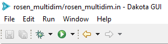
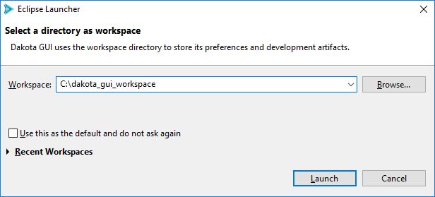
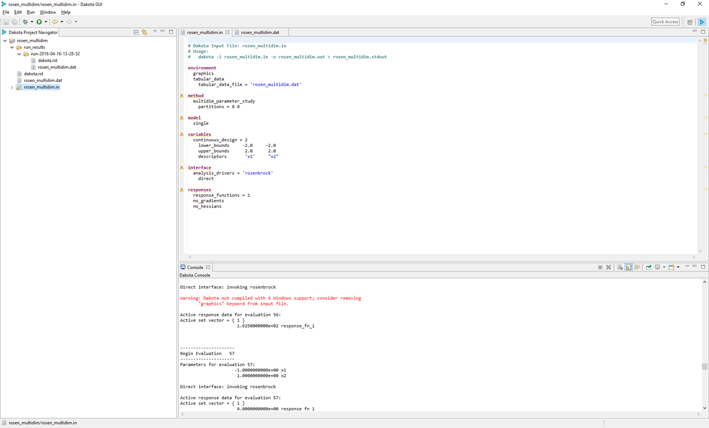
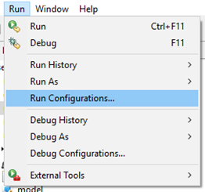
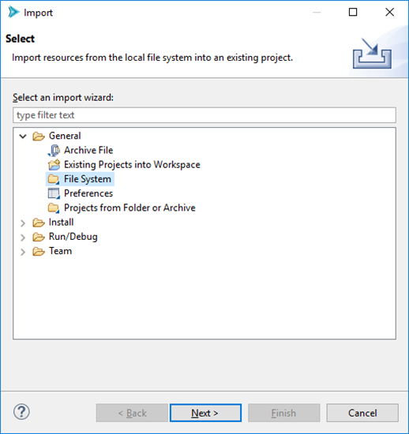
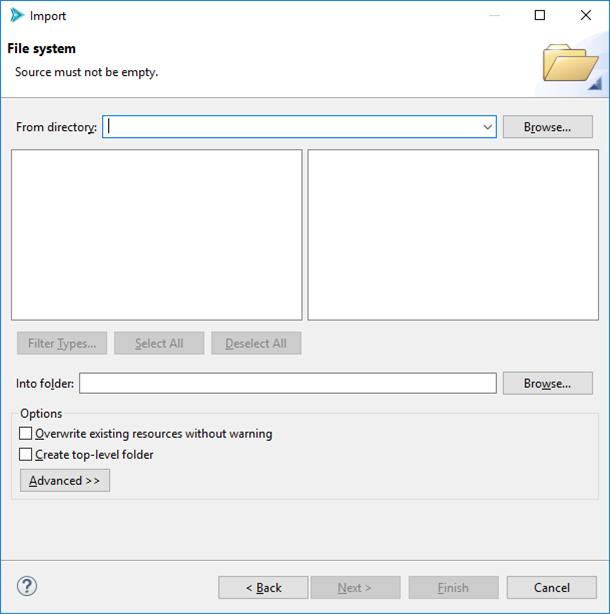
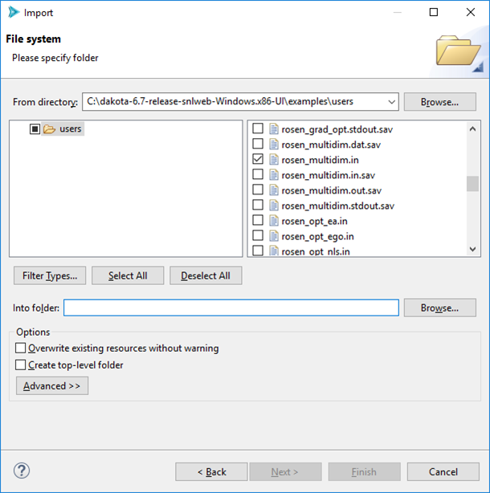

.. _gui-eclipse-main:

"""""""""""""""""
Eclipse Reference
"""""""""""""""""

============
Introduction
============

This section is intended to get new Dakota GUI users up to speed on Eclipse terminology and concepts. If you have used Eclipse-based applications previously, you may skip this section.

The Dakota GUI is built on the Eclipse platform. The Eclipse platform provides a highly customizable *integrated development environment* (or "IDE") for many different
popular programming languages. In this section, when we refer to something as being "an Eclipse feature", that means that it is something that is common to all distributions
of Eclipse, not just the Dakota GUI.

For more comprehensive reading about common Eclipse functionality, please refer to `Eclipse's official documentation. <https://help.eclipse.org/>`__

.. _gui-eclipse-menus:

=================
Menus and Actions
=================

Like most applications, you can expect to find a series of dropdown menus in the top-left corner of the screen. By default, the Dakota GUI provides
"File," "Edit," "Run," "Window," and "Help." Many of these are self-explanatory and provide functionality common to other applications. The menu options key
to running Dakota will be covered in later sections.

Underneath these menus are action icons. Pictured above are the default action items provided when you first open the Dakota GUI.

From left to right, the icons represent the following actions:

* **Save** Saves the currently selected file if there are unsaved changes (grayed out if there are no changes to save).
* **Save All** Saves all files in the workspace that have unsaved changes (grayed out if there are no changes to save).
* **Debug** Runs a debug configuration (currently not implemented in the Dakota GUI)
* **Run** Runs a run configuration.  Refer to the section on :ref:`running Dakota <gui-run-configurations-eclipse-run-configs>` for more information on using run configurations.
* **Back** Eclipse applications keep a history of which files you have viewed. This Back button returns to the last file viewed.
* **Forward** Go forward in history to the next most recently viewed file.
 
.. _gui-eclipse-workspace:

=============
The Workspace
=============

All Eclipse-based applications work off the idea that your files and folders exist in a single conceptual location called "the workspace."  The most common case is
for the workspace to exist as a single folder on your computer.  The workspace is where the Dakota GUI will create new files and folders while you work. Eclipse
applications also allow you to import files from elsewhere on your computer into the workspace.

When you open the Dakota GUI, by default, you will be presented with the following dialog:

This dialog allows you to choose which directory on your computer will act as the workspace.

In addition, the Eclipse platform allows you to have multiple workspaces on your system at once. This is handy if you are working on multiple large projects and don't
want to have to keep everything in view at once. When you switch to a new workspace, all the files and folders from the previous workspace will be hidden from view in
the GUI, and any files and folders in the newly-selected workspace will appear.

Changing the workspace is easy. Simply select File > Switch Workspace > Other, then provide the path to the new workspace.

.. _gui-eclipse-projects:

========
Projects
========

Within a workspace, you can have multiple "projects."  A project is a top-level, logical organization of files and folders. You can have as many or as few projects
as you like (though you need to have at least one to work in the Dakota GUI). Within a project, files and folders can be organized however you like.

.. _gui-eclipse-views:

=====
Views
=====

Eclipse applications divide their screen real estate into "views."  By default, Dakota GUI arranges its views as follows:

There are three main views shown here:

- **The Project Explorer (far left)**  The Project Explorer view lets you see all the folders and files that the Dakota GUI knows about in the currentworkspace.
  For certain files, the Project Explorer can also dive into the file content and provide hierarchical information about those files. For instance,
  a :ref:`Dakota input file can be expanded to graphically show all its keywords <gui-inputfiles-treeview>`.
- **Text Editor (top-right)** The text editor is the main area of the screen where you will view and edit files.  The text editor is primarily for viewing and
  editing Dakota input files, but it's capable of displaying the contents of any text-based file.
  
  - *Note:* In the above screenshot, you can see that the text editor provides :ref:`basic syntax coloring and warning/error messages for Dakota input files. <gui-inputfiles-errormarkup>`
  - *Note:* You can have multiple text files open at once. This is made possible via tabs across the top of the text editor.

- **Console (bottom-right)** The Dakota GUI's console acts the same as if you were running Dakota on the command line. This console shows both output and error
  streams coming from Dakota as it's running. You can distinguish which is which by color – the regular output stream is colored black, while error messages are colored in red.

There are many other useful views available in the Dakota GUI.  For instance, the Problems view provides a list of issues detected in your files.  To see the full list of views, go to Window > Show View > Other...

.. _gui-eclipse-perspectives:

============
Perspectives
============

The way that these three views are arranged on the screen is called a "perspective."  In Eclipse, perspectives can be rearranged to suit your particular
preference for how things should be visually organized. For instance, you may prefer to have the console above and the text editor below, or to move the Project
Explorer view to the right side of the screen.

Generally, rearranging a perspective in an Eclipse application can be achieved by left-clicking on the edge of a view and dragging to where you want the view to go.

Once you have arranged the views the way you like, you can save your perspective by going to Window > Perspective > Save Perspective As.

If you want to reset a particular perspective back to its default, go to Window > Perspective > Reset Perspective.

To see the full list of default perspectives shipped with the Dakota GUI, go to Window > Perspective > Open Perspective > Other.

.. _gui_eclipse-launch:

=====================
Launch Configurations
=====================

A "launch configuration" is a template for running an external process. For example, run configurations are the primary means of running Dakota studies in the GUI.
There are two main types of launch configurations in the Eclipse world – "run configurations" and "debug configurations." Debug configurations are not implemented
currently in the Dakota GUI, so this user manual will focus primarily on run configurations.

The Run Configurations Dialog
-----------------------------

The Run Configurations dialog provides information about past run configurations, and also gives you the controls to make new run configurations.
To access the Run Configurations dialog, select Run > Run Configurations from the top menu.

...or select the small down arrow next to the Run icon and select Run Configurations.

.. image:: img/Run_Configurations_2.png
   :alt: Other Run menu

(If these options are not available, turn them on by going to Window > Perspective > Customize Perspective.  Then, select the
Action Set Availability tab and make sure "Launch" is checked underneath the "Available action sets" column.)

.. image:: img/Run_Configurations_3.png
   :alt: The Run Configurations menu

Here, you can specify a configuration for running Dakota.  Creating a run configuration only needs to be done once (at minimum) to run a
Dakota input file.  After creating the run configuration, you can run Dakota again using the same configuration by pushing one button.
Also, you can make as many run configurations as you want.

To begin, double-click on the Dakota line in the list on the left.

.. image:: img/Run_Configurations_4.png
   :alt: Dakota run configuration options - Main Tab
   
Run Configuration History
-------------------------

After executing a run configuration, you can easily access it again by clicking the down arrow near the Run icon:

.. image:: img/Run_Configurations_6.png 
   :alt: Run history shortcuts

This menu keeps a history of recent previous run configurations.  Simply select the one you want to run – there is no need to open the Run
Configurations dialog again unless you want to reconfigure your run configuration.

.. _gui-eclipse-file_import:

===========
File Import
===========

You can import from elsewhere on your machine in one of three ways:

- If you are on the welcome screen for the Dakota GUI (select Help > Welcome if you want to get the Welcome screen back), select "Import Dakota study from
  your filesystem" under "Dakota Studies."  You will be presented with a file browser that will auto-import a Dakota input file into a new project.
- If you have already created a Dakota project, simply right-click on the Dakota project in the Project Explorer view and select "Import" from the context menu.
- You can also select File > Import (make sure you have created at least one project first).

For the latter two options, you will be presented with the Eclipse Import wizard.

From this first page, select General > File System. Then select Next.

Click on Browse (next to "From directory") and browse to the folder where your Dakota input file lives.  After selecting a folder, the Import wizard will populate with files from the folder. Select the one(s) you want.

Select Browse (next to "Into folder") to tell the Import wizard where to place your Dakota input file. You will need to have already created a project to place the input file in.

When you are done, click Finish.