.. _gui-preferences-main:

"""""""""""
Preferences
"""""""""""

============
Introduction
============

The Dakota GUI's main area for basic, global configurations can be found under Window > Preferences.

.. note::
   On Mac, this option is located under Dakota GUI > Preferences.

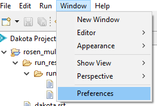

.. _gui-preferences-blackbox:

========
BlackBox
========

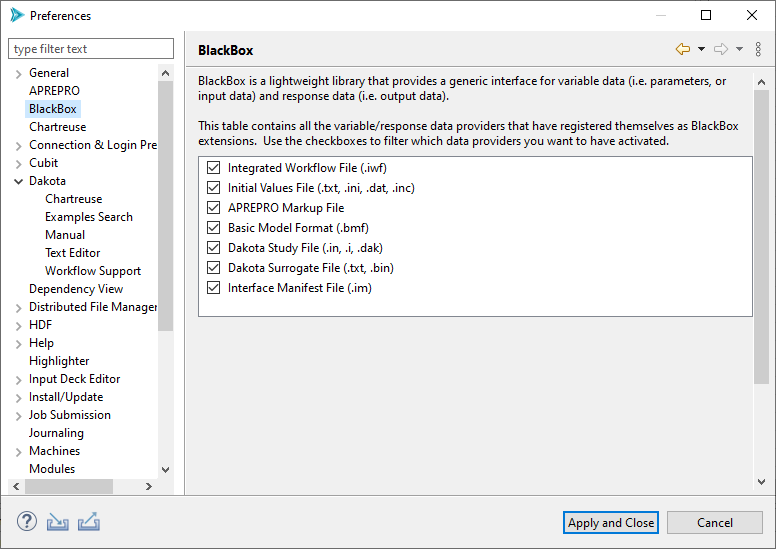

The Preferences page for BlackBox enables you to control which pre-processing template files are recognized by Dakota GUI. Recognizing pre-processing templates (done via
the file's extension) is crucial for taking advantage of pre-processing template files throughout the GUI (for example, in the New Dakota Study wizard).
Typically, you would want to have every box checked, but there may be situations where you want to uncheck boxes (i.e. force the GUI to *not* recognize a particular
format) if you are experiencing clashes between file extensions and recognized pre-processing strategies.

.. _gui-preferences-chartreuse:

==========
Chartreuse
==========

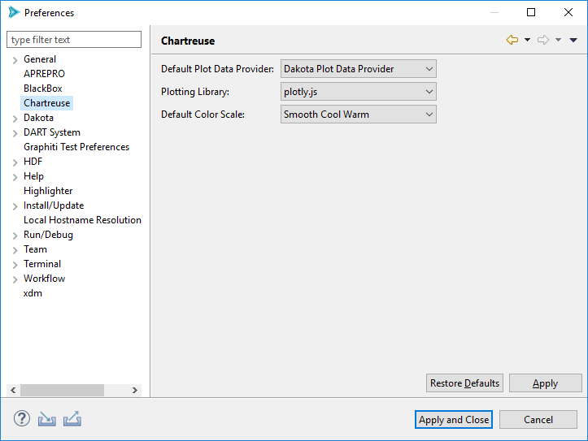

- **Default Plot Data Provider** If a file containing plottable content (for instance, Dakota tabular data files) is selected for graphical plotting,
  but Dakota GUI cannot make a determination about how to interpret it, this field determines the default plot data provider to use.
- **Plotting Library** This setting allows you to control which underlying plotting library is used to render graphical plots.
- **Allow plotting library to access online resources** If this box is checked, Chartreuse will attempt to download the latest version of the plotting library
  before rendering a plot. If unchecked, it will use a slightly older version of the plotting library shipped with the GUI.
  
  .. warning::

     This option should *always* remain unchecked if you are using Dakota GUI in an environment without Internet access! Otherwise, your plots will not render
     and you will only see a white screen in the Chartreuse plot editor area.
  
- **Default Color Scale** This setting allows you to decide which color scale is used by default for plots requiring a color scale (for instance, heatmaps).

  - See `"Color Map Advice for Scientific Visualization" by Kenneth Moreland. <https://www.kennethmoreland.com/color-advice/>`__
  
- **Default Font** Using this option, you can control the font and font size shown on your plot titles.
- **Default Axis Font Size** Using this option, you can control the size of the font written along each axis.
- **Default Tick Font Size** Using this option, you can control the size of the font written along tick lines.
- **Fast Plot Data Retrieval Option** For :ref:`fast plotting in the Chartreuse Sandbox <chartreuse-sandbox-main>`, the option selected in this dropdown
  will govern which data retrieval method is used by default.
- **Show dialog before sending plot data to Sandbox View** If checked, a dialog allowing you to change data retrieval methods
  will be displayed prior to creating a plot. See the :ref:`Chartreuse Sandbox <chartreuse-sandbox-main>` documentation for more information.

.. _gui-preferences-dakota:

======
Dakota
======

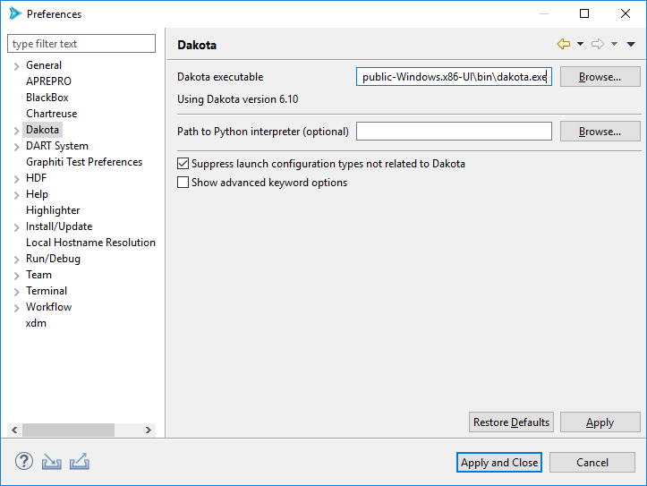

- **Dakota executable** The path to the Dakota executable.

   - *Note:* If the GUI can't automatically detect the location of your Dakota executable, this field will be blank and need to be manually configured the first time you use the GUI.
   
- **Path to Python interpreter (optional)** You can manually provide your own path to a Python interpreter.  If provided, this Python interpreter will be used by
  any Python-based driver scripts, overriding any other Python interpreters on your system path.
- **Suppress launch configurations** If this option is checked, Dakota GUI will
  hide :ref:`launch configuration types unrelated to running Dakota. <gui-run-configurations-eclipse-run-configs>`
- **Show advanced keyword options** If checked, all Dakota keyword options will be presented in
  the :ref:`Dakota Visual Editor. <gui-visual-editor-main>`  Otherwise, less common keywords will be hidden.

Dakota > Chartreuse
-------------------

The sheer number of Dakota configuration options for Chartreuse are vast:

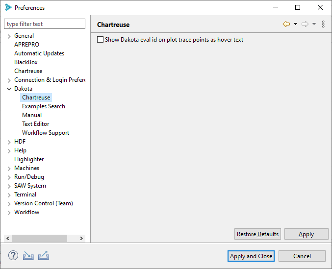

- **Show Dakota eval id on plot trace points as hover text**: This very specific configuration option should
  hopefully be self-evident, but if not, checking this will enable the display of Dakota's eval id number
  when hovering over plot trace points while using :ref:`Chartreuse <chartreuse-main>`.

.. _gui-preferences-dakota-examples:

Dakota > Examples Search
------------------------

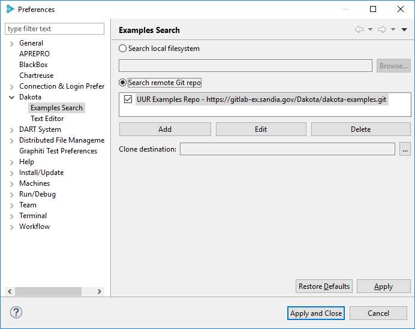

- Set the top-level radio button to "Search local filesystem" to cause the Dakota Examples Search dialog :ref:`to look for examples within the Dakota install directory <gui-examples-offline>`.
- Set the top-level radio button to "Search remote Git repo" to cause the Dakota Examples Search dialog :ref:`to look online for Dakota examples <gui-examples-online>`.

Remote Git Repo Configuration
~~~~~~~~~~~~~~~~~~~~~~~~~~~~~

Note that you can configure Dakota GUI to clone examples from not one but many repos.  To import from an online Git repo directly into your workspace, you must first tell the
Dakota GUI which repo you want to clone from, as well as provide credentials if necessary.

To add a new repository, click "Add."

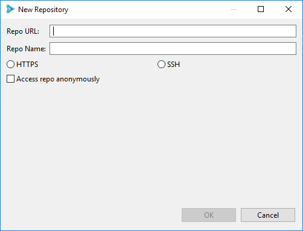

Provide the URL for your Git repo, as well as an optional name for your repo (to make it easier to find later, if you are cloning from a multitude of repos).

Then, choose HTTPS or SSH for your chosen protocol.  If you choose HTTPS, you can provide your Git username.  If you choose SSH, you can provide your public and private key files.

Check the "Access repo anonymously" button if you know your repository allows anonymous access, and you don’t want to be pestered with authentication pop-up dialogs.

When finished, click OK.

Back on the main Preferences dialog, if you wish to control the location on disk where your examples will initially be cloned, use the "Clone destination" file selection control
to provide a file path.  Otherwise, the Git repos will be cloned to a random temporary directory on your machine, which will get deleted by your operating system after
enough time has passed.

When finished, click "Apply and Close."

Dakota > Manual
---------------

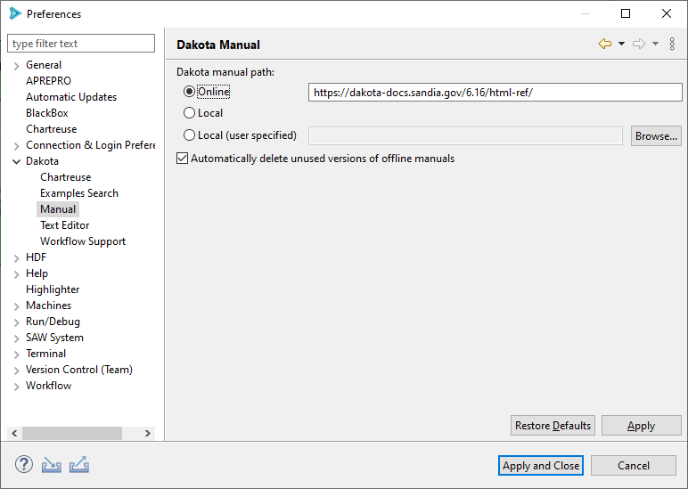

- **Dakota manual path** Configure where the Dakota GUI will look for the Dakota manual.  By default,
  the online version of the Dakota manual (hosted at dakota.sandia.gov) is used, but you can also switch to a local version of
  the manual if you are working without an Internet connection.

Dakota > Text Editor
--------------------

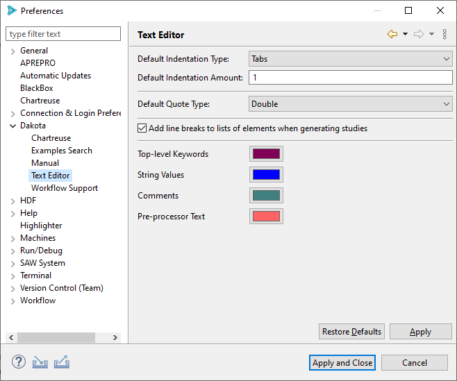
   
Configuration options for the Dakota text editor.

- **Default Indentation Type:** Specify whether to use tabs or spaces for indentation.
- **Default Indentation Amount:** Specify how many tabs or spaces to indent by.
- **Default Quote Type:** Specify whether single or double quotes are used for Dakota strings.
- **Add line breaks to lists of elements when generating studies:** Automatically formats element lists to make them easier to read.
- **Colors:** Configure the colors used in the Dakota Text editor

.. _gui-preferences-dakota-workflow:

Dakota > Workflow Support
-------------------------

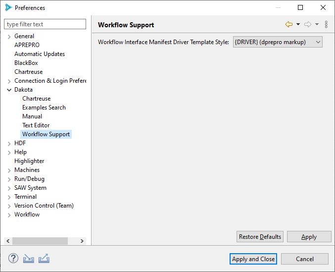
   
- **Workflow Interface Manifest Driver Template Style:** This configuration option allows you to specify the
  default pre-processing style when specifying a Next-Gen Workflow based driver for Dakota. There are two
  styles recognized by Dakota GUI:
  
  - *{DRIVER} (dprepro markup)* - uses DPREPRO to activate the relationship between a Dakota study and
    a Next-Gen Workflow analysis driver. Refer to the section on the :ref:`relationship between DREPRO and Next-Gen Workflow <ngw-analysisdrivers-dprepro>` for more information.
  - *SAW_DRIVER= (magic string)* - a legacy option for interacting with Next-Gen Workflow that is nevertheless
    still useful in some contexts. Refer to the section on the :ref:`usage of "SAW_DRIVER=" string <ngw-analysisdrivers-sawdriverstring>` here.

.. _gui-preferences-highlighter:

===========
Highlighter
===========

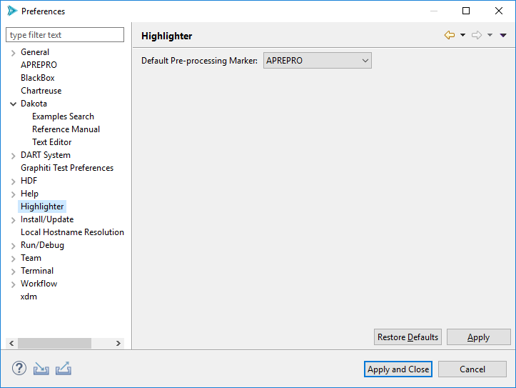

- **Default Pre-processing Marker** This setting controls what pre-processor markup type is used by default.

  - **APREPRO** APREPRO is an algebraic pre-processor that reads a file containing both general text and algebraic, string, or conditional expressions.
    `You can learn more about APREPRO here. <https://sandialabs.github.io/seacas-docs/sphinx/html/#aprepro>`__
  - **DPREPRO** DPREPRO is a Dakota-developed derivation of APREPRO with similar syntax.
    :ref:`You can learn more about DPREPRO here. <interfaces:dprepro-and-pyprepro>`
  - **Positional Preprocessor** A special type of pre-processor used by Dakota GUI.  Rather than marking up a text file, a positional pre-processor
    is an in-memory instruction that replaces a range of text characters at runtime.