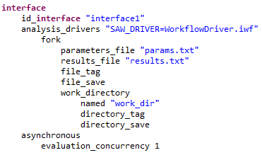
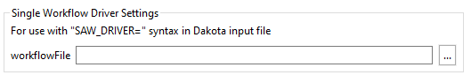
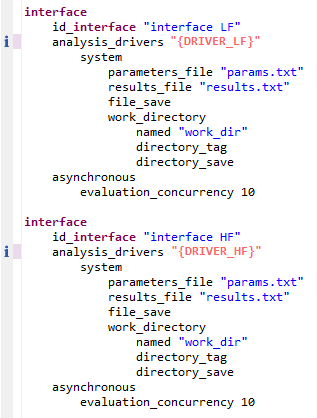

.. _ngw-analysisdrivers:

"""""""""""""""""""""""""""""""""""""""""""""""""""
Using Next-Gen Workflow as a Dakota Analysis Driver
"""""""""""""""""""""""""""""""""""""""""""""""""""

As far as Dakota GUI is concerned, NGW's primary purpose is to act as a visual editor for :ref:`analysis drivers <couplingtosimulations-main>`.
Since invoking an analysis driver for Dakota usually consists of a handful of steps (e.g. preparing input to the simulation model, executing it,
and returning the relevant values back to Dakota), the node-based workflow approach of NGW aligns nicely with this paradigm. In fact, NGW all but eliminates
the need to write a custom script as Dakota's analysis driver, if you wish to avoid low-level scripting. This is because many of the most common operations needed
for simulation model execution are already handled by nodes provided with NGW. NGW supports less common operations too, thanks to its "escape hatch" of providing scripting nodes: 
when in doubt, NGW can always return you to the flexibility of executing a difficult section of logic using a Python script, bash script, or something similar.

This page goes over some of the details for how Dakota interoperates with NGW - specifically, how NGW is invoked through the :ref:`analysis_drivers <interface-analysis_drivers>`
keyword, as well as why Dakota itself must be invoked with a second outer workflow. Finally, we go over the use case for :ref:`multiple analysis drivers <ngw-analysisdrivers-multiple>`.

If you are just looking for quick help with setting up a Next-Gen Workflow analysis driver for the first time,
refer to :ref:`this tutorial that walks you through setting up a simple Cantilever beam simulation model in Next-Gen Workflow <gui-nestedworkflowtutorial-main>`.

.. _ngw-analysisdrivers-sandwich:

---------------------------------------
Dakota Sandwiched Between Two Workflows
---------------------------------------

The current "recipe" for effectively using Dakota, Next-Gen Workflow, and DPREPRO goes like this:

1. Begin by creating a Next-Gen workflow that invokes your simulation model, whatever it is. The workflow should begin with input parameters and end with at least one output response.
   This workflow forms the **analysis driver** for Dakota.
2. Generate a **Dakota study** from this workflow using :ref:`the New Dakota Study Wizard <wizards-newdakotastudy>`, providing your previously-created workflow as the analysis driver.
   Depending on how you have :ref:`configured your GUI's settings <gui-preferences-dakota-workflow>`, the ``analysis_drivers`` keyword of the interface block will be either:
   
   - the DPREPRO pre-processing value ``"{DRIVER}"``, or...
   - a text string beginning with "SAW_DRIVER=", which is a legacy option. 
   
   The main thing to note at this point is that neither of these ``analysis_drivers`` values are executable in and of themselves. That's why we need the third step...
3. Create a second, outer workflow that is responsible for executing Dakota. This outer workflow is the one that should actually be run by the user, and it is responsible for creating the final linkages between
   Dakota and Next-Gen Workflow, using DPREPRO to replace the ``"{DRIVER}"`` string (or manually replace the "SAW_DRIVER=" string, for legacy situations). This outer workflow can be automatically generated using
   :ref:`the New Dakota Wrapper Wizard <wizards-newwrapperworkflow-main>`.
   
.. note::

   One of the benefits of this "sandwich" approach is that the outer workflow can be used to further collect output once Dakota has finished running, if the user wishes to add additional nodes after
   the Dakota node in the workflow.

.. _ngw-analysisdrivers-dprepro:

-----------------------------------------------------
Using DPREPRO to Connect Dakota and Next-Gen Workflow
-----------------------------------------------------

By default, a Dakota study with an NGW analysis driver (where the study was generated by the New Dakota Study Wizard) will have an interface block that looks something like this:

.. image:: img/Run_Using_Workflow_11.png
   :alt: Interface block with "{DRIVER}" interface

Before executing Dakota, the ``"{DRIVER}"`` string must be replaced using a pre-processing engine (our somewhat nepotistic choice is :ref:`DPREPRO <interfaces:dprepro-and-pyprepro>`).
Now, note that the "dakota" node provided in a Next-Gen workflow has the ability to automatically substitute pre-processing variables using data provided to its input ports.
You can see this in action with this example outer workflow:

.. image:: img/WrapperWorkflowWizard_4.png
   :alt: Example wrapper workflow
   
In this example, we have added a new input port to the "dakota" node simply called "DRIVER." This port is not standard for "dakota" nodes pulled off the NGW :ref:`Palette <ngw-basics-palette>`, but
as stated previously, any new input ports will be associated with pre-processing variables that have the same name, and data passed into those ports will become the values
that we substitute in. Because we have a "DRIVER" input port, the data coming into that port will replace the ``"{DRIVER}"`` pre-processing variable inside the Dakota
input file.

Therefore, it is the "dakotaWorkflowDriver" node (the bottom-left node in the workflow above) that ultimately provides the analysis driver to Dakota.

.. _ngw-analysisdrivers-sawdriverstring:

---------------------------------------------------
Using the "SAW_DRIVER" Magic String (Legacy Option)
---------------------------------------------------

Older versions of Dakota GUI and Next-Gen Workflow relied on a special "SAW_DRIVER" string to make the connection that is now handled through DPREPRO. "SAW_DRIVER" is now considered a
deprecated mechanism for connecting Dakota to Next-Gen Workflow, and we recommend replacing it with the DPREPRO syntax shown in this section. However, NGW still recognizes the special "SAW_DRIVER" 
string as a fallback option, if the modern DPREPRO mechanism does not suit your needs. "SAW_DRIVER" can become the default by :ref:`configuring the GUI appropriately <gui-preferences-dakota-workflow>`.

An example interface block generated by the New Dakota Study Wizard would look like this:

   
While this string does not execute anything by itself, it is recognized by Next-Gen Workflow, and Next-Gen Workflow can provide the actual executable analysis driver at runtime if it recognizes
this "SAW_DRIVER" string. The catch is that Dakota must be executed in an NGW context for the "SAW_DRIVER" string to be recognized. Hence the need for a second, outer workflow.

The New Dakota Study wizard provides an ``analysis_drivers`` value string of ``"SAW_DRIVER=<your driver name>"`` by default. The text that follows the ``=`` sign is assumed to be a relative filepath
to the workflow that will act as Dakota's analysis driver. So, in the screenshot, "WorkflowDriver.iwf" is in the same directory as the Dakota input file. If it were one directory level up, for example, then the analysis
driver value would be ``"SAW_DRIVER=../WorkflowDriver.iwf"``.

If the name of the analysis driver is not known at runtime, then you may still take advantage of the "SAW_DRIVER" approach. Simply shorten the analysis driver value string to ``"SAW_DRIVER"``, with no = sign or
a value following the = sign. The actual name of the workflow may instead be provided by the calling "dakota" node in the outer workflow.

Note this section displayed within the properties of the "dakota" node:

You may provide the path to the workflow file here, or provide yet another pre-processing variable (this time using NGW's ``${}`` syntax) if the name of the analysis workflow is not known.   

.. note::

   In this example, there is no need to include a "dakotaWorkflowDriver" node in your outer workflow. The information provided via the "SAW_DRIVER" string gives enough information to associate Dakota
   to the analysis driver in question.

------------------------------------------------
The dirty secret: We're still executing a script
------------------------------------------------

At this point, you may be wondering what it is exactly that is being substituted into the interface block of our Dakota study at the end of the day. If we're using DPREPRO, then it is inserting
a text value at runtime, originally provided by the "dakotaWorkflowDriver" node in our outer workflow. Similarly, if we're using "SAW_DRIVER," then NGW is inserting a text value that has something
to do with the relative path to the NGW workflow / analysis driver.

Behind the scenes, **NGW is creating a script on the fly** (a shell script if on Mac or Linux, and a bat script if on Windows). Or, to be more specific, the "dakotaWorkflowDriver" node is
responsible for spawning the correct driver script based on the provided information about your chosen analysis driver workflow. (If the "SAW_DRIVER" string is used, then it's the "dakota" node
that's responsible for determining the location of the analysis driver workflow and spawning the appropriate driver script.)

There are a couple reasons that this script is hidden from the user:

- Invoking the NGW engine on the command line involves the use of incredibly ugly command-line parameters that are best hidden from the user. Inserting the entire command to invoke
  NGW would make the Dakota input file very difficult to read.
- Hiding the script encourages new users to concentrate on the logic of their workflows, not on the nuances of shell script syntax or the uniquely diabolical terrors of Windows bat script syntax.
- The contents of the script are highly sensitive to paths, and thus not portable.
- The script has little use beyond the lifespan of the workflow.

If you wish, you may inspect the actual analysis driver script and see what it is doing by going into the workflow's working directory and looking for a file called ``dakotaDriver.sh`` (or ``dakotaDriver.bat``
on Windows). This file will be in a "dakota" folder if the "dakota" node is configured to run in a private working directory; otherwise, it will appear at the root of your workflow's working directory.
Despite the fact that we go to great lengths to hide this script from the user, it can be argued that it's good to know about its existence if things go wrong as you go about setting up your Dakota studies
with NGW drivers.

.. _ngw-analysisdrivers-multiple:

-------------------------------
Using Multiple Analysis Drivers
-------------------------------

Dakota GUI provides support for hooking up multiple, workflow-based analysis drivers to Dakota studies that have multiple interface blocks.  This is done by combining the features of DPREPRO and NGW.

For example, suppose we have two interface blocks in a given Dakota input file (as seen in multi-level multi-fidelity studies).  In these types of Dakota studies,
we interface to a low-fidelity model (LF) and a high-fidelity model (HF).  Instead of providing explicit paths to a low-fidelity driver and a high-fidelity driver following each
"analysis_drivers" keyword, let's add two pieces of DPREPRO markup - ``"{DRIVER_LF}"`` and ``"{DRIVER_HF}"`` (note the quotes).  The text within the DPREPRO brackets is arbitrary,
but the markup text must be consistent going forward.

Now, this Dakota study will not run by itself anymore, since the text now needs to be pre-processed.  Let's switch over to Next-Gen Workflow to create a workflow that will run Dakota for us.

There are two things that need to happen on this workflow.  The first is that we need to provide one dakotaWorkflowDriver node per analysis driver.  Each dakotaWorkflowDriver
node should point to the appropriate IWF file that will function as the analysis driver.

The second thing to do is to connect each dakotaWorkflowDriver node to a "dakota" workflow node using new input ports that match the text of the DPREPRO markup.
For example, we should add an input port called "DRIVER_LF" to correspond to our {DRIVER_LF} markup.  Then, the dakotaWorkflowDriver node that knows about the low-fidelity
analysis driver should be connected to this input port.  The same should be done with a "DRIVER_HF" input port and the dakotaWorkflowDriver node that knows about the high-fidelity analysis driver.

.. image:: img/Run_Using_Workflow_9.png
   :alt: Create input ports with matching labels

Once this is done, running the workflow will cause Dakota to execute the nested workflow analysis drivers as defined.
