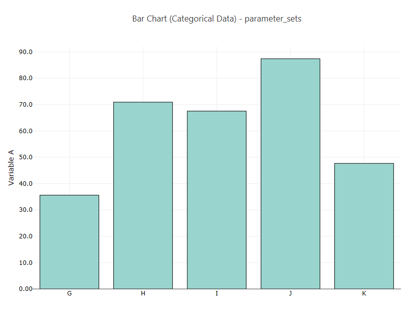

.. _ngw-node-categoricalBarCharts:

====================
categoricalBarCharts
====================

   
   Example categorical bar charts

-----------
Description
-----------

Given a Dakota-generated HDF5 file containing one or more discrete state sets, this node allows you
to use Chartreuse to plot that discrete state set data as a set of bar charts. One plot
file will be created per discrete state variable.

-----
Notes
-----

- This node is specifically tailored to pull data from Dakota-generated HDF files. It
  will not work with other types of Dakota output files, nor will it work with arbitrary HDF databases.
- This node is solely responsible for writing the plot files to disk. It is not necessary to use file nodes in your workflow to save the plots.
- After generating and saving the plot file(s), you are free to further modify the plot
  using the "Chartreuse > Edit plot" context menu option.

----------
Properties
----------

- **method**: The Dakota method ID used to locate the correct discrete state set variables. If
  the Dakota study only contained one method block, this field can be left blank.
- **xAxisLabel**: Provide a custom label for the horizontal axis of your bar chart.
- **yAxisLabel**: Provide a custom label for the vertical axis of your bar chart.
- **outputFilePrefix**: Use this field to apply a common prefix to each generated plot file.
  This can help to prevent unintentional overwriting of plot data if the workflow is run
  multiple times.

-----------
Input Ports
-----------

- **hdfFile**: the Dakota-generated HDF input file.
- **dataFilter**: a filter data structure that allows you to filter which variables and
  responses that will be plotted in the bar charts. See the :ref:`"BlackBox > dataFilter" <ngw-node-dataFilter>` node.

------------
Output Ports
------------

None.
