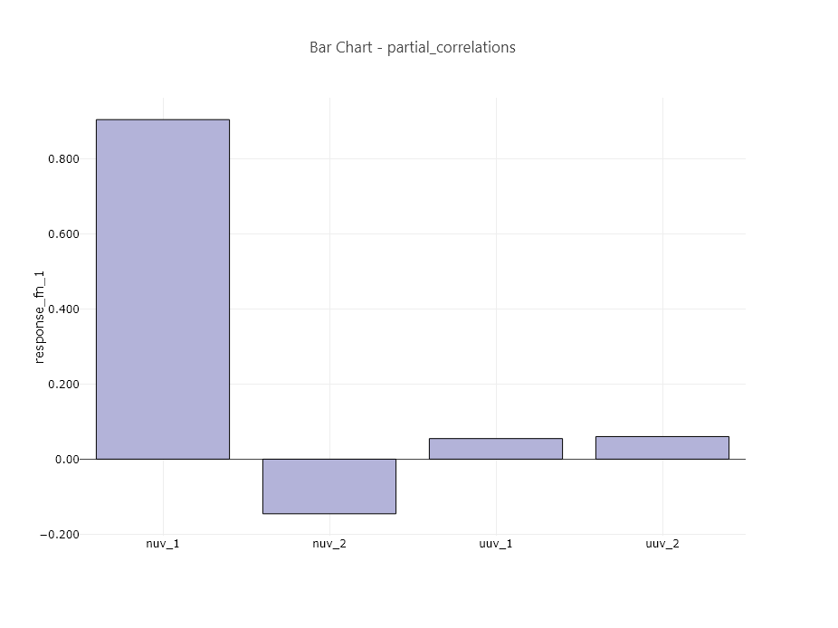

.. _ngw-node-hdfTraceBarChartPartialCorrelation:

==================================
hdfTraceBarChartPartialCorrelation
==================================

   
   Example partial correlation bar chart

-----------
Description
-----------

Using Chartreuse, this node creates a bar chart from a :ref:`partial correlation <uq:correlationtypes>` dataset
contained in a Dakota-generated HDF5 database file.

-----
Notes
-----

This node is specifically tailored to pull data from Dakota-generated HDF5 files. It
will not work with other types of Dakota output files, nor will it work with arbitrary HDF5
databases.

----------
Properties
----------

- **orientVertically**: If checked, the bar chart will be oriented vertically (i.e. pointing up
  and down). Otherwise, the bar chart will be oriented horizontally (i.e. pointing left and right).
- **normalizeData**: If selected, the bar magnitude will be normalized between 0 and 1.
- **sort**: If checked, the bars in the bar chart will be sorted according to absolute value
  magnitude (i.e. tornado plot sorting).

-----------
Input Ports
-----------

- **hdfFile**: the Dakota-generated HDF input file.

------------
Output Ports
------------

- **plotFileDataOut**: A complete, serialized version of the plot that can be written out to a file for later viewing.
  Use a file node to save your plot to a file.