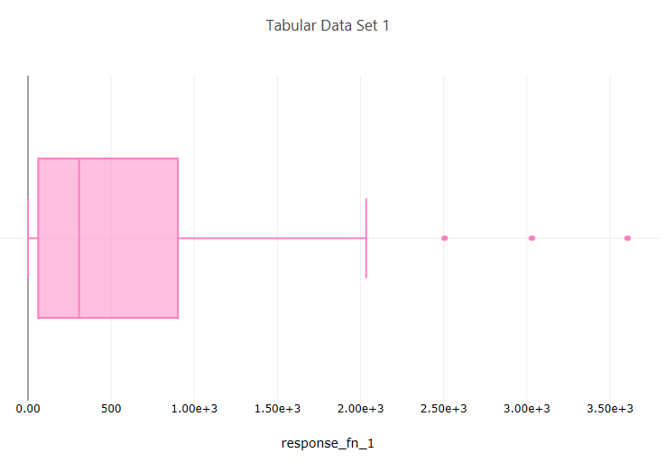

.. _ngw-node-hdfTraceBoxPlot:

===============
hdfTraceBoxPlot
===============

   
   Example box plot

-----------
Description
-----------

Using Chartreuse, this node allows you to create a box-and-whiskers plot
of a dataset from a Dakota-generated HDF5 file.

-----
Notes
-----

This node can create either an individual trace (which can be further aggregated onto larger plots
using the :ref:`plotCanvas <ngw-node-plotCanvas>` and :ref:`plotWindow <ngw-node-plotWindow>` nodes),
or a complete plot file, which can simply be piped to a file node without further work. See the two
output ports "trace" and "plotFileDataOut" for this node. 

This node is specifically tailored to pull data from Dakota-generated HDF files. It will not work with
other types of Dakota output files, nor will it work with arbitrary HDF databases.

---------------------
Dakota HDF Properties
---------------------

- **model**: The model from the Dakota study that is parent to the variables and responses of interest.
  You can either provide the ID of the model from the original Dakota input file, or the HDF5 database
  path to a specific model group. If the Dakota study only contained one model, then this field can
  be left blank.
- **dataLabel**: The variable or response label to use for the box plot.

---------------------
Chartreuse Properties
---------------------

- **Trace Name**: The name of the trace. If this node is the final destination on the way to displaying
  the plot, this field will be used as the plot's title that displays across the top. Otherwise,
  this field can be used to identify the trace among several traces (for instance, by using the legend
  provided with the plotWindow node).
- **Orientation**: You can choose a horizontal or vertical orientation for the box-and-whiskers plot.
- **Trace Color**: You can choose a fill color for the boxes in the box-and-whiskers plot.

-----------
Input Ports
-----------

- **hdfFile**: the Dakota-generated HDF input file.

------------
Output Ports
------------

- **trace**: The data of the plot trace. Use this to forward the plot trace for further aggregation
  onto aplot canvas.
- **plotFileDataOut**: A complete, serialized version of the plot that can be written out to a file
  for later viewing.Use a file node to save your plot to a file.
