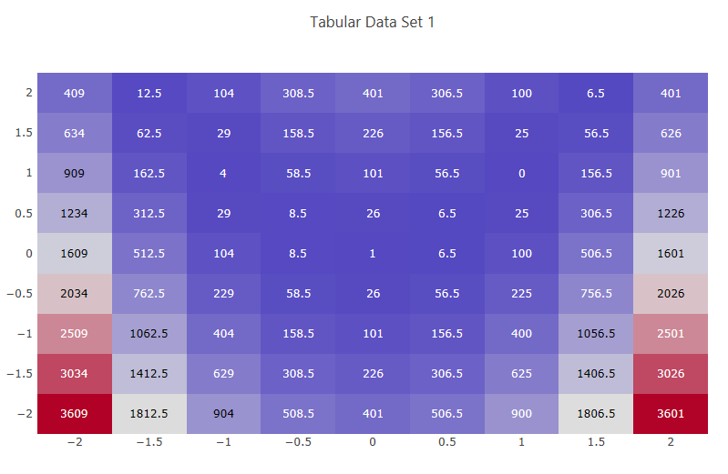

.. _ngw-node-hdfTraceHeatMap:

===============
hdfTraceHeatMap
===============

   
   Example heatmap

-----------
Description
-----------

Using Chartreuse, this node allows you to create a heatmap of a dataset from a Dakota-generated HDF5 file.

-----
Notes
-----

This node is specifically tailored to pull data from Dakota-generated HDF5 files. It
will not work with other types of Dakota output files, nor will it work with arbitrary HDF5 databases.

---------------------
Dakota HDF Properties
---------------------

- **model**: The model from the Dakota study that is parent to the variables and responses
  of interest. You can either provide the ID of the model from the original Dakota input file,
  or the HDF5 database path to a specific model group. If the Dakota study only contained one model,
  then this field can be left blank.
- **xLabel**: The variable or response label to use for the X data of the heatmap.
- **yLabel**: The variable or response label to use for the Y data of the heatmap.
- **zLabel**: The variable or response label to use for the Z data of the heatmap.

---------------------
Chartreuse Properties
---------------------

- **Trace Name**: The name of the trace. If this node is the final destination on the way to displaying
  the plot, this field will be used as the plot's title that displays across the top. Otherwise,
  this field can be used to identify the trace among several traces (for instance, by using the legend
  provided with the plotWindow node).
- **Color Scale Settings**: The Color Scale settings group allows you to create ranges of colors across
  your plot. Refer to the main :ref:`Color Scale documentation <chartreuse-color-scales>` for more information.
- **Show Color Scale Legend**: Display a bar next to your plot that indicates color scale ranges.

-----------
Input Ports
-----------

- **hdfFile**: the Dakota-generated HDF input file.

------------
Output Ports
------------

- **plotFileDataOut**: A complete, serialized version of the plot that can be written out to a file for
  later viewing. Use a file node to save your plot to a file.