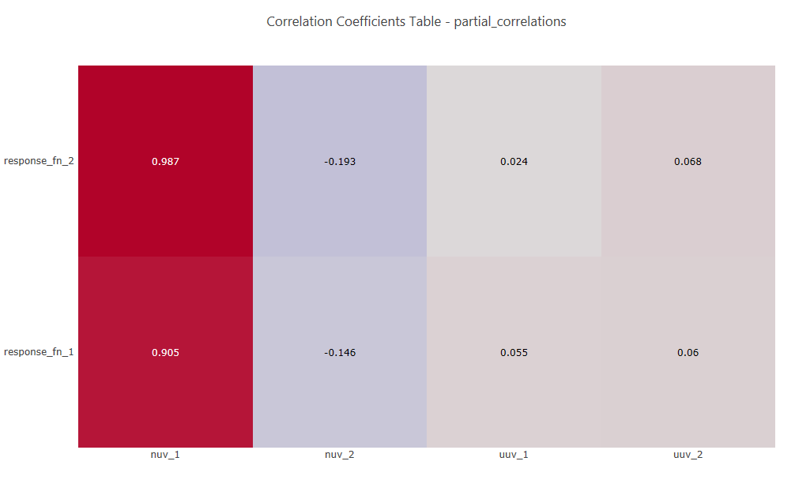

.. _ngw-node-hdfTraceHeatMapPartialCorrelation:

=================================
hdfTraceHeatMapPartialCorrelation
=================================

   
   Example partial correlation heatmap

-----------
Description
-----------

Using Chartreuse, this node creates a heatmap from a :ref:`partial correlation <uq:correlationtypes>` dataset
contained in a Dakota-generated HDF5 database file.

-----
Notes
-----

This node is specifically tailored to pull data from Dakota-generated HDF5 files. It
will not work with other types of Dakota output files, nor will it work with arbitrary HDF5 databases.

----------
Properties
----------

- **id_method**: The Dakota method ID used to locate the correct partial correlation dataset. If
  the Dakota study only contained one method block, this field can be left blank.
- **responsesAlongVerticalAxis**: If checked, the partial correlation matrix will be oriented so
  that responses are along the vertical axis and variables are along the horizontal axis.

-----------
Input Ports
-----------

- **hdfFile**: the Dakota-generated HDF input file.

------------
Output Ports
------------

- **plotFileDataOut**: A complete, serialized version of the plot that can be written out to a file
  for later viewing. Use a file node to save your plot to a file.