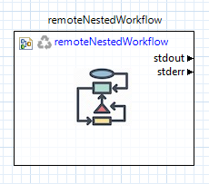
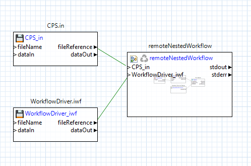
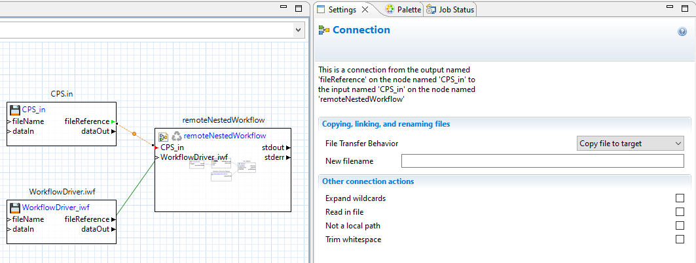
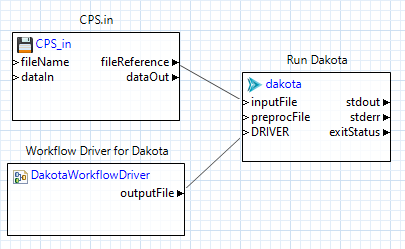
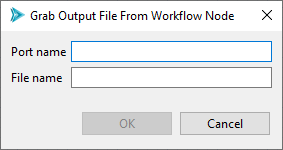
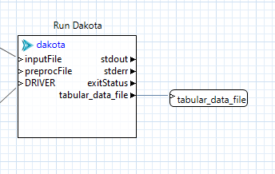
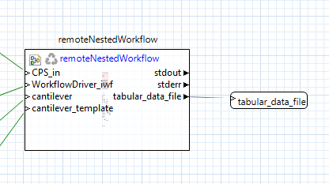

.. _gui-job-submission-workflow-remoteNestedWorkflow:

.. _ngw-node-remoteNestedWorkflow:

====================
remoteNestedWorkflow
====================

   The remoteNestedWorkflow node

-----------
Description
-----------

The remoteNestedWorkflow node is the cornerstone of job submission capabilities in Next-Gen Workflow. Its primary purpose is to transfer sub-workflows (or "nested workflows")
to remote machines, and execute them there.

.. note::

   You may also wish to consult `the official NGW node documentation site <https://dart.sandia.gov/ngw/reference/nodes/components/remoteNestedWorkflow.html>`__ to learn more about the remoteNestedWorkflow node.

----------
Properties
----------

- **fileName**: The name of the local workflow to transfer to the remote machine
- **hostname**: The hostname for the remote machine.
- **username**: Your username to log in to the remote machine.

  .. warning::
  
     Login credentials for the remote machine must have already been previously configured. For example, you will not recieve an opportunity to type in your password
     once the workflow has begun executing. Refer to Window > Preferences > Connection & Login Preferences to set your login credentials.
	 
- **remotePath**: The working directory on the remote machine.
- **clearRemoteWorkdir**: Check this box to clean the remote working directory before remote workflow execution.
- **wflib**: The path to Next-Gen Workflow's installation on the remote machine.

  .. warning::

     A presupposition of the remoteNestedWorkflow node is that the server/headless version of Next-Gen Workflow is already installed and available on the remote machine. Talk
     to your system administrator to ensure that Next-Gen Workflow has already been installed on whatever machine you will be submitting your workflow to.
	 
- **Other files/directories**: A comma-separated list of files and folders that also need to be sent to the remote machine. However, the preferred way to send additional files
  is via additional input ports.

-----------
Input Ports
-----------

No input ports are provided by default. Instead, you must add input ports for any data that you want passed to the remote machine.

------------
Output Ports
------------

- **stdout**: The stdout stream of the remote NGW process running on the remote machine.
- **stderr**: The stderr stream of the remote NGW process running on the remote machine.
  
.. _gui-job-submission-workflow-remoteNestedWorkflow-sendfiles:

---------------------------
Usage Notes - Sending Files
---------------------------

If you need to send additional files from your local machine to the remote machine, simply create new input ports on the remoteNestedWorkflow node and connect the "fileReference" output ports
of your file node to the new input port, like so:

   An example workflow with a remoteNestedWorkflow node and "Copy file to target" file transfer behavior

Note that the connections between the file nodes and the remoteNestedWorkflow node are green. Green lines denote that the File Transfer Behavior of the connection is set to "Copy file to target,"
since the file must be moved from the local machine to the remote machine.

   Green lines designate "Copy file to target" behavior

.. _gui-job-submission-workflow-remoteNestedWorkflow-receivefiles:

-----------------------------
Usage Notes - Receiving Files
-----------------------------

To send remote files back to your local machine after the entire workflow has completed execution, you will need to create output ports and response nodes for each file or
folder you want to bring back. Additionally, you will need to do this at every "level" of the workflow, starting from the point at which the files originate.
Finally, you will need to set all this up *before* you run the workflow, not afterwards.

Let's assume we want to retrieve a Dakota tabular data file from a remote machine. Let's further assume that Dakota ran on the remote machine via Next-Gen Workflow, like so:

   Example remote workflow

In our example, because Dakota ran on the remote machine, we will need to retrieve the tabular data file from the remote machine. But how do we do that?
Well, because it is the Dakota process that generates this output file, we can use the "Grab Output File" option on the "dakota" node shown in :numref:`jobsubnodes:figure04`.

Right-click the "dakota" node and choose "Grab Output File" from the context menu. You will be presented with the following dialog:

   "Grab Output File" dialog

Enter "tabular_data_file" (or something similar) in the "Port name" field, and enter the name of the tabular data file in the "File name" field. In our example,
"tabular.data" is the name that Dakota uses for its tabular data output in this example.

Click OK on this dialog, which will result in a new output port, "tabular_data_file," being added to your "dakota" node. Now, pass the data from this output port to a response node, like so:

   Attaching nodes to output ports

Doing all this will result in the *path to the tabular data file* being provided as an output response of our remote workflow.

This is all well and good, but we still need to send the file back to our local machine.

Back on our local machine, manually add an output port to the "remoteNestedWorkflow" node that was used to launch the remote workflow, using the Output Ports tab in the Settings editor
(there is no need to use the "Grab Output File" shortcut dialog here). This new output port should be called "tabular_data_file" (it should mirror
the response node we set up in the other workflow). As before, pass the data from this output port to a response node:

   Attaching nodes to output ports part 2

Now, when you run this workflow to completion, Dakota's tabular data file will be returned to your local machine. You can follow this same process for any remote output file.