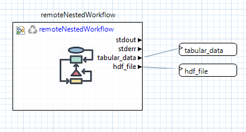

.. _gui-job-submission-workflow-remoteNestedWorkflow:

.. _ngw-node-remoteNestedWorkflow:

====================
remoteNestedWorkflow
====================

.. figure:: img/JobSubmission_NGW_1.png
   :name: jobsubnodes:figure01
   :alt: The remoteNestedWorkflow node
   :align: center

   The remoteNestedWorkflow node

-----------
Description
-----------

The remoteNestedWorkflow node is the cornerstone of job submission capabilities in Next-Gen Workflow. Its primary purpose is to transfer sub-workflows (or "nested workflows")
to remote machines, and execute them there.

.. note::

   You may also wish to consult `the official NGW node documentation site <https://dart.sandia.gov/ngw/reference/nodes/components/remoteNestedWorkflow.html>`__ to learn more about the remoteNestedWorkflow node.

----------
Properties
----------

- **fileName**: The name of the local workflow to transfer to the remote machine
- **hostname**: The hostname for the remote machine.
- **username**: Your username to log in to the remote machine.

  .. warning::
  
     Login credentials for the remote machine must have already been previously configured. For example, you will not recieve an opportunity to type in your password
     once the workflow has begun executing. Refer to Window > Preferences > Connection & Login Preferences to set your login credentials.
	 
- **remotePath**: The working directory on the remote machine.
- **clearRemoteWorkdir**: Check this box to clean the remote working directory before remote workflow execution.
- **wflib**: The path to Next-Gen Workflow's installation on the remote machine.

  .. warning::

     A presupposition of the remoteNestedWorkflow node is that the server/headless version of Next-Gen Workflow is already installed and available on the remote machine. Talk
     to your system administrator to ensure that Next-Gen Workflow has already been installed on whatever machine you will be submitting your workflow to.
	 
- **Other files/directories**: A comma-separated list of files and folders that also need to be sent to the remote machine. However, the preferred way to send additional files
  is via additional input ports.

-----------
Input Ports
-----------

No input ports are provided by default. Instead, you must add input ports for any data that you want passed to the remote machine.

------------
Output Ports
------------

- **stdout**: The stdout stream of the remote NGW process running on the remote machine.
- **stderr**: The stderr stream of the remote NGW process running on the remote machine.
  
.. _gui-job-submission-workflow-remoteNestedWorkflow-sendfiles:

---------------------------
Usage Notes - Sending Files
---------------------------

If you need to send additional files from your local machine to the remote machine, simply create new input ports on the remoteNestedWorkflow node and connect the "fileReference" output ports
of your file node to the new input port, like so:

.. figure:: img/JobSubmission_NGW_Example1_1.png
   :name: jobsubnodes:figure02
   :alt: An example workflow with a remoteNestedWorkflow node and "Copy file to target" file transfer behavior
   :align: center

   An example workflow with a remoteNestedWorkflow node and "Copy file to target" file transfer behavior

Note that the connections between the file nodes and the remoteNestedWorkflow node are green. Green lines denote that the File Transfer Behavior of the connection is set to "Copy file to target,"
since the file must be moved from the local machine to the remote machine.

.. figure:: img/JobSubmission_NGW_4.png
   :name: jobsubnodes:figure03
   :alt: Green lines designate "Copy file to target" behavior
   :align: center

   Green lines designate "Copy file to target" behavior

.. _gui-job-submission-workflow-remoteNestedWorkflow-receivefiles:

-----------------------------
Usage Notes - Receiving Files
-----------------------------

To send remote files back to the local machine after the remoteNestedWorkflow has completed execuion, you will need to create output ports for each file or folder you want to bring back.

Right-click the remoteNestedWorkflow node and choose "Grab Output File" from the context menu. You will be presented with the following dialog:

.. figure:: img/JobSubmission_NGW_3.png
   :name: jobsubnodes:figure04
   :alt: "Grab Output File" dialog
   :align: center

   "Grab Output File" dialog
	 
This dialog will allow you to specify the name of the file as well as the name of the remote file (relative to the working directory of remoteNestedWorkflow).

After setting output ports on your remoteNestedWorkflow node, you can do whatever you wish with the returned files.

   An example of returning files to your local machine
	 
.. note::

   For file-grabbing behavior, you can specify a wildcard pattern for the file/folder to be grabbed. This will cause NGW to grab every file/folder on the remote machine that matches the wildcard pattern.
