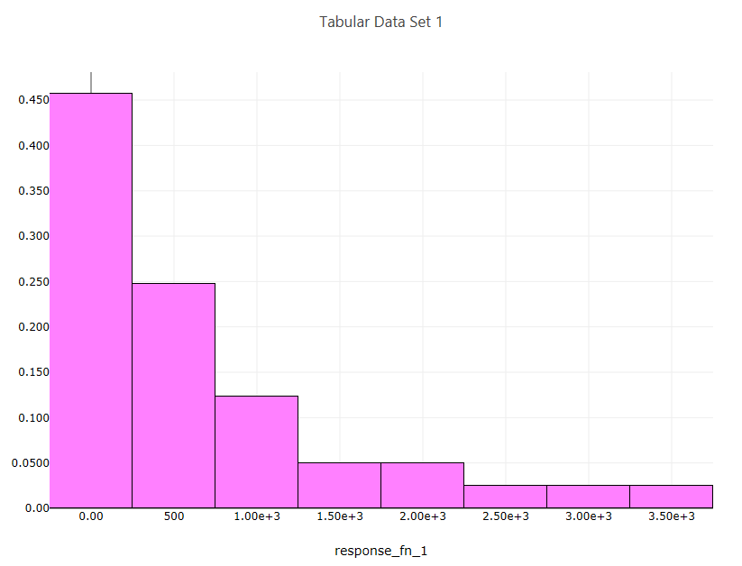

.. _ngw-node-traceHistogram:

==============
traceHistogram
==============

   
   Example histogram

-----------
Description
-----------

Creates a histogram from a one-dimensional dataset.

----------
Properties
----------

- **Trace Name**: The name of the trace. If this node is the final destination on the way to displaying
  the plot, this field will be used as the plot's title that displays across the top. Otherwise,
  this field can be used to identify the trace among several traces (for instance, by using the legend
  provided with the :ref:`plotWindow <ngw-node-plotWindow>` node).
- **Number of Bins**: Specify a "recommended" number of bins for your histogram. Most underlying plotting
  libraries use a smart binning algorithm based on the data, so this value is just a guideline.
- **Histogram Type**: The type of your histogram. 

  - Count: The span of each bar corresponds to the number of occurrences (i.e. the number of data points lying inside the bins).
  - Percent: The span of each bar corresponds to the percentage / fraction of occurrences with respect to the total number of sample points (here, the sum of all bin HEIGHTS equals 100% / 1).
  - Probability: The span of each bar corresponds to the percentage / fraction of occurrences with respect to the total number of sample points (here, the sum of all bin HEIGHTS equals 100% / 1).
  - Density: The span of each bar corresponds to the number of occurrences in a bin divided by the size of the bin interval (here, the sum of all bin AREAS equals the total number of sample points).
  - Probability Density: The area of each bar corresponds to the probability that an event will fall into the corresponding bin (here, the sum of all bin AREAS equals 1).

- **Display as Cumulative**: This option will enable a cumulative histogram, where values are added as the histogram proceeds.
- **Orientation**: Whether the histogram is oriented vertically (histogram bars are pointing up and down) or horizontally (histogram bars are pointing left and right)
- **Bar Color**: The color of the histogram bars.

-----------
Input Ports
-----------

- **data**: The one-dimensional dataset to use for the histogram plot.

------------
Output Ports
------------

- **trace**: The data of the plot trace. Use this to forward the plot trace for further aggregation onto aplot canvas.
- **plotFileDataOut**: A complete, serialized version of the plot that can be written out to a file for later viewing.
  Use a file node to save your plot to a file.
