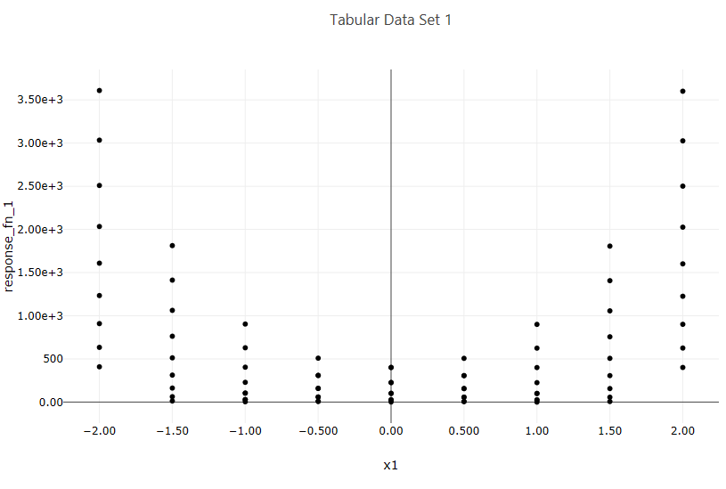

.. _ngw-node-traceScatterPlot2d:

==================
traceScatterPlot2d
==================

   
   Example scatter plot

-----------
Description
-----------

Creates a 2D scatter plot from a two-dimensional dataset.

----------
Properties
----------

- **Trace Name**: The name of the trace. If this node is the final destination on the way to displaying
  the plot, this field will be used as the plot's title that displays across the top. Otherwise,
  this field can be used to identify the trace among several traces (for instance, by using the legend
  provided with the :ref:`plotWindow <ngw-node-plotWindow>` node).
- **Trace Color**: You can choose a color for the dots and/or line that comprises your scatter plot trace.
- **Dot Type**: This dropdown allows you to choose a shape for the dots in your scatter plot trace.
- **Connect Dots**: Toggles whether or not a line should be drawn between each dot of your scatter plot trace.
- **Linear Regression**: If toggled, draws an additional linear regression line over your scatter plot trace data.
- **Trim No Change**: Eliminates "uninteresting" data from your scatter plot along the axis selected. This is useful
  for sensitivity analysis studies where you may have a range of time where a variable was not doing anything
  while other variables were being explored.
- **Normalize Data**: Normalizes data between 0 and 1 for the axis selected from the dropdown.

-----------
Input Ports
-----------

- **X**: Data for the X axis. If this input port is left blank, the X axis will assume monotonically-increasing
  numbers, so that the other axis can still be plotted in one dimension.
- **Y**: Data for the Y axis. If this input port is left blank, the Y axis will assume monotonically-increasing
  numbers, so that the other axis can still be plotted in one dimension.

------------
Output Ports
------------

- **trace**: The data of the plot trace. Use this to forward the plot trace for further aggregation onto aplot canvas.
- **plotFileDataOut**: A complete, serialized version of the plot that can be written out to a file for later viewing.
  Use a file node to save your plot to a file.
