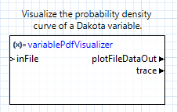

.. _chartreuse-ngw-uncertainty-variables:

.. _ngw-node-variablePdfVisualizer:

=====================
variablePdfVisualizer
=====================

-----------
Description
-----------

This node allows you to visualize the probability density function (PDF) associated withan uncertain
variable from a Dakota study, using Chartreuse as the plotting library.

To use this node, simply provide the Dakota input file as a "file" node on the canvas, and pipe
its "fileReference" output port to the "inFile" input port of this node. In addition, provide the
descriptor of the variable you want to visualize in this node's Settings Editor.

Note that this node has the familiar "plotFileDataOut" and "trace" output ports seen on other
Chartreuse nodes.  This means that Dakota variable PDF curve plots can be combined with other
types of Chartreuse plotting nodes (for example,
:ref:`aggregating traces onto the same canvas <chartreuse-ngw-main-multiple-trace-tutorial>`).

----------
Properties
----------

- **variable**: The descriptor of the variable to visualize.

-----------
Input Ports
-----------

- **inFile**: the Dakota input file.

------------
Output Ports
------------

- **trace**: The data of the plot trace. Use this to forward the plot trace for further aggregation onto a
  plot canvas.
- **plotFileDataOut**: A complete, serialized version of the plot that can be written out to a file for
  later viewing. Use a file node to save your plot to a file.
