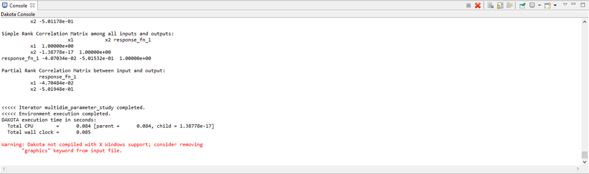
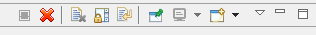

.. _gui-run-dakota-console:

""""""""""""""""""""""
Dakota Console Options
""""""""""""""""""""""

When Dakota is running, it displays its console output in the Console view:

There are some actions available in the Console view that you should be aware of:

From left to right:

- **Terminate** Attempts to stop Dakota from running further.  This icon will be grayed out if Dakota is not running.
- **Remove Console** Close the console view.  You can always bring the console back from the list of views (Window > Show View > Other… then select General > Console).
- **Clear Console** Rather than closing the whole console, this action simply clears all of the text and leaves the console open.
- **Scroll Lock** Toggle scroll lock on the console.
- **Word Wrap** Toggle word wrap for the console.
- **Pin Console** Pins the console to the front.  If you have multiple consoles open, pinning keeps the current one in focus.
- **Display Selected Console** Allows you to switch between multiple open consoles.
- **New Console View** Opens a new console.