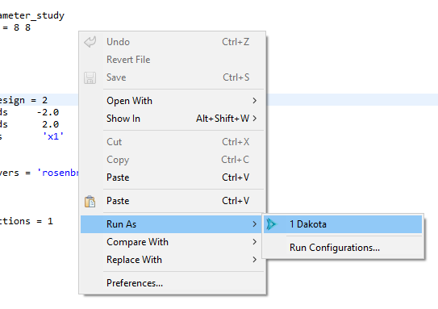
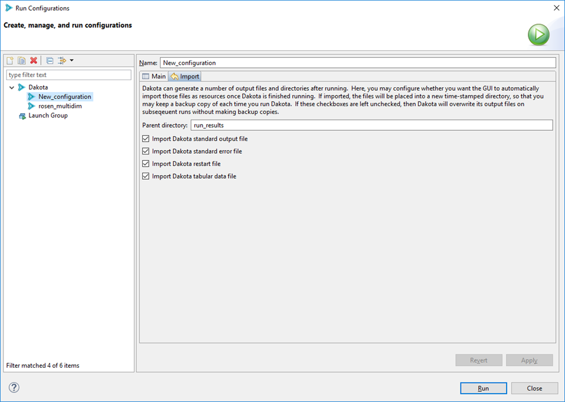
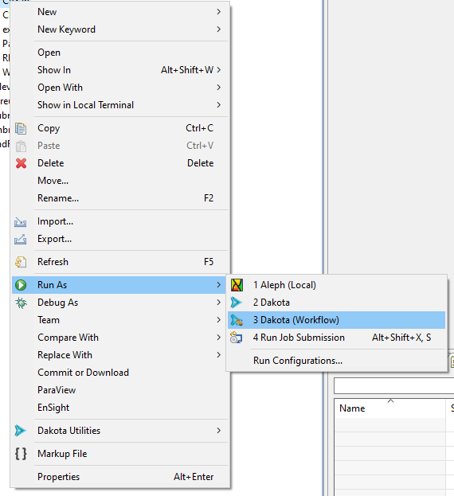
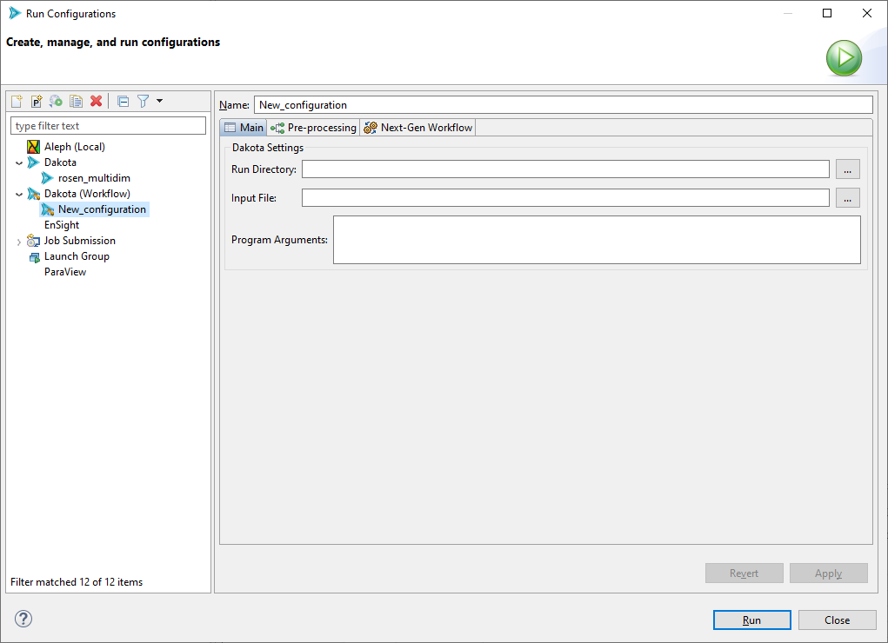
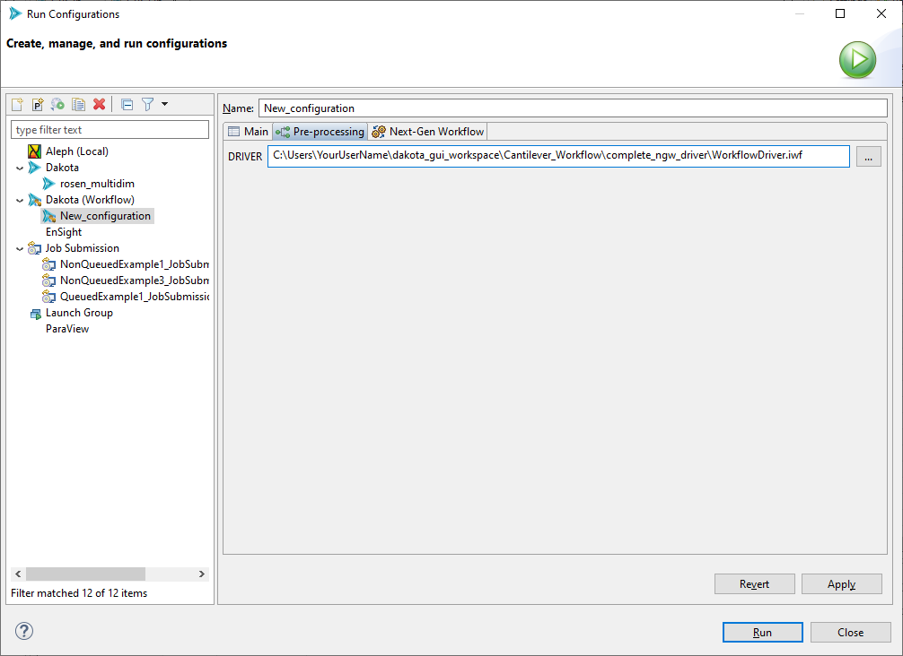
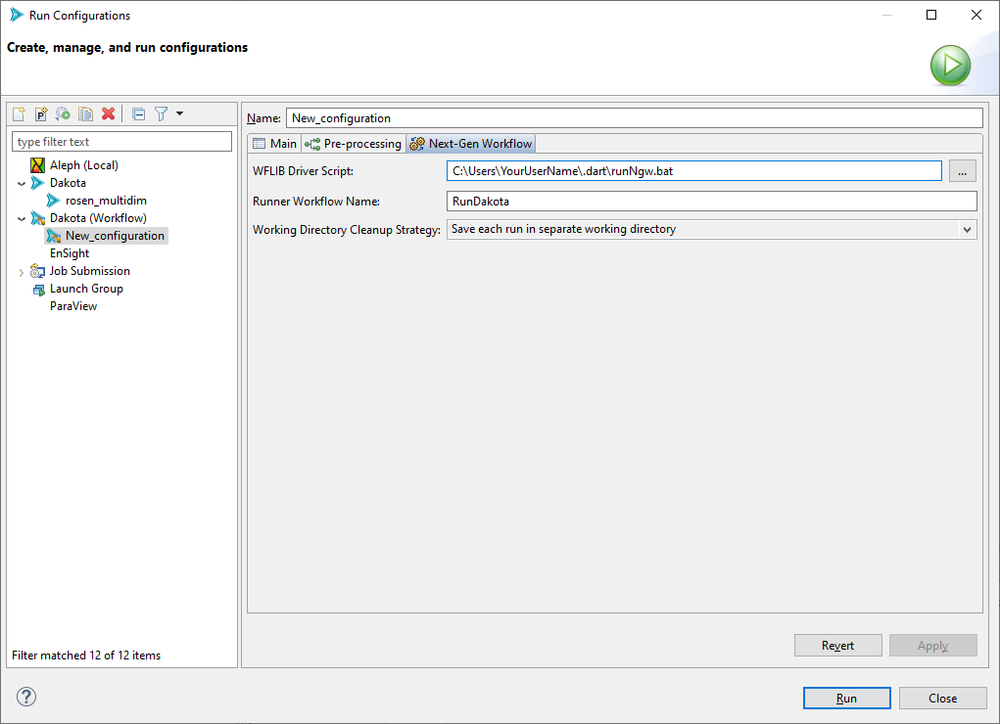

.. _gui-run-configurations-eclipse-run-configs:

"""""""""""""""""""""""""""""""""""
Run Dakota Using Run Configurations
"""""""""""""""""""""""""""""""""""

Creating a run configuration to run Dakota is a straightforward process for most cases, and is designed to save you lots of time after the first setup of a run configuration.

.. note::

   If you are new to the concept of run configurations, please read the :ref:`general Eclipse-based documentation on run configurations first.<gui_eclipse-launch>`

--------------------------
"Dakota" Run Configuration
--------------------------

Quick Start
-----------

.. _gui-run-configurations-shortcuts:

To immediately run a Dakota input file with reasonable default settings, right-click on your Dakota study, then select Run As > Dakota.

.. image:: img/Run_Configurations_9.png
   :alt: Run using the context menu
   
Or, you can right-click on the Dakota study itself in the text editor and choose Run As > Dakota.

   
In the background, a new run configuration will automatically be created for you with the following defaults:

- The run configuration's input file will be the one you selected.
- The run configuration's run directory will be the parent directory of the input file.
- All possible Dakota output files will be backed up in a time-stamped directory in your project.

Run Configuration Options
-------------------------

From the main Run Configurations dialog, you can configure the following options for the "Dakota" run configuration type:

**Name** The name of your run configuration.  This can be whatever you want.

**Main Tab**

- **Run Directory** The directory in which Dakota will run.  This can be anywhere on your filesystem.
- **Input File** The Dakota input file to run.  This field is usually auto-populated for you if you use
  the Run shortcut in the context menu, but if it's not, use the file browser button to get the input file you want to run.
- **Program Arguments**  Any additional command-line arguments you would like to pass to Dakota.  If you run "dakota -help" on
  the command line outside of the GUI, Dakota will give you a list of all possible command line arguments.

**Import Tab**

When Dakota is finished running, the GUI can automatically copy any of Dakota's many output files and store them in a time-stamped directory
for future reference.  This is a handy feature if you want to preserve information about every run you do with Dakota.  Otherwise, on subsequent
runs of Dakota, unless you specify a different run directory for Dakota, then Dakota will overwrite its previous output files.

- **Parent directory** The name of the directory to back up files to.  The default name is "run_results" but you can choose any name you like.
- **Import checkboxes** Use these checkboxes to specify which of Dakota’s generated files you want to make backup copies of.  For instance, if you don’t
  want the GUI to backup any output files, you can uncheck all of these boxes.

When you are done configuring your Dakota run configuration, click the Apply button to save your changes.

.. note::
   For all Dakota run configurations, the Dakota GUI will use the :ref:`globally specified version of Dakota <gui-preferences-dakota>` as the target process.

When you are ready to run, click Run in the bottom-right corner of this dialog.

.. _gui-run-configurations-workflow:

-------------------------------------
"Dakota (Workflow)" Run Configuration
-------------------------------------

The "Dakota (Workflow)" run configuration is designed to be used for Dakota studies which use Next-Gen Workflow
as the chosen analysis driver. Some special setup is required in order to make Dakota work with Next-Gen Workflow.
This run configuration is designed to make that setup process as easy and painless as possible. In fact, the default
options supplied in this run configuration will suffice for most situations.

.. note::

   :ref:`Learn more about Next-Gen Workflow analysis drivers in Dakota. <ngw-analysisdrivers>`

Quick Start
-----------

If you have created a Dakota study using :ref:`the New Dakota Study wizard <wizards-newdakotastudy>` and an NGW workflow
as your analysis driver, you should be able to right-click your Dakota study .in file, and use the context menu option
"Run As > Dakota (Workflow)" and run your study with the default settings.

However, if this does not work, or if you need to apply more specific configuration to your run configuration, read on...

Run Configuration Options
-------------------------

From the main Run Configurations dialog, you can configure the following options for the "Dakota (Workflow)" run configuration type:

**Name** The name of your run configuration.  This can be whatever you want.

**Main Tab**

- **Run Directory** The directory in which Dakota will run.  This can be anywhere on your filesystem.
- **Input File** The Dakota input file to run.  This field is usually auto-populated for you if you use
  the Run shortcut in the context menu, but if it's not, use the file browser button to get the input file you want to run.
- **Program Arguments**  Any additional command-line arguments you would like to pass to Dakota.  If you run "dakota -help" on
  the command line outside of the GUI, Dakota will give you a list of all possible command line arguments.

**Pre-Processing Tab**

   
The pre-processing tab will dynamically populate fields based on the input file selected on the "Main" tab. One field will be
created for every pre-processing token detected inside the input file. For example, in the screenshot shown above, one
pre-processing field named "DRIVER" was detected inside the input file.

For each field, you may either supply a plain text value simply by typing in the field, or you may supply a filepath to an
associated file. For NGW-based analysis drivers, you would want to select the .iwf file you are using as your analysis driver.

.. note::

   This pre-processing / run configuration approach may also be used if your analysis driver is a plain executable file
   (such as a shell script).

**Next-Gen Workflow Tab**

There are some additional options unique to the case of Next-Gen Workflow being used as your analysis driver.

- **WFLIB Driver Script** The path to the WFLIB script, which is required to run NGW in "headless mode" (i.e. as a Dakota analysis driver).
  This field should automatically be populated for you.
- **Runner Workflow Name** When running Dakota with an NGW analysis driver, a secondary workflow (called a "runner workflow" here) will
  automatically be created for you. The job of this secondary workflow is to orchestrate the relationship between Dakota and the IWF file
  analysis driver, as well as actually kick off Dakota for you. You may choose to optionally supply a name of your choosing for the runner
  workflow, but this name   does not have any impact on the outcome of your study.
- **Working Directory Cleanup Strategy** For multiple runs of the same Dakota study, you can apply one of three different strategies for saving
  your working directory files.
  
  - Save each set of run files in a separate working directory
  - Clear your working directory before running the study
  - Run in the same working directory without cleaning up files from previous runs (generally not recommended)

----------------------------------
"Job Submission" Run Configuration
----------------------------------

As of version 6.18.0, the Dakota GUI has the ability to submit Dakota "jobs" to remote machines for
procesing (for example, high-performance computers). See the :ref:`main page for job submission information <gui-job-submission-classic>`
for more information.