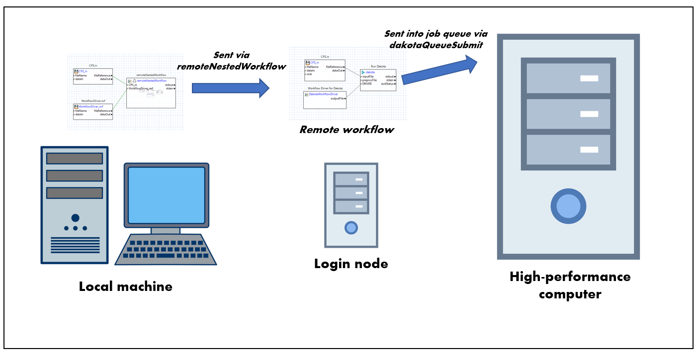

.. _gui-job-submission-workflow:

""""""""""""""""""""""""""""""""""""""""
Job Submission (Using Next-Gen Workflow)
""""""""""""""""""""""""""""""""""""""""

========
Overview
========

In Dakota GUI, the primary means of submitting jobs to remote machines is through Next-Gen Workflow.

Non-queued machines
-------------------

.. figure:: img/JobSubmissionDiagram1.png
   :name: jobsubdiagram:figure01
   :alt: Non-queued job submission
   :width: 1000
   :align: center
   
   Non-queued job submission diagram

For a non-queued remote machine, the basic approach is as follows:
	 
.. figure:: img/JobSubmissionDiagram3.png
   :name: jobsubdiagram:figure02
   :alt: Non-queued job submission with workflows
   :width: 1000
   :align: center
   
   Non-queued job submission diagram, with workflows

1. Create a workflow that will be run locally on your machine, and will include a **remoteNestedWorkflow** node, which sends a second workflow to the remote machine.
   The remoteNestedWorkflow node will include configuration for how to connect to the remote machine (the machine name, credentials, etc.)
2. Create a second workflow that will be run on the remote machine. This workflow should perform whatever computation steps are core to your simulation.
   (In the diagram above, the remote workflow is running Dakota with an NGW analysis driver, so this results in a third workflow, which must also be sent to the remote machine,
   but this third workflow is not a prerequisite for a functioning remote workflow.)
3. Finally, run the first workflow on your local machine.

For data collection, you should augment the second workflow to send data back to the first. Refer to the main :ref:`remoteNestedWorkflow <gui-job-submission-workflow-remoteNestedWorkflow>` section below for more details on how to do this.

Queued machines
---------------

.. figure:: img/JobSubmissionDiagram2.png
   :name: jobsubdiagram:figure03
   :alt: Queued job submission with workflows
   :width: 1000
   :align: center

   Queued job submission diagram

The approach for submitting to a queued remote machine is somewhat more involved. In the case of queued remote machines, the secondary workflow sent off by the remoteNestedWorkflow node
will arrive at a staging area called **the login node.** This is not the appropriate place to perform the job, especially if the job requires heavy-duty computation. This secondary workflow
sitting on the login node must itself be smart enough to submit work into a **job queue.** The work submitted to the job queue will wait in line with other jobs waiting to use that machine.
Once it is your job's turn, the actual work will be performed, after which the results can be transferred back to your local machine for review.

The overall task is further complicated by the fact that queue submission is typically script-based, which means that the job itself must be governed by a series of shell scripts (instead
of an NGW workflow), so you must be moderately comfortable reading and writing scripts to do queued job submission. However, we have developed a special node called **dakotaQueueSubmit**, 
designed to make this step easier.

   Queued job submission diagram, with workflows

To summarize, the basic approach for a queued remote machine is as follows:

1. Create a workflow that will be run locally on your machine, and will include a **remoteNestedWorkflow** node, which sends a second workflow to the queued machine's login node.
   The remoteNestedWorkflow node will include configuration for how to connect to the remote machine login node (the machine name, credentials, etc.)
2. Create a second workflow that will be run on the login node of the queued machine, and will include a **dakotaQueueSubmit** node. The dakotaQueueSubmit will prepare scripts that will
   be executed once in the job queue.

For data collection, you should augment the second workflow to send data back to the first. Refer to the main :ref:`remoteNestedWorkflow <gui-job-submission-workflow-remoteNestedWorkflow>` / :ref:`dakotaQueueSubmit <gui-job-submission-workflow-dakotaQueueSubmit>` sections below for documentation
on how to do this.

====================
Job Submission Nodes
====================

.. _gui-job-submission-workflow-remoteNestedWorkflow:

The remoteNestedWorkflow node
-----------------------------

.. note::

   You may also wish to consult `the official NGW node documentation site <https://dart.sandia.gov/ngw/reference/nodes/components/remoteNestedWorkflow.html>`__ to learn more about the remoteNestedWorkflow node.

.. figure:: img/JobSubmission_NGW_1.png
   :name: jobsubnodes:figure01
   :alt: The remoteNestedWorkflow node
   :align: center

   The remoteNestedWorkflow node

The remoteNestedWorkflow node is the cornerstone of job submission capabilities in Next-Gen Workflow. Its primary purpose is to transfer sub-workflows (or "nested workflows")
to remote machines, and execute them there.

Its relevant properties are as follows:

- **fileName** The name of the local workflow to transfer to the remote machine
- **hostname** The hostname for the remote machine.
- **username** Your username to log in to the remote machine.

  .. warning::
  
     Login credentials for the remote machine must have already been previously configured. For example, you will not recieve an opportunity to type in your password
     once the workflow has begun executing. Refer to Window > Preferences > Connection & Login Preferences to set your login credentials.
	 
- **remotePath** The working directory on the remote machine.
- **clearRemoteWorkdir** Check this box to clean the remote working directory before remote workflow execution.
- **wflib** The path to Next-Gen Workflow's installation on the remote machine.

  .. warning::

     A presupposition of the remoteNestedWorkflow node is that the server/headless version of Next-Gen Workflow is already installed and available on the remote machine. Talk
     to your system administrator to ensure that Next-Gen Workflow has already been installed on whatever machine you will be submitting your workflow to.
	 
- **Other files/directories** A comma-separated list of files and folders that also need to be sent to the remote machine. However, the preferred way to send additional files
  is via additional input ports (see below).
  
.. _gui-job-submission-workflow-remoteNestedWorkflow-sendfiles:

If you need to send additional files from your local machine to the remote machine, simply create new input ports on the remoteNestedWorkflow node and connect the "fileReference" output ports
of your file node to the new input port, like so:

.. figure:: img/JobSubmission_NGW_Example1_1.png
   :name: jobsubnodes:figure02
   :alt: An example workflow with a remoteNestedWorkflow node and "Copy file to target" file transfer behavior
   :align: center

   An example workflow with a remoteNestedWorkflow node and "Copy file to target" file transfer behavior

Note that the connections between the file nodes and the remoteNestedWorkflow node are green. Green lines denote that the File Transfer Behavior of the connection is set to "Copy file to target,"
since the file must be moved from the local machine to the remote machine.

.. figure:: img/JobSubmission_NGW_4.png
   :name: jobsubnodes:figure03
   :alt: Green lines designate "Copy file to target" behavior
   :align: center

   Green lines designate "Copy file to target" behavior

.. _gui-job-submission-workflow-remoteNestedWorkflow-receivefiles:

To send remote files back to the local machine after the remoteNestedWorkflow has completed execuion, you will need to create output ports for each file or folder you want to bring back.

Right-click the remoteNestedWorkflow node and choose "Grab Output File" from the context menu. You will be presented with the following dialog:

.. figure:: img/JobSubmission_NGW_3.png
   :name: jobsubnodes:figure04
   :alt: "Grab Output File" dialog
   :align: center

   "Grab Output File" dialog
	 
This dialog will allow you to specify the name of the file as well as the name of the remote file (relative to the working directory of remoteNestedWorkflow).

After setting output ports on your remoteNestedWorkflow node, you can do whatever you wish with the returned files.

.. figure:: img/JobSubmission_NGW_2.png
   :name: jobsubnodes:figure05
   :alt: An example of returning files to your local machine
   :align: center

   An example of returning files to your local machine
	 
.. note::

   For file-grabbing behavior, you can specify a wildcard pattern for the file/folder to be grabbed. This will cause NGW to grab every file/folder on the remote machine that matches the wildcard pattern.

.. _gui-job-submission-workflow-dakotaQueueSubmit:

The dakotaQueueSubmit node
--------------------------

TODO

========
Examples
========

.. _gui-job-submission-workflow-example1:

Example 1: NGW+Dakota on a Non-Queued Remote Machine
----------------------------------------------------

For this example, we will be building the set of workflows shown below:

.. figure:: img/JobSubmissionDiagram3.png
   :name: jobsubexample1:figure01
   :alt: Non-queued machine job submission example
   :align: center

   Non-queued machine job submission example

You will need access to at least one remote machine to build this example. You will also need a run-ready Dakota analysis driver. We recommend WorkflowDriver.iwf, available in the example repository.

**Step 1.** Construct the local workflow, which will consist of two file nodes and one remoteNestedWorkflow. Call the workflow something like LocalWorkflow.iwf.

.. figure:: img/JobSubmissionDiagram3.png
   :name: jobsubexample1:figure02
   :alt: LocalWorkflow.iwf
   :align: center

   LocalWorkflow.iwf

The two file nodes will be your Dakota file (CPS.in in :numref:`jobsubexample1:figure02`) and your Dakota analysis driver (WorkflowDriver.iwf in :numref:`jobsubexample1:figure02`).

**Step 2.** Create two input ports for remoteNestedWorkflow, and pass the fileReference output port of each file node into the respective input port.

**Step 3.** Click on each connection line and, in the Settings view, set the "File Transfer Behavior" to "Copy file to target." Each connection line should turn green.

**Step 4.** Create your remote nested workflow on your local machine. Call it something like RemoteWorkflow.iwf.

.. figure:: img/JobSubmission_NGW_Example1_2.png
   :name: jobsubexample1:figure03
   :alt: RemoteWorkflow.iwf
   :align: center

   RemoteWorkflow.iwf
	 
As you can see in :numref:`jobsubexample1:figure03` above, the remote workflow is responsible for starting Dakota. The Dakota node will receive the CPS.in file node (sent from your local machine), and the output from a
dakotaWorkflowDriver node (which itself uses the WorkflowDriver.iwf file, also sent from your local machine).

**Step 5.** Back in the first workflow (LocalWorkflow.iwf), click on the remoteNestedWorkflow to open its properties in the Settings view, and set the "fileName" field to "RemoteWorkflow.iwf".
Also, set all relevant information about the remote machine required to log into it (the name of the machine, your username, etc.)

**Step 6.** Run LocalWorkflow.iwf.

That's it! As a follow-up exercise, try retrieving Dakota's output files by adding output ports to the remoteNestedWorkflow, using the approach described :ref:`here <gui-job-submission-workflow-remoteNestedWorkflow-receivefiles>`.

.. _gui-job-submission-workflow-example2:

Example 2: NGW+Dakota on a Queued Machine
-----------------------------------------

For this example, we will be building the set of workflows / scripts shown below:

You will need access to at least one remote machine with a job queue to build this example.

TODO