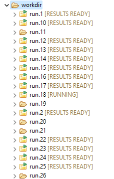
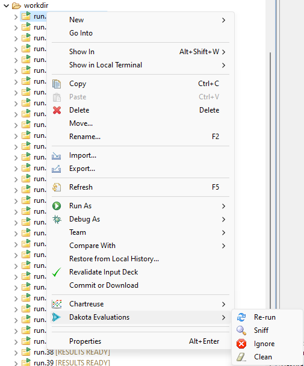

.. _gui-rerun-evals:

""""""""""""""""""""""""""""""""""""""""
Inspecting Individual Dakota Evaluations
""""""""""""""""""""""""""""""""""""""""

After your Dakota run has finished, you may wish to inspect the results of each individual evaluation before doing anything with the results data.
This is especially true if you are working with a finnicky analysis driver, and the possibility exists that one or more evaluations might fail and
need to be re-run.

=======================================================================
A quick detour to talk about lazy drivers (and why you should use them)
=======================================================================

The Dakota GUI provides a special type of analysis driver called a **lazy driver**, which knows how to decouple each
individual evaluation run from Dakota, and yet enable Dakota to resume at a later time to collect results. You can read more about lazy drivers
and how to generate one on the :ref:`New Lazy Driver wizard tutorial <wizards-newlazydriver-main>` page.

Shown below is a Dakota working directory midway through generating evaluation results:

   
**Without a lazy driver, you will not see the folder decorations or the bracketed text to the right of each folder, indicating each status.**

While Dakota is running, you will see one of the following statuses next to each evaluation directory:

- [RUNNING] : Indicates that the driver is still running in this evaluation directory
- [RESULTS READY] : Indicates that the driver has finished, but Dakota needs to be started a second time in order to collect the results out of each directory
- [SUCCESSFUL] : Indicates that the driver has finished and Dakota has collected the results
- [FAILED] : Indicates that the driver failed to generate results
- [IGNORED] : Indicates that the user has manually elected to ignore this evaluation directory (see below for more information)

The typical workflow for a Dakota study with a lazy driver is as follows:

1. Run Dakota using a :ref:`standard run configurations <gui-run-configurations-eclipse-run-configs>`.
2. Wait for all evaluation results in the working directory to reach a status of [RESULTS READY].
3. Run Dakota a second time, using the same run configuration.
4. Wait for all evaluation results in the working directory to reach a status of [SUCCESSFUL]. This indicates that the results have been collected by Dakota and added
   to its tabular data file and/or its HDF5 results file.
   
===============================
Dakota Evaluations context menu
===============================

For a Dakota study which has been set up to use a lazy driver, you can navigate into the working directory, right-click on any evaluation folder, and use the
"Dakota Evaluations" context menu:

   
There are several useful options on this menu that are worth going into detail on:

Re-run
""""""

This is by far the most useful option on the context menu. Like the name implies, "Re-run" will re-run Dakota, but will only re-run it for one evaluation. (Technically, Dakota
will re-run all of its evaluations, but it will hold the results of other directories steady and only re-evaluate the currently selected directory). This option can also be
used in batch if you select more than one evaluation.

Sniff
"""""

"Sniff" will show you the input parameters and output results of this individual evaluation in a pop-up dialog. This can save you some time spent digging through logs and result files
and give you a high-level view of what happened on this evaluation. This option can NOT be used in batch.

Ignore
""""""

Selecting "Ignore" will allow you to manually tell Dakota to NOT re-run this evaluation on subsequent re-runs. This can be useful if the input data to a single evaluation results in
undesirable behavior from the analysis driver, yet it is too expensive to re-run the evaluation, or too expensive to provide a new set of input parameters and regenerate the
other evaluations. This option can be used in batch.

Clean
"""""

Selecting "Clean" will delete all of the status metadata in the individual evaluation directory. This option can be useful if the GUI's view into the evaluation directory has gotten
into a bad state and needs to be wiped out. Note that files related to the driver itself are not deleted, and so the ultimate behavior of the driver may be dependent on what it finds
in this directory when you later select the "Re-run" option for this evaluation, or re-run the entire study. If you wish to start from a blank slate, it is often better to manually
delete the contents of the evaluation directory yourself. This option can be used in batch.