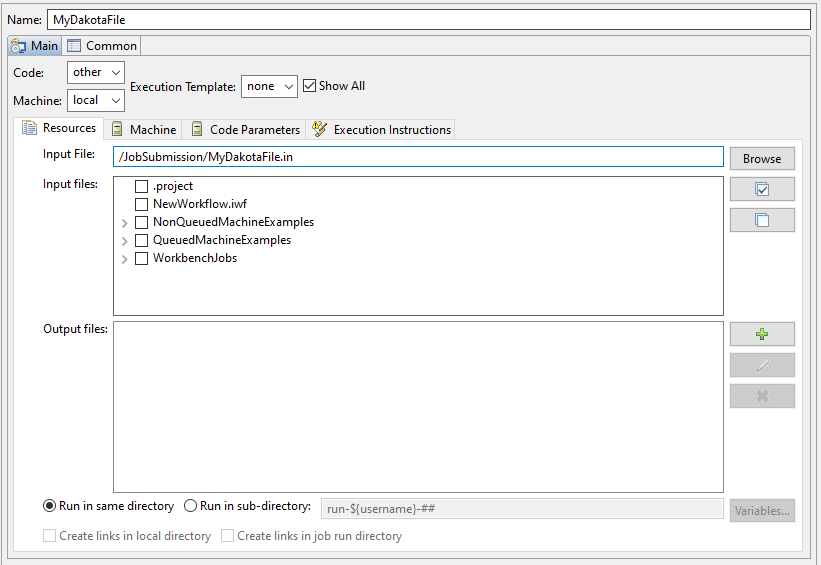
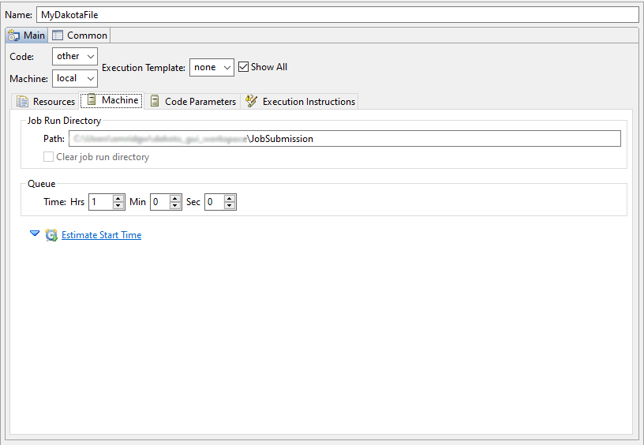
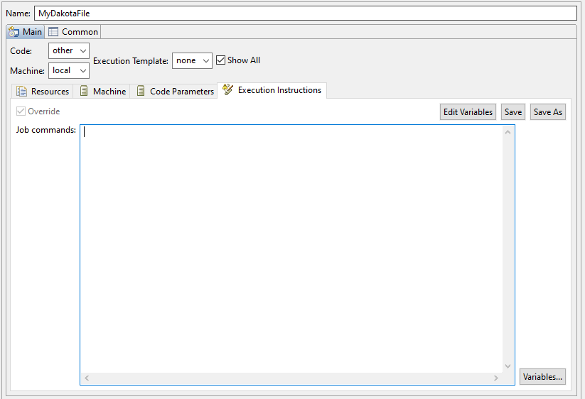
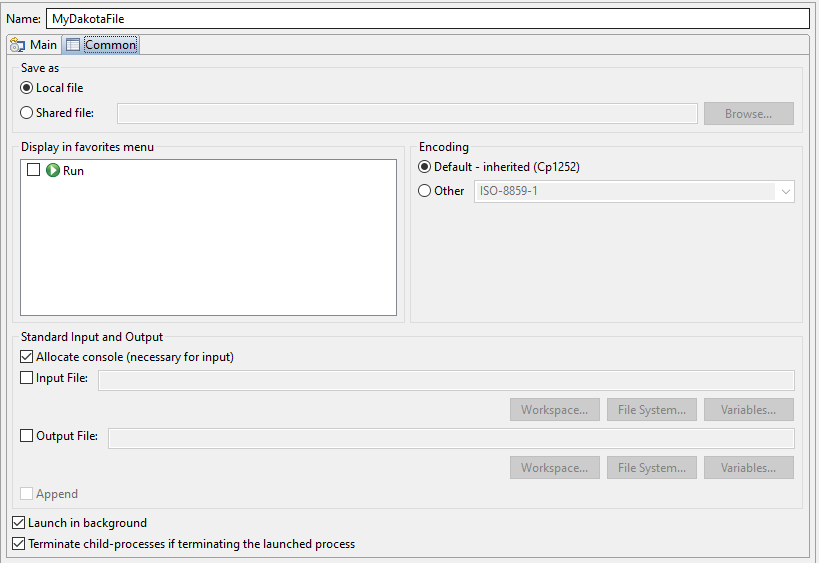
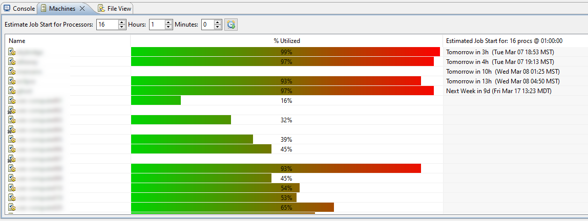

.. _gui-job-submission-classic:

"""""""""""""""""""""""""""""""""""""""""
Job Submission (Run Configuration Option)
"""""""""""""""""""""""""""""""""""""""""

The Job Submission run configuration is a highly flexible method for submitting jobs to remote machines via the Eclipse run configuration dialog. It allows you to specify lists
of files to send to the remote machine and retrieve from the remote machine, define startup scripts that will run on the remote machine, save execution templates of your work,
and much more.

.. note::

   The Job Submission run configuration - while useful - can be somewhat overwhelming to set up, as well as ultimately limiting for what it enables you to do on remote machines.
   Please consider using the :ref:`remoteNestedWorkflow node in Next-Gen Workflow <gui-job-submission-workflow>` to achieve the same result, as well as use NGW-based workflows
   on remote machines.

=====================
Configuration Options
=====================

--------
Main Tab
--------

TODO

Resources Sub-Tab
-----------------

   Resources sub-tab of Job Submission run configuration

TODO

Machine Sub-Tab
---------------

   Machine sub-tab of Job Submission run configuration

TODO

Code Parameters Sub-Tab
-----------------------

TODO

Execution Instructions Sub-Tab
------------------------------

   Execution Instructions sub-tab of Job Submission run configuration

TODO

----------
Common Tab
----------

   Common tab of Job Submission run configuration

TODO

====================
Submission Templates
====================

TODO

==========================
Job Diagnostic Information
==========================

---------------
Job Status View
---------------

-------------
Machines View
-------------

   The Machines view
   
If you would like to peek at the load on each remote machine on your network, you may do so using the Machines view (go to "Window >
Show View > Distributed File Management > Machines" to dock it in your workspace if it is not already available).

The Machines view will give you an estimated wait time to use the machine, as well as the amount of the machine's resources currently
being utilized by other jobs (represented by the green-to-red bar).

.. note::

   Depending on your distribution of Dakota GUI, there may be no machine definitions preconfigured for you. You can create your own
   machine definitions in "Window > Preferences > Machines."

----------------------
Remote File Inspection
----------------------

Dakota GUI gives you terminal access to each remote machine that it knows about. Terminal access can be a useful, ad-hoc way to quickly
inspect files on a remote machine without sending them back to your local machine.

To start a terminal on a remote machine, simply right-click the machine in question in the Machines view (described in the previous
section), and click "Open Terminal."

========
Examples
========

---------------------------------------------------------------------------
Example 1: Job Submission to a Non-Queued Machine with a Basic Dakota Study
---------------------------------------------------------------------------

**Job commands:**

.. code-block::

    #!/bin/sh

    cd ${remote.dir} || exit 9

    if [ -f /etc/bashrc ]; then
        source /etc/bashrc
    fi

    export RELATIVE_LOCATION=..
    export PREPROCESSOR=${preprocessor}
    export APREPRO="module load seacas && aprepro"
    export DAKOTA_APPLIC_PROCS=$((${num.processors}/DAKOTA_APPLIC_CONCURRENCY))

    echo "Checking that constraint between number of processors, number of concurrent runs, and number of processors per run is respected..."
    remainder=$((${num.processors}%DAKOTA_APPLIC_CONCURRENCY))
    if [ $remainder -gt 0 ];
    then
        echo "${num.processors} must be a multiple of $DAKOTA_APPLIC_CONCURRENCY"
        echo "Exiting..."
        exit
    fi

    echo "INFO: DAKOTA will manage ${DAKOTA_APPLIC_CONCURRENCY} concurrent application jobs, each running on ${DAKOTA_APPLIC_PROCS} cores, with ${DAKOTA_PPN} processes per node"

    if [ ${clean_subdirectory} -eq 0 ]; then
        num_dirs=`find . -name ${work_subdirectory}.* -type d | wc -l`
        if [ $num_dirs -gt 0 ]; then
          rm -r ${work_subdirectory}.*
        fi
    fi

    module load dakota
    dakota -input ${input.deck.base.name}.in 1>${input.deck.base.name}.out 2>&1

TODO

---------------------------------------------
Example 2: Job Submission to a Queued Machine
---------------------------------------------

**Job commands:**

.. code-block::

   cd ${remote.dir} || exit 9

   if [ -f /etc/bashrc ]; then
       source /etc/bashrc
   fi

   chmod 744 *.sh
   dos2unix *.sh

   echo submitting to the ${queue} queue
   sbatch -N ${num.nodes} --partition=${queue} ${qos} --time=${job.hours}:${job.minutes}:${job.seconds} -A ${account} ${script.name} ${capture.job.id}

**Script contents:**

.. code-block::

    #!/bin/sh

    cd ${remote.dir} || exit 9

    if [ -f /etc/bashrc ]; then
        source /etc/bashrc
    fi

    export RELATIVE_LOCATION=..
    export PREPROCESSOR=${preprocessor}
    export APREPRO="module load seacas && aprepro"
    export DAKOTA_PPN=${ppn} 
    export DAKOTA_APPLIC_CONCURRENCY=${evaluation_concurrency}
    export DAKOTA_APPLIC_PROCS=$((${num.processors}/DAKOTA_APPLIC_CONCURRENCY))

    echo "Checking that constraint between number of processors, number of concurrent runs, and number of processors per run is respected..."
    remainder=$((${num.processors}%DAKOTA_APPLIC_CONCURRENCY))
    if [ $remainder -gt 0 ];
    then
        echo "${num.processors} must be a multiple of $DAKOTA_APPLIC_CONCURRENCY"
        echo "Exiting..."
        exit
    fi

    echo "INFO: DAKOTA will manage ${DAKOTA_APPLIC_CONCURRENCY} concurrent application jobs, each running on ${DAKOTA_APPLIC_PROCS} cores, with ${DAKOTA_PPN} processes per node"

    if [ ${clean_subdirectory} -eq 0 ]; then
        num_dirs=`find . -name ${work_subdirectory}.* -type d | wc -l`
        if [ $num_dirs -gt 0 ]; then
          rm -r ${work_subdirectory}.*
        fi
    fi

    module load dakota
    dakota -input ${input.deck.base.name}.in 1>${input.deck.base.name}.out 2>&1

TODO