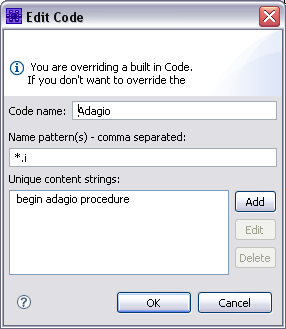
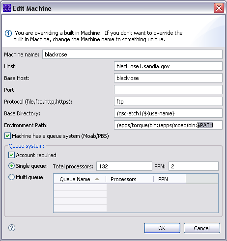
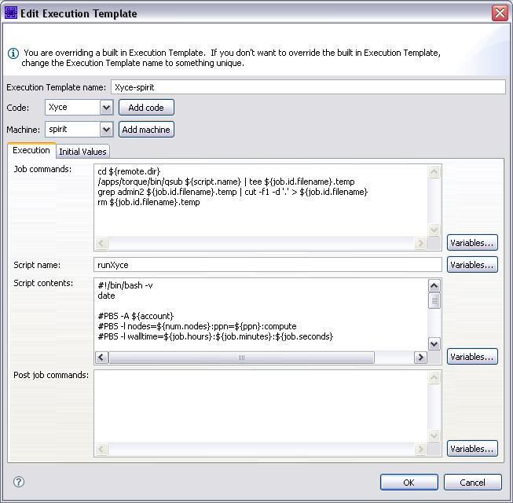

.. _gui-job-submission-classic-creation:

""""""""""""""""""""""""""""""""""""""""""""""""""""""""
Create your own Codes, Machines, and Execution Templates
""""""""""""""""""""""""""""""""""""""""""""""""""""""""

The Job Submission Tool (JMT) allows you to fully customize it, adding your own codes, machines, and execution templates.

.. _gui-job-submission-classic-creation-code:

===================
Creating a New Code
===================

To create a new code: 

1. Select "Window > Preferences" (on Mac, select "Dakota GUI > Preferences"). 
2. Expand and select "Job Submission > Codes" to see a list of codes.

   .. note::
   
      Codes in bold are the built-in or predefined codes.  Those not in bold are your custom codes that are only available to you.    

3. Perform one of the following steps: 

   a. Select the New button. 
   b. If you want to start from one of your existing codes, select a code in the Preferences panel and select the Duplicate button.

4. Edit the code preferences in the Edit Code dialog. These values are used to identify input decks so that the corresponding code can be available in the
   "Submit Job" contextual menu item.  The values you may edit include:
   
   a. The code name.
   b. The name patterns of the primary input file.
   c. Unique content strings that can be used to identify the primary input deck.
   

  
  Edit Code Dialog

.. _gui-job-submission-classic-creation-machine:

======================
Creating a New Machine
======================

To create a new machine: 

1. Select "Window > Preferences" (on Mac, select "Dakota GUI > Preferences"). 
2. Select "Machines" to see a list of machines.

   .. note::
   
      Machines in bold are the built-in or predefined machines. Those not in bold are your custom machines that are only available to you.    

3. Perform one of the following steps: 

   a. Select the New button. 
   b. If you want to start from one of your existing machines, select a machine in the Preferences panel and select the Duplicate button.

4. Edit the machine preferences in the Edit Machine dialog. The values you may edit include:

   a. *Machine name:* The name of the machine.
   b. *Host:* The url to the login node that will be used to submit jobs and do file transfers.
   c. *Base host:* This is used if remote viz capabilities are provided to the machine.  For example, if the login node is "shasta1.sandia.gov", the base host will be "shasta".
      The base host is passed to the corresponding viz script (e.g. ensight2shasta).
   d. *Port:*  Leave blank unless the machine uses another port for sftp.
   e. *Protocol:* This is generally ftp for remote machines and file for your localhost. 
   f. *Base Directory:*  The base scratch directory where you perform simulations (e.g. /scratch1/username).
   g. *Environment Path:*  This specifies the execution environment path for all ssh commands executed on the remote system. You'll likely want to include $PATH somewhere in here to
      get the pre-existing environment path on the system.

  
  Edit Machine Dialog
  
.. _gui-job-submission-classic-exectemplate:

=================================
Creating a New Execution Template
=================================

To create a new execution template: 

1. Select "Window > Preferences" (on Mac, select "Dakota GUI > Preferences"). 
2. Expand and select "Job Submission > Execution Templates" to see a list of execution templates.

   .. note::
   
      Templates in bold are the built-in or predefined execution templates. Those not in bold are your custom templates that are only available to you.    

3. Performone of the following steps: 

   a. Select the New button. 
   b. If you want to start from one of your existing templates, select an execution template in the Preferences panel and select the Duplicate button.

4. Edit the template preferences in the Edit Execution Template dialog. The values you may edit include: 

   a. *Code.*  The code is usually not changed unless you are creating a new execution template. 
   b. *Machine.*  The machine is usually not changed unless you are creating a new execution template. 
   c. *Execution Tab:*

      i. *Commands to execute.* These are the commands you would type in an interactive terminal window to submit a job. If you are overriding these commands, or creating your own template,
         in order to monitor job status in the Job Status View, and have the post-processing commands run and have files returned when the job is complete, you must capture the job ID
         returned by the quing system from the submit call. This ID must be just the number. The ID must be writen in a file named with the ``${job.id.filename}`` variable inside the remote working directory.
         Examples of how do do this can be found in any of the built-in execution templates. You'll note that the examples use the ``tee`` command in order to allow the console output from the submit
         command to still come through the console that gets displayed in Dakota GUI when running a job.
      ii. *Script Name.* Most jobs are submitted to the remote host's queuing systems (such as Slurm). This is the name of the script that will be created and submitted in the "Commands to Execute" field.
      iii. *Script contents.* The contents of the script that will be submitted by the job submission system.
      iv. *Post job commands.* The commands that should be executed when the job is completed. This may include steps such as concatenating results files, or running a post-processing tool
          (e.g. matlab)to generate another results file. These commands are executed within a shell script.

   d. *Initial Values:* 
      
      i. *Output files.* You can specify the file names or patterns (e.g. \*.e) to be returned when the job is complete.

  
  Edit Execution Template Dialog 