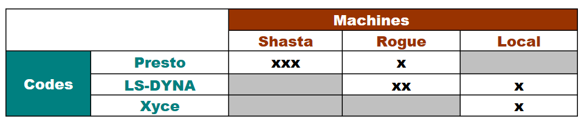

.. _gui-job-submission-classic:

"""""""""""""""""""""""""""""""""""""""""""""
Job Submission (Classic Job Management Tools)
"""""""""""""""""""""""""""""""""""""""""""""

.. note::

   The following sections are a paraphrase of documentation written for the Sandia Analysis Workbench tool, which features similar job submission capabilities.

The job submission tools shipped with Dakota GUI (collectively referred to as the Job Management Tool, or JMT) simplifies the task of submitting simulations to remote computing platforms.
The JMT consists of two parts: **a job submission system** and a **job monitoring system**.

- The job submission system is an automated workflow that performs the tasks of pushing a set of files
  to a selected platform, running a set of instructions, and pulling back results files. The tool is script-based, allowing you to construct scripts to submit jobs on any remote compute 
  platform. For your convenience, the tool is populated with built-in scripts (called execution templates) to run a number of commercial simulation codes on remote clusters. 
- The job monitoring system keeps track of the jobs you have submitted, and allows you to kill jobs, and directly access the remote files associated with the jobs. 

.. warning::

   The Job Submission run configuration - while useful - can be somewhat overwhelming to set up, as well as ultimately limiting for what it enables you to do on remote machines.
   Please consider using the :ref:`remoteNestedWorkflow node in Next-Gen Workflow <gui-job-submission-workflow>` to achieve the same result, as well as to rely on NGW-based workflows
   and enjoy the associated conveniences.

The basic elements of the JMT are **codes**, **machines**, and **execution templates**.  The relationship of these three elements is illustrated in :numref:`jmtcomponents:figure01`. 

 - Codes, as the name implies, are simply executables, usually simulation codes like Presto, Calore, Xyce, or a commercial code like LS-DYNA. In the context of Dakota GUI job submission, we consider Dakota itself to be an executable code.  
 - Machines are compute platforms where codes are executed.  
 - Execution templates are the specific instruction for executing a given code on a given platform.  This includes the script contents and its name, instructions to initiate the job,
   and instructions to execute after the job completes. All are variablizable.

If viewed in a matrix of codes vs. machines, execution template coverage can be represented by an x in the matrix.  As the table illustrates, a code/platform combination may have multiple execution templates.
One reason for doing this might be to run multiple versions of a code.

   Code vs. Machines Matrix 

.. toctree::
   :maxdepth: 1
   
   JobSubmissionClassicUsage
   JobSubmissionClassicModification
   JobSubmissionClassicCreation
   JobSubmissionClassicExamples
