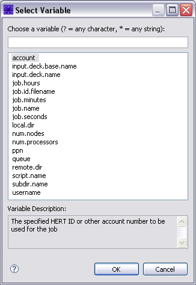
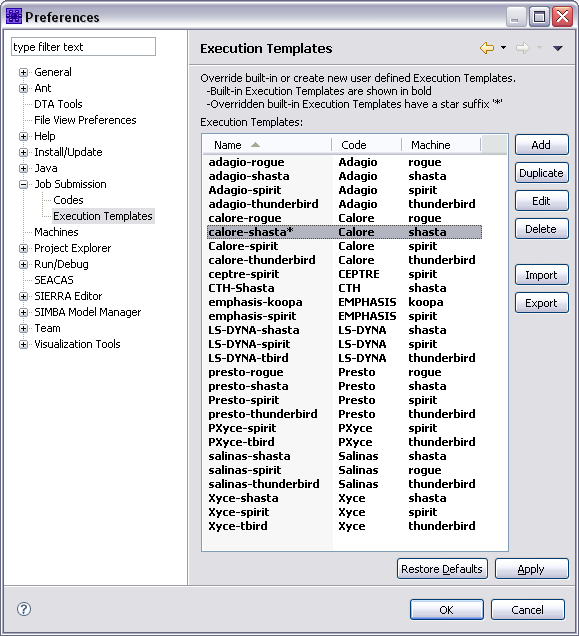

.. _gui-job-submission-classic-modification:

"""""""""""""""""""""""""""""""
Modifying an Execution Template
"""""""""""""""""""""""""""""""

An execution template is a set of instructions for processing particular job workflows.  The execution template determines:

- The machine that the job will run on. 
- The execution instructions to be run, including interactive commands and batch script contents. 
- The files (or file pattern) to be returned at the end of the job.

An execution template can be modified by the user to customize it to their needs. For example, the user can alter the execution template to bring back a different set of
results files, or they can change the template's core execution script to point to a different executable of the target code. 

There are two ways to modify an execution template:

- Modify the template :ref:`from the job submission dialog <gui-job-submission-classic-modification-jobsubmissiondialog>`. This method should be used if you are only making *ad hoc* changes for a particular job. 
- Modify the template :ref:`from the system preferences <gui-job-submission-classic-modification-sysprefs>`.  This method should be used if you want to change the default behaviors of a
  template for all subsequent job submissions using that template. 

.. _gui-job-submission-classic-modification-jobsubmissiondialog:

==============================================================
Modifying an Execution Template from the Job Submission Dialog
==============================================================

When modifying an execution template from within the job submission dialog, you can override the default settings of an execution template for a given job instance.
For example, you can change the template script to point to a different executable. This does not permanently alter the execution template - only the job instance.
All subsequent submissions using the template will revert to the default settings of the template. 

To override an execution template in the job submission dialog: 

1. Right-click an input file and select "Submit Job > Code", where "Code" will be the corresponding simulation code.
   
   .. note::
   
      If there is no corresponding code, the only option will be "Submit Job > other". 

2. Select an execution template from the list box (this is to the right of the Machine and Code list boxes).  This will load an execution template, setting the other fields
   such as Output Files, Machine, Queue, Number of Processors, the Execution Commands, and Execution Script. 
3. Making changes to any of the job submission fields will override the default settings of this execution template.  You can make changes to the following: 

   a. *Resources Tab:*

      i. *Output Files.* These are the names (or name paterns such as \*.e) of files that will be returned when the job is complete.
   
   b. *Machine Tab:* 

      i. *Queue.* If the selected machine has multiple queues, you select the desired queue here.
      ii. *Remote directory.* By default, the remote directory mirrors the path in your workspace to your input deck prepended by the base directory defined for the specified machine.
          If the "Run in subdirectory" option is enabled, the ``${subdir.name}`` variable is appended to the remote path.
      iii. *Clear remote directory.* This option is selected if you want the remote directory to be clearedbefore the job is started.

           .. note::
           
              If you do not check this option, only files that have been changed will be moved to the remote working directory.
              
      iv. *Number of processors.*
      v. *Job time.* Job time is specified in hours, minutes and seconds.
      vi. *Account.* If the selected machine is defined to require account information, you will beprompted to enter it with a message at the top of the dialog. All previously entered
          accounts will be available in the drop down selector, and the most recently used account will be selected by default.

      .. figure:: img/submitDialogMachine.png
         :name: jmtmodify:figure01
         :alt: The Machine Tab of the Job Submission Dialog 
         :align: center

         The Machine Tab of the Job Submission Dialog 

   c. *Execution Instructions Tab*

      i. *Commands to execute.* These are the commands you would type in an interactive terminal window to submit a job. If you are overriding these commands, or creating your own template,
         in order to monitor job status in the Job Status View, and have the post-processing commands run and have files returned when the job is complete, you must capture the job ID returned by the
         queueing system from the submit call. This ID must be just the number. The ID must be writen in a file named with the ``${job.id.filename}`` variable inside the remote working directory. Examples
         of how to do this can be found in any of the built-in execution templates.
         
         .. note::
         
            You'll note that the examples use the ``tee`` command in order to allow the console output from the submit command to still come through the console that gets displayed in the Dakota GUI's console
            when running a job.
            
      ii. *Script Name.* Most jobs are submitted to the remote host's queueing systems (such as Slurm). This is the name of the script that will be created and submitted in the "Commands to Execute" field.
      iii. *Script contents.* The contents of the script that will be submitted by the job submission system.
      iv. *Post job commands.* The commands that should be executed when the job is completed. This may include steps such as concatenating results files, or running a post-processing tool (e.g. matlab)
          to generate another results file. These commands are executed within a shell script.

      .. figure:: img/submitDialogExecute.png
         :name: jmtmodify:figure02
         :alt: Execution Tab of the Job Submission Dialog 
         :align: center

         Execution Tab of the Job Submission Dialog 

.. _gui-job-submission-classic-modification-sysprefs:

===========================================================
Modifying an Execution Template from the System Preferences
===========================================================

Modifying the execution template in the Preferences dialog will change the template for all subsequent job submissions. To do so:

1. Select "Window > Preferences" (on Mac, select "Dakota GUI > Preferences"). 
2. Expand and select "Job Submission > Execution Templates" to see a list of execution templates.

   .. note::
      
      Templates in bold are the built-in execution templates.  Those not in bold are your custom templates that are only available to you.

   .. figure:: img/ExecPrefs.png
      :name: jmtmodify:figure03
      :alt: Job Submission Execution Template Preferences Page 
      :align: center

      Job Submission Execution Template Preferences Page 

3. Select the template you would like to edit and select the Edit button.  This will open the execution template edit dialog (shown below).

   .. figure:: img/ExecEdit.png
      :name: jmtmodify:figure04
      :alt: Edit Execution Template Dialog 
      :align: center

      Edit Execution Template Dialog 

4. Changes can be made to the following: 

   a. *Code.*  The code is usually not changed, unless you are creating a new execution template. 
   b. *Machine.*  The machine is usually not changed, unless you are creating a new execution template. 
   c. *Execution Tab:* 
   
      i. *Commands to execute.* These are the commands you would type in an interactive terminal window to submit a job. If you are overriding these commands, or creating your own template, in order to monitor job
         status in the Job Status View, and have the post-processing commands run and have files returned when the job is complete, you must capture the job ID returned by the queueing system from the submit call. This
         ID must be just the number. The ID must be writen in a file named with the ``${job.id.filename}`` variable inside the remote working directory. Examples of how do do this can be found in any of the built-in
         execution templates. You'll note that the examples use the ``tee`` command in order to allow the console output from the submit command to still come through the console that gets displayed in Dakota GUI when running a job.
      ii. *Script Name.* Most jobs are submitted to the remote host's queueing systems (such as Slurm). This is the name of the script that will be created and submitted in the "Commands to Execute" field.
      iii. *Script contents.* The contents of the script that will be submitted by the job submission system.
      iv. *Post job commands.* The commands that should be executed when the job is completed. This may include steps such as concatenating results files, or running a post-processing tool (e.g. matlab)
          to generate another results file. These commands are executed within a shell script.
   
   d. *Initial Values:*
   
      i. *Output files.* You can specify the file names or patterns (e.g. \*.e) to be returned when the job is complete.

======================================
Using Variables in Execution Templates
======================================

Execution templates may contain a number of variables expressed with the syntax ``${variable_name}``, where variable_name is the name of the variable. When creating or modifying templates,
you have several variables available to you to add to the script.   

If variables may be used in a text field, you will see a Variables button to the right of that field.  To use a variable, select the Variables button and you will be presented with a list.
Selecting a variable will provide a description of what the variable is.  Select the OK button to use that variable in the corresponding text field.  Alternatively, if you know the name of the
variable you want to use you can simply type it in the text field. 

  Variables Dialog  

=========================================================================
Restoring Defaults of Predefined Codes, Machines, and Execution Templates
=========================================================================

If you have modified one of the predefined codes, machines, or execution templates, the item will have a \* suffix appended to it.   

To restore the template to the default values, select it and then select the Restore Defaults button.  The \* suffix will be removed. 

  Execution Templates List Showing a Modified Template 