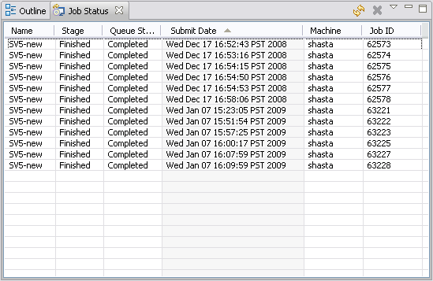
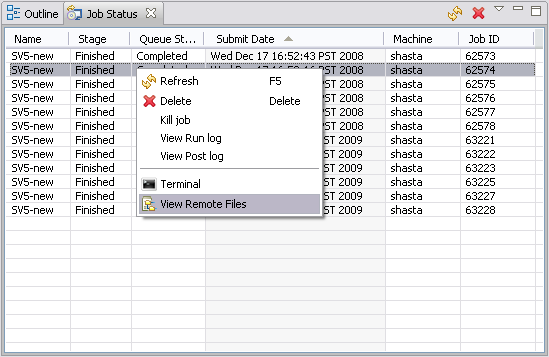
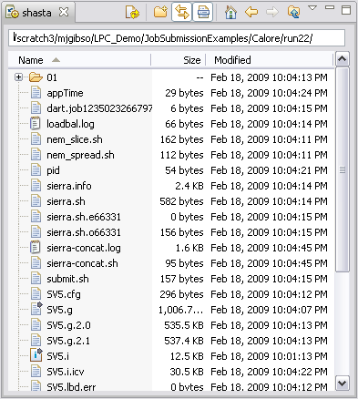
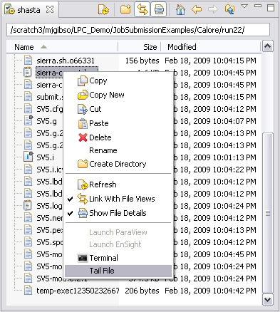
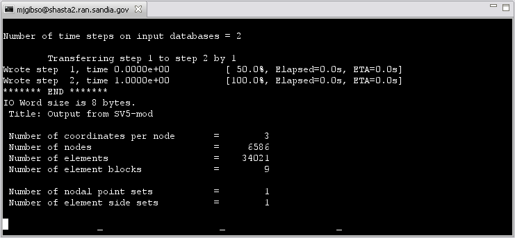

.. _gui-job-submission-classic-usage:

""""""""""""""""""""""""""""""
Using the Job Submission Tools
""""""""""""""""""""""""""""""

This is the most basic interaction you will have with the job submission tool. In this mode you will:

- Submit jobs for any of the predefined codes, machines, and execution templates.
- Monitor the progress of running jobs.
- Access remote files for visualizing results.

.. note::

   If you are using the Dakota GUI outside of Sandia, you will most likely not have any machines defined, and you will have access
   to only one code, "DAKOTA." In this situation, you will need to begin by :ref:`creating machine definitions <gui-job-submission-classic-creation-machine>`
   and, optionally, :ref:`execution templates <gui-job-submission-classic-exectemplate>`. You may also wish to define additional :ref:`code definitions <gui-job-submission-classic-creation-code>`
   if you want to perform job submission with a code other than Dakota.

================
Submitting a Job
================

To submit a job:

1. Right-click the primary input file in the Project Explorer (or from an editor opened on the file) and select "Run As > Run Job Submission." 

   .. figure:: img/contextSubmit.png
      :name: jmtusage:figure01
      :alt: Submitting a Job from the Project Navigator 
      :align: center
      :width: 600

      Submitting a Job from the Project Navigator 
	  
   .. figure:: img/submitDialog.png
      :name: jmtusage:figure02
      :alt: Job Submission Dialog 
      :align: center

      Job Submission Dialog 

2. Select the Machine you want to submit to.
3. Select the execution template you want to run.
4. Select the Input Files that you want submitted as part of the job.
5. Edit the Output Files list to define what files you want to return when the simulation is complete.  The output files will be returned to the same directory location as the input files.
6. Select whether you want to run out of the same directory where the input deck resides, or if you want to submit the job staged out of a subdirectory. You can specify the name of the
   subdirectory and use the # character to denote the run number. A directory will be automatically created with the lowest number that doesn't already exist on your local system.
   You can specify multiple # characters to pad the number with leading zeros. For example, if you specify a subdirectory of "run###", and this is your 4th run, a directory with the name "run004"
   will be created.
   
   .. note::
   
      The default behavior of this functionality for newly created Job Submission launch configurations can be specified in the preferences on the Job Submission page.
   
7. Select the Machine tab to edit machine parameters, including:

   a. *Queue.* If the selected machine has multiple queues, you select the desired queue here.
   b. *Remote directory.* By default, the remote directory mirrors the path in your workspace toyour input deck prepended by the base directory defined for the specified machine. If the
      "run in subdirectory" option is enabled, the subdir.name variable is appended to the remote path.
   c. *Clear remote directory.* This option is selected if you want the remote directory to becleared before the job is started. Note: If you do not check this option, only files
      that have been changed will be moved to the remote working directory.
   d. *Number of processors.*
   e. *Job time.* Job time is specified in hours, minutes and seconds.
   f. *Account.* If the selected machine is defined to require account information, you will beprompted to enter it with a message at the top of the dialog. All previously entered accounts
      will be available in the drop down selector, and the most recently used account will be selected by default.

   .. figure:: img/submitDialogMachine.png
      :name: jmtusage:figure03
      :alt: The Machine Tab of the Job Submission Dialog 
      :align: center

      The Machine Tab of the Job Submission Dialog 
	  
8. Select the Run button.

=====================
Monitoring Job Status
=====================

Once a job is submitted, you can view the status in the Job Status view.  To open the Job Status view, select "Window > Show View > Job Status."  The Job Status view displays a complete list of
jobs that you submitted, showing the job submit time, the host machine, the job id, the stage of the job, and the queue state.

   The Job Status View

======================
Accessing Remote Files
======================

The job management tool is designed to automate the entire job submission process, automatically moving required files to the remote system and returning the results to your desktop.  As such, the
user does not have to directly interact with the remote system.  In some cases, the user may want to directly access files on the remote system.  For example, if the results files are very large,
the user can opt to not bring them back to the local workspace and instead visualize remotely.  

To access remote files of a submitted job:

1. Right-click any job in the *Job Status* view and select View Remote Files.  This will open a *File View* to the remote system. 
2. The File View allows you to drag and drop files to and from the remote system.  It also allows you to delete files on the remote system.

   Viewing Remote Files of a Job

   File View Initialized to the Job's Remote Directory

=================================
Monitoring Output of Running Jobs
=================================

It is often desirable to tail an output file of a running job in order to monitor its progress.  To do this, perform the following steps:

1. Right-click the job in the *Job Status* view and select *View Remote Files*.
2. In the *File View*, right click any fileand select Tail *(see below)*.  A terminal window will be opened with a ``tail -f`` executed in it, on the selected file.

   Tailing Files on a Remote System 

   Terminal Window Tailing an Output File 